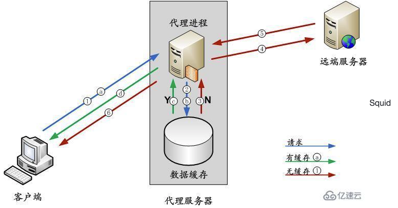
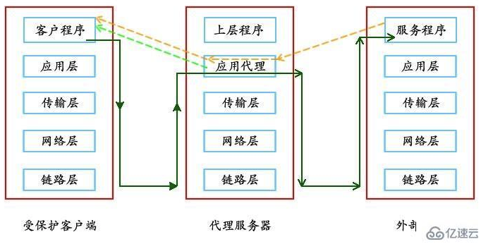
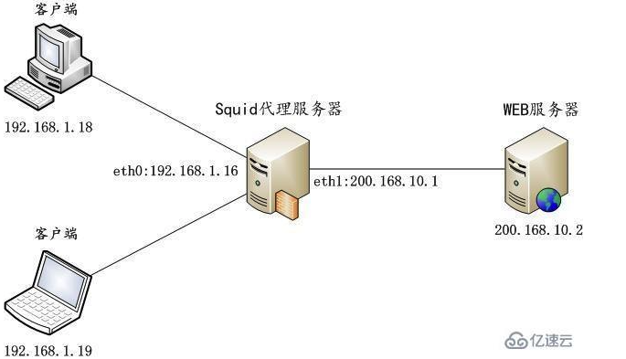
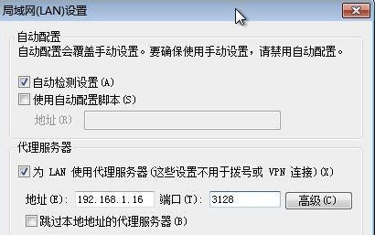
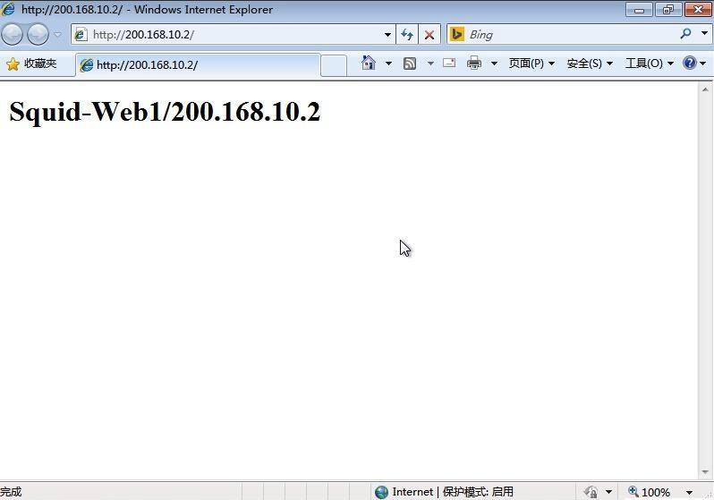
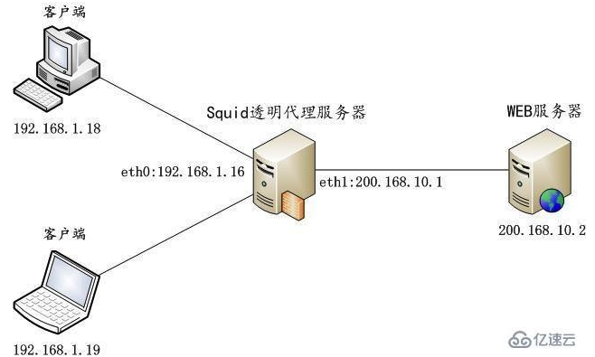
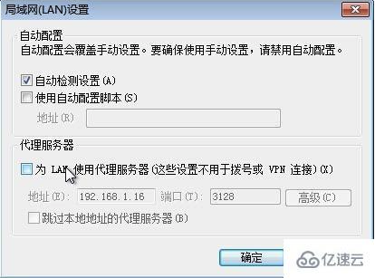
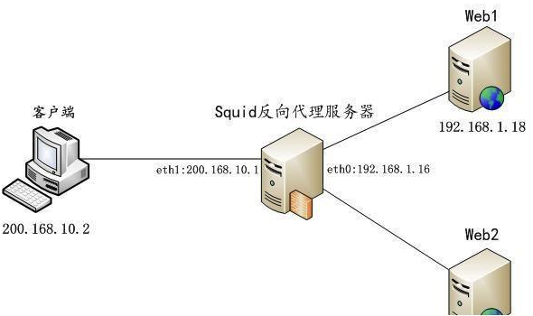
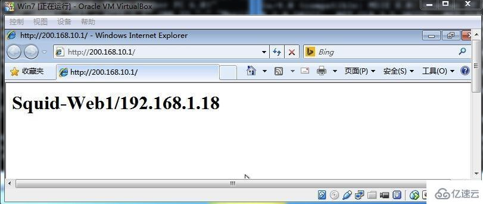
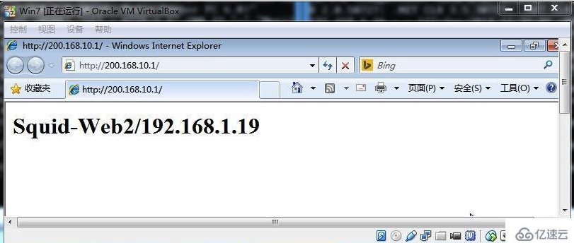

 ## Squid工作原理
- Squid是基于Unix的代理服务器（proxy server），它缓存比起点源点更接近请求者的互联网内容。Squid支持缓存多种不同的网络对象，包括那些通过HTTP和FTP访问的人。缓存频繁要求网页、媒体文件和其它加速回答时间并减少带宽堵塞的内容。

-  Squid工作流程
   - 当代理服务器中有客户端需要的数据时： 
     - a. 客户端向代理服务器发送数据请求； 
     - b. 代理服务器检查自己的数据缓存； 
     - c. 代理服务器在缓存中找到了用户想要的数据，取出数据； 
     - d. 代理服务器将从缓存中取得的数据返回给客户端。

   - 当代理服务器中没有客户端需要的数据时： 
     - 1. 客户端向代理服务器发送数据请求 
     - 2. 代理服务器检查自己的数据缓存
     - 3. 代理服务器在缓存中没有找到用户想要的数据
     - 4. 代理服务器向Internet 上的远端服务器发送数据请求
     - 5. 远端服务器响应，返回相应的数据
     - 6. 代理服务器取得远端服务器的数据，返回给客户端，并保留一份到自己的数据缓存中

    
    - 代理服务器工作在TCP/IP的应用层
    

## Squid 分类
- 按照代理类型的不同，可以将Squid代理分为正向代理和反向代理，正向代理
- 根据实现方式的不同，又可以分为普通代理和透明代理
  - 普通代理：需要客户机在浏览器中指定代理服务器的地址、端口 
  - 透明代理：适用于企业的网关主机（共享接入Internet）中，客户机不需要指定代理服务器地址、端口等信息，代理服务器需要设置防火墙策略将客户机的Web访问数据转交给代理服务程序处理； 
  - 反向代理：是指以代理服务器来接受internet上的连接请求，然后将请求转发给内部网络上的服务器，并将从服务器上得到的结果返回给internet上请求连接的客户端，此时代理服务器对外就表现为一个服务器

## Squid实例演示
#### 实验环境
- 操作系统：Rocky Linux release 8.6 
- Squid版本： squid-4.15-3.module+el8.6.0+842+aea5c28d.x86_64
- 关闭httpd 
- 关闭防火墙

## 安装Squid服务
```shell
#检查squid软件是否安装
rpm -qa|grep squid
#如果未安装，则使用yum 方式安装
yum -y install squid
#设置开机自启动,在3、5级别上自动运行squid服务
chkconfig --level 35 squid on
```

## Squid服务器的配置文件说明
- squid 的主配置文件是 /etc/squid/squid.conf，所有squid的设定都是在这个文件里配置，下面是一些常用的配置选项
```shell
http_port 3128      #设置监听的IP与端口号

cache_mem 64 MB      #额外提供给squid使用的内存，squid的内存总占用为 X * 10+15+“cache_mem”，其中X为squid的cache占用的容量（以GB为单位），
                     #比如下面的cache大小是100M，即0.1GB，则内存总占用为0.1*10+15+64=80M，推荐大小为物理内存的1/3-1/2或更多。
maximum_object_size 4 MB   #设置squid磁盘缓存最大文件，超过4M的文件不保存到硬盘

minimum_object_size 0 KB   #设置squid磁盘缓存最小文件

maximum_object_size_in_memory 4096 KB   #设置squid内存缓存最大文件，超过4M的文件不保存到内存

cache_dir ufs /var/spool/squid 100 16 256  #/定义squid的cache存放路径 、cache目录容量（单位M）、一级缓存目录数量、二级缓存目录数量

logformat combined %>a %ui %un [%tl] "%rm %ru HTTP/%rv" %Hs %h" "%{User-Agent}>h" %Ss:%Sh  #log文件日志格式

access_log /var/log/squid/access.log combined  #log文件存放路径和日志格式

cache_log /var/log/squid/cache.log   #设置缓存日志

logfile_rotate 60   #log轮循 60天

cache_swap_high 95  #cache目录使用量大于95%时，开始清理旧的cache

cache_swap_low 90   #cache目录清理到90%时停止

acl localnet src 192.168.1.0/24  #定义本地网段

http_access allow localnet  #允许本地网段使用

http_access deny all  #拒绝所有

visible_hostname squid.david.dev  #主机名

cache_mgr example@test.com  #管理员邮箱
```

### 普通代理服务
- 即标准的、传统的代理服务，需要客户机在浏览器中指定代理服务器的地址、端口。 实验拓扑图如下：

- 编辑squid 主配置文件/etc/squid/squid.conf
```shell
http_port 3128
cache_mem 64 MB
maximum_object_size 4 MB
cache_dir ufs /var/spool/squid 100 16 256
access_log /var/log/squid/access.log
acl localnet src 192.168.1.0/24
http_access allow localnet
http_access deny all
visible_hostname squid.david.dev
cache_mgr mchina_tang@qq.com
```

- 启动Squid
`systemctl start squid`

- 配置Web 服务器
```shell
#安装Apache
rpm -qa|grep httpd# yum -y install httpd
#启动Apache并加入开机启动
systemctl httpd start# chkconfig httpd on
#创建index.html
echo "Squid-Web1/200.168.10.2" > /var/www/html/index.html
#修改Web服务器IP地址 将web服务器的IP地址修改为200.168.10.2
```

- 配置浏览器代理
  - 打开浏览器（以IE为例，其他类似），菜单栏 -> 工具 -> Internet 选项 -> 连接 -> 局域网设置 -> 代理服务器，按照以下格式设置。
    
  - 测试
   

### 透明代理服务
- 适用于企业的网关主机，客户机不需要指定代理服务器地址、端口等信息，通过iptables将客户机的Web访问数据转交给代理服务程序处理。 实验拓扑图如下：

- 修改squid 主配置文件/etc/squid/squid.conf
```shell
#在http_port 3128 后添加transparent关键字
http_port 3128 transparent
cache_mem 64 MB
maximum_object_size 4 MB
cache_dir ufs /var/spool/squid 100 16 256
access_log /var/log/squid/access.log
acl localnet src 192.168.1.0/24
http_access allow localnet
http_access deny all
visible_hostname squid.david.dev
cache_mgr mchina_tang@qq.com
```

- 重启服务让上面的配置生效
```shell
systemctl restart squid
```

- 添加iptables规则，把内部的http请求重定向到3128端口
```shell
#启动iptables 服务
/etc/init.d/iptables start
#清除现有iptables filter 表规则
iptables -F
#保存iptables 设置
/etc/init.d/iptables save
#在nat表中新增一条规则
iptables -t nat -I PREROUTING -i eth0 -s 192.168.1.0/24 -p tcp --dport 80 -j REDIRECT --to-port 3128
#保存
/etc/init.d/iptables save
```

- 在浏览器中，取消代理设置


- 测试访问

### 七、反向代理服务
- 为Internet用户访问企业Web站点提供缓存加速。 实验拓扑：


- 修改Web Server 主页
```shell
#Web1: 
echo "Squid-Web1/192.168.1.18" > /var/www/html/index.html

#Web2: 
echo "Squid-Web1/192.168.1.19" > /var/www/html/index.html
```
- 配置squid
```shell
http_port 80 accel vhost
http_access allow all
cache_peer 192.168.1.18 parent 80 0 originserver round-robin weight=1
cache_peer 192.168.1.19 parent 80 0 originserver round-robin weight=1
visible_hostname squid.david.dev
cache_mgr mchina_tang@qq.com
```

- 启动Squid服务
` systemctl start squid`

- 测试
- squid 采用了round-robin，所以客户端的访问将轮询两台web服务器,刷新浏览器页面查看是否能看到不同web服务器上不同的内容。
- Web1:
  
- Web2:
  

## Squid配置https
- 实验环境：
 - 客户端地址:200.168.10.2
 - squid反向代理服务器
   - eth0:200.168.10.1
   - eth1:192.168.10.1
 - 内部web服务器:192.168.10.2
 - 内部web服务器:192.168.10.3

- 方法一：下行服务器是80端口，代理端口为443端口
  - 修改squid的配置文件squid.conf
  ```shell
  #定义IP访问列表
  acl all src all     
  
  #定义管理查看的地址段
  acl localhost src 127.0.0.1/255.255.255.255     
  
  #定义管理规则
  acl manager proto cache_object              
  
  #指定缓存目录 20G，16个1级目录，256个二级目录
  cache_dir ufs /data/cache 2048 16 256       
   
  #最多允许使用swap 95% 
  cache_swap_high 95   
  
  #最小允许使用swap 90%
  cache_swap_low  90                  

  #定义端口
  acl SSL_ports port 443              
  
  #定义端口
  acl Safe_ports port 80          
  
  #定义端口
  acl Safe_ports port 443             

  #请求方法以CONNECT，能动态切换到隧道的代理
  acl CONNECT method CONNECT          
  
  #定义url的匹配规则
  acl allow_80 url_regex ^http://.*   

  #定义url的匹配规则
  acl allow_443 url_regex  ^https://.* 
 
  #定义PURGE模块管理地址     
  acl managercache src 127.0.0.1 10.0.1.60  
  
  #定义开启PURGE模块
  acl Purge method PURGE                      

  #定义缓存类型 
  acl QUERY urlpath_regex \.js \.css \.ico \.gif \.jpg \.jpeg \.png \.html \.htm     
  
  #允许管理地址管理
  http_access allow manager localhost    
 
  #允许管理地址管理
  http_access allow localhost manager     

  #允许PURGE列表  
  http_access allow managercache Purge    

  #拒绝其他管理PURGE
  http_access deny Purge                  

  #拒绝除safe_ports以外端口  
  http_access deny !Safe_ports              
  
  #拒绝除SSL_ports以外使用connect方式
  http_access deny CONNECT !SSL_ports       

  #允许任何人访问 
  http_access allow all                                     
  
  #监听80  ###accel 为加速模式  squid2.6以上版本加速模式配置方法
  http_port 80 accel vhost vport               
  
  #定义代理IP 及端口  #NO-QUERY:不做查询操作，直接获取数据
  #originserver 参数指明是源服务器，round-robin 参数指明 squid 通过轮询方式将请求分发到其中一台父节点
  cache_peer 192.168.10.2  parent 80  0 originserver no-query name=web1_80 
  cache_peer 192.168.10.3  parent 80  0 originserver no-query name=web2_80 
  
  #定义http开头的url访问name为web1、web2(根据上面定义的url_regex规则)
  cache_peer_access web1_80 allow allow_80   
  #定义http开头的url访问name为web1、web2(根据上面定义的url_regex规则)        
  cache_peer_access web2_80 allow allow_80   
  ```

  <br>
  <br>

- 方法二：下行Web服务器是443端口，代理端口为443端口
  - 修改squid的配置文件squid.conf
  ```shell
  
  https_port 443 cert=/etc/squid/mybank.crt key=/etc/squid/mybank.key accel vhost vport
  
  #ssl为指定协议，sslflags=DONT_VERIFY_PEER 为不进行源端SSL证书验证，可以解决上级网站采用自签证书造成的中断，以及减少响应时间
  cache_peer 192.168.10.2  parent 443 0  no-query originserver round-robin  ssl sslflags=DONT_VERIFY_PEER name=web1_443 
  cache_peer 192.168.10.3  parent 443 0  no-query originserver round-robin ssl sslflags=DONT_VERIFY_PEER name=web2_443
  
  #定义https开头的url访问name为web1、web2(根据上面定义的url_regex规则)
  cache_peer_access web1_443 allow allow_443  
  #定义https开头的url访问name为web1、web2(根据上面定义的url_regex规则)
  cache_peer_access web2_443 allow allow_443  


  ##开启apache默认的log格式，不过3.1中不认次参数，去掉一样生效
  emulate_httpd_log on                              
  ##定义access.log轮训数到24，  access.log0  access.log1 ....access.log24
  logfile_rotate 24                           

  #定义路径
  access_log /data/squid_log/access.log squid 
  #拒绝除定义的缓存类型以外的其他类型的缓存
  cache deny !QUERY                          
  
  #ignore-reload让squid忽略所有请求里的reload
  refresh_pattern -i www\.xxxxxx\.com 240 90% 1440 ignore-reload     
  refresh_pattern -i qiye\.xxxxxxx\.com 240 90% 1440 ignore-reload
  
  #配置Squid的刷新策略 . 所有类型 最小时间 刷新节点百分比 最大时间
  refresh_pattern . 120 50% 1440             
  
  #允许apache的编码 
  acl apache rep_header Server ^Apache       
  
  #机器名称     
  visible_hostname cdn-xx.xxx.com            
  
  #管理员邮箱
  cache_mgr  mark.tian@yunzhihui.com         
  ``` 
