## 2.1 Linux目录结构

- Linux系统与Windows系统相比，使用了完全不同的目录结构设计。本节主要介绍Linux的基本目录结构。

### 2.1.1 Linux文件系统目录结构概述

- Linux系统中一切都是文件。在Linux系统中并不存在C、D、E、F等盘符，系统中的一切文件都是从"根（/）"目录开始的。
- Linux系统中的文件和目录名称是严格区分大小写的。例如，root、rOOt、Root、rooT均代表不同的目录，并且文件名称中不得包含斜杠"/"。
- Linux系统中的文件扩展名没有实际作用，只是名字的一部分。

### 2.1.2 Linux文件系统存储结构概述

- Linux的文件系统结构，如图2.1.1所示。


<center>图2.1.1</center>

- 表2.1.2介绍了Linux中各个目录的功能。

<center>表2.1.2</center>

| 目录名称   | Linux系统的常见目录应放置文件的内容              |
| ---------- | ------------------------------------------------ |
| `/`      | Linux文件的最上层根目录                          |
| `/boot`  | 开机所需的内核文件、开机菜单以及所需配置的文件等 |
| `/dev`   | 以文件形式存放任何设备与接口                     |
| `/etc`   | 配置文件                                         |
| `/home`  | 用户家目录                                       |
| `/sbin`  | 开机过程中需要的命令                             |
| `/media` | 用于挂载设备文件的目录                           |
| `/opt`   | 放置第三方的软件                                 |
| `/root`  | 系统管理员的家目录                               |
| `/tmp`   | 临时目录                                         |
| `/var`   | 主要存放经常变化的文件，如日志                   |

### 2.1.3 Linux的绝对路径和相对路径

- 绝对路径：由根目录"/"开始写起的文件名或目录名称，是一个完整的路径。
- 相对路径：相对于目前路径的文件名写法，用于指代文件或文件夹路径。

  - "."代表当前的目录也可以使用"./"来表示。
  - ".."代表上一层目录也可以用"../"来代表。
- 假设当前在/home目录下，就可以使用下面两种方式进入/var/log目录:

  - 以绝对路径的方式进入/var/log目录,如图2.1.3所示。

  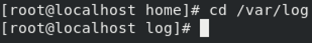
  <center>图2.1.3</center>

  - 以相对路径的方式进入/var/log目录，如图2.1.4所示。

  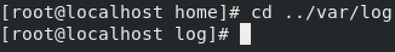
  图2.1.4
- 在Linux文件结构中var和home目录都在"/"目录下，图2.1.4中".."表示回到上层目录，也就是"/"目录。

## 2.2 Linux系统终端

虽然Linux系统也提供了类似于Windows系统的图形界面，但是一般系统管理员在使用的时候还是倾向于使用命令行。使用命令可以方便快速地完成任何针对系统的操作。

### 2.2.1命令行概述

#### 1.shell

- 命令行，指的就是shell。
- shell是一个程序，它接受从键盘输入的命令，然后把命令传递给操作系统执行。几乎所有的Linux发行版都提供一个名为bash的shell程序。

#### 2.终端程序

- 当使用图形界面的Linux操作系统时，需要一个和shell交互的工具，叫做终端程序。在Linux系统中这个程序被命名为"terminal"。其中GNOME桌面使用的终端程序名为
  "gnome-terminal"。还有其他一些终端程序可供Linux使用。基本所有不同版本的终端程序目的都是为了能访问shell。

#### 3.终端程序的基本操作

- 打开终端程序

  - 以Centos8的gnome-terminal桌面环境为例，打开终端程序的步骤如下:

    - 登陆系统后，单击桌面左上角的"活动"按钮,如图2.2.1所示。

    
    图2.2.1

    - 在左边的菜单中单击"终端"按钮，打开终端，如图2.2.2所示。

    
    图2.2.2

    - 终端界面如图2.2.3所示。

    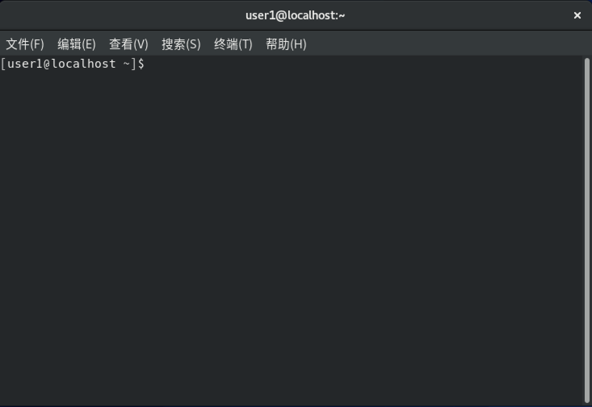
    图2.2.3
- 在终端中输入命令
- 当终端程序运行之后，会显示一串字符，这些字符叫做shell提示符，如图2.2.4所示。


图2.2.4

- shell提示符会以各种样式显示，这则取决于不同的Linux发行版，通常包括"用户名@主机名"，紧接着当前工作目录和一个"\$"。

  - 如果提示符的最后一个字符是"#", 那么这个终端会话就拥有超级用户权限。
  - 如果提示符的最后一个字符是"\$"则表示，这是一个普通用户。
  - 如果向终端中输入如下字符"kaekfjaeifj"。由于输入的字符没有任何意义，所以shell会提示错误信息,如图2.2.5所示。

  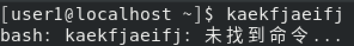
  图2.2.5
- 下面执行一些简单的shell命令：

  - date命令，该命令显示系统当前时间和日期，如图2.2.6所示。

  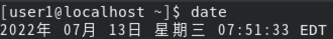
  图2.2.6

  - cal命令，该命令默认显示当前月份的日历，如图2.2.7所示。

  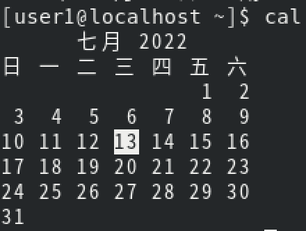
  图2.2.7

## 2.3 文件管理命令

- 文件是Linux操作系统的基本组成单元。文件管理包括复制、移动、修改等。本节主要介绍Linux文件管理相关命令。

#### 2.3.1 复制命令cp

##### 命令简介
- cp命令用来将一个或多个源文件或者目录复制到指定的目的文件或目录。它可以将单个源文件复制成一个指定文件名的具体的文件或一个已经存在的目录下。
- cp命令还支持同时复制多个文件，当一次复制多个文件时，目标文件参数必须是一个已经存在的目录，否则将出现错误。

##### 命令语法 {#命令语法 .unnumbered}
```shell
cp \[option\] source dest

cp \[option\] source directory

#option：cp命令的选项
#source：源文件
#dest：目标文件
#directory：目录
```

##### 命令参数，如表2.3.1所示

表2.3.1

---

| 参数     | 作用                                             |
| -------- | ------------------------------------------------ |
| -a       | 此参数的效果和同时指定“-dpR”参数相同           |
| -f       | 强行复制文件或目录，不论目标文件或目录是否已存在 |
| -i       | 覆盖已有文件之前先询问用户                       |
| -l       | 对源文件建立硬连接，而非复制文件                 |
| -p       | 保留源文件或目录的属性                           |
| -R 或 -r | 递归复制目录及其子目录内的所有内容               |

---

##### 命令实例演示
```shell
#将当前目录abc复制到目录/opt/aaa/bbb下，并改名为filedoc
cp abc /opt/aaa/bbb/filedoc

#将/etc/shut目录下的所有文件及其子目录复制到/tmp/sh目录中
cp -r /etc/shut /tmp/sh

#将当前目录下的text1.txt和text2.txt复制到/opt/apt目录下
cp text1.txt text2.txt /opt/apt
```

#### 2.3.2 移动文件命令mv

##### 命令简介
-  mv命令用来对文件、目录重新命名，也可以将文件或者目录从一个目录移动到另一个目录，类似于Windows系统中的剪切操作。

##### 命令语法
```shell
mv [option] source directory

#option：mv命令的选项
#source：源文件
#dest：目标文件
#directory：目录

mv [option] source dest
```

##### 命令参数，如表2.3.2所示
  表2.3.2

---

| 参数 | 作用 |
| -f | 覆盖前不询问 |
| -i | 覆盖前询问 |
| -n | 不覆盖已存在的文件 |
| -b | 类似--backup但不接受参数 |
| --backup | 弱需覆盖文件，则覆盖先前的备份 |

---

##### 命令实例演示 

```shell
#将abc文件重命名为cba。
mv abc cba

#将当前命令下的doc1文件移动到/opt目录下并重命名为doc2。
mv doc1 /opt/doc2

#将当前目录下的doc1、doc2文件复制到/usr目录下，如果/usr目录下有同名文件则备份。
mv --backup doc1 doc2 /usr
```

#### 2.3.3 创建文件命令touch

##### 命令简介
- touch命令用于创建新的空文件也可以把已存在的文件时间标签更新为系统当前时间，文件的数据将原封不动地保留下来。

##### 命令语法

```shell
touch [option] file
#option：touch命令的选项
#file：指定要设置时间属性的文件，或需要新建的文件名
```

##### 命令参数，如表2.3.3所示
  表2.3.3

---

| 参数 | 作用                               |
| ---- | ---------------------------------- |
| -a   | 只更改访问时间                     |
| -c   | 不创建任何文件                     |
| -d   | 使用指定字符串表示时间而非当前时间 |
| -m   | 只更改修改时间                     |

---

##### 命令实例演示

```shell
#新建一个空白文件file1。
touch file1

#将"file1"的访问时间修改为当前系统时间。
touch -a file1

#如果当前目录下有名为file1的文件就修改file1文件的时间戳，如果没有不创建。
touch -c file1
```

#### 2.3.4 删除文件命令rm

##### 命令简介
- rm命令可以删除一个目录中的一个或多个文件或目录，也可以将某个目录及其下属的所有文件及其子目录全都删除。而对于链接文件，将只是删除整个链接文件，原文件保持不变。

##### 命令语法
```shell

rm [option] file
#option：mv命令的选项
#file：需要删除的文件
```

##### 命令参数，如表2.3.4所示
  表2.3.4

---

| 参数            | 作用                                              |
| --------------- | ------------------------------------------------- |
| -d              | 把将要删除的目录的硬连接数据删除成0，再删除该目录 |
| -f              | 强制删除文件或目录                                |
| -i              | 删除已有文件或目录之前先询问用户                  |
| -r或-R          | 递归处理，将指定目录下的所有文件与子目录一并处理  |
| -v              | 显示指令的详细执行过程                            |
| --preserve-root | 不对根目录进行递归操作                            |

---

##### 命令实例演示

```shell
#强制删除/opt/abc目录及其子目录下的所有文件和目录。
rm -rf /opt/abc

#使用交互的方式删除/usr/file1目录及其目录下的所有文件和目录。
rm -r /usr/file1
```

#### 2.3.5 磁盘检查命令df

##### 命令简介
- df命令用于检查文件系统的磁盘空间占用情况。

##### 命令语法

```shell
df [option] file

#option：df命令的选项
#file：df命令操作对象
```

##### 命令参数，如表2.3.5所示
  表2.3.5

---

| 参数 | 作用                         |
| ---- | ---------------------------- |
| -a   | 包含全部的文件系统           |
| -h   | 以可读性较高的方式来显示信息 |
| -I   | 显示inode的信息              |
| -k   | 指定区块大小为1024字节       |
| -l   | 仅显示本地端的文件系统       |
| -T   | 显示文件系统的类型           |

---

##### 命令实例演示

```shell
#列出各文件系统的i节点使用情况。
df -i

#列出文件系统的类型。
df -T

#以k为单位显示磁盘的使用情况。
df -k
```

#### 2.3.6 文件查找命令find

##### 命令简介
- find命令用于搜索文件或目录，并执行指定操作。linux下find命令提供了相当多的查找条件，功能很强大。

##### 命令语法

```shell
find pathname -options [-print -exec -ok ...]

#pathname：find命令所查找的目录路径
#options：find命令的选项
#print：将结果输出到屏幕
#exec：对匹配文件执行该参数所给出的shell命令。相应命令的形式为\'command\'{ }\\;
#ok：和-exec的作用相同，只不过在执行每一个命令之前，都会给出提示，让我们来确定是否执行
```

##### 命令参数，如表2.3.6所示
  表2.3.6

---

| 参数   | 作用                         |
| ------ | ---------------------------- |
| -size  | 根据大小搜索                 |
| -name  | 根据文件名搜索               |
| -user  | 根据所有者查找               |
| -group | 根据所属组查找               |
| -admin | 根据最后一次访问时间查找     |
| -cmin  | 根据最后一次属性修改时间查找 |

---

##### 命令实例演示

```shell
#在/etc目录下查找大于2M的文件和目录。
find /etc/ -size +2M

#在/etc目录查找以na开头的文件。
find /etc/ -name na\* -type f

#在当前目录下查找用户为apache的文件和目录。
find . -user apache

#在当前目录下查找所属组为apache的文件和目录并显示详细信息。
find . -group apache -exec -ls -l { } \\;

#在/root目录下查找10分钟之内被修改过内容的文件。
find /root -mmin -10 -type f

#在/root目下查找10分钟以前属性被修改过的文件。
find /root -cmin +10 -type f

#在/etc目录下查找10分钟之内被访问过的文件。
find /etc -amin -type f

#在/opt目下删除不是以.apt结尾的文件。
find /opt -type f ! -name "\*.apt" -exec rm -rf {} \\;

#在/tmp目录下查找i节点为3009的文件。
find /tmp -inum 3009
```

#### 2.3.7 查看文件大小命令du

##### 命令简介
- du命令可以计算文件或目录所占的磁盘空间。

##### 命令语法

```shell
du [option] file

#option：du命令的选项
#file：du命令操作对象
```

##### 命令参数，如表2.3.7所示
  表2.3.7

---

| 参数 | 作用                                       |
| ---- | ------------------------------------------ |
| -a   | 显示目录中个别文件的大小                   |
| -c   | 显示几个目录或文件的大小，并统计它们的总和 |
| -m   | 以MB为单位输出                             |
| -s   | 仅显示总计，只列出最后总和的值             |
| -h   | 以KB、MB、GB为单位，提高信息的可读性       |

---

##### 命令实例演示

```shell
#显示多个文件所占用的空间。
du file1 file2 file3

#显示多个文件所占用的空间和所占用的空间总和。
du -c file1 file2 file3

#显示一个目录及其子目录的磁盘使用情况。
du /home
```

#### 2.3.8文件查看命令cat

##### 命令简介
- cat命令的用途是连接文件或标准输入并打印。

##### 命令语法

```shell
cat [option] file
#option：cat命令的选项
#file：cat命令操作对象
```

##### 命令参数，如表2.3.8所示
  表2.3.8
  ---

| 参数 |         作用         |
| :--: | :------------------: |
|  -b  |   对非空输出行编号   |
|  -E  | 在每行结束处显示"\$" |
|  -n  |      输出行编号      |
|  -s  |    不输出多行空行    |

---

##### 命令实例演示

```shell
#将/etc/passwd文件中的内容打印到屏幕并显示行号。
cat -n /etc/passwd

#将/etc/profile文件中的内容打印到屏幕并显示行号（除空行外）。
cat -b /etc/profile

#将file1、file2中的内容输出到file3中。
cat file1 file2 > file3
```

- **注意：在linux中"\>"表示覆盖，"\>\>"表示追加。**

#### 2.3.9 文件查看命令head

##### 命令简介
- head命令用于显示文件开头的内容。
- 默认情况下，head命令显示文件的头10行内容。

##### 命令语法 

```shell
head [option] file
#option：head命令的选项
#file：head命令操作对象
```

##### 命令参数，如表2.3.9所示
  表2.3.9

---

| 参数 | 作用                     |
| ---- | ------------------------ |
| -n   | 指定显示头部内容的行数   |
| -c   | 指定显示头部内容的字符数 |
| -v   | 总是显示头部内容的字符数 |
| -q   | 不显示文件名的头信息     |

---

##### 命令实例演示

```shell
#将/etc/passwd文件中的前5行内容输出到屏幕上。
head -n 5 /etc/passwd

#将/etc/passwd文件的前10行内容输出屏幕上，并且显示文件名。
head -v /etc/passwd
```

#### 2.3.10 文件查看命令less

##### 命令简介
- less命令也是对文件或其它输出进行分页显示的工具，less是linux正统查看文件内容的工具，功能极其强大。less 的用法比起 more 更加的有弹性。
- 在使用more命令时，没有办法向前翻页，只能向后翻页。但less命令可以使用"pageup "、"pagedown" 等按键来往前往后翻页，使浏览文件变得更加便利。

##### 命令语法

```shell
less [option] file
#option：less命令的选项
#file：less命令操作对象
```

##### 命令参数，如表2.3.10所示

表2.3.10

---

| 参数 | 作用                                                 |
| ---- | ---------------------------------------------------- |
| -i   | 忽略搜索时的大小写                                   |
| -m   | 显示类似more命令的百分比                             |
| -N   | 显示每行的行号                                       |
| -s   | 显示连续空行为一行                                   |
| -S   | 行过长时间将超出部分舍弃                             |
| -f   | 强迫打开特殊文件，例如外围设备代号、目录和二进制文件 |

---

##### 命令实例演示

```shell
#分页输出当前系统进程到屏幕上。
ps -ef | less

#分页输出历史命令到屏幕上。
history | less

#分页输出/etc/passwd的内容到屏幕上。
less /etc/passwd
```

#### 2.3.11 文件查看命令more

##### 命令简介
- more命令会以一页一页的显示文档内容，类似于cat和less命令，方便使用者逐页阅读。最基本的指令就是按一下"空格键"就去往下一页，按 "b" 键就会往回一页显示，并且附带搜寻字串的功能。

##### 命令语法

```shell
more [-dlfpcsu] [-num] [+/ pattern] [+ linenum] [filename...]

#-num：一次显示的行数
#+/pattern：在每个档案显示前搜寻该字串（pattern），然后从该字串前两行之后开始显示
#+linenum：从第几行开始显示
#filename：文件名，可以为多个文件
```

##### 命令参数，如表2.3.11所示
  表2.3.11

---

| 参数 | 作用                       |
| ---- | -------------------------- |
| -c   | 从顶部清屏，然后显示       |
| -d   | 显示帮助而不是响铃         |
| -l   | 忽略"Ctrl+l"（换页）字符   |
| -p   | 通过清除窗口而不是滚屏来   |
| -s   | 把连续的多个空行显示为一行 |
| -u   | 把文件内容中的下画线去掉   |

---

##### 命令实例演示

```shell
#显示/etc/passwd中从第三行起的内容。
more +3 /etc/passwd

#显示/etc/passwd内容每屏显示5行。
more -5 /etc/passwd

#显示doc.txt内容并把连续的多个空行显示为一行。
more -s doc.txt

#显示文件docfile的内容。
more -dc docfile
```

#### 2.3.12 文件查看命令tail

##### 命令简介
- tail命令用于输出文件中的尾部内容。
- tail命令默认在屏幕上显示指定文件的末尾10行内容。

##### 命令语法

```shell
tail [option] file
#option：tail命令的选项
#file：指定显示尾部内容的文件
```

##### 命令参数，如表2.3.12所示

表2.3.12

---

| 参数 | 作用                                   |
| ---- | -------------------------------------- |
| -c   | 输出文件尾部的N个字节内容              |
| -n   | 输出文件的尾部N行内容                  |
| -q   | 当有多个文件参数时，不输出各个文件名   |
| -v   | 当有多个文件参数时，总是输出各个文件名 |

---

##### 命令实例演示

```shell
#显示/etc/passwd中后五行的内容。
tail -5 /etc/passwd

#显示/etc/passwd中后八行的内容。
tail -n 8 /etc/passwd
```

#### 2.3.13 文本过滤命令grep

##### 命令简介
- grep命令是强大的文本搜索工具，它能使用正则表达式搜索文本，并把匹配的行打印出来。

##### 命令语法

```shell
grep [option] pattern file
#option：grep命令的选项
#pattern: 匹配模式
#file：指定进行匹配的文件
```

##### 命令参数，如表2.3.13所示
  表2.3.13

---

|  参数  | 作用                                     |
| :-----: | ---------------------------------------- |
|   -c   | 统计符合要求的行数                       |
|   -v   | 反向选取,只显示不符合模式的行            |
|   -o   | 只显示被模式匹配到的字符串，而不是整个行 |
|   -i   | 匹配时不区分大小写                       |
|   -n   | 在行首显示行号                           |
| --color | 以特定颜色高亮显示匹配关键字             |

---

##### 命令实例演示

```shell
#将/etc/passwd文件中以root开头的行打印到屏幕。
grep '^root' /etc/passwd

#统计系统中有多少用户不能登录系统。
grep -c 'nologin' /etc/passwd

#将/etc/profile文件中不包含then的行打印到屏幕，并显示行号。
grep -nv 'then' /etc/profile
```

## 2.4 目录管理命令

- 目录是Linux系统的基本组成单元，一般用于存放文件。目录管理包括复制、删除、修改、移动等。本节主要介绍Linux系统中目录管理的相关命令。

### 2.4.1 显示当前工作目录命令pwd

##### 命令简介
- pwd命令会打印出当前工作目录，或简单的来说就是当前用户所在的目录。

##### 命令语法

```shell
pwd [option]
#option：pwd命令的选项
```

##### 命令参数，如表2.4.1所示
  表2.4.1

---

| 参数      | 作用                                       |
| --------- | ------------------------------------------ |
| -L        | 使用环境变量汇总的pwd,即使其中包含符号链接 |
| -P        | 避免所有符号链接                           |
| --help    | 显示帮助信息并退出                         |
| --version | 显示版本信息并退出                         |

---

- 命令实例演示

  - 查看当前所在目录，操作如图2.4.2所示。

  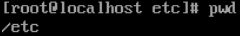
  图2.4.2

#### 2.4.2 建立目录命令mkdir

##### 命令简介
- mkdir命令用来创建目录。

##### 命令语法

```shell
mkdir [option] directory

#option：mkdir命令的选项
#directory：mkdir命令创建的目录名也可以包含路径
```

##### 命令参数，如表2.4.2所示
  表2.4.2

---

| 参数      | 作用                     |
| --------- | ------------------------ |
| -m        | 设定权限\<模式\>         |
| -p        | 递归创建多级目录         |
| -v        | 每次创建新目录都显示信息 |
| --help    | 显示此帮助信息并退出     |
| --version | 输出版本信息并退出       |

---

##### 命令实例演示

```shell
#在当前目录下新建目录abc目录。
mkdir abc

#查看mkdir命令的版本信息。
mkdir -version
```

#### 2.4.3 删除目录命令rmdir

##### 命令简介
- rmdir命令用来删除空目录。

##### 命令语法

```shell
rmdir [option] directory

#option：rmdir命令的选项
#directory：需要删除的空目录
```

##### 命令参数，如表2.4.3所示
  表2.4.3

---

| 参数                       | 作用                         |
| -------------------------- | ---------------------------- |
| -p                         | 递归删除目录                 |
| -v                         | 显示命令的详细执行过程       |
| --help                     | 显示命令的帮助信息           |
| --version                  | 显示命令的版本信息           |
| --ignore-fail-on-non-empty | 忽略由目录非空产生的所有错误 |

---

##### 命令实例演示

```shell
#删除/opt目下的空abc目录。
rmdir /opt/abc

#删除/opt目录下abc目录和其子目录。
rmdir -p /opt/abc

#删除/opt目录下abc目录和其子目录,并显示详细信息。
rmdir -pv /opt/abc
```

### 2.4.4 改变工作目录命令cd

##### 命令简介

- cd命令用于进入目录。

##### 命令语法

```shell
cd [option] directory

#option：cd命令的选项
#directory：需要进入的目录
```

##### 命令参数，如表2.4.4所示
  表2.4.4

---

| 参数 | 作用                                               |
| ---- | -------------------------------------------------- |
| -P   | 如果目标是一个符号链接，则切换到符号连接指向的目录 |
| -L   | 如果目标是一个符号链接，则切换到符号链接文件的目录 |

---

##### 命令实例演示

- 进入/etc目录,如图2.4.5所示。

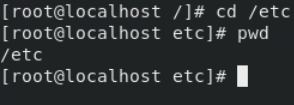
图2.4.5

- 回到用户主目录,如图2.4.6所示。

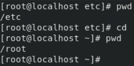
图2.4.6

- 回到上一级目录,如图2.4.7所示。

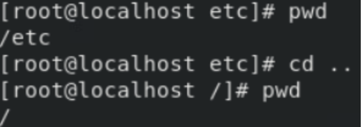
图2.4.7

### 2.4.5 查看工作目录命令ls

#### 命令简介
- ls命令不仅可以查看linux系统中的文件和目录，还可以查看文件或目录的详细信息。

#### 命令语法

```shell
ls [option] file

#option：ls命令的选项
#file：ls命令的目标目录或文件
```

#### 命令参数，如表2.4.5所示

表2.4.5

---

| 参数 | 作用                                             |
| ---- | ------------------------------------------------ |
| -a   | 列出目录下的所有文件，包括以 . 开头的隐含文件    |
| -A   | 同 -a，但不列出 "." 和 ".."                      |
| -i   | 显示每个文件的 inode 号                          |
| -k   | 以 KB 的形式表示文件的大小                       |
| -l   | 将文件的权限、所有者、文件大小等信息详细列出来。 |

---

#### 命令实例演示

- 列出/etc目录下所有文件的详细信息,如图2.4.8所示。

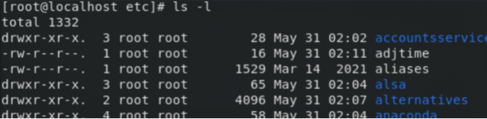
图2.4.8

- 图2.4.8的输出结果分为7段，每段都有不同的含义，下面简单介绍一下每一段的含义，如表2.4.6所示。

表2.4.6

---

| **参数** | **作用**                        |
| -------------- | ------------------------------------- |
| 字段1          | 文件类型和权限                        |
| 字段2          | 链接数，1表示只有一个文件链接到此文件 |
| 字段3          | 文件所有者                            |
| 字段4          | 文件所属组                            |
| 字段5          | 文件大小，单位字节                    |
| 字段6          | 文件最后一次被修改的日期              |
| 字段7          | 文件名                                |

---

### 2.4.6 查看目录树tree

#### 命令简介
- 使用tree命令以树状图递归的形式显示各级目录，可以方便地看到目录结构。

#### 命令语法

```shell
tree [option] directory

#option：tree命令的选项
#directory：所需解析的目录
```

#### 命令参数，如表2.4.7所示
  表2.4.7

---

| 参数 | 作用                                       |
| ---- | ------------------------------------------ |
| -a   | 显示所有文件和目录                         |
| -C   | 为文件和目录清单加上色彩，便于区分各种类型 |
| -D   | 列出文件或目录的更改时间                   |
| -f   | 在每个文件或目录之前，显示相对路径名称     |
| -d   | 显示目录名称而非内容                       |

---

#### 命令实例演示

- 显示/etc目录下个各级目录及文件,如图2.4.9所示。

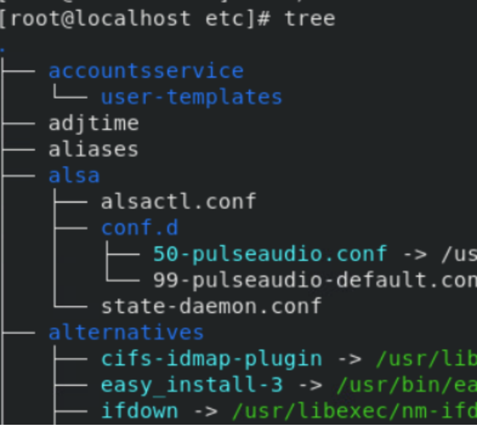
图2.4.9

- 在/etc目录下每个文件或目录之前，显示完整的相对路径名称,如图2.4.10所示。

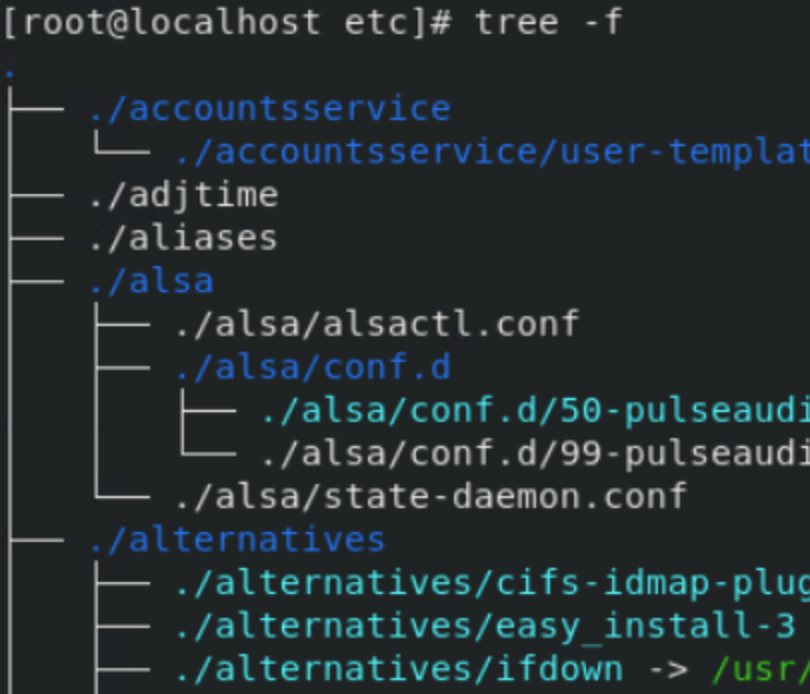
图2.4.10

### 2.4.7 打包与解包文件命令tar

#### 命令简介
- tar命令用于将文件打包或解包，扩展名一般为".tar"，指定的特定参数可以调用gzip或者bzip2制作压缩包或解开压缩包，扩展名为".tar.gz"或".tar.bz2"。

#### 命令语法

```shell
tar [option] tarfile tarsourcefile

#option：tar命令的选项
#tarfile：打包之后的文件名比如file.tar
#tarsourcefile：需要打包的源文件
```

#### 命令参数，如表2.4.8所示

表2.4.8

---

| 参数 | 作用                                               |
| ---- | -------------------------------------------------- |
| -c   | 建新的压缩包                                       |
| -v   | 处理过程中输出的相关信息                           |
| -x   | 解压压缩包                                         |
| -z   | 调用gzip来归档文件，与"-x"联用时调用gzip完成解压缩 |
| -j   | 调用bzip2压缩或解压                                |

---

#### 命令实例演示

```shell
#将/etc打包到/tmp/etc.tar（只打包不压缩）。
tar -cvf /tmp/etc.tar /etc

#将/etc打包到/tmp/etc.tar.gz(打包并使用gzip压缩文件)。
tar -zcvf /tmp/etc.tar.gz /etc

#解压/tmp/etc.tar.gz到当前目录。
tar -zxvf /tmp/etc.tar
```

### 2.4.8 压缩和解压缩命令zip/unzip

#### 命令简介
- zip命令是Linux系统下广泛使用的压缩程序，文件压缩后扩展名为".zip"。

#### 命令语法

```shell
zip [option] zipsourcefile zipdestfile

#option：zip命令的选项
#zipsourcefile：压缩后的文件名
#zipdestfile: 打包的目录路径
```

#### 命令参数，如表2.4.9所示
  表2.4.9

---

| 参数 | 作用                                       |
| ---- | ------------------------------------------ |
| -o   | 覆盖已存在文件且不要求用户确认             |
| -d   | 把压缩文件解压到指定目录下                 |
| -m   | 将文件压缩后，删除源文件                   |
| -v   | 查看文件目录，但不解压                     |
| -r   | 将指定的目录下的所有子目录以及文件一起处理 |

---

#### 命令实例演示

```shell
#将当前文件夹压缩成file_backup.zip。
zip -r file_backup.zip .

#将file_backup.zip文件解压到/data/backup文件夹中。
unzip file_backup.zip -d /data/backup
```

#### 2.4.9 压缩和解压缩命令gzip

#### 命令简介
- gzip命令用于压缩文件。任何文件经过gzip工具压缩后，文件会多出一个".gz"后缀。gzip命令对文本文件有60%～70%的压缩率。

#### 命令语法

```shell
gzip [option] file

#option：gzip命令的选项
#file: 要压缩的文件
```

#### 命令参数，如表2.4.10所示
  表2.4.10

---

| 参数 | 作用                 |
| ---- | -------------------- |
| -c   | 保留源文件           |
| -d   | 解压".gz"文件        |
| -v   | 打印操作详细信息     |
| -l   | 列出压缩文件详细信息 |
| -h   | 在线帮助             |

---

#### 命令实例演示

```shell
#将temp压缩成temp.gz。
gzip -c temp \> temp.gz

#将temp.gz文件解压缩。
gzip -d temp.gz
```

## 2.5 系统管理命令

- 在使用系统的过程中，我们经常会对系统进行一些设置，比如修改系统的时间、添加环境变量、关闭或重新启动计算机等操作。本节主要介绍系统管理相关的命令。

### 2.5.1 帮助命令man

#### 命令简介
- 使用man命令用于调出其他命令的帮助信息。

#### 命令语法

```shell
man [option] command

#option：man命令的选项
#command：所需要查询帮助的命令
```

#### 命令参数，如表2.5.1所示

表2.5.1

---

| 参数 | 作用                         |
| ---- | ---------------------------- |
| -a   | 在所有的man手册中搜索        |
| -f   | 显示给定关键字的简短描述信息 |
| -P   | 指定内容时使用分页程序       |
| -M   | 指定man手册搜索路径          |

---

#### 命令实例演示

```shell
#查看ls命令的详细用法。
man ls
```

#### 2.5.2 查看历史记录命令history

#### 命令简介
- 当前终端命令行输入并执行命令的时，Linux会自动把命令记录到历史列表中。一般保存在用户HOME目录下的".bash_history"文件中。默认将保存1000条。
- history命令不仅可以查询历史命令，而且有相关的功能执行命令。

#### 命令语法

```shell
histroy [option]

#option：history命令的选项
```

#### 命令参数，如表2.5.2所示

表2.5.2

---

| 参数 | 作用                                                                            |
| ---- | ------------------------------------------------------------------------------- |
| -n   | 列出最近输入的N条命令                                                           |
| -c   | 将目前shell中的所有history内容全部清除                                          |
| -a   | 将目前新增的命令新加入histfiles中，若没有加histfiles,则预设写入\~/.bash_history |
| -r   | 将histfiles的内容读到目前这个shell的histroy记忆中                               |

---

#### 命令实例演示
- 查看最近输入的10条命令，如图2.5.1所示。
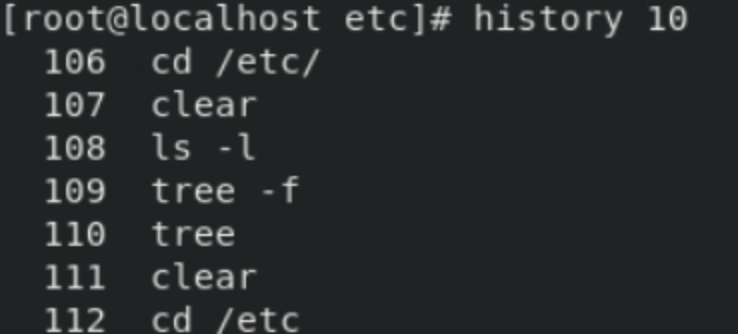
图2.5.1

### 2.5.3 显示和修改时间命令date

#### 命令简介
- date命令的功能是显示或设置系统的日期和时间。只有超级用户才能使用date命令设置时间，普通用户只能使用date命令查看时间。

#### 命令语法

```shell
date [option] time

#option：history命令的选项
#time：所需要设置的具体时间
```

#### 命令参数，如表2.5.3所示
  表2.5.3

---

| 参数 | 作用                                                           |
| ---- | -------------------------------------------------------------- |
| -s   | 设置 "datestr" 的日期，将系统时间设为 "datestr" 中所设定的时间 |
| -d   | 显示 "datestr" 中所设定的时间 (非系统时间)                     |
| -r   | 显示文件最后的修改时间                                         |

---

#### 命令实例演示

- 显示系统当前时间，如图2.5.2所示。

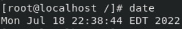
图2.5.2

- 设置系统时间为2013年5月30日，如图2.5.3所示。
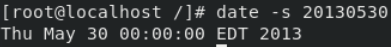
图2.5.3

### 2.5.4 显示系统内存状态free

#### 命令简介
- free命令会显示内存的使用情况，包括实体内存、虚拟的交换文件内存、共享内存区段，以及系统核心使用的缓冲区等。

#### 命令语法

```shell
free [option]

#option：free命令的选项
```
#### 命令参数，如表2.5.4所示

表2.5.4

---

| 参数 | 作用                                               |
| ---- | -------------------------------------------------- |
| -c   | 建新的压缩包                                       |
| -v   | 处理过程中输出的相关信息                           |
| -x   | 解压压缩包                                         |
| -z   | 调用gzip来归档文件，与"-x"联用时调用gzip完成解压缩 |
| -j   | 调用bzip2压缩或解压                                |

---

#### 命令实例演示

- 以M为单位查看系统内存资源占用情况,如图2.5.4所示

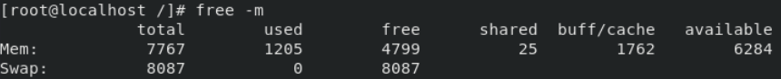
图2.5.4

- Mem：表示物理内存统计。这台机器的物理内存为8000MB。
- total：7767表示系统内从总量为7767MB。
- used：1205表示已用内存大小为1205MB。
- free：4799表示未被分配的内存大小为4799MB。
- shared：25表示共享内存为25MB。
- buff/cache：1762表示系统分配但未被使用的buffers和cache数量为385MB。
- available：6284表示可用的内存大小为6284MB。

- Swap：Swap:表示交换分区的使用情况。如剩余空间较小，需要留意当前系统内存使用情况及负载
  - total：8087表示交换分区的大小为8087MB。
  - free：0表示当前使用的交换分区大小为0 MB。
  - free：8087表示当前未被分配的交换分区大小为8087MB。
### 2.5.5 关机和重启命令shutdown

#### 命令简介
- shutdown命令用于将系统关机。

#### 命令语法

```shell
shutdown [option]

#option: shutdown命令的选项
```

#### 命令参数，如表2.5.5所示

表2.5.5

---

| 参数  | 作用                                               |
| ----- | -------------------------------------------------- |
| -t    | 在改变到其他 runlevel 之前，告诉 init 多久以后关机 |
| -r    | 重启计算机                                         |
| -h    | 关机后关闭电源                                     |
| -time | 设定关机的时间                                     |

---

#### 命令实例演示

```shell
#立即关机。
shutdown -h now

#指定10分钟后关机。
shutdown -h 10

#重新启动计算机。
shutdown -r now
```

### 2.5.6 重启系统命令reboot

#### 命令简介

  - reboot命令用于重启系统。
- 命令语法

```shell
reboot [option]
#reboot：reboot命令的选项
```

#### 命令参数，如表2.5.6所示

表2.5.6

---

| 参数 | 作用                                   |
| ---- | -------------------------------------- |
| -n   | 在重启之前不执行磁盘选项               |
| -w   | 做一次重启模拟，并不会真的重新启动     |
| -i   | 在重开机之前先把所有网络相关的装置停止 |
| -f   | 强制重开机                             |

---

#### 命令实例演示

```shell
#重新启动系统
reboot
```

## 2.6 文本编辑器

- 我们在使用系统的时候经常会需要编辑文本文件，Linux系统根据不同的发行版提供了很多文本编辑器，例如vi、vim、nano等。熟练掌握使用文本编辑器可以提高学习和工作的效率。本节主要介绍vi编辑器的使用。

### 2.6.1 vi编辑器的基本使用

- vi工具是Linux系统中常用的文本编辑器，熟练掌握vi的使用可提高学习和工作的效率。vi工作模式主要有命令模式和编辑模式两种。可以通过"ESC"键来切换两种模式。
- 要使用vi编辑器，可以在终端中输入vi加上要编辑的文件名,来编辑所要修改的文件。如编辑file1文件，在终端中输入"vi file1"命令即可。操作如图2.6.1所示。

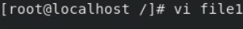
图2.6.1

### 2.6.2 vi编辑器的工作模式

#### 命令行模式

- 该模式是进入vi编辑器后的默认模式。在命令模式下，输入的任何字符都被当做编辑命令来解释。若输入的字符是合法的vi命令，则vi在接受用户命令之后完成相应的动作。如图2.6.2展示了编辑file1文件的命令行模式。

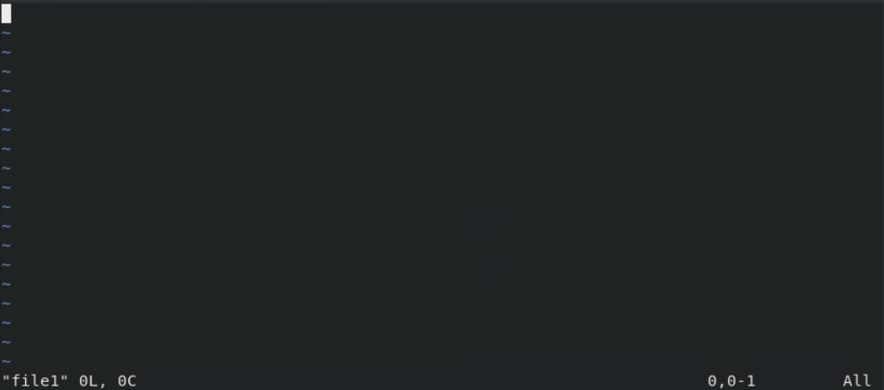
图2.6.2

#### 文本编辑模式
  - 在命令模式下输入插入命令"i"、附加命令"a"、打开命令"o"、修改命令"c"、取代命令"r"或替换命令"s"都可以进入文本输入模式。在该模式下，用户输入的任何字符都被vi当做文件内容保存起来，并将其显示在屏幕上。在文本输入过程中，若想回到命令模式下，按下"Esc"键即可。图2.6.3显示了file1文件在插入模式下状态。

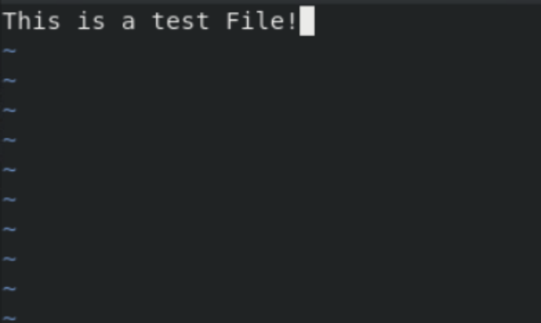
图2.6.3

#### 末行模式

- 末行模式也称ex转义模式，用于退出vi编辑器。在命令模式下，用户按"冒号"键即可进入末行模式下。此时vi会在显示窗口的最后一行（通常也是屏幕的最后一行）显示一个":"作为末行模式的说明符，等待用户输入命令。多数文件管理命令都是在此模式下执行的。末行命令执行完后，vi自动回到命令模式。
- 在vi可视化模式(Visual Mode)下可以选择一块编辑区域，然后对选中的文件内容执行插入、删除、替换、改变大小写等操作，是vi使用过程中使用非常频繁的一种模式。vi命令模式下，输入"v "或者 "V" 或者 "Ctrl + v" 都可进入可视化模式，各模式介绍如下：

  - 字符选择模式：命令模式下按小写 "v"进入，选中光标经过的所有字符。如图2.6.4所示。

  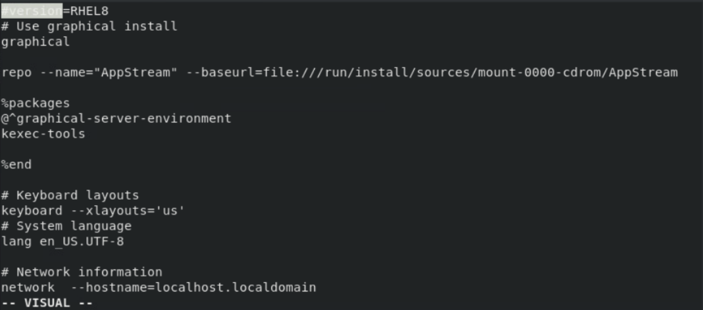
  图2.6.4

  - 行选择模式：命令模式下按 大写"V"进入，选中光标经过的所有行。如图2.6.5所示。

  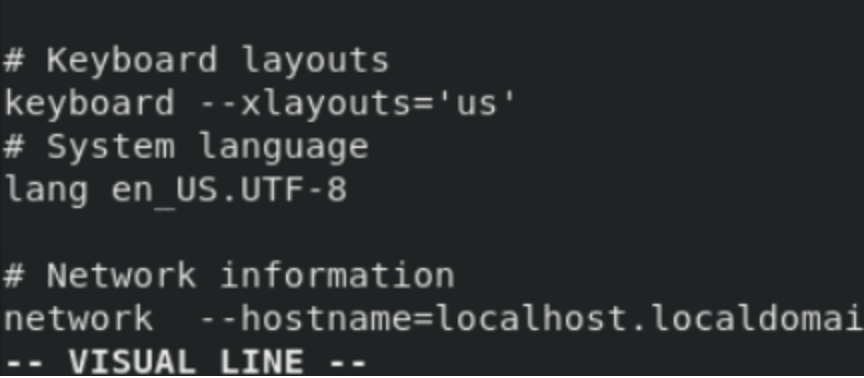
  图2.6.5

  - 块选择模式：命令模式下按 "\<Ctrl\> + v" 进入，选中整个矩形框表示的所有文本。如图2.6.6所示。

  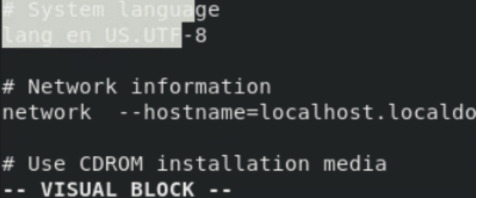
  图 2.6.6

  - 如果要从命令模式转换到编辑模式，可以输入命令"a"或者"i"。如果需要从文本模式返回，则按下"Esc"键即可。

### 2.6.3 内容输入

- 当需要输入文本时，必须切换到插入模式，可以用以下指令来实现不同的插入：

  - 增加("append"对应快捷键为"a"和"A")

    - "a"表示从光标所在位置后开始输入内容，光标后的资料随增加的内容向后移动，如图2.6.7所示。

    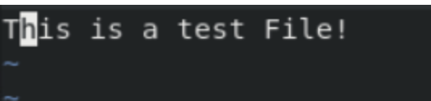
    图2.6.7

    - "A"表示从光标所在行最后面的位置开始输入内容，如图2.6.8所示。

    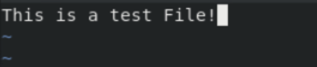
    图2.6.8
  
  - 插入("insert"对应快捷键为"i")

    - "i"表示从光标所在位置的前面开始插入内容，光标后的内容随新增内容向后移动,如图2.6.9所示。

    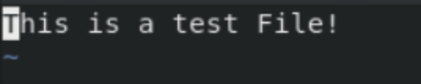
    图2.6.9
  - 开始("open"对应快捷键为"o"和"O")

    - "o"在光标所在行下方新增一行并进入输入模式，如图2.6.10所示。

    
    图2.6.10

    - "O"在光标所在行上方新增一行并进入输入模式，如图2.6.11所示。

    
    图2.6.11

### 2.6.4 移动光标

- 命令模式和输入模式下移动光标的基本命令是"h"、"j"、"k"、"l"。当然也可以直接用键盘上的"方向键"来做移动。此外vi还提供更多的光标移动方式，如表2.6.4所示。
- **注意：这些移动命令只能在命令模式下使用**

表2.6.4

---

| 命令     | 含义                     |
| -------- | ------------------------ |
| 0(零)    | 移动光标到所在行的最前面 |
| $        | 移动光标到所在行的最后面 |
| H        | 移动到窗口的第一行       |
| M        | 移动到窗口的中间行       |
| L        | 移动到窗口的最后行       |
| Ctrl + d | 向下半页                 |
| Ctrl + f | 向下一页                 |
| Ctrl + u | 向上半页                 |
| Ctrl + o | 向上一页                 |

---

### 2.6.5 复制与粘贴

- 在vi中复制、剪切、粘贴分别用了三套不同的命令行来实现。实现的方式，如表2.6.5所示。
- **注意:必须要在命令模式下使用**

表2.6.5

---

| **命令** | **含义**                                                                     |
| -------------- | ---------------------------------------------------------------------------------- |
| y              | 可以使用[num]y其中[num]表示需要复制行数来复制内容，例如要复制5行的内容可以使用"5y" |
| yy             | 复制一整行                                                                         |
| y^             | 复制当前到行头的内容                                                               |
| y$             | 复制当前到行尾的内容                                                               |
| yw             | 复制一个单词 （[num]yw，复制[num]个单词，[num]为数字）                             |
| d              | 剪切选定块到缓冲区                                                                 |
| dd             | 剪切整行                                                                           |
| d^             | 剪切至行首                                                                         |
| d$             | 剪切至行尾                                                                         |
| dw             | 剪切一个字符                                                                       |
| dG             | 剪切至档尾                                                                         |
| p              | 小写"p"代表粘贴至光标后                                                            |
| P              | 大写"P"代表粘贴至游标前                                                            |

---

### 2.6.6 删除与修改
- 在vi中认为输入与编辑有所不同。编辑是在命令模式下进行的，先利用命令移动光标来定位到要进行编辑的地方，然后再使用相应的命令进行编辑，而输入是在插入模式下进行的，常用的编辑命令如表2.6.6所示。
- **注意：这些移动命令只能在命令模式下使用**

表2.6.6

---

| 命令 | 含义                                                                      |
| ---- | ------------------------------------------------------------------------- |
| x    | 删除光标所在字符                                                          |
| r    | 修改光标所在字符，"r"后是要修正的字符                                     |
| R    | 进入替换状态，输入的文本会覆盖原先的资料，直到按"ESC"键回到命令模式下为止 |
| s    | 删除光标所在字符，并进入输入模式                                          |
| S    | 删除光标所在行，并进入输入模式                                            |
| cc   | 修改整行文字                                                              |
| u    | 撤销上一次操作                                                            |
| .    | 重复上一次操作                                                            |

---

### 2.6.7 查找与替换

- vi中查找与替换的参数说明如表2.6.7所示。
- **注意：这些移动命令只能在命令模式下使用**
- 在命令模式中输入"冒号"，并在后面跟上相应的命令行来实现不同的功能。
  表2.6.7

---

| 命令                      | 含义                                            |
| ------------------------- | ----------------------------------------------- |
| :/string                  | 查找string,并将光标移动到string所在位置         |
| :?string                  | 将光标移动到最近一个包含string字符串的行        |
| :n                        | 把光标定位到文件第n行                           |
| :s/string1/string2/       | string2替换掉在行首出现的string1                |
| :s/string1/string2/g      | string2替换所在行中所有的string1                |
| :m,n s/string1/string2/g  | string2替换掉第m行到第n行中的所有string1        |
| : .,m s/string1/string2/g | string2替换掉光标所在的行到第m行中的所有string1 |
| :n,$ s/string1/string2/g  | string2替换掉第n行到文档结束中所有的string1     |
| :%s/string1/string2/g     | string2替换掉全文中的string1                    |

---

### 2.6.8 保存文档

- vi中保存的参数说明如表2.6.8所示。
- **注意：这些保存命令只能在命令模式下使用**

表2.6.8

---

| 命令 | 含义                     |
| ---- | ------------------------ |
| :q   | 不保存退出               |
| :q!  | 放弃当前所有输入强制退出 |
| :w   | 只保存不退出             |
| :x   | 保存更改并退出           |
| :wq  | 保存并退出               |

---
