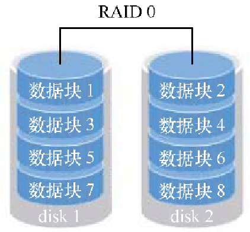
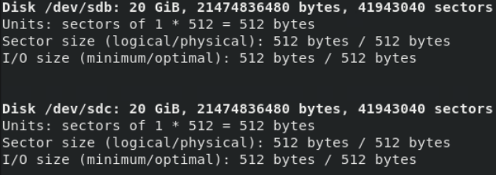
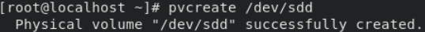

## 3.1 文件系统概述

- 在Linux系统中，所有的系统资源都被当作文件来管理，并保存在目录下。Linux的文件名区分大小写。本节主要介绍文件的相关属性。

### 3.1.1 文件类型

- Linux系统是一种多用户系统，不同的用户拥有不同的权限。为了更好的保护系统的安全，对于一个资源来说，可以对其进行不同用户拥有不同权限的配置。Linux系统对不同用户访问同一文件的权限做了不同的规定。

- 可以通过在终端中输入"ls -l"命令查看文件或者目录的各项参数。如图3.1.1中第一个字母表示文件类型。


图3.1.1

表3.1.2列出所有文件类型，以及对应的参数。
表3.1.2

---
| 文件属性 | 文件类型 |
| -------- | -------- |
| -        | 常规文件 |
| d        | 目录     |
| b        | 块设备文件 |
| c        | 字符设备文件 |
| l        | 符号链接文件 |
| p        | 命名管道文件 |
| s        | 套接字文件(socket 即套接字文件，用于实现两个进程进行通信) |          

---

- 如图3.1.3中第二到第四个字母表示用户的权限。


图3.1.3

如图3.1.4中第五到第七个字母表示组的权限。


图3.1.4

- 如图3.1.5中第八到第十个字母表示其他用户的权限。


图3.1.5

- 如图3.1.6中"1"表示硬件链接数量。


图3.1.6

- 如图3.1.7中红框部分表示所有者也就是文件属于哪个用户。


图3.1.7

- 如图3.1.8中红框部分表示文件所属的组。


图3.1.8

- 如图3.1.9中红框部分表示文件的大小，可以通过不同的参数来显示不同的格式比如kb/mb/gb。


图3.1.9

- 如图3.1.10中红框部分表示文件的修改时间。


图3.1.10

- 如图3.1.11中红框部分表示文件名或者目录名。


图3.1.11

### 3.1.2 文件的属性与权限

- 为了系统的安全性，Linux对于文件赋予了3种属性：读、写和执行。

- 在Linux系统中每个文件都有唯一的属主，同时Linux系统中的用户可以属于同一个组，通过权限位的控制定义每个文件的属主，同组用户和其他用户对该文件具有不同的读、写和执行权限，权限具体表示如下：
  - 读权限：对应标识为"r",表示具有读取文件或目录的权限。
  - 写权限：对应标识为"w",可以让用户对文件进行写如操作，也可进行更改操作，比如删除、移动等。
  - 执行权限:：对应标识为"x",可执行文件，比如C程序编译好的可执行文件需要有执行权限才能运行。对于目录而言，可执行权限表示其他用户可以进入此目录，如果没有可执行权限，则其他用户不能进入目录。
  
- 在Linux系统中文件权限标志位由3部分组成，如图3.1.12中file2文件权限所示。


图3.1.12

- 第一个红圈中的"rwx"表示文件属主具有读、写和执行的权限；第二个红圈中的"rw-"表示与属主属于同一组的用户具有读和写的权限；第三个红圈中的"r\--"表示其他用户对该文件具有读权限。
- 权限也可以使用数字来表示：
  - 4代表"r"
  - 2代表"w"
  - 1代表"x"

- 假设有一个文件的权限为"-rwxrwxrwx"则表示该文件具有最高的权限，对应的数字表示方式为"777"，表示任何用户都可以读写和执行此文。

### 3.1.3 改变文件所有者

- 一个文件属于特定的用户或者组，如果更改文件的属主或属组可以使用chown和chgrp命令。

#### chown命令
##### 命令简介：
  - chown命令可以修改文件的属主和属组，但是只有root用户或拥有该文件的用户可以执行此操作。
##### 命令语法：
    
 ```shell   
 chown user:group file
 
 #user：文件所属用户    
 #group：文所所属的组
 #file：需要修改的文件
 ```
 
##### 命令参数，如表3.1.13所示：

表3.1.13

---
| 参数 | 说明 |
| ---- | ---- |
| -f   | 若该文件拥有者无法被更改也不要显示错误讯息 |
| -h   | 只对于连结(link)进行变更，而非该 link 真正指向的文件 |
| -v   | 显示指令执行过程 |
| -c   | 当发生改变时输出调试信息。仅显示更改的信息 |
| -R   | 对目前目录下的所有文件与子目录进行相同的拥有者变更(即以递回的方式逐个变更) |

---

- 命令实例演示：
    
```shell
#将文件file1.txt 文件的拥有者设为 linux1,所属组设置为linux2。
chown linux1:linux2 file1.txt

#将file目录下的所有文件与子目录的拥有者皆设为linux1所属组设置为linux2。
chown -R linux1:linux2 file
```

- charp命令 
- 命令简介：
  - charp命令用于改变指定文件或目录所属的组

- 命令语法：

```shell
charp [option] file

#option：修改的参数
#file：需要修改的文件
```
- 命令参数，如表3.1.14所示：

表3.1.14

---

| 参数   | 说明                                       |
| ------ | ------------------------------------------ |
| -f     | 不显示错误信息                             |
| --help | 显示帮助信息                               |
| -v     | 运行时显示详细的处理信息                   |
| -c     | 当发生改变时输出调试信息                   |
| -R     | 处理指定目录以及其子目录下的所有文件         |

---

- 命令实例演示：

```shell
#将file1.txt文件由root组改为users组。
chgrp -v users file1.txt

#将file目录以及其子目录下的所有文件的组属性由root改变为users 。
chgrp -R users file
```

### 3.1.4 改变文件权限

####  chmod命令
##### 命令简介：
  - chmod命令是用来改变文件或目录权限的命令。可以将指定文件的拥有者改为指定的用户或组。只有文件的所有者root可以执行这个指令，普通用户不能将文件的拥有者改成别的用户。
  - 更改权限时可以通过以下方法来修改权限:
    - 利用数字来更改文件权限："r"对应数字4，"w"对应数字2,"x"对应数字1，例如一个文件具有读执行权限，可以写为4+1=5。
    - 利用通配符来修改权限: "u"表示文件所有者，"g"表示文件所属的组，"o"表示所有人。

##### 命令语法：
```
chmod [option] file

#option：权限参数

#file：需要修改的文件
```
##### 命令参数，如表3.1.15所示：

表3.1.15

---

| 选项 | 描述 |
| --- | --- |
| `-c` | 仅显示更改了所有者或组的文件的信息。 |
| `-f` | 忽略chown命令的错误信息，例如文件不存在或权限不足。 |
| `-h` | 对符号链接进行操作，而不是它所指向的文件或目录。 |
| `-R` | 处理指定目录及其子目录下的所有文件。 |
| `-v` | 显示详细的处理信息。 |
| `--from` | 只有当前用户和组跟指定的用户和组相同时才进行改变。 |
| `--help` | 显示帮助信息。 |
| `-reference` | 把指定的目录或文件作为参考，把操作的文件或目录设成参考文件或目录相同拥有者和组。 |
| `-version` | 显示版本信息。 |

---

##### 命令实例演示：
```shell
#为file1.sh文件的所有者添加可执行权限。
chmod u+x file1.sh
#"u"表示文件所有者，"x"表示可执行权限,"+"表示添加权限。

#设置其他用户不能读取file1.sh文件。
chmod o-r file1.sh
#"o"表示所有人，"r"表示可读权限,"-"表示删除权限。

#采用数字方式修改file2.txt文件的权限。
chmod 775 file2.txt
#第一个"7"表示所有者的权限为读、写和执行，第二个"7"表示属组的权限为读、写和执行，第三个"5"表示为其他人的权限为读和执行。
```

## 3.2 磁盘管理

- Linux系统提供了丰富的磁盘管理命令，如对硬盘进行分区、对分区进行格式化化、查看硬盘利用率等. {#linux系统提供了丰富的磁盘管理命令如对硬盘进行分区对分区进行格式化化查看硬盘利用率等。
### 3.2.1 Linux分区介绍
- Windows系统使用C盘、D盘、E盘标识符来标记硬盘分区，而Linux系统中则没有盘符的概念。Linux系统中每一个硬件设备(硬盘，闪存等)都映射到系统的一个文件。IDE接口设备在Linux系统中映射的文件以"hd"为前缀，SCSI设备映射的文件以"sd"为前缀。具体的文件命名规则是以英文字母排序的。如系统中第一个IDE设备为"hda",第二个为"hdb"。

- "df -h"命令用来查看Linux系统的硬盘分区，如图3.2.1所示。


图3.2.1

- 在对硬盘进行分区时，第一个分区的编号为1，例如sda1,第二个分区为sda2，以此类推。
- Linux中最多只能创建4个主分区、一个扩展分区和多个逻辑分区。任何一个扩展分区都要占用一个主分区编号，主分区和扩展分区数量最多为4个。在进行系统分区时，主分区一般设置为激活状态，用于在系统启动时引导系统。在分区时每个分区的大小可以由用户自由指定。
- Linux分区格式与Windows不同，Windows常见的格式有FAT32、NTFS等。而Linux常见的分区格式为ext3、ext4等。表3.2.2列出了Linux所支持的文件系统。

表3.2.2

---

| 文件系统 | 作用 |
| --- | --- |
| ext4 | 是 Red Hat Enterprise Linux 6 的标准文件系统。它非常强大可靠，具有多项可以提高现代工作量处理性能的功能。 |
| ext3 | 最多只能支持32TB的文件系统和2TB的文件，实际只能容纳2TB的文件系统和16GB的文件。 |
| ext2 | 是常用于 Linux 中的较旧的文件系统。它简单可靠，非常适合小型存储设备，但是效率低。 |
| vfat | 支持包括一系列相关文件系统(VFAT/FAT16/FAT32)，这些文件系统针对较旧版本的 Microsoft Windows 开发，在大量的系统和设备上受支持。 |
| xfs | 在 Red Hat Enterprise Linux 7 的标准文件系统其具备数据完全、性能稳定、扩展性强(8eb-1byte)、传输速率高(7G/s)等优点

---

- 表3.2.3列出了Linux中常见的系统目录。

表3.2.3

---

| 目录名 | 作用 |
| --- | --- |
| / | 根目录，存放系统命令和用户数据等。 |
| /boot | boot loader 的静态链接文件，存放与Linux启动相关的程序，是Linux系统的启动分区。 |
| /home | 用户目录，存放普通用户的数据。 |
| /tmp | 临时文件。 |
| /var | 不断变化的数据，一般用于存放服务数据。 |
| /opt | 附加的应用程序软件包。 |
| /usr | 系统存放软件的地方，如有可能应将最大空间分配给此目录。 |


---

- Linux系统安装时，如果采用手动分区，建议创建下列分区，如表3.2.4所示。

表3.2.4

---

| 目录名 | 作用 |
| --- | --- |
| / | 根目录，必须挂载的目录。 |
| swap | 交换分区，一般设置为物理内存的1.5倍或2倍。 |
| /home | 家目录，也就是用户目录，桌面、下载等内容，都保存在这里。 |
| /usr | 应用程序目录，大部分的软件都安装在这里。 |
| /var | 如果将这台机器作为服务器，建议划分其空间。 |
| /boot | 启动分区，一般来说，大小只要500M就足够了。 |

---

### 3.2.2 基本磁盘管理工具fdisk

- 对硬盘进行分区时，可以使用fdisk磁盘管理工具对硬盘进行分区，如要对sda硬盘进行分区，只需要在终端中输入命令"fdisk
/dev/sda"。如图3.2.5列出了使用fdisk对硬盘sda进行分区配置界面。


图3.2.5

- 在"command"提示之后输入相应的命令来对fdisk进行操作，表3.2.6列出了所有fdisk可用的命令。

表3.2.6

---

| 命令 | 功能 | 命令 | 功能 |
| --- | --- | --- | --- |
| a | 调整硬盘启动分区 | q | 不保存更改，退出fdisk命令 |
| d | 删除硬盘分区 | t | 更改分区类型 |
| l | 列出所有支持的分区类型 | u | 切换所显示的分区大小的单位 |
| m | 列出所有fdisk命令 | w | 把修改写入硬盘分区表，然后退出 |
| n | 创建新分区 | x | 列出高级选项 |
| p | 列出硬盘分区表 | 
                     
---

- 下面在已经装好的Linux系统上插入一块20G的硬盘，并将这块硬盘划分3个分区，大小分别为10G、5G、3G。具体步骤如下：

- 通过Vmware向虚拟机中添加一块20G的硬盘
  - 关闭虚拟机，右键单击虚拟机名称选项卡，在下拉菜单中选择"设置"按钮，如图3.2.7所示。

  
  图3.2.7
  
  - 在弹出对画框中，单击"添加"按钮，如图3.2.8所示。
  
  
  图3.2.8
  
  - 选择"硬盘"，并且单击下一步"按钮"，如图3.2.9所示。
  
  
  图3.2.9
  
  - 单击"下一步"按钮，如图3.2.10所示。
  
  
  图3.2.10
  
  - 选择"创建新虚拟磁盘"选项，单击"下一步按钮"，如图3.2.11所示。
  
  
  图3.2.11
  
  - 磁盘大小设置为20G，单击"下一步"按钮，如图3.2.12所示。
  
  
  图3.2.12
  
  - 单击"完成"按钮，完成硬盘的添加，如图3.2.13所示。
  
  
  图3.2.13
  
  - 添加完成后可以在"虚拟机设置"中查看这块硬盘，如图3.2.14所示。
  
  
  图3.2.14

- 使用fdisk工具将硬盘分区
  - 打开虚拟机，在终端中输入命令"fdisk -l"，查看当前系统中的硬盘。如图3.2.15所示。

  
  图3.2.15

  - 通过fdisk命令可以看到这台虚拟机中现有两块硬盘，一块为sda，一块为sdb。其中sda是Linux系统硬盘,它有3个分区分别为sda1、sda2、sda3。sdb是刚刚添加的一块20G的硬盘。

  - 通过"fdisk -l"命令我们发现，新添加硬盘的盘符为sdb。通过输入"fdisk /dev/sdb"命令，对这块硬盘进行分区。如图3.2.16所示。
  
  
  图3.2.16

  - 在"command"后输入"n"，创建第一个大小为10G的分区。输入"p"，选择创建主分区（创建扩展分区输入"e"，创建逻辑分区输入"l"）；输入数字"1"，创建第一个主分区（主分区和扩展分区可选数字为1\~4，逻辑分区的数字标识从5开始）；输入此分区的起始、结束扇区，以确定当前分区的大小。也可以使用"+sizeM"或者"+sizeK"的格式指定分区大小。这里输入"+10G"，按"回车键"就完成10G分区创建。操作如图3.2.17所示。

  
  图3.2.17

  - 下面创建剩下的5G和3G分区。这里可以将剩余的2个分区都创建成主分区，只要按照步骤的依次建立剩下2个分区即可。也可以将剩下的2个分区创建在一个扩展分区内。首先创建1个8G的扩展分区，操作如图3.2.18所示。

  
  图3.2.18

  - 接下来创建扩展分区下的第一个逻辑分区，操作如图3.2.19所示。

  
  图3.2.19

  - 创建第二个逻辑分区，操作如图3.2.20所示。

  
  图3.2.20

  - 尾扇区选项后面不需要输入大小，直接按"回车键"。此时扩展分区会将剩下的空间全部划分给当前分区，本例中剩下的空间大小为3G。
  
  - 在"command"后输入"p"命令，查看分区是否建立成功，操作如图3.2.21所示。
  
  图3.2.21

  - /dev/sdb1为10G主分区。/dev/sdb2为8G的扩展分区。/dev/sdb5和/dev/sdb6分别为5G的和3G的逻辑分区,创建成功。

  - 创建成功后在"command"后输入"w"命令，保存分区表并退出fdisk。操作如图3.2.22。
  
  
  图3.2.22

  - 如果分区创建错误，需要要删除磁盘分区，在"command"后输入命令"d"，并选择相应的磁盘分区即可。假设这里分区5创建错误，可以利用以下命令删除分区5,操作如图3.2.23所示。

  
  图3.2.23

### 3.2.2 格式化文件系统mkfs

- 当完成硬盘分区之后要对分区进行格式化。mkfs系统对应的命令将硬盘格式化为指定的文件系统。mkfs本身并不执行建立文件系统的工作，而是去调用相关的程序来执行。表3.2.24列出了mkfs命令的详细参数。

表3.2.24

---

| 参数 | 说明 |
| --- | --- |
| -V | 详细模式显示 |
| -t | 给定文件系统的形式 |
| -c | 操作之前先检查分区是否有坏道 |
| -l | 记录坏道的资料 |
| block | 指定block的大小 |
| -L | 建立卷标 |

---

- 将上面实验创建的10G分区sdb1格式化为ext4。在终端中输入命令"mkfs -t ext4 /dev/sdb1"进行格式化。操作如图3.2.25所示。


图3.2.25

### 3.2.3 查看磁盘状态命令df

#### 命令简介： 
- df命令用于查看硬盘空间的使用情况，还可以查看硬盘分区的类型或者inode节点的使用情况等。

#### 命令语法：

```shell
df \[option\] disk

#option：df命令的选项

#`disk：磁盘路径
```
#### 命令参数，如表3.2.26所示：

表3.2.26

---

| 参数 | 说明 |
| --- | --- |
| -a | 显示所有文件系统的磁盘使用情况 |
| -k | 以k字节为单位显示 |
| -i | 显示i节点信息，而不是磁盘块 |
| -t | 显示各指定类型的文件系统的磁盘空间使用情况 |
| -x | 列出不是某一指定类型文件系统的磁盘空间使用情况 |
| -T | 显示文件系统类型 |

---

#### 命令实例演示：
- 查看当前系统所有分区的使用情况。h表示以可读的方式显示当前磁盘空间，另外类似的参数有k、m等。如图3.2.27所示。


图3.2.27

  - Filesystem：表示文件系统类型
  - Size：表示分区大小
  - Used：表示已经使用的空间
  - Avail：表示可用空间
  - Use%：表示使用空间的白分区
  - Mounted on：表示挂载到的目录
  
### 3.2.4 挂载和卸载

- 在磁盘上建立好文件系统之后，还需要把新建立的文件系统挂载到操作系统的目录才能使用。文件系统所挂载到的目录被称为挂载点（mount
point）。

- Linux系统中提供了/mnt和/media两个挂载点。挂载点一般是一个空目录，如果挂载的目录不为空，则目录中原来存在的文件将被系统隐藏。

-通常将光盘和软盘挂载到/media/cdrom和/media/floppy中，其对应的设备文件名分别为/dev/cdrom或者/dev/sr0和/dev/fd0。

- Linux中的mount命令可以将分区挂载到Linux的目录下。从而将分区和该目录联系起来，在挂载完成之后，访问这个目录，就相当于访问这个分区了。表3.2.28列出了mount命令所用的参数。

表3.2.28

---

| 参数 | 说明 |
| --- | --- |
| -t | 指定要挂载的文件系统的类型 |
| -r | 如果不想修改要挂载的文件系统，可以使用该选项以只读方式挂载 |
| -w | 以可写的方式挂载文件系统 |
| -a | 挂载/etc/fstab文件中记录的设备 |
| -v | 显示详细信息 |
| -o | 指定加载文件系统时的选项 |

---

 - 在终端中输入命令"mount /dev/sdb1 /opt/file"，将sdb1分区挂载到/opt/file目录下，并使用"df -TH"命令查看当前分区情况。操作如图3.2.29所示。


图3.2.29

- 在终端中输出命令"mount /dev/cdrom/a"，挂载光盘内容到/a目录下。操作如图3.2.30所示。


图3.2.30

- 手动挂载是即刻生效，但是系统重启后就会失效。如果要实现每次开机自动挂载文件系统，需要通过编辑/etc/fstab文件来实现。下面演示如何通过/etc/fstab文件挂载实现开机挂载sdb1分区到/opt/file目录。

- 在终端使用vi工具编辑/etc/fstab文件。在终端中输入命令"vi /etc/fstab",如图3.2.31所示。


图3.2.31

- 在配置文件最后一行加入要挂载的参数信息,如图3.2.32所示。


图3.2.32

- /etc/fstab文件中每一行代表一个文件系统的开机自动挂载。一行内容总共分为6列，每一列的意义如表3.2.33所示。

表3.2.33

---

| 字段 | 说明 |
| --- | --- |
| /dev/sdb1 | 设备名，表示具体的文件系统 |
| /opt/file | 需要挂载点 |
| ext4 | 文件系统类型 |
| defaults | 文件系统参数 |
| 0 | dump，备份标志，表示是否备份该文件系统 |
| 0 | fsck，检查标志，表示文件系统是否需要在引导时检查 |

---
- **dump参数：**能否被dump备份命令作用，0代表不做备份，1代表每天dump操作，2代表不定期的dump备份操作。
- **flck参数：**是否已flck检查扇区，通常是根目录需要设定为1表示检验，而其他的文件系统就设置为0表示不检验。

## 3.3 动态磁盘

- RAID（Redundant Array of Inexpensive Disks）的作用是把多块硬盘合并成为一块更大空间硬盘的技术，主要用于解决数据冗余和硬件成本过高的问题。本节主要介绍软件RAID在Linux系统中的实现。

### 3.3.1 基本磁盘和动态磁盘

- 动态磁盘和基本磁盘最本质的区别：
   - 动态磁盘可以将多个物理磁盘组合成一个更大的卷,如图3.3.1所示。

  
  图3.3.1

- 基本磁盘只能在同一物理磁盘上的连续空间创建分区，如图3.3.2所示。


图3.3.2

### 3.3.2 配置磁盘冗余阵列（RAID）

- RAID用于将多个的磁盘合并成一个磁盘阵列，以提高存储性能和容错功能。
- RAID可分为软RAID和硬RAID，软RAID是通过软件实现多块硬盘冗余的，而硬RAID一般通过RAID卡来实现RAID。
- RAID作为高性能的存储系统，最常用的是0、1、5这3个级别。

- RAID0 

  - RAID0（带区卷）：将多个磁盘合并成一个大的磁盘，不具有冗余，并行I/O，速度最快。在存放数据时，RAID 0将数据按磁盘的个数来进行分段，然后同时将这些数据写进这些盘中。如图3.3.3列出了RAID0卷的逻辑结构。

  
  图3.3.3

- RAID1
  - RAID1（镜像卷）：把磁盘阵列中的硬盘分成相同的两组，互为镜像，当任意一个磁盘出现故障时，可以利用其镜像磁盘上的数据恢复，从而提高系统的容错能力。但是磁盘利用率只有50%。如图3.3.4列出了RAID1卷的逻辑结构。

  
  图3.3.4

- RAID5 
  - RAID5：向阵列中的磁盘写数据时，将奇偶校验数据存放在阵列中的各个盘上，允许单个磁盘出错。RAID5是以数据的校验位来保证数据的安全，但它不是以单独硬盘来存放数据的校验位，而是将数据段的校验位交互存储于各个硬盘上。这样任何一个硬盘损坏，都可以根据其他硬盘上的校验位来重建损坏的数据。硬盘的利用率为n - 1。如图3.3.5列出了RAID5卷的逻辑结构。
  
  
  图3.3.5

- RAID5实例演示
  - 实例说明
    - 现在有4块容量分别为20G的硬盘，利用这4块硬盘创建RAID5卷，以实现硬盘容错，保护重要数据。将"/dev/md5"挂载到"/opt/md5"目录中，并新建test.txt文件作为测试。
  
  - mdadm命令介绍
    - mdadm是linux下用于创建和管理RAID的命令。表3.3.6列出了mdadm命令的参数。

表3.3.6

---

| 参数 | 作用 |
| --- | --- |
| -C | 指定RAID设备名称为"mdx"，其中"x"表示设备编号，从0开始 |
| -a | 指定设备损坏时是否可以由设备进行自动替换 |
| -l | 设置RAID级别 |
| -n | 使用几个硬盘建立RAID |
| -x | 使用几个硬盘作为热备份 |

---

  - 具体操作步骤如下：

    - 在虚拟机中插入4块20G的硬盘,使用"fdisk -l"命令查看当前磁盘的信息。如图3.3.7所示。

    
    图3.3.7

    - 使用fdisk工具分别对4块硬盘进行分区。为每一块硬盘创建一个5G的扩展分区，并将扩展分区的所有空间都作为一个逻辑分区，划分完后保存分区，使用"fdisk -l"命令查看当前磁盘的信息。如图3.3.8所示。

    
    图3.3.8

  - 使用mdadm命令，创建RAID5磁盘冗余阵列，如图3.3.9所示。

  
  图3.3.9

  | 参数 | 作用 |
  | --- | --- |
  | -C | 创建一个新的软件 RAID 设备 |
  | /dev/mdX | 指定 RAID 设备的名称为 `/dev/mdX`，其中 `X` 表示设备编号，从 0 开始。 |
  | -a yes | 指定 RAID 设备损坏时可以由备用设备进行自动替换 |
  | -l 5 | 设置 RAID 级别为 5。 |
  | -n 3 | 使用 3 个硬盘建立 RAID。 |
  | -x 1 | 使用 1 个硬盘作为热备盘。 |
  | /dev/sd[c,d,e,f]5 | 表示 `/dev/sdc5`、`/dev/sdd5`、`/dev/sde5`、`/dev/sdf5`，其中 `/dev/sdf5` 为备用。 |
  

  - 使用"mkfs -s ext4 -c /dev/md5"命令对Raid5分区进行格式化。如图3.3.10所示。

  
  图3.3.10

  - 将/dev/md5挂载到/opt/md5目录中，并新建test.txt文件作为测试,操作如图3.3.11所示。

  
  图3.3.11

#### 运维RAID设备

- 假设我们在使用的过程中/dev/sdc5突然出现了损坏,我可以按照以下步骤来进行处理:

- 将损坏的RAID成员标记为失效,操作命令如图3.3.12所示。


图3.3.12

- 移除失效的RAID成员，操作命令如图3.3.13所示。


图3.3.13

- 使用"mdadm \--detail /dev/md5 "命令查看当前RAID5卷状态。如图3.3.14所示。


图3.3.14

- 从图3.3.14中可以看出，冗余分区/dev/sdf5自动变成了当前的RAID5卷成员。

#### 停止RAID设备

- 卸载RAID分区的挂载，如图3.3.15所示。


图3.3.15

- 停止RAID5分区，如图3.3.16所示。


图3.3.16

## 3.4 逻辑卷管理器

- 当用户想要随着实际需求的变化调整硬盘分区的大小时，会受到硬盘"灵活性"的限制。LVM（Logical Volume Manager，逻辑卷管理器）可以允许用户对硬盘资源进行动态调整。本节主要介绍逻辑卷管理器的相关配置。

### 3.4.1 逻辑卷管理器概述

- LVM技术是在硬盘分区和文件系统之间添加了一个逻辑层。用户不必关心物理硬盘设备的底层架构和布局，就可以实现对硬盘分区的动态调整。如表3.4.1列出了逻辑卷管理器基本术语。

表3.4.1

+--------------------------+-------------------------------------------+
| **名称**                 | **作用**                                  |
+--------------------------+-------------------------------------------+
| 物理存储介质             | 指系统的物理存储设备：磁盘，如：/dev/hd   |
| （PhysicalStorageMedia） | a、/dev/sda等，是存储系统最底层的存储单元 |
+--------------------------+-------------------------------------------+
| 物理卷                   | 指磁盘分区或从逻辑上与磁盘分区具有同样功  |
|                          | 能的设备（如RAID），是LVM的基本存储逻辑块 |
| （Physical Volume，PV）  |                                           |
+--------------------------+-------------------------------------------+
| 卷组                     | 类似                                      |
|                          | 于非LVM系统中的物理磁盘，其由一个或多个物 |
| （Volume Group，VG）     | 理卷PV组成。可以在卷组上创建一个或多个LV  |
+--------------------------+-------------------------------------------+
| 逻辑卷                   | 类似于非LVM系统中的磁盘分                 |
|                          | 区，逻辑卷建立在卷组VG之上。在逻辑卷LV之  |
| （Logical Volume，LV）   | 上可以建立文件系统（比如/home或者/usr等） |
+--------------------------+-------------------------------------------+
| 物理块                   | PE是物理卷PV的基                          |
|                          | 本划分单元。PE的大小是可配置的，默认为4M  |
| （Physical Extent，PE）  | B。物理卷（PV）由大小等同的基本单元PE组成 |
+--------------------------+-------------------------------------------+
| 逻辑块                   | 逻辑卷LV也被划分                          |
|                          | 为可被寻址的基本单位，称为LE。在同一个卷  |
| （Logical Extent，LE）   | 组中，LE的大小和PE是相同的，并且一一对应  |
+--------------------------+-------------------------------------------+

- 图3.4.2列出了LVM技术的架构图。


图3.4.2

- 物理卷(PV)：处于LVM中的最底层，可以将其理解为物理硬盘、硬盘分区或者RAID磁盘阵列。
- 卷组(Volume
  Group)：建立在物理卷之上，一个卷组可以包含多个物理卷，而且在卷组创建之后也可以继续向其中添加新的物理卷。
- 逻辑卷(LV)：是用卷组中空闲的资源建立的，并且逻辑卷在建立后可以动态地扩展或缩小空间。这就是LVM的核心理念。

### 3.4.2 逻辑卷管理器实例演示

##### 实例说明

- 创建40G大小的卷组命名为"lvmgroup"。再从lvmgroup卷组中创建一个10G的逻辑卷，命名为"vo"。将生成好的逻辑卷vo进行格式化，格式化为ext4并且挂载到/opt/lvm目录下，在目录下创建test.txt文件作为测试。

#### 逻辑卷管理器命令介绍

- 部署LVM时，需要逐个配置物理卷、卷组和逻辑卷。表3.4.3列出了常用的LVM命令。

表3.4.3

---

|功能/命令|物理卷管理|卷组管理|逻辑卷管理|
|---|---|---|---|
|扫描|pvscan|vgscan|lvscan|
|建立|pvcreate|vgcreate|lvcreate|
|显示|pvdisplay|vgdisplay|lvdisplay|
|删除|pvremove|vgremove|lvremove|
|扩展|---|vgextend|lvextend|
|缩小|---|vgreduce|lvreduce|

---

#### 具体操作步骤

- 向虚拟机中添加两块硬盘20G的硬盘，并使用"fdisk -l"命令查看。如图3.4.4所示。


图3.4.4

- 使用pvcreate命令将刚刚添加的两块硬盘配置为物理卷。如图3.4.5所示。


图3.4.5

- 使用vgcreate命令，创建卷组lvmgroup，并将步骤创建好的物理卷加入卷组。如图3.4.6所示。


图3.4.6

- 使用vgdisplay命令，查看卷组状态。如图3.4.7所示。


图3.4.7

- 使用lvcreate命令，从lvmgroup卷组中，创建一个大小为10G的逻辑卷,逻辑卷名称为vo。如图3.4.8所示。


图3.4.8

- lvcreate命令参数
  - -L参数：表示逻辑卷大小。
  - -n 参数：表示逻辑卷名字。

- 使用lvdisplay，查看逻辑卷状态。如图3.4.9所示。


图3.4.9

- 将步骤生成好的逻辑卷进行格式化，格式化为ext4。如图3.4.10所示。


图3.4.10

- 将格式化好的逻辑卷挂载到/opt/lvm目录下，并在目录下创建test.txt文件作为测试。如图3.4.11所示。

图3.4.11

#### 扩容逻辑卷

- 在扩容逻辑卷之前需要再向虚拟机中添加一块硬盘，作为扩容逻辑卷的空间。使用umount命令，卸载已经挂载好的逻辑卷设备。如图3.4.12所示。


图3.4.12

- 将步骤添加的物理硬盘设置成物理卷。如图3.4.13所示。


图3.4.13

- 使用vgextend命令，将物理卷加到lvmgroup卷组。如图3.4.14所示。


图3.4.14

- 使用vgdisplay命令查看卷组状态，如图3.4.15。


图3.4.15

- 使用lvextend命令，将上一个实验中的逻辑卷vo，扩展到15G。操作如图3.4.16。


图3.4.16

- 使用lvdisplay命令，查看当前逻辑卷的状态。如图3.4.17。


图3.4.17

- 重新挂载逻辑卷vo到/opt/lvm目录下，并查看逻辑卷中前面实验创建的test.txt文件是否丢失。如图3.4.18所示。


图3.4.18

- 使用"e2fsck -f /dev/lvmgroup/vo"命令检查逻辑卷完整性。
- 使用"resize2fs /dev/lvmgroup/vo"命令重置逻辑卷容量。

#### 缩小逻辑卷

- 在执行缩小操作之前先将挂载先卸载。使用lvreduce命令对lv逻辑卷空间进行缩减。如图3.4.19所示。


图3.4.19

- 使用lvdisplay命令，查看逻辑卷状态。如图3.4.20。


图3.4.20

- 使用"e2fsck -f /dev/lvmgroup/vo"命令检查逻辑卷完整性。
- 使用"resize2fs /dev/lvmgroup/vo"命令重置逻辑卷容量。

#### 删除逻辑卷 
- LVM的删除操作需要依次删除逻辑卷、卷组、物理卷设备，顺序不可颠倒。在做删除操作之前需要先将当前的挂载卸载，然后使用lvremove命令来删除逻辑卷vo。操作如图3.4.21所示。


图3.4.21

- 使用vgremove命令，删除卷组。操作如图3.4.22所示。


图3.4.22

- 使用pvremove命令，删除物理卷。操作如图3.4.23所示。


图3.4.23