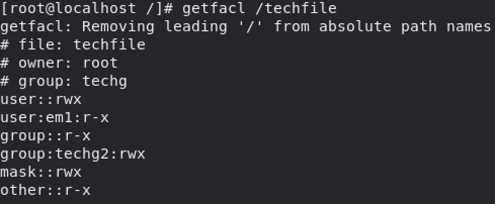

## 4.1 Linux用户管理概述

- 用户管理是现在操作系统很重要的一个功能。Linux系统拥有非常优良的用户管理特性。本节主要介绍Linux系统用户管理的基础知识。

### 4.1.1 Linux用户的工作原理

#### 用户分类 
- Linux操作系统是多用户多任务的操作系统，允许多个用户同时登录到系统，使用系统资源。用户类型如下：
  - 超级用户账户（root）：也叫管理员账户，它的任务是对普通用户和整个系统进行管理。
  - 系统用户：Linux系统内部账号，不能用于登录系统。
  - 普通用户账户：在系统中只能进行普通工作，只能访问它们拥有权限执行的文件。
  - 组：具有相同特性的用户的集合。
  - 一个用户可以同时是多个组的成员,每个用户只有一个主组，可以有多个附属组。

#### 用户参数
- Linux用户帐户参数如下表4.1.1所示。

表4.1.1

---

| 概念 | 描述 |
| --- | --- |
| 用户名 | 用来标识用户的名称，可以是字母、数字组成的字符串，区分大小写 |
| 密码 | 用于验证用户身份的特殊验证码 |
| 用户标识（UID） | 用来表示用户的数字标识符 |
| 用户主目录 | 用户的私人目录，也是用户登录系统后默认所在的目录 |
| 登录shell | 用户登录后默认使用的shell程序，默认为/bin/bash |
| 组 | 具有相同属性的用户属于同一个组 |
| 组标识（GID） | 用来表示组的数字标识符 |

---

- root用户的UID为0；系统用户的UID从1到999；普通用户的UID可以在创建时由管理员指定，如果不指定，用户的UID默认从1000开始顺序编号。

- 创建用户账户的同时也会创建一个与用户同名的组，该组是用户的主组。普通组的GID默认也是从1000开始编号。

#### 用户登陆过程

- 用户要使用Linux系统，必须先进行登陆。用户登陆包括以下步骤：

  - 当Linux系统正常引导完成后，系统就可以接纳用户的登陆。这时用户终端上显示"login:"提示符，如果是图形界面，则会显示用户登陆窗口，这时就可以输入用户密码。
  - 用户输入用户名后，系统会检查/etc/passwd文件判断是否有该用户，如果不存在，则退出，如果存在则进行下一步。
  - 读取/etc/passwd中的用户ID和组ID，同时该账户的其他信息（如用户的主目录也会一并读出）。
  - 用户输入密码后，系统通过检查/etc/shadow文件来判断密码是否正确。如密码校验通过，这时就进入系统并启动系统的Shell,系统启动的Shell类型由/etc/passwd文件中的信息确定。通过系统提供的Shell接口可以操作Linux系统。
  
### 4.1.2 Linux用户管理机制

- Linux中的用户管理涉及到3个文件,这些文件为纯文本文件，可以使用cat等命令查看内容。
- 用于保存用户账号的文件/etc/passwd，如图4.1.2所示。


图4.1.2

- /etc/passwd记录了每个用户的必要信息，文件中的每一行对应一个用户的信息，每行的每个字段之间使用"冒号"分隔，共7个字段,每一个字段的含义为：
- 用户名：密码：UID：GID：用户的描述信息：主目录：登录的shell类型

- 表4.1.3列出了每个字段的作用。

表4.1.3

---

| 字段 | 说明 |
| --- | --- |
| 用户名 | 用户账号名称，用户登录时所使用的用户名 |
| 密码 | 用户口令，使用字母"x"来填充该字段，真正的密码保存在/etc/shadow文件中 |
| UID | 用户编号，唯一表示某用户的数字标识 |
| GID | 用户所属的组号，该数字对应/etc/group文件中的GID |
| 用户描述信息 | 可选的关于用户全名、用户电话等描述性信息 |
| 主目录 | 用户的宿主目录，用户成功登录后的默认目录 |
| 命令解释器 | 用户所使用的Shell，默认为"/bin/bash" |

---

- 用于保存用户密码的文件/etc/shadow，如图4.1.4所示。


图4.1.4

- 该文件为文本文件，但这个文件只有超级用户才能读取，普通用户没有权限读取。shadow文件每条有9个字段组成，每一个字段的含义为：
- 用户名：密码：上次修改密码的时间：两次修改密码间隔的最少天数：两次修改密码间隔的最多天数：提前多少天警告用户密码过期：在密码过期多少天后禁用此用户：用户过期时间：保留字段

- 表4.1.5列出了每个字段的作用

表4.1.5

---

| 字段 | 说明 |
| --- | --- |
| 用户名 | 用户登录名 |
| 密码 | 加密后的用户口令，"\*"表示非登录用户，"！！"表示没设置密码 |
| 上次修改密码的时间 | 用户最近一次口令被修改的天数 |
| 两次修改密码间隔的最少天数 | 用户可以更改密码的天数，即最短口令存活期 |
| 两次修改密码间隔的最多天数 | 用户必须更改密码的天数，即最长口令存活期 |
| 提前多少天警告用户密码过期 | 口令过期前几天提醒用户更改口令 |
| 在密码过期多少天后禁用此用户 | 口令过期后几天账户被禁用 |
| 用户过期时间 | 口令被禁用的具体日期（相对日期，从1970年1月1日至禁用时的天数） |
| 保留字段 | 保留字段，用于功能扩展 |

---

- 用于保存用户组的文件/etc/group，如图4.1.6所示。


图4.1.6

- 该文件用于保存用户组的所有信息，通过它可以更好地对系统中的用户进行管理，每一个字段的含义为：
- 组名：组密码：组标识号：组内用户列表

- 表4.1.7列出了每个字段的作用

表4.1.7

---

| 字段 | 说明 |
| --- | --- |
| 用户名 | 用户登录名 |
| 密码 | 加密后的用户口令，"\*"表示非登录用户，"！！"表示没设置密码 |
| 上次修改密码的时间 | 用户最近一次口令被修改的天数 |
| 两次修改密码间隔的最少天数 | 用户可以更改密码的天数，即最短口令存活期 |
| 两次修改密码间隔的最多天数 | 用户必须更改密码的天数，即最长口令存活期 |
| 提前多少天警告用户密码过期 | 口令过期前几天提醒用户更改口令 |
| 在密码过期多少天后禁用此用户 | 口令过期后几天账户被禁用 |
| 用户过期时间 | 口令被禁用的具体日期（相对日期，从1970年1月1日至禁用时的天数） |
| 保留字段 | 保留字段，用于功能扩展 |

---

## 4.2 Linux用户管理命令

- Linux系统提供了一系列的命令来管理系统中的用户。本节主要介绍用户的添加、删除、修改。

### 4.2.1 添加用户命令useradd

#### 命令简介

- useradd命令用来建立用户帐号和创建用户的起始目录。

#### 命令语法
```shell
useradd [option] username

#option：useradd命令的选项
#username：需要添加的用户名
```

#### 命令参数，如表4.2.1所示 {#命令参数如表4.2.1所示 .unnumbered}

表4.2.1

---

| 参数 | 作用 |
| --- | --- |
| -c | 用户的注释性信息 |
| -d | 指定用户的主目录 |
| -g | 用户所属主组群的组群名称或者GID |
| -G | 用户所属的附属组群列表，多个组群之间用逗号分隔 |
| -m | 若用户主目录不存在则创建它 |
| -M | 不创建用户主目录 |
| -n | 不为用户创建用户私人组群 |
| -p | 加密的口令 |
| -r | 创建UID小于500的不带主目录的系统账号 |
| -s | 指定用户的登录Shell，默认为"/bin/bash" |
| -U | 指定用户的UID，必须是唯一的，且大于499 |

---

#### 命令实例演示 {#命令实例演示 .unnumbered}
```shell
#添加用户user1。
useradd user1

#添加用户user2并指定主目录为/opt/user2。
useradd -d /opt/user2 user2

#添加用户user3，UID为1010，用户的主目录为/home/user3，用户的Shell为/bin/bash，用户的密码为123456，账户永不过期。操作如图4.2.4所示。
useradd -u 1010 -d /opt/user3 -s /bin/bash -p 123456 -f -1 user3
```

### 4.2.2 更改用户命令usermod

#### 命令简介 

- 如果对已有的用户信息进行修改，可以使用usermod命令。

#### 命令语法
```shell
usermod [option] username

#option：usermod命令的选项
#username：需要修改的用户名
```

#### 命令参数，如表4.2.2所示

表4.2.2

---

| 参数   | 作用                                                     |
|--------|----------------------------------------------------------|
| -c     | 填写用户账户的备注信息                                   |
| -d -m  | 参数-m与参数-d连用，可重新指定用户的家目录并自动把旧的数据转移过去 |
| -e     | 账户的到期时间，格式为"YYYY-MM-DD"                        |
| -g或者-G| 变更所属用户组                                           |
| -L     | 锁定用户禁止其登录系统                                   |
| -U     | 解锁用户，允许其登录系统                                 |
| -s     | 变更默认终端                                             |
| -u     | 修改用户的UID                                            |

---

#### 命令实例演示
- 将user1用户加入root组中，并使用"id"命令查看是否添加成功。如图4.2.3所示。


图4.2.3

- 将用户user1用户的UID号设置5000,并使用"id"命令查看user1用户的UID。如图4.2.4所示。


图4.2.4

- 修改用户user1用户的主目录为/var/user1，修改启动Shell为/sbin/nologin。修改完成后使用"cat /etc/passwd \| grep user1"命令查看修改后的状态。如图4.2.5所示。


图4.2.5

### 4.2.3 删除用户命令userdel

#### 命令简介 

- userdel命令用于删除已经创建好的用户。

#### 命令语法
```shell
userdel [option] username

#option：usedel命令的选项
#username：需要删除的用户名
```

#### 命令参数，如表4.2.6所示

表4.2.6

---

 | 参数 | 作用 |
| ---- | ---- |
| -r | 删除用户主目录以及目录中所有的文件并且删

---

- **注意：**
  - **如果不加-r选项，userdel命令会在系统中所有与账户有关的文件中（例如/etc/passwd，/etc/shadow，/etc/group）将用户的信息全部删除。**
  - **如果加-r选项，则在删除用户账户的同时，还将用户主目录以及其下的所有文件和目录全部删除。**

#### 命令实例演示

```shell
#删除user1但不删主目录。
userdel user1

#删除user2并且删除主目录。
userdel -r user2
```

### 4.2.4 设置用户密码命令passwd

#### 命令简介 

- 出于系统安全考虑，当建立用户后，需要设置其对应的密码。设置修改Linux用户的密码可以使用passwd命令。root用户可以更改任何用户的密码，普通用户只能修改自己的密码。

#### 命令语法
```shell
passwd [option] username

#option：passwd命令的选项
#username：需要设置密码的用户
```

#### 命令参数，如表4.2.7所示

表4.2.7

---

| **参数** | **作用** |
| -------- | -------- |
| -l       | 锁定（停用）用户账户 |
| -u       | 口令解锁 |
| -d       | 将用户口令设置为空，这与未设置口令的账户不同。未设置口令的账户无法登录系统，而口令为空的账户可以 |
| -f       | 强迫用户下次登录时必须修改口令 |
| -n       | 指定口令的最短存活期 |
| -x       | 指定口令的最长存活期 |
| -w       | 口令要到期前提前警告的天数 |
| -i       | 口令过期后多少天停用账户 |
| -S       | 显示用户密码是否被锁定，以及密码所采用的加密算法名称 |


---

#### 命令实例演示
- 修改root用户密码为"123456"，如图4.2.8所示。


图4.2.8

- 锁定user1用户，并测试密码是否被锁定，如图4.2.9所示。


图4.2.9

### 4.2.5 切换用户命令su
#### 命令简介 
- su命令用于在不同的用户之间切换。比如使用user1登陆了系统，但要执行一些管理操作，比如useradd,普通用户是没有这个权限的。解决方法有两种：
  - 退出user1用户，重新以root用户登陆系统。
  - 不需要退出user1用户，通过使用su命令切换到root下进行添加用户的工作，添加完后再以su命令切换回user1。
- 超级用户root切换到普通用户是不需要密码的，而普通用户之间的切换或切换到root都是需要输入密码的。

#### 命令语法 
```shell
su [option] username

#option：su命令的选项
#username：需要切换的用户
```

#### 命令参数，如表4.2.10所示

表4.2.10

---

| 参数 | 作用                                                         |
|------|--------------------------------------------------------------|
| -l   | 登录并改变到所切换的用户环境                                 |
| -c   | 执行一个命令，然后退出所切换的用户环境                     |


---

#### 命令实例演示 
- 从root用户切换到user1用户，并使用"id"命令查看用户状态。如图4.2.11所示。


图4.2.11

- 从user1用户切换到root用户，并使用"id"命令查看用户状态。如图4.2.12所示。


图4.2.12

### 4.2.6 提权命令sudo

#### 命令简介 

- 在Linux系统中，管理员往往有很多个，如果每位管理员都用root身份进行日常管理工作，权限控制是一个必须面对的问题。普通用户的日常操作权限权限受到限制的，如何让普通用户也可以运行也可以进行一些系统管理工作，sudo命令很好的解决了这个问题。通过sudo命令可以允许用户通过特定的方式使用需要root才能运行的命令或程序。
- sudo命令允许一般用户不需要知道root用户的密码即可获得超级管理员权限。Linux系统将普通用户或组的身份执行等信息，都登记在/etc/sudoers文件中，这样就能完成对用户或组的授权。

#### 命令语法 
```shell
sudo [option] command

#option：sudo命令的选项
#command：需要执行的命令
```

#### 命令参数，如表4.2.13所示

表4.2.13

---

| 参数 | 作用 |
| --- | --- |
| -g | 强制把某个ID分配给已经存在的用户组，该ID必须是非负并且唯一的值 |
| -b | 在后台执行指令 |
| -h | 显示帮助 |
| -k | 结束密码的有效期限，下一次再执行sudo时仍需要输入密码 |
| -l | 列出目前用户可执行与无法执行的命令 |
| -s | 执行指定的Shell |
| -u | 以指定的用户作为新的身份。若不加上此参数，则默认以root作为新的身份 |

---

#### 命令实例演示

- 通过sudo命令让user1用户可以使用fdisk查看系统磁盘状态。如图4.2.14所示。


图4.2.14

## 4.3 Linux组管理命令

- Linux系统提供了一系列的命令来管理系统中的组。本节主要介绍组的添加、删除、修改以及将用户加入组。

### 4.3.1 添加组命令groupadd

#### 命令简介 

- groupadd命令实现用户组的添加。

#### 命令语法
```shell
groupadd [option] groupname

#option：groupadd命令的选项
#groupname：需要添加的组名
```

#### 命令参数，如表4.3.1所示

表4.3.1

---

| 参数 | 作用 |
| ---- | ---- |
| -g | 强制把某个ID分配给已存在的用户组，该ID必须是非负并且唯一的值 |
| -o | 允许多个不同的用户组使用相同的用户组ID |
| -p | 用户组密码 |
| -r | 创建一个系统组 |

---

#### 命令实例演示

```shell
#添加一个新的组，组名为group1。
groupadd group1
```

### 4.3.2 添加组命令groupdel

#### 命令简介

- groupdel实现用户组的删除，如果该群组中仍然包括某些用户，则必须先删除这些用户后，才能删除群组。

#### 命令语法
```shell
groupdel [option] groupname

#option：groupadd命令的选项
#groupname：需要删除的组
```

#### 命令参数，如表4.3.2所示 
表4.3.2

---

| 参数   | 作用                                       |
|--------|--------------------------------------------|
| -h     | 显示此帮助信息并退出                      |
| -R     | chroot 到的目录                            |

---

#### 命令实例演示 
```shell
#删除group1组。
groupdel group1
```

### 4.3.3 添加组命令groupmod

#### 命令简介

- groupmod命令可以更改用户组的组ID或名称。

#### 命令语法
```shell
groupmod [option] groupname

#option：groupmod命令的选项
#groupname：需要修改的组
```

#### 命令参数，如表4.3.3所示

表4.3.3

---

| 参数 | 作用 |
|------|------|
| -g | 修改组GID |
| -n | 修改组名 |
| -o | 强制接受更改的组的GID为重复的编号 |

---

#### 命令实例演示

- 将group1组的GID修改成2000，将组群名称修改成group2。并使用"cat /etc/group \| grep group"命令查看是否修成功。如图4.3.4所示。


图4.3.4

#### 4.3.3 指定组管理员命令gpasswd

#### 命令简介
- gpasswd用于指定组管理员和为组设置密码。

#### 命令语法 
```shell
gpasswd [option] groupname

#option：groupmod命令的选项
#groupname：需要配置的组名
```

#### 命令参数，如表4.3.5所示 

表4.3.5

---

| 参数 | 作用 |
|------|------|
| -a   | 把用户加入组 |
| -d   | 把用户从组中删除 |
| -r   | 取消组的密码 |
| -A   | 给组指派管理员 |

---

#### 命令实例演示 
```shell
#将user1用户加入user2组。
gpasswd -a user1 user2

#指派user1用户为管理员。
gpasswd -A user1 user2
```
## 4.4 ACL访问控制权限

- 在Linux普通用户权限系统中，用户对文件只有三种身份，就是属主、属组和其他人；每种身份拥有读（read）、写（write）和执行（execute）三种权限。但是在解决实际问题的时候，光靠这3个权限是不够的。
- ACL（Access Control List，访问控制列表）。在Linux系统中，ACL用于设定用户针对文件的权限，用来解决一些更复杂的权限问题。本节主要介绍ACL的相关内容。

### 4.4.1 ACL命令 

#### getfacl 
##### 命令简介 
- getfacl命令是用于显示文件或目录的ACL策略。

##### 命令语法
```shell
getfacl [option] file

#option：getfacl命令的选项
#file：需要查看acl权限的文件
```

##### 命令参数，如表4.4.1所示 
表4.4.1

---

| 参数 | 作用 |
|------|------|
| -a | 显示文件的ACL |
| -d | 显示默认的ACL |
| -c | 不显示注释标题 |
| -e | 显示所有的有效权限 |
| -E | 显示所有的无效权限 |
| -s | 跳过文件，只具有基本条目 |
| -R | 递归到子目录 |
| -t | 使用表格输出格式 |
| -n | 显示用户的UID和组群的GID |

---

#### setfacl

##### 命令简介 

- setfacl命令用于设置文件访问控制列表。

##### 命令语法 
```shell
setfacl [option] file

#option：setacl命令的选项
#file：需要修改acl权限的文件
```

##### 命令参数，如表4.4.2所示

表4.4.2

---

| 参数 | 作用 |
| ---- | ---- |
| -b | 删除所有扩展的ACL条目。所有者，组和其他所有者的基本ACL条目将保留 |
| -k | 删除默认ACL。如果不存在默认ACL，则不会发出警告 |
| --mask | 即使已明确给出ACL掩码条目，也要重新计算有效权限掩码 |
| -d | 所有操作均适用于默认ACL。输入集中的常规ACL条目将提升为默认ACL条目。输入集中的默认ACL条目将被丢弃 |
| -test | 测试模式。列出更改后的ACL而不是更改任何文件的ACL |
| -R | 递归地将操作应用于所有文件和目录。此选项不能与"--restore"混合使用 |

---

- **setfacl可以识别以下ACL条目格式**,如表4.4.3所示：

表4.4.3

---

| 参数 | 作用 |
| ---- | ---- |
| [ d [ default ] :] [ u [ser] : ] uid [:perms] | 用户标识为uid的用户的权限，或者如果uid为空，则为文件所有者的权限 |
| [ d [ default ] :] g [roup] :gid [ :perms ] | 组ID为gid的组的权限，如果gid为空，则为所属组的权限 |
| [ d [ default ] :] m [ask] [:] [ :perms ] | 有效的权限掩码 |
| [ d [ default ] :] o [ther] [:] [ :perms ] | 其他人的许可 |


---

### 4.4.2 ACL实例演示

#### 实例说明 
- 公司要求创建一个公共的目录，路径为/techfile
- 公司中技术部的每个员工都可以访问和修改这个目录，老板需要对这个目录拥有访问和修改权限，其他部门的员工不能访问这个目录。

- 为了满足以上要求可以做如下配置：老板使用 root 用户，作为这个目录的属主，权限为"rwx"；技术部所有的员工都加入techg组，使techg组作为/techfile目录的属组，权限是"rwx"；其他人的权限设定为0。这样这个目录的权限就能符合要求了。

- 突然有一天，公司来了一位新的员工em1，他必须能够访问/techfile目录，所以必须对这个目录拥有 "r "和 "x"权限；但又不能赋予他"w"权限，所以员工 em1的权限就是 "r-x"。

- 如果出现上述情况，我们来分析以下配置：
  - 将em1用户变为属主，这样老板（root用户）就没有权限了。
  - 将em1用户加入techg组。这样做也不行，因为 techg 组的权限是"rwx"，但是 em1 员工的权限是" r-x"。
  - 将其他人的权限改为" r-x"，那么公司所有员工都可以访问/techfile目录了。
  
- 当出现这种情况时，普通权限中的三种身份就不够用了。ACL权限就是为了解决这个问题的。在使用 ACL 权限给用户em1赋予权限时，em1既不是 /techfile目录的属主，也不是属组，仅仅赋予用户em1针对此目录的"r-x"权限。这有些类似于Windows系统中分配权限的方式，单独指定用户并单独分配权限，这样就解决了用户身份不足的问题。

#### 实例分析

- root是/techfile目录的属主，权限是"rwx"；techg是此目录的属组，techg组中拥有公司员工 em2 和 em3，权限是"rwx"；其他人的权限是0。当新员工em1来后，权限是"r-x"。

#### 具体配置过程

- 添加配置需要的用户和组，如图4.4.4所示。


图4.4.4

- 创建techfile目录，并修改techfile目录的属组为techg，如图4.4.5所示。


图4.4.5

- 配置员工em1的acl权限。
```shell
setfacl -m u:em1:rx /techfile

#使用"u：用户名：权限"的格式，将读和执行权限赋予em1用户
```

- 此时使用命令"ls -l -d /techfile"查看techfile文件属性，发现权限后面多了一位"+"号，表示此目录拥有ACL权限。如图4.4.6所示。


图4.4.6

- 使用getfacl命令查看techfile目录的ACL 权限。如图4.4.7所示。


图4.4.7

- 表4.4.8列出了图4.4.7展示的每一项含义。

表4.4.8

---

|   参数   |             作用            |
| -------- | -------------------------- |
| #file    | 文件名                      |
| #owner   | 文件的所有者               |
| #group   | 文件的所有组               |
| user::rwx | 所有者的ACL权限             |
| user:em1:r-x | 用户em1的ACL权限        |
| group::r-x | 所有组的ACL权限            |
| mask::r-x | ACL的mask权限              |
| other::r-x | ACL的其他人的权限         |

---

- em1用户既不是/techfile目录的属主、属组，也不是其他人。通过ACL权限单独给em1用户分配了"r-x"权限。

### 4.4.3 ACL其他配置

- 为techfile目录添加一个techg2组的ACL权限，权限为rwx {#为techfile目录添加一个techg2组的acl权限权限为rwx
```shell
#新建techg2组。
groupadd techg2

#为techfile目录配置ACL权限。
setfacl -m g:techg2:rwx /techfile
```

- 使用getfacl命令查看techfile目录的ACL权限。如图4.4.8所示。


图4.4.8

#### mask权限 

- mask是用来指定最大有效权限的。mask的默认权限是"rwx"，如果给em1用户赋予了"r-x"的ACL权限，em1需要和mask的"rwx"权限相与才能得到em1的真正权限，也就是"r-x"相与"rwx"出的值是"r-x"，所以em1 用户拥有"r-x"权限。表4.4.9列出了权限相与运算。

表4.4.9

---

| **权限A** | **权限B** | **相与(and)运算** |
|-----------|-----------|-------------------|
| r         | r         | r                 |
| w         | \-        | \-                |
| x         | x         | x                 |
| \-        | \-        | \-                |

---

```shell
#配置techfile目录的mask文件为权限为r-x,使用格式为"m:权限"。

#配置techfile目录的mask权限。
setfacl -m m:rx /techfile
```

- 使用getfacl命令查看techfile目录的ACL权限。如图4.4.10所示。


图4.4.10

#### 删除指定的ACL权限
```shell
#删除techfile目录的em1用户的ACL权限。
setfacl -x u:em1 /techfile
```

- 删除所有ACL权限 {#删除所有acl权限 .unnumbered}
```shell
#删除techfile目录的所有ACL权限
setfacl -b /techfile
```