## 5.1 RPM应用程序管理器 

- 完善的软件管理机制对于操作系统来说是非常重要的，没有软件包管理器，用户使用操作系统将会变得非常困难，也不利于操作系统的推广。用户使用Linux系统时需要了解Linux的软件包管理机制，随着Linux的发展，目前形成了多种软件包管理机制，本节主要介绍RPM包管理器的使用。

### 5.1.1 RPM简介 

- RPM(Redhat Package Manager),类似于Windows里面的添加删除程序，最早由Red Hat公司研制。RPM软件包以".rpm"为扩展名。同时RPM也是一种软件包管理器，用户可以通过RPM包管理机制方便地进行软件的安装、更新、和卸载。

- RPM提供了非常丰富的功能，RPM软件是通过一定的机制把二进制文件或其他文件打包成一个文件。当使用RPM包进行安装时，通常是一个把二进制程序或其他文件复制到系统指定路径的过程。

### 5.1.2 RPM的使用

- RPM包对应rpm命令，表5.1.2介绍了rpm命令的参数：

<center>

表5.1.1

| 参数 | 说明 |
|------|------|
| -i   | 安装软件时显示软件包的相关信息 |
| -v   | 安装软件时显示命令的执行过程 |
| -h   | 安装软件时输出hash记号":#" |
| -q   | 使用查询模式，当遇到问题时，rpm指定会先询问用户 |
| -p   | 查询软件包的文件 |
| -l   | 显示软件包的文件列表 |
| -U   | 升级指定的软件 |
| -e   | 从系统中删除指定的软件包 |
| -a   | 显示安装的所有软件列表 |

</center>
------------------- ---------------------------------------------------

### 5.1.3 RPM实例演示 

#### 实例说明 
- 通过RPM软件包管理器，安装mdadm工具（动态磁盘创建工具）。

#### 具体步骤 

- mdadm工具的安装文件在Linux安装光盘的镜像文件中，首先挂载Linux的安装光盘到/opt/cd目录下，如图5.1.1所示。
<center>

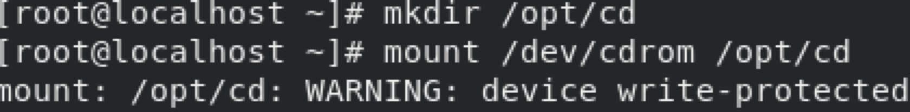
图5.1.1

</center>

- mdadm安装包路径为/opt/cd/BaseOS/Packages。进入该目录后输入命令"ls -l
- mdadm"按下键盘上的"Tab"键,就能看到mdadm安装包的完整名称。如图5.1.2所示。

<center>

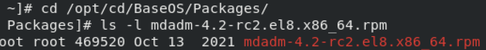
图5.1.2

</center>

- 使用命令"rpm -ivh"安装mdadm工具。如图5.1.3所示。

<center>

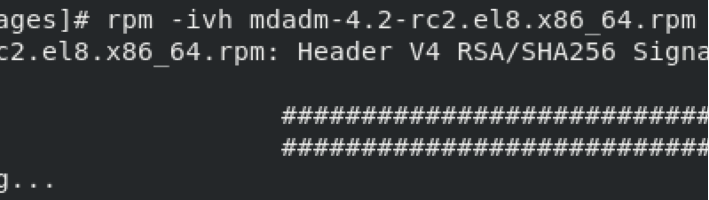
图5.1.3

</center>

- 使用"rpm -qpl"命令查看mdadm工具的安装位置和安装的文件列表。如图5.1.4所示。

<center>

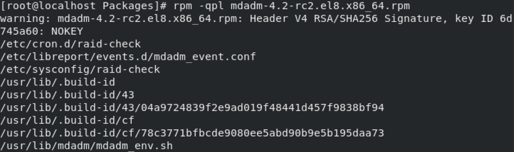
图5.1.4

</center>

#### RPM其他应用 

##### 强制安装与更新数据包
- 在Linux安装软件包时，有时会出现包相互依赖的问题，这会导致软件包不能安装。这时可以使用"nodeps"和"force"参数跳过软件包的依赖检查，从而完成软件包的安装，如图5.1.5演示了跳过依赖检查安装ftp工具。

<center>

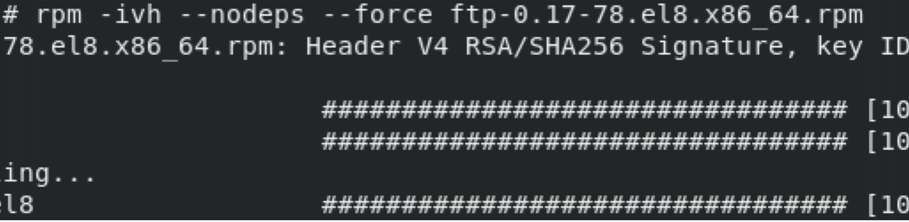
图5.1.5

</center>

- 使用"rpm -Uvh"命令可以更新已经安装好的软件。更新软件时，如果有配置文件的，为了保证新版本的运行，RPM包管理器会将该软件对应的配置文件重命名，然后安装新的配置文件，新旧文件的保存使得用户有更多选择。如图5.1.6演示了升级mdadm工具。

<center>

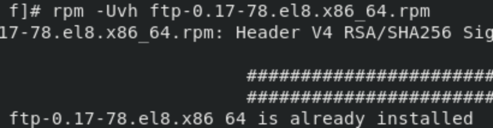
图5.1.6

</center>

##### 查看系统中已经安装的软件包
- 使用"rpm -qa"命令查看系统中所有的软件包，如图5.1.7所示。

<center>

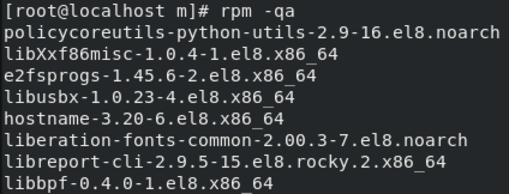
图5.1.7

</center>

- 使用"rpm -qa \| grep ftp"命令查看已经安装好的ftp软件包，如图5.1.8所示。

<center>

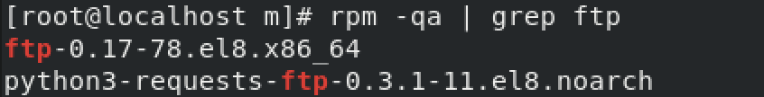
图5.1.8

</center>

##### 卸载软件包 

- RPM包管理器提供了对应的参数进行软件的卸载。如果卸载的软件被其他软件依赖，则需要先将依赖卸载后，才能卸载当前软件,下面示例演示了卸载mdadm工具。

- 通过"rpm -qa"命令查找是否安装了mdadm软件包。如图5.1.9所示。

<center>

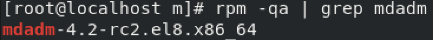
图5.1.9

</center>

- 由于卸载mdadm有关联的安装包，所以要使用"rpm -e
  - \--nodeps"命令跳过关联包检查。卸载完后使用"mdadm
  - \--help"命令查看是否卸载成功。如图5.1.10所示。

<center>

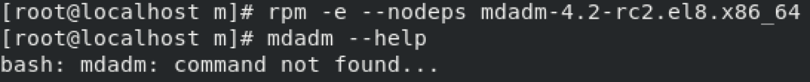
图5.1.10

</center>

## 5.2 YUM应用程序管理器

- YUM（全称为Yellow dog Updater，Modified）是一个在Fedora和RedHat以及CentOS中的Shell前端软件包管理器。基于RPM包管理，能够从指定的服务器自动下载RPM包并且安装，使用YUM安装软件包，无需像RPM一样手动安装依赖包，YUM会自动的安装的所有对应的依赖包。本节将介绍YUM应用程序管理器。

### 5.2.1 YUM安装源介绍 
- YUM源是一个软件仓库，或者说是软件包的集合，仓库可以是远程仓库也可以是本地仓库。
- YUM源的设置是为了方便日后对软件包的管理，解决单独安装RPM软件包时可能产生的软件包依赖关系。
- 通常企业会设置自己的YUM源（库）方便企业Linux系统对软件包的管理。

### 5.2.2 YUM软件包管理器配置文件介绍
- YUM配置文件路径为/etc/yum.conf，表5.2.1列出了yum.conf文件的各项参数解析。

<center>

表5.2.1

| 参数                               | 功能                                                       |
|------------------------------------|------------------------------------------------------------|
| gpgcheck=1                         | 指定是否检查GPG（GNU Privacy Guard）签名的软件包。         |
| installonly_limit=3                | 指定在安装新的内核包时，最多保留的旧内核包的数量。         |
| clean_requirements_on_remove=True  | 指定是否在卸载软件包时自动删除其所依赖的其他软件包。       |
| best=True                          | 指定是否安装适合本系统架构的最佳软件包。                   |
| skip_if_unavailable=False          | 指定是否跳过安装没有信任的软件包。                         |

</center>

------------------------------------- ------------------------------------

- YUM仓库文件(YUM的更新源文件)路径为/etc/yum.conf.d/\*.repo，可以同时配置多个源文件,默认情况下/etc/yum.conf.d目录下有一些预设的源文件，这些都是远程仓库，如图5.2.2展示了Centos8的预设远程仓库文件。

<center>

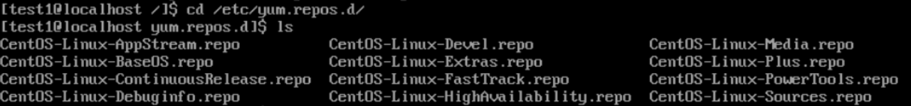
图5.2.2

</center>

- repo文件是yum源的配置文件，通常repo文件定义了一个或者多个软件仓库参数。表5.2.3是对repo源文件的解析。

<center>

表5.2.3

| 参数          | 功能                                                                                                                      |
|---------------|---------------------------------------------------------------------------------------------------------------------------|
| [appstream]   | 方括号中是软件源的名称，将被yum取得并识别。必须是唯一的，以便区分其他软件源。                                               |
| name          | 对软件仓库的描述，通常是为了方便阅读配置文件。可以不配置，但为了更好地描述软件仓库，建议填写一些有意义的描述。                  |
| mirrorlist    | 软件仓库地址的合集，代表多个软件仓库地址。当有多个软件仓库时，yum将使用此列表来查找最佳的软件仓库地址。如果baseurl已经配置，则不需要配置此参数。 |
| baseurl       | 软件仓库的地址，可以是远程地址，也可以是本地地址。如果没有配置mirrorlist，则必须配置此参数。                                  |
| gpgcheck      | 表示这个repo中下载的rpm将进行gpg的校验，已确定rpm包的来源是有效和安全的。如果启用了gpg校验，则需要配置gpgkey参数来指定gpg密钥的位置。           |
| enabled       | 表示这个repo中定义的源是否启用。如果为0，则禁用该源。                                                                     |
| gpgkey        | 定义用于校验的gpg密钥。如果启用了gpgcheck，则需要配置此参数来指定gpg密钥的位置。可以使用本地路径或HTTP/HTTPS地址来指定gpg密钥的位置。       |

</center>

----------------- -------------------------------------------------------------------------

### 5.2.3 YUM的使用

#### yum命令的语法 
```shell
yum [options] [command] [package]

#options：yum命令可选项。
#command：要进行的操作。
#package操作的对象。
```
#### yum命令介绍如表5.2.4所示。

<center>
表5.2.4

| 命令                     | 功能                                        |
|-------------------------|---------------------------------------------|
| yum install [package]    | 安装指定的安装包package                     |
| yum update [package]     | 更新指定程序包package                       |
| yum check-update         | 检查可更新的程序                            |
| yum upgrade [package]    | 升级指定程序包package                       |
| yum info [package]       | 显示安装包信息package                        |
| yum list                 | 显示所有已经安装和可以安装的程序包          |
| yum list [package]       | 显示指定程序包安装情况package                |
| yum remove [package]     | 删除程序包package                            |
| yum deplist [package]    | 查看程序package依赖情况                      |
| yum clean packages       | 清除缓存目录下的软件包                      |
| yum clean all            | 清除缓存目录下的软件包及旧的headers。        |

</center>

--------------------------- -------------------------------------------

#### yum本地仓库搭建

- 使用Linux光盘镜像中的软件安装包搭建本地yum仓库，仓库路径为/opt/warehouse。
- 在/目录下创建临时目录temp，并将光盘内容挂载/temp目录，操作如图5.2.5所示。

<center>

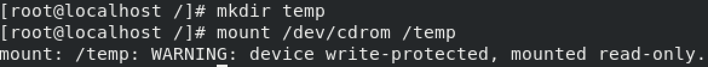
图5.2.5

</center>

- 创建/opt/warehouse目录，然后分别将光盘中"AppStream"和"BaseOS"目录，复制到/opt/warehouse下。操作如图5.2.6。

<center>

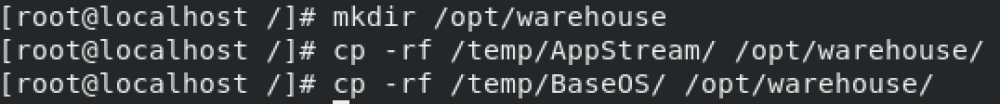
图5.2.6

</center>

- "AppStream"和"BaseOS" 两个目录中保存了光盘镜像中的软件安装包文件。

- 创建yum仓库文件，进入/etc/yum.repo.d目录，使用mv命令将预设的仓库文件移动到/opt/yum.repo.d下，命令如下。
```shell
mv /etc/yum.repos.d/* /opt/yum.repo.d/
```

- 回到/etc/yum.repo.d目录中，新建一个名为local.repo的本地仓库文件，如图5.2.7所示。

<center>

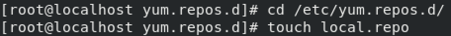
图5.2.7

</center>

- 编辑local.repo文件，添加如图5.2.8所示内容。

<center>


图5.2.8

</center>

- 表5.2.9列出了local.repo文件个各项参数说明。

<center>
表5.2.9


| 参数          | 功能                         |
| ------------- | ---------------------------- |
| [warehousea]  | 仓库的名称，本例中为warehousea |
| name=AppStream | 仓库的描述，本例中为AppStream   |
| baseurl=file:///opt/warehouse/AppStream | 仓库的路径地址；仓库的路径地址可以指向本地，ftp和互联网，可分别配置为：file://、ftp://和http://。注意Linux中一切都以根目录作为起始目录所以路径开头要加上/。"file:///opt/warehouse/AppStream"表示仓库目录在"/opt/warehouse/Packages"下 |
| enable=1      | 是否启用仓库，1为启用，0为不启用 |
| gpgcheck=0    | 是否检查软件密钥，1为检查，0为不检查 |

</center>

---

#### 使用搭建好的本地仓库安装BIND服务，使用命令为"yum install bind -y",如图5.2.10。 

<center>

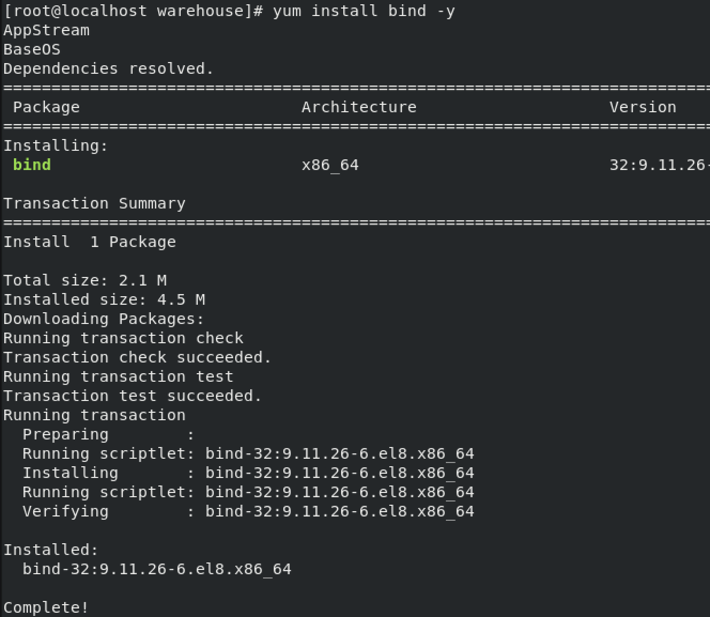
图5.2.10

</center>

#### 配置YUM远程更新源 

- 在/etc/yum.repo.d目录中有一些预设的远程源文件，但是这些文件的更新源地址都是国外的，由于网络原因，会非常慢。所以在国内我们一般会将YUM源替换为国内源。我们只需要将这些更新源下载下来，并放到/etc/yum.repo.d目录下就可以直接使用了。

- 使用下面的命令下载网易的YUM源：
```shell
wget http://mirrors.163.com/.help/CentOS7-Base-163.repo
#wget是linux下的一个下载文件工具
```