## 6.1 Linux网络配置概述

- 使用计算机首先要了解网络配置，本节主要介绍Linux系统的网络配置。

### 6.1.1相关网络配置文件说明

- Linux网络相关的配置文件在不同的Linux发行版中会有所不同，但总体结构都比较类似，表6.1.1列出了Centos8系统的网络配置文件架构。

<center>
表6.1.1


| 目录                                 | 说明                                                   |
| ------------------------------------ | ------------------------------------------------------ |
| /etc/sysconfig/network               | 该文件用于修改主机名称和是否启动network                  |
| /etc/sysconfig/network-scrips/ifcfg-网卡名 | 该文件用于设置网卡参数的文件，如IP地址、掩码等            |
| /etc/resolv.conf                     | 该文件用于设置DNS相关的信息，用于将域名解析到IP          |
| /etc/hosts                           | 该文件用于设置计算机的IP地址对应的主机名或对应的IP地址   |

</center>

-------------------------------------------- --------------------------------------------------------

### 6.1.2为Linux系统配置IP地址

- 配置Linux虚拟机的ip地址为"192.168.107.100"、掩码为"255.255.255.0"、网关为"192.168.107.254"。具体配置步骤如下：

- 使用vi工具编辑网卡配置文件，网卡配置路径为"/etc/sysconfig/network-scrips/ifcfg-网卡名"，其中网卡名根据每台虚拟机的网卡配置，可以通过ifconfig命令查看。本例中网卡名文"ens192"。网卡配置文件如图6.1.1所示。

<center>

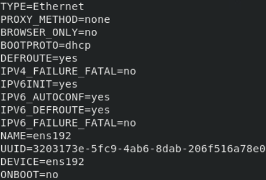
图6.1.1

</center>

- 对/etc/sysconfig/network-scrips/ifcfg-ens192配置文件进行修改，修改为如图6.1.2所示。

<center>

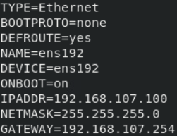
图6.1.2
</center>

- 表6.1.3列出了/etc/sysconfig/network-scrips/ifcfg-ens192各项参数的含义。

<center>

表6.1.3


| 参数       | 说明                                            |
| ---------- | ----------------------------------------------- |
| TYPE       | 网络类型，"Ethernet"表示以太网                  |
| BOOTPROTO  | 动态或者静态IP，"none"和"static"为静态,"dhcp"为动态|
| NAME       | 网络名称，描述符                                |
| DEVICE     | 网卡设备名称                                    |
| NOBOOT     | 系统启动时是否启动此网络接口，"yes"为启动，"no"为不启动|
| IPADDR     | IP地址                                          |
| NETMASK    | 子网掩码                                        |
| GATEWAY    | 网关                                            |
| DEFROUTE   | 是否有预设路由                                  |

</center>

---------------- ---------------------------------------------------------

- 设置完地址参数后，需要重启网络服务才能生效,使用以下命令完成网络服务重启:
```shell
systemctl restart NetworkManager

nmcli networking off

nmcli networking on
```

### 6.1.3配置主机名 
- 主机名是识别计算机在网络中的标识，设置主机名可以使用hostnamectl命令。将Linux主机名配置 homeLinux，操作如图6.1.4所示。

<center>

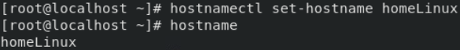
图6.1.4

</center>

### 6.1.4配置DNS服务器地址 

- 配置Linux系统的DNS服务器，需要修改配置文件/etc/resolve.conf。将Linux系统的DNS服务器配置为172.16.1.1。配置如图6.1.5所示。

<center>


图6.1.5

</center>

- "nameserver 172.16.1.1"是一台DNS服务器的地址。DNS服务器地址可以设置一个或多个，在解析时会按顺序往下解析。

### 6.1.5 SSH远程管理 {#ssh远程管理 .unnumbered}

#### SSH协议概述 

- SSH是一款远程管理工具，通过SSH客户端我们可以连接到运行了SSH服务器的主机上并且通过SSH协议来远程控制我们的远程主机。SSH协议在数据传输时是加密的，这提高了数据传输的安全性，并且数据在传输的过程中是压缩的，这样又保证了数据传输的效率。

#### SSH命令格式
```shell
ssh [-p port] user@remote

#user：是在远程机器上的用户名，如果不指定的话默认为当前用户
#remote：是远程机器的地址，可以是ip、域名或别名
#port：是ssh server监听的端口，如果不指定，就为默认值22
```
#### SSH配置实例

##### 实例说明

- 在CentOS8主机开启了SSH服务。默认情况下Linux系统会安装好SSH服务并且设置为开机自动启动。在配置SSH服务器时，只需要配置好对应服务器的IP地址。

##### 实验环境 
- 表6.1.6列出了实验需要用到的虚拟机

<center>
表6.1.6


| **角色**       | **操作系统** | **IP地址**       |
|:--------------:|:------------:|:----------------:|
| SSH服务器      | Centos8.3    | 192.168.107.100   |
| 访问客户端     | Centos8.3    | 192.168.107.96    |

</center>

##### 具体步骤 
- 使用vi编辑/etc/sysconfig/network-scrips/ifcfg-ens192网卡配置文件，配置SSH服务器的IP地址。网卡配置如图6.1.6。

<center>


图6.1.6

</center>

- 重新启动网络服务，用于生效网络配置。操作如图6.1.7所示。

<center>


图6.1.7

</center>

- 在客户端使用"ssh root@192.168.107.100"命令连接SSH服务器，如图6.1.8所示。

<center>

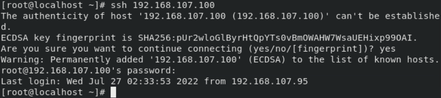
图6.1.8
</center>

## 6.2 网络管理命令 

- 为了更好的进行网络管理配置，需要了解网络管理命令的使用。本节主要介绍Linux系统中常用的网络管理命令。

### 6.2.1 网络检查命令ping 
#### 命令简介

- ping常常用来测试与目标主机是否可达，通过发送ICMP数据包到网络主机，显示响应情况，并根据输出信息来确定目标主机是否可达。由于某些服务器禁ping，从而使得ping命令的结果并不是完全可信的。

#### 命令语法 
```shell
ping [option] ip address

#option：ping命令的选项
#ip address：目标主机ip地址
```

#### 命令参数，如表6.2.1所示

<center>
表6.2.1


| 参数 | 说明 |
| ---- | ---- |
| -q | 不显示任何传送封包的信息，只显示最后的结果 |
| -n | 只输出数值 |
| -R | 记录路由过程 |
| -c | count 总次数 |
| -i | 时间间隔 |
| -t | 存活数值：设置存活数值TTL的大小 |
| -f | 极限检测。大量且快速地送网络封包给一台机器，看其回应 |

</center>

------------------ ------------------------------------------------------

#### 命令实例演示 
- 测试地址"192.168.107.254"的联通性(可以ping通的情况)，测试4次。如图6.2.2所示。

<center>

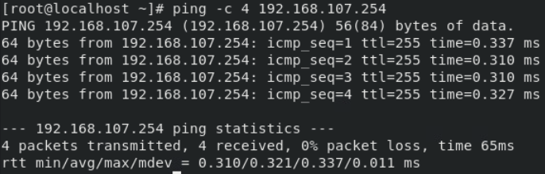
图6.2.2

</center>

- 测试地址"192.168.107.102"是否联通(不可以ping通的情况)，如图6.2.3所示。

<center>

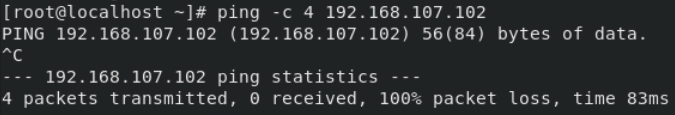
图6.2.3

</center>

### 6.2.2 网络配置密令ifconfig

#### .命令简介 

- ifconfig命令可以用于查看、配置、启用或禁用指定网络接口，如配置网卡的参数等。

#### 命令语法 
```shell
ifconfig [option] nicname

#option：ifconfig命令的选项
#nicname：网卡名称
```

#### 命令参数，如表6.2.4所示 

<center>
表6.2.4


| 参数          | 说明                                                     |
| ------------- | -------------------------------------------------------- |
| add           | 设置网络设备的IP地址                                     |
| del           | 删除网络设备的IP地址                                     |
| up            | 启动指定的网络设备                                       |
| down          | 关闭指定的网络设备                                       |
| netmask       | 设置网络设备的子网掩码                                   |
| tunnel        | 建立IPv4与IPv6之间的隧道通信地址                         |
| -broadcast    | 将要送往指定地址的数据包当成广播数据包来处理             |
| -pointopoint  | 与指定地址的网络设备建立直接连线，此模式具有保密功能     |
| -promisc      | 关闭或启动指定网络设备的promiscuous模式                   |

</center>

---------------------- ------------------------------------------------------

#### 命令实例演示 
- 查看网卡基本信息，如图6.2.5所示。

<center>

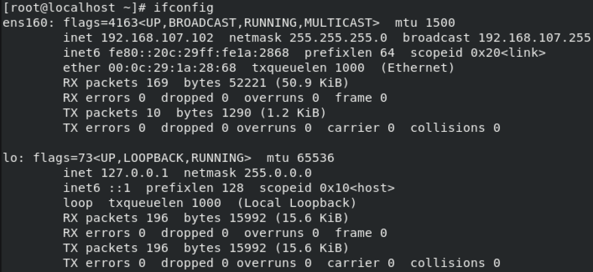
图6.2.5

</center>

- 表6.2.6显示了ifconfig命令所列出的每一行命令的含义。

<center>

表6.2.6

| 行号 | 说明                                              |
|------|---------------------------------------------------|
| 第一行 | 连接类型：UP（代表网卡启用状态）<br>RUNNING（代表网卡的网线被接上）<br>MULTICAST（支持组播）<br>MTU:1500（最大传输单元）：1500字节 |
| 第二行 | 网卡的IPv4地址、子网、掩码<br>本例中的IP地址为"192.168.107.102"，掩码为"255.255.255.0" |
| 第三行 | 网卡的IPv6地址、前缀码                            |
| 第四行 | Ethernet（以太网）HWaddr（硬件mac地址）           |
| 第五、六行 | 接收、发送数据包情况统计                        |
| 第七行 | 接收、发送数据字节数统计信息                      |
| 第八行 | 接受错误、丢失，冲突等字节数统计                  |

</center>

___


- 启动和关闭网卡"ens192"。
```shell
ifconfig ens192 up

ifconfig ens192 down
```

- 配置"ens192"网卡的IP地址为"192.168.107.103"，掩码为"255.255.255.0"。
```shell
ifconfig ens192 192.168.107.103 netmask 255.255.255.0
```

- 修改"ens192"网卡的MAC地址为"00:0C:29:7C:08:AA"。
```shell
ifconfig ens 192 hw ether 00:0C:29:7C:08:AA
```
- **注意：使用ifconfig命令修改的网卡参数都是临时的，一旦服务器重启所有的指令将失效。**

### 6.2.3 网络监控命令netstat 

#### 命令简介

- netstat命令用于系统网络配置和工作状况，可以显示内核路由表、活动的网络状态以及每个网络接口的流量情况。

#### 命令语法 
```shell
netstat [option]

#option：netstat命令的选项
```

#### 命令参数，如表6.2.6所示

<center>
表6.2.6


| 参数 | 说明 |
|------|------|
| -a | 显示所有socket，包括正在监听的 |
| -c | 每隔1秒就重新显示一遍，直到用户中断它 |
| -i | 显示所有网络接口的信息，格式同"ifconfig -e" |
| -n | 以网络IP地址代替名称，显示出网络连接情况 |
| -r | 显示核心路由表，格式同"route -e" |
| -t | 显示TCP协议的连接情况 |
| -u | 显示UDP协议的连接情况 |
| -v | 显示正在进行的工作 |

</center>

-------------------- --------------------------------------------------

#### 命令实例演示

- 显示所有端口，包含UDP和TCP端口，如图6.2.7所示。

<center>

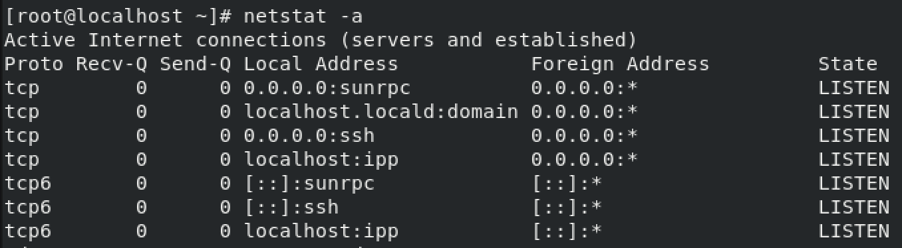
图6.2.7

</center>

- 显示所有TCP端口，如图6.2.8所示。

<center>

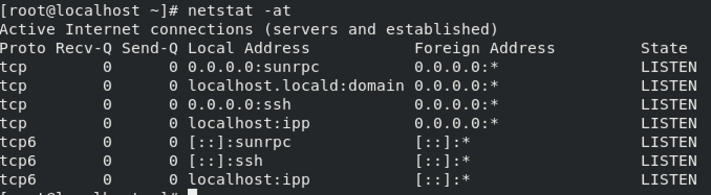
图6.2.8

</center>

- 显示所有的UDP端口，如图6.2.9所示。

<center>

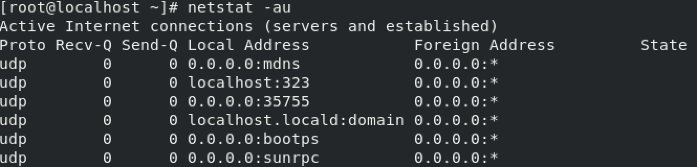
图6.2.9

</center>

- 显示所有处于监听状态的端口并以数字方式显示而非服务器名，如图6.2.10所示。

<center>

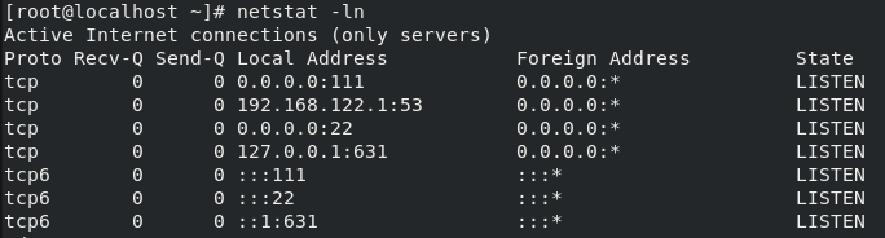
图6.2.10

</center>

- 显示核心路由信息，如图6.2.11所示。

<center>

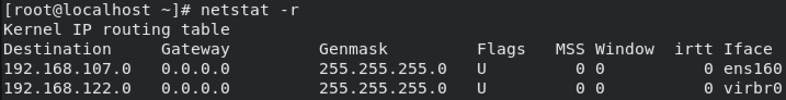
图6.2.11

</center>

- 显示网络接口列表，如图6.2.12所示。

<center>

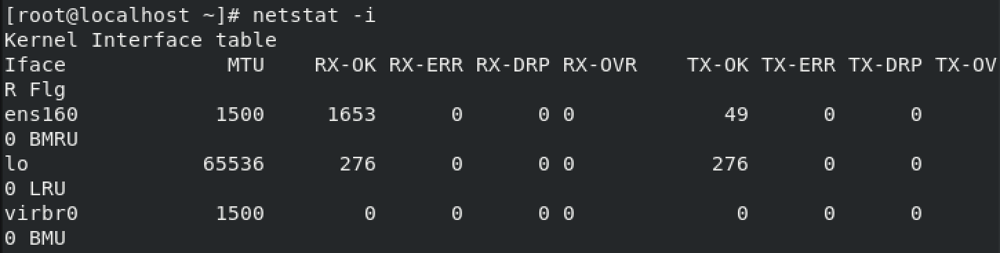
图6.2.12

</center>

### 6.2.4 路由探测命令traceroute 

#### 命令简介 

- traceroute命令用于跟踪数据包到达网络主机所经过的路由。原理是试图以最小的TTL发出探测包来跟踪数据包到达目标主机所经过的网关，然后监听一个来自网关ICMP应答。

#### 命令语法 
```shell
traceroute \[option\] ipaddress

#option：traceroute命令的选项
#ipaddress：ip地址
```

#### 命令参数，如表6.2.13所示

<center>
表6.2.13


| 说明 | 参数 |
|------|------|
| 使用Socket层级的排错功能 | -d |
| 设置第一个检测数据包的存活数值TTL的大小 | -f |
| 设置勿离断位 | -F |
| 设置来源路由网关，最多可设置8个 | -g |
| 使用指定的网络界面送出数据包 | -i |
| 使用ICMP回应取代UDP资料信息 | -l |
| 设置检测数据包的最大存活数值TTL的大小 | -m |
| 直接使用IP地址而非主机名称 | -n |
| 设置UDP传输协议的通信端口 | -p |

</center>

------------------ ----------------------------------------------------

#### 命令实例演示
- 显示本地到"www.baidu.com"所经过的路由信息。操作如图6.2.14所示。

<center>

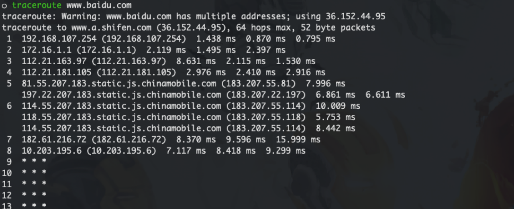
图6.2.14

</center>

### 6.2.5 下载文件wget 
#### 命令简介 

- wget类似于Windows中的下载工具，一般发行版Linux都内置了wget工具。

#### 命令语法 
```shell
wget [option] resource

#option：netstat命令的选项
#resource：下载资源链接地址
```
#### 命令参数，如表6.2.15所示 

<center>
表6.2.15


| 参数   | 说明                                       |
| ------ | ------------------------------------------ |
| `-b`   | 后台执行                                   |
| `-d`   | 显示调试信息                               |
| `-nc`  | 不覆盖已有的文件                           |
| `-c`   | 断点续传                                   |
| `-N`   | 只下载更新的文件                           |
| `-w`   | 重试延时（单位秒）                         |
| `-S`   | 显示服务器响应                             |

</center>

------------------- ---------------------------------------------------

#### 命令实例演示

- 使用wget命令下载"recommended.yaml"文件。使用如下命令：
```
wget https://raw.githubusercontent.com/kubernetes/recommended.yaml
```