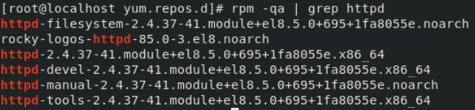
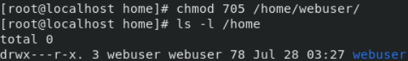
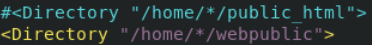

## 7.1 Web服务概述 
- Web服务基于HTTP或者HTTPS协议，用于实现静态资源和动态资源的请求与处理。静态资源包括静态网页、图片、JavaScript脚本、视频、音频等。动态资源包括程序和数据库，根据业务处理流程动态生成HTML网页，再将响应传给客户端。本节主要介绍Web服务的基础知识。

### 7.1.1 HTTP协议 

- HTTP（Hypertext Transfer Protocol，超文本传输协议）是一个非常重要的协议。Apache、IIS等都是HTTP协议的服务器软件，而微软的Internet Explorer和Mozilla的Firefox则是HTTP协议的客户端实现。

- HTTP请求的默认端口是TCP的80，但也可以使用其他端口（比如8080）。这就能让同一台服务器上运行多个Web服务，每个Web服务监听不同的端口。

### 7.1.2 HTTPS协议

- HTTPS （Secure Hypertext Transfer Protocol）安全超文本传输协议，是一种通过计算机网络进行安全通信的传输协议。

- HTTPS 利用 SSL/TLS 来加密数据包，经由HTTP进行通信。其设计的主要目的是，提供对网站服务器的身份认证、保护交换数据的隐私与完整性。

### 7.1.3 Selinux简介

- Selinux主要作用就是最大限度地减小系统中服务进程可访问的资源。假设一个以root身份运行的网络服务存在零日漏洞，黑客就可以利用这个漏洞，以root的身份在服务器上做任何操作，这是非常不安全。Selinux就是来解决这个问题的。它类似于一个软件防火墙，只有通过授权的才能执行。

### 7.1.4 Linux防火墙简介

- Linux防火墙用于保护服务器安全。Linux防火墙是典型的包过滤防火墙。在Centos中常用的有两种火墙工具iptables和firewalld。2种工具本身并不具备防火墙功能，它们的作用都是在用户空间中管理和维护规则，只是规则使用方法和结构不同。真正的包过滤是由Linux内核netfilter完成的。

## 7.2 Apache服务的安装与配置 

- Apache是目前应用广泛的Web服务器之一。使用LAMP（Linux+Apache+Mysql+PHP）架构可以方便的搭建Web应用生态。本节主要介绍Apache服务器的安装与配置。

### 7.2.1 Apache服务概述

Apache是Linux下的Web服务器，Apache默认使用静态页面，需要加载相应的模块才能支持动态页面。Apache会动态实时的调整进程来处理用户请求，以达到最合理的使用多核CPU资源。Apache支持虚拟主机应用，可以做到多个Web站点共享一个IP地址。

### 7.2.2 Apache服务配置文件说明

<center>

- 表7.2.1列出了Apache服务相关的目录和配置文件：

表7.2.1

| 配置文件名称 | 存放位置 |
| ------------ | -------- |
| 服务目录     | /etc/httpd |
| 主配置文件   | /etc/httpd/conf/httpd.conf |
| 网站数据目录 | /var/www/html |
| 访问日志     | /var/log/httpd/access_log |
| 错误日志     | /var/log/httpd/error_log |

</center>

--------------------------------- -------------------------------------


- /etc/httpd/conf/httpd.conf主配置文件不区分大小写，在该文件中以"＃"开始的行为注释行。指令的语法为"配置参数名称参数值",部分参数类似于伪HTML标记的语法格式。如图7.2.2列出了部分配置文件内容。

<center>


图7.2.2

</center>

- 表7.2.3列出/etc/httpd/conf/httpd.conf主配置文件中各项参数的功能。

<center>

表7.2.3
| 参数             | 用途                      |
| ---------------- | ------------------------- |
| ServerRoot       | 服务目录                  |
| ServerAdmin      | 管理员邮箱                |
| User             | 运行Apache服务的用户      |
| Group            | 运行Apache服务的用户组    |
| ServerName       | 网站服务器的域名          |
| DocumentRoot     | 网站数据根目录            |
| Directory        | 网站数据目录的权限        |
| Listen           | 监听的IP地址与端口号      |
| DirectoryIndex   | 默认的索引页页面          |
| ErrorLog         | 错误日志文件              |
| CustomLog        | 访问日志文件              |
| Timeout          | 网页超时时间，默认为300秒 |

</center>

--------------------------------- -------------------------------------

### 7.2.3 安装Apache服务 

- 使用YUM应用程序管理器安装Apache服务。首先利用Centos8的安装光盘搭建本地YUM仓库。下面开始安装Apache服务。

- 查询系统是否已经安装了httpd服务。输入命令后没有任何输出表示没有安装。
```shell
rpm -qa | grep httpd
#安装Apache服务

yum install -y httpd
#使用命令"rpm -qa \| grep httpd"检查Apache安装是否成功，如图7.2.4所示。
```
<center>


图7.2.4

</center>

```shell
#启动Apache服务
systemctl start httpd

#设置Apache服务为开机自动启动
systemctl enable httpd

#添加防火墙条目放行Apache服务
firewall-cmd --permanent --add-service=http

#重启防火墙生效步骤添加的条目
firewall-cmd --reload

#使用如下命令临时关闭Selinux
setenforce 0
```

### 7.2.4 配置简单主页

#### 实例说明 

- 创建一个名称为"index.html"的静态主页，内容为"This is a test web side!"并在Apache服务中发布。

- 开始配置之前需要预先配置好Linux虚拟机的IP地址，安装好Apache服务并在防火墙放行Apache服务和关闭Selinux。

#### 实验环境

- 表7.2.5列出了实验需要用到的虚拟机

<center>

表7.2.5

| 角色           | 操作系统  | IP地址          |
|----------------|-----------|----------------|
| Apache服务器  | Centos8.3 | 192.168.107.95 |
| 访问客户端    | Centos8.3 | 192.168.107.96 |

------------------- ------------------------ --------------------------

</center>

#### 具体步骤

- 在Apache服务的默认主页路径/var/www/html下新建文件index.html作为主页文件。操作如图7.2.6所示。

<center>


图7.2.6

</center>

- 在index.html文件中添加内容"This is a test web side!"。操作如图7.2.7所示。

<center>


图7.2.7

</center>

- 使用如下命令启动Apache。

```systemctl start httpd```

- 在客户端打开浏览器，在地址栏输入"http://192.168.107.95"进行访问测试。如图7.2.8所示。

<center>


图7.2.8

</center>>


### 7.2.5 配置文档根目录和首页文件的实例

- 默认情况下，网站的文档根目录保存在/var/www/html中，实际在部署网站时一般会修改默认文档位置。下面实验将展示如何修改Apache的默认首页。

#### 实例说明 

- 修改Apache服务的网站根目录为/opt/www，并且将首页文件修改为testweb.html。

#### 具体步骤 
- 在Linux虚拟机上创建目录/opt/www并创建静态网页文件testweb.html。操作如图7.2.9所示。

<center>


图7.2.9

</center>

- 编辑testweb.html，添加内容"Web page two!"。操作如图7.2.10所示。

<center>


图7.2.10

</center>

- 在Apache服务程序的主配置文件/etc/httpd/conf/httpd.conf，将用于定义网站数据保存路径的参数"DocumentRoot"修改为"/opt/www"。如图7.2.11所示。

<center>


图7.2.11

</center>

- 在Apache服务程序的主配置文件/etc/httpd/conf/httpd.conf，将用于定义目录权限的参数"Directory"后面的路径也修改为/opt/www。如图7.2.12所示。

<center>


图7.2.12

</center>

- 在Apache服务程序的主配置文件/etc/httpd/conf/httpd.conf中的"DirectoryIndex"参数后面添加"testweb.html"。配置全部修改完毕后保存并退出。如图7.2.13所示。

<center>


图7.2.13

</center>


- 使用如下命令，重新启动Apache服务

```systemctl start httpd```

- 在客户端打开浏览器，在地址栏输入"http://192.168.107.95"进行访问测试。如图7.2.14所示。

<center>


图7.2.14

</center>

## 7.3 个人站点配置 {#个人站点配置 .unnumbered}

本节主要介绍Apache服务的个人站点配置。

### 7.3.1 Apache配置个人站点实例 {#apache配置个人站点实例 .unnumbered}

#### 实例说明 

- 为Linux虚拟机中的webuser用户设置个人主页空间。该用户的家目录为/home/webuser，个人主页空间所在目录为webpublic。

- 开始配置之前需要预先配置好Linux虚拟机的IP地址，安装好Apache服务并在防火墙放行Apache服务和关闭Selinux。

#### 实验环境 

- 表7.3.1列出了实验需要用到的虚拟机

<center>
表7.3.1

| 角色           | 操作系统   | IP地址          |
| -------------- | ---------- | --------------- |
| Apache服务器   | Centos8.3  | 192.168.107.95  |
| 访问客户端     | Centos8.3  | 192.168.107.96  |

</center>

------------------- ------------------------ --------------------------

#### 具体步骤 

- 创建webuser用户，并将webuser用户的密码配置"123456"。操作如图7.3.2所示。

<center>


图7.3.2

</center>

- 使用chmod命令，修改webuser用户家目录，家目录路径为/home/webuser，权限为"705"。操作如图7.3.3所示。

<center>


图7.3.3

</center>

- 进入webuser用户家目录，创建存放webuser用户的个人主页空间的目录webpublic。操作如图7.3.4所示。

<center>


图7.3.4

</center>

- 在/home/webuser/webpublic目录下，创建存放webuser用户的个人主页空间的首页文件index.html,并添加内容为"Personal web side!"。操作如图7.3.5所示。

<center>


图7.3.5

</center>

- 修改Apache配置文件/etc/httpd/conf.d/userdir.conf中的"UserDir"参数，开启个人主页功能。操作如图7.3.6所示。

<center>


图7.3.6

</center>

- 修改Apache配置文件/etc/httpd/conf.d/userdir.conf中的"\<Directory\>"参数，设置用户主页个人主页空间目录路径为/home/\*/webpublic。操作如图7.3.7所示。

<center>


图7.3.7

</center>

- 使用如下命令，重新启动Apache服务

```systemctl start httpd```

- 在客户端打开浏览器，在地址栏输入"http://192.168.107.95/\~webuser/"进行访问测试。如图7.3.8所示。

<center>


图7.3.8

</center>

## 7.4 基于IP的虚拟主机配置 

- Apache虚拟主机[（VirtualHost）](https://httpd.apache.org/docs/2.4/zh-cn/mod/core.html#virtualhost)是在同一台服务器中运行多个Web站点的应用，其中每一个站点并不独立占用一台真正的计算机。

- 虚拟主机可以"基于IP"，即每IP一个站点； 或者"基于名称"，即- 每个IP多个站点。这些站点运行在同一物理服务器上的事实不会明显的透漏给最终用户。Apache服务是第一个支持基于IP的虚拟主机的服务器。

- 本节主要介绍基于IP的虚拟主机配置。

### 7.4.1 Apache虚拟主机配置解析

#### 虚拟主机配置概述 

- 虚拟主机配置内容放在"\<VirtualHost\>"和"\</VirtualHost\>"之间。如图7.4.1所示，列出了一个虚拟主机的配置实例。

<center>


图7.4.1

</center>


- 表7.4.2列出虚拟机主机各项参数的功能。

<center>

表7.4.2

 | 虚拟主机配置项                        | 功能                                             |
| ------------------------------------- | ------------------------------------------------ |
| `<VirtualHost 192.168.107.166:80>`    | 虚拟主机监听地址和端口                           |
| DocumentRoot "/www/docs/host.example.com" | 虚拟主机主目录路径                             |
| DirectoryIndex index.html             | 虚拟主机主页文件                                 |
| `<Directory /opt/web/web2>`           | 虚拟主机主目录权限配置                           |
| Allowoverride None                    | 是否使用.htacess文件作为配置文件                |
| options None                          | 是否允许使用控制特定目录功能的指令               |
| Require all granted                   | 访问控制配置                                     |
| `</Directory>`                        | 目录上下文结束                                   |
| `</VirtualHost>`                      | 虚拟主机上下文结束                               |

</center>

  -------------------------------------- ------------------------------------

### 7.4.3 配置实例 

#### 实例说明

- 现有一台Apache服务器有两个IP地址，分别为"192.168.107.165"和"192.168.107.166"，现要求在访问"192.168.107.65"时候显示页面内容为"web1",访问"192.168.107.166"显示内容为"web2"。

- 开始配置之前需要预先配置好Linux虚拟机的IP地址，安装好Apache服务并在防火墙放行Apache服务和关闭Selinux。

#### 实验环境

- 表7.4.3列出了实验需要用到的虚拟机

<center>

表7.4.3

| **角色**        | **操作系统**   | **IP地址**         |
|-----------------|----------------|--------------------|
| Apache服务器    | Centos8.3      | 192.168.107.165    |
|                 |                | 192.168.107.166    |
| 访问客户端      | Centos8.3      | 192.168.107.96     |

</center>

#### 具体步骤

- 创建/opt/web/web1和/opt/web/web2目录，并在两个目录下创建主页文件index.html,内容分别为"192.168.107.165 web"和"192.168.107.166 web"。操作如图7.4.4所示。

<center>


图7.4.4

</center>

- 修改/etc/httpd/conf/httpd.conf主配置文件，添加虚拟主机配置。操作如图7.4.5所示。

<center>


图7.4.5

</center>

- 使用如下命令重新启动Apache服务。

```systemctl restart httpd```

- 在客户端打开浏览器，在地址栏输入"http://192.168.107.165"进行访问测试。如图7.4.6所示。

<center>


图7.4.6

</center>

- 在客户端打开浏览器，在地址栏输入"http://192.168.107.166"进行访问测试。如图7.4.7所示。

<center>


图7.4.7

</center>

## 7.5 基于端口的虚拟主机配置

- 本节主要介绍基于端口的虚拟主机配置。

#### 7.5.1 端口简介 

- 在计算机网络中，端口（Port）一般有两种含义：
  - 物理接口：交换机、路由器用于连接其他网络设备的接口等。
  - 逻辑接口：TCP/IP协议中的端口，端口号的范围从0到65535，比如用于浏览网页服务的80端口、用于FTP服务的21端口用于域名解析的DNS服务的53端口等。

- 端口主要用于区分服务类别和在同一时间进行多个会话。举例来说，有服务器A需要对外提供FTP和WWW两种服务，如果没有端口技术是无法在一台服务器上区分两种不同的服务进程。
- 当客户端B需要服务器A的FTP服务时，只要将目的端口指向21端口就可以访问服务器A的FTP服务器了；同理当需要访问服务器A的WWW服务时，只要将目的端口指向80即可。此时服务器A根据客户端B访问的端口号，就可以区分客户端B发送的两种不同请求，从而来访问正确的服务器了。

#### 7.5.2 配置实例

#### 实例说明 

- 要求创建基于8080和8081端口的虚拟主机，配置Apache服务器并测试。访问8080端口的网站返回内容为"8080"，访问8081端口的网站返回内容为"8081"。

- 开始配置之前需要预先配置好Linux虚拟机的IP地址，安装好Apache服务并在防火墙放行Apache服务和关闭Selinux。

#### 实验环境

- 表7.5.1列出了实验需要用到的虚拟机

<center>

表7.5.1

| **角色**        | **操作系统**   | **IP地址**        |
|-----------------|----------------|-------------------|
| Apache服务器    | Centos8.3      | 192.168.107.165   |
| 访问客户端      | Centos8.3      | 192.168.107.96    |

</center>

  ------------------- ------------------------ --------------------------

#### 具体步骤 

- 创建/opt/web/web1和/opt/web/web2目录，并在两个目录下创建主页文件index.html,内容分别为"8080"和"8081"。操作如图7.5.2所示。

<center>


图7.5.2

</center>


- 修改主配置文件/etc/httpd/conf/httpd.conf，添加监听端口"8080"和"8081"。操作如图7.5.3所示。

<center>


图7.5.3

</center>

- 修改主配置文件/etc/httpd/conf/httpd.conf，添加"8080端口"和"8081"端口的虚拟主机。操作如图7.5.4所示。

<center>


图7.5.4

</center>

- 使用如下命令重新启动Apache服务。

```systemctl restart httpd```

- 在客户端打开浏览器，在地址栏分别输入"http://192.168.107.165:8080"进行访问测试。如图7.5.5所示。

<center>


图7.5.5

</center>

- 在客户端打开浏览器，在地址栏分别输入"http://192.168.107.165:8081"进行访问测试。如图7.5.6所示。

<center>


图7.5.6

</center>


## 7.6 基于名称的虚拟主机配置 

本节主要介绍基于名称的虚拟主机配置。

### 7.6.1 域名简介 

- 用户在上网时，显然很难记住IP地址。而域名就更便于记忆。域名系统DNS(Domain Name System)，就是将域名转换成为IP地址一种技术。

### 7.6.2 配置实例 

#### 实例说明 

- 创建两个虚拟主机分别对应域名"www1.test.com"和"www2.test.com"。两个虚拟主机均对应IP地址192.168.107.165但显示不同的页面。访问域名"www1.test.com"时网站返回内容为"www1"，访问域名"www2.test.com"网站返回内容为"www2"。

- 开始配置之前需要预先配置好Linux虚拟机的IP地址，安装好Apache服务、安装并配置好DNS服务并在防火墙放行Apache服务和关闭Selinux。

#### 实验环境

- 表7.6.1列出了实验需要用到的虚拟机


<center>

表7.6.1

  ------------------- ------------------------ --------------------------
| **角色**        | **操作系统**   | **IP地址**        |
|-----------------|----------------|-------------------|
| Apache服务器    | Centos8.3      | 192.168.107.165   |
| 访问客户端      | Centos8.3      | 192.168.107.96    |

</center>

  ------------------- ------------------------ --------------------------

#### 具体步骤 

- 创建/opt/web/web1和/opt/web/web2目录，并在两个目录下创建主页文件index.html,内容分别为"www1"和"www2"。操作如图7.6.2所示。


<center>


图7.6.2

</center>

- 修改主配置文件/etc/httpd/conf/httpd.conf，添加对应"www1.test.com"和"www2.test.com"域名的虚拟主机。操作如图7.6.3所示。

<center>


图7.6.3

</center>

- 在虚拟主机中的"ServerName"参数用于设置服务器用于辨识自己的域名和端口号。

- 使用如下命令重新启动Apache服务。

```systemctl restart httpd```

- 在客户端打开浏览器，在地址栏输入"http://www1.test.com"进行访问测试。如图7.6.4所示。

<center>


图7.6.4

</center>

- 在客户端打开浏览器，在地址栏输入"http://www2.test.com"进行访问测试。如图7.6.5所示。


图7.6.5