## 9.1 DNS服务概述

- DNS（Domain Name
Service，域名系统）是一个分布式数据库系统，其作用将域名解析成IP地址，DNS标志如图9.1.1所示。

<center>


图9.1.1

</center>

- 可以将 DNS
服务视为智能手机上的通讯录。通讯录将姓名与电话号码相匹配。在搜索电话号码时只需要搜索对应电话的人名即可找到电话号码。因为记住人名往往比记住一串数字更容易。DNS服务通过将域名与
IP 地址相匹配来帮助我们做到这一点，从而显著的简化了上网方式。

### 9.1.1 DNS服务中的域名 

- 域名（Domain
Name），是由一串用点分隔的名称组成的Internet上某一台计算机或计算机组的名称，用于在数据传输时对计算机的定位标识。

- 国际顶级域名（Top-level
domains）在1985年1月创立，当时共有6个通用顶级域。表9.1.2列出一些常用的顶级域名。

<center>

表9.1.2

  ------------------------ -------------------------------------------------
| 域名称               | 说明                             |
| ------------------- | -------------------------------- |
| com                 | 商业机构                          |
| edu                 | 教育、学术研究单位                |
| gov                 | 官方政府单位                      |
| net                 | 网络服务机构                      |
| org                 | 财团法人等非营利机构              |
| mil                 | 军事部门                          |
| 其他的国家或地区代码 | 代表其他国家/地区的代码，如cn表示中国，jp为日本 |

  ------------------------ -------------------------------------------------

</center>

- 除了顶级域名，还有二级域名（SLD，second-level
domain），就是最靠近顶级域名左侧的字段。如："www.baidu.com"中，"baidu"就是二级域名。

- 二级域名之后就是三级域名，即最靠近二级域名左侧的字段。从右向左便可依次有四级域名、五级域名等。

- "www.sina.com.cn"其中"www"前缀表明此域名对应着万维网服务，每一级域名由句号分隔，"sina"作为三级域名是"com.cn"的子域名。如图9.1.3列出了域名的结构。

<center>

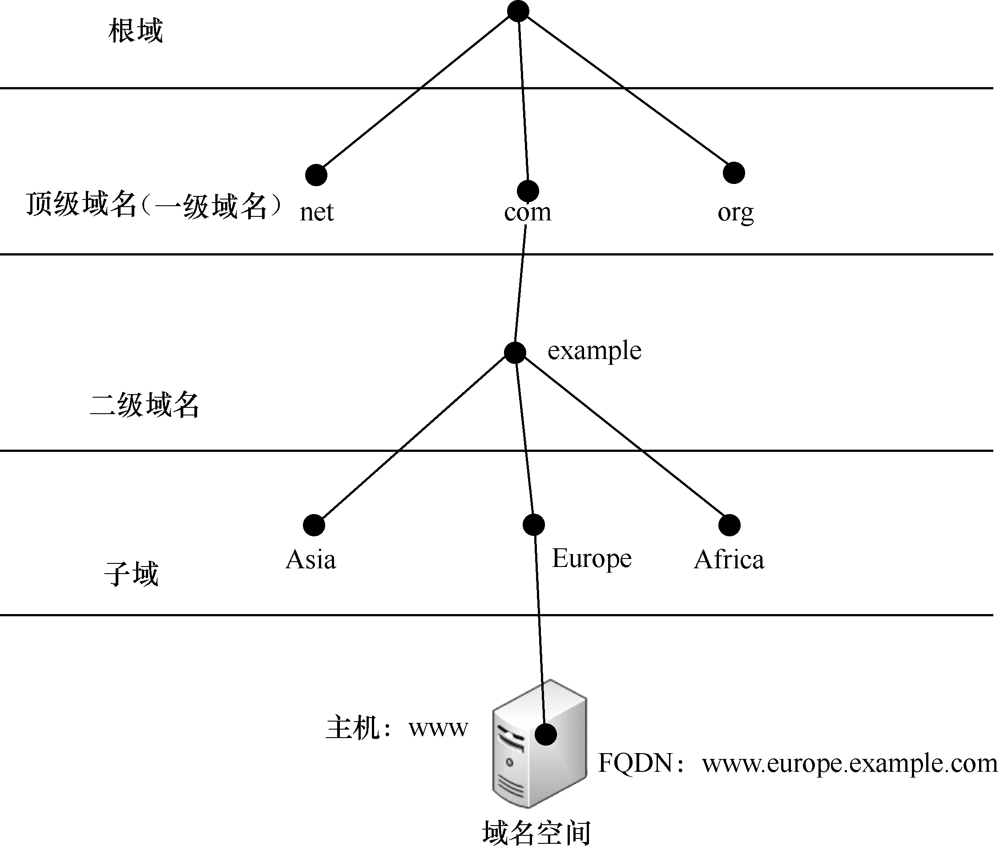

图9.1.3

</center>

### 9.1.2 DNS解析过程 

- 域名解析服务，最早于1983年由保罗·莫卡派乔斯发明；原始的技术规范在882号因特网标准草案（RFC
882）中发布。网域名称系统（DNS，Domain Name
System，有时也简称为域名系统）是因特网的一项核心服务，它作为可以将域名和IP地址相互映射的一个分布式数据库，是进行域名(domain
name)和与之相对应的IP地址 (IP
address)转换的系统，搭载域名系统的机器称之为域名服务器，域名服务器能够使人更方便的访问互联网。
- 域名服务器（DNS，Domain Name Server）是进行域名（domain
name）和与之相对应的IP地址转换的服务器。DNS中保存了一张域名和与之相对应的IP地址的表，以解析消息的域名。图9.1.4列出了域名解析的过程。

<center>


图9.1.4

</center>

- 客户机提出域名解析请求，并将该请求发送给本地的域名服务器。
- 本地的域名服务器收到请求后，先查询本地的缓存，如果有该纪录项，则本地的域名服务器就直接把查询的结果返回。
- 如果本地的缓存中没有该记录，则本地域名服务器把请求发给根域名服务器，根域名服务器返回给本地域名服务器一个所查询域（根的子域）的主域名服务器的地址。
- 本地服务器向上一步返回的域名服务器发送请求，接受请求的服务器查询自己的缓存，如果没有该纪录，则返回相关的下级域名服务器的地址。
- 重复第四步,直到找到正确的纪录。

- 本地域名服务器将结果返回给客户机；同时把返回的结果保存到缓存，以备下次使用。

## 9.2 Bind服务的安装与配置

- Bind是一款开放源码的DNS服务器软件，Bind由美国加州大学Berkeley分校开发和维护的，它是目前世界上使用最为广泛的DNS服务器软件，支持各种Unix平台和Windows平台。本节将主要介绍Bind服务的安装与配置。

### 9.2.1 DNS解析 

#### 正向解析 

- DNS域名解析服务的正向解析是根据域名查找到对应的IP地址，这是平时最常用的工作模式。当用户输入了一个域名后Bind服务程序会进行自动匹配，然后把查询到对应的IP地址返回给用户。

#### 反向查询 

- 反向DNS解析是根据查询域名来确定IP地址关联的域名的技术。反向DNS查询的过程使用PTR记录。互联网的反向DNS数据库根的顶级域名为.arpa。
- 反向解析 IPv4
地址时使用一个特殊的域名"in-addr.arpa"。在这个模式下，一个IPv4由点号分隔的四个十进制数字串联，并加上一个".in-addr.arpa"域名后缀，通过将32位IPv4地址拆分为四个八位字节，并将每个八位字节转换为十进制数来获得前四个十进制数。不过需要注意的是，在反向
DNS 解析时，IPv4书写的顺序是和普通 IPv4 地址相反的。
比如，如果要查询8.8.8.4这个IP地址的PTR记录，那么需要查询"4.8.8.8.in-addr.arpa"结果被指到google-public-dns-b.google.com这条记录。如果google-public-dns-b.google.com的
A 记录反过来指向 8.8.8.4，那么就可以说转发被认证。
- 反向解析可以防止垃圾邮件，即验证发送邮件的IP地址，是否真的有它所声称的域名，如果反向查询和声称不一致，那么就可以认为有风险。
- 反向解析是根据一个资源记录查询域名，不一定是IP地址。这个资源记录可能是A记录，也可能是CNAME记录或者MX记录，而PTR记录用于从IP地址反向查域名。

### 9.2.3 Bind服务的配置文件说明

- 表9.2.3列出了 Bind服务相关的目录和配置文件：

<center>

表9.2.3

  -------------------------------- --------------------------------------
 | 配置文件的名称       | 存放位置                        |
| ------------------- | ------------------------------- |
| 主配置文件           | /etc/named.conf                 |
| 区域配置文件         | /etc/name.rfc1912.zones         |
| 区域数据文件路径     | /var/named                      |
| 正向解析模版文件     | /var/named/named.localhost      |
| 反向解析模版文件     | /var/named/named.loopback       |
| 根域文件             | /var/named/named.ca             |

  -------------------------------- --------------------------------------

</center>

- Bind中的所有配置文件区分大小写，在文件中以"＃"开始的行为注释行。指令的语法为"配置参数名称
参数值"。如图9.2.4列出了/etc/named.conf中部分配置文件内容。

<center>

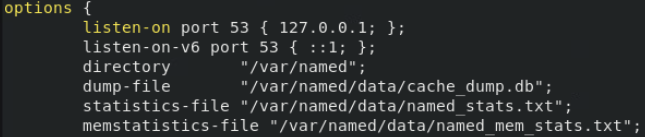

图9.2.4
</center>
- 表9.2.5列出了/etc/named.conf主配置文件中一些主要参数的功能。

<center>

表9.2.5

  ------------------------------------------ 

| 参数                                       | 作用                                                    |
| ------------------------------------------ | ------------------------------------------------------- |
| options {...}                              | 定义一些DNS服务器参数，参数都放在大括号内                 |
| directory "/var/named";                    | 区域数据文件存放的路径                                  |
| dump-file "/var/named/data/cache_dump.db";  | 服务器缓存数据文件的路径                                |
| statistics-file "/var/named/data/named_stats.txt"; | 服务器统计信息文件的路径                           |
| statistics-file "/var/named/data/named_stats.txt"; | 状态统计文件的位置                                 |
| memstatistics-file "/var/named/data/named_mem_stats.txt"; | 内存统计文件的位置                             |
| listen-on port 53 { localhost; };          | 侦听的DNS查询请求IPv4地址及端口                          |
| listen-on-v6 port 53 { ::1; };             | 侦听的DNS查询请求IPv6地址及端口                          |
| allow-query { localhost; };                | 定义可使用DNS服务器的客户端，"any"表示任何主机            |
| zone "." IN {...}                          | 正向解析"."根区域                                        |
| type hint;                                 | 类型为根区域                                            |
| file "named.ca";                           | named.ca，记录了13台根域服务器的域名和IP地址等信息         |
| include "/etc/named.rfc1912.zones";         | 包含区域配置文件里的所有配置                              |

  ------------------------------------------ ----------------------------------------------------

</center>

- 表9.2.6列出了/etc/named.rfc1912.zones区域配置文件中一些主要参数的功能。

<center>

表9.2.6

  ------------------------------ ----------------------------------------
 | 参数                          | 作用                                 |
| ----------------------------- | ------------------------------------ |
| zone "\...." IN               | 定义一个区域名称                      |
| type master;                  | 类型为主域名服务器                    |
| file "named.localhost";       | 区域解析文件存放的路径                |
| allow-update {none;};         | 是否允许动态更新本区的数据             |

  ------------------------------ ----------------------------------------

</center>

- 表9.2.7列出了/var/named.localhost区域数据配置文件中一些主要参数的功能。

<center>

表9.2.7

  -------------------------------- ---------------------------------------------------------------------------------------------------------------------------------------------
 | 参数                                  | 作用                                                         |
| ------------------------------------- | ------------------------------------------------------------ |
| @ IN SOA @ rname.invalid. (\...)       | SOA表示授权开始，IN表示后面的数据使用的是INTERNET标准。而"@"则代表相应的域名。表示一个域名记录定义的开始，rname.invalid则是管理员的邮件地址 |
| 0 ; serial                            | 本行前面的数字表示配置文件的修改版本，格式是年月日以及当日日修改的修改的次数，每次修改这个配置文件 |
| 1D ; refresh                          | 刷新频率，即规定从域名服务器多长时间查询一个主服务器，以保证从服务器的数据是最新的 |
| 1H ; retry                            | 规定了重试的时间间隔，即当从服务器试图在主服务器上查询更时，从服务器重新连接的时间间隔 |
| 1W ; expire                           | 规定从服务器在向主服务器更新失败后多长时间后清除对应的记录         |
| 3H ) ; minimum                        | 规定缓冲服务器与主服务器断开连接后，清除相应的记录的间隔时间     |
| $TTL    604800                        | 生存时间记录字段。它以秒为单位定义该资源记录中的信息存放在高速缓存中的时间长度 |
| $ORIGIN domainname.                   | 说明记录出自何处                                           |

  -------------------------------- ---------------------------------------------------------------------------------------------------------------------------------------------

</center>

- SOA（Start of Authority）是起始授权机构记录，说明了在众多
NS记录里哪一台才是主要的DNS服务器。在任何DNS记录文件中，都是以SOA
记录开始。SOA资源记录表明此DNS名称服务器是该DNS域中数据信息的最佳来源。
  - SOA 记录是所有区域性文件中的强制性记录。它必须是一个文件中的第一个记录。

- 特殊字符"@",代表ORIGIN ,假设我们在区域数据文件中添加配置"\$ORIGIN
mydebian.org. "，那下面的配置可以使用
"mydebian.org."同样也可以用"@"来代替 "mydebian.org."。
  - 如果在区域数据文件中没有定义"\$ORIGIN"的话,
那么"@"的值就等于区域文件中域名(zone)。

- Bind依靠一条条解析记录来保存域名与IP地址之间的映射。表9.2.8列出了区域数据中解析记录的种类以及作用。


<center>

表9.2.8

  ------------------------------- ---------------------------------------
| 记录类型  | 作用                 |
| --------- | -------------------- |
| SOA       | 起始授权记录         |
| A         | 将主机名转换为地址   |
| CNAME     | 给定一个主机的别名   |
| MX        | 建立邮件交换器记录   |
| NS        | 标识一个域的域名服务器 |
| PTR       | 将地址变换成主机名   |

  ------------------------------- ---------------------------------------

</center>

- 图9.2.9列出了在区域数据配置文件中DNS记录的配置格式。

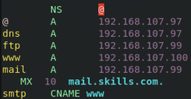

图9.2.9

### 9.2.4 安装Bind服务 

- 使用YUM应用程序管理器安装Bind服务。利用Centos8安装光盘搭建本地YUM仓库。下面开始安装Bind服务。

查询系统是否已经安装了Bind服务。输入命令后没有任何输出表示没有安装。

```rpm -qa \| grep Bind```

- 安装Bind服务

```yum install -y Bind```

- 使用命令"rpm -qa \| grep Bind"检查Bind安装是否成功，如图9.2.10所示。

<center>

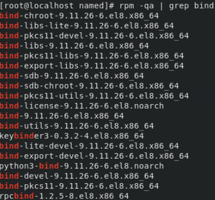

图9.2.10

</center>

- 启动Bind服务

```systemctl start named```

- 设置Bind服务为开机自动启动

```systemctl enable named```

- 添加防火墙条目放行Bind服务

```firewall-cmd --permanent --add-service=dns```

- 重启防火墙生效步骤添加的条目

```firewall-cmd --reload```

- 使用如下命令临时关闭Selinux

```setenforce 0```

### 9.2.5 配置简单的Bind服务 

#### 实例说明 

- 配置DNS服务器，域名为skills.com,为WEB服务器和FTP服务器提供DNS正反向解析服务。

- 开始配置之前需要预先配置好Linux虚拟机的IP地址，安装好Bind服务和Apache服务。在防火墙放行相应服务并且关闭Selinux。

#### 实验环境 

表9.2.11列出了实验需要用到的虚拟机

<center>

表9.2.11

  ---------------------- --------------------- --------------------------
| 角色         | 操作系统    | IP地址          |
| ------------ | ----------- | --------------- |
| DNS服务器    | Centos8.3   | 192.168.107.97 |
| WEB服务器    | Centos8.3   | 192.168.107.95 |
| FTP服务器    | Centos8.3   | 192.168.107.94 |
| 访问客户端   | Centos8.3   | 192.168.107.96 |

  ---------------------- --------------------- --------------------------

</center>

#### 具体步骤 

- 修改主配置文件/etc/named.conf,修改内容如图9.2.12所示。

<center>


图9.2.12

</center>

- 修改区域配置文件/etc/name.rfc1912.zones,添加正向查找区域文件skills.com.1和反向查找区域文件skills.com.2。操作如图9.2.13所示。

<center>

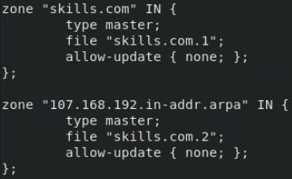

图9.2.13
</center>

- 在区域数据文件目录/var/named/下创建正向区域数据文件skills.com.1和反向区域数据文件skills.com.2。通过分别复制正向区域数据模版文件/var/named/named.localhost和反向区域数据模版文件/var/named/named.loopback来创建。操作如图9.2.14所示。

<center>

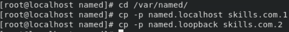

图9.2.14
</center>

- 编辑正向区域数据文件skills.com.1，修改内容如图9.2.15所示。

<center>

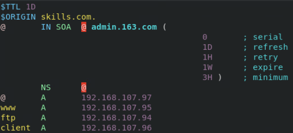

图9.2.15

</center>

- 编辑反向区域数据文件skills.com.2，部分配置与正向区域数据文件相同。修改内容如图9.2.16所示。

<center>

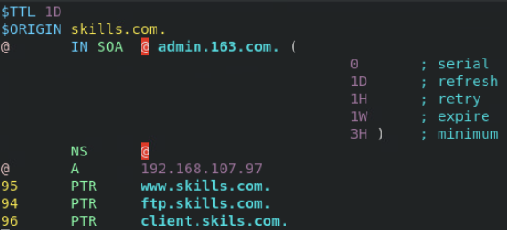

图9.2.16

</center>

- 配置完成后使用如下命令重启Bind服务。

```systemctl restart named```

- 使用nslookup命令测试DNS服务的正向解析是否正确。操作如图9.2.17所示。

<center>

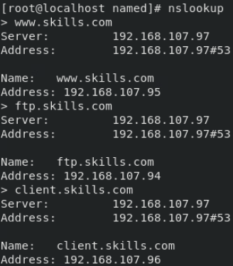

图9.2.17

</center>

- 使用nslookup命令测试DNS服务的反向解析是否正确。操作如图9.2.18所示。

<center>

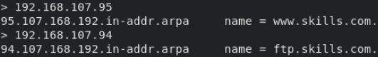

图9.2.18

</center>

## 9.3 辅助DNS服务器 

- 辅助DNS服务器是为了减轻主服务器的负载压力，同时在访问本地DNS服务器时还能提升查询效率。辅助DNS服务器可以从主服务器上抓取指定的区域数据文件，起到备份解析记录与负载均衡的作用。可以将辅助DNS服务器看作是主DNS服务器的备份。本节将主要介绍辅助DNS服务器的配置。

### 9.3.1 配置辅助DNS服务器 
#### 实例说明 

- 为skills.com域配置辅助DNS服务器。

- 开始配置之前需要预先配置好Linux虚拟机的IP地址，安装好Bind服务并在防火墙放行相应服务和关闭Selinux。

#### 实验环境 

表9.3.1列出了实验需要用到的虚拟机
<center>

表9.3.1

  ---------------------- --------------------- --------------------------
 | 角色           | 操作系统    | IP地址          |
| -------------- | ----------- | --------------- |
| 主DNS服务器    | Centos8.3   | 192.168.107.97 |
| 辅助DNS服务器  | Centos8.3   | 192.168.107.98 |
| 访问客户端     | Centos8.3   | 192.168.107.96 |

  ---------------------- --------------------- --------------------------

</center>

#### 具体步骤 

- 配置辅助区域DNS服务器的主配置文件/etc/named.conf。操作如图9.3.2所示。

<center>

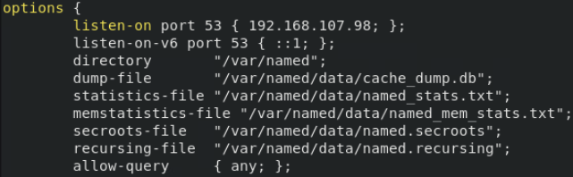

图9.3.2

</center>

- 将9.2.5所配置的DNS服务器作为主DNS服务器。在主DNS服务器的区域信息文件中允许辅助DNS服务器的更新请求。在主DNS服务器的区域配置文件/etc/named.rfc1912.zones中，修改正反向区域配置，修改内容为"allow-update
{ 辅助DNS服务器的IP地址;};"。操作如图9.3.3所示。

<center>

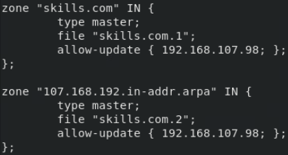

图9.3.3
</center>

- 在辅DNS服务器的区域信息文件中，添加主DNS服务器地址。向辅助DNS服务器的区域配置文件"/etc/named.rfc1912.zones"中添加正反向区域配置。修改"masters
{ 主DNS服务器的IP地址;};"参数。操作如图9.3.4所示。

<center>

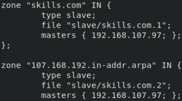

图9.3.4

</center>

- 配置完成后分别在主DNS服务器和辅助DNS服务器上使用如下命令重启Bind服务。

```systemctl restart named```

- 当重启了辅助服务器的Bind服务后，辅助DNS服务器就已经自动从主DNS服务器上同步了区域数文件了，默认会将区域数据文件存放在"/var/named/slaves"中。

- 将客户端的DNS服务器地址修改为辅助服务器的地址"192.168.107.98"。修改/etc/resolv.conf。操作如图9.3.5所示。

<center>


图9.3.5

</center>

- 使用nslookup命令测试DNS服务的正向解析是否正确。操作如图9.3.6所示。

<center>


图9.3.6

</center>

- 使用nslookup命令测试DNS服务的反向解析是否正确。操作如图9.3.7所示。

<center>


图9.3.7

</center>

## 9.4 子域DNS服务器

- 当一个域非常庞大并且还拥有上下的关系时，如果将所有的记录都由一台DNS服务器来管理，管理会变的混乱。这就好比一个公司不可能由董事长直接管理公司的所有事项。所以在管理公司时会设置设科室，科室下面又分组，采用分层管理，来更加科学的管理公司。

- 在DNS服务中也可以实现类似的分层管理。通过建立父域和子域。父域DNS可以将管理授权给子域DNS服务器来管理记录的变更，这种做法就叫子域授权。

- 本节主要介绍DNS父子域服务器的配置。

### 9.4.1 配置子域授权

#### 实例说明 

- 为skills.com域配置子域DNS服务器。域名为：sub.skills.com。在子域DNS服务器上添加一个www主机，地址指向192.168.107.50。

- 开始配置之前需要预先配置好Linux虚拟机的IP地址，安装好Bind服务并在防火墙放行相应服务和关闭Selinux。

#### 实验环境 

表9.4.1列出了实验需要用到的虚拟机

<center>

表9.4.1

  ---------------------- --------------------- --------------------------
| 角色          | 操作系统    | IP地址          |
| ------------- | ----------- | --------------- |
| 父DNS服务器    | Centos8.3   | 192.168.107.97 |
| 子DNS服务器    | Centos8.3   | 192.168.107.98 |
| 访问客户端    | Centos8.3   | 192.168.107.96 |

  ---------------------- --------------------- --------------------------

</center>

#### 具体步骤 

- 修改父域DNS服务器的主配置文件/etc/named.conf。操作如图9.4.2所示。

<center>

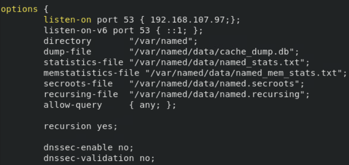

图9.4.2

</center>

- 父域DNS服务器的区域和正向区域数据文件创建与实验9.2.5相同。

- 在父域DNS服务器的正向区域数据文件中添加子域DNS服务器的NS地址。将子域DNS服务器的域名配置为dns.sub.skills.com。操作如图9.4.3所示。

<center>

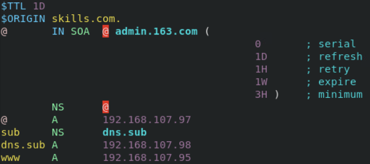

图9.4.3

</center>

- 配置完成后使用如下命令重启父域DNS服务器的Bind服务。

```systemctl restart named```

- 修改子域DNS服务器的主配置文件/etc/named.conf。操作如图9.4.4所示。

<center>

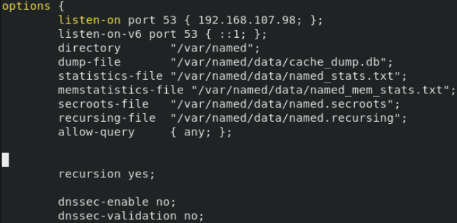

图9.4.4

</center>

- 修改子域DNS服务器的区域配置文件/etc/name.rfc1912.zones,添加正向查找区域文件sub.skills.com.1。操作如图9.4.5所示。

<center>

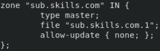

图9.4.5

</center>

- 在子域DNS服务器的区域数据文件目录/var/named/下创建正向区域数据文件sub.skills.com.1。通过复制正向区域数据模版文件/var/named/named.localhost。操作如图9.4.6所示。

<center>


图9.4.6

</center>

- 编辑子域DNS服务器的正向区域数据文件sub.skills.com.1，修改内容如图9.4.7所示。

<center>

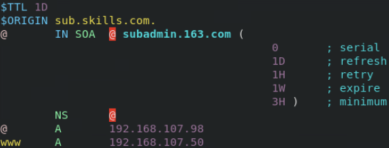

图9.4.7

</center>

- 配置完成后使用如下命令重启子域DNS服务器的Bind服务。

```systemctl restart named```

- 将客户端的DNS服务器地址修改为父域服务器的地址192.168.107.97。修改/etc/resolv.conf。操作如图9.4.8所示。

<center>


图9.4.8

</center>

- 使用nslookup命令测试子域DNS服务的正向解析是否正确。操作如图9.4.9所示

<center>

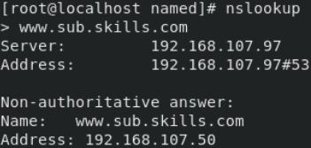

图9.4.9

</center>

## 9.5 DNS转发器 

- 当DNS服务器在接收到DNS客户端的查询请求后，它将在所管辖区域的数据库中寻找是否有该客户端的数据。如果该DNS服务器的区域中没有该客户端的请求数据时，该DNS服务器需要转向其他的DNS服务器进行查询。

- DNS服务器可以解析自己区域文件中的域名，对于本服务器查询不了的域名，默认情况下是将直接转发查询请求到根域DNS服务器。或者在DNS服务器上设置转发器将请求转发给其他DNS服务器。转发到转发器的查询一般为递归查询。

- 本节主要介绍DNS转发器的配置。

- DNS转发器分类:
  - 全局转发器：无论任何域名，全部向全局转发器指定的地址转发DNS请求
  - 条件转发器：向指定区域转发DNS请求

### 9.5.1 配置DNS转发器 

#### 实例说明

- 为skills.com域配置转发器，使其可以解析test1.com和test2.com域。

- 为test1.com配置全局转发器，为test2.com配置条件转发器。

- 开始配置之前需要预先配置好Linux虚拟机的IP地址，安装好Bind服务并在防火墙放行相应服务和关闭Selinux。

#### 实验环境 

表9.5.1列出了实验需要用到的虚拟机

<center>

表9.5.1

  ------------------------------ -------------- --------------------------
| 角色                    | 操作系统    | IP地址          |
| ----------------------- | ----------- | --------------- |
| DNS1服务器（skills.com） | Centos8.3   | 192.168.107.97 |
| DNS2服务器（test1.com）  | Centos8.3   | 192.168.107.98 |
| DNS3服务器（test2.com）  | Centos8.3   | 192.168.107.99 |
| 访问客户端              | Centos8.3   | 192.168.107.96 |

  ------------------------------ -------------- --------------------------

</center>

#### 具体步骤

- 分别配置三台DNS服务器的区域，并分别添加三个www主机，地址都指向192.168.107.50。使其可以正常解析，www.skills.com、www.test1.com和www.test2.com。

- 在skills.com域的DNS服务器上修改/etc/named.conf主配置文件，添加全局转发器使其能解析test1.com。添加参数为："forwarders
{ 转发的DNS服务器地址;};"。操作如图9.5.2所示。

<center>

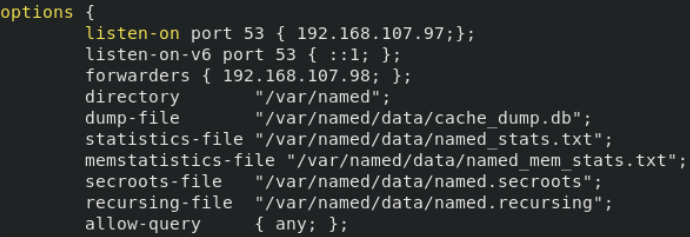

图9.5.2

</center>

- 配置完成后使用如下命令重启Bind服务。

```systemctl restart named```

- 将客户端的DNS服务器地址修改为"192.168.107.97"。修改/etc/resolv.conf。操作如图9.5.3所示。

<center>


图9.5.3

</center>

- 使用nslookup命令测试解析www.test1.com。操作如图9.5.4所示。

<center>

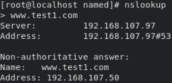

图9.5.4

</center>

- 在skills.com域的DNS服务器上修改/etc/named.rfc1912.zones区域配置文件，添加条件转发器使其能解析test2.com。操作如图9.5.5所示。

<center>

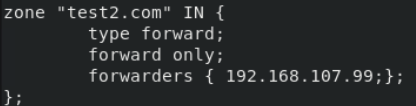

图9.5.5

</center>

- 使用nslookup命令测试解析www.test2.com。操作如图9.5.6所示。

<center>

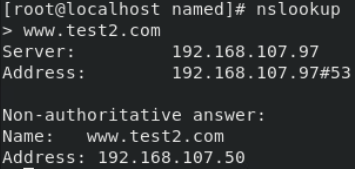

图9.5.6

</center>

