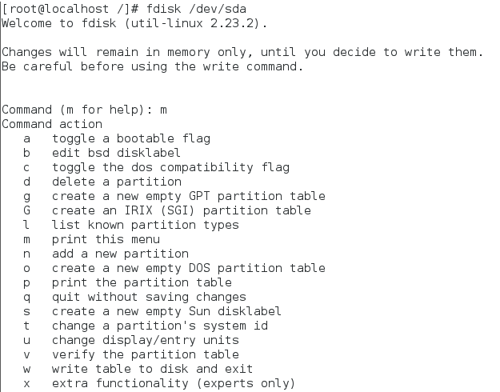
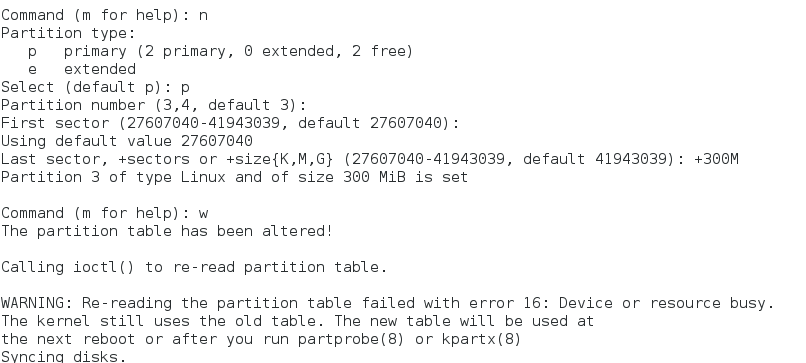
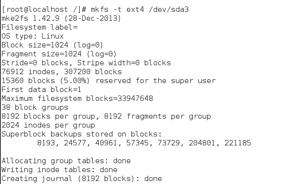
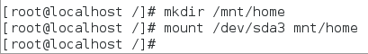
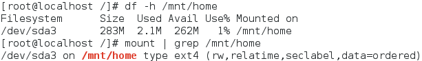
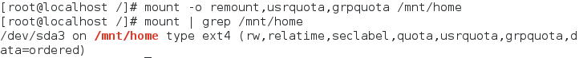
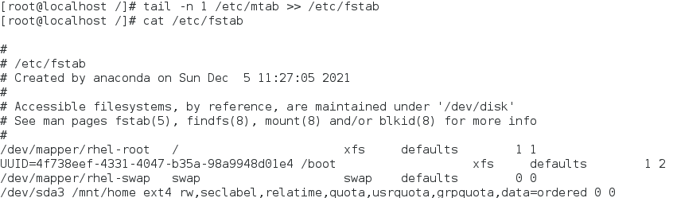
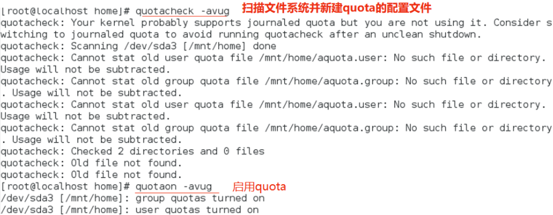
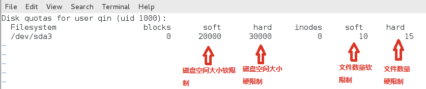

## quota磁盘配额配置

## 项目需求
   - 学校组织大家参加程序设计大赛，为此成立了以你为组长的项目组，同时小组内还有其他3名成员。因磁盘空间不够，做为组长的你争取到了300MB的磁盘空间，现需要做如下配置：
     - 用fdisk对磁盘做分区，并挂载；
     - 为项目组成员做磁盘限额，软限制为20MB，硬限制为30MB；
     - 为项目组成员的做文件限制，组长软限制为10个，硬限制为15；成员软限制为8，硬限制为10；

## 操作步骤
- 用fdisk对磁盘做分区，并挂载
  - 输入fdisk /dev/sda命令来进行磁盘分区管理
  

  - 输入n创建一个新的分区，随后选择p创建一个主分区(sda3)，并为其分配300M磁盘空间。随后输入w命令保存。
  
  
  - 使用mkfs -t ext4 /dev/sda3 命令对新建的磁盘分区进行格式化，文件类型为ext4
  

  - 使用mkdir命令和mount命令对磁盘进行挂载(此例将其挂载到/mnt/home目录下)
  

## 在磁盘中加入quota支持并启用quota
  - 使用df和mount | grep /mnt/home命令查看文件系统支持信息,发现其没有支持userquota和grpquota
  
  - 重新挂载/mnt/home使其支持usrquota,grpquota
   
  - 将/etc/mtab中的最后一行追加到/etc/fstab中去，确保开机启用quota,查看fstab文件，确认已经加入quota的支持
    
  - 启用quota
    

## 为项目组成员做磁盘限额，

- 使用equota -u [username]命令对用户磁盘限额信息进行修改(直接对对应的数据进行修改即可)
  - 存储空间限制，软限制为20MB，硬限制为30MB
  - 文件限制，组长软限制为10个，硬限制为15；成员软限制为8，硬限制为10
  
  - filesyatem：文件系统
  - blocks：磁盘容量（是quota自己计算出来的，不要修改）
  - soft：磁盘容量（block）的软限制（单位为KB）
  - hard：block的硬限制，单位KB
  - inodes：文件数量，quota自己计算出来的，单位为个数，不要修改他
  - soft：inode的软限制
  - hard：inode的硬限制
  - soft与hard为0时，表示没有限制
  - 批量对信息修改(复制限制信息给其他用户)  
  ```shell
  # 若有多个用户要使用user的这个配置，可以用这样的命令
  edquota -p user -u user1 
  edquota -p user -u user2 
  edquota -p user -u user3 
  edquota -p user -u user4 
  ```
  - 验证
  

## 其他命令
```shell
#检查限额报表
repquota -a
#修改宽限时间
edquota -t 
#将范本账号的quota限制值复制给新账号
edquota -p 范本账号 -u 新账号

#quota限制值的报表
quota：单一用户的quota报表
quota -[uvs] [username]
quota -[gvs] [groupname]
#-u：后面接useranme，表示显示出该用户的quota限制值，不接username表示执行者的

#quota限制值
#-g：后面接用户组名，表示显示出该用户组的quota限制值
#-v：显示每个用户在文件系统中的quota值
#-s：使用1024为倍数来指定单位，会显示如M之类的单位

#repquota：针对文件系统的限额做报表
repquota -a [-vugs]
#-a：直接到/etc/mtab查询具有quota标志的文件系统，并报告quota的结果
#-v：输出的数据将含有文件系统相关的详细信息
#-u：显示用户的quota限值，（这是默认值）
#-g：显示个别用户组的quota限值
#-s：使用M，G为单位显示

#例：
repquota -auvs
```
