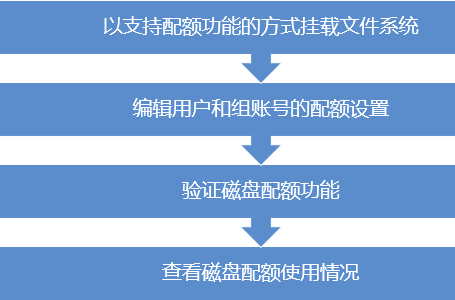

## XFS文件系统磁盘配额
- 在CentOS系统中，内核已经定制了支持Linux文件系统的磁盘配额功能，并且在系统中配置和管理磁盘配额的工具由xfsprogs软件包的xfs_quota配额管理程序提供。
- XFS文件系统是通过xfs_quota工具进行管理；EXT3/4文件系统通过quota工具进行管理。
- 查看是否安装了xfs_quota组建

  ```shell
  [root@localhost ~]# rpm  -q xfsprogs
  #确认xfsprogs软件包的安装情况
  [root@localhost ~]# rpm -ql xfsprogs | grep xfs_quota
  #查看xfs_quota配额管理程序
  ```

#### 磁盘配额知识点

- 磁盘配额的作用范围
  - xfs_quota设置的磁盘配额功能，只能在指定的文件系统（分区）内有效，用户使用其他未设置配额的文件系统时，将不会受到限制。

- 磁盘配额的限制对象
  - xfs_quota主要针对系统中指定的用户账号、组账号进行限制，没有被设置限额的用户或组将不会受到影响。对组（必须是基本组）账号设置配额后，组内所有用户使用的磁盘容量、文件数量的总和不能超过限制。

- 磁盘配额的限制类型
  - 磁盘容量:限制用户能够使用的磁盘数据块大小，也就是限制 磁盘空间大小，默认单位为KB；
  - 文件数量:限制用户能够拥有的文件个数。在Linux操作系统中，每一个文件都有一个对应的数字标记，称为i结点，这个编号在同一个文件系统内是唯一的。因此xfs_quota是通过限制i结点的数量来实现对文件数量的限制。

- 磁盘配额的限制方法
  - 软限制:指定一个软性的配额数值，在固定的宽限期（默认为7天）内允许暂时超出这个限制，但是系统会发出警告信息；
  - 硬限制:指定一个硬性的配额数值，是绝对禁止用户超过的限制，当达到硬限制是，系统也会发出警告并禁止写入数据。
  - 硬限制的配额制应大于相应的软限制值，否则软限制将失效。
- 在实施磁盘配额的实际过程中，只有当用户（或组）、文件系统（分区）及配额数值都满足限额条件时，xfs_quota才会对操作进行限制。

#### 磁盘配额管理步骤：


-  以支持配额功能的方式挂载文件系统
```shell
#增加用户、组配额功能的支持挂载
[root@localhost ~]# mkdir /a
[root@localhost ~]# mount -o usrquota,grpquota /dev/sdb1 /a

#为了测试方便，允许任何用户写入数据
[root@localhost ~]# chmod 777 /a                        

#实现开机自动挂载（增加用户、组配额的功能挂载）
[root@localhost ~]# vim /etc/fstab    	
/dev/sdb1          /a                      xfs     defaults,usrquota,grpquota  0 0
```
- 编辑用户和组账号的配额设置
```shell
#设置用户张三的磁盘配额，磁盘容量软限制为10M，硬限制为15M；文件数软限制为40，硬限制为50
[root@localhost ~]# xfs_quota -x -c 'limit -u bsoft=10M bhard=15M isoft=40 ihard=50 zhangsan' /a
#-x 表示启用专家模式，在当前模式下允许对配额系统进行修改的所有管理命令可用；
#-c 表示直接调用管理命令；
#limit 可以设置磁盘容量的软、硬限制；及文件数的软、硬限制；
#-u 表示指定用户（如果指定组使用-g）；
#bsoft 表示设置磁盘容量的软限制数值；
#bhard 表示设置磁盘容量的硬限制数值；
#isoft 表示设置磁盘文件数的软限制数值；
#ihard 表示设置磁盘文件数的硬限制数值。
```
- 如果仅限制磁盘容量和文件数量，可以使用如下指令
```shell
#仅限制磁盘容量
[root@localhost ~]# xfs_quota -x -c 'limit -u bsoft=10M bhard=15M zhangsan' /a
#仅限制文件数量
[root@localhost ~]# xfs_quota -x -c 'limit -u isoft=40 ihard=50 zhangsan' /a

#查看zhangsan磁盘容量限制
[root@localhost ~]# xfs_quota -c 'quota -uv zhangsan' /a
Disk quotas for User zhangsan (1002)
Filesystem              Blocks      Quota      Limit  Warn/Time      Mounted on
/dev/mapper/web_document-bdqn
                             0     ** 10240      15360 **  00 [--------] /a、
#查看zhangsan文件数量限制
[root@localhost ~]# xfs_quota -c 'quota -i -uv zhangsan' /a
Disk quotas for User zhangsan (1002)
Filesystem               Files      Quota      Limit  Warn/Time      Mounted on
/dev/mapper/web_document-bdqn
                             0        ** 40         50**   00 [--------] /a
```
- 一般情况，对磁盘容量进行限额的情况比较常见，限制文件 数量的情况较少。所以设置的限额不应小于用户已经使用的数量，否则可能导致该用户无法正常登录系统。另外，建议不要对root用户设置磁盘配额，以免带来不可预知的风险。
- 以上对用户设置磁盘配额的方法同样适用于组账号，只不过在进入编辑环境是要适用“-g”选项指定组账号对象。

## 验证磁盘配额功能
```shell 
[root@localhost ~]# su zhangsan                 #首先切换用户
[zhangsan@localhost root]$ dd if=/dev/zero of=/a/123.txt bs=5M count=4
dd: 写入"/a/123.txt" 出错: 超出磁盘限额               #超出硬限制的数据将被截断，无法写入
记录了4+0 的读入
记录了3+0 的写出
15728640字节(16 MB)已复制，2.0585 秒，7.6 MB/秒
[zhangsan@localhost root]$ ls -lh /a/123.txt
-rw-rw-r--. 1 zhangsan zhangsan **15M** 6月  30 04:55 /a/123.txt
```
## 查看配额使用情况
```shell
[root@localhost ~]# xfs_quota -x -c 'report -a'
#查看所有可用分区的磁盘容量配额使用情况
User quota on /a (/dev/mapper/web_document-bdqn)
                               Blocks                     
User ID          Used       Soft       Hard    Warn/Grace     
---------- -------------------------------------------------- 
root                0          0          0     00 [--------]
zhangsan        15360      10240      15360     00  [6 days]

Group quota on /a (/dev/mapper/web_document-bdqn)
                               Blocks                     
Group ID         Used       Soft       Hard    Warn/Grace     
---------- -------------------------------------------------- 
root                0          0          0     00 [--------]
zhangsan        15360          0          0     00 [--------]
[root@localhost ~]# xfs_quota -x -c 'quota -u zhangsan' /a
#查看指定用户名的磁盘容量使用情况（查看组使用参数“-g”）
Disk quotas for User zhangsan (1002)
Filesystem              Blocks      Quota      Limit  Warn/Time      Mounted on
/dev/mapper/web_document-bdqn
                         15360      10240      15360   00  [6 days] /a

##若同时查看磁盘容量和文件输出报告可结合“-i”和“-b”使用
[root@localhost ~]# xfs_quota -x -c 'report -abi'
User quota on /a (/dev/mapper/web_document-bdqn)
                               Blocks                                          Inodes                     
User ID          Used       Soft       Hard    Warn/Grace           Used       Soft       Hard    Warn/ Grace     
---------- -------------------------------------------------- -------------------------------------------------- 
root                0          0          0     00 [--------]          3          0          0     00 [--------]
zhangsan        15360      10240      15360     00  [6 days]          1         40         50     00 [--------]

Group quota on /a (/dev/mapper/web_document-bdqn)
                               Blocks                                          Inodes                     
Group ID         Used       Soft       Hard    Warn/Grace           Used       Soft       Hard    Warn/ Grace     
---------- -------------------------------------------------- -------------------------------------------------- 
root                0          0          0     00 [--------]          3          0          0     00 [--------]
zhangsan        15360          0          0     00 [--------]          1          0          0     00 [--------]
-----------------------------------
```
