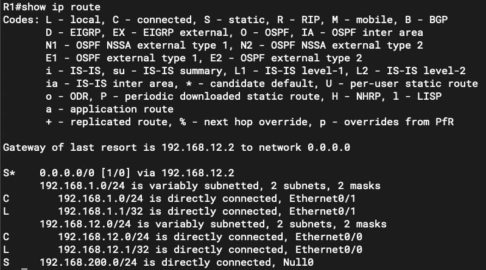

### 本章内容概述和教学目标
- 一般来说，一条路由无论是静态的或者是动态的，都需要关联到一个出接口，路由的出接口指的是设备要到达一个目的网络时的出站接口。路由的出接口可以是该设备的物理接口，如百兆、千兆以太网接口，也可以是逻辑接口，如 VLAN 接口 (VLAN Interface），或者是隧道（Tunnel）接口等。在众多类型的出接口中，有一种接口非常特殊，那就是 Null （无效，接口，这种类型的接口只有一个编号，也就是 0。Null0 是一个系统保留的逻辑接口，当网络设备在转发某些数据包时，如果使用出接口为 Null0 的路由，那么这些报文将被直接丢弃，就像被扔进了一个黑洞里，因此出接口为 Null0 的路由又被称为黑洞路由。
- 黑洞路由是一种颇有用处的路由。
- 在图 1-28 中，R1 的 GEO/0/0 连接着一个终端网络，处于该终端网络的 PC 将默认网关设置为 R1 的 GE0/0/0 接口卫地址，而为了让 PC 能够访问 R2 右侧的服务器网络，我们在 R1 上配置了一条默认路由:
```shell
[R1] ip route 0.0.0.0 0.0.0.0 192.168.12.2
```

- 当 PC 访问本地网段 192.168.1.0/24 之外的资源(包括服务器网络中所有的网段）时，流量都会先被发往 R1，然后由 R1 转发给 R2。
- 现在网络中出现这样一个需求: 在服务器网络中，有一个特殊的网段一192.168.200.0/24 并不希望被 PC 访问，能否仅仅通过路由的配置来实现这个需求？
- 答案是肯定的，使用黑洞路由便可。R1可增加如下配置:
```shell
[R1] ip route 192.168.200.0 255.255.255.0 NULLO
```
- 使用上述命令可为 R1 增加了一条到达 192.168.200.0/24 的路由，而且该条路由的出接口是 Null0。完成上达配置后，先查看一下 R1 的路由表:

- 从路由表中，大家可以看到我们为 R1 所配置的黑洞路由。现在，当 PC 访问 192.168.200.0/24 时，数据包先被送到默认网关 R1，R1 通过路由表查询，发现数据包的目的 IP 地址匹配路由 192.168.200.0/24，而该条路由的出接口是 Null0，因此它将数据包直接丢弃。如此一来，PC 将无法再访问 192.168.200.0/24。实际上，这是一种实现流量过滤的简单而又有效的方法。
- 当然，黑洞路由除了在上述场景中使用，还能用于各种其他场景，例如:
  - 在部署了路由汇总的网络中，用于防止数据转发出现环路
  - 在部署了 NAT (Network Addres Translation，网络地址转换）的网络中，用于防止数据转发出现环路
  - 在BGP 网络中，用于发布特定网段的路由

<br> 

- 利用黑洞路由解决路由汇总带来的环路问题:
  - 路由汇总是一个非常重要的网络优化思维，然而如果处理不当，也有可能带来数据转发的环路。
      - 在 图1-27 中，R1 左侧连接着 192.168.0.0/24、192.168.1.0/24 及 192.168.2.0/24 三个网段，为了让它们能够访问 Internet， R1 配置了指向 R2 的默认路由。而为了让这些网段访问 Internet 的回程流量能够顺利返回，又为了精简路由表，R2 配置了一条静态汇总路由 192.168.0.0/22，且下一跳为 R1。这样做看似没什么问题，但是却存在一个不小的隐患。
        - 考虑这样一种情况: 有一个网络攻击者连接到了 R1，它开始向 R1 发送大量垃圾数据包，这些数据包的目的 IP 地址是 192.168.3.0/24 子网中的随机地址（该子网在 R1 上并不存在），以发往 192.168.3.1 的垃圾报文为例，该报文首先被发送到 R1，后者通过路由表查询后发现数据包的目的 IP 地址只能匹配默认路由，因此将其转发给默认路由的下一跳 R2,然而 R2 经过路由表查询后，发现数据包的目的 IP 地址匹配路由表中的汇总路由 192.168.0.0/22，因此又将数据包转发给 R1， R1 又将报文转发回 R2，至此就产生了环路，发往 192.168.3.1 的垃圾报文将不断地在 R1 与 R2 之间被来回转发，直到它们的 TTL (Time To Live）值递减到 0 时才被丢弃。设想一下，如果攻击者持续发送大量的垃圾数据包，那么 R1 及 R2 的性能必将受到极大的冲击，并且两者之间互联链路的带宽也将迅速被抢占，合法的网络流量势必受到影响，业务可能会出现卡顿甚至中断的现象。

    
    - 数据转发路径若出现环路，产生的危害是非常大的，针对本案例的解决办法很简单，在 R1 上增加一条黑洞路由: 
    ```shell
    ip route 192.168.0.0 255.255.252.0 Nul0 
    ```
    - 这条路由的出接口非常特殊，是 Null0，这是一个系统保留的逻辑接口，当路由器在转发某些数据包时，如果使用出接口为 Null0 的路由，那么这些报文将被直接丢弃，就像被扔进了一个黑洞里。
    - 在 R1 的配置中增加这条黑洞路由之后，当其收到发往 192.168.3.0/24 这个在 R1 上并不存在的网段的非法报文时，就会直接丢弃这些报文，而不会再转发给 R2 了，因为这些报文的目的地址匹配这条指向 Null0 的路由。当然，R1 如果收到目的地址为 192.168.0.0/24、 192.168.1.0/24 及 192.168.2.0/24 这三个网段的数据包时，会把它们从相应的直连接口转发出去，而不会丢弃，因为这三个网段在 R1 的路由表中存在直连路由，而相比于黑洞路由，这些直连路由的掩码更长。
    - 利用 Null0 路由来解决路由汇总场景中的数据转发环路问题，是一种有效且常见的解决方案。这个思路在部署路由汇总的时候非常关键。


<br>
<br>

