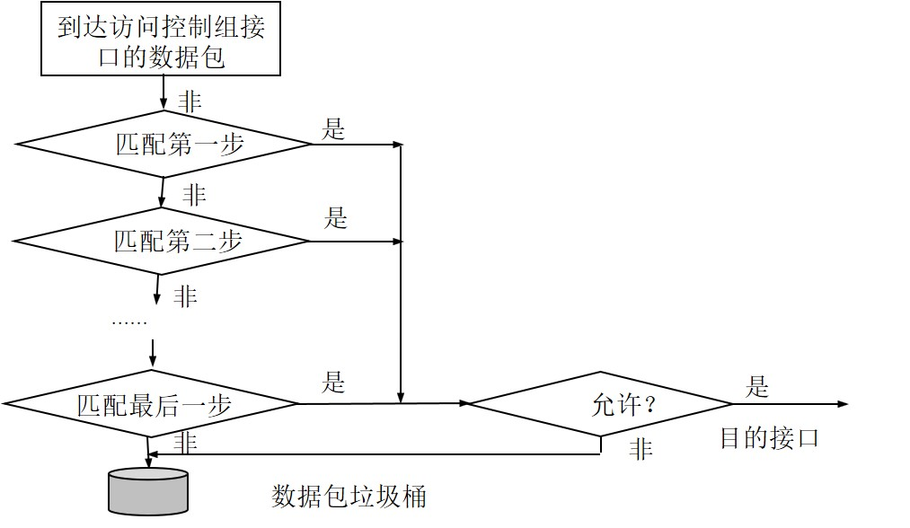

### ACL概述
- ACL基本概念
  - 访问控制列表简称 ACL( Access Control Lists），它使用包过滤技术，在路由器上读取第3层或第4层包头中的信息，如源地址、目的地址、源端口、目的端口以及上层协议等，根据预先定义的规则决定哪些数据包可以接收、哪些数据包需要拒绝，从而达到访问控制的目的。配置路由器的访问控制列表是网络管理员一件经常性的工作。

- ACL的作用
  - ACL的作用主要表现在两个方面：一方面保护资源节点，阻止非法用户对资源节点的访问；另一方面限制特定的用户节点所能具备的访问权限。
  - 检查和过滤数据包。
  - 限制网络流量，提高网络性能。
  - 限制或减少路由更新的内容。
  - 提供网络访问的基本安全级别。 

- 工作原理    
  - 当一个数据包进入路由器的某一个接口时，路由器首先检查该数据包是否可路由或可桥接。然后路由器检查是否在入站接口上应用了ACL。如果有ACL，就将该数据包与ACL中的条件语句相比较。如果数据包被允许通过，就继续检查路由器选择表条目以决定转发到的目的接口。ACL不过滤由路由器本身发出的数据包，只过滤经过路由器的数据包。下一步，路由器检查目的接口是否应用了ACL。如果没有应用，数据包就被直接送到目的接口输出。
  
