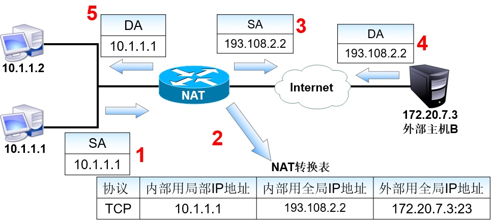
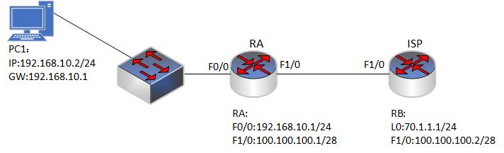

### 17.2 静态NAT
- 静态NAT介绍：
  - 将内部地址和外部地址进行一对一的转换。这种方法要求申请到的合法IP地址足够多，可以与内部IP地址一一对应。静态NAT一般用于那些需要固定的合法IP地址的主机，比如Web服务器、FTP服务器、E-mail服务器等。
  

 
 

### 17.2.1 静态NAT实验1
- 配置要求:
  - 局域网内192.168.10.2计算机现在需要访问外网。使用公网地址为100.100.100.3。现需要配置NAT完成内网地址转换。

  