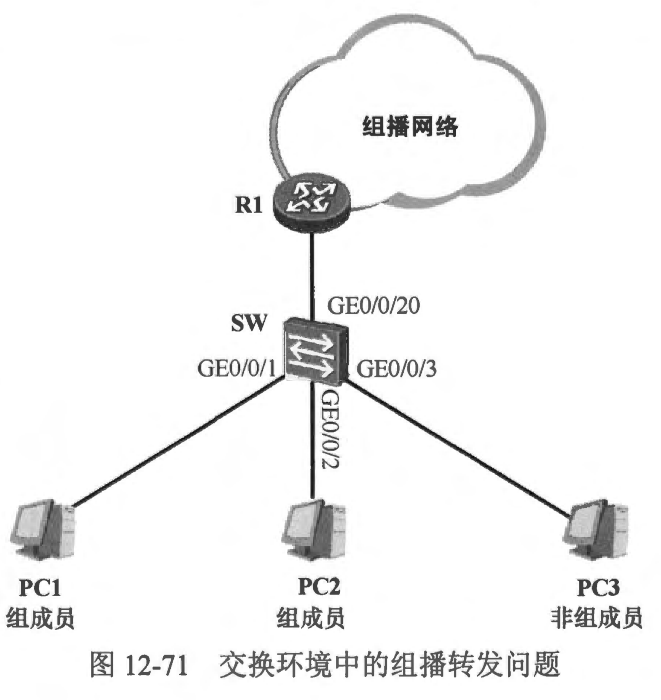
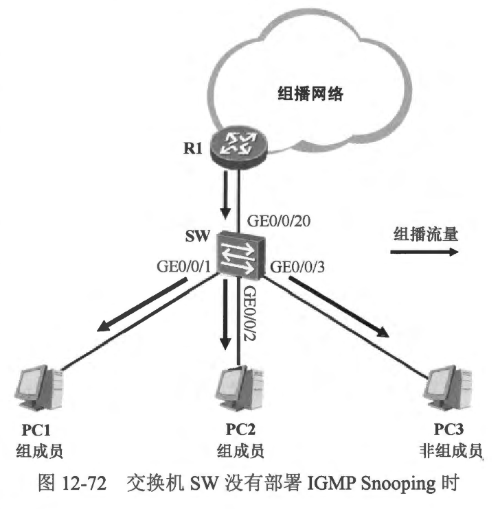
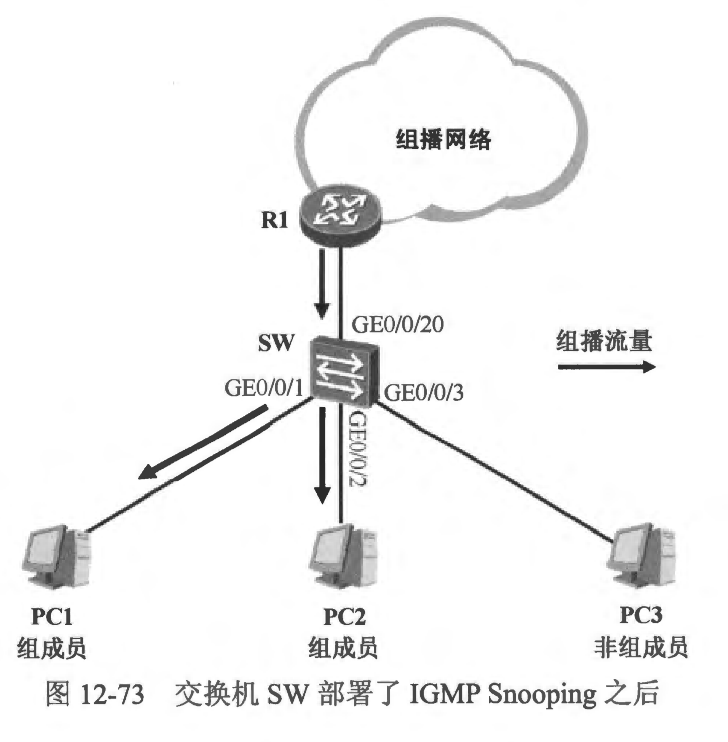
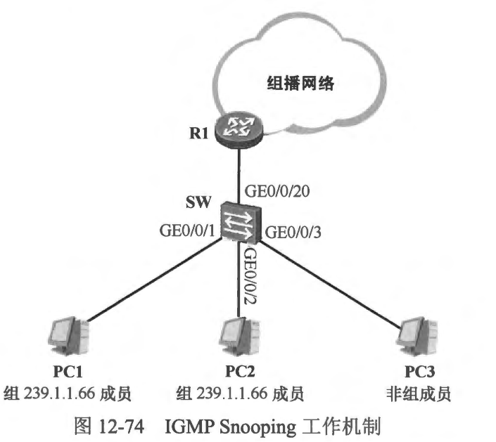
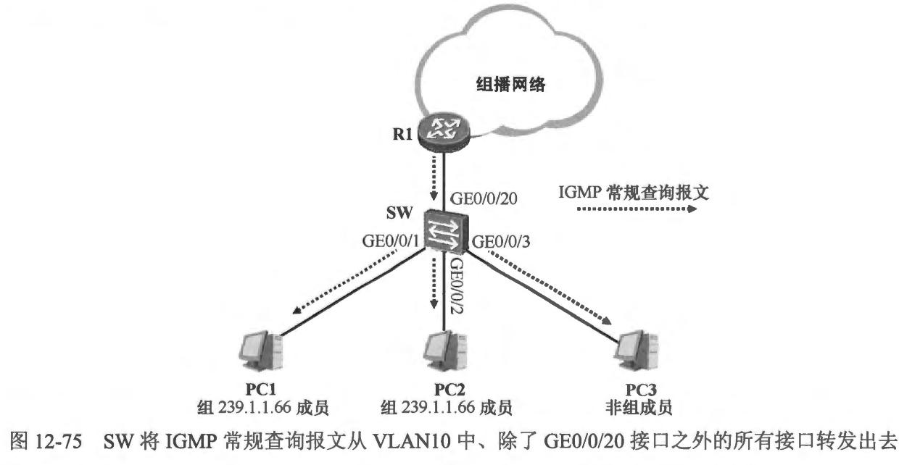
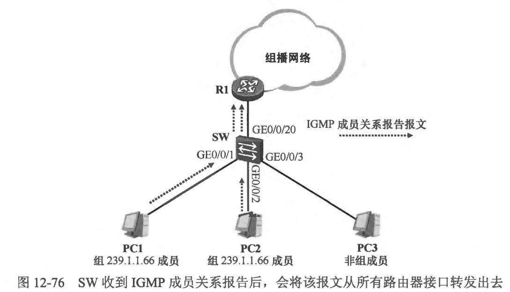
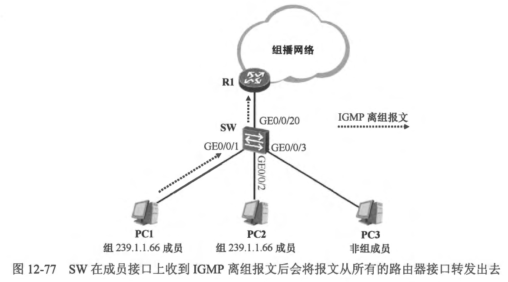
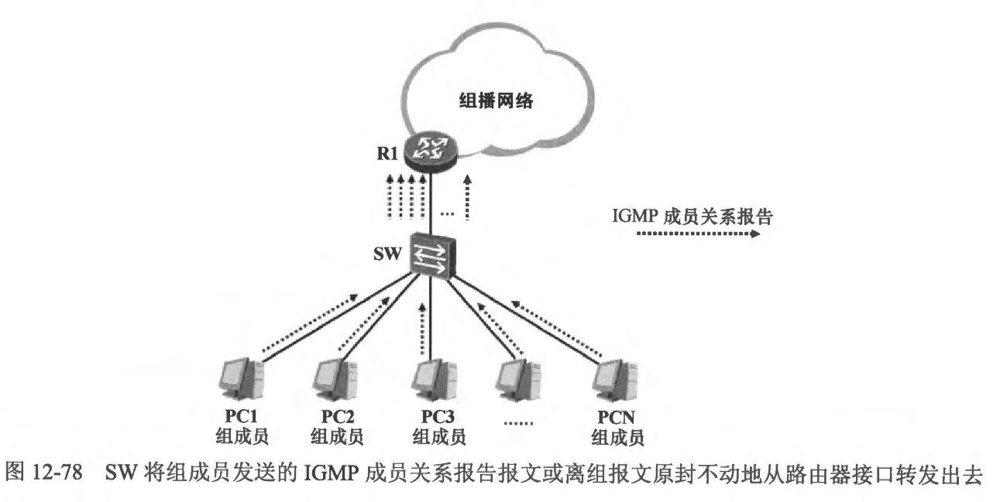

### 12.10 IGMP Snooping
- 在一个交换网络中，如果部署了组播业务，那么组播数据将不可避免地经过一些交换设备，在这种场景下，有一些问题需要格外关注。在图 12-71 中，以太网二层交换机 SW 通过自己的 GEO/0/20 接口连接到组播路由器 R1，同时它还连接着一些 PC。在这些 PC 中，PC1 及 PC2 是某个组播组的成员，它们将会向网络中发送 IGMP 成员关系报告宣告自己加组，在此之后，如果 R1 收到发往该组播组的流量便会将这些流量转发到该交换网络，那么组成员 PC1 及 PC2 都会收到所需的组播流量，但是，由于缺省情況下，当交换机在某个 VLAN 内收到目的 MAC 地址未知的单播帧、组搔帧或广播帧时，它都会将这些数据帧在相同 VLAN 内进行泛洪，因此 SW 将会把发往该组播组的流量从自己的 GEO/0/1、GE0/0/2 及 GE0/0/3 等接口都转发出去(假设这些接口都属于相同的 VLAN)，这么一来，即使有些 PC (例如图中的 PC3)不是该组播组的成员，它们也将收到组播流量，这就造成了网络带宽和设备性能的浪费。

 
 

### 12.10.1 IGMP Snooping 简介
- IGMP Snooping (Internet Group Management Protocol Snooping）) 技术主要用于在交换机上优化组播流量的转发行为。IGMP 是组播中颇为重要的一个协议，组播路由器通过IGMP 管理组成员，而组播接收者也通过 IGMP 宣告加组及离组。当路由器与组成员之间存在二层交换机
时，缺省时，交换机只是简单地转发网络中的 IGMP 报文，不会对这些报文的内容感兴趣。此外，当交换机在某个 VLAN 内收到组播流量时，它会将这些流量在相同 VLAN 内所有接口上进行泛洪（如图 12-72 所示）。而当交换机部署了 IGMP Snooping 之后，它将会侦听组成员与 IGMP 查
询器之间交互的IGMP 报文，并解析 IGMP 报文中的相关信息，然后结合这些信息与接口、VLAN-ID 等建立二层组播转发表项，这些转发表项将用于指导组播流量转发，确保流量只被转发到正确的接口上。
 
- 在图 12-73中，在 SW 部署了 IGMP Snooping 之后，当组成员 PC1 及 PC2 通过 IGMP 成员关系报告报文宣告自己加组时，SW 除了将这些报文转发给组播路由器 R1 之外，还会解析报文中的内容，将报文中的组播组地址与接口 GE0/0/1、GE0/0/2，以及 VLAN-ID 等信息进行鄉定，从而创建二层组播转发表项。现在，当 SW 收到 R1 发送的组播流量后，会根据二层转发表中的表项将流量从 GE0/0/1 及 GEO/0/2 接口转发出去，此时非组成员的 PC3 将不会收到这些组播流量。因此部署了 IGMP Snooping 之后，交换机只会将组播流量从正确的接口转发出去。
 

 
 

### 12.10.2 IGMP Snooping 基本术语
- 在进一步讲解 IGMP Snooping 的工作机制之前，了解其中的一些接口角色非常有必要的。
- 路由器接口 (Router Port)
  - 所谓路由器接口，指的是运行了IGMP Snooping 的交换机朝向上游组播路由器的接口。例如图 12-73 中 SW 的 GE0/0/20 接口。路由器接口可通过动态的方式自动发现，也可通过手工配置的方式静态指定。对于前者而言，IGMP Snooping 交换机会將其收到 IGMP 常规查询报文或者 PIM Hello 报文的接口视为动态路由器接口。交换机将在路由器接口上收到上游组播路由器转发的组播流量。
- 成员接口 (Member Port)
  - 成员接口是 IGMP Snooping 交换机朝向组播组成员的接口，例如图 12-73 中的 GE0/0/1 及 GE0/0/2。成员接口可通过动态的方式自动发现，也可通过手工配置的方式静态指定。对于前者而言，IGMP Snooping 交换机会将其收到 IGMP 成员关系报告的接口视为动态成员接口。
- 二层组播转发表 (Layer 2 Multicast Forwarding Table )
  - 运行IGMP Snooping 的交换机会侦听IGMP 查询器与组成员之间交互的IGMP报文，并维护一个重要的数据表----二层组播转发表，该表格中的表项将用于指导交换机转发组播流量。在二层组播表项中包含组播组地址、接口信息 (路由器接口、成员接口) 以及 VLAN-ID 等信息。在交换机上使用 `show ip igmp snooping mroute` 命令即可查看其二层组播转发表。

 
 

### 12.10.3 IGMP Snooping 的工作机制
- 本节将通过一个简单的案例来讲解 IGMP Snooping 的工作机制。在图12-74中，R1 是最后一跳组播路由器，其连接交换机 SW 的接口已经激活了 IGMP（本节以 IGMPv2 为例）。SW 是一台以太网二层交换机，该交换机已经部署了 IGMP Snooping， SW 的所有接口都加入了 VLAN10。初始时 SW 的二层组播转发表是空的，因此即使其收到 R1转发的组播流量，它也不会将流量转发到任何接口。
 
  - R1 的接口激活 IGMP 后，开始周期性地发送IGMP 常规查询报文。
  - SW 将在其 GE0/0/20 接口收到R1发送的IGMP 常规查询报文，由于此时 SW 的IGMP Snooping 路由器接口列表为空，因此它将 GE0/0/20 添加到该列表中，也就是将这个接口指定为动态路由器接口，同时为路由器接口启动一个老化计时器(该计时器的时间缺省为 180 秒)。此后如果 SW 再次在该接口上收到 IGMP 常规查询报文，则刷新这个计时器。然后，SW 将该 IGMP 常规查询报文从 VLAN10 中、除了 GE0/0/20 接口之外的所有接口泛洪出去，如图 12-75所示。
     
    - 图 12-75 SW 將IGMP 常规查询报文从 VLAN10 中、除了 GE0/0/20 接口之外的所有接口转发出去
  - PC1、PC2 及 PC3 都将收到sW 泛洪的 IGMP 常规查询报文。由于 PC3 并非任何组播组的成员，因此它只是简单地丢弃该报文，不会做任何回应。而 PC1 及 PC2 是组播组 239.1.1.66 的成员，因此它们各自发送IGMP 成员关系报告报文。
    - **说明:当 PC1 及PC2 首次加入组播组 239.1.1.66时，它们可以主动发送IGMP 成员关系报告，而无需等待IGMP 常规查询。**
    - 接下来 SW 将在自己的 GE0/0/1 及 GE0/0/2 接口上收到IGMP 成员关系报告报文，由于激活了 IGMP Snooping，因此 SW 将解析其所收到的 IGMP 成员关系报告报文，它意识到 GE0/0/1 及 GE0/0/2 接口所连接的用户需要加入组播组 239.1.1.66，于是它在自己的二层组播转发表中创建 239.1.1.66 表项，将 GE0/0/1 及 GE0/0/2 接口指定为该表项的动态成员接口，并分别为这两个接口启动老化计时器。此后 SW 如果再次在这两个接口上收到IGMP 成员关系报告报文，则刷新该计时器。紧接着，SW 将其收到的 IGMP 成员关系报告报文从路由器接口 GE0/0/20 转发出去，如图 12-76所示。
      
    - 此处有一个细书需要特别关注，本书前文曾经介绍过 IGMP 成员关系报告的抻制机制，这个机制的存在避免了网段中出现多余的 IGMP 成员关系报告。当 IGMP 查询器向一个网段发送IGMP 常规查询报文时，如果所有的组成员都使用 IGMP 成员关系报告报文进行回复，显然是多余的。为了避免这种情况，当组成员收到 IGMP 常规查询报文后，会启动一个时间随机的报告延迟计时器，当该计时器超时后，组成员才会发送 IGMP 成员关系报告，而同网段中其他同组的成员如果收到这个 IGMP 成员关系报告并且其报告延迟计时器尚未超时，则会抑制自己的成员关系报告。需要注意的是，这个机制在 IGMP Snooping 环境中可能引发一些问题。设想一下，在本例中如果 PC1 率先使用 IGMP 成员关系报告回应 R1 的查询，由于 IGMP 成员关系报告报文本质上是一个组播报文，因此 SW 若將这个报文泛洪到 VLAN10 中的所有接口，那么PC2 也将会收到该报文，而如果此时它的报告延迟计时器尚未超时，那么它将抑制自己的 IGMP 成员关系报告，这样一来，SW 的 GE0/0/2 接口将无法收到 IGMP 成员关系报告并导致老化计时器超时，SW 会将该接口从成员接口列表中删除，因此当其收到发往 239.1.1.66 的组播流量时，也就不会再向 GE0/0/2 接口转发，而 PC2 也就无法接收到组播流量了。
    - IGMP Snooping 考虑到了这个场景，并且提出了应对的办法。运行了 IGMP Snooping的交换机收到 IGMP 成员关系报告报文后，会将该报文从所有路由器接口转发出去，但是不会将该报文从成员接口转发出去，这就保证一个组播组内的成员不会收到其他成员发送的 IGMP 成员关系报告，这就解决了上面提到的问题。
  - R1 收到 SW 转发上来的 IGMP 成员关系报告报文后，它将维护相关组播表项，并在收到发往 239.1.1.66 的组播流量后向sW 进行转发。而sW 在自己的 GE0/0/20 接口收到发往 239.1.1.66 的组播流量后，将首先查询自己的二层组播转发表项，并发现存在匹配的表项，而且该表项中存在 GE0/0/1 及 GEO/0/2 这两个成员接口，因此它将组播流量从这两个接口转发出去，而不是该组播组成员的PC3 则不会收到这些组播流量。
  - 现在，PC1 要离开组播组 239.1.1.66，它向网络中发送一个 IGMP 离组报文。SW 将在其 GE0/0/1 接口上收到这个报文。SW 查询自己的二层组播转发表后发现，该接口是组播组 239.1.1.66 的成员接口，因此它将这个报文从所有的路由器接口（也就是 GE0/0/20 接口）转发出去，如图12-77 所示。
   
  - R1收到 PC1 发送的IGMP 离组报文后，立即发送IGMP 特定组查询报文。
  - SW 将在其 GE0/0/20 接口上收到这个IGMP 特定组查询报文，它将这个报文从除了 GE0/0/20 接口之外的、VLAN10 中的所有接口转发出去。
  - PC2 收到这个IGMP 特定组查询报文后，发现查询器所查询的正是自己所在的组播组，于是它立即回应 IGMP 成员关系报告报文。
  - SW 将在其 GE0/0/2 接口上收到这个IGMP 成员关系报告报文，它查询自己的二层组播转发表项后发现，接口 GEQ/0/2 己经是组播组 239.1.1.66 的成员接口，因此它刷新该接口的老化计时器，然后将IGMP 成员关系报告从路由器接口 (GE0/0/20)转发出去。
  - R1 收到 PC2 发送的 IGMP 成员关系报告后，意识到网段中还存在 239.1.1.66的组成员，因此继续向该网段转发 239.1.1.66 的组播流量。
  - 由于 PC1 已经离开了组播组 239.1.1.66，因此它不再发送 IGMP 成员关系报告报文。一段时间后，成员接口 GE0/0/1 的老化计时器将会超时，于是 SW 將其从组播组 239.1.1.66 的成员接口列表中删除，此后，SW 不再向 GE0/0/1 接口转发该组播组的流量。

 
 

### 12.10.4 IGMP Snooping HIE
- IGMP Snooping 固然可以优化交换网络中的组播流量转发行为，然而它同时也带来了一些问题。在 图12-78中，R1连接 SW 的接口作为该网段的 IGMP 查询器周期性地向下游发送 IGMP 常规查询报文，大家已经知道 SW（已经激活了 IGMP Snooping）收到该报文后会向相同 VLAN 中所有的接口进行转发。组成员收到 IGMP 常规查询报文后，会立即发送 IGMP 成员关系报告报文，而 SW 只是简单地将这些 IGMP 成员关系报告报文原封不动地从自己的路由器接口转发出去。如此一来，R1 将收到大量的 IGMP 成员关系报告，然而实际上对于 R1 而言它只需知道自己的直连接口上存在组播组的成员即可，换句话说，它只需要在每个组播组内收到一份 IGMP 成员关系报告即可，多余的报告只是徒增 R1 的处理负担，是没有意义的。
 
- IGMP Snooping 代理 （IGMP Snooping Proxy）功能可以解决上述问题。当交换机部署IGMP Snooping 代理后，它将变成 IGMP 查询器与组成员之间的“代理人”，并通过一些操作减少网络中的IGMP 报文数量。
- IGMP Snooping 代理主要有两个功能。
  - 代替上游IGMP 查询器，自己生成IGMP 查询报文并向下游的组成员进行查询
  - 代替下游组成员，自己生成IGMP 成员关系报告报文或 IGMP 离组报文并发送给上游组播路由器。
- 依然以图 12-78为例，如果在SW上部署 IGMP Snooping 并激活 IGMI Snooping 代理功能，会产生以下情况。
  - 当 SW 在其接口上收到R1 发送的IGMP 常规查询报文时，SW 将该报文从相同 VLAN 中、除了接收该报文的接口之外的所有接口转发出去。如果此时 SW 的二层组播转发表项中，存在某个组播组的成员接口，这意味着SW 连接着该组播组的至少一个成员，于是sw 自己生成一个 IGMP 成员关系报告报文并从路由器接口发送出去。R1收到该报文后将刷新自己的相关转发表项。
  - 当SW 收到下游的组成员发送的 IGMP 成员关系报告报文时，如果 SW 的二层组播转发表中已经存在相关转发表项，并且收到该报文的接口己经是该表项的成员接口，那么它只是刷新成员接口的老化计时器，而不会向路由器接口转发这些IGMP 报文。如果 sW 存在相关转发表项但是收到该报文的接口并非该表项的成员接口，那么它只将该接口添加到成员接口列表中，并且不会向路由器接口转发这些 IGMP 报文。如果sW 的二层组播转发表并不存在相关转发表项，则创建对应的转发表项，然后将收到该报文的接口添加到成员接口列表中，并向路由器接口转发该IGMP 成员关系报告报文。
  - 当 SW 在成员接口上收到IGMP离组报文时，SW 将代理IGMP 查询器立即从该成员接口发送 IGMP 特定组查询报文，如果一定时间后，依然没有在该接口上收到 IGMP 成员关系报告报文，则 SW 确定该接口下不再存在该组播组的成员，于是将该接口从相应表项的成员接口列表中删除。如果这个操作完成之后，该组播组依然存在其他成员接口，那么 SW 将不会从路由器接口发送 IGMP 离组报文，而如果此时该组播组己经没有其他成员接口了，那么 SW 将立即从路由器接口发送 IGMP 离组报文。

 
 

### 12.10.5 案例1：1GMP Snooping 墓础配置
- 在图 12-74 中，假设 SW 的所有接口均加入 VLAN10，并在 SW 上部暑 IGMP Snooping
- 在上述配置中，在系统视图下执行的 `ip igmp snooping` 命令用于全局激活 IGMP Snooping，完成这一步还不够，还需要在特定的 VLAN 配置视图下执行 `ip igmp snooping` 命令，如此一来，交换机即会在该 VLAN 中激活 IGMP Snooping，并维护二层组
播转发表项。
- 缺省情况下，激活交换机的 IGMP Snooping 功能后，它可以处理 IGMPv1 及 IGMPv2 的报文，但是无法处理 IGMPv3 的报文，因此如果需要使设备能够处理IGMPv1、IGMPv2 及 IGMPv3 报文，则需在设备的 VLAN 配置视图下执行 ip igmp version 3 命令。
- 当 IGMP Snooping 开始工作后，可以在交换机上查看相关数据，首先，使用 `show ip igmp snooping groups <multicast-group-address>` 命令可以查看组播组的成员接口列表。

 
 

### 12.10.6 案例2：使用静态接口实现二层组播
- 在图 12-74 中，PC1 及 PC2 是组播组 239.1.1.66 的成员。假设交换机所连接的239.1.1.66 的组成员在网络中长期存在，它们希望能够长期、稳定地接收该组播组的流量，因此 R1 在其连接交换机的接口上配置了 `ip igmp join-group 239.1.1.66` 命令，从而将该接口静态地加入组播组 239.1.1.66， 并且 R1 并没有在其连接 SW 的接口上激活 IGMP。
- 在上述背景之下，为了控制二层交换网络中组播流量的泛洪，SW 部署了 IGMP Snooping。由于 R1 并未激活 IGMP，因此组成员 PC1 及 PC2 很可能只在首次加组时发送一次 IGMP 成员关系报告之后，就不再向网络中发送该报文了(因为没有收到 IGMP
查询报文)，这就会导致 SW 因为长时间无法在其 GE0/0/1 及 GE0/0/2 接口上收到 IGMP 成员关系报告，而将这两个接口从对应的二层组播转发表项的成员接口列表中州除，如此一来 SW 便不会再将发往 239.1.1.66 的组播流量转发到这两个接口，PC1 及 PC2 自然就无法再收到组播流量了。
为了确保 PC1 及 PC2 能够持续、稳定地接收组播流量。在本例中，在 SW 上激活 IGMP Snooping 后，可以通过手工配置的方式为 sW 指定静态路由器接口及静态成员接口。 

 
 

### 12.10.7 案例3：IGMP Snooping 代理
- 在图 12-78中，R1是最后一跳路由器， SW 是一台以太网二层交换机，SW 下联着大量的组成员(运行 IGMPv2)，由于组成员数量太多，因此可在 SW 上部署 IGMP Snooping 代理，来 减轻 R1 的负担。
- 在 VLAN10 的 配置视图下执行 `ip igmp snooping proxy` 命令后，SW 将在 VLAN10 中激活 IGMP Snooping 代理功能。在 SW 上执行 `show ip igmp snooping statistics` 命令，可查看 IGMP Snooping 的报文统计信息，通过这些信息的输出，可以观察到 IGMP Snooping
代理的工作情况。