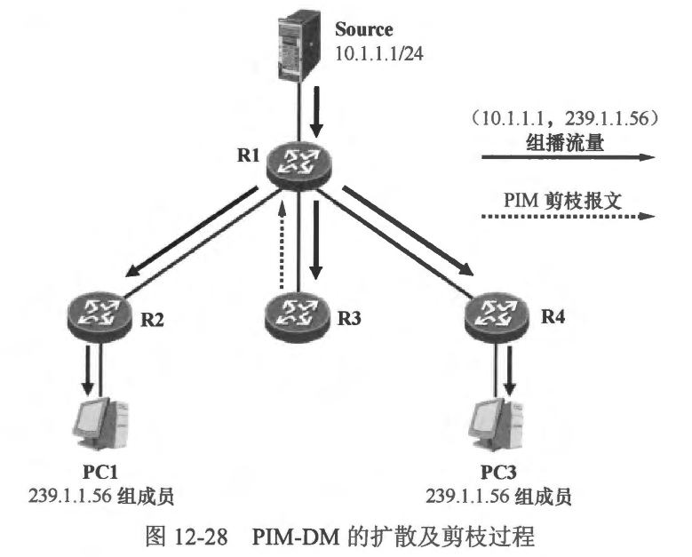
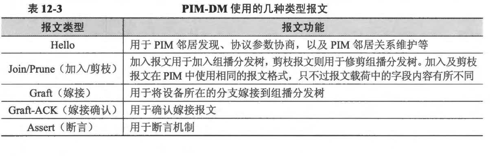

### PIM-DM

- PIM-DM (PIM Dense Mode)是 PIM 的密集模式，它适用于组播接收者较为密集的紧凑型网络。PIM-DM 开始工作后，假定网络中的每一个分支均存在组播接收者，因此当源开始发送组播流量后，组播流量首先被扩散(Flood)到全网各个分支，此时 PIM-DM 所形成的组播分发树 （PIM-DM 使用的组播分发树是SPT）将覆盖全网。完成组播流量的全网扩散后，存在组播接收者的分支自然会立即收到所需的组播流量，然而网络中也很可能存在没有任何接收者的分支，它们对这些组播流量并不感兴趣，此时不需要这些组播流量的网络设备采用一种剪枝（Prune）的方式将自己从组播分发树上剪除。
- 在图 12-28 中，全网的路由器都激活了 PIM-DM。当组播源 Source 开始向组播组 239.1.1.56 发送组播流量时，R1 作为第一跳路由器将率先收到组播流量，由于 R1 运行的是 PIM-DM，因此在确定组播流量从朝向源的上游接口(RPF 接口)收到后，它将组播流量从所有存在 PIM 邻居的接口（除了上游接口）转发出去。R2、R3及R4 都将收到 R1 转发的 （10.1.1.1，239.1.1.56）组播流量。这些路由器收到组播流量后，也都执行 RPF 检查，检查通过后继续向下游转发。这就是 PIM-DM 的扩散过程。初始时 PIM-DM 将组播流量“粗犷”地扩散到网络中的各个角落。然而 R3 并不需要这些组播流量，因此它将发起一个剪枝过程，将自己从 SPT 上剪除。
  
- PIM-DM 的另一个重要的工作机制是嫁接（Graft），在本例中，如果 R3 下联了一个网络，并且网络中出现了 239.1.1.56 的组成员，那么它将立即发起一个嫁接过程，将自己所在的分支嫁接到 SPT 上，从而获得组播流量。
- 从以上的描述可以看出，PIM-DM 的操作是比较粗犷的，这个特点使得 PM-DM 只能用于一些小规模的、组播接收者分布比较密集的组播网络。
- 本节学习内容:
  - 了解PIM-DM 的特点及适用的网络场景
  - 掌握 PIM-DM 的基础工作机制: 扩散过程、剪枝过程、嫁接过程以及断言机制等
  - 掌握 PIM-DM 的基础配置

<br>
<br>

### 12.6.1 协议报文

- PIM 的协议报文直接采用卫封装，在I报文头部中协议号字段的值为 103。PIM-DM 及 PIM-SM 使用的协议报文类型有所不同。对于 PIM-DM 而言，使用表 12-3 罗列的几种类型的报文。
  

<br>
<br>

### 12.6.2 邻居关系

- 当路由器的接口激活了 PIM 后，该接口便开始周期性地发送 PIM Hello 报文，报文的源 IP 地址为路由器的接口 IP 地址，而目的 IP 地址是组播IP地址 224.0.0.13（所有 PIMv2 路由器组播地址）。缺省时，Hello 报文的发送间隔是30 秒，该时间间隔可以通过 ``ip pim hello-interval <seconds>`` 命令修改，这条命令可以在接口视图或 PIM 视图下配置，如果两者同时配置，那么以接口视图下所配置的值为准。
- 路由器通过 Hello 报文发现直连链路上的 PIM 邻居，也依赖 Hello 报文维持 PIM 邻居关系。此外，PIM 的DR 选举也是依赖 Hello 报文的交互来完成的。
- 当路由器通过 Hello 报文发现了一个 PIM 邻居后，会为该邻居启动一个计时器，该计时器的时间设置为对方的 Hello 报文中所携带的 Holdtime（缺省为 105 秒），如果在计时器超时之前再次收到了该邻居发送的 Hello报文，则刷新该计时器，如果一直未收到邻居的 Hello 报文，导致该计时器超时，则该邻居将立即被删除。
- **说明: Holdtime指的是路由器等待接收其PIM 邻居发送Hello报文的超时时间。**
- 使用 ``ip pim <interface> hello-interval <seconds> holdtime <seconds>`` 命令，可修改 Hello 报文中的 Holdtime。命令同样可以在接口视图或 PIM 视图下配置，如果两者同时配置，那么以接口视图下所配置的值为准。
- 在图12-29 中，路由器都在各自的接口上激活了 PIM。以 R1 为例，它将在 GE0/0/0、GE0/0/1 及 GE0/0/2 接口上分别发现 PIM 邻居 R2、 R3 及 R4。
  
- 使用 ``show ip pim neighbor``命令可以查看 PIM 邻居表

```shell
R1#show ip pim neighbor
PIM Neighbor Table
Mode: B - Bidir Capable, DR - Designated Router, N - Default DR Priority,
      S - State Refresh Capable
Neighbor          Interface                Uptime/Expires    Ver   DR
Address                                                            Prio/Mode
192.168.1.254     FastEthernet0/0          00:08:35/00:01:31 v2    1 / DR S
10.1.12.2         FastEthernet0/1          00:08:45/00:01:23 v2    1 / DR S
10.1.14.4         FastEthernet1/0          00:07:33/00:01:34 v2    1 / DR S
10.1.13.3         FastEthernet1/4          00:05:13/00:01:28 v2    1 / DR S
```

<br>
<br>

### 12.6.3 扩散过程

- 接下来详细地分析一下 PIM-DM 的扩散过程。在 图12-30 所示的网络中，我们首先在每台路由器上部署了 OSPF，使得它们都能够通过 OSPF 学习到去往全网各个网段的路由，随后又在每合路由器的相关接口上激活了 PIM-DM。R2 及 R4 都在其连接终端网段的接口上激活了 IGMPv2。
  
- PC1 及 PC2 是组播组 239.1.1.15 的成员，它们通过发送 IGMPv2 成员关系报告宣告自己加入该组播组。R2 及 R4 将分别收到 PC1 及PC2 发送的IGMP 报文并创建相关 IGMP组表项及IGMP路由表项。
- 以R2 为例，它将维护如下组播路由表项:

```shell
R2#show ip mroute
IP Multicast Routing Table
Flags: D - Dense, S - Sparse, B - Bidir Group, s - SSM Group, C - Connected,
       L - Local, P - Pruned, R - RP-bit set, F - Register flag,
       T - SPT-bit set, J - Join SPT, M - MSDP created entry,
       X - Proxy Join Timer Running, A - Candidate for MSDP Advertisement,
       U - URD, I - Received Source Specific Host Report,
       Z - Multicast Tunnel, z - MDT-data group sender,
       Y - Joined MDT-data group, y - Sending to MDT-data group
Outgoing interface flags: H - Hardware switched, A - Assert winner
 Timers: Uptime/Expires
 Interface state: Interface, Next-Hop or VCD, State/Mode

(*, 228.50.50.50), 00:00:24/stopped, RP 0.0.0.0, flags: DC
  Incoming interface: Null, RPF nbr 0.0.0.0
  Outgoing interface list:
    FastEthernet0/0, Forward/Dense, 00:00:24/00:00:00
    FastEthernet0/1, Forward/Dense, 00:00:24/00:00:00
```

- 现在一切都已经准备就绪。当组播源 Source 开始向组播组 228.50.50.50 发送组播流量时，组播流量的扩散过程就开始了。

  - Source 开始向组播组 228.50.50.50 发送组播流量，这些组播流量其实就是大量的组播报文。以多媒体直播为例，Source 通过软件直播多媒体影像，影像内容被软件编码并在 Source 的网卡上形成一个个组播报文。组播报文大多采用 UDP 封装。在本例中，Source 所产生的组播报文的源 IP 地址为 10.1.1.1，也即 Source 的地址，而目的 IP 地址为 228.50.50.50。在实际应用中，UDP 目的端口号以及组播地址通常都是可以自定义的。当然，PC1 、PC2 作为接收者，也需要开启相应的软件，并侦听对应的 UDP 端口及组播地址。
  - 当一个组播报文到达 R1 的 GE2/0/0 接口时，R1 首先对报文进行 RPF 检查。由于报文的源地址是 10.1.1.1，该 IP 地址在 R1 的 GE2/0/0 接口的直连网段中，因此在该接口到达的组播报文通过 RPF 检查。R1 在其 PIM路由表中创建一个(10.1.1.1, 239.1.1.15)表项，并将直连 Source 的 GE2/0/0 接口指定为该表项的上游接口，同时将所有连接 PIM 邻居的接口 (GE0/0/0、GE0/0/1 及 GEO/0/2)都指定为该表项的下游接口。然后 R1 将组播报文进行拷贝，并从下游接口转发出去，如 图12-31 所示。
    
  - **注意: R1 并不是每次在 GE2/0/0 接口上收到组播报文都执行 RPF 检查，那样效率太低，而且也增加了 R1 的负担。实际上，当首个(10.1.1.1，228.50.50.50)组播报文到达 GE2/0/0 接口时，R1将会执行 RPF 检查，检查通过后创建 (10.1.1.1，228.50.50.50）)表项，并在该表项中标记上游接口 GE2/0/0，后续的(10.1.1.1,228.50.50.50) 组播报文到达 R1 的 GE2/0/0 接口后，R1 將首先查询组播转发表，由于这些报文就是在 (10.1.1.1，228.50.50.50)表项的上游接口到达的，因此 R1 直接根据该表项的指引将报文从下游接口转发出去，而不用再次执行 RPF 检查。**
  - 此时 R1 的组播路由表项如下:

  ```shell
  R1#show ip mroute
  IP Multicast Routing Table
  Flags: D - Dense, S - Sparse, B - Bidir Group, s - SSM Group, C - Connected,
         L - Local, P - Pruned, R - RP-bit set, F - Register flag,
         T - SPT-bit set, J - Join SPT, M - MSDP created entry,
         X - Proxy Join Timer Running, A - Candidate for MSDP Advertisement,
         U - URD, I - Received Source Specific Host Report,
         Z - Multicast Tunnel, z - MDT-data group sender,
         Y - Joined MDT-data group, y - Sending to MDT-data group
  Outgoing interface flags: H - Hardware switched, A - Assert winner
   Timers: Uptime/Expires
   Interface state: Interface, Next-Hop or VCD, State/Mode

  (10.1.1.1, 228.50.50.50), 00:02:24/00:02:50, flags: T
    Incoming interface: FastEthernet0/0, RPF nbr 192.168.1.254*
    Outgoing interface list:
      FastEthernet0/1, Forward/Dense, 00:02:18/00:00:00
      FastEthernet1/0, Prune/Dense, 00:02:24/00:00:39
      FastEthernet1/4, Prune/Dense, 00:02:24/00:00:41
  ```

  - 从上面的输出以看出，R1 己经创建了 （10.1.1.1，228.50.50.50） PIM 路由表项，而且该表项包含三个下游接口。值得注意的是，对于本例而言，上述呈现的内容仅仅会持续一瞬间，在实际环境中测试时，由于PIM 的扩散及剪枝过程非常迅速，因此可能难以观察到以上现象。
  - R2 在GE0/0/0 接口收到 (10.1.1.1，228.50.50.50) 组播流量后，首先进行 RFF 检查，通过查询单播路由表，R2 发现到达组播源 10.1.1.1 的出接口是 GE0/0/0，因此从该接口到达的组播流量被认为通过 RPF 检查。于是 R2 在P™M路由表中创建 (10.1.1.1,228.50.50.50) 表项，将 GE0/0/0 接口指定为上游接口，同时将所有连接PIM 邻居的接口都指定为该表项的下游接口。在本例中，R2 除了在 GE0/0/0 接口上维护着 PIM 邻居之外，并没有在其他接口上发现 PIM 邻居，但是本地IGMP 路由表中存在 (*,228.50.50.50) IGMP 路由表项，而且该表项中包含下游接口 GE0/0/1，于是 R2 将 GE0/0/1 接口添加到组播路由表项 (10.1.1.1,228.50.50.50) 的下游接口列表中。接下来，R2 将 (10.1.1.1,228.50.50.50) 组播流量从 GE0/0/1 接口转发出去，如此一来，PC1 便获得了该组播流量，如图 12-32 所示
  - 此时 R2 的组播路由表项如下:

  ```shell
  R2#show ip mroute
  IP Multicast Routing Table
  Flags: D - Dense, S - Sparse, B - Bidir Group, s - SSM Group, C - Connected,
         L - Local, P - Pruned, R - RP-bit set, F - Register flag,
         T - SPT-bit set, J - Join SPT, M - MSDP created entry,
         X - Proxy Join Timer Running, A - Candidate for MSDP Advertisement,
         U - URD, I - Received Source Specific Host Report,
         Z - Multicast Tunnel, z - MDT-data group sender,
         Y - Joined MDT-data group, y - Sending to MDT-data group
  Outgoing interface flags: H - Hardware switched, A - Assert winner
   Timers: Uptime/Expires
   Interface state: Interface, Next-Hop or VCD, State/Mode
  
  (10.1.1.1, 228.50.50.50), 00:06:53/00:02:58, flags: T
    Incoming interface: FastEthernet0/1, RPF nbr 10.1.12.1
    Outgoing interface list:
      FastEthernet0/0, Forward/Dense, 00:06:49/00:00:00, A
  ```

- R4 的操作过程与 R2 类似，此处不再赘述。最终，它将创建 (10.1.1.1，228.50.50.50) 组播路由表项，并将（10.1.1.1，228.50.50.50） 组播流量转发到 GE0/0/1 接口。
- R3 在 GE0/0/0 接口收到 (10.1.1.1， 228.50.50.50) 组播流量后，首先进行 RPF 检查，通过查询单播路由表，R3 发现到达组播源 10.1.1.1 的出接口是 GE0/0/0，因此从该按口到达的组播流量被认为通过 RPF 检查。于是 R3 在 PIM 路由表中创建 (10.1.1.1,228.50.50.50) 表项，将 GE0/0/0 接口指定为上游接口，同时将所有连接 PIM 邻居的接口都指定为该表项的下游接口。在本例中，R3 的 GE0/0/1 接口将被添加到 (10.1.1.1,228.50.50.50) 表项的下游接口列表中。接下来，R3 将（10.1.1.1， 228.50.50.50）组播流量从 GE0/0/1 接口转发出去，如图 12-32 所示。
  
- 综上，当 Source 开始向网络中发送组播流量后，这些流量在初始时被 PIM-DM 扩散到了全网。

<br>
<br>

### 12.6.4 剪枝过程
- 在图 12-32 中，当 Source 开始发送 (10.1.1.1，228.50.50.50)组播流量后，开始时这些组播流量将被 PIM-DM 扩散到全网。PC1 及 PC2 需要这些组播流量，因此它们可以在第一时问接收该流量。然而，R5 并不直连任何 228.50.50.50 组成员，因此它并不需要这些流量。此时 R5的（10.1.1.1,239.1.1.15）表项的下游接口列表为空，它将通过向上游 PIM 邻居发送 PIM 剪枝报文，将自己从 SPT 上剪除（如图 12-33 所示）。
 
- 图 12-34 展示了 R5 发送的 PIM 剪枝报文。留意到该报文的源 IP 地址为 R5 的接口 IP 地址 10.1.35.5，而目的 IP 地址为组播地址 224.0.0.13。在报文中的 PIM 载荷内，写入了 R5 剪枝的组播组地址 228.50.50.50 和组播源 IP 地址 10.1.1.1。

- R3 在 GE0/0/1 接口收到该剪枝报文后，在其 (10.1.1.1，228.50.50.50)表项中将该接口从下游接口列表中移除，同时为该接口的剪枝状态启动一个计时器，当该计时器超时的时候，接口的剪枝状态将被取消，然后 R3 又将继续从该接口下发 (10.1.1.1,228.50.50.50) 组播流量，在计时器超时之前，如果接口再次收到 R5 发送过来的剪枝报文，那么计时器将会重置。因此，R5 将周期性地向 R3 发送剪枝报文，以便持续刷新 R3 的 GEO/0/1 接口的剪枝状态。
- **说明:如果 PIM 路由器不得不在无需组播流量的链路上持续周期性地发送剪枝报文，这显然是低效的，状态刷新（State Refresh）机制优化了这个过程。**
- 由于此时 R3 的 (10.1.1.1，228.50.50.50)表项中下游接口列表为空，因此它意识到自己并不需要 （10.1.1.1， 228.50.50.50）的组播流量，于是它从上游接口向上游 PIM 邻居发送剪枝报文，如图 12-33 所示。
- R1 在 GE0/0/1 接口上收到 R3 发送的剪枝报文后，将该接口从 (10.1.1.1, 228.50.50.50)表项的下游接口列表中删除。
- 完成修剪过程后，R1 只会将（10.1.1.1，228.50.50.50）组播流量转发给 R2 及 R4，而 R3 及 R5 则不会再收到该组播流量。

<br>
<br>

### 12.6.5 嫁接过程
- 大家已经知道，PIM-DM 在初始化过程中，组播流量被扩散到全网各个角落，不需要组播流量的组播路由器需通过 PIM 剪枝报文将自己所在的分支从 SPT 上剪除，那么，在此之后，如果某个己经被剪枝的分支现在又需要组播流量了，不可能等上游设备接口的剪枝状态超时后，才能再次接收组播流量。为此，PIM-DM 定义了嫁接机制，使得组播路由器在需要组播流量时，可以主动将自己所在的分支嫁接到 SFT中。
- 在图 12-35 中，五台路由器构成了一个组播网络，每台路由器都运行了 PIM-DM,R1 连接着组播源 Source，而R3则连接着组播组 239.1.1.81 的接收者。网络初始化过程中，Source 发出的 (10.1.1.1，239.1.1.81)组播流量将被推送到全网，由于R4 及 R5 并不需要 (10.1.1.1，239.1.1.81)组播流量，因此它们各自向上游邻居发送 PIM 剪枝报文。网络稳定后，组播流量按照图中所示的路径转发。现在，R5所直连的网络中，出现了组播组 239.1.1.81 的成员 PC2（如图 12-36所示），为了将自己拉回 SPT，R5 将向其上游邻居R4 发送一个嫁接报文。下面分析一下整个过程:
  - R5通过 PC2 发送的IGMP 成员关系报告发现直连网络中出现了组 239.1.1.81 的成员，于是向上游邻居 R4 发送一个PIM 嫁接报文，这是一个单播报文（如图 12-37 所示），该披文的源 IP 地址是R5 的接口地址 10.1.45.5， 目的IP地址是上游邻居 R4的接口地址 10.1.45.4，报文中填充着（10.1.1.1，239.1.1.81） 的信息。
  - R5 为上游接口 GE0/0/1 启动一个嫁接计时器（缺省3秒），如果在该计时器超时后依然没有收到上游邻居发回的 PIM 嫁接确认报文则继续发送嫁按报文。
  
  - R4 将在其 GE0/0/2 接口上收到 R5 发送的嫁接报文，由于该接口当前处于剪枝状态，因此 R4 将其切换到转发状态，并将该接口添加到 (10.1.1.1， 239.1.1.81）)表项的下游接口列表中，然后向 R5 发送一个嫁接确认报文。此时由于 R4 自己并未接收到（10.1.1.1，239.1.1.81）组播流量，因此它需要继续往自己的上游发送嫁接报文。R4的上游接口 GE0/0/1 当前处于剪枝状态，R4 将其切换到转发状态，并从该接口发送单播的嫁接报文给 R1。R4 为该接口启动嫁接计时器，并等待R1 的嫁接确认报文。
  - R1 在 GE0/0/1 接口上收到 R4 发送的嫁接报文后，它将原来处于剪枝状态的 GE0/0/1 接口切换到转发状态，并将该接口添加到 (10.1.1.1，239.1.1.81) 表项的下游接口列表中，然后向 R4 发送一个嫁接确认报文。此时由于 R1 己经获得了 (10.1.1.1,239.1.1.81) 组播流量，因此 R1 直接将组播流量拷贝到下游接口 GE0/0/1。 图 12-38 描述了这个过程。
  
  - 现在，新的SPT 已经构建完成，组播流量沿着新的 SPT 从源转发到接收者，如 图12-39 所示。
   

  <br>
  <br>

  ### 12.6.6 断言机制
在图 12-40 所示的网络中存在 4 台组播路由器，它们都运行了 PIM-DM，其中 R2、R3 及 R4 各自有一个接口连接到同一台二层交换机。PC 是组播组 239.1.1.37 的成员，当组播源 Source 开始向 239.1.1.37 发送组播流量时，R1 会将组播流量转发给 R2 及 R3，R2 及 R3 各自对接收的组播流量进行 RPF 检查，检查通过后将流量从自己的 GE0/0/1 接口转发出去。这样，R3 及 R4 会收到 R2 从 GE0/O/1 接口发出的组播流量，R3 同理。结果便是 R4 将在自己的 GE0/0/1 接口收到两份重复的组播报文。这显然是没有意义的，况且大量重复的组播流量还会造成网络带宽及设备资源的浪费。
 
- 断言 （Assert）机制可以很好地解决这个问题。这个机制依赖于 PIM 的断言报文，该机制在 PIM-DM 及 PIM-SM 中均被使用。断言机制能够防止多合组播路由器向同一个网段转发重复的组播流量。当路由器的某个接口被指定为 (S，G) 表项的下游接口，并且该接口收到了(S，G) 的组播流量时，断言机制将被触发，这种现象意味着在同一个网段内，还有其他设备在发送重复的组播流量，因此一场选举将会展开，从选举中胜出的一方继续向该网段转发 (S，G)组播流量，而失败的一方则停止向该网段转发 (S，G) 组播流量。
- 回到图 12-40 所示的例子，来解析一下断言机制的工作原理。
  - R2 在自己的上游接口收到 （10.1.1.1，239.1.1.37）组播报文，该报文经 RPF 检查通过后，被R2 从下游接口 GE0/0/1 转发出去；R3同理。
  - R2 在自己的（10.1.1.1，239.1.1.37）下游接口 GE0/0/1 上收到了R3转发的 (10.1.1.1,239.1.1.37）组播报文，该报文无法通过 RPF 检查，因此直接被 R2 丢弃，与此同时，R2 在 GE0/0/1 接口上启动断言机制。R3 同理。起初双方都认为自己是胜利的一方（Winner)，各自从 GE0/0/1 接口发送 PIM 断言报文（如图12-41 所示）。这个报文就像是双方用于选举的简历，里面包含着用于一较高下的信息。假设在本场景中 R2 通过 OSPF 获知到达 Source 的路由 (OSPF 内部路由)，并且路由的度量值为 2，而 R3 则并未运行 OSPF，而是配置了到达 Source 的静态路由，静态路由的缺省度量值为 0。
  - R2 发送出去的断言报文，源 IP 地址即R2 的接口『P地址，目的IP地址为组播地址 224.0.0.13，而报文中的P™M 载荷部分包含 4 个关键宇段：组播组地址、组播源地址、优先级和度量值，其中组播组地址为 239.1.1.37，组播源地址为 10.1.1.1，优先级则是 R2 到达 Source 的单播路由的优先级，此处值为10(因为 R2 是通过 OSPF 发现到达 10.1.1.1 的路由，OSPF 内部路由的缺省优先级信为 10)，度量值则为 2。另一方面，R3 发出的断言报文中，优先级值为 60(静态路由缺省优先级值为60)，度量值为0。
   
  - R2 及R3收到对方发送的断言报文后，便会进行比较，比较的内容及顺序如下。
    - 比较双方到达组播源的单播路由优先级，优选值最小一方；
    - 比较双方到达组播源的单播路由度量值，优选值最小的一方；
    - 比较双方的接口IP 地址，优选『地址最大的一方。
  - 根据上面的比较顺序，首先 R2 到达 Source 的单播路由优先级值为 10，而 R3 该值为 60，值更小的一方胜出，因此 R2 在本次选举中胜出。R2 的 GE0/0/1 接口作为胜出的一方，保持转发状态，继续向直连网段转发 (10.1.1.1， 239.1.1.37) 组播流量，而选举失败的 R3 则不再从自己的 GE0/0/1 接口转发 (10.1.1.1，239.1.1.37) 组播流量。

<br>
<br>

### 12.6.7 案例：PIM-DM 基础配置
- 在图 12-42 中，4 台路由器构成了一个组播网络，R1 作为第一跳路由器，直连着组播源 Source，R4 作为最后一跳路由器，直连着组播组 239.1.1.62 的成员。为了使得 Source
发往 239.1.1.62 的组播流量能够被 PC 顺利接收，首先在 4 台路由器上部署 OSPF，使得每合路由器都能获知到达全网各个网段的单播路由。然后在每台路由器上部署 PIM-DM，并在 R4 的GE0/0/0 接口上激活 IGMPv2。
 