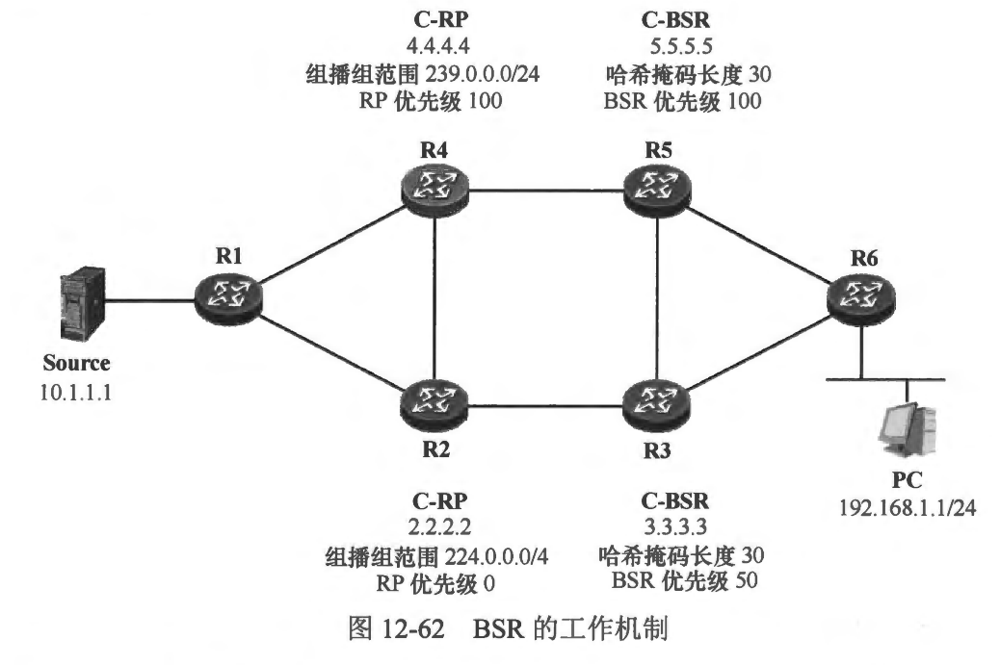
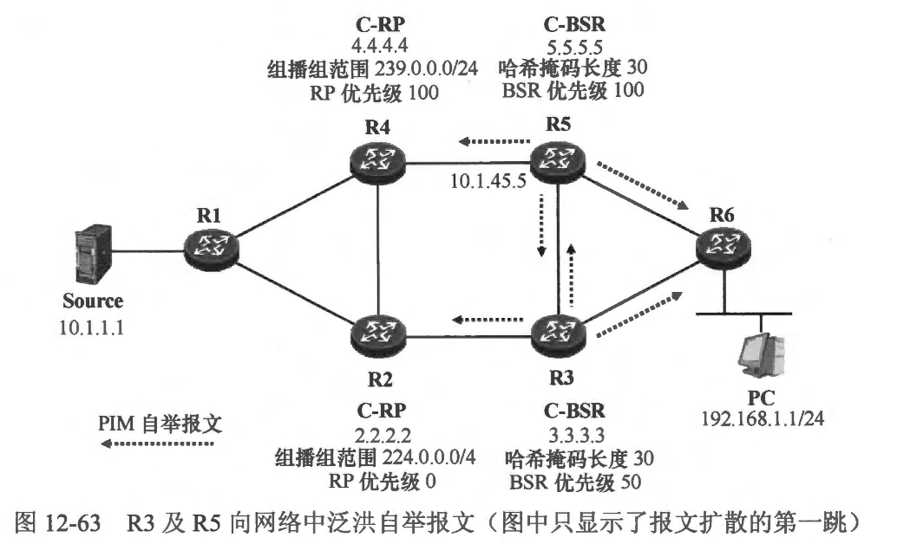
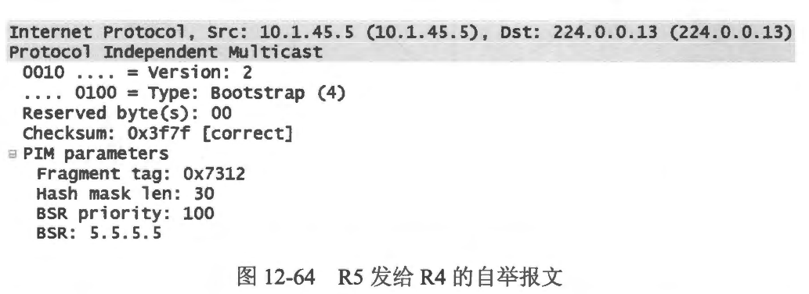
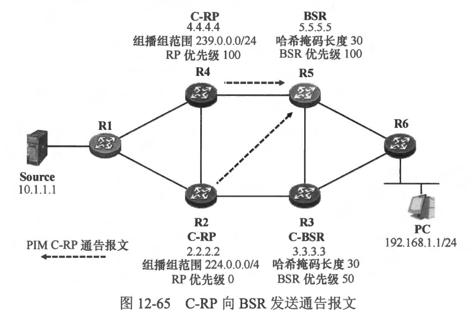
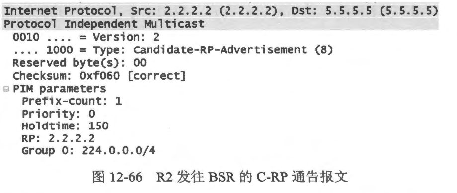
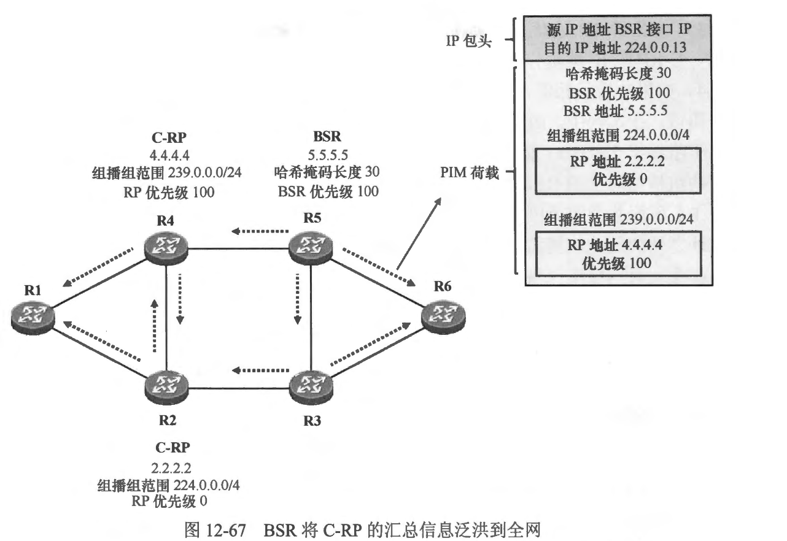
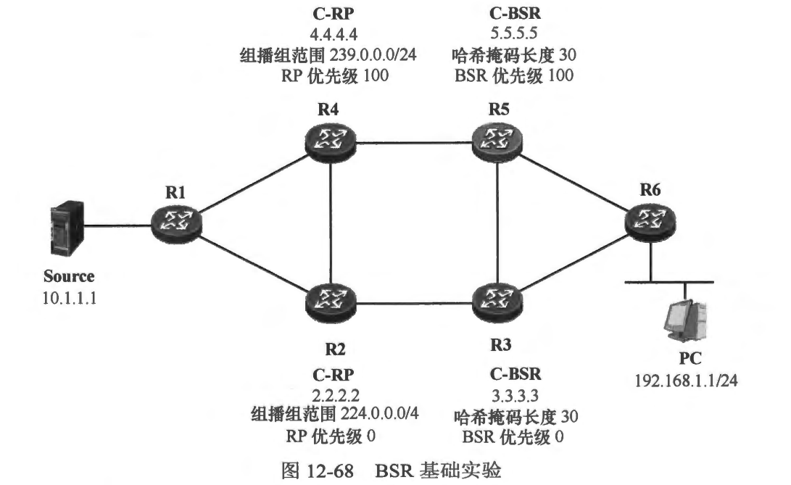

### 12.8 RP发现
- RP在PIM-SM 网络中的地位是非常关键的。PIM-SM 路由器可以通过两种方式发现网络中的 RP。
  - 通过手工配置的方式
  - 通过 BSR 动态发现
- 通过手工配置的方式为 PIM-SM 路由器指定 RP 的地址是一种简单直接的方法，这种方式配置的 RP 被称为静态 RP，该方式适用于规模较小的组播网络，网络管理员仅需在所有的 PIM-SM 路由器上使用一条简单的命令即可为设备指定 RP 的地址。在一个大型的 PIM-SM 网络中，考虑到组播路由器的数量比较庞大，在每台设备都进行相应的配置是比较繁琐的，而且当 RP 的地址发生变化时，网络管理员又不得不手工在每台设备上修改配置。
- BSR (Bootstrap Router) 使得 PIM-SM 路由器能够动态地发现与组播组对应的 RP。通过 BSR，组播路由器能够在当前 RP 出现故障的情况下动态地感知到变化的发生，并且自动进行切换。而且在一些大型网络中，可能存在多个RP，BSR 能够将不同的组播组映射到不同的 RP 上（注意，相同的组播组必须映射到同一个RP），使得单个RP的负裁不至于过高。

<br>
<br>

### 12.8.1 12.8.1 静态RP
- 对于规模较小的 PIM-SM 网络，通常我们会在网络设备中指定其中一合作为组播组的 RP。为了让网络中的PIM-SM 路由器都知晓 RP 的地址，一个最简单的方式是使用手工配置的方式在每一台路由器上指定 RP 的地址。在PIM-SM路由器的 PIM 配置视图中，static-rp 命令用于配置静态 RP。当然，为了确保 RP 能够正确地发挥作用，网络中的所有PIM-SM 路由器必须具备到达 RP 的正确单播路由信息，否则即便路由器知晓了 RP 的地址，也无法构建 RPT，或者向 RP 发起注册过程。
- 在一个实际网络中，作为 RP 的设备往往同时有多个接口接入组播网络，如 图 12-60 所示，R3 被选择作为网络中的RP，它的 GE0/0/0、GE0/0/1 及 GE0/0/2 接口都连接到网络中，那么究竟该选择哪一个接口的地址作为 RP 的地址呢？假设选择 GE0/0/0 的 IP 地址，即 10.1.13.3/24 作为 RP 地址，那么一旦该接口发生故障，或者该接口所直连的链路发生故障，该地址将变为不可达，RP 自然也就无法被正常访问。使用 GE0/0/1 或者 GE0/0/2接口的 IP 地址为作为 RP 的地址同样存在类似的问题。实际上，在该网络中，为了确保所有的 PIM-SM 路由器都具备到达 RP 的路由信息，路由器很可能都部署了诸如 OSPF 之类的动态路由协议。当 R3 的某个接口发生故障时，网络中的 PIM-SM 路由器可以通过其他接口访问 R3，换而言之，到达 R3的路径可以借助动态路由协议实现冗余性。因此一个更佳的解决方案是，在R3上创建 Loopback 接口，为该接口分配一个 IP 地址，例如 3.3.3.3/32，然后将该地址通告到动态路由协议中。这样，全网的 PIM-SM 路由器都能通过动态路由协议了解去往 3.3.3.3/32 的路由，接下来所有的 PIM-SM 路由器都将组播组映射到 3.3.3.3/32。由于 Loopback 接口是稳定可靠的，加上网络中存在动态路由协议，因此只要 R3 还有一个活跃的接口在正常工作，网络中的 PIM-SM 路由器就依然能够通过这个接口到达 3.3.3.3/32，从而保持与 RP 的连通性。值得一提的是，作为静态 RP的接口不必激活 P™M-SM。例如本例中，R3 使用其 Loopback0 接口地址作为RP的地址，那么其 Loopback0 接口可以不必激活 PIM-SM。

- 在 PIM-SM 中使用 `ip pim rp-address`  命令时，静态RP的 IP 地址是必须填写的参数，此外还有一些其他的可选参数。例如，`ip pim rp-address`  命令可以关联一个 ACL，用于控制静态 RP 所服务的组播组。在配置这个功能时，需要先定义一个 ACL，在 ACL 中匹配特定的组播组地址，然后在 `ip pim rp-address`  命令中指定静态 RP 的地址并关联该 ACL，这样这个静态 RP将只为该 ACL 中所匹配的组播组服务。如果 `ip pim rp-address` 命令中并没有关联任何 ACL，那么该命令所配置的静态 RP 將为所有的组播组服务。
- 在图 12-61中，假设该网络使用了多个组播组(239.0.0.0/24)，为了避免所有的组播组都映射到单一的 RP 上导致该 RP 负担过重，网络中规划了两个 RP，它们分别是 R2 及 R3。R2 及 R3 各自创建一个 Loopback0 接口，并分别配置 IP 地址 2.2.2.2/32 及 3.3.3.3/32。二者都将各自的 Loopback0 接口的直连路由通告到网络中所运行的单播动态路由协议中。接下来，可以将组播组 239.0.0.0/25 映射到 R2，将 239.0.0.128/25 映射到 R3。以 R4 为例，它的静态 RP 配置如下:

```shell
R4(config)# access-list 10 permit 239.0.0.0 0.0.0.127
R4(config)# access-list 20 permit 239.0.0.128 0.0.0.127

R4(config)# ip pim rp-address 3.3.3.3 20
R4(config)# ip pim rp-address 2.2.2.2 10
```


- 当然，R1、R2 及 R3 的配置均与上达配置完全相同，对于同一个组播组，网络中所有PIM-SM 路由器必须映射到相同的 RP 上，否则该组播组的工作就会出现问题。完成上述配置后，可以通过 `show ip pim rp mapping` 命令查看生效情况，如在 R4 上执行这条命令，可以看到如下输出:

```shell
R4#show ip pim rp mapping
PIM Group-to-RP Mappings

Acl: 20, Static
    RP: 3.3.3.3 (?)
Acl: 10, Static
    RP: 2.2.2.2 (?)
```

- 我们也可以在 display pim rp-info 命令中增加组播组卫P 地址，从而查询该组播组映射到的 RP 地址。例如在R4 上执行 show ip pim rp mapping 239.0.0.177 命令，可以看到如下输出:

```shell
R4#show ip pim rp mapping 239.0.0.177
PIM Group-to-RP Mappings

Acl: 20, Static
    RP: 3.3.3.3 (?)
```
- 组播组 239.0.0.177 映射到了 RP3.3.3.3，这与我们的规划是相符的。
- 在 12.8 节开始的时候，读者己经了解到，PIM-SM 路由器存在两种发现 RP 的机制，一种是静态 RP 方式，另一种则是采用 BSR 的方式，让网络中的 PIM-SM 路由器自动发现 RP。在一台PIM-SM 路由器上，允许同时部署这两种 RP 发现机制。此时对于同一个组播组地址，通过这两种 RP 发现机制映射的 RP 地址如果不同，缺省情况下，路由器将优先选择 BSR 发现的动态 RP。当该动态 RP 失效时，则自动切换到手工配置的静态 RP。当然，可以通过命令改变这种优选顺序。如果在使用 static-rp 命令配置静态 RP时，增加 preferred 关键字，那么路由器将优选手工配置的静态RP。
- static-rp 命令可以在一台路由器上多次执行，但是同一个 ACL 只能映射到一个静态 RP。如果 static-rp 命令不关联任何 ACL，那么只能配置一个静态RP。
- 需要再次强调的是，RP 的地位在 PIM-SM 网络中是非常关键的。针对 RP 有如下要求。
  - 所有 PIM-SM 路由器（包括 RP 本身）需要有针对 RP 完全一致的认知。同一个组播组，在所有的 PIM-SM 路由器上必须映射到相同的 RP。
  - 一个特定的组播组只能被映射到唯一的 RP上。如果在同一个 PIM-SM 网络中，一个组播组被映射到了不同的 RP，那么组播的工作显然是会出现问题的。

<br>
<br>

### 12.8.2 BSR概述
- RP 相当于组播网络中的一个组播数据汇聚中心，而 BSR (BootStrap Router)则相当于组播网络中的管理中心，它管理着动态选举 RP 的整个过程。BSR 的工作机制并不复杂。首先网络中会选举出一台 BSR，BSR 被选举出来之后，它将向整个网络通告自己的存在。网络中的 PIM-SM 路由器会侦听 BSR 所泛洪的通告并保存 BSR 的相关信息，而 C-RP (Candidate-RP，候选 RP) 则纷纷向 BSR 发送自己的候选通告。BSR 收集所有 C-RP 发送过来的候选通告后，将这些通告加以汇总,然后将汇总的信息向全网进行泛洪。
- 网络中所有的 PIM-SM 路由器都会收到这个汇总信息，然后各自基于这些信息，采用相同的算法进行计算，最终得到组播组与 RP 的映射关系。由于每台 PIM-SM 路由器所收到的 C-RP 信息集合是一致的，而且基于这些信息采用相同的算法进行计算，因此得出的组播组与 RP 的映射关系必然也是相同的。
- 在网络中部署 BSR 后，网络中将存在以下几种设备类型。
- C-BSR
  - 网络中允许存在一合或者多台 C-BSR, C-BSR (Candidate-BSR，候选 BSR) 是 BSR 的候选者，它们都有意愿成为 BSR，在成为 BSR 之前，它们之间要进行选举，胜出的 C-BSR 成为该网络的 BSR。BSR 的选举是通过 PIM 自举（Bootstrap）报文进行的，报文中包含 C-BSR 的优先级、哈希掩码长度，以及其 IP 地址等信息。网络中优先级值最大的 C-BSR 胜出成为 BSR，如果优先级相等，那么拥有最大卫地址的 C-BSR 将会胜出。
- BSR
  - 在一个 PIM-SM 网络中，可以存在一台或多合 C-BSR，但只会存在一合 BSR，它是从所有 C-BSR 中选举产生的。BSR 周期性地向网络中泛洪自举报文，以通告自己的信息。所有 C-RP 都会知晓 BSR 的地址。BSR 负责收集 C-RP 发送过来的信息，将 CRP 信息汇总后泛洪到整个 PIM-SM 网络中。从这个层面可以看出，实际上 BSR 并不决定组播组与 RP 的映射关系，它只是简单地将 C-RP 的信息汇总并扩散，而决定组播组与 RP 映射关系的是每一台 PIM-SM 路由器自己。
- C-RP
  - CRP 是R P 的候选者，网络中允许存在一台或多合 C-RP，这些C-RP 可以为不同的组播组范围服务，而且组播组范围可以有重叠。C-RP 获知 BSR 的地址后，将自己负责的组播组范围、RP 优先级及 卫地址等信息以单播的形式发送给 BSR。
- RP
  - 关于 RP 的概念此处不再多介绍，读者已经非常熟悉了。如果 PTM-SM 路由器采用 BSR 自动发现RP，那么每一合 PIM-SM 路由器会基于 BSR 泛洪的、关于所有 C-RP 的信息进行计算，最终将组播组映射到 RP。所有 PIM-SM 路由器针对相同的组播组，都会映射到同一台 RP。
一台 PIM-SM 路由器可以是 C-BSR，同时又是一合 C-RP，当然，路由器也可以既不是 C-BSR，又不是 C-RP，此时它将不会参与 BSR 的竞选，也不会参与RP的竞选，但是它们会侦听 BSR 通告的 C-RP 汇总信息。

<br>
<br>

### 12.8.3 BSR 工作机制
- 在图 12-62 中，所有的路由器都运行了 PIM-SM，其中 R3 及 R5 是 C-BSR,R2 及 R4 是 C-RP。下面简单地讲解一下 BSR 的工作过程。假设 R5 的 BSR 优先级值为 100，R3 的 BSR 优先级值为 50。

  - 初始时，R3 及RS 都认为自己是 BSR，它们都向网络中泛洪 PIM 自举报文（如图 12-63 所示），该报文以组播的方式发送，目的卫地址是组播IP 地址 224.0.0.13。自举报文会被扩散到全网（实际上自举报文是逐跳地传遍整个网络的），这使得所有的 C-BSR 都能知晓网络中其他 C-BSR 的信息。自举报文中包含着多个重要信息，其中有两个信息在这个过程中发挥着关键作用，一是发送该报文的 C-BSR 的优先级，二是该 C-BSR 的 IP 地址。
    - 以R5为例，它会从自己连接 R3、R4 及 R6 的接口都发送自举报文，其中，从连接 R4 的接口发出的自举报文的源地址为10.1.45.5，目的IP地址是 224.0.0.13。图 12-64 描述了这个报文的结构。值得注意的是，该报文的 TTL 值为1，也就是只会传递1跳。
    
    
    - 再以 R4 为例，它收到这个自举报文后，会记录报文中的相关信息，并重新产生自举报文，然后继续向其连接 R1 及 R2 的接口泛洪。R4 在其连接 R1 的接口上泛洪的自举报文，源 IP 地址为该接口的 IP 地址，目的 IP 地址为 224.0.0.13，报文中承载着 C-BSR R5 的信息，当然，这个报文的 TTL 值也是为1，这就是所谓的逐跳传递。R3 及 R5 的 C-BSR 信息随着自举报文的逐跳传递，最终扩散到全网。
  - 现在，R3 及R5 都知道了对方的存在，也知道了对方的BSR 优先级 和 IP 地址。接下来开始 BSR 的选举过程。由于 R5 的优先级更高，因此它胜出成为该网络的 BSR。在选举胜出后，R5 将继续周期性（缺省发送问隔为 60 秒）地向网络中泛洪自举报文，而 R3 则不再发送包含自己 C-BSR 信息的自举报文。
    - 在路由器上使用 `show ip pim bsr` 命令可以查询当前的 BSR 信息,例如在 R4上执行命令可以看到如下输出:
    
    ```shell
    ```

  - 当网络中的 C-RP (R2 及R4) 明确了当前的 BSR 后，便立即开始周期性地发送PIV C-RP 通告 (Candidate-RP-Advertisement，候选RP通告) 报文。C-RP 通告报文是以单播的形式发送的，报文发往当前的 BSR。如图 12-65 所示，以R2为例，假设 R2 使用其 Loopback0 接口的地址 （2.2.2.2/32）作为 C-RP的地址，那么R2 所产生的 C-RP 通告报文的源 IP 地址为 2.2.2.2，而目的IP地址为 5.5.5.5。R2 及 R4 通过查询自己的单播路由表获取到达 BSR 的路径。
  
    - 图12-66 显示了 R2 发往 BSR 的 C-RP 通告报文，该报文中包含一些用于 RP 选举的信息，其中 “priority” 字段填写的是该 C-RP 的优先级，这个优先级的值越大，则优先级越低；“Holdtime” 字段则指示 BSR 等待接收该 C-RP 发送的 C-RP 通告报文的超时时间；“Rp” 字段填写的是该 C-RP的 IP 地址；“Group” 字段填写的是 C-RP 所服务的组播组范围。 
    
  - BSR 收到了 C-RP 发送过来的通告后，便知晓了每台 C-RP 的信息，它将这些言息进行汇总，然后封装在自己的自举报文中，周期性地向网络中泛洪。图 12-67 描述了这个过程。
   
    - 最终，全网的 PIM-SM 路由器都发现了网络中所有的 CRP 及其相关信息。需要强调的是，由于 PIM-SM 路由器都是从同一合 BSR 接收了 C-RP 的汇总信息，因此每台 PIM-SM 路由器最终获取到的信息是一致的。以R1 为例，使用 `show ip pim rp mapping` 命令可以看到如下输出:
    
    ```shell
    ```
    - 从上述信息可以看出，R1 发现了两个 C-RP，服务于组播组范围 224.0.0.0/4（所有组播组）的C-RP 有一个：2.2.2.2，服务于组播组范国 239.0.0.0/24 的C-RP 也有一个: 4.4.4.4。 其中 2.2.2.2 的优先级值为 0，4.4.4.4 的优先级值为 100。实际上网络中所有的 PIM-SM 路由器都拥有一致的信息。
  - 最后，每台 PIM-SM 路由器都基于 C-RP 汇总信息，使用相同的算法进行计算，得到每个组播组对应的 RP。采用的算法如下:
    - C-RP 所服务的组播组范围与该组播组地址匹配度最长的 C-RP 胜出
    - 如果 C-RP 所服务的组播组范围相同，则C-RP 优先级值最小的胜出
    - 如果 C-RP 的优先级都相同，那么进行哈希计算，将组播组地址、BSR 哈希掩码、C-RP 的 IP 地址作为哈希两数的输入，得到哈希结果，哈希值最大的胜出。
    - 如果哈希值相等，则CRP 的卫地址最大的胜出。所以，在本例中，由于R4 服务的组范围是 239.0.0.0/24，而R2 则是224.0.0.0/4，因此对于组播组 239.0.0.1 至 239.0.0.255 而言，网络中所有的PIM-SM 路由器将会认为 R4 是这些组播组对应的 RP，因为虽然R2 及R4 都可以为这些组播组服务，但是这些组地址与 R4 所服务的组范围的匹配度更长 (R4 的组范围掩码长度更长)。而对于除了上述组地址之外的其他组播组，由于超出了 R4 所服务的范围，因此 R2 将会成为它们的 RP。当然如果此时网络中出现了新的 C-RP，而且它服务的组范围与 R2 相同，那么两者的 RP 优先级将决定谁将胜出成为这些组播组的 RP。而如果优先级相等，则比较哈希函数计算的结果。通过适当地设置 BSR 哈希掩码长度，可以将一部分组播组映射到一个 C-RP，而将另一部分组播组映射到另一个 C-RP，从而实现 RP 的负载分担。

<br>
<br>

### 12.8.4 案例：BSR 的基础配置
- 在图 12-68中，所有的路由器均已运行 OSPF，并且在接口上都激活了 PIM-SM。现在将R3 及R5 指定为 C-BSR，它们使用自己的 Loopback0 接口的地址作为 C-BSR 的地址(Loopback0 接口的路由已经在 OSPF 中发布)。为了使得网络正常时，R5 成为 BSR,故将其 BSR 优先级值调整成 100，而 R3 则保持缺省值 0。另外，将 R2 及 R4 均指定为 C-RP，它们也都使用各自的 Loopback0 接口地址作为 C-RP 的 IP 地址。 
