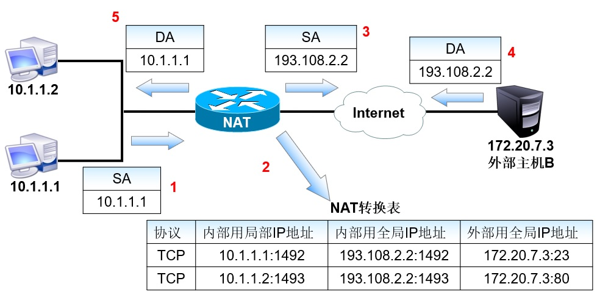
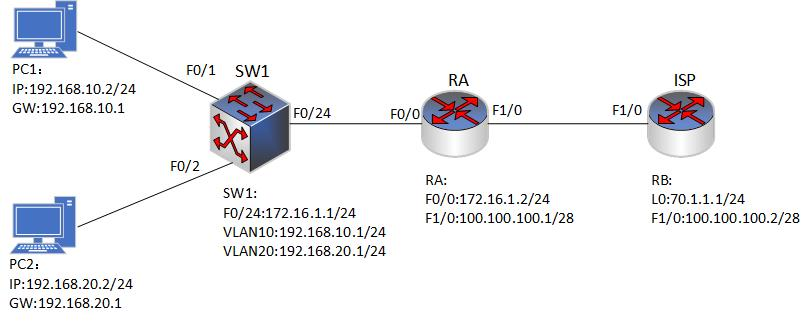

### 17.4PNAT
- PNAT（接口NAT原理）
  -  使用端口多路复用技术，将多个内部地址映射为一个合法地址，用不同的端口号区分各个内部地址。这种方法只需要一个合法 IP 地址。路由器支持的 PAT 会话数是有限制的，所以使用 PAT 的局域网，其网络的规模不应该太大。
  
  - 当 NAT 池中的地址耗尽时，会导致后来的主机无法上网。所以当内网的主机数超过NAT池中的地址数时，通常应配置成复用NAT池，这样每个IP地址可对应多个会话，各个会话用端口号进行区分。
  - 理论上讲，一个IP地址可以映射约65000个会话，但实际的路由器往往只支持几千个会话（Cisco支持约4000个）。
  - 在复用NAT池中，Cisco首先复用地址池中的第一个地址，达到能力极限后，再复用第二个地址，依此类推。
  
- PNAT代码介绍
```shell
#地址池复用
Router(config)#ip nat inside source list [acl-number] pool [pool-name] overload

#接口复用
Router(config)#ip nat inside source list [acl-number] interface [port-number] overload
```

### 17.4.1 PNAT实验1
- 配置要求:
  -  SW1为三层交换机，其中内网 PC1 属于 VLAN10，PC2 属于 VLAN20，ISP 提供商提供的公网地址为 RA 的接口地址(100.100.100.1/28)，需要内网的 PC1 和 PC2 使用这段地址访问外网。
  
  