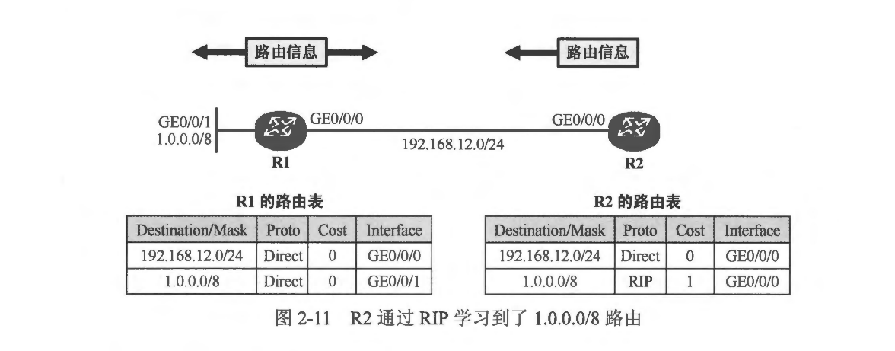
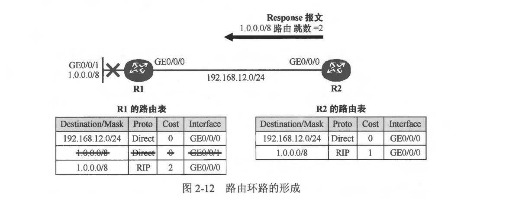
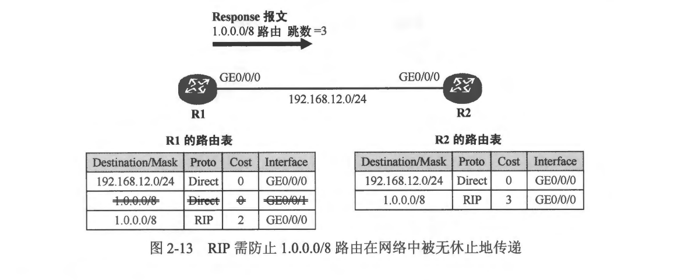
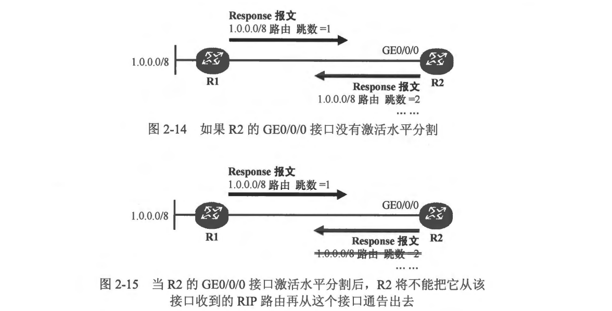
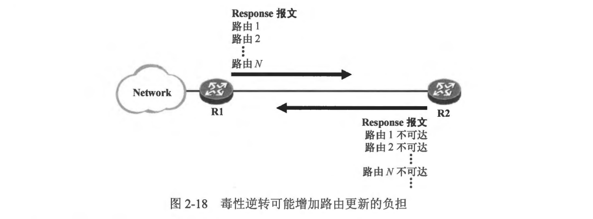
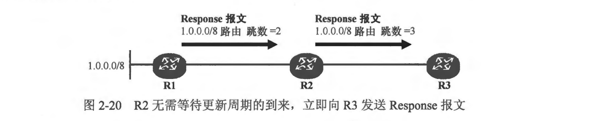

### 本章内容概述和教学目标

- 对于具备路由功能的网络设备来说，当其执行数据转发操作时，路由表是一个非常关键的指引，如果网络中的路由信息出现问题，那么设备的数据转发过程也势必受到影响。路由环路(Routing Loop）是一种在路由部署不恰当或网络规划不合理等情況发生后，很容易引发的一类问题。如果网络中的路由信息不正确，将导致去往某个目的地的数据包在设备之问不停地被来回转发，从而严重影响设备性能，并且大量消耗网络带宽，影响正常的业务流量，这种问题被称为路由环路问题。
- 路由环路对于网络而言是具有严重危害的，任何一个网络规划、设计或交付人员都应该重视并且严格规避该问题。几乎所有的动态路由协议在协议设计时便考虑了路由环路的规避机制，RIP也不例外。
- 本章学习目标:
  - 理解 RIP 路由环路产生的背景
  - 了解 RIP 路由最大跳数的概念及意义
  - 熟悉 RIP 水平分割特性
  - 熟悉 RIP 毒性逆转特性
  - 熟悉 RIP 触发更新特性
  - 熟悉 RIP 毒性路由的概念及作用

 
 

### 2.2.1 环路的产生

- 距离矢量路由协议只是简单地将自己的路由表周期性地通告出去，同时也将收到的有效路由加载到路由表中，并通过累加的度量值来体现到达目标网络的距离，因此运行距离矢量路由协议的路由器并不了解整个网络的拓扑结构，这些特点使得网络中非常容易出现路由环路。
- 在图 2-11 中，R1 及 R2 都运行了 RIP，当网络完成收敛后，R2 通过 RIP 学习到了 1.0.0.0/8 路由。现在 R1 的 GE0/0/1 接口发生了故障，R1 感知到这个拓扑变化并且立即在路由表中删除 1.0.0.0/8 路由。然而这个拓扑的变更对于 R2 来说此时并不知晓，R1 准备在下一个更新周期到来时通告该条路由的不可达情况。但是此时完全有可能出现的一种情况是，在 R1 通告这个更新之前，R2 的更新周期到了，它开始在自己的 GE0/0/0 接口上发送 Response 报文，该报文中包含 R2 路由表中的所有路由，其中就包括 1.0.0.0/8 路由，且该路由的跳数为 2 (R2 自己到达该网段需经过 1 个路由器，因此它将路由更新出去时将跳数加 1 ）。R1 收到这个 Response 报文后，发现 1.0.0.0/8 竞然通过 R2 可达且跳数为2，于是它將 1.0.0.0/8 路由加载到路由表，如 图2-12 所示。

- 这就出现了路由环路。环路对网络来说危害是非常大的。对于目前的情况，如果 R2 收到一个发往 1.0.0.0/8 的数据包，经过路由表查询后，R2 发现自己有一条路由可以匹配该目的地址，并且下一跳为 R1，因此它将数据包转发给 R1，而 R1 经过路由表查询，发现到达 1.0.0.0/8 下一跳是 R2，于是数据包又被转发给 R2，如此反复，发往该网段的数据包就会在 R1、R2 之间不停地来回转发，直到报文的TTL 值递减为 0。可以想象，如果数据流量特别大的话，这无疑将对路由器的性能造成极大损耗，当然，也可能将链路的带宽耗尽。
- 另一方面，由于 RIP 每隔 30s 泛洪一次路由表，因此 1.0.0.0/8 路由会在每个更新周期到来时随着 Response 报文在网络中不停地被泛洪。在R1 的下一个更新周期到来时，它会把 1.0.0.0/8 路由通过 Response 报文再通告给 R2，R2 收到该报文后，刷新自己的路由表，将该路由的跳数更新为3 跳，如 图2-13 所示。而当 R2 的更新周期到来时，它将在通告给 R1 的 Response 报文中继续携带 1.0.0.0/8 路由，而且跳数设置为 4。R1收到该 Response 报文后刷新自己的路由表，将该路由的度量值更新为 4，如此反复。设想一下，如果 RIP 没有任何机制解决该问题，那么 1.0.0.0/8 路由岂不是会在网络中被不断地泛洪且其度量值也会持续累加到无穷大？
- 综上，路由环路的问题对于网络而言危害是巨大的，因此从网络设计、协议设计的角度都应该充分考虑到环路的隐患及可能性，并加以规避。

 
 

### 2.2.2 定义最大跳数

- 为了避免 RIP 路由在网络中被无休止地泛洪，RIP 定义了路由的最大跳数 15 跳，也就是说，RIP 路由的最大可用跳数为 15 跳，当一条路由的度量值达到 16 跳时，该路由被视为不可用，路由所指向的网段被视为不可达。
- 显然这是一种“无奈” 的办法，虽然解决了路由被无限泛洪的问题，但是同时也在极大程度上限制了 RIP 所能够支持的网络规模。设想一下，如果一个网络的直径真的有 16 台路由器该怎么办？ RIP 面对这样的网络也就显得力不从心了。另外，RIP 定义路由的最大跳数，虽然有效防止了 RIP 路由被无限泛洪，但是却并没有从根本上解决路由环路问题。

 
 

### 2.2.3 水平分割

- 水平分割 （Split Horizon）的原理是，RIP 路由器从某个接口收到的路由不会再从该按口通告回去。这个机制在很大程度上消除了 RIP 路由的环路隐患。
- 在图 2-14 所示的网络中，R1 及R2 运行了 RIP，现在 R1 将本地直连路由 1.0.0.0/8 发布到了 RIP，它将通过 Response 报文将该条路由通告出去，路由的度量值会被设置为 1。R2 将在自己的 GE0/0/0 接口上收到R1 发送的 Response 报文，并学习到1.0.0.0/8 路由，它将该条路由加载到自己的路由表中。当R2的更新周期到来时，如果 R2 的 GE0/0/0 接口没有激活水平分割，那么它將会在自己从该接口发送的 Response 报文中携带 1.0.0.0/8 路由，该路由的跳数被设置为 2。如此一来，R1 就会从 R2 收到原本由自己通告出去的 RIP 路由。当然，此时 R1 会优选自己本地直连的这条路由，因为它的优先级更高，但是当 R1 的直连网段 1.0.0.0/8 变成不可达时(关于该网段的直连路由将失效），它会错误地认为可以通过 R2 到达该网段，于是，环路就极有可能发生。这个问题的症结在于，R2 把 R1 告知它的路由信息又返还给了 R1，这就埋下了路由环路的隐患。
  当 R2 的 GE0/0/0 接口激活水平分割后，R2 将不能把它从该接口收到的 RIP 路由再从这个接口通告出去，如图 2-15 所示，如此一来路由环路的问题就可以得到很好地规避。
- 水平分割是距离矢量路由协议的路由防环专题中最重要的机制之一。
  

 
 

### 2.2.4 毒性逆转

- 毒性逆转（Poison Reverse）是另一种防止路由环路的有效机制，其原理是，RIP 从某个接口学到路由后，当它从该接口发送 Response 报文时会携带这些路由，但是这些路由度量值被设置为 16 跳(16跳意味着该路由不可达)。利用这种方式，可以清除对方路由表中的无用路由。毒性逆转也可以防止产生路由环路。
- 在 图2-17 中，R1 及 R2 两合路由器运行了 RIP，彼此开始交互 RIP 路由。R1 将路由 1.0.0.0/8 通过 RIP 通告给 R2。如果 R2 激活毒性逆转，那么当它从 GE0/0/0 接口周期性发送 Response 报文时，报文中会包含从该接口学习到的 1.0.0.0/8 路由，但是路由的度量值被设置为 16跳。
  
- 由于 R2 到达 1.0.0.0/8 的 RIP 路由是通过 R1 获知的，这意味着 R1 自己可能直连该网段，或者通过其他路由器可以到达该网段。换而言之，R1 不会从 R2 到达 1.0.0.0/8，因为那样就可能出现环路，所以毒性逆转的思路是 R2 认为: “既然这条路由是 R1 给我的，那么 R1 就不可能从我这里到达该网段，所以我就告诉 R1，这个网络从我这走是不可达的”。这条不可达路由可以彻底社绝 R1 从 R2 到达 1.0.0.0/8 从而出现环路的可能性。
- 从上面的描述能看出，其实毒性逆裝和水平分割是存在矛盾的，如果在 R2 的接口上同时激活水平分割和毒性逆转，则只有毒性逆转生效。综上，对水平分割通俗的理解就是: “到达某个目的网段的路由既然是你告诉我的，那么我就不应该再说回给你听”，这是一种相对消极的举动。而毒性逆转则显得更加主动和积极: “到达某个目的网段的路由是你告诉我的，那么我通过主动告诉你这个网段从我这走不通来杜绝你从我这走的可能”。从这个层面上理解，似乎毒性逆转在避免环路方面要比水平分割更加靠谱，但是它依然存在明显的缺点一增加了 Response 报文的“体积”。
- 如图 2-18 所示，R1 如果作为一台汇聚层设备，将一定规模的路由信息通过 RIP 通告给 R2，如果 R2 激活了毒性逆转，那么它除了将路由表中的其他路由通告给 R1 之外，还会把自己从 R1 接收的 RIP 路由再通告回给 R1 并且告知其路由不可达，R2 所发送的 Response 报文势必变得更加擁肿，这显然增加了链路带宽的损耗及设备负担。
  

 
 

### 2.2.5触发更新

- 大家已经知道，路由器会在激活了 RIP 的接口上周期性地发送 Response 报文，在缺省情况下，RIP 会以 30s 为周期进行报文发送，这在网络稳定的情况下是没有问题的，但是一旦拓扑出现变更，如果依然要等待下一个更新周期到来才发送路由更新，这显然是不合理的，而且也非常容易引发路由环路。
- 触发更新机制指的是，当路由器感知到拓扑发生变更或 RIP 路由度量值变更时，它无需等待下一个更新周期到来即可立即发送 Response 报文。例如图2-19 描述的场景，R1、R2 及 R3 三台路由器运行了 RIP，R1 在 RIP 中发布 1.0.0.0/8 路由，它立即向 R2 发送一个 Response 报文，在该报文中包含这条路由以及路由的度量值。R2 收到这条路由更新后，将路由加载到自己的路由表，然后（无需等待下一个更新周期到来）立即向 R3 发送 Response 报文，将 1.0.0.0/8 路由通告给它。
  
- 现在由于某种原因，R1 通告的 1.0.0.0/8 路由的度量值发生了变化，由原来的 1 跳变为 2 跳，R1 向 R2 发送一个 Response 报文以便将这个变化通知给对方。由于 R2 是从该条路由的下一跳收到的 Response 报文，因此即使新的度量值要劣于 R2 路由表中已经存在的 1.0.0.0/8 路由的度量値，R2 地会立即刷新自己的路由表，并且无需等待下一个更新周期的到来，立即触发一个 Response 报文给 R3，如 图2-20 所示。R3 在收到该报文后，立即刷新自己的路由表。
  

 
 

### 2.2.6 毒性路由

- 前文已经提到，RIP 将 15 跳视为最大的可用跳数，这就意味着度量值为 16跳的路由是不可达的。将度量值为 16跳 的路由包含在 Response 报文中进行泛洪，这在某些场合下是非常有用的，例如毒性遊转。另一种重要的用途是，当一个网络变为不可达时，发现这个变化的路由器立即触发一个 16 跳的路由更新来通知网络中的路由器,目标网络己经不可达，这种路由被称为毒性路由。
- 如 图2-21 所示，R1 的直连网段 1.0.0.0/8 因故障变为不可达，R1 将立即发送 Response 报文（触发更新机制使然）用于通告这个更新，在其发送给 R2 的这个 Response 报文中，包含着 1.0.0.0/8 路由，最重要的是这条路由的度量值被设置为 16。R2 收到这个 Response 报文后，就立即意识到该网段已经不可达了，于是将该路由从路由表中移除。值得注意的是，R2 虽然将该路由从路由表中删除，但是依然将其保存在 RIP 数据库中，同时为其启动垃圾回收计时器。
  
