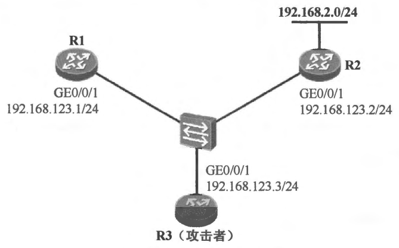

### 2.8 RIP 认证更新
- 配置命令演示
```shell
#配置 RIP 认证密钥
key chain RIP_AUTH
 key 1
  key-string cisco123

#启用 RIP 认证:
interface GigabitEthernet0/0
 ip rip authentication mode text
 #开启明文认证
  
 ip rip authentication mode md5
 #开启md5认证

 ip rip authentication key-chain RIP_AUTH
```

- 配置需求:
  - 在 图2-34中，R1 及 R2 连接在一台交换机上，双方的接口均配置相同网段的 IP 地址并运行 RIPv2，开始交换 RIP 路由。在正常情况下，R1 应该能通过 RIP 从 R2 获知到达 192.168.2.0/24 的路由。此时网络中出现了一个攻击者 R3，R3 也接入到了交换机上，其接口也配置了相同网段的 IP 地址，并激活 RIPv2，随后 R3 开始向交换机泛洪 Response报文。如果 R3 也通过 RIP 向网络中通告到达 192.168.2.0/24 的路由，那么 R1 的路由表势必受到影响。如果 R3 通告的 192.168.2.0/24 路由的度量值与 R2 所通告的该路由度量值相等，那么 R1 便会在这两个下一跳执行 等价负载分担，当其收到去往该网段的数据包时，就有可能将它们转发到 R3，从而导致业务中断。当然，如果 R3 通告的路由的跳数比 R2 的更小，那么更将刷新R1 的路由表，导致业务彻底中断。配置RIP认证解决这个问题。
