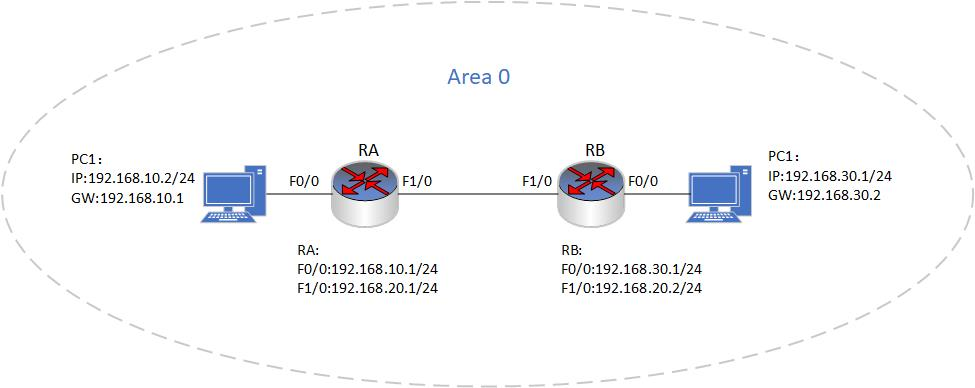
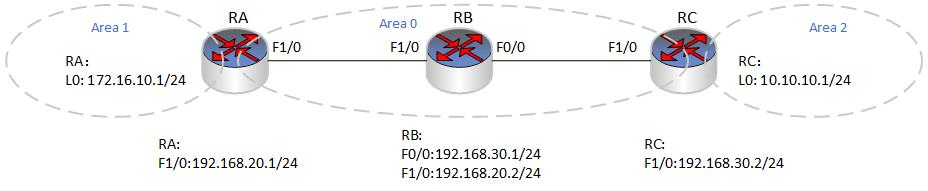
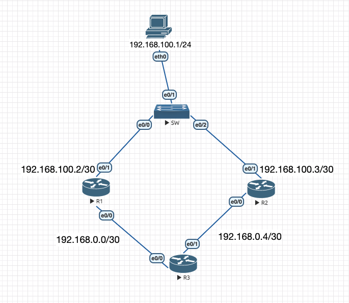
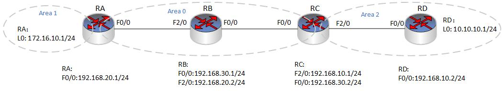
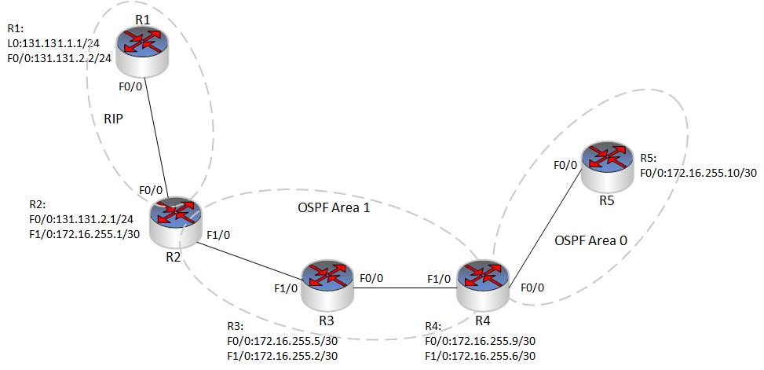
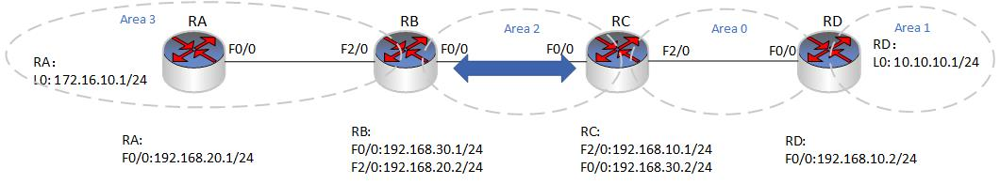
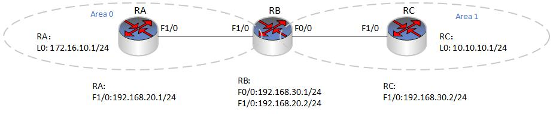
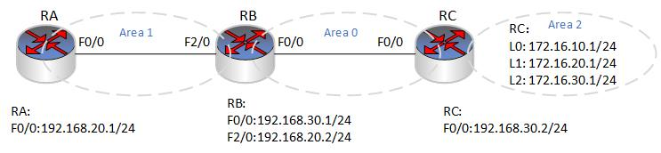
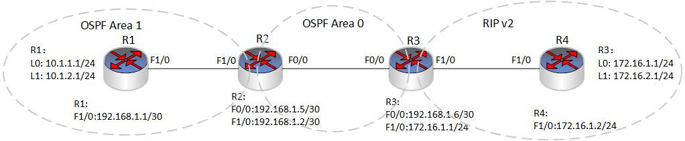

### 3.4.1 OSPF单区域
- 配置要求
  - 在RA,RB路由器上配置OSPF单区域路由，实现全网通。

 
 

### 3.4.2 OSPF多区域
- 配置要求
  - 在RA、RB、RC三台路由器上配置OSPF协议，实现全网胡同。其中RA的回环口L0放在AREA 1区域，RC的回环口L0放在AREA 2区域，其余的路由器互联接口全部放在AREA 0区域。

 
 

### 3.4.3 OSPF调整Cost值
- 配置要求
  - 配置两条链路以主备的方式工作，即当网络正常时，R3 将到达 192.168.100.0/24 的报文转发给 R1，而当R1 发生故障，又或者 R1-R3 之间的互联链路发生故障时，R3 自动将上行流量切换到R2，通过配置Cost值实现效果

 
 

### 3.4.4 OSPF Stub 区域
- 配置要求
  -  RB、RB、RC、RD之间运行OSPF路由协议实现全网通。由于RD为设备叫老旧，为了减轻RD的负担决定使用末节区技术缩减RD的路由表，减轻运行负担。
  

 
 

### 3.4.5 OSPF 完全Stub区域
- 配置要求
  - RB、RB、RC、RD之间运行OSPF路由协议实现全网通。由于RD为设备叫老旧，为了减轻RD的负担决定使用完全末节区技术缩减RD的路由表，减轻运行负担。 
  

 
 

### 3.4.6 OSPF NSSA-STUB区域
- 配置要求
  - 在R2、R3、R4上运行OSPF协议区域按照拓扑图划分，在R1和R2上运行RIP路由协议，并且在R2路由器上配置路由重分发。在R2路由器上配置NSSA并且实现全网通。

 
 

### 3.4.7 OSPF NSSA-Stub 区域
- 配置要求
  - 在R2、R3、R4上运行OSPF协议区域按照拓扑图划分，在R1和R2上运行RIP路由协议，并且在R2路由器上配置路由重分发。在R2路由器上配置完全NSSA并且实现全网通。

 
 

### 3.4.8 OSPF 虚链接
- 配置要求
  -  使用特定技术实现全网互通

 
 

### 3.4.9 OSPF 明文认证(接口和区域)
- 配置要求
  - 在RA、RB、RC路由器上配置OSPF路由协议，为了内部网络的安全性，保证网络不被不法分子接入，路由更新只能在可信任的路由器之间传输。在RA和RB之间开启OSPF接口的明文验证，在RB和RC直接开启OSPF接口的密文验证。

 
 

### 3.4.10 OSPF 密文认证(接口和区域)
- 配置要求
  - 在RA、RB、RC路由器上配置 OSPF 路由协议，为了内部网络的安全性，保证网络不被不法分子接入，路由更新只能在可信任的路由器之间传输。在RA和RB之间开启OSPF Area 0区域的明文验证，在RB和RC直接开启OSPF Area1区域的密文验证。

 
 

### 3.4.11 OSPF 路由汇总(区域汇总)
- 配置要求
  -   在RA、RB、RC路由器上配置OSPF多区域路由协议，实现全网互通。其中RC路由的L0、L1、L2接口在Area2区域。现在为了减少路由表条目，需要在RC路由器上做路由汇总，我们在RC路由器通过OSPF区域路由汇总技术，缩减路由表条目。

### 3.4.12 OSPF 路由汇总（外部路由汇总）
- 配置要求
  -  在R1、R2、R3和R4上运行OSPF路由协议和RIP协议，实现全网通。在R3(自治域系统边界路由器)上做外部路由汇总，将OSPF从R4上学到的外部路由进行汇总，缩减路由表条目。
  