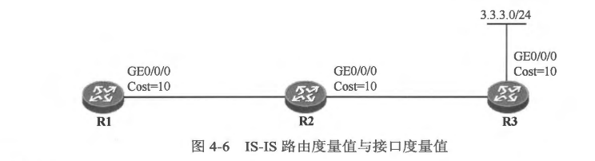

### 4.2 IS-IS 的基本概念
- 4.2.1 IS-IS 的层次化设计
- 在学习 OSPF 的过程中，相信大家已经体会到了多区域、层次化网络设计的好处。对于链路状态路由协议而言，运行了该协议的设备会向网络中通告链路状态信息，同时也收集网络中所泛洪的链路状态信息然后加以储存，并最终以这些信息为基础进行计算，从而得到路由信息。如果不采用多区域的部署方式，那么随着网络的规模逐渐增大，网络中所泛洪的链路状态信息势必会越来越多，所有的设备都将承受更重的负担，路由计算及收敛将逐渐变得更加缓慢，这也使得网络的可扩展性变差。
- IS-IS 能够部署在规模非常大的运营商骨干网络中，这得益于它对层次化网络的支持。我们能够根据需要将一个 IS-IS 域（Domain）切割成多个区域，然后使用骨干路由器将这些区域连接起来。简单地说，IS-IS 采用两级分层结构：骨干网络及常规区域。
- 如图4-4所示，R1 及 R5 处于 Area 49.0001， R2 及 R6 处于 Area 49.0002，R3 处于 Area 49.0003， R4 则处于 Area 49.0004。 IS-IS 的区域 ID 与 OSPF 是截然不同的。对于
IS-IS 来说，其骨干网络并不像 OSPF 那样是一个唯一的、具体的区域（Area 0），而是由一系列连续的 Level-2 及 Level-1-2 路由器所构成的范围。在本例中，R1、R2、R3 及 R4 便构成了该IS-IS 域的骨干网络。


- 我们将连续的 Level-1（含 Level-1-2）路由器构成的区 域称为 Level-1 区域，例如 图4-4 中的 Area 49.0001 和 Area 49.0002;而 Area 49.0003 及 Area 49.0004 则为 Level-2区域，一个 Level-2 区域由连续的、同属一个区域的 Level-2（含Ievel-1-2）路由器构成。
- 在OSPF 中，直连的设备之间如果要建立邻居关系，那么双方互联的接口必领在相同的区域中，两个直连接口如果不在相同的区域中激活 OSPF，那么邻居关系是无法建立的，而IS-IS 则有所不同。IS-IS 的区域设定是体现在设备上的，当我们在一台设备上配置 IS-IS 时，就需要指定该设备所属的区域(区域 ID 在为该设备所分配的 NET 中体现，一个设备可以同时属于多个区域），值得注意的是，完成上达配置后，设备的所有接口都属于该区域。在本例中，R1 及 R5 同属一个区域，它们之间建立 Level-1 的 IS-IS 邻居关系，而 R3 及 R4 属于不同的区域，它们都是 Level-2 路由器，因此它们之间建立 Level-2的邻居关系。
- 对于 OSPF 来说，两个区域的交界是出现在 OSPF 设备上的。例如一台拥有两个接口的路由器，如果分别将这两个接口在不同的 OSPF 区域（例如 Area 0 及 Area 1） 中激活，那么该路由器就处于 Area 0 及 Area 1 的交界处。而对于 IS-IS 而言，两个区域的交界处却并不在设备上，而是在链路上，例如图 4-4中 ATea 49.0001 与 Area 49.0004 的交界处是在R1 与R4 之间的互联链路上。
- 需要强调的是，IS-IS 的每个 Level-1 区域必须与骨干网络直接相连，以 Area 49.0001 为例，该区域通过 Level-1-2 路由器R1 连接到了骨干网络。IS-IS 的 Level-1 区域与 OSPF
中的 Totally NSSA 非常类似。Level-1-2 路由器作为 Level-1 区域与骨干网络之间的桥梁，将其通过 Level-1 区域内泛洪的 Level-1 ISP 计算得出的路由以 Level-2 IsP 的形式通告给骨干网络，使得骨干网络中的路由器能够计算出到达该区域内相应网段的路由。另一方面，缺省情况下 Level-1-2 路由器并不会将其从骨干网络学习到的路由，包括到达其他区域的路由向本地 Level-1 区域进行通告，就像OSPF 不会向某个 Totally NSSA 下发描述区域间路由的 Type-3 LSA一样。因此一个区域内的 Level-1路由器仅知晓到达本区域内各个网段的路由，而对于区域外的网络，它是一无所知的，它只能通过指向本区域的 Level-1-2路由器的默认路由来到达区域外部。IS-IS 的这个设计使得 Level-1路由器的 LSDB 及路由表规模极大程度地减小了，从而设备的性能得到了优化。
- 图4-5 展示了一个典型的 IS-IS 网络。在该网络中，R1、R2及R3属于 Leve1-1 区域 Area 49.0001，R2与R1、R3 与 R1 均建立 Level-1 的邻居关系。R1 能够根据本区域内所泛洪的 Level-1 LSP 计算出本区域内的网络拓扑，以及到达本区域内各网段的路由。而缺省时，R2 及 R3 不会将到达 Area 49.0001 区域外部的路由信息注入到该区域中，R2 及 R3 都在其向49.0001 区域下发的 Level-1 LSP 中设置 ATT 比特位，而该区域内的Level-1 路由器则基于该 Level-1 LSP 应生一条指向 R2 及 R3 的默认路由。因此R1不会学习到去往 Area 49.0002 的路由，但是它可以通过指向 R2 及 R3 的默认路由来到达 Area 49.0002 内的各个网段。与此同时，R1、R2及R3是允许将外部路由引入 IS-IS 的。因此从以上所描达的特性来看，IS-IS 的常规区域的确很像 OSPF 的 Totally NSSA。
- 当然，在某些场景中，我们可能期望 Level-1 区域内的路由器获知到达其他区域的具体路由，IS-IS 考虑到了这种需求，它允许网络管理员通过特定的配置，向 Level-1 区域注入到达其他区域的路由，这个特性被称为路由渗透，


<br>
<br>

### 4.2.2 1S-IS 路由器的分类
- 运行了 IS-IS 的路由器，根据其全局 Level（级别）属性的不同，可以分为两种类型，分别是 Level-1 及 Level-2。一台 IS-IS 的路由器可以是 Level-1 类型，或者是 Level-2 类型，还可以同时是 Level-1 和 Level-2 类型，对于同时为 Level-1 和 Level-2 类型的 IS-IS 路由器，我们将其称为 Level-1-2 路由器，实际上这并不是一种单独的 IS-IS 路由器类型。
- Level-1 路由器: 
  - Level-1 路由器（如图4-5中的R1）是一种 IS-IS 区域内部路由器，它只能够与同属一个区域的其他Level-1路由器，或者同属一个区域的 Level-1-2 路由器建立 IS-IS 邻居关系，我们将这种邻居关系称为 Level-1 邻居关系。Level-1 路由器无法与 Level-2 路由器建立邻居关系。Level-1 路由器只维护 Level-1 的LSDB，它能够根据 LSDB 中所包含的链路状态信息计算出区域内的网络拓扑及到达区域内各网段的最优路由。值得一提的是，Level-1 路由器必须通过 Level-1-2 路由器接入 IS-IS 骨干网络从而访问其他区域。
- Level-2 路由器
  - Level-2 路由器（如图4-5中的R4、R5、R6 及R7）可以简单地视为 IS-IS 骨干网络路由器，实际上 IS-IS 的骨干网络是由一系列连续的 Level-2 路由器(及 Level-1-2 路由器）组成的。
Level-2 路由器只能与 Level-1-2 或 Level-2 路由器建立 IS-IS 邻居关系，我们将这种邻居关系称为 Level-2 邻居关系。Level-2 路由器只维护 Level-2 的 LSDB。 在一个典型的 IS-IS 网络中，Level-2 路由器通常拥有整个 IS-IS 域(包括该域内所有的 Level-1 区域及Level-2 区域）的所有路由信息。
- Level-1-2 路由器
  - 所谓的 Level-1-2 路由器是同时为 Level-1 及Level-2 级别的路由器（如 图4-5 中的 R2 及R3），它能够与同属一个区域的 Level-1 、Level-1-2 路由器建立 Level-1 邻居关系，也可与Level-2 路由器或 Level-1-2路由器建立 Level-2 的邻居关系。Level-1-2 路由器与 OSPF 中的 ABR 非常相似，它也是IS-IS 骨干网络的一个组成部分。Level-1-2路由器可以同时维护 Level-1 的LSDB 及 Level-2 的LSDB，这两个 LSDB 分别用于 Level-1 路由及 Level-2 路由计算。在一个典型的 IS-IS 网络中，Level-1-2 路由器通常连接着一个Level-1 区域，也连接着骨千网络，它将作为该 Level-1 区域与其他区域实现通信的桥梁，它将在其向该Level-1 区域下发的 Level-1 LSP 中设置 ATT 比特位，来告知区域内的 Level-1 路由器可以通过自己到达区域外部，而区域内的 Level-1 路由器则根据该 ATT 比特置位的 LSP 产生一条指向该 Level-1-2 路由器的默认路由。

<br>
<br>


### 4.2.3 度量值
- IS-IS 使用 Cost(开销)作为路由度量值，所谓开销，亦可理解为成本或者代价，Cost 值越小，则路径(路由）越优。IS-IS 路由的 Cost 与设备的接口有关，与 OSPF 类似，每一个激活了 IS-IS 的接口都会维护接口 Cost。 然而与 OSPF 不同的是，IS-IS 接口的 Cost 在缺省情况下并不与接口的带宽相关，无论该接口的带宽如何，缺省时其 Cost 值均为 10，当然，您可以根据实际需要修改接口的 Cost 值。这种接口 Cost 的设计显然在某些场景下会存在一些问题，例如可能会导致设备选择 Cost 更优的低带宽路径，而不是选择 Cost 更劣的高带宽路径。
- 一条 IS-IS 路由的 Cost 等于本路由器到目标网段沿途的所有出接口的 Cost 总和。在 图4-6 所示的网络中，如果全网运行了 IS-IS，则R1 将通过 IS-IS 获知到达 3.3.3.0/24 的路由，而在R1 的路由表中，3.3.3.0/24 路由的 Cost 值为 30，也就是R3的GE0/0/0 接口 Cost 加上 R1 及 R2 的 GE0/0/0 接口 Cost。

**说明: 其实 IS-IS 定义了四种类型的度量值：缺省(Default）度量值、时延（Delay）度量值、开销(Expense）度量值以及差错（Error）度量值，其中时延、开销及差错度量值在现今的 IS-IS 实现中几乎都不再支持，本书讨论的度量值指的是缺省度量值，该种类型的度量值是每一台 IS-IS 设备都必须支持的。**
- 缺省时，Cisco 路由器使用的 IS-IS Cost 类型为 Narrow（窄），当使用该类 Cost 时，IS-IS 接口 Cost的长度为6bit， 这意味着一个接口所支持的 Cost 值范围是 1~63。另外，IS-IS 路由 Cost 的长度为 10bit， 这意味着接收到的路由最大的 Cost 值为 1023。显然，在面对大规模的网络时，这种 Cost 的限制会成为 IS-IS 的瓶颈。正因如此，IS-IS 引入了 Wide（宽）类型的 Cost， 当 IS-IS 使用 Wide 类型的 Cost 时，接口 Cost 变成了 24bit， 这使得设备的接口支持更大的 Cost 值范围，与此同时一条路由的 Cost 值范围也有了相当大的扩展。IS-IS 在 Cost 值上的扩展，使得它突破了前面所提到的瓶颈，从而能够支持更大规模的网络，而且在组网时，基于 Cost 的路由控制也变得更加灵活。
使用如下命令，可以将 IS-IS 的 Cost 类型修改为 Wide:
```shell
R1(config)#router isis 10
R1(config-router)#metric-style wide
```
- 缺省时，Cisco 路由器使用的 IS-IS Cost 类型为 Narrow，这意味着路由器只能接收和发送 Cost 类型为 Narrow 的路由，使用 metric-style wide 命令将设备的 Cost 类型修改为 Wide 后，该设备只能接收和发送 Cost 类型为 Wide 的路由。在现实网络中，需确保 IS-IS 域内所有的路由器配置一致的 IS-IS Cost 类型。在 Cisco 路由器上，除了能将 IS-IS Cost 类型指定为 Narrow 或 Wide， 还能将其指定为特定的兼容模式。
- 正如上文所说，在 Cisco 的路由器上部署 IS-IS 时，缺省状态下 IS-IS Cost 类型为 Narrow， 并且接口的缺省 Cost 值为 10，无论接口的带宽是多少，其 Cost 值缺省均为 10，这在某些场景下可能会导致 IS-IS 的路由优选不尽如人意。其中一个简单的改进方法是，根据组网的实际需求去手工修改设备的接口 Cost。另一个可选的方法则是使用 IS-IS 自动计算接口 Cost 的功能。这个功能被激活后，设备将自动根据接口的带宽值进行该接口 Cost 值的计算，这与 OSPF 的接口度量值计算就非常相似了，设备将使用一个参考带宽值除以接口的带宽值，再将所得结果乘以 10，得到接口的 Cost 值。例如千兆以太网接口缺省的带宽值为 1000Mbps， 100/1000×10 得到的结果是 1，因此千兆以太网接口在激活 IS-IS 自动计算 Cost值的功能后，Cost 值为 1。值得一提的是，只有当设备的 IS-IS Cost 类型指定为 Wide 时，上述计算才会发生，如果设备的 IS-IS Cost 类型为 Narrow，则激活了 自动接口 Cost 计算功能后，设备将采用如 表 4-1 所示的对应关系为接口设置缺省 Cost 值。

- 如需手工指定设备的接口 Cost 值，可在接口视图下使用 isis metric 命令，例如使用isis metric 20，可将接口的 Cost 值从缺省值修改为 20。需注意的是该命令中有两个可选关键字，它们分别是 level-1 及level-2，如果在 isis metric 命令中使用了 level-1 关键字，那么该命令配置的是接口的 Level-1 Cost 值，例如 isis metric 20 level-1。同理，如果在 isis metric 命令中使用了 Level-2 关键字，那么该命令配置的是接口的 Level-2 Cost 值。而如果没有使用 level-1 或 level-2关键字，那么该命令配置的是接口的 Level-1 及 Level-2 Cost值。

<br>
<br>

### 4.2.4 1S-IS 的三张表
- 与OSPF 非常类似，IS-IS 也维护着三张非常重要的数据表，它们分别是。
  - 邻居表
    - 两台相邻的IS-IS 设备首先必须建立邻居关系，然后才能够开始交互 LSP。IS-IS 设备将直连链路上发现的邻居加载到自己的邻居表中。在华为的路由器上，使用 ```show isis neighbors``` 命令可查看设备的 IS-IS 邻居表，在邻居表中，大家能看到邻居的系统ID、状态、保活时间及类型等信息。
    - 以图4-7为例，如果在R2 上执行该条命令，可以看到如下输出：
    ```shell
    R2#show isis neighbors

    System Id       Type Interface     IP Address      State Holdtime Circuit Id
    R1              L1   GE0/0         10.1.12.1       UP    29       R2.01         
    R3              L2   GE0/1         10.1.23.2       UP    9        R3.01 
    ```
    - 从上述输出可以看到，R2 己经发现了两个邻居，它在接口 GE0/0/0 上发现了邻居R1（系统ID 为0000.0000.0001），该邻居状态为 UP，保持时间还剩余29秒，而且该邻居的类型为 Level-1 (Type 列）；另外，R2 还在其接口 GE0/0/1 上发现了邻居 R3，并且该邻居的类型为 Level-2。
    
  - LSDB (Link-State Database，链路状态数据库）
    - 两台直连的 IS-IS 设备只有建立了邻居关系，才能够开始交互 LSP。IS-IS 设备将自己产生的、以及网络中所泛洪的LSP 收集后存储在自己的LSDB 中。与OSPF 类似，IS-IS 也使用ISDB 存储链路状态信息，这些信息将被用于网络拓扑绘制及路由计算。在 Cisco 路由器上，使用 ```show isis database``` 命令可查看设备的 IS-IS LSDB。 以 R1 为例:
    ```shell
    R1#show isis database

    IS-IS Level-1 Link State Database:
    LSPID                 LSP Seq Num  LSP Checksum  LSP Holdtime/Rcvd      ATT/P/OL
    R1.00-00            * 0x00000007   0x06BD                1010/*         0/0/0
    R2.00-00              0x0000000A   0xADC8                1070/1199      1/0/0
    R2.01-00              0x00000006   0x74D7                 655/1199      0/0/0
    ```
    - 因为 R1 是一台 Level-1 路由器，所以它只维护 Level-1 LSDB，从以上输出可以看出，在R1 的 Level-1 LSDB 中存在三个LSP。每个LSP 都采用 LSP ID (Link-State Packet ID，链路状态报文标识）进行标识。
    - LSDB 中 Seq Num 一列显示的是 LSP 的序列号，在 IS-IS 中，LSP 序列号的概念与 OSPF 中 LSA 序列号的概念非常类似，都可以用来表示一个LSP 的新旧。
    - 在 R1 的 LSDB 中，并没有 R3 所产生的 LSP，这是因为 R2 作为该 Level-1 区域的 Level-1-2 路由器，发挥着类似区域边界路由器的作用，它不会将其他区域的 LSP 泛洪到本地 Level-1 区域中。
    - 由于 R2 是一台 Level-1-2 路由器，因此它会同时维护 Level-1 LSDB 及 Level-2 LSDB:
    ```shell
    LSPID                 LSP Seq Num  LSP Checksum  LSP Holdtime/Rcvd      ATT/P/OL
    R1.00-00              0x00000007   0x06BD                1085/1199      0/0/0
    R2.00-00            * 0x0000000A   0xADC8                1147/*         1/0/0
    R2.01-00            * 0x00000006   0x74D7                 732/*         0/0/0
    IS-IS Level-2 Link State Database:
    LSPID                 LSP Seq Num  LSP Checksum  LSP Holdtime/Rcvd      ATT/P/OL
    R2.00-00            * 0x0000000A   0xE0F7                 970/*         0/0/0
    R3.00-00              0x00000008   0xF7B9                 525/1199      0/0/0
    R3.01-00              0x00000006   0x23AE                 861/1199      0/0/0
    ```
  - IS-IS 路由表
    - 每台 IS-IS 设备都会基于自己的LSDB 运行相应的算法，最终计算出最优路由。IS-IS 计算出的路由存放于 IS-IS 路由表中，在 Cisco 路由器上使用 ```show ip route isis ``` 命令可以查看设备的 IS-IS 路由表。IS-IS 路由表中的路由未必最终一定被加载到设备的全局路由表中，这还取决于路由优先级等因素。
    - 以 图4-7 为例，在 R1 上执行 ```show ip route isis``` 命令可看到如下输出:
    ```shell
    R1#show ip route isis
    Codes: L - local, C - connected, S - static, R - RIP, M - mobile, B - BGP
           D - EIGRP, EX - EIGRP external, O - OSPF, IA - OSPF inter area
           N1 - OSPF NSSA external type 1, N2 - OSPF NSSA external type 2
           E1 - OSPF external type 1, E2 - OSPF external type 2
           i - IS-IS, su - IS-IS summary, L1 - IS-IS level-1, L2 - IS-IS level-2
           ia - IS-IS inter area, * - candidate default, U - per-user static route
           o - ODR, P - periodic downloaded static route, H - NHRP, l - LISP
           a - application route
           + - replicated route, % - next hop override, p - overrides from PfR
    
    Gateway of last resort is 10.1.12.2 to network 0.0.0.0
    
    i*L1  0.0.0.0/0 [115/10] via 10.1.12.2, 00:02:04, Ethernet0/0
    ```
    - 由于 R1 是 Level-1 的路由器，其处在 Area 49.0012 区域内部。因此其会接到 R2 路由器发送的 L1 类型的默认路由。这样做的优点是：能够有效的减少路由表的大小，增强了IS-IS的稳定性。其做法类似于OSPF的完全末节区域（Totally Stub)
    - R2 的IS-IS 路由表如下:
    ```shell
    R2#show ip route isis
    Codes: L - local, C - connected, S - static, R - RIP, M - mobile, B - BGP
           D - EIGRP, EX - EIGRP external, O - OSPF, IA - OSPF inter area
           N1 - OSPF NSSA external type 1, N2 - OSPF NSSA external type 2
           E1 - OSPF external type 1, E2 - OSPF external type 2
           i - IS-IS, su - IS-IS summary, L1 - IS-IS level-1, L2 - IS-IS level-2
           ia - IS-IS inter area, * - candidate default, U - per-user static route
           o - ODR, P - periodic downloaded static route, H - NHRP, l - LISP
           a - application route
           + - replicated route, % - next hop override, p - overrides from PfR
    
    Gateway of last resort is not set
    
          1.0.0.0/24 is subnetted, 1 subnets
    i L1     1.1.1.0 [115/20] via 10.1.12.1, 01:35:37, Ethernet0/0
          3.0.0.0/24 is subnetted, 1 subnets
    i L2     3.3.3.0 [115/20] via 10.1.23.2, 01:21:00, Ethernet0/1
    ```
    - R2 通过 IS-IS 学习到了 Level-1 路由 1.1.1.0/24，以及 Level-2 路由 3.3.3.0/24。R2 是一台 Level-1-2 路由器，因此它分别使用 Level-1 及 Level-2 路由表存储不同类型的 IS-IS 路由。
    - 从以上的描述可以看出，IS-IS 将路由分为 Level-1 路由及 Level-2路由。其中 Level-1 路由是设备根据 Level-1 LSDB 计算出的路由，而 Level-2 路由则是根据 Level-2 LSDB 计算出的路由。

<br>
<br>

### 4.2.5 协议报文
- 与OSPF 报文采用 IP 封装不同，IS-IS 的协议报文直接采用数据链路层封装，所以 IS-IS 相比于 OSPF 少了 IP 层的封装，从这个层面上看，相比之下 IS-IS 报文的封装效率更高。在以太网环境中，IS-IS 报文载荷直接封装在以太网数据帧中。IS-IS 使用了以下几种 PDU （Protocol Data Unit， 协议数据单元）。
- IIH (IS-IS Hello)
  - IIH PDU 用于建立及维护 IS-IS 的邻居关系。在 IS-IS 中存在三种IIH PDU: Level-1 LAN IIH、Level-2 LAN IIH 和 P2P IH。其中 Level-1 LAN IIH 及 Level-2 LAN IIH 用于 Broadcast 类型的网络中，如果网络设备为 Level-1 设备，则它在 Broadcast 类型的接口上发送及侦听 Level-1 LAN IIH；如果网络设备为 Level-2 设备，则它在 Broadcast 类型的接口上发送及侦听 Level-2 LAN IIH，如果网络设备为 Level-1-2 设备，在缺省时，它在 Broadcast 类型的接口上发送及侦听这两种类型的 LAN IIH。 P2P IIH 用于 P2P 类型的网络中。
- LSP (Link-State Packet)
  - IS-IS 使用 LSP 承载链路状态信息。LSP 类似 OSPF 中的LSA，只不过后者并非以独立报文的形式存在，必须使用 LSU 报文来承载，而LSP 是一种独立的 PDU。
  - ISP 存在 Level-1 ISP 及 Level-2 ISP 之分，具体发送哪一种 LSP 视 IS-IS 邻居关系的类型而定。例如 A 与 B 建立了 Level-1 邻居关系，那么双方将交互 Level-1 LSP，而如果A与B同为 Level-1-2 路由器，并且建立了 Level-1 及 Level-2 两种邻居关系，则 Level-1 LSP 及 Level-2 LSP 均会在两者之间交互。
- CSNP ( Coraplete Seauence Number PDU，完全序列号报文）
  - CSNP 存在 Level-1 CSNP 与 Level-2 CSNP 之分，不同的 IS-IS 邻居关系交互不同类型的 CSNP。一个 IS-IS 设备发送的 CSNP 包含该设备 LSDB 中所有的 LSP 摘要。
  - CSNP 主要用于确保 LSDB 的同步，在这个层面上看，CSNP 与 OSPF 的 DBD 报文的功能相似。
  - 正如上文所说，CSNP 中包含始发设备的 LSDB 中所有 LSP 的摘要信息， 一条 LSP 的摘要信息包括该 LSP 的 LSP ID、序列号、剩余生存时间以及校验和，这四个信息是 LSP 头部当中的关键元素。CSNP 使用 LSP 条目 TLV 来承载这些 LSP 摘要信息。
- PSNP (Partial Sequence Number PDU， 部分序列号报文）
  - PSNP 存在 Level-1 PSNP 与 Level-2 PSNP 之分，与 CSNP 不同，PSNP 中只包含部分 LSP 的摘要信息（而不是全部）。PSNP 主要用于请求 LSP 更新。另外，PSNP 还用于在 P2P 网络中对收到的 LSP 进行确认，因此从这个层面看，PSNP 实现了 OSPF 中的 LSR 及 LSAck 报文的功能。
  - 简单地说，IS-IS PDU 的报文结构主要包含 3 个部分:通用的头部、PDU 特有的头部以及可变长部分。其中通用的头部指的是所有 IS-IS PDU 都拥有的、相同格式的头部。除了这个头部之外，每种 PDU 还有自己特有的头部。另外，PDU 中的可变长部分包含该PDU 中非常关键的内容，IS-IS 采用三元组的格式存储这些内容。实际上，IS-IS 之所以拥有如此高的可扩展性正是得益于这部分功能模块的设计。
- 设想一下，如果您希望在一个报文中携带一些关键信息，而且这些关键信息的内容及内容长度都各不相同的，此外，随着业务的发展，信息的类型也在不断变化，那么能否设计一种具有高可扩展性的方法，使得报文主体不做改变的情况下依然能够适应新的业务需求，依然能够承载新的关键信息？ TLV (Type-Length-Value，类型----长度----值）的设计完美地解决了这个问题。所谓TLV，顾名思义，就是类型、长度以及值的三元组，例如（颜色，两个字，黑色）便是一个典型的TLV 的实例。
  - 在IS-IS 中，TLV 中的每个元素的描述如下:
    - 类型 (Type):  该字段的长度为 1 byte，它标识了这个TLV 的类型，IS-IS 定义了丰富的 TLV 类型，不同的TLV 类型用于携带不同的信息。
    - 长度(Length）: 该字段的长度为 1 byte，它存储的数据用于指示后面的第三元(值）的长度。由于不同的TLV 类型所描达的信息不同，因此信息的长短可能也有所不同，本字段指示了该 TLV 中值的长度。
    - 值(Value）: 该字段的长度是可变的，所占用的字节数在长度宇段中描述。本字段的值就是该 TLV 所携带的有效内容。
    - **说明: 在某些资料中，TLV 也被称为CLV （Code-Length-Value，代码长度一值）。**
  - 图4-9 展示了 TLV 在 IS-IS PDU 中的应用。从图中能看到 PDU 通用头部、PDU 特有的头部，以及后面所携带的多个 TLV。实际上，IS-IS 的每种 PDU 都会携带一定数量的 TLV。TLV 的设计使得 IS-IS 的灵活性和可扩展性变得非常高。随着业务的发展，网络势必会对 IS-IS 不断提出新的需求，而 IS-IS 则可以在不对协议做大的改动的前提下，仅通过引入新的 TLV 来实现对新需求的支持，这就是 TLV 的魅力所在。
  
  - IS-IS定义了丰富的TLV,表4-2列举了几个常见的TLV。
  

<br>
<br>

### 4.2.6 LSP
- 我们己经知道，典型的 IS-IS 网络通常采用两级的层次结构，一层是由连续的 Level-1 及 Level-1-2 路由器组成的 Level-1 区域，Level-1 区域可能存在多个；另一层则是由连续的 Level-1-2 及 Level-2 路由器组成的网络骨干，IS-IS 网络骨干也可能覆盖多个 Level-2 区域。Level-1 路由器会产生 Level-1 LSP，该LSP 只在始发 Level-1 区域内部泛洪，另外，Level-1 路由器会将自己产生的以及区域内其他路由器产生的 Level-1 LSP 存储在 Level-1 LSDB 中，然后基于这些 LSP 计算出区域内的拓扑和到达区域内各个网段的路由。Level-1 区域的 Level-1-2 路由器相当于区域边界路由器的角色，它会同时维护 Level-1 及 Level-2LSDB，它根据 Level-1 LSDB 中的信息计算出该Level-1区域的拓扑及到达该区域内各个网段的路由，缺省时，它会将到达该 Level-1 区域的路由在自己注入骨干网络中的 Level-2 LSP 中进行通告，这使得 IS-IS 域内的骨干路由器都能够学习到去往这个
Level-1 区域的路由；另一方面，Level-1-2 路由器通过 Level-2 LSDB 计算出到达其他区域的路由，但是缺省时，它并不将这些路由通过自己在 Level-1 区域内泛洪的 Level-1 LSP 进行通告。
- OSPF 使用了多种类型的 LSA 来对网络的拓扑及网段信息进行描述，然而 IS-IS 只使用两种 LSP: Level-1 及Level-2 LSP。图4-10展示了 LSP 的报文格式，在图中能看到 IS-IS PDU 通用的头部，在该头部后面便是 LSP 报文载荷。LSP 报文载荷包含两部分，第一部分是 LSP 特有的头部，另一部分则是 TLV。

- LSP 中的主要字段及含义如下:
  - PDU长度(PDU Length): 指示该PDU 的总长度（单位为字节）
  - 剩余生存时间 (Remaining Lifetime）: 指示该LSP 的剩余存活时间（单位为秒）
  - LSP标识符 (LSP ID)：ISP DD 由三部分组成: 该设备的系统ID、伪节点ID以及分片编号。
- 序列号 (Sequence Number): 该LSP 的序列号。在IS-IS 中，LSP 序列号的作用与 OSPF 中 LSA 序列号的作用类似，主要用于区分LSP 的新日。
- 校验和 (Checksum）: 校验和。
- P (Partition Repair): 如果设备支持区域划分修复特性，则其产生的 LSP 中该比特位将被设置为 1。
- ATT (Attached bits): 也即关联位，实际上该字段共包含四个比特位（分别对应四种度量值类型）。在典型的IS-IS 网络中,Level-1 区域的 Level-1-2路由器作为区域边界路由器被使用，它一方面连接着该 Level-1 区域，另一方面连接着 IS-IS 骨干网络。当 Level-1-2 路由器连接着 IS-IS 骨千网络时，它会在自己产生的 Level-1 LSP中，将 ATT 比特位设置为 1。
- OL (Overload bit): 也即过载位，通常情况下，IS-IS 设备产生的LSP 中该比特位被设置为 0;如果该比特位被设置为 1，则意味着该 LSP 的始发设备希望通过该比特位声明自己已经“过载”，而收到该 LSP 的其他 IS-IS 设备在进行路由计算时，只会计算到达该 LSP 始发设备的直连路由，而不会计算穿越该设备、到达远端目的网段的路由。
- IS类型 (IS Type): 用于指示产生该 LSP 的路由器是 Level-1 还是 Level-2 类型，如果该宇段的值为二进制的 01，则表示 Level-1 路由器；如果为二进制的 11，则表示 Level-2 路由器。
- 在 图4-11 中，R1 为 Level-1 路由器，R2 为 Level-1-2路由器，两者同属一个 Level-1 区域;R3 为 Level-2 路由器。三合路由器的系统 ID 均采用 0000.0000.000X 格式，其中又为设备编号。图中简单地描绘了 R2 在Area 49.0012 中产生的 Level-1 LSP，以及发送到 IS-IS 骨干网絡的 Level-2 LSP。

- R2 的 IS-IS LSDB如下:
```shell
R2#show isis  database

IS-IS Level-1 Link State Database:
LSPID                 LSP Seq Num  LSP Checksum  LSP Holdtime/Rcvd      ATT/P/OL
R1.00-00              0x0000003D   0x99F3                1061/1199      0/0/0
R2.00-00            * 0x0000003D   0x52B4                 496/*         1/0/0
R2.01-00            * 0x00000039   0x0E0B                 938/*         0/0/0
IS-IS Level-2 Link State Database:
LSPID                 LSP Seq Num  LSP Checksum  LSP Holdtime/Rcvd      ATT/P/OL
R2.00-00            * 0x0000003F   0x762D                1065/*         0/0/0
R3.00-00              0x0000003C   0x8FED                 901/1199      0/0/0
R3.01-00              0x00000039   0xBCE1                 544/1199      0/0/0
```
- 在 R2 的 Level-1 LSDB 中，我可以看到 R1 产生的 Level-1 LSP （R1.00-00 以及 R2 自己产生的 Level-1 LSP （R2.00-00）。其中，R2 的 ATT 比特位被设置为了 1（留意以上输出中的 ATT/P/OL 列）；在R2 的 Level-2 LSDB 中，可以看到 R2 自己产生的 Level-2 LSP(R2.00-00），以及 R3 产生的 Level-2 LSP (R3.00-00).
在 ```show isis database``` 命令中増加 verbose 关健字可以査看 LSP 的洋信息，例如在
R2 上执行 show isis da verbose 命令，可看到如下輸出：
```shell
R2#show isis database R2.00.00 verbose


IS-IS Level-1 LSP R2.00-00
LSPID                 LSP Seq Num  LSP Checksum  LSP Holdtime/Rcvd      ATT/P/OL
R2.00-00            * 0x0000003E   0x50B5                 968/*         1/0/0
  Area Address: 49.0012
  NLPID:        0xCC
  Hostname: R2
  Metric: 10         IS R2.01
  IP Address:   10.1.12.2
  Metric: 10         IP 10.1.12.0 255.255.255.0

IS-IS Level-2 LSP R2.00-00
LSPID                 LSP Seq Num  LSP Checksum  LSP Holdtime/Rcvd      ATT/P/OL
R2.00-00            * 0x0000003F   0x762D                 779/*         0/0/0
  Area Address: 49.0012
  NLPID:        0xCC
  Hostname: R2
  Metric: 10         IS R3.01
  IP Address:   10.1.23.1
  Metric: 10         IP 10.1.12.0 255.255.255.0
  Metric: 10         IP 10.1.23.0 255.255.255.0
  Metric: 20         IP 1.1.1.0 255.255.255.0
```
- 以上输出的是 LSP ID 为 R2.00.00 的详细信息，从这些输出中，能直观地看到 LSP 所携带的 TLV。

<br>
<br>

### 4.2.7 网络类型
- IS-IS 支持两种网络类型: Broadcast（广播）及 P2P (Point-to-Point，点对点)。当设备的接口激活 IS-IS 后，IS-IS 会自动根据该接口的数据链路层封装决定该接口的 IS-IS 网络类型。当IS-IS 在以太网接口上被激活时，该接口的网络类型被指定为 Broadcast,而如果 IS-IS 在一些广域网接口上被激活（例如接口的封装类型为 PPP 或 HDLC等），则接口的网络类型被指定为 P2P。对于不同的网络类型，IS-IS 的操作是存在较大差异的。
- Broadcast 网络类型
  - 在 Broadcast 网络中，IS-IS 会进行 DIS 的选举，DIS 是一个与OSPF 中的DR 非常类似的概念。我们将在 “DIS 与伪节点” 一持中介绍相关概念。
  - IS-IS 在Broadcast 类型的接口上使用两种 IIH PDU，它们分别是 Level-1 LAN IIH（目的MAC 地址为组播地址 0180-c200-0014）和 Level-2 LAN IIH（目的MAC地址为组播地址 0180-0200-0015）。具体使用哪种 PDU，取决于设备接口的 Level（级别）。如果设备接口的 Level 为 Level-1，那么设备将在该接口上发送及侦听 Level-1 LAN IIH；如果设备接口的 Level 为 Level-2，那么设备将在该接口上发送及侦听 Level-2 LAN IIH；如果设备接口的 Level 为 Level-1-2，那么设备将在该接口上发送及侦听 Level-1 LAN IIH 以及 Level-2 LAN IIH.
  - **说明:我们已经知道，运行 IS-IS 的设备将维护一个全局的 Level 属性，设备的全局 Level 属性可以是 Level-1、Level-2 或者同时为 Level-1 及Level-2（也就是Level-1-2）。对于Level-1 设备，其所有激活了IS-IS 的接口的 Level 为 Level-1；对于Level-2设备，其所有激活了 IS-IS 的接口的Level 为 Level-2；而对于Level-1-2 设备，其所有激活了 IS-IS 的接口的 Level 缺省为Level-1-2，此时该接口可以同时发送及接收 Level-1 LAN IIH 及 Level-2 LAN IIH。如果 Level-1-2 设各的接口连接了一台 Level-1 设备，那么该接口发送 .Level-2 LAN IIH 是没有意义的，此时可通过命令修政接口的 Level。**
  - **在 Cisco 产品上，在设备的接口视图下使用isis circuit-type 命令可修改该接口的 IS-IS Level。该命令可以关联level-1、level-2 或 level-1-2 关键字，例如执行 isis circuit-type level-2命令，可以将接口的Level 修改为 Level-2。该命令只在Level-1-2 设备上有效。**
  - 两台直连的 Level-1 设备（必须属于同一个区域）在各自的直连接口 (Broadcast 接口，下同）上激活 IS-IS 后，会开始发送及侦听 Level1 LAN IIH，并建立 Level-1 的邻居关系；两台直连的 Level-2 设备在各自的直连接口上激活 IS-IS 后，会开始发送及侦听 Level-2 LAN IIH，并建立 Level-2 的邻居关系；而两台直连的 Level-1-2 设备在各自直连按接口上激活 1S-IS 后，则分别发送及侦听 Level-1 及 Level-2 LAN IIH， 此时如果两合设备同属一个区域，则它们将分别建立 Level-1 以及 Level-2 两种邻居关系，也即Level-1 及 Level-2 的邻居关系独立建立，互不干扰。
  - 在 Broadcast 类型的网络中，DIS 会周期性地泛洪 CSNP，以确保该网络中的 IS-IS 设备拥有一致的 LSDB。CSNP 中包含该 DIS 的 LSDB 中所有 LSP 的摘要信息。CSNP 使用 LSP 条目 TLV 来承载这些 LSP 摘要。同一个 Broadcast 网络中的其他 IS-IS 设备收到该 CSNP 后，将其中包含的 LSP 摘要与本地 LSDB 进行对比，如果发现两者一致，则忽略该 CSNP；如果发现本地 LSDB 中缺少了某条或某些 LSP，则向 DIS 发送 PSNP 来请求这些 LSP 的完整信息（PSNP 也使用 LSP 条目 TLV 来承载这些被请求的LSP 的摘要信息)。而后者收到该 PSNP 后，从该 PSNP 的 LSP 条目 TLV 中解析出被请求的 LSP，然后将相应的 LSP 发送给对方。收到该 LSP 的一方将该 LSP 更新到自己的 LSDB 中，并且无需向 LSP 发送方进行确认（这点与P2P 网络类型中的相关操作不同)。
- P2P 网络类型
  - IS-IS 在P2P 网络无需选举 DIS。
  - IS-IS 在P2P 网络中使用 P2P IIH 发现及维护 IS-IS 邻居关系。缺省时，Hello 报文的发送间隔为 10秒。
  - 在P2P 网络中，当 IS-IS 设备之间完成邻居关系建立后，便开始交互 LSP。设备从邻居收到 LSP 后，需使用 PSNP 进行确认，以便告知对方自己已经收到了该 LSP。从以上描述可以看出，在 P2P 网络中，LSP 的更新采用的是一种可靠的方式。如果一段时间后，对方没有收到用于确认的 PSNP，则它会对 LSP 进行重传。另外，CSNP 只在邻居关系建立完成后，双方进行一次交互，此后不会周期性地发送。IS-IS 设备收到邻居发送的 CSNP 后，将其中包含的 LSP 摘要与本地 LSDB 进行对比，如果发现两者一致，则忽略该 CSNP；如果发现本地LSDB 中缺少了某条或某些 LSP，则向该邻居发送 PSNP 来请求这些 LSP 的完整信息。
- IS-IS 在NBMA 网络中的部署
  - 细心的读者可能已经发现了，IS-IS 并不像 OSPF 那样支持 NBMA 网络类型。在诸如 Frame-Relay 等环境中部署 IS-IS 时，有一些问题需要格外关注。当 IS-IS 在采用
Frame-Relay 封装的接口上被激活时，Cisco 路由器缺省在该接口上使用 P2P 的网络类型(而且不支持将该接口的网络类型修改为 Broadcast），此时如果路由器仅通过该
Frame-Relay 接口使用一条 PVC 连接一合设备，如图 4-12（左）所示，则与对端的 IS-IS 邻居关系可以正常建立，但是如果该接口使用多条 PVC 同时连接了多台设备，例如使用
Hub&Spoke（中心一分支）模型，如图 4-12（右）所示，那么I S-IS 的邻居关系建立将会出现问题，因为当接口的网络类型为 P2P 时，IS-IS 只能通过该接口与一合设备建立邻居关系，这样一来，R1 只能在其 Serial1/0/0 接口上与 R2 或R3 中的一台设备建立 IS-IS 邻居关系，而另一台设备则无法正常建立邻居关系。当面对这种场景时，我们需要在中心设备上使用子接口（必须为 P2P 类型的子接口）接入 NBMA 网络，然后在子接口中激活 IS-IS。如图4-13所示，在 R1 上，基于 Seriall/0/0 接口创建两个 P2P 子接口，然后 R1 分别使用这两个子接口与 R2 及 R3 建立点对点连接，此时 R1 便可分别通过这两个 P2P 类型的接口与 R2 及 R3 顺利地建立 IS-IS 邻居关系。


<br>
<br>

### 4.2.8 DIS 与伪节点
- 当 IS-IS 在 Broadcast 类型的接口（例如以太网接口）上运行时，它会在该接口所连接的 LAN 中选举 DIS (Designated Intermediate System，指定中间系统）。DIS 是一个与 OSPF 中的 DR 颇为相似的概念，它主要用于在 LAN 中虚拟出一个伪节点(Pseudonodes),并产生伪节点 LSP。
- 伪节点并非一合真实的物理设备，它是 DIS 所产生的一合虚拟设备。如果 IS-IS 没有引入伪节点概念，那么接入同一个 LAN 中的每台 IS-IS 设备都需要在其泛洪的 LSP 中描述在该LAN 中与自己建立邻居关系的所有其他 IS-IS 设备，当这些设备的数量特别多时，每合设备所产生的 LSP 的体积势必较大。而引入了伪节点后，设备仅需在其泛洪的 LSP 中描述自己与伪节点的邻居关系即可，无需再描述自己与其他非伪节点的邻居关系。伪节点 LSP 用于描述伪节点与 LAN 中所有设备（包括 DIS）的邻居关系，从而区域内的其他 IS-IS 设备能够根据伪节点 LSP 计算出该LAN 内的拓扑。DIS 负责产生伪节点 LSP。从以上描述大家可以看出，伪节点 LSP 的功能与 OSPF 中的 Type-2 LSA 的功能非常相似。伪节点及伪节点 LSP 的引入减小了网络中所泛洪的 LSP 的体积，另外，当拓扑发生变更时，网络中需要泛洪的 LSP 数量也减少了，对设备造成的负担自然也就相应减小了。
- 为了确保 LSDB 的同步，DIS 会在 LAN 内周期性地泛洪 CSNP， LAN 中的其他设备收到该 CSNP 后，会执行一致性检查，以确保本地 LSDB 与 DIS 同步。
- **说明: 缺省情况下，在 Broadcast 网络中，DIS 周期性发送 CSNP 的时间间隔为 10 秒，可以在 DIS 相应的接口上使用 isis csnp-interval 命令修改该缺省值。该命令有两个可选关键宇，它们分别是 level-1 及 level-2，需根据实际情况选择相应的关键宇，例如如果要将接口的 Level-1 CSNP 的周期性发送间隔修改为15秒，则可使用isis csnp-interval 15 level-1 命令。而如果该命令中并未指定 level-1 或 level-2 关键字，则所配置的时间间隔将对当前級别的 IS-IS 进程生效。**
- 在 图 4-14 中，R1、R2、R3 及 R4 连接在同一台以太网交换机上，当网络中部署 IS-IS 后(所有路由器都是 Level-1 设备，而且属于同一个区域），这四台路由器所构成的 LAN 中就需要进行 DIS 的选举，而 R4 与 R5 之间由于采用 P2P 链路互联，因此该网段中无需选举 DIS，也不会存在伪节点。

- 假设 R4 的 GE0/0/0 接口在直连的 LAN 中被选举为 DIS，那么 R4 将在该 LAN 中产生一个伪节点，并且负责生成伪节点 LSP，图4-15 形象地展示了 R1 及 R4 所产生的 LSP,以及 R4 作为 DIS 所产生的伪节点 LSP。

- 首先查看一下 LSDB，由于本例中所有的设备都属于同一个区域，因此大家的 LSDB 是一致的。在R1 上执行 display isis lsdb 命令可以看到如下输出:
```shell
R1#show isis database 

IS-IS Level-1 Link State Database:
LSPID                 LSP Seq Num  LSP Checksum  LSP Holdtime/Rcvd      ATT/P/OL
R1.00-00            * 0x00000005   0x0A65                 949/*         0/0/0
R2.00-00              0x00000005   0x323A                 948/1199      0/0/0
R2.01-00              0x00000001   0x1FB2             0 (917)/0         0/0/0
R3.00-00              0x00000004   0x5C0E                 948/1199      0/0/0
R3.01-00              0x00000001   0x2F9F             0 (960)/0         0/0/0
R4.00-00              0x00000005   0x98BA                1035/1199      0/0/0
R4.01-00              0x00000001   0x46E8                 949/1199      0/0/0
R5.00-00              0x00000003   0x49C7                1039/1198      0/0/0
IS-IS Level-2 Link State Database:
LSPID                 LSP Seq Num  LSP Checksum  LSP Holdtime/Rcvd      ATT/P/OL
R1.00-00            * 0x00000006   0x5D37                 960/*         0/0/0
R2.00-00              0x00000006   0x850C                 959/1199      0/0/0
R2.01-00              0x00000001   0x1FB2             0 (917)/0         0/0/0
R3.00-00              0x00000005   0xAFDF                 959/1199      0/0/0
R3.01-00              0x00000002   0x2DA0             0 (961)/0         0/0/0
R4.00-00              0x00000005   0x98BA                1035/1199      0/0/0
R4.01-00              0x00000002   0x189E                 950/1199      0/0/0
R5.00-00              0x00000004   0x1F43                1044/1198      0/0/0
```

- 从R1 的 LSDB 中，大家能看到每台设备所产生的 Level-1 LSP。您可能已经发现了，R4产生了两个 Level-1 LSP，这两个LSP 的 LSP ID 分别为 “R4.00-00” 及
“R4.01-00”，其中后者便是 R4 作为 DIS 所产生的伪节点 LSP。伪节点采用 DIS 的系统ID 以及非 0 伪节点 ID （R4.01-00的 01）来标识。对于非伪节点 LSP 而言，其 LSP ID中的伪节点四为 0。
- 接下来观察一下 R1 产生的LSP 的详细信息: 
```shell
R1#show isis database R1.00-00 verbose 


IS-IS Level-1 LSP R1.00-00
LSPID                 LSP Seq Num  LSP Checksum  LSP Holdtime/Rcvd      ATT/P/OL
R1.00-00            * 0x00000006   0x0866                1157/*         0/0/0
  Area Address: 49.0001
  NLPID:        0xCC 
  Hostname: R1
  Metric: 10         IS R4.01
  IP Address:   10.1.1.1
  Metric: 10         IP 10.1.1.0 255.255.255.0

IS-IS Level-2 LSP R1.00-00
LSPID                 LSP Seq Num  LSP Checksum  LSP Holdtime/Rcvd      ATT/P/OL
R1.00-00            * 0x00000007   0x5B38                1179/*         0/0/0
  Area Address: 49.0001
  NLPID:        0xCC 
  Hostname: R1
  Metric: 10         IS R4.01
  IP Address:   10.1.1.1
  Metric: 10         IP 10.1.1.0 255.255.255.0
  Metric: 20         IP 10.1.45.0 255.255.255.0
```
- 从上述输出可以看出，R1 在其所产生的 Level-1 LSP 中描述了 IS 邻居 R4.01（也就是伪节点），和一个区域内的 IP 网段 10.1.1.0/24。 R2 及 R3 产生的 Level-1
LSP 类似。实际上，在该 LAN 中，每台路由器都与其他所有路由器建立了 IS-IS 邻居关系，但是由于伪节点的引入，LAN 中的路由器都只在自己产生的 LSP 中描述其与伪节点的邻居关系。
- 再看一下伪节点 LSP 的详细信息:
```shell
R1#show isis database R4.01-00 verbose 


IS-IS Level-1 LSP R4.01-00
LSPID                 LSP Seq Num  LSP Checksum  LSP Holdtime/Rcvd      ATT/P/OL
R4.01-00              0x00000002   0x44E9                1070/1199      0/0/0
  Metric: 0          IS R4.00
  Metric: 0          IS R1.00
  Metric: 0          IS R2.00
  Metric: 0          IS R3.00

IS-IS Level-2 LSP R4.01-00
LSPID                 LSP Seq Num  LSP Checksum  LSP Holdtime/Rcvd      ATT/P/OL
R4.01-00              0x00000003   0x169F                1137/1199      0/0/0
  Metric: 0          IS R4.00
  Metric: 0          IS R1.00
  Metric: 0          IS R2.00
  Metric: 0          IS R3.00
```
- 从以上输出可以看到 DIS (R4）产生了一个 Level-1 伪节点 LSP，并且在该LSP中描述伪节点与 R1、R2、R3 及 R4 的邻居关系，随着该 LSP 在区域内的泛洪，其他设备便能依据该LSP 计算出该 LAN 内的拓扑。
- IS-IS 使用如下顺序在一个LAN 中选举 DIS:
  - 接口 DIS 优先级最高的设备成为该 LAN 的DIS。 DIS 优先级的值越大，则优先级越高。
  - 如果 DIS 优先级相等，则接口 MAC 地址最大设备将成为该 LAN 的 DIS。
- **说明: 在 Cisco 路由器上运行 IS-IS 时，Broadcast 类型接口的缺省 DIS 优先级为 64，可以在接口视图下执行 isis priority 命令修改接口的 DIS 优先级，DIS 优先级的取值范围是0-127，如需修政接口的Level-1 DIS 优先級，则需在该命令中增加level-1 关键宇；如需修改接口的 Level-2 DIS 优先級，则需使用 level-2 关键字。例如，在接口视图下执行 isis priority 100 level-1，则可将接口的 Level-1 DIS 优先级设置为 100。 如果 isis priority 命令未指定 level-1 或 level-2 关键字，则视为同时配置 Level-1 及 Level-2 DIS 优先级。值得注意的是，即使设备的接口DIS 优先级为 0，该设备依然会参与DIS 竞选。**
- 要查看DIS（Designated Intermediate System）优先级，可以使用以下命令:
```shell
R1#show isis neighbors detail
``` 

- 关于 IS-IS 的 DIS， 大家还需要知道的是:
  - 在一个 LAN 中部署 OSPF 时，接入该 LAN 的所有 DROther 路由器都只与 DR 及 BDR 建立全毗邻的邻接关系，而它们彼此之间的邻居关系将保持在 2-Way 状态。而在一个 LAN 中部署 IS-IS 时，接入该 LAN 的所有路由器均与 DIS 以及其他非 DIS 路由器建立邻居关系（此处均指同一个 Level 的 IS-IS 设备）。从这个角度看，IS-IS 的 DIS 设计其实并没有减少 LAN 中的邻居关系数量。
  - 在一个 LAN 中，Level-1 及 Level-2 的 DIS 独立选举，互不干扰。完全有可能出现的一个情况是，在同一个 LAN 中，经选举后，Level-1 DIS 是接入该 LAN 中的 A 设备，而Level-2 DIS 却是接入该 LAN 中的 B 设备。
  - IS-IS 没有定义备份 DIS，当 DIS 发生故障时，立即启动新的 DIS 选举过程。

<br>
<br>

### 4.2.9 邻居关系建立过程
- IS-IS 在不同类型的网络中邻居关系的建立过程有所不同。下面将分别介绍 IS-IS 在 Broadcast及P2P类型的网络中的邻居关系建立过程。
- Broadcast 网络中的邻居关系建立过程
  - 以 图4-16 中的网络为例，R1 及 R2 通过千兆以太网接口互联，这两台直连的 Level-1 路由器在 Broadcast 网络中的邻居关系建立过程如下: 
  
    - 假设 R1 率先在 GE0/0/0 接口上激活了 IS-IS，缺省时，该接口的网络类型为 Broadcast， 由于 R1 是 Level-1 路由器，因此它的 GE0/0/0 接口的 Level 为 Level-1，它将在该接口上周期性地发送Level-1 LAN IIH，这些 PDU 以组播的形式发送，目的 MAC 地址是 0180-0200-0014，该Level-1 LAN IIH 中记录了 RI 的系统 ID (0000.0000.0001），此外，还包含多个 TLV，其中区域地址 TLV 记录了 R1 的区域1D （49.0012）。
    - R2 在其 GE0/0/0 接口上收到了 R1 发送的 Level-1 LAN IIH，它会対 PDU 中的相关内容进行检查(例如检查对方与自己是否处于相同的区域），检查通过后，R2 在其 IS-IS邻居表中将R1的状态设置为 initial(初始化），并在自己从 GE0/0/0 接口发送的 Level-1 LAN IIH中增加 IS 邻居 TLV，在该 TLV中写入 R1 的接口MAC地址，用于告知R1:“我发现你了”。
    - R1收到该 Leve-1 LAN IIH后，在其 IS-IS 邻居表中将 R2 的状态设置为 Up，然后在自己从 GE0/0/0 接口发送的 Level-1 LAN IIH 中增加 IS 邻居 TLV，并在该 TLV 中写入 R2 的接口 MAC 地址。
    - R2 收到该班 后，在其 IS-IS 邻居表中将 R1 的状态设置为Up。如此一来，两台路由器的 IS-IS 邻居关系就建立起来了。
  - 邻居关系建立起来之后，R1 与 R2 依然会周期性交互 IIH，LSP 的交互及 LSDB 同步过程也将在邻居关系建立起来之后进行。此外，在R1 及R2 的邻居关系建立过程中，DIS 也会被选举产生。ISDB 完成同步后，DIS 会周期性地在该 Broadcast 网络中泛洪 CSNP。本例描述的是 Level-1 邻居关系的建立过程，Level-2 的情况类似，只不过设备之间使用 Level-2 LAN IIH 建立鄒居关系，并且法 PDU 的目的 MAC 地址是男一个播MAC: 0180-c200-0015。
- P2P网络中的邻居关系建立过程（两次握手）
  - 在 P2P 网络中，IS-IS 邻居关系的建立过程存在两种方式：两次握手方式及三次握手方式。如果采用两次握手方式建立 IS-IS 邻居关系，那么邻居关系的建立过程是不存在确认机制的，只要设备在其接口上收到 P2P IIH，并且对 PDU 中的内容检查通过后，便单方面将该邻居的状态视为 Up，如 图4-17 所示，这显然是不可靠的，因为即使双方的互联链路存在单通故障，也依然会有一方认为邻居关系已经建立，此时网络就必然会出现问题。
   
- P2P 网络中的邻居关系建立过程（三次握手）
  - 在 P2P 网络中，IS-IS 支持另一种更加可靠的邻居关系建立过程，那就是使用三次握方式建立 IS-IS 邻居关系。当设备的 P2P 接口启动三次握手机制后，设备将在 P2P IIH 中
增加一个特殊的 TIV—P2P 三向邻接 TIV (Point-to-Point Three-Way Adjacency TLV),用于实现三次握手机制。以图4-18为例。
  - 假设 R3 率先在接口上激活了 IS-IS， R3 的 Serial1/0/0 接口由于采用了 PPP 封装，因此它将该接口识别为 P2P 网络类型，它开始在该接口上发送 P2P IIH。 在该 IIH 中，包含R3的系统 ID、区域 ID 等信息，此外还有一个关键的TLV，也就是上面提到的 P2P 三向邻接 TLV，由于此时 R3 还没有在该接口上收到任何有效的 P2P IIH，也没有发现任何邻居，因此它将该 TLV 中的邻接状态 (Adjacency State）设置为 Down。
  - R4 将在其 Serial1/0/0 接口上收到 R3 发送的 P2P IIH，它会针对该 PDU 中的相关内容进行检查，检查通过后，R4 在其 IS-IS 邻居表中将邻居 R3 的状态设置为 Initial
（初始化），并在自己从 Serial1/0/0 接口发送的P2P IIH 的 P2P 三向邻接 TLV 中，将邻按状态设置为 Initializing（初始化中），并且在该 TLV 的邻居系统 ID 字段中写入R3 的系统 ID。
  - R3收到该 P2P IIH 后，发现在该 PDU 中，P2P 三向邻接 TLV 的邻接状态为 initializing， 且邻居系统 ID 字段填写的正是自己的系统 ID，于是它认为自己与邻居 R4 完成了二次握手过程。接下来，它在自己发送的 P2P IIH 的 P2P 三向邻接 TLV 中，将邻接状态设置为 Up，然后在该 TLV 的邻居系统 ID 字段中写入 R4 的系统 ID。
  - R4 收到 R3 发送的 P2P IIH 后，在该 PDU 的 P2P 三向邻接 TLV 中发现邻接状态为 Up，并且邻居系统 ID 字段填写的是自己的系统 ID，于是它认为自己与邻居 R3 完成了三次握手过程，便在 IS-IS 邻居表中，将该邻居的状态设置为 Up。接下来，它在自己发送的 P2P IIH 的 P2P 三向邻接 TLV 中，将邻接状态设置为 Up，然后在邻居系统 ID 字段中写入R3 的系统 ID。
  - R3 收到 R4 发送的 P2P IIH 后，也认为自己与对方完成了三次握手，便在 IS-IS 邻居表中，将该邻居的状态设置为 Up。到此，R3 与 R4 的邻居关系就建立了起来。
邻居关系建立起来后，双方开始交互 LSP，由于R3 及 R4 都是 Level-1 路由器，因此双方交互 Level-1 LSP。
  - 在Cisco路由器上，IS-IS 在 P2P 类型的接口上缺省采用三次握手方式建立邻接关系.
   


  <br>
  <br>

### 4.2.10 邻居关系建立须知
- 两台直连的 IS-IS 路由器建立邻居关系时，必须满足相应的要求，例如：
  - 建立IS-IS 邻居关系的两台设备必须是同一个Level 的设备每一台运行 IS-IS 的网络设备都拥有一个全局的级别 （Level)，设备的级别可以是Level-1、Level-1-2 或 Level-2。在网络规划及部署时，适当地为设备指定Level 是非常有必要的。两台直连的IS-IS 设备，如果 Level 配置不当，则可能影响到IS-IS 邻居关系的建立。
    - 此前己经强调过，只有相同 Level 的直连设备才能够建立 IS-IS 邻居关系，具体要求如下: 
      - Level-1 路由器只能与相同区域的Level-1 或者 Level-1-2 路由器建立 Level-1 邻居关系；
      - Level-2路由器可以与 Level-2 或 Level-1-2 路由器建立 Level-2 邻居关系；此时该 Level-2 路由器可以与邻居路由器处于相同的区域，也可以处于不同的区域。
      - Level-1路由器不能与 Level-2 路由器建立邻居关系。
      - 在 Cisco 路由器上运行 IS-IS 时，缺省时设备的全局 Level 为 Level1-2，如需修改设备的全局 Level，可以在其 IS-IS 配置视图下执行 is-type 命令，该命令有三个关键字可供选择，它们分别是：level-1、level-1-2 及 level-2，请根据实际情况选择相应的关键字。
  - 两台直连设备如需建立Level-1 邻居关系，则两者的区域ID必须相同
    - 一个 Level-1 区域是由一系列连续的 Level-1 或 Level-1-2 路由器构成的，两台直连的 Level-1 设备必须配置相同的区域 ID，才能够正确地建立 Level-1 邻居关系。例如，如果 A 设备的 NET 为 49.0019.1928.a042.0211，而其直连的B设备的NET 为 49.0020.3308.0002.0a0a，那么两者是无法建立 Level-1 邻居关系的，因为它们的区域ID 并不相同。对于 Level-1 设备与 Level-1-2 设备之间的邻居关系，或者两台 Level-1-2 设备之间的 Level-1 邻居关系，同样需满足上述要求。
  - 建立 IS-IS 邻居关系的两合 IS-IS 设备，直连接口需使用相同的网络类型
    - 如果两台 IS-IS 设备的直连接口中，一方为 P2P 类型，另一方为 Broadcast 类型，那么它们之间的邻居关系是无法正常建立的。