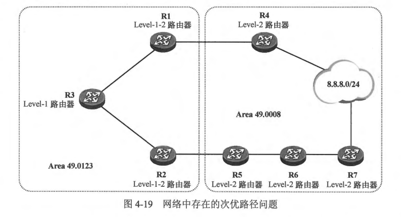
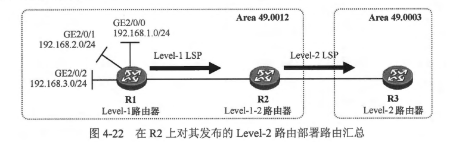
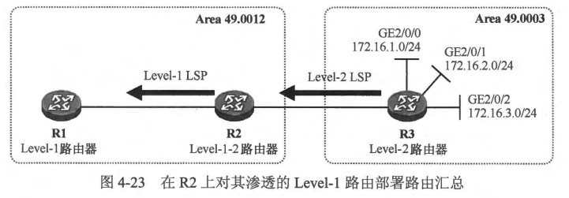
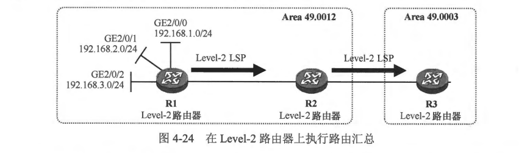
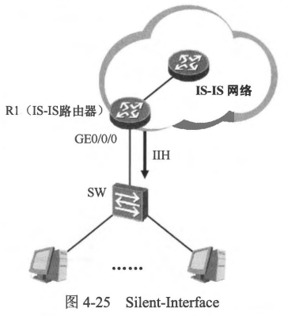

### 4.3.1 路由渗透
- 我们已经知道，在 IS-IS 中 Level-1-2 路由器是连接 Level-1 区域与骨干网络的桥梁，它会将到达所在 Level-1 区域的路由信息通过 Level-2 LSP 通告到骨干网络，从而让其他的 Level-1-2 或 Level-2 路由器学习到相关路由，然而缺省时它却并不将到达其他 Level-1 区域的路由信息以及到达 Level-2 区域的路由信息通告到本 Level-1 区域中，这样虽然可以简化 Level-1 区域中设备的路由表，从而节省设备资源，但是这种特性在某些场景下却也会带来一些问题，例如次优路径问题等。
- 在 图 4-19中，网络中的设备已经运行了 IS-IS，所有设备的接口的 IS-IS Cost 值都是相等的。R4 及 R7 都连接着 8.8.8.0/24 网段，并且都将到达该网段的路由发布到了 IS-IS 中。缺省时，Level-1 路由器 R3 是无法学习到 8.8.8.0/24 路由的，R1 及 R2 作为 Level-1-2 路由器，会在它们向 Area 49.0123 下发的 Level-1 LSP 中设置 ATT 比特位，而 R3 则根据该 ATT 比特位置位的 Level-1 LSP 生成默认路由。R3 会根据自己到达这两台路由器的度量值来决定默认路由的下一跳，由于 R3 到达 R1 及 R2 的 Cost 值相等，因此 R3 产生的默认路由将在 R1 及 R2 这两个下一跳执行等价负载分担。如此一来，R3 将认为从 R1 及 R2 均可到达区域外部，因此当其转发到达 8.8.8.0/24 的报文时，完全有可能将报文转发给 R2，报文将沿着 R2-R5-R6-R7 这条路径最终到达目的地，这就产生了次优路径问题。之所以出现这样的问题，是因为 R3 无法学习到去往 8.8.8.0/24 的路由，而且并不知晓从本地到达目的网段的实际 Cost 值。使用IS-IS 的路由渗透功能可以解决该问题。在本例中，可以在 R1 及 R2 上部署路由渗透，将 Level-2 路由 8.8.8.0/24 渗透到本地 Level-1 区域，使得 R3 能够通过它们学习到 8.8.8.0/24 路由。 
 
- 下面再看看路由渗透功能的另一个应用场景。在图 4-20 中，完成IS-IS 部署后，R1 及 R2 能够学习到去往 Area 49.0045 中的 X 业务网段的路由，然而它们并不会在自己向 Area 49.0123 下发的 Level-1 LSP 中描述关于这些网段的可达性信息。R3 通过产生指向 R1 及 R2 的默认路由来到达这些网段。
 
- 现在，该网络要求实现这样的需求：R3 转发到达 10.1.1.0/24、10.1.2.0/24 及 10.1.3.0/24 这三个 X 业务网段的报文时，将它们转发到 R1，而转发到达其他 X 业务网段的报文时，将其转发到 R2。由于缺省时，R3 只能够通过默认路由到达 X 业务网段，因此要实现上述需求，就必须让 R3 获得到达目标网段的具体路由，此时便可以使用 IS-IS 的路由渗透功能。我们可以在 R1 上部署路由渗透功能，将到达 10.1.1.0/24、10.1.2.0/24 及 10.1.3.0/24 这三个网段的路由渗透到 Area 49.0123 中，R1 通过向该区域下发描述这三条路由的 Level-1 LSP 来实现这个目的。这样一来，R3 便能够基于这些 LSP 计算出到达这三个网段的路由，并且路由的下一跳为 R1。现在，R3 转发去往这三个网段的报文时，根据最长前缀匹配原则，便会将报文发往 R1，而对于目的卫地址是 X 业务其他网段的报文，则匹配默认路由进行转发，此时可以通过将 R3 的 GE0/0/0 接口 IS-IS 度量值修改得比 GE0/0/1 接口更大，使 R3 将默认路由的下一跳指向 R2，来实现上述需求中的第二条。
- 在 Level-1-2 路由器的 IS-IS 配置视图中，执行 redistribute isis ip level-2 into level-1 命令，可以将 Level-2 区域中的路由信息渗透到本地 Level-1 区域中。在该命令中可以增加 distribute-list 关键字，从而对渗透的路由进行筛选或过滤，也可以增加 tag(route-map) 关键字，从而对渗透的路由进行标记。
- 需要特别说明的是，Level-1-2 路由器缺省时将自己从 Level-1 区域中学习到的路由信息全部通告到 Level-2 区域，实际上在这个过程中，我们也能够部署路由渗透，使得 Level-1-2 路由器只将特定的 Level-1 区域路由通告到 Level-2 区域。在 IS-IS 配置视图中使用 redistribute isis ip level-1 into level-2 命令，可部署 Level-1 区域到 Level-2 区域的路由渗透。

<br>
<br>

### 4.3.2 路由汇总
- 在开始本小节之前，先来回顾一下路由汇总的概念。所谓路由汇总就是将一组有规律的路由汇聚成一条路由，从而达到减小路由表规模以及优化设备资源利用率的目的，我们把汇聚之前的这组路由称为明细路由，把汇聚之后的路由称为汇总路由（或聚合路由)。
- 众所周知，RIP 及 OSPF 都是支持路由汇总的，而 IS-IS 同样支持路由汇总；作为链路状态路由协议，IS-IS 的路由汇总特性与 OSPF 颇为类似，但是又存在明显的差异。IS-IS
被广泛部署在运营商骨干网络中，这些网络的规模是非常庞大的，因此合理地规划网络并部署路由汇总是非常有必要的。与 OSPF 类似，IS-IS 也不支持路由自动汇总，网络管理员需根据实际需求在设备上执行手工配置来实现路由汇总。接下来看看 IS-IS 的几种路由汇总场景。
- 在Level-1 路由器上部署路由汇总
  - IS-IS 是一种典型的链路状态路由协议，在一个 Level-1 区域内，每一台 IS-IS 路由器都会产生自己的 Level-1 LSP；使用这些 LSP，路由器能够发现区域内的网络拓扑，从而计算出到达区域内各个网段的最短路径。IS-IS 允许设备对其始发的路由执行汇总。
  - 在 图 4-21 中，R1 、R2 及 R3 属于相同的 Level-1 区域，初始时，R1 在其所有接口上都激活了 IS-IS，那么 R2 及 R3 都应该能通过 R1 在区域内泛洪的 Level-1 LSP 计算出到达 192.168.1.0/24、192.168.2.0/24 及 192.168.3.0/24 网段的路由，此时为了简化 R2 及 R3 的路由表，可以在 R1 上部署路由汇总，将其发布的这三条路由汇总成 192.168.0.0/22。在 R1 的 IS-IS 配置视图下使用 summary-address 192.168.0.0 255.255.252.0 level-1 命令即可实现该需求。
  
  - 具体配置:
  ```shell
  R1:
  interface Loopback0
  ip address 192.168.1.1 255.255.255.0
  !
  interface Loopback1
  ip address 192.168.2.1 255.255.255.0
  !
  interface Loopback2
  ip address 192.168.3.2 255.255.255.0
  !
  interface Ethernet0/0
  ip address 10.1.12.1 255.255.255.0
  ip router isis 
  duplex auto
  
  router isis
   net 49.0123.0000.0000.0001.00
   is-type level-1
   metric-style wide
   log-adjacency-changes
   summary-address 192.168.0.0 255.255.252.0 level-1
   redistribute connected route-map isis level-1


  R2:
  interface Ethernet0/0
  ip address 10.1.12.2 255.255.255.0
  ip router isis 
  duplex auto
  !
  interface Ethernet0/1
  ip address 10.1.23.1 255.255.255.0
  ip router isis 
  duplex auto
  
  router isis
   net 49.0123.0000.0000.0002.00
   is-type level-1
   metric-style wide
   log-adjacency-changes


  R3:
  interface Ethernet0/0
  ip address 10.1.23.2 255.255.255.0
  ip router isis 
  duplex auto

  router isis
   net 49.0123.0000.0000.0003.00
   is-type level-1
   metric-style wide

  ```
  - 在 R1 部署路由汇总之前，它所产生的Level-1 LSP 如下：
  ```shell
  R1#show isis database R1.00.00 verbose 

  IS-IS Level-1 LSP R1.00-00
  LSPID                 LSP Seq Num  LSP Checksum  LSP Holdtime/Rcvd      ATT/P/OL
  R1.00-00            * 0x00000033   0xFC8E                1184/*         0/0/0
  Area Address: 49.0123
  NLPID:        0xCC 
  Hostname: R1
  Metric: 10         IS-Extended R2.01
  IP Address:   10.1.12.1
  Metric: 10         IP 10.1.12.0/24
    Prefix-attr: X:0 R:0 N:0
  Metric: 0          IP 192.168.1.0/24
    Prefix-attr: X:0 R:0 N:0
  Metric: 0          IP 192.168.2.0/24
    Prefix-attr: X:0 R:0 N:0
  Metric: 0          IP 192.168.3.0/24
    Prefix-attr: X:0 R:0 N:0
  ```
  - 从以上输出可以看出，R1 所产生的 Level-1 LSP 中，包含三个卫内部可达性信息 TLV，这三个 TLV 分别描述关于目的网段 192.168.1.0/24、192.168.2.0/24 以及 192.168.3.0/24 的可达性信息。
  - R1 部署了路由汇总后，它不再在其产生的 Level-1 LSP 中描述到达这三个网段的路由明细，而是描述一条汇总路由：
  ```shell
  R1#show isis database R1.00.00 verbose 

  IS-IS Level-1 LSP R1.00-00
  LSPID                 LSP Seq Num  LSP Checksum  LSP Holdtime/Rcvd      ATT/P/OL
  R1.00-00            * 0x00000034   0xD06D                1135/*         0/0/0
  Area Address: 49.0123
  NLPID:        0xCC 
  Hostname: R1
  Metric: 10         IS-Extended R2.01
  IP Address:   10.1.12.1
  Metric: 10         IP 10.1.12.0/24
    Prefix-attr: X:0 R:0 N:0
  Metric: 0          IP 192.168.0.0/22
    Prefix-attr: X:0 R:0 N:0
  ```
  - 如此一来，R2 及R3便能根据该 LSP 计算出汇总路由 192.168.0.0/22，而不会计算出三条明细路由，它们的路由表和LSDB 都得到了简化。
  - 值得注意的是，如果不是在R1,而是在R2 上执行 summary 192.168.0.0 255.255.252.0 level-1 命令试图对 R1 发布的这三条路由进行汇总，是不可行的，因为此时 R1 已经將 Level-1 LSP 发送了出来，R2 无权对其他设备所产生的LSP 进行修改。
- 在Level-1-2路由器上执行路由汇总
  - 在 图4-22中，R2 是一台 Level-1-2 路由器，它在 Area 49.0012 中收到了 R1所产生的 Level-1 LSP，并发现了其通告的 192.168.1.0/24、192.168.2.0/24 及 192.168.3.0/24路由，接下来，R2 会将这些路由通告到骨干网络。R2 会向处于 Area 49.0003 的R3 发送 Level-2 LSP，并在该 LSP 中描达到达 上述三个目的网段的可达性信息。R3 收到该 LSP 后，即可计算出相关的明细路由。
  
  - 具体配置:
  ```shell
  R1:
  interface Loopback0
   ip address 192.168.1.1 255.255.255.0
   ip router isis 
  !
  interface Loopback1
   ip address 192.168.2.1 255.255.255.0
   ip router isis 
  !
  interface Loopback2
   ip address 192.168.3.2 255.255.255.0
   ip router isis 
  !
  interface Ethernet0/0
   ip address 10.1.12.1 255.255.255.0
   ip router isis 
  duplex auto
  !
  router isis
   net 49.0012.0000.0000.0001.00
   is-type level-1
  
  
  
  R2:
  interface Ethernet0/0
   ip address 10.1.12.2 255.255.255.0
   ip router isis 
   duplex auto
  !
  interface Ethernet0/1
   ip address 10.1.23.1 255.255.255.0
   ip router isis 
   duplex auto
  !
  router isis
   net 49.0012.0000.0000.0002.00
   summary-address 192.168.0.0 255.255.252.0


  R3:
  interface Ethernet0/0
   ip address 10.1.23.2 255.255.255.0
   ip router isis 
   duplex auto
  !
  router isis
   net 49.0003.0000.0000.0001.00
   is-type level-2-only 
  ```
  - 此时可以在 R2 上部署路由汇总，将其通告给 R3 的 Level-2 路由 192.168.1.0/24、192.168.2.0/24 和 192.168.3.0/24 汇总成 192.168.0.0/22。在 R2的 IS-IS 配買视图下执行summary-address 192.168.0.0 255.255.252.0 level-2 命令即可实现该需求。完成上述配置后，R2 只会在其发送给 R3 的 Level-2 LSP 中描达汇总路由 192.168.0.0/22，而不再描述那三条明细路由。
  **注意: 在以上场景中，假设Area 49.0003 中还有其他 Level-2 路由器，例如R4（图中并末画出），此时如果 R2 并不执行路由汇总，那么我们是无法在 R3 上针对这三条明细路由部署路由汇总从而简化 R4 的路由表的，因为R4 是根据 R2 所产生的 Level-2 LSP 计算得出的路由，而 R3 无权对其他设备所产生的 LSP 进行修改。**

  - 在 Level-1-2 路由器上执行路由汇总的另一种场景是在该路由器部署了路由渗透后，对渗透到 Level-1 区域的路由进行汇总。如 图4-23 所示，R2 将 R3 所通告的 Level-2 路由 172.16.1.0/24、 172.16.2.0/24 及 172.16.3.0/24 渗透到了 Area 49.0012 中，此时可在 R2 的 IS-IS 配置视图下使用 summary-address 172.16.0.0 255.255.252.0 level-1 命令执行路由汇总，将上述三条路由汇总成 172.16.0.0/22。
  
  - 具体配置:
  ```shell
  R1:
  interface Ethernet0/0
   ip address 10.1.12.1 255.255.255.0
   ip router isis 
   duplex auto
  !          
  router isis
   net 49.0012.0000.0000.0001.00
   is-type level-1

  
  R2: 
  interface Ethernet0/0
   ip address 10.1.12.2 255.255.255.0
   ip router isis 
   duplex auto
  !
  interface Ethernet0/1
   ip address 10.1.23.1 255.255.255.0
   ip router isis 
   duplex auto
  ! 
  router isis
   net 49.0012.0000.0000.0002.00
   summary-address 172.16.0.0 255.255.252.0 level-1
   redistribute isis ip level-2 into level-1 route-map 1
  

  R3:
  interface Loopback0
   ip address 172.16.1.1 255.255.255.0
   ip router isis 
  !
  interface Loopback1
   ip address 172.16.2.1 255.255.255.0
   ip router isis 
  !
  interface Loopback2
   ip address 172.16.3.1 255.255.255.0
   ip router isis 
  !
  interface Ethernet0/0
   ip address 10.1.23.2 255.255.255.0
   ip router isis 
   duplex auto
  !
  router isis
   net 49.0003.0000.0000.0003.00
   is-type level-2-only 
  ```
  - 在Level-2 路由器上执行路由汇总
    - 在图 4-24 中，R1 为 Level-2 路由器，它将所有接口全部激活了IS-IS，在初始时，它会在其产生的 Level-2 LSP 中描述到达 192.168.1.0/24、192.168.2.0/24 及 192.168.3.0/24 的路由。R2 及 R3 都会学习到这三条路由。我们可以通过在 R1 上将其通告的这些 Level-2 路由汇总成 192.168.0.0/22，从而简化 R2 及 R3 的路由表。
    
    - 具体配置:
    ```shell
    R1:
    interface Loopback0
     ip address 192.168.1.1 255.255.255.0
     ip router isis 
    !
    interface Loopback1
     ip address 192.168.2.1 255.255.255.0
     ip router isis 
    !
    interface Loopback2
     ip address 192.168.3.2 255.255.255.0
     ip router isis 
    !
    interface Ethernet0/0
     ip address 10.1.12.1 255.255.255.0
     ip router isis 
     duplex auto
    !
    router isis
     net 49.0012.0000.0000.0001.00
     is-type level-2-only
     summary-address 192.168.0.0 255.255.252.0


     R2:
     interface Ethernet0/0
      ip address 10.1.12.2 255.255.255.0
      ip router isis 
      duplex auto
     !
     interface Ethernet0/1
      ip address 10.1.23.1 255.255.255.0
      ip router isis 
      duplex auto
     ! 
     router isis
      net 49.0012.0000.0000.0002.00
      is-type level-2-only

    
     R3:
     interface Ethernet0/0
      ip address 10.1.23.2 255.255.255.0
      ip router isis 
      duplex auto
     !
     router isis
      net 49.0003.0000.0000.0003.00
      is-type level-2-only
    ```
    - 在 R1 的 IS-IS 配置视图下使用 summary-address 192.168.0.0 255.255.252.0 level-2 即可实现这个需求。完成上述配置后，R1 产生的 Level-2 LSP 不再描述这三条路由明细，而是描达汇总路由，因此 R2 及 R3 能够根据该 LSP 计算出汇总路由。
    - 值得一提的是，由于 R1 所产生的 Level-2 LSP 将在整个 IS-IS 域的骨千网络中泛洪，因此 R2 及 R3 都会收到该LSP，此时如果 R1 并不执行路由汇总操作，而 R2 试图对前者所通告的上述三条 Level-2路由进行汇总，这个操作是不会生效的，因为相应的 Level-2 LSP 并非 R2 始发。 
    

<br>
<br>

### 4.3.3 passive-Interface
IS-IS 支持 passive-Interface(静默接口）特性，当一台设备的接口激活 IS-IS 后，该接口将会周期性地发送 IIH PDU， 在某些场景下，我们可能只是希望将该接口的网段发布到 IS-IS，而无需在这个接口上建立 IS-IS 邻居关系，那么就可以使用 passive-Interface 特性，来优化 IS-IS 配置。
- 在图 4-25中，IS-IS 路由器 R1 下联了一台二层交换机 SW，同时还连接到一个 IS-IS 网络。SW 除了连接 R1 之外，还连接着许多 PC。现在为了 IS-IS 网络让 IS-IS 网络获知到达 R1 的 GEO/0/0 接口所在网 段的路由，就需要在该接口上激活 IS-IS，这个操作一旦完成，R1 将在该接口上周期性地发送 IIH PDU，然而这个接口所接入的网段中并不存在其他的 IS-IS 设备，因此 R1 在该接口上发送的 IIH PDU 实际上是没有意义的，这些报文不仅浪费了网络带宽，而且还会对 SW 所连接的 PC 造成额外的负担。另一方面，如果此时有一台非法 IS-IS 设备接入了 SW，那么就有可能通过配置与 R1 形成邻居关系，从而对 IS-IS 网络造成威胁。

- 将 R1 的 GE0/0/0 接口配置为 passiveInterface 即可解决上述问题，当该接口被配置为 passive-Interface 后，它将不会再发送及接收 IS-IS 报文，但是这个接口的路由则依然会被发布到 IS-IS，因此IS-IS 网络中的设备还是能够获知到达该接口所在网段的路由的。在设备的IS-IS视图下，使用 passive-interface 命令即可将该接口配置为静默接口。
- 例如,在R1上可以进行如下配置
```shell
R1(config)#router isis
R1(config-router)#passive-interface gi0/0/0
``` 
