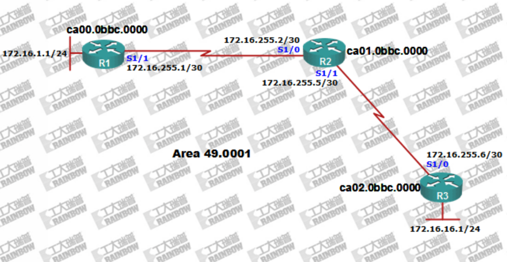
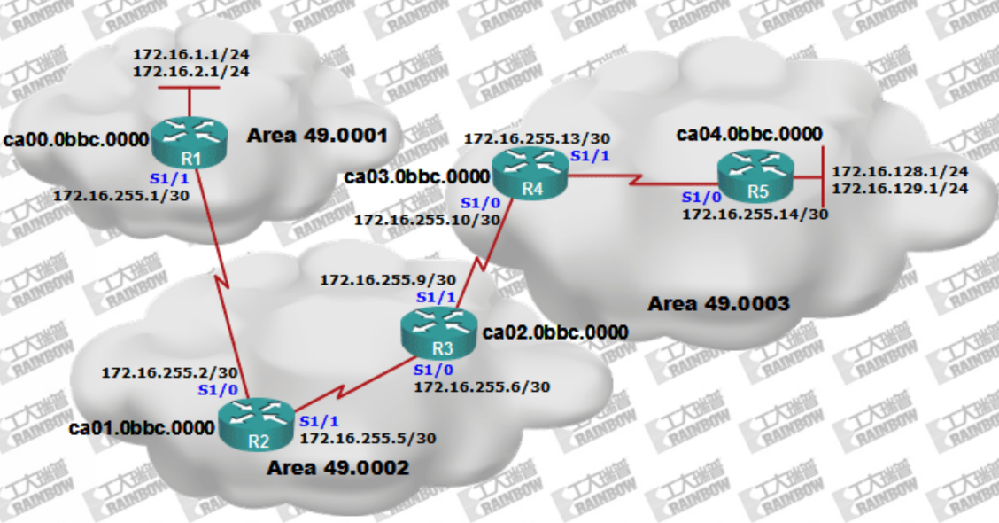
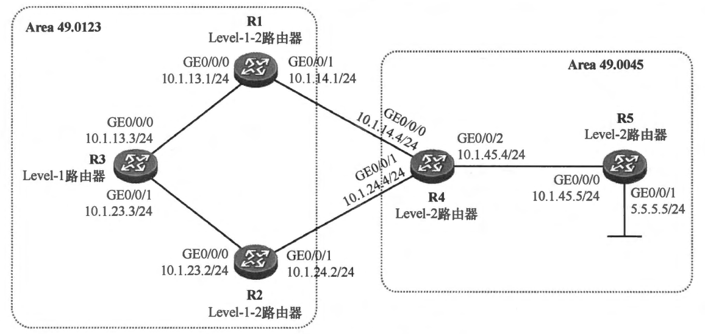
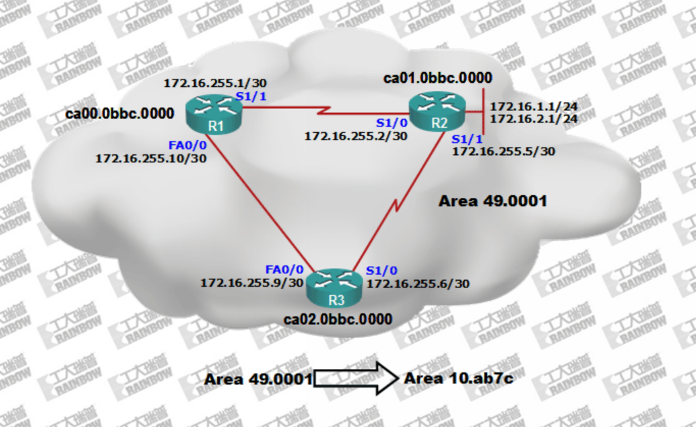
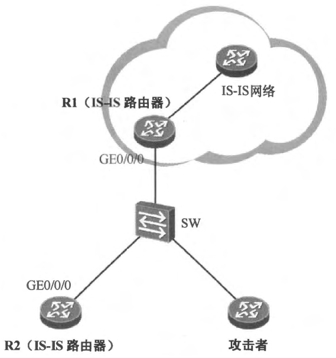

### 4.4.1 ISIS基础配置


<br>
<br>


### 4.4.2 ISIS多区域和路由汇总


<br>
<br>

### 4.4.3 ISIS路由渗透（*）
- 配置需求
  - 缺省时 R3 是无法通过 IS-IS 学习到 5.5.5.0/24 路由的，因为 Level-1-2 路由器 R1 及 R2 并不会在它们向 Area 49.0123 下发的 Level-1 LSP 中描述关于该网段的可达性信息，即便如此，此刻 R3 也是能够访问 5.5.5.0/24 的，当其转发到达该网段的报文时，将使用路由表中的 IS-IS 默认路由。接下来，我们将在 R1 上部署路由渗透，让它将 Level-2 路由渗透到 Level-1 区域，从而使得 Level-1 区域中的 R3 能够学习到 5.5.5.0/24 路由，并通过 R1到达该目的网段。
  

<br>
<br>

### 4.4.4 ISIS 区域迁移
- 配置需求:
  - 配置实现Area 49.0001到Area 10.ab7c的迁移
 

<br>
<br>

### 4.4.5 ISIS接口认证
- 配置示例演示:
```shell
isis password <password>
#在接口模式下配置这条指令，这种方式指定的密码默认为明文密码。

#如果需要加密密码，可以使用以下命令：
key chain <chain-name>
key <key-id>
key-string <password>

#在接口模式下生效
isis password key-chain <chain-name>
```
- 配置要求
  -  缺省时，IS-IS 设备发送的IHPDU 是不携带任何认证信息的，当它们在接口上收到 IIH PDU时，也只会针对报文的载荷进行相应的检查。在图4-28中，IS-IS 路由器R1 及R2 连接在同一台二层交换机上，它们之间建立了 IS-IS 邻居关系。此时如果一个攻击者也接入到了交换机 sW 上，并且在其接口上激活 IS-IS，那么它便有可能与 Rl、R2 建立 IS-IS 邻居关系，从而对网络造成威胁。我们可以通过在 R1 及R2 的接口上激活 IS-IS 认证，从而提高IS-IS 的安全性。
   

<br>
<br>


