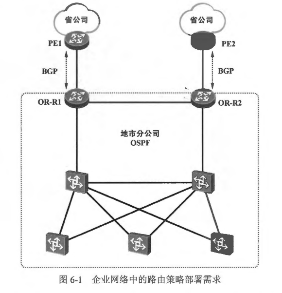

- 路由策略(Routing Policy）是一套用于对路由信息进行过滤、属性设置等操作的方法，通过对路由的控制，可以影响数据流量转发操作。实际上路由策略并非单一的技术或者协议，而是一个技术专题或方法论，里面包含着多种工具及方法。
- 图6-1展示了一个企业的网络。地市分公司的网络内运行了 OSPF，这使得该网络内能够实现数据互通。省公司的 PE 路由器 (PE1 及 PE2） 与地市分公司的出口路由器 (OR-R1 及 OR-R2）直连，并通过建立 BGP (Border Gateway Protocol，边界网关协议）对等体关系来交互 BGP 路由。PE1 及 PE2 将到达省公司网络的路由通过 BGP 通告给 OR-R1 及 OR-R2。另外，为了使地市分公司内的网络设备能够將发往省公司的流量送达目的地，OR-RI 及 OR-R2 将到达省公司的 BGP 路由引入了 OSPF。

- 然而该企业并不希望地市分公司获知到达省公司的所有BGP 路由，而且 BGP 通常被用于承载大批量的路由信息，如果猛地把所有 BGP 路由全部引入 OSPF，将瞬间使得地市分公司的网络设备的路由表规模迅速增大，设备的性能势必受到极大挑战。那么如何限制路由通告呢？如何有选择性地将 BGP 路由引入 OSPF 呢？网络管理员可以在省公司的PE 路由器上执行路由过滤，只将特定的 BGP 路由通告给 OR-R1 及
OR-R2。另外，当 OR-R1 及 OR-R2 收到省公司通告的 BGP 路由时，为了让 OSPF 域内的其他设备能够学习到这些路由，可以在路由重分发过程中进行相应的配置，只将特定的路由引入 OSPF。
- 此外如果企业希望地市分公司访问省公司的部分网络资源时通过 OR-R1 到达，而访问另一部分网络资源时则通过 OR-R2 到达，网络管理员也可以通过适当地操控路由属性来实现上述需求。综上所述，路由策略的应用是非常广泛的，也是非常重要的，我们主要通过部署路由策略来实现如下几种需求:
  - 网络设备在发布路由更新，或者按收路由更新时执行路由过滤。
  - 网络设备在执行路由重分发时，关联路由策略，只将特定的路由引入目标路由协议。
  - 针对不同的路由设置不同的路由属性 (例如路由的度量值、路由的优先级或路由的标记等）。
