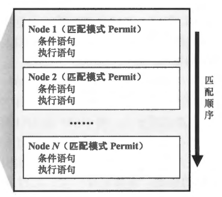
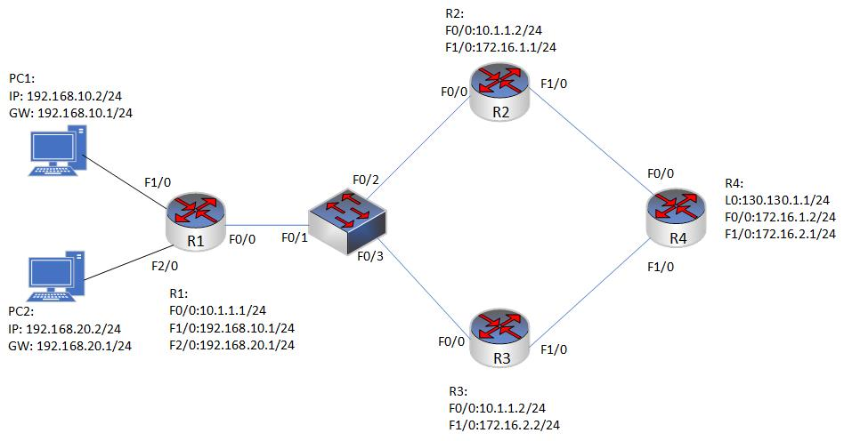

### 本章内容概述
- Route-map(路由映射图）是路由策略技术专题中的一个重要工具，它能在各种场合很好地完成路由策略的部署任务，而且功能非常强大，它既可以被用来执行路由过滤，又可以用于修改路由的属性。
- 在图6-2所示的网络中存在两个动态路由协议域 OSPF 及 RIP，而 R2 处于两个域的辺界。R2 同時込行着 RIP 及 OSPF，カ了止 R1 能学到 OSPF 域中的路由信息，我们需要在 R2 上部署路由重分发，将OSPF 路由引入 RIP。缺省情况下，R2 的路由表中所有的 OSPF 路由都会被引入 RIP，而且这些路由被引入后，它们的跳数都是统一的，是一个相同的值。如果希望 R2 只将特定的 OSPF 路由引入 RIP，而不是全部，并且对引入后的路由设置不同的跳数，该如何操作呢？此时就可以在路由重分发的过程中应用Route-map.

- 本章学习目标:
  - 了解 Route-Policy 的基本概念
  - 掌握 Route-Policy 的基础配
  - 掌握 Route-Policy 在各种场景下的应用

<br>
<br>

### 6.2.1 Route-Policy 的基本概念 
- Route-map 是一个非常重要的路由策略工具，如 图6-3 所示，您可以把它想象成拥有一个或多个节点(Node）的列表，每一个节点都可以是一系列条件语句及执行语句的集合，这些节点按照编号从小到大的顺序排列。在每个节点中，用户可以定义条件语句及执行语句，这就有点像程序设计语言里的 If-Then（如果-则）组合。在 Route-map 被执行的时候，设备从编号最小的节点开始进行路由匹配，在本例中首先看节点 1（图6-3中，最小的节点编号为 1 ），设备对该节点中的条件语句进行匹配，如果被匹配的对象满足所有条件，则执行该节点中的执行语句，并且不会再继续往下一个节点进行匹配。而如果节点 1 中，有任何一个条件不满足，则前往下一个节点，也就是到节点 2 中去匹配条件语句，如果被匹配的对象满足所有条件，则执行该节点中的执行语句，如果不满足，则继续下一个节点进行匹配，以此类推。



### 6.2.2 Route-map 基础配置
- 它可以用来控制路由器的路由策略和流量转发。下面是一个基本的Route-map配置，包括配置一个Match条件和一个Action操作：
```shell
route-map map-name [permit/deny] sequence-number
match match-condition
action action-type [metric metric-value]
```

- 其中，map-name 是你给Route-map 起的名称，permit/deny 用于允许或拒绝符合匹配条件的路由，sequence-number 是 Route-map 的顺序号，match-condition 是匹配条件，可以是路由表中的任何属性，action-type 是操作类型，可以是跳过这个 Route-map、修改下一跳、修改访问列表等，metric-value 是修改的属性值。例如，假设你要在路由器上配置一个 Route-map，只允许来自 192.168.1.0/24 网段的路由，并将它们的下一跳修改为 10.0.0.1，那么你可以使用以下配置：
```shell
route-map my-map permit 10
match ip address prefix-list my-prefix
set ip next-hop 10.0.0.1
```
- 其中，my-map是你给Route-map起的名称，permit表示允许符合匹配条件的路由，10是Route-map的顺序号，my-prefix是一个包含192.168.1.0/24的前缀列表，match ip address prefix-list my-prefix用于匹配该前缀列表中的路由，set ip next-hop 10.0.0.1用于将下一跳修改为10.0.0.1。


- 在route-map 中，可以定义多个子条目（sub-entry），每个子条目可以有不同的匹配规则和设置操作。当数据包到达路由器时，route-map 会逐个检查每个子条目，以找到与数据包匹配的规则。在多个子条目中，如果匹配到了多个规则，则只有第一个匹配到的规则会被执行。因此，可以通过调整子条目的顺序，来决定路由的优先级。以下是一个示例，说明在多个子条目中如何匹配路由:

```shell
route-map MY_MAP permit 10
 match ip address prefix-list MY_LIST1
  set ip next-hop 192.168.1.1

route-map MY_MAP permit 20
 match ip address prefix-list MY_LIST2
  set ip next-hop 192.168.1.2
```

- 在这个例子中，route-map MY_MAP 包含两个子条目，每个子条目都根据不同的IP前缀匹配路由，然后将路由的下一跳地址设置为不同的值。当有数据包到达路由器时，route-map会先检查子条目10，如果数据包的目的地址匹配到MY_LIST1中定义的IP前缀，则将路由的下一跳地址设置为 192.168.1.1。如果数据包的目的地址不匹配 MY_LIST1，则会继续检查子条目 20，如果数据包的目的地址匹配到 MY_LIST2 中定义的 IP 前缀，则将路由的下一跳地址设置为 192.168.1.2。如果数据包的目的地址不匹配 MY_LIST2，则不会执行任何操作。因此，通过调整子条目的顺序，可以确定路由的匹配优先级，从而实现更精细的路由控制。

<br>
<br>

### 6.2.2 策略路由配置实验
- 配置要求
  - 在R1、R2、R3、R4 上配置 RIP 路由协议，使其全网通。并做路由控制，要求 PC 所在的 192.168.10.0 网段访问R4的回环口 130.130.1.1 所走的路径为R1-R2-R4,要求 PC2 所在的 192.168.20.0 网段访问R4的回环口 130.130.1.1 所走的路径为 R1-R3-R4 。


<br>
<br>

### 6.2.3 使用 route-map 过滤路由
- 配置要求
  -  在R1、R2上运行OSPF协议，R2、R3上运行RIP路由协议，在R2上配置路由重分发使其全网通现在要求做路由过滤R1不能学到R3的192.168.2.0和192.168.3.0网端，R3不能学到172.16.0.0和172.16.1.0网段。要求使用路由映射图。


<br>
<br>

### 6.2.4使用route-map 设置路由标记及过滤带标记的路由


