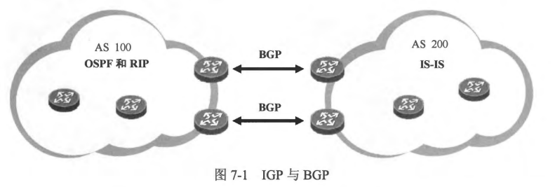

### 本章内容概述和教学目标
- 首先来回顾一下自治系统 (Autonomous System， AS)的概念。关于 AS 的传统定义是：由一个单一的机构或组织所管理的一系列 IP 网络及其设备所构成的集合。可以简单地将 AS 理解为一个独立的机构或者企业所管理的网络，例如一家网络运营商的网络等。另一个关于 AS 的例子是，一家全球性的大型企业在其网络的规划上将全球各个区域划分为一个个的 AS，例如中国区是一个AS，韩国区是另一个 AS。
- 根据工作范围的不同，动态路由协议可分为两类，一类被称为 IGP (Interior GatewayProtocol，内部网关协议），例如 RIP、OSPF、IS-IS 等。另一类被称为 EGP (Exterior GatewayProtocol，外部网关协议），例如 BGP 等。IGP 协议用于帮助路由器发现到达本 AS 内的路由，一个 AS 通常采用一种 IGP 协议，当然，仍存在许多大型的网络，它们在一个 AS 中采用多种 IGP 协议以便支撑该网络多元化的需求。无论何，IGP 协议能够帮助一个 AS 内的路由器发现到达该 AS 各个网段的路由，从而实现 AS 内部的数据互通。然而在一个由多个 AS 构成的大规模的网络中，还需要 EGP 协议来完成 AS 之间的路由交互。Internet 就是一个包含多个 AS 的超大规模网络，在 Internet 的骨干节点上，正是运行着 EGP 协议，从而实现 AS 之间的路由交互，而 BGP 就是最为大家熟知和使用得最为广泛的一种 EGP 协议，如图7-1所示。
 

- BGP (Border Gateway Protocol，边界网关协议）几乎是当前唯一被用于在不同 AS 之间实现路由交互的 EGP 协议。BGP 适用于大型的网络环境，例如运营商网络，或者大型企业网等。BGP 支持 VLSM、支持 CIDR ( Classless Inter-Domain Routing， 无类域间路由），支持自动路由汇总、手工路由汇总。
- BGP 使用 TCP 作为传输层协议，这使得协议报文的交互更加可靠和有序。BGP 使用目的 TCP 端口 179，两台互为对等体的 BGP 路由器首先会建立 TCP 连接，随后协商各项参数并建立对等体关系，初始情况下，两者会同步双方的 BGP 路由表，在 BGP 路由表同步完成后，路由器不会周期性地发送 BGP 路由更新，而只发送增量更新或在需要时进行触发性更新，这大大地减小了设备的负担及网络带宽损耗，由于 BGP 往往被用于承载大批量的路由信息，如果依然像 IGP 协议那样，周期性地交互路由信息，显然是相当低效不切实际的。

- BGP 定义了多种路径属性 (Path Attribute)用于描述路由，就像一个人拥有身高、体重、学历、特长和经历等属性一样，一条 BGP 路由同样携带着多种属性，路径属性将影响 BGP 路由的优选。BGP 还定义了丰富的路由策略工具，这些工具使得 BGP 具有强大的路由操控能力，这也是 BGP 的魅力之一。
- BGP 的发展过程中，经历了数个版本，目前在 IPv4 环境中，BGPv4 ( BGP Version 4,BGP 版本4）被广泛使用，该版本在 RFC4271 CA Border Gate way Protocol 4） 中描述。

- 本章学习目标:
  - 了解 BGP 的应用场景及协议特点
  - 热悉 BGP 对等体关系的类型及区别
  - 熟悉BGP 各种报文的功能及格式
  - 理解BGP 对等体关系的建立过程
  - 理解 IBGP 水平分割的原理
  - 理解 BGP 路由黑洞问题，了解其解决办法

 
 

### 7.1.1 BGP对等体类型
- BGP 协议的操作，以 OSPF 为例，当我们在两台直连路由器的直连接口激活 OSPF 后，这两个接口就开始收发 Hello 报文，在通过 Hello 报文发现了直连链路上的邻居后，一个邻接关系的建立过程也就开始了。IGP 协议要求需要建立邻居关系的两台路由器必须是直连的，然而 BGP 则大不相同。BGP 的对等体关系并不要求设备必须直连，BGP 采用 TCP 作为传输层协议，两台路由器只要具备 IP 连通性，并且能够顺利地基于 TCP179 端口建立连接，就可以建立 BGP 对等体关系，因此BGP 的对等体关系是可以跨设备建立的。
- 我们将建立 BGP 邻居关系的路由器称为 BGP 对等体(Peer)。BGP 有两种对等体关系，一种是 EBGP，另一种是 IBGP。
- EBGP 对等体关系(External BGP Peer)
  - 如果建立对等体关系的两台 BGP 路由器位于不同的 AS，那么它们之问的关系被称为 EBGP 对等体关系。在图7-2中，显示了 3个 AS 通过 BGP 对接的场景。图中对于这 3个 AS 内部的网络架构只是做了一个非常简单的描绘，实际上 AS 内部的网络可能是庞大而复杂的，只不过站在 BGP 的视角，它并不关心 AS 内部的网络结构。在 AS 100、AS 200 及 AS 300中，各自运行着 IGP 协议，目的是为了实现 AS 内部的路由互通，而 AS 之间的路由信息交互则由 BGP 来完成。在本例中，R1 及 R2 运行了 BGP 并且两者建立了 EBGP 对等体关系，同样，R3 及 R4 之间也建立了 EBGP 对等体关系。
  - 一条 BGP 路由在EBGP 对等体之间传递时，会发生有趣的变化。在 图7-3 中，描述了 AS 200 中的一条路由---10.1.1.0/24 在 EBGP 对等体之间的传递情况。R2 将AS 200 中的 10.1.1.0/24 路由发布到了 BGP，它将这条路由通过 BGP 通告给自己的 EBGP 对等体 R1。每条 BGP 路由都携带着多个属性，这些属性被称为路径属性，其中一个非常重要的路径属性就是 AS Path, AS Path 是每条 BGP 路都会携带的属性，它描述了一条 BGP 路由在传递过程中所经过的 AS 的号码。R2 將始发于 AS 200 的路由 10.1.1.0/24 通告给 R1 时，将该路由的 AS Path 设置为 200，而R1将这条路由通告给自己的 IBGP 对等体 R3 时，路由的 AS Path 不发生改变。R3 将该路由通告给 EBGP 对等体 R4 时，则將路由的 AS_ Path 修改为 100 200，也就是在原有的 AS Path 基础上，插入自己所处 AS的号码，当 R4 收到这条 BGP 路由更新时，它便知道要到达该目的网段，需要经过 100 、 200 这两个 AS—一您可能已经发现了，BGP 路由在 EBGP 对等体之间的传递过程，很有点距离矢量路由协议的味道。实际上如果R2 及 R4 之间也建立 EBGP 对等体关系的话，那么 R4 将会从 R2 直接收到 10.1.1.0/24 的路由更新，而这条路由的 AS Path 为 200，单纯从 AS_ Path 属性值的长度（包含的 AS 号码个数）来衡量，显然对于 R4 而言直接从 R2 到达目标网段要更 “近”一点。因此，AS Path 的长度会影响路由器对 BGP 路径的优选。
  
  

  - 另外，路由在 EBGP 对等体之间传递时，AS Path 还用于防止出现路由环路。R4 从 R3 收到 10.1.1.0/24 路由后，如果它与 R2 之间存在 EBGP 对等体关系，那么它会将该路由通告给 R2，此时路由的 AS_ Path 为 300 100 200，如图7-3所示，R2 从 R4 收到该路由后，会忽略这条路由更新，因为它在收到的路由中看到了自己本地的 AS 号码，便意识到网络中出现了环路。
  - 通常情況下，EBGP 对等体关系必须基于直连接口建立，例如本例中的 R1 及 R2，它们是直连的，此时双方便可使用直连接口来建立 EBGP 对等体关系。BGP 之所以要设定这样的规则，是因为缺省情况下，EBGP 对等体之间发送的 BGP 协议报文的 TTL 值为 1，这使得这些协议报文只能够被传送 1 跳。当然，在某些特殊的场景中我们可能需要在两台非直连的路由器之间建立 EBGP 对等体关系，那么就需要修改 EBGP 对等体的跳数限制，通过这个操作来修改协议报文中的 TTL 值。
- BGP 对等体关系(Internal BGP Peer)
  - 如果建立对等体关系的两台 BGP 路由器位于相同的 AS，那么它们之间的关系被称为 IBGP 对等体关系。例如在 图7-2 所描述的网络中，AS 100 内存在两台运行着 BGP 的路由器：R1 及 R3，由于它们同属一个 AS，因此它们之间所建立的关系为 IBGP 对等体关系。同样的，AS 200 中的 R2 及 R6 也建立了 IBGP 对等体关系。
  - 值得注意的是，在两台路由器之问建立 IBGP 对等体关系时，并不要求它们必须直连，在本例中，AS 100 里的 R1 和R3 就并未直连，得益于 AS 100 中运行的IGP 协议（例如OSFF 等），R1 及 R3 能够发现到达对方的路由，从而两者能够借助这些路由建立 TCP 连接，并进一步建立 IBGP 对等体关系。
  - 不同的 BGP 对等体关系，对路由的操作是有明显区别的。例如 BGP 路由在 EBGP 对等体之间传递时，AS Path 属性会发生改变，路由的发送方会在该条 BGP 路由原有 AS_ Path 的基础上，插入自己所处 AS 的号码。而 BGP 路由在 IBGP 对等体之间传递时，AS Path 不会发生改变。当然，EBGP 路由及 IBGP 路由在传播过程中的差异还不仅限于此。

 
 

### 7.1.2 IBGP 水平分割规则
- 我们己经知道，AS Path 属性可以防止 BGP 路由在 EBGP 对等体之间传递时发生环路，然而当路由在 IBGP 对等体之间传递时，AS Path 属性的值是不会发生改变的，也就是说当 BGP 路由在一个 AS 内传递时，是无法依赖 AS Path 提供的防环能力的，那么此时路由环路就有可能发生，IBGP 水平分割规则就是用于解决这个问题的。
- 图7-4 所示的网络中，R1 与 R2 和 R3 分别建立 EBGP 对等体关系，而 AS 64513 内的三台路由器则两两建立 IBGP 对等体关系。现在 R1 将AS 64512 内的10.1.1.0/24 路由发布到 BGP。R1 将这条路由通过 BGP 通告给自己的 EBGP 对等体 R2，当然，我们并不担心这条路由在 AS 64512 及 AS 64513 之间传递时会发生环路，因为 AS Path 能够起到防环的作用。但是在 AS 内部的路由防环呢？当 R2 收到 R1 通告的 10.1.1.0/24 路由后，它将这条路由通告给自己的 IBGP 对等体 R3 及 R4，R4 会将该由通告给 IBGP 对等体 R3，而 R3 又会将该路由通告给 R2，这就极有可能引发路由环路。
- BGP 规定，当路由器从一个 IBGP 对等体学习到某条 BGP 路由时，它将不能再把这条路由通告给任何 IBGP 对等体，这就是 IBGP 水平分割规则。在本例中，R4 从 IBGP 对等体 R2 学习到的路由将不能再通告给 R3，因为 R3 也是它的 IBGP 对等体。同理，R3 从 R2 学习到的 BGP 路由也不能通告给 R4。
 
- BGP 水平分割规则是一个非常重要的设计，它可以在极大程度上规避 AS 内 BGP 路由传递时可能引发的路由环路问题。然而在某些场景中，它也会带来一些新的问题。
- 图7-5 展示了一个示例，在这个网络中，R4 增加了一个IBGP 对等体 R5。由于 IBGP 水平分割规则的限制，R4 是无法将学习自 IBGP 对等体 R2 的 10.1.1.0/24 路由再通告给另一个 IBGP 对等体 R5 的，因此这将造成 R5 无法学习到去往 AS 64512 的路由。实际上我们不可能放弃 IBGP 水平分割规则，因为它确实非常重要，但是在许多场景下又必须解决 IBGP 路由传递的问题。这个问题有多种解决办法，例如可以在 AS 内部建立 IBGP 对等体关系的全互联模型。以AS 64513 为例，需在该 AS 中所有的 BGP 路由器两两之间建立 IBGP 对等体关系，如图7-6所示。

 
 
- 在一个 AS 内部实现 IBGP 对等体全互联是一种常规的解决方案。在本例中，R2 与 R5、R3 与R5 可能并非直连的路由器，但是正如前文所说，它们无需直连，实际上 AS 64513 内的所有路由器可能己经运行了一个 IGP 协议，例如 OSPF，使得该 AS 内的路由器能够学习到去往本 AS 内所有网段的路由。如此一来，R2 与 R5，R3 与 R5 即可建立 TCP 连接并进一步建立 IBGP 对等体关系。虽然 R2 与 R5 之间直接建立起了 IBGP 对等体关系，但是其实两者交互的 BGP 协议报文依然需要通过物理路径来转发，例如可能需要经过 R4，只不过对于 R4 而言，它只是简单地转发这些报文，而不会对报文的内容感兴趣，因为报文的目的 IP 地址并非自己拥有的 IP 地址，而是 R2 或者 R5 的地址。
- 在一个 AS 内建立 IBGP 对等体全互联模型在许多场景中是可行的，但是在另一些场景中，却会带来问题，如果 AS 内的 BGP 路由器数量特大时，所有的路由器两两之间建立 IBGP 对等体关系显然可能给网络及设备带来较大的负担，而且也降低了网络的可扩展性。好在 BGP 还有另外两种解决方案，它们是路由反射器及联邦。

 
 

### 7.1.3 路由黑洞问题及 BGP 同步规则
- 我们已经知道，两台 BGP 路由器之间无需直连也可建立对等体关系，只要它们具备 IP 连通性并且可以建立 TCP 连接即可。BGP 的这个特点使得路由的传递更加灵活，然而稍有不慎，这个特性也可能带来一个麻烦，例如路由黑洞。
- 以 图7-7 为例，R1 、R2 、R3 及 R7 均是 BGP 路由器，并且按照图示建立 BGP 对等体关系。AS 34567 内己经部署了 OSPF，使得 AS 内部的路由器能够获知到达该 AS 内各个网段的路由信息。R4、R5 及 R6 并不运行 BGP，只运行 OSPF，得益于 AS 34567 内运行的 OSPF，R3 及 R7 实现了 IP 连通性（R3及R7之间并没有直连的物理链路），并且建立起了 IBGP 対等体关系。
 
- 现在 R1 将 AS 100 内的 1.0.0.0/8 路由发布到了 BGP，然后将这条路由通告给了 R3,而 R3 则将这条 BGP 路由通过 IBGP 连接直接通告给了 R7(假设 R3 在将该 BGP 路由通告给 R7时，告知了 R7 需经自己到达该路由所指向的目的地，为了达到这个目的，R3 將该 BGP 路由的 Next Hop 属性值设置为它自己的地址），R7 再将其通告给 R2，最终 R2 能够通过 BGP 学习到 1.0.0.0/8 这条来自 AS 100 的路由并将其加载到自己的路由表中。
- 现在 R2 收到一个去往 1.0.0.0/8 的数据包，它查询路由表后发现到达该目的地的下一跳为 R7，于是将数据包转发给 R7。R7 收到这个数据包后也进行路由表查询，结果发现到达该日的地的下一跳为 R3，然而R3 并非它的直连路由器，它意识到下一跳路由器处于一个远端网段，因此它将继续在自己的路由表中查询到达 R3 的路由(也即递归杳询)。由于 AS 34567 内己经运行了 OSPF，R7 发现可以通过 OSPF 路由到达 R3，而且下一跳是 R4（假设当网络正常时，R7 选择经 R4 到达 R3)。如此一来 R7 意识到要将数据包送达 1.0.0.0/8，需先将其转发给 R4。
- 当R4 收到这个发往 1.0.0.0/8 的数据包时，它将在自己的路由表中查询到达该目的网段的路由，由于该路由是在 BGP 中被通告的(AS 34567 内运行的 OSPF 并不知晓到达这个的网段的路由），而 R4 恰恰没有运行 BGP，至此在 R4 上就出现了路由黑洞，发往这个目的网段的数据包在 R4 这里被丢弃。同样的问题也可能发生在 R6 上，当 R4 发生故障时，R7 将会把到达 1.0.0.0/8 的报文转发给 R6，而后者同样存在路由黑洞问题。
- 为了规避路由黑洞问题，BGP 引入了同步规则 (BGP Syachronization）。所谓的 BGP 同步规则指的是：当一台路由器从自己的 IBGP 对等体学习到一条 BGP 路由时(这类路由被称为 IBGP 路由），它将不能使用该条路由或把这条路由通告给自己的 EBGP对 等体，除非它又从 IGP 协议（例如 OSPF 等，此处也包含静态路由）学习到这条路由，也就是要求 IBGP 路由与 IGP 路由同步。同步规则主要用于规避 BGP 路由黑洞问题。
- 还是以 图7-7 为例，如果 R7 激活了 BGP 同步，那么当它收到 IBGP 对等体R3 通告的 1.0.0.0/8 路由时，缺省是不会使用该路由的，当然也不会将通告给 EBGP 对等体 R2,只有当 R7 又从IGP 协议（例如 AS 34567 中运行的OSPF）学习到 1.0.0.0/8 路由时，或者 R7 拥有到达 1.0.0.0/8 的静态路由时，它才会使用这条 BGP 路由，并且将该 BGP 路由通告给 R2。此时 R7 的“想法”是：“我现在已经通过 BGP 学习到了去往 1.0.0.0/8 的路由，而我的路由表里又存在到达该目的网段的 OSPF 路由，这样看来网络中的设备应该都运行了 OSPF，并且也都通过 OSPF 发现了到达该目的网段的路由，那么如果我將到达该目的网段的数据包转发出去，这些数据包应该是可以被转发到目的地的，因此我可以放心地使用该 BGP 路由并且将其通告给我的 EBGP 对等体了”。
- 在本案例中，要将 R2 发往 1.0.0.0/8 的数据包顺利地转发到目的地，可行的办法有几种。
  - 第一个办法是在 AS 34567 内的所有路由器上都运行 BGP，也就是让 R4、R5 及 R6 也运行 BGP。然而由于 IBGP 水平分割则的存在，我们将不得不在 AS 34567 内实现 IBGP 对等体关系全互联，从而保证 BGP 路由不会丢失，此时需关闭设备上的 BGP同步规则。如果 AS 34567 内的路由器数量特别大，那么 IBGP 全互联的组网会给设备带来沉重的负担，而且该网络的可扩展性也将受到制约。此时路由反射器及联邦会是两个不错的解决方案。
  - 第二个办法是 R3 将 BGP 路由引入 AS 34567中的 OSPF，从而让 OSPF 也能够获知到达 1.0.0.0/8 的路由。这样对于 R7而言这条路由也就满足了同步规则----既从 IBGP 对等体学到，又从IGP 协议获知，而R4、R5 及 R6也能够通过 OSPF 发现到达 1.0.0.0/8 的路由，因此路由黑洞的问题也就迎刃而解了。当然在 R3 上将 BGP 路由引入 OSPF 的操作需要非常谨慎地执行，因为 BGP 承载的路由信息往往是巨大的，如果不做任何限制地直按将 BGP 路由引入一个 IGP 协议，带来的影响会很大。基于上述分析，这种办法并非在所有场景中都适用。
  - 第三个办法是采用 MPLS。 MPLS (Multi-Protocol Label Switching，多协议标签交换）是一种标签交换技术，简单地说，就是在一个报文的 IP 头部之前、数据帧头部之后插入一个标签头部，由于 IP 头部“躲藏”在标签头部之后，因此在数据从源被转发到目的地的过程中，沿途的网络设备只需根据标签头部中的标签进行选路，如此一来即使转发设备没有到达目的网络的路由也不会影响数据转发，因为此时它们是基于标签信息对报文进行选路及转发的，而不是基于目的 IP 地址。
- 综上所述，解决 BGP 路由黑洞问题的方案很多，而且都比较成熟，在诸多成熟方案可供选择的情况下，依然激活同步规则也就显得没有意义了，因此在 Cisco 产品上，BGP 同步规则缺省是被关闭的。

 
 

### 7.1.4 路由通告
- BGP 路由在对等体之间交互时，主要存在以下几个原则:
  - 当一台路由器发现了多条可到达同一个目的网段的 BGP 路由时，该路由器会通过一个路由选择进程在这些路由中选择一条最优（Best）的路由。通常情况下，路由器只将最优的路由加载到路由表中使用（激活了负载分担功能的情况除外），而且只会将最优的路由通告给 BGP 对等体。
  - 当一台路由器从自己的 EBGP 对等体学习到 BGP 路由时，缺省时它会将这些路由通告给所有 IBGP 对等体及所有 EBGP 对等体。
  - 当一台路由器从自己的 IBGP 对等体学习到 BGP 路由时，它不会将这些路由通告给其他 IBGP 对等体-----IBGP 的水平分割规则使然。
  - 当一台路由器从自己的 IBGP 对等体学习到 BGP 路由时，如果 BGP 同步被激活，则路由器只有从 IGP 协议也学习到相应的路由时，才会将这些 BGP 路由通告给 EBGP 对等体；如果 BGP 同步被关闭，则即使没有从IGP 协议学习到相应的路由，它也会将这些 BGP 路由通告给 EBGP 对等体。
- **说明: Cisco 路由器缺省关闭 BGP 同步规则。**
- 要强调的是，以上讨论的所有情况，前提均是 BGP 路由的 Next-hop 属性所填充的下一跳地址可达。

### 7.1.5 Router-ID
- BGP Router-ID 是网络设备的 BGP 协议标识符，长度为 32bit， 与 IPv4 地址的格式相同，例如 192.168.32.1。在规划 BGP 网络时，需确保设备的 Router-ID 的唯一性。
- BGP 的Router-ID 可以通过两种方式获取，其一是让 BGP 自动选取，另一个方式则是通过手工配置的方式为设备指定。当然，从网络可靠性的角度考虑，在实际部署时，建议采用手工配置的方式指定设备的 Router-ID。

### 7.1.6 报文类型及格式
- BGP 主要使用 4 种协议报文。我们已经知道，BGP 是工作在 TCP 之上的，使用 TCP 目的端口号 179。BGP 协议报文在传输层采用 TCP 封装。两台路由器如果要交互 BGP 路由信息，就必须建立 BGP 对等体关系，此时，双方能够正确地建立 TCP 连接是一个基本的前提，只有路由器之间完成了TCP 连接的建立，才能开始交互 BGP 协议报文。
- 所有的 BGP 报文都有一个相同格式的头部，这个头部一共 19byte，如图7-8 所示。
 
  - 标记 (Marker): 该字段被保留用于协议兼容性，没有其他特别的含义。
  - 长度 (Length): 指示该 BGP 报文的长度（字节数）。
  - 类型 (Type): 指示了该 BGP 报文的类型，常见的 BGP 报文类型与类型字段值的对应关系如下：
    - open 报文
    - Update 报文
    - Notification 报文
    - Keepalive 报文
- Open 报文
  - 我们己经知道，两台 BGP 路由器要想交互 BGP 路由，就需要建立对等体关系，在此之前两者需首先建立 TCP 连接，一旦 TCP 连接被正确建立，双方便开始交换 Open 报文，Open 报文中包含设备所处的 AS 号、BGP 版本号、Router-ID 以及一些可选参数等信息(例如用于描述 BGP 所支持的一些协议特性的参数等)，如果路由器认可对方发送过来的 Open 报文，则立即回送一个 Keepalive 报文以作确认。图7-9所示，展示了 Open 报文的格式，其中各个字段的描述如下。
 
  - 版本(Version): BGP 协议的版本，本章介绍的是 BGPv4，因此该字段的值为 4
  - AS号 (AS Number): 该 BGP 报文发送方所处AS 的号码。
  - 保活时间(Hold Time): 在多长时间（以秒为单位）内必须收到对方的 Keepalive 报文或 Update 报文，否则将该对等体视为无效。在两合 BGP 路由器建立对等体关系的过程中，保活时间需要双方进行协商，双方配置的值可以不同，但是最终双方均只认可值更小的保活时间。
  - 路由器标识符 (Router-ID): 32bit 的 BGP 路由器标识符。
  - 可选参数长度 (Optional Parameters Length）: 指示了 BGP 报文中，可选参数宇段的长度（字节数）。
  - 可选参数 (Optional Parameters): Open 报文里可以包含多个可选参数，每个可选参数使用类型 （Type）、长度 (Length）及值（Value）的三元组格式描述。在Open 报文中，可选参数主要被用于宣告及协商 BGP 对等体的某些能力特性。
- Update 报文
  - BGP 路由器使用 Update 报文向其对等体通告路由信息。BGP 在一个 Update 报文中通告一条或多条拥有相同路径属性的路由，拥有不同的路径属性的 BGP 路由需使用不同的 Update 报文来通告。Update 报文除了能够用于向对等体通告 BGP 路由，还能够用于撤销一条或多 BGP 路由。
- 图7-10展示了 Update 报文的格式，其中各个字段的描述如下。
  - 撤销路由的长度(Withdrawn Routes Length): Update 报文中可以包含 0 条、1 条或者多条准备撤销的 BGP 路由。该字段是一个无符号整数，它指示了 Update 报文中所包含的“撒销的路由条目”字段的长度（字节数)。
  - 撤销的路由条目(Withdrawn Routes)：这个字段用于存放需要被撤销的 BGP 路由前缀，如果有多条BGP 路由需要使用这个 Update 报文来撤销，那么这个字段将包含一个BGP路由前级的列表，每条 BGP 路由前级包含两元，分别是前级长度及路由前缀。
  - 路径属性长度 (Total Path Attribute Length)：这个字段指示了 Update 报文中路径属性的总长度。
  - 路径属性 (Path Attributes)：当 BGP 路由器使用 Update 报文向邻居通告 BGP 路由时，该报文中就包含着路径属性字段。BGP 定义了丰富的路径属性类型。
  - 网络层可达信息 (Network Layer Reachability Information)：这个字段用于存放需要被被通告的 BGP 路由前级，如果有多条 BGP 路由需要使用这个 Update 报文来通告，那么这个字段將包含一个 BGP 路由前级的列表，每条 BGP 路由前缀包含两元，分别是缀长度及路由前缀，当然，一个 Update 报文用于通告拥有相同路径属性的路由前缀。

     

- Keepalive 报文
  - BGP 是基于 TCP 工作的，它可以依赖 TCP 实现协议的可靠性，但是它并不依赖 TCP 的保活机制，而是使用周期性发送的 Keepalive 报文来了解对等体的存活情况。BGP 路由器会为对等体维护一个保活计时器(Hold Timer)，如果保活计时器超时，则 BGP 对等体被视为不可达，此时 BGP 对等体关系需要重新建立。对等体之间周期性交互的 Keepalive 报文可以刷新保活计时器，防止该计时器超时。BGP 路由器周期性发送 Keeplive 报文的时间间隔缺省为 1/3 的保活计时器时间，在 Cisco 产品上，保活计时器的时问缺省为 180s，因此缺省时，Keepalive 报文的周期性发送间隔为 60s。
  - 在BGP 对等体关系的建立过程中，Keepalive 报文还用于确认对方发送过来的 Open报文。
- Notification 报文
  - 当BGP 检测到一个错误时，它可以使用 Notification 报文来告知对等体。图7-11展示了 Notification 报文的格式。
   
     
  - 错误代码 (Error Code): 该字段的值是一个无符号整数，指示了错误的类型。
  - 错误子代码 (Error Subcode): 在错误代码的基础上进一步指示错误的类型。
  - 数据 (Data): 这个字段用于描述错误的原因。

 
 

### 7.1.7 查看 BGP 对等体
- 两台 BGP 路由器需要首先建立对等体关系,然后才能够正常交互 BGP 路由。在 BGP 中，一台设备的 BGP 对等体需要网络管理员通过命令手工指定，也就是说 BGP 无法自动发现其他对等体。当两台需建立对等体关系的 BGP 路由器完成配置后，双方需首先建立 TCP 连接，TCP 连接建立完成后双方开始交换 Open 报文，如果一方认可对方发送过来的 Open 报文，则使用 Keepalive 报文进行回应。如果路由器收到了 BGP 对等体发来的、用于确认自己先前发送的 Open 报文的 Keepalive 报文，这意味着对方已经认可了自己所发的Open 报文中的相关参数，则该路由器认为已经与对方完成了 BGP 对等体关系
建立，此时双方便可以开始交互 Update 报文，而Update 报文中便包含路由器所通告的路由信息。
- 在路由器上，使用 `show ip bgp summary` 命令可以看到该设备所指定的 BGP 对等体。

 
 

### 7.1.8 BGP路由表 
- 当设备运行 BGP 后，它会维护 BGP 路由表(BGP Routing Table)，BGP 路由表也被简称为 BGP 表，在该数据表中，存储着设备发现的所有 BGP 路由。当设备从其他对等体接收 BGP 路由后，它可以针对这些路由施加入方向(Import）的路由策略（例如路由过滤，或者修改路由的路径属性等)，这些路由策略执行完后，被处理过的路由才会被加载到其 BGP 路由表中。
- 当设备发现了多条到达相同目的网段的 BGP 路由时，它会将这些路由都加载到自己的BGP 路由表中，当然，无论到达同一个目的网段存在多少条路由，最终都将只有一条最优的路由会被选择，只有该条路由才具备被加载到设备全局路由表的资格（在没有配置 BGP 路由负载分担的情况下)。BGP 定义了一套详细的规则，用于进行最优路由的决策。
- 使用 `show ip bgp` 命令可以查看设备的BGP 路由表。
- **说明: Next Hop 不可达的不可用路由是不会参与最优路由的竞争的。**
- 另外，从IBGP 对等体学习到的路由会标记“i” (i意为 internal。注意该标记的位置，是在行首部，而不是尾部)，如果该路由学习自 EBGP 对等体，则没有该标记。
- 从 BGP 路由表中，大家还能观察到每条路由的主要路径属性，例如 Next Hop、MED、Local_Preference , Preferred Value , AS_Path 及 Origin 等。在`show ip bgp` 命令中增加特定路由前缀，例如: `show ip bgp 172.16.0.0`

 
 

### 7.1.9 将路由发布到 BGP
- 可以使用了种方法将路由发布到BGP: 使用`network` 命令或使用 `redistribute` 等命令。与 IGP 协议不同，BGP 并不自动发现路由，而是需要网络管理员通过这了种方法将路由发布到 BGP。
- 使用`network`命令将路由发布到 BGP
  - 第1种将路由发布到BGP 的方法是在设备的BGP 配置视图中，使用 network 命令将其路由表中的直连路由、静态路由或通过IGP 协议学习到的路由发布到 BGP。关于 `network` 命令，不会陌生，我们熟知的 IGP 协议，诸如 RIP、OSPF 等都使用该命令。然而，IGP 协议中的 `network` 命令，与BGP 中的 `network` 命令存在根本性差异。
  - 以 OSPF 为例，如 图7-12 所示，当我们在 R2 的 OSPF 配置视图中，使用 network 命令指定 10.1.12.0/24 及 10.1.23.0/24 网段后，R2 将在其 GE0/0/0 及 GE0/0/1 接口上激活 OSPF，并且开始发送及侦听 Hello 报文，试图在直连链路上发现其他 OSPF 邻居。随后，R2 会在其 GE0/0/0 接口上与 R1 建立 OSPF 邻接关系、在 GE0/0/1 接口上与 R3 建立邻接关系，并开始泛洪 LSA，在其泛洪的 Type-1 LSA 中，包含关于直连接口 GE0/0/0及 GE0/0/1 的描达，最终 R1 能够通过 OSPF 学习到 10.1.23.0/24 路由，而 R3 也能学习到 10.1.12.0/24 路由。

     

  - 与OSPF 不同，在BGP 配置视图中执行的 network 命令并不用于在指定网段(接口）上激活 BGP，而是用于向 BGP 发布路由，而且 BGP 的 network 命令不仅仅能用于将直连路由发布到 BGP，实际上，该设备路由表中的直连路由、静态路由以及通过 IGP 协议学习到的动态路由都能使用 network 命令发布到BGP。
  - 在 图7-13 中，以 R1 与 R2 为例，它们之间如果要建立 BGP 对等体关系，换句话说，BGP 无法像 OSPF 那样，自动发现邻居，而是需要网络管理员手工指定。另外，设备之间的 BGP 对等体关系建立完成后，BGP 是无法自动发现路由的，初始时 R1、R2 及 R3 的 BGP 路由表均为空。如果期望 R3 能够通过 BGP 获知到达 10.1.12.0/24 网段的路由，那么可以在 R2 的 BGP 配置视图中使用network 命令将直连路由 10.1.12.0/24 发布到 BGP，从而通过 BGP Update 报文将路由通告给 R3。

     

  - 再如，图7-13中 R1 与 R2 建立了 BGP 对等体关系，同时它又运行着 OSPF 并且与 OSPF 网络中的设备建立了邻接关系，那么 R1 可以在其 BGP 配置视图中使用 network 命令将其路由表中的 OSPF 路由发布到BGP，从而使得 R2 及 R3 能够通过 BGP 学习到这些路由。需再次强调的是，BGP 中的 network 命令，只用于向 BGP 发布路由，而并不能够在设备的接口上激活 BGP。

- 使用 `redistribute` 命令将路由引入 BGP
  - 另一个向BGP 发布路由的方式是在设备的 BGP 配置视图中使用 `redistribute` 命令將外部路由引入 BGP。BGP 中的 `redistribute` 命令与 IGP 协议中的该条命令功能相同。
`redistribute` 命令可以将设备路由表中的直连路由、静态路由或通过 IGP 协议学习到的动态路由引入 BGP。在图7-13 中，我们可以在RI 的BGP 配置视图中使用 `redistribute` 命令将其路由表中的 OSPF 路由引入 BGP。当然，使用 BGP 的 network 命令也可以将 R1 路由表中的 OSPF 路由发布到 BGP，只不过每发布一条 OSPF 路由到 BGP，便需要使用一条 network 命令，如果需要发布大量 OSPF 路由到BGP， 使用 `redistribute` 命令相对高效。 
  - 关于 BGP 中的 network 与 `redistribute` 命令，还存在另一个差异。在 BGP 的众多路径属性中，有一个属性是所有 BGP 路由都必须携带的，那就是 Origin 属性，该属性用于描述一条路由是如何被发布到BGP 的(路由的来源），使用以上两个命令将路由发布到 BGP 时，路由的 Origin 属性是不同的。
- 使用 aggregate 向 BGP 发布汇总路由
  - 与众多动态路由协议一样，BGP 同样支持路由的手工汇总，在 BGP 配置视图中，使用 aggregate 命令，可执行 BGP 路由手工汇总。该命令生效的前提是，设备已经通过 BGP 学习到了明细路由，之后再使用该命令，则可使设备向 BGP 发布指定的汇总路由。
