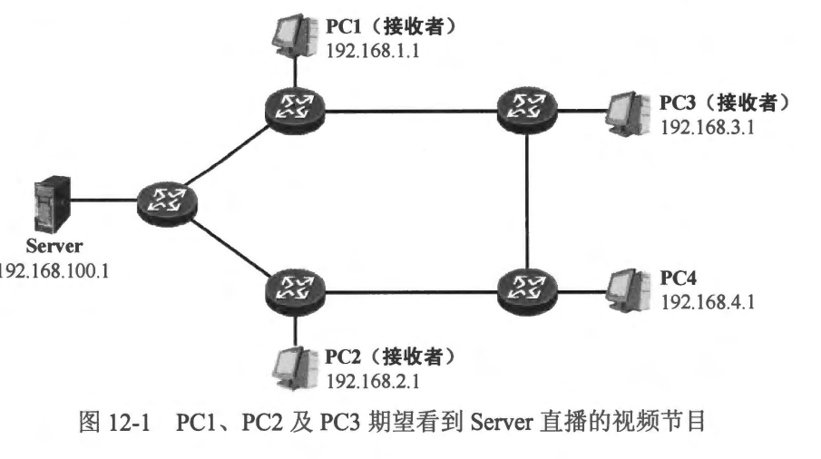
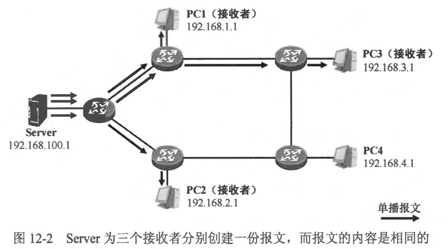
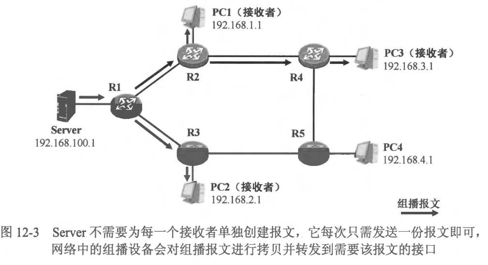
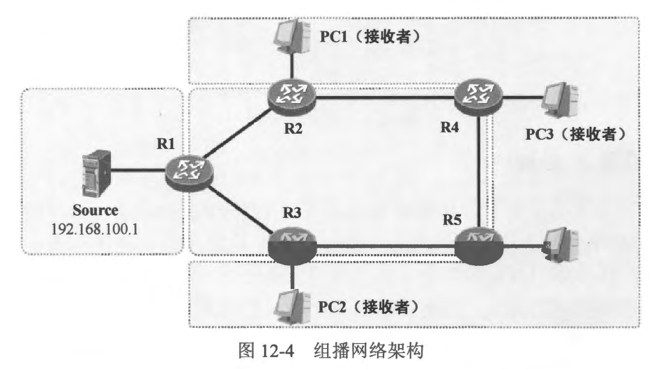
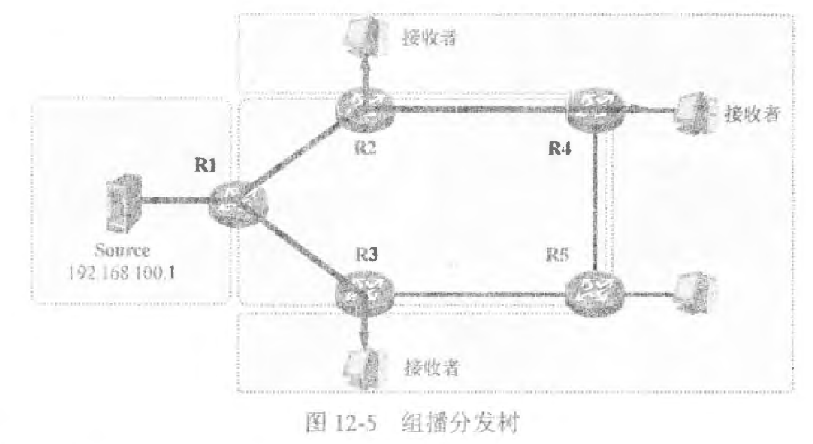
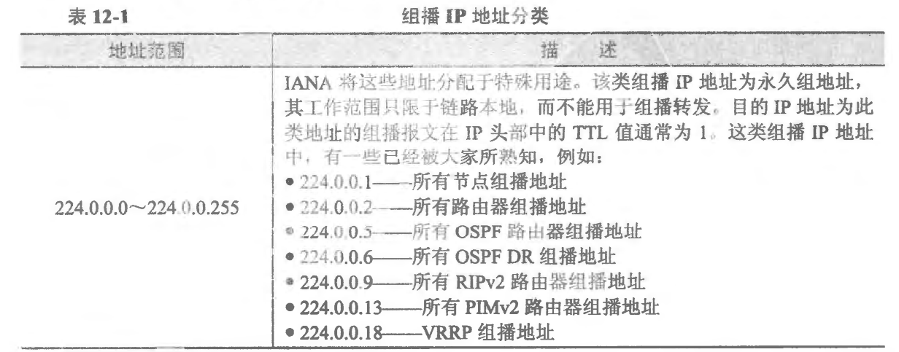
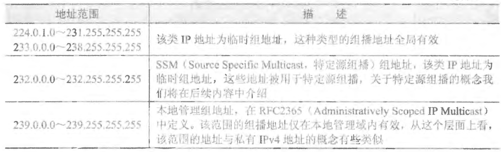
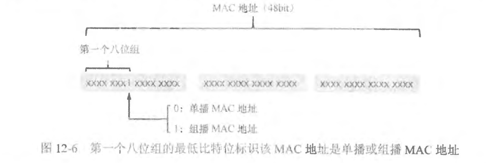
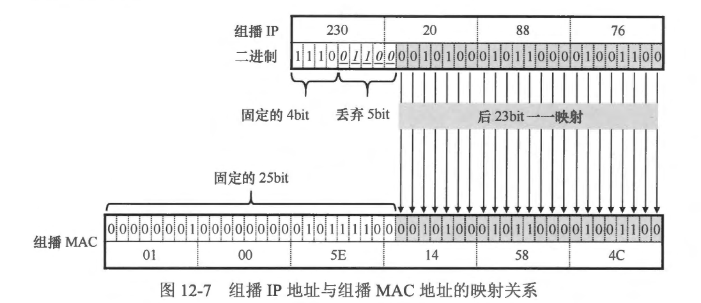
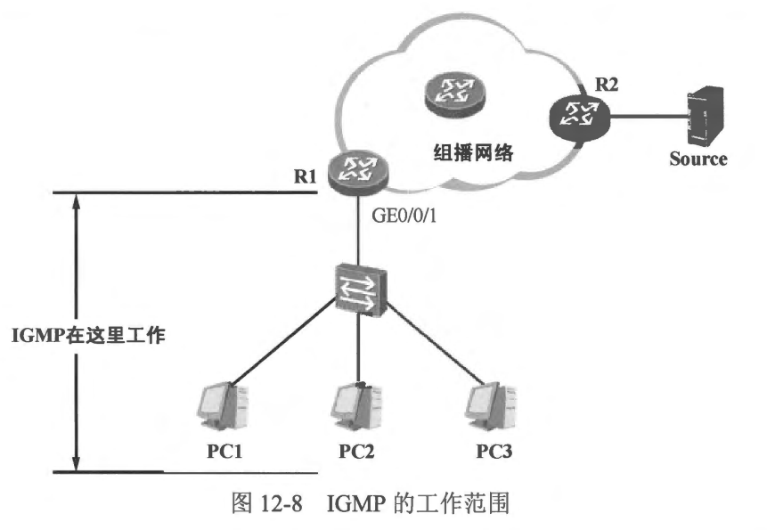

### 组播技术基础

- 在IPv4 网络中，存在着三种通信方式，它们分别是单播、组播以及广播。这三种通信方式各有特点。
- 对于单播通信，相信大家都己经非常熟悉了，毕竟在日常的学习和工作中，这种通信方式大家接触得最多。简单地说，单播通信是一种一对一的通信方式，每个单播报文的目的 IP 地址都是一个单播 IP 地址，并且只会发给一个接收者，而这个接收者也就是该目的 IP 地址的拥有者。
- 对于广播通信大家也并不陌生，以常见的目的IP地址为 255.255.255.255 的广播报文为例，这种类型的报文将被发往同一个广播域中的所有设备，每一个收到广播报文的设备都需要解析该报文，如果设备解析报文后发现自己并不需要该报文(通常情况下，设备至少需将报文解析到传输层头部才能判断自己是否需要该报文)，则会丢弃它。因此从某种层面上看，广播这种通信方式容易对网络造成不必要的资源消耗，正因如此，在 IPV6 中，广播己经被取消，原本由广播实现的能力改用组播来实现。网络中的设备(例如路由器)的三层接口在收到广播报文后通常不会进行转发，也就是说广播流量会终结在设备的三层接口上。
- 组播通信是一种一对多的通信方式，组播报文（目的 IP 地址为组播 IP 地址的报文）发向一组接收者，这些接收者需要加入到相应的组播组中才会收到发往该组播组的报文。针对某个特定的组播组，即使网络中存在多个接收者，对于组播源而言，每次也只需发送一份报文，网络中的组播转发设备负责拷贝组播报文并向有需要的接口转发。一般而言，网络设备在收到组播报文后，缺省并不会对其进行转发，这些设备需要激活组播路由功能，并且维护组播路由表项，然后依据这些表项对组播报文进行合理转发。因此，组播流量的传输，需要一个组播网络来承载。
- 在图 12-1中， Server 是一台多媒体服务器，而 PC1、PC2、PC3 及 PC4 是网络中的主机。现在 Server 开始播放视频，用户期望在 PC1、PC2 及 PC3 上实时收看 Server 所播放的视频。
  
- 这是一种典型的一对多的通信模型。简单地说，在每一个时刻，Server 需要将相同的数据同时发送给多个接收者。如果采用单播的方式来实现上达需求，那么由于网络中存在多个接收者，对于 Server 而言，就需要为每个接收者各创建一份数据，每一份数据都被发往一台单独的 PC（如 图12-2 所示）。设想一下如果网络中存在大规模的接收者，那么Server 就不得不每次都创建大量的数据拷贝，而且每份拷贝的内容是完全相同的，只是目的 IP 地址各不相同，这显然是极其低效的，同时也造成了链路带宽及设备性能的浪费。不仅如此，Server 在发送数据前，还需要明确所有接收者的 IP 地址，否则它将无法构造数据包，而如果用户要求 PC 可以自由地接入或离开，或者 PC 的 IP 地址并不固定，那么显然单播通信在该场景中就不适用了。
  
- 如果 Server 采用广播的方式发送这些数据，那么所有的接收者就不得不与 Server 处在相同的广播域内，因为广播报文在网络中的泛洪范围非常有限。再者从网络优化角度考虑，广播流量又是应该尽可能被减少的，毕竟，这些流量会造成其他设备不必要的性能损耗，因此在这种场景中使用广播通信显然并非最佳方案。
- 接下来看看组播是如何解决这个问题的。当 Server 开始播放视频时，组播报文从 Server 源源不断地被发送出来，无论网络中存在多少接收者，Server 每次都仅需发送一份数据。Server 发出的组播报文的源 IP 地址是192.168.100.1，而目的 IP 地址则是组播 IP 地址（此处以 224.1.1.1 为例）。如图 12-3所示，Server 发送的组播报文到达路由器 R1后，R1 将组播报文进行拷贝，然后将组播报文从有需要的接口转发出去（给 R2 及 R3），至于不需要该报文的接口，路由器是不会向其转发组播报文的。R2 及 R3 收到组播报文后，继续进行拷贝及转发，直到报文到达接收者。只有加入组播组 224.1.1.1 的接收者才会收到这些组播报文。PC1、PC2 及 PC3 需要通过某种机制宣告自己加入组播组 224.1.1.1。组播源并不关心一个组播组中存在多少个接收者，或者这些接收者处于网络中的什么位置、它们的 IP 地址是什么，它只管将组播报文发送出去，组播网络设备负责将组播报文根据需要进行拷贝及转发。在 图12-3 中，没有加入组播组 224.1.1.1 的 PC4 是不会收到组播流量的，事实上 R5 并没有连接任何接收者，因此它自己也不会收到发往该组播组的流量，R3 及 R4 不会将组播流量转发给它。
  
- 组播技术适用于一对多的通信场景，在多媒体直播、在线会议、股票金融等领域有着广泛的应用。
- 本章学习目标:
  - 组播的基本概念
  - 组播网络的架构
  - 组播IP 地址的概念及其特点
  - 组播MAC地址的概念及其与组播IP地址的映射关系

 
 

### 12.1.1 组播网络架构

- 图 12-4 展示了一个典型的组播网络架构，从图中可以直观地看出，整个架构大体上可以分为三个部分。
- 首先有几个角色大家需要了解清楚。

  - 组播源 (Multicast Source)：组播流量的发送源，一个典型例子是多媒体服务器。图 12-4 中，服务器 Source 就是组播源。在典型的组播实现中，组播源不需要激活任何组播协议。
  - 组播接收者 (Multicast Receiver)：期望接收特定组播组流量的终端 PC 或者其他类型的设备，例如图 12-4 中的 PC1、PC2 及 PC3。我们也将组播接收者称为组播组的成员，组播接收者及组播组成员、组成员这些称呼的含义是相同的。只有加入特定组播组的接收者，才会收到发往该组的组播流量。
  - 组播组 (Multicast Group)：采用一个特定的组播 IP 地址标识的群组，例如 239.1.1.1，这个 IP 地址标识了一个组播组，我们可以将其想象成一个电视频道，当您在收看电视时，可能有很多频道（多个组播组，不同的组播组使用不同的组播 IP 地址标识）可以选择，此时您只要通过遥控器调至某一个频道，即可观看该频道的节目，如此一来，您（的电视）就是该频道的组成员之一(同一时间可能有多合电视在收看该频道)，当然，如果您从该频道离开，那么也就不再是其组成员了，便不会再看到这个频道的节目。
  - 组播路由器(Multicast Router)：激活了组播路由功能的路由器。实际上，不仅仅路由器能够支持组播路由，许多交换机、防火墙等产品也支持组播路由，因此路由器在这里仅是一个代表。在组播路由器构成的组播网络中，有两种角色是大家需要额外关注的，其中之一是第一跳路由器(First-hop Router)，在图 12-4 中，R1 就是第一跳路由器。第一跳路由器是直接面对组播源的组播路由器，它将直接从组播源接收组播流量，也就是说，它是组播流量进入组播网络的入口。另一个需要额外关注的角色是最后一跳路由器(Last-hop Router)，如图 12-4中的R2、R3、R4 及R5。最后一跳路由器是直接面对组播接收者的路由器，它除了负责将其从组播网络中收到的组播流量从存在接收者的接口转发出去，同时也负责维护其直连网络中的组成员关系。

  
- 在组播网络架构中，组播源与第一跳组播路由器构成了第一部分。组播源无需运行任何组播协议，只需将组播报文发送出来。组播报文在传输层通常采用 UDP 封装，在网络层采用 IP 封装，在本例中，组播源 Source 发送出来的组播报文的源IP地址为其网卡IP 地址 192.168.100.1（单播 IP 地址），而目的 IP 地址则必须是一个组播 IP 地址。当第一跳路由器 R1 收到这些报文后，该组播报文在网络中的传输也就开始了。
- 第二个部分是由网络中的组播路由器所构成的组播网络。为了能够正确地转发组播报文，路由器需要维护组播路由表。正如单播路由表通过单播路由协议来维护，组播路由表则使用组播路由协议来维护，组播路由协议为路由器贡献组播表项。常见的组播路由协议有PIM、MOSPF、MBGP 等。形象地说，组播路由协议的主要功能之一就是在网络中形成一棵无环的树，它被称为组播分发树(Multicast Distribution Tree)，这棵树便是组播流量的传输路径，而树的末梢就是组播组的接收者所在的网段，如图 12-5 所示。此外，组播路由协议还需关注组播报文转发过程中的防环问题，它必须拥有相应的机制确保组播报文在正确的接口上到达、并从正确的接口转发出去。
- 最后一跳路由器与组播接收者构成了组播网络的第三个部分。在图 12-4中，R2、R3、R4 及R5 作为连接着终端网段的组播路由器，它们需要通过某种机制查询及发现其直连的网段中是否存在组成员。只有当最后一跳路由器获知其直连网段中存在某个组播组的成员时，它才会向该网段转发该组的组播流量，否则，路由器将不会把该组播组的流量转发到这个网段。而对于终端设备（例如本例中的 PC1、PC2 及PC3）而言，如果它们希望收到发往某个组播组的流量，那么它们也需要一种机制，来确保本地网络中的组播路由器 （最后一跳路由器）知晓自己作为组成员的存在。IGMP (Internet GroupManagement Protocol， 因特网组管理协议)便是用于实现上述功能的。

 
 

### 12.1.2 组播 IP 地址

- 对于一个单播报文而言，其源 IP 地址是报文发送方的 IP 地址，而目的 IP 地址则是报文接收方的 IP 地址，这两个地址必须都是单播 IP 地址: (Unicast TP Address )。单播 IP 地址，是唯一地标识一合设备的 IP 地址。单播主要用于一对-的通信场景，一个单播报文被发往一个明确的目的地：然而组播则不同，一个组播报文是被发给某个组播组的所有接收者的，组播报文的源卫地址白然是组播源的 IP 地址，这毫无疑问是一个单播 IP 地址，然而报文的目的 IP 地址呢？我们该如何标识一组接收者？
- 在IPv4 地址空间中，A、B 及 C 类 IP 地址用于单播通信，它们可以被分配给一台设备的某个接口。组播报文的目的 IP 地址当然不能是A、B及C类 IP 地址，因为它被发往一组接收者，IANA (Internet Aosigned Nuunbers Authority，互联网数字分配机构)规定D类 IPv4 空间 224.0.0.0/4 用于组播通信，D类 IP 地址空间包含的地址范围是 224.0.0.0 到 239.255.255.255，D类环地址也就是組播 IP 地址 (Muiticast IP Address )。组播 IP 地址用干标识一组接收者。
- 与A、B 及C 类 IP 地址不同，D类 IP 地址不能作为源 IP 地址使用，只能作为目的 IP 地址使用，换句话说，我们不能将组播 IP 地址分配给一台设备的任何接口。另外，D类 IP 地址是不能进行子网划分的。IANA 对组播 IP 地址空间进行了进一-步的划分，几种主要的组播 IP 地址分类见表 12-1。

 
 

### 组播 MAC 地址

- 一个应用层协议产生的数据载荷要想被正确地发送到目的地，需要增加相应的封装。在传输层，如果该应用基于 UDP 协议，那么数据载荷需要被封装一个 UDP 头部，然后交由网络层的IP 协议模块处型：在 IP 层，上层数据被封裝一个 IP 头部。对于单播报文而言，其 IP 头部中写入的目的 IP 地址是目的设备的单播 IP 地址，而对于组播报文而言，报文的目的 IP 地址即为组播组的 IP 地址。接下来，在数据链路层，上层数据需要再增加一层封装，在以太网环境中，它特被封裝以太网的帧头及帧尾。
- 对于以太网单播帧而言，帧头中写入的目的 MAC 地址是该帧在链路层面上的目的设备的 MAC 地址，该目的 MAC 地址必定是一个单播MAC 地址，这个地址属于唯一的设备。广播数据帧的目的 MAC 地址为广播地址（ffff-ffff-ffff），这些数据帧被发往同一个广播域内的所有设备。而组播数据帧是发往一组按收者的，其目的 MAC 地址必领是组播 MAC 地址。
- 综上所述，MAC 地址存在三种类型，它们分别是单播 MAC 地址、组播 MAC 地址以及广播 MAC地址。一个 MAC 地址共计 48bit，世就是 6 个八位组，其中第一个八位组的最低比特位标识了该 MAC 地址的类型，如果该比特位为0，那么意味者这是一个单播 MAC地址，如果为 1 则是 组播MAC 地址（如图 12-6所示），而广播 MAC 地址是一个特殊的组播 MAC 地址。因此实际上组播 MAC 地址共有 $2^47$个，占据了整个MAC地址空间的一半。
  
- 对于组播 MAC 地址，相信大家井不会太阳生，BPDU 载荷被直接封装在以太网数据顿中，并且数据帧的目的 MAC 地址为 0180-c200-0000，这就是一个组播 MAC 地址，类似这样的例子还有很多，此处不再一一列举，这些组播MAC 地址并不与组播 IP 地址存在关联。除此之外，还有一类組播 MAC 地址是需要格外关注的，那就是与组播 IP 地址存在映射关系的组播 MAC 地址。
- 正如上文所述，在以太网环境中，组播 IP 报文需被封装成以太网数据帧以便在链路上传输，而这些数据帧的目的 MAC 地址必须是组播 MAC 地址，并且必须与该报文的组播目的IP地址相对应。与组播IPv4 地址相对应的组播MAC 地址的高 25bit 是固定的（其中高24bit 是 0x01005e， 第25个比特位为0），而剩余的 23bit 则从其对应的组播 IPv4地址的低 23bit 拷贝得来，因此与组播 IPv4 地址相对应的组播 MAC 地址的范围是 0100-5e00-0000 至 0100-5e7f-fff，这是整个组播 MAC 地址空问的一个子集。
- **注意: 与组播 IPV6 地址相对应的组播MAC 地址的高 16bit 是固定的 33-33，剩余的 32bit从对应的IPV6 地址的低32bit 拷贝而来。**
- 图 12-7 展示了一个组播 IP 地址 230.20.88.76 对应的组播 MAC 地址该如何计算的示例。首先将该 IP 地址换算成二进制格式，然后将其低 23bit 拷贝到 MAC 地址的低 23bit 而 MAC 地址的高 25bit 是固定的，这就得到了组播 IP 地址 230.20.88.76 对应的组播 MAC地址：0100-5e14-584c。

- 值得注意的是，由于组播 IP 地址的前 4bit 是固定的 “1110”，而其最后 23bit 被拷贝到对应的组播 MAC 地址中，因此组播 IP 地址中有 5bit 没有被映射到组播MAC 地址，这样就存在每25个组播正 地址共享一个组播 MAC 地址的现象，这个现象在某些场景下可能对网络造成影响，因此网络管理员在进行组播网络设计的时候需考虑到这一点。细心的读者可能会问：组播 IP 地址与组播 MAC 地址的映射关系为何不设计成----对应关系？感兴趣的读者不妨用 “IP 组播为什么只有 23 位是映射的”为输入条件到网上去搜索一下，相信一定会得到满意的答案。

 
 

### IGMP 概述

- 在组播网络中，最后一跳路由器与组播接收者之间运行着一个非常重要的协议IGMP (Internet Group Management Protocol， 因特网组管理协议)，IGMP 主要实现以下几个功能。
  - 最后一跳路由器通过 IGMP 报文向其直连的终端网络进行查询，以便发现该网络中的组播组的成员。例如图 12-8 中所示,R1 的 GE0/0/1 接口直连着一个终端网络，在其 GE0/0/1 接口激活 IGMP 后，它会通过接口所发送的 IGMP 报文查询该终端网络中是否存在组播组成员。R1 会维护一个 IGMP 组表，在其中陈列出已经发现了组成员的组播组。缺省情况下，路由器不会向该终端网络转发组播流量，除非它在该网络中发现了组播组成员。
    
  - 终端设备使用 IGMP 报文宣布自己成为某个组播组的成员。在图 12-8 中，假设 PC3 期望加入组播 239.1.1.1，那么它将向网络中发送一个 IGMP 报文，以便宣告自己加组，R1 將在其 GE0/0/1 接口上收到这个报文并发现 PC3 的加组行为。
- IGMP 报文采用 IP 封装，IP 头部中的协议号为 2，而且 TTL 字段值通常为 1，这使得 IGMP 报文只在本地网段内传播。截止目前，IGMP 一共有三个版本。
  - IGMPv1，在RFC 1112 (Host Extensions for IP Multicasting)中定义。
  - IGMPv2, 在RFC 2236 (Internet Group Management Protocol, Version 2)中定义.
  - IGMPv3, 在RFC 3376 (Internet Group Management Protocol, Version 3)中定义.
- IGMPv1 是一个相对老旧的版本，它只定义了基本的组成员查询及组成员关系报告机制。IGMPV2 在 IGMPV1 的基础上做了一些改进，其中包括定义了组成员离开机制、支持特定组播组查询以及定义了查询器选举机制等。IGMPv3 在之前的版本基础上增加了组成员对特定组播源的限制功能，另外，IGMPV3 也是 SSM (Source-Specific Multicast,特定源组播)的重要组件之一。高版本的 IGMP 具有向前兼容性。在后续的内容中，我们将分别为大家介绍 IGMP 的这三个版本。
