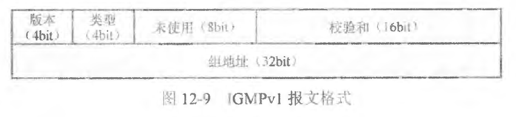
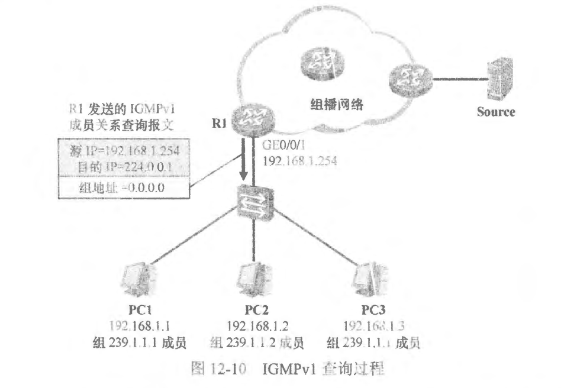
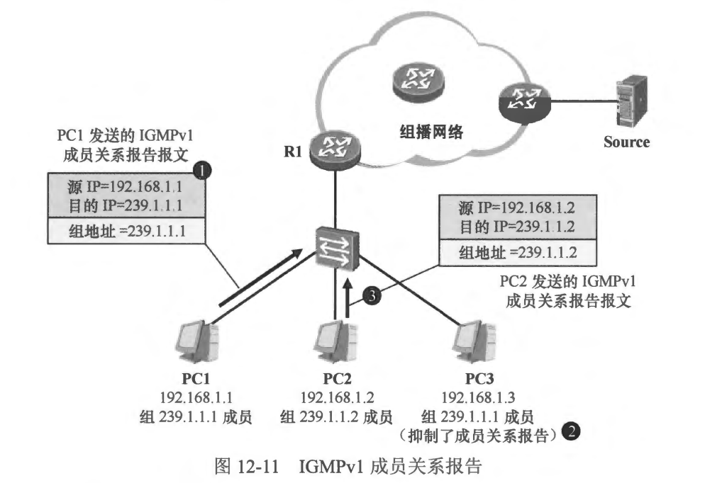
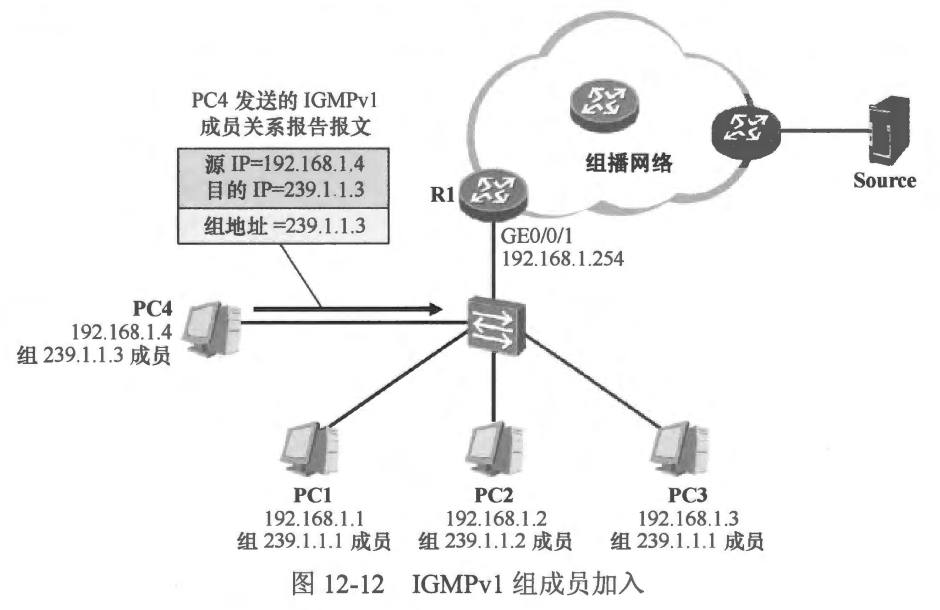
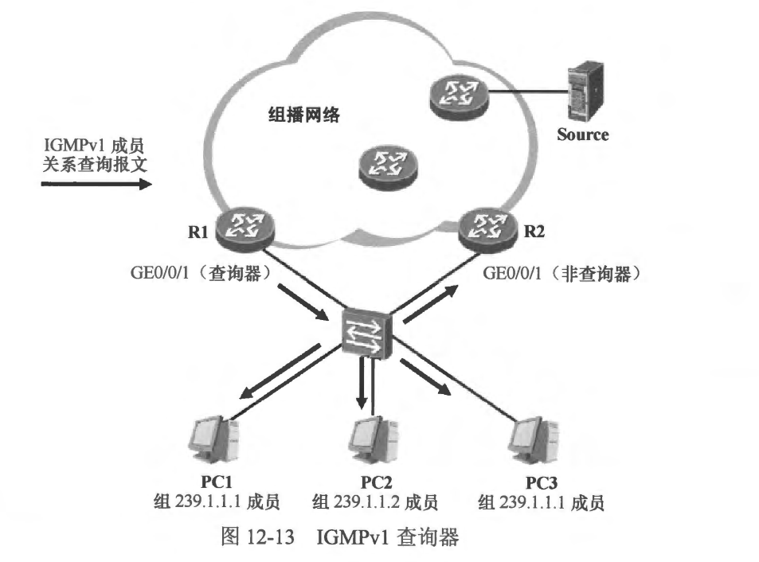

### IGMPV1

### 12.2.1 报文类型
- IGMPv1 定义了两种报文。
  - 成员关系查询 (Membership Query): IGMP 查询器使用该报文向直连网段选行查询，以便确认该网段中是杏存在组播组成员。成员关系查询报文的目的 IP 地址是224.0.0.1〈所有节点組播地址）。
  - **说明：IGMP 查询器指的是在一个网段中执行 IGMP 查询操作的最后一跳路由器。在一个网段中可能同一时间接入了多台最后一跳路由器，并且这些路由器都在接口上激活了IGMP，此时只有其中的一台路由器会成为该网段的 IGMP 查询器，并在该网段中执行查询操作。**
  - 成员关系报告 (Membership Report):组播红成员收到路由器发送的成员关素查询报文后，会以成员关茶报告报文进行国应，以便告知路由器自己所加入的组播组。当然，新加入组播组的成员无需等待路由器的成员关系查询报文，可以直接发送成员关系报告报文以宣告自己加组。成员关系报告报文的目的 IP 地址是主机期望加入的组播组的 IP 地址，而且报文载荷中的 “组地址〞字段也记录了该组播组的 IP 地址。
  - IGMPv1 的报文格式如图12-9所示。
  
  - 各字段的含义如下。
    - 版本 (Version)：对于IGMPv1，该字段恒为 1。
    - 类型 (Type)：指示了该 IGMPv1 报文的类型。对于成员关系查询报文，该字段的值为1：对于成员关系报告报文，该学段的值为2。
    - 校验和(Checksum)：校验和。
    - 組地址(Group Address)：对于 IGMPV1 成员关系查询披文，该字段的值被设置为 0.0.0.0：对于IGMPV1 成员关系报告报文，该字段的值被设置为主机所加入的组播组地址。
  
   
   

### 12.2.2 IGMPv1 查询及响应
- 在 图12-10中，PC1、PC2、PC3 以及 R1 连按到了同一台二层交换机，并且都属于相同的 VLAN，使用相同的 IP 网段。现在 R1 的 GE0/0/1 接口激活了 IGMPv1。 PC1 及 PC3 是组播组 239.1.1.1 的成员，而PC2 是组播组 239.1.1.2的成员。R1激活 IGMPv1 后，它将在 GE0/0/ 接口上周期性地(缺省以60秒为周期)发送 IGMPV1 成员关系查询报文，该报文的目的 IP 地址是 224.0.0.1 （所有节点组播地址），并且报文中“组地址” 字段的值为 0.0.0.0，该查询面问所有组播组。R1 发送的 IGMPV1 成员关系查询报文到达交换机后，会被后者进行泛洪，因此 PC1、PC2 及PC3 都会收到该报文。
- 为了使自己能够正常地收到组播流量，组成员收到 IGMPV1 成员关系查询报文后需要使用 IGMPv1 成员关系报告报文进行回应，以便刷新 IGMP 路由器的相关表项。然而当网段中同一个组播组存在多个成员时：如果所有的成员都使用成员关系报告回应该查询，那么将会产生多余的 IGMP 流量。其实在一个组播组中只需要一个组成员对成员关系查询进行回应即可，毕竟 ICMP 路由器只需要知道直连网段中存在某个组播组的成员，而至于存在多少个组成员，它并不关心。IGMP 考虑到了这个问题，并且给出了解决方案。

- 在本例中，连接在交换机上的 PC 都会收到 R1 发送的 IGMPV1 成员关系查询报文，所有的 PC 都会在本地启动一个报告延迟计时器( Report Delay Timer )，计时器的值被设置为 0 至 10 秒之间的一个随机数，当该计时器超时的时候，PC 便立即发送 IGMPv1 成员关系报告报文。假设 PC1 的计时器率先超时，那么它将立即发送IGMPV1 成员关系报告报文，这个报文的目的 IP 地址是 239.1.1.1,也就是其加入的组播组的 IP 地址(如图12-11所示)，这个组播报文被封装成帧并发往交换机，交换机将这个数据帧进行泛洪，R1 及其他 PC 都会收到该帧。
- R1 收到这个 IGMP 报文后，了解到其 GE0/0/1 接口上存在组播组 239.1.1.1 的成员，于是它将维护相关 IGMP 组表项及 IGMP 路由表项，当它收到发往 239.i.1.1的组播流量后，便将这些组播流量从该接口转发出去。
- 另一方面，当 PC3 收到 PC1 发送的 IGMPv1 成员关系报吉报文后（此时它的报告延迟计时器并未超时），发现后者所加入的组播组与自己相同，于是它将抑制自己的成员关系报告，如此即可减少网络中多余的 IGMP 流量。
- PC2 加入的组播组是 239.1.1.2，与 PC1 不在同一个组，因此它的计时器超时后，将自行发送成员关系报告报文，该报文的目的 IP 地址是 239.1.1.2。路由器收到该报文后，了解到接口 GE0/0/1 上还存在着另一个组播组 239.1.1.2 的成员，因此当其收到发往该組播组的流量时，便会将流量从该接口转发出去。

 
 

### 12.2.3 1GMPv1 组成员加入
- 当网络中某个 PC 想要加入某个组播组时，它无需等待路由器的成员关系查询，可以直接发送成员关系报告。如图 12-12 所示，PC4 新接入到该网络中，此时它加入了组播组 239.1.1.3，它将直接发送 IGMPv1 成员关系报告报文，该报文的目的 IP 地址为 239.1.1.3。路由器 R1 收到这个报文后，了解到其 GE 0/0/1 接口的直连网段中出现了组239.1.1.3 的成员，于是它将维护相关 IGMP 组表项及 IGMP 路由表项，当它收到发往239.1.1.3 的组播流量时，便会將这些流量转发到该网络中。

 
 

### 12.2.4 1GMPv1 组成员离开
- IGMPV1 并没有明确定义组成员离开组播组的机制，当组成员离开组播组时，它只是简单地不再回应成员关系查询，因此我们也常说，在IGMPv1 中，组成员是“默默”地离开的。
- 在图 12-12 中，当 PC1 离开组播组 239.1.1.1 后，它将对 R1 发送的 IGMPV1 成员关系查询报文不再回应。然而由于组播组 239.1.1.1 中还存在着组成员 PC3，而 PC3 会对该查询进行回应，因此 PC1 的离开并不会对网络产生实质性的影响。而当 PC3 也离开组播组时，该网络中將不会再有 239.1.1.1 的组成员回应 R1 的成员关系查询，因此 R1 将在一定时间(缺省 130 秒)后认为该网络中不再存在组 239.1.1.1 的成员，因此不会再向该网络转发组播组 239.1.1.1的流量。

 
 

### 12.2.5 IGMPv1 查询器
- 设想一下，如果在同一个网段中连接着多合组播路由器，并且这些路由器都在接入该网段的接口上激活 IGMPv1，且都向该网段发送 IGMPV1 成员关系查询报文，这显然会增加网络中的多余 IGMP 流量。在 IGMP 中，查询器(Querier)负 责在网段中发送 IGMP 查询报文，而非查询器则不会发送。
- 如图 12-13 所示，R1 及R2 这两台最后一跳组播路由器都在各自的 GE0/0/1 接口上激活了 IGMPv1，它们会进行竞争，胜出的路由器(的接口）将成为该网段的IGMP 查询器。假设 R1 胜出，那么 R1 将以缺省 60 秒为周期，向该网段发送 IGMPv1 成员关系查询报文，而 R2 则不会发送这些报文，它只是默默地在一旁侦听 R1 发送的 IGMPv1 成员关系查询报文，当 R1 发生故障时，R2 可随时接替其工作。

- 实际上 IGMPv1 并没有定义查询器的选举机制，它只能求助于 PIM (Protocol Independent Multicast， 协议无关组播)这样的组播路由协议，在本例中，如果 R1 及 R2 的 GE0/0/1 接口除了激活了 IGMPV1,还激活了 PIM，那么 PIM 选举产生的 DR(Designated Router，指定路由器)將充当IGMPv1 的查询器。