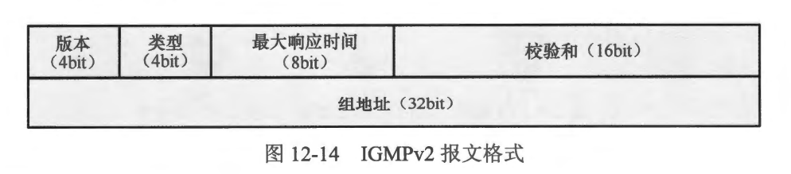
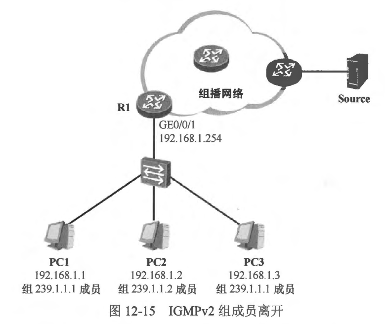
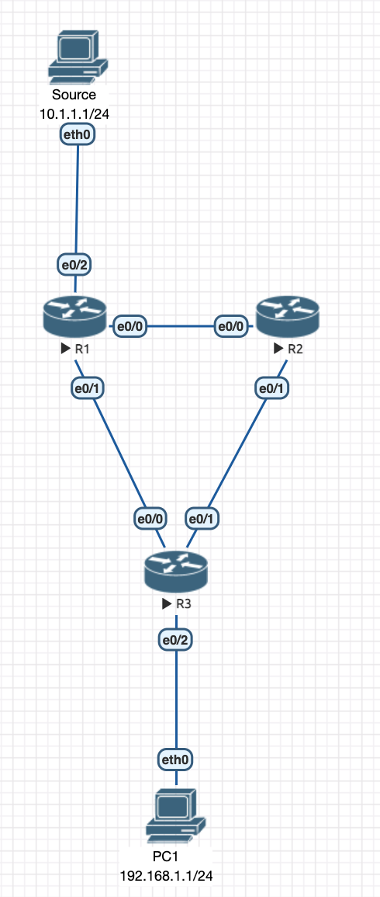
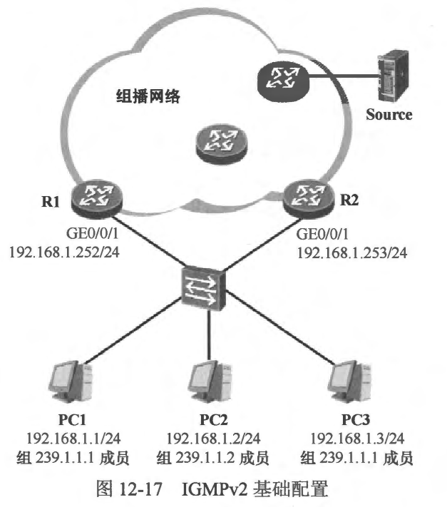

### IGMPV2

### 12.3.1 报文类型
- 在IGMPv2 中，一共有四种报文。
- 成员关系查询 (Membership Query )
  - IGMPv2 定义了两种成员关系查询报文的子类型: 常规查询(General Query)报文及特定组查询 （Group-Specific Query）报文。
    - 常规查询：IGMP 查询器使用该报文向直连网段进行查询，以确认该网段中是否存在组播组成员。由于该报文查询的是所有组播组，因此也被称为普遍组查询报文。常规查询报文的目的卫地址为 224.0.0.1。
    - 特定组查询: 运行 IGMPv2 的主机在离开其所加入的组播组时，会主动发送一个IGMPv2 离组报文，用于宣告自己离开组播组，当网络中的查询器收到这个离组报文后，需要确认该组播组中是否存在其他成员，此时该查询器便会发送特定组查询报文，该报文只针对特定的组播组进行查询，报文的目的卫地址为其所查询的组播组地址，而且报文载荷中的“组地址” 字段也记录了这个组播组地址。
- 成员关系报告 (Membership Report )
  - 当主机加入组播组时，或者当其收到查询器发送的常规查询报文时，主机将发送成员关系报告报文，该报文的目的卫地址是主机所加入的组播组地址，而且报文载荷中的“组地址〞 宇段也记录了该组播组地址。
- 离组 (Leave Group)
  - IGMPv2 在IGMPV1 的基础上增加了离组报文，当主机离开其所加入的组播组时，便会主动发送离组报文。离组报文的目的 IP地址为 224.0.0.2，报文载荷中的“组地址”字段记录了主机所要离开的组播组地址。
- 版本1成员关系报告 (Versionl Membership Report)
  - 该报文用于兼容IGMPV1。
  - 图 12-14 显示了IGMPv2 的报文格式，留意到在 IGMPv1 报文中未被使用的 8bit,在 IGMPv2 中被重新定义了。
  
- 各字段的含义如下。
  - 类型 (Type): 对于成员关系查询报文，该字段的值为 0x11；对于成员关系报告(IGMPv2）报文，该字段值为 0x16；对于离组报文，该宇段值为 0x17；对于版本1 成员关系报告报文，该字段值为 0x12。
  - 校验和 (Checksum)：校验和。
  - 最大响应时间 (Max Response Time)：该字段指的是主机使用成员关系报告来响应该成员关系查询报文的最长等待时间。该字段只在成员关系查询报文中被设置，在其他 IGMPv2 报文中被设置为0。
  - 组地址(Group Address)：对于常规查询报文，该字段值被设置为 0.0.0.0；对于特定组查询报文，该字段值被设置为所查询的特定组播组的 IP 地址。对于离组报文，该宇段的值被设置为主机离开的组播组的 IP 地址。

<br>
<br>

### 12.3.2 IGMPv2 查询及响应
- IGMPv2 的查询与响应机制与 IGMPv1 大体相同。首先，IGMPv2 定义了协议自己的查询器选举机制，而不再像IGMPv1 那样，需要依赖组播路由协议进行查询器的选举。
- 另外，在IGMPV1中，我们已经探讨了成员关系报告的抑制机制，这个机制的存在减少了网络中多余的 IGMP 流量。IGMPv2 的成员关系报告抑制机制与IGMPV1 有一点细微的差异。IGMPv2 增加了最大响应时间 （Max Response Time）参数，这是一个可配置的值，通过该值，可以调节组成员响应查询的速度。查询器发送的IGMPv2 常规查询报文中所携带的最大响应时问缺省为 10秒(可在接口视图下，使用 ```ip igmp max-response-time <time-in-seconds> ```命令修改该时间值），当主机收到该报文时，会读取该报文中的“最大响应时间”字段的值，并启动一个报告延迟计时器，该计时器的时间被设置为一个随机数，取值范围是0～最大响应时间。当该计时器超时的时候，主机便立即发送成员关系报告，当然，如果在此之前，主机收到了同一个组播组内的其他成员发送的成员关系报告，则会抑制自己的报告。

<br>
<br>

### 12.3.3 1GMPv2 组成员离开
- IGMPv2 定义了组播组成员的离开机制。与 IGMPv1 组成员的默默离开不同，在 IGMPV2 中，组成员离开组播组时，会主动发送 IGMPV2 离组报文。在图12-15中，我们首先了解 PC1 离开组播组 239.1.1.1 时的情况。
  - PC1 离开组播组 239.1.1.1，它将发送一个IGMPv2 离组报文，该报文的目的 IP 地址是 224.0.0.2(所有路由器组播地址），报文中的“组地址”字段的值被设置为 239.1.1.1。
  - R1收到了这个离组报文后，得知有组成员要离开组播组 239.1.1.1，于是它立即针对该组发送IGMPv2 特定组查询报文，以确认该组播组中是否还有其他成员。如果在很短的时间内没有主机回应该查询，则R1 将再次发送一个IGMPv2 特定组查询报文。
  - **说明:R1缺省以1秒为间隔发送特定组查询报文，一共发送2次(发送时间间隔及发送次数均是可配置的）。**
- 值得一提的是，为了让可能存在的组成员尽快响应该特定组查询报文，路由器将该报文中的最大响应时间设置成上文提及的发送间隔时间（缺省为 1秒）。

  - PC3 收到了 R1 发送的 IGMPv2 特定组查询报文后，它发现 R1 正在查询的就是自己所加入的组播组，因此它立即发送一个 IGMPv2 组成员关系报告报文用于通告自己的存在。
  - R1 收到了 PC3 发送的组成员关系报告后，便知道了组播组 239.1.1.1 中还存在着其他成员，因此它将继续维护该组的成员关系，并继续向该网段转发 239.1.1.1 的组播流量。
- 再来看看 PC2 离开组播组239.1.1.2 时的情况。
  - PC2 发送一个IGMPv2 离组报文。
  - R1 收到了这个离组报文后，得知有组成员要离开组播组 239.1.1.2，于是它立即针对该组发送IGMPv2 特定组查询报文。
  - 由于组播组 239.1.1.2 中己经没有其他组员了，因此不会有任何 PC 对 R1 发送的特定组查询报文进行回应，在一段时间后，R1 将认为该网段中组播组 239.1.1.2 已经不存在任何成员了，因此它将不再向该网段转发 239.1.1.2 的组播流量。

### 12.3.4 IGMPv2 查询器
- 如果一个网段中存在多合最后一跳路由器，这些路由器都在其接入该网段的接口上激活 IGMP，并且都向该网段发送查询报文，那就显得非常多余，这种情况下 IGMP 会在这些路由器(的接口）中选举出一合查询器（Querier），由查询器负责在这个网段中执行查询操作。IGMPv1 没有定义查询器的选举机制，而 IGMPv2 则定义了查询器的选举机制：接口IP地址最小的路由器成为该网段的 IGMPv2 查询器，它将负责向这个网段执行查询操作。
- 在图12-16中，R1 及 R2 都是最后一跳路由器，两者都在各自的 GE0/0/1 接口上激活了 IGMPv2。在初始情况下，双方都认为自己是 GE0/0/1 接口所直连的网段的IGMPv2查询器，因此都向该网段发送 IGMPv2 常规查询报文。R1 及 R2 都会收到对方发送的常规查询报文，它们将报文的源 IP 地址与自己的接口 IP 地址进行比较，由于 R1 的接口IP 地址更小，因此在本例中 R1 胜出成为查询器，而 R2 则是非查询器 (Non-Querier)。 R1 的 GE0/0/1 接口继续周期性地发送常规查询报文,而R2则停止发送。
- 非查询器会为当前的查询器启动一个其他查询器存活计时器 (Other QuerierPresent Timer )，该计时器的时间缺省为 125秒，可在全局模式下使用 ```ip igmp query-interval <秒数>``` 命令修改。每次收到查询器发送的查询报文时，该计时器将被重置。而如果长时间没有收到查询器发送的查询报文并导致该计时器超时，那么非查询器将认为当前的查询器已经发生故障，此时新一轮查询器的选举过程将被触发。



<br>
<br>

### 案例1: IGMPv2基础配置
- 在图 12-17 中，我们将在R1 及R2 的GE0/0/1 接口上激活 IGMPv2。



### 案例2: 配置静态组播组
- 考虑这样一种场景：组播路由器的某个接口连接着一个终端网络，在该网络中存在某个组播组的、稳定的组成员，如果我们希望组播路由器能够持续地转发该组播组的流量到这个接口，那么就可以在路由器上进行静态组播组的配置。
- 在路由器上配置静态组播组还能解决接口所连接的终端无法通过 IGMP 成员关系报告宣布加组但是又需要接收组播流量的问题