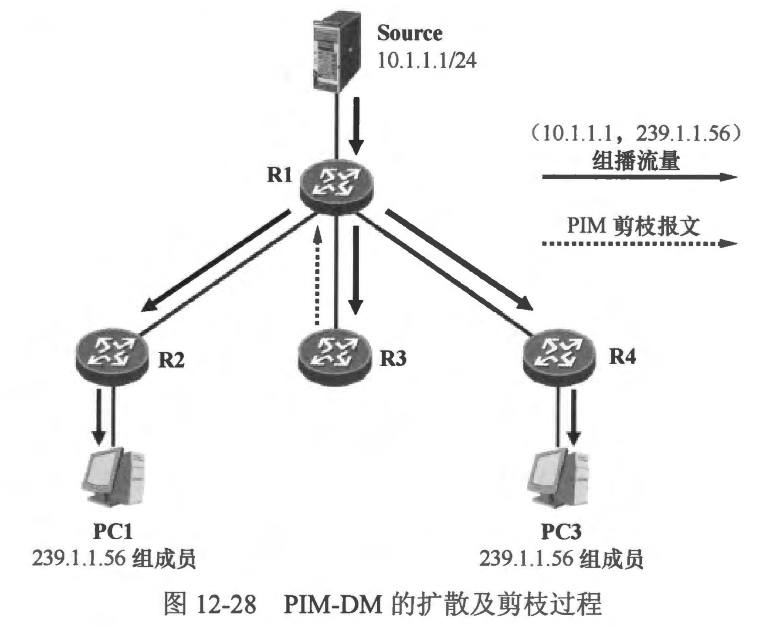
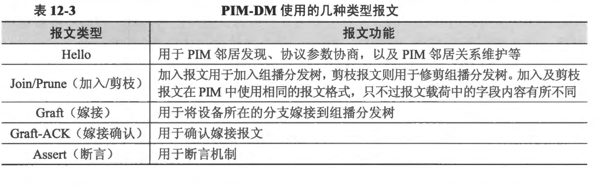
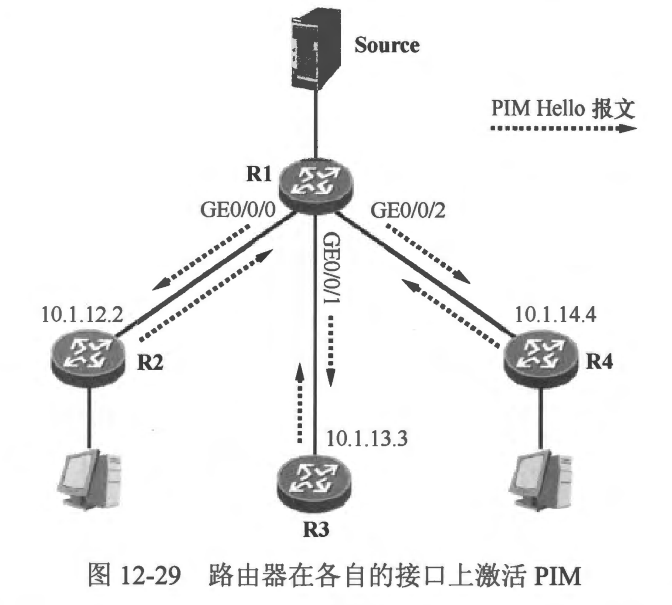
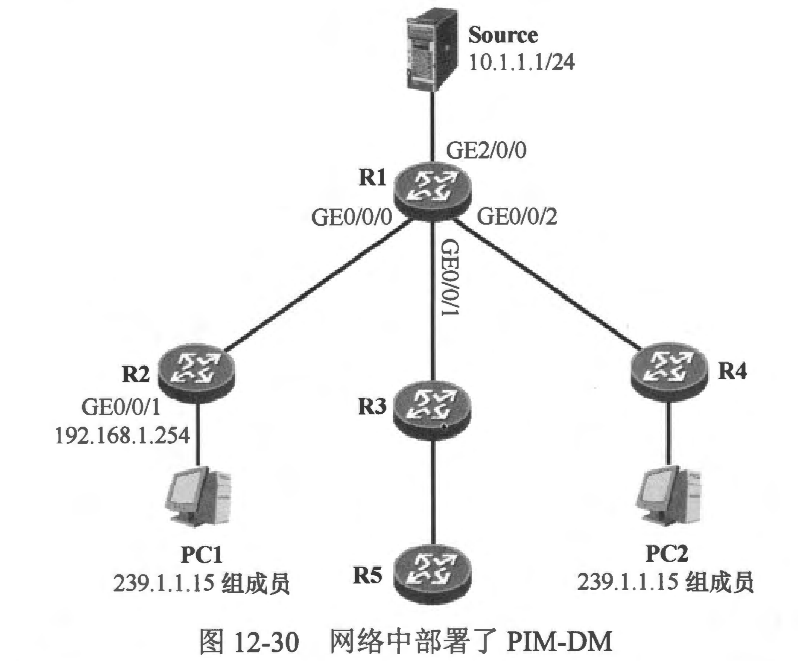
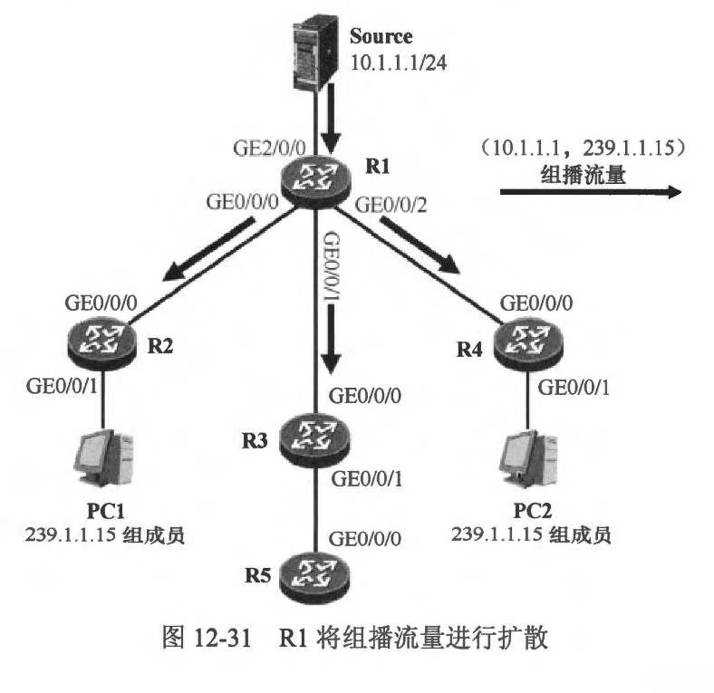
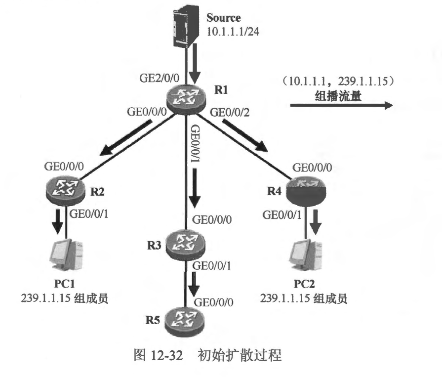

### PIM-DM
- PIM-DM (PIM Dense Mode)是 PIM 的密集模式，它适用于组播接收者较为密集的紧凑型网络。PIM-DM 开始工作后，假定网络中的每一个分支均存在组播接收者，因此当源开始发送组播流量后，组播流量首先被扩散(Flood)到全网各个分支，此时 PIM-DM 所形成的组播分发树 （PIM-DM 使用的组播分发树是SPT）将覆盖全网。完成组播流量的全网扩散后，存在组播接收者的分支自然会立即收到所需的组播流量，然而网络中也很可能存在没有任何接收者的分支，它们对这些组播流量并不感兴趣，此时不需要这些组播流量的网络设备采用一种剪枝（Prune）的方式将自己从组播分发树上剪除。
- 在图 12-28 中，全网的路由器都激活了 PIM-DM。当组播源 Source 开始向组播组 239.1.1.56 发送组播流量时，R1 作为第一跳路由器将率先收到组播流量，由于 R1 运行的是 PIM-DM，因此在确定组播流量从朝向源的上游接口(RPF 接口)收到后，它将组播流量从所有存在 PIM 邻居的接口（除了上游接口）转发出去。R2、R3及R4 都将收到 R1 转发的 （10.1.1.1，239.1.1.56）组播流量。这些路由器收到组播流量后，也都执行 RPF 检查，检查通过后继续向下游转发。这就是 PIM-DM 的扩散过程。初始时 PIM-DM 将组播流量“粗犷”地扩散到网络中的各个角落。然而 R3 并不需要这些组播流量，因此它将发起一个剪枝过程，将自己从 SPT 上剪除。

- PIM-DM 的另一个重要的工作机制是嫁接（Graft），在本例中，如果 R3 下联了一个网络，并且网络中出现了 239.1.1.56 的组成员，那么它将立即发起一个嫁接过程，将自己所在的分支嫁接到 SPT 上，从而获得组播流量。
- 从以上的描述可以看出，PIM-DM 的操作是比较粗犷的，这个特点使得 PM-DM 只能用于一些小规模的、组播接收者分布比较密集的组播网络。
- 本节学习内容:
  - 了解PIM-DM 的特点及适用的网络场景
  - 掌握 PIM-DM 的基础工作机制: 扩散过程、剪枝过程、嫁接过程以及断言机制等
  - 掌握 PIM-DM 的基础配置

<br>
<br>

### 12.6.1 协议报文
- PIM 的协议报文直接采用卫封装，在I报文头部中协议号字段的值为 103。PIM-DM 及 PIM-SM 使用的协议报文类型有所不同。对于 PIM-DM 而言，使用表 12-3 罗列的几种类型的报文。


<br>
<br>

### 12.6.2 邻居关系
- 当路由器的接口激活了 PIM 后，该接口便开始周期性地发送 PIM Hello 报文，报文的源 IP 地址为路由器的接口 IP 地址，而目的 IP 地址是组播IP地址 224.0.0.13（所有 PIMv2 路由器组播地址）。缺省时，Hello 报文的发送间隔是30 秒，该时间间隔可以通过 ```ip pim hello-interval <seconds>``` 命令修改，这条命令可以在接口视图或 PIM 视图下配置，如果两者同时配置，那么以接口视图下所配置的值为准。
- 路由器通过 Hello 报文发现直连链路上的 PIM 邻居，也依赖 Hello 报文维持 PIM 邻居关系。此外，PIM 的DR 选举也是依赖 Hello 报文的交互来完成的。
- 当路由器通过 Hello 报文发现了一个 PIM 邻居后，会为该邻居启动一个计时器，该计时器的时间设置为对方的 Hello 报文中所携带的 Holdtime（缺省为 105 秒），如果在计时器超时之前再次收到了该邻居发送的 Hello报文，则刷新该计时器，如果一直未收到邻居的 Hello 报文，导致该计时器超时，则该邻居将立即被删除。
- **说明: Holdtime指的是路由器等待接收其PIM 邻居发送Hello报文的超时时间。**
- 使用 ```ip pim <interface> hello-interval <seconds> holdtime <seconds>``` 命令，可修改 Hello 报文中的 Holdtime。命令同样可以在接口视图或 PIM 视图下配置，如果两者同时配置，那么以接口视图下所配置的值为准。
- 在图12-29 中，路由器都在各自的接口上激活了 PIM。以 R1 为例，它将在 GE0/0/0、GE0/0/1 及 GE0/0/2 接口上分别发现 PIM 邻居 R2、 R3 及 R4。

- 使用```show ip pim neighbor```命令可以查看 PIM 邻居表
```shell
```

<br>
<br>

### 12.6.3 扩散过程
- 接下来详细地分析一下 PIM-DM 的扩散过程。在 图12-30 所示的网络中，我们首先在每台路由器上部署了 OSPF，使得它们都能够通过 OSPF 学习到去往全网各个网段的路由，随后又在每合路由器的相关接口上激活了 PIM-DM。R2 及 R4 都在其连接终端网段的接口上激活了 IGMPv2。

- PC1 及 PC2 是组播组 239.1.1.15 的成员，它们通过发送 IGMPv2 成员关系报告宣告自己加入该组播组。R2 及 R4 将分别收到 PC1 及PC2 发送的IGMP 报文并创建相关 IGMP组表项及IGMP路由表项。
- 以R2 为例，它将维护如下组播路由表项:
```shell
```
- 现在一切都已经准备就绪。当组播源 Source 开始向组播组 239.1.1.15 发送组播流量时，组播流量的扩散过程就开始了。
  - Source 开始向组播组 239.1.1.15 发送组播流量，这些组播流量其实就是大量的组播报文。以多媒体直播为例，Source 通过软件直播多媒体影像，影像内容被软件编码并在 Source 的网卡上形成一个个组播报文。组播报文大多采用 UDP 封装。在本例中，Source 所产生的组播报文的源卫地址为 10.1.1.1，也即 Source 的地址，而目的卫地址为 239.1.1.15。在实际应用中，UDP 目的端口号以及组播地址通常都是可以自定义的。当然，PC1 、PC2 作为接收者，也需要开启相应的软件，并侦听对应的 UDP 端口及组播地址。
  - 当一个组播报文到达 R1 的 GE2/0/0 接口时，R1 首先对报文进行 RPF 检查。由于报文的源地址是 10.1.1.1，该 IP 地址在 R1 的 GE2/0/0 接口的直连网段中，因此在该接口到达的组播报文通过 RPF 检查。R1 在其 PIM路由表中创建一个(10.1.1.1, 239.1.1.15)表项，并将直连 Source 的 GE2/0/0 接口指定为该表项的上游接口，同时将所有连接 PIM 邻居的接口 (GE0/0/0、GE0/0/1 及 GEO/0/2)都指定为该表项的下游接口。然后 R1 将组播报文进行拷贝，并从下游接口转发出去，如 图12-31 所示。
  
  - **注意: R1 并不是每次在 GE2/0/0 接口上收到组播报文都执行 RPF 检查，那样效率太低，而且也增加了 R1 的负担。实际上，当首个(10.1.1.1，239.1.1.15)组播报文到达 GE2/0/0 接口时，R1将会执行 RPF 检查，检查通过后创建 (10.1.1.1，239.1.1.15）)表项，并在该表项中标记上游接口 GE2/0/0，后续的(10.1.1.1,239.1.1.15) 组播报文到达 R1 的 GE2/0/0 接口后，R1 將首先查询组播转发表，由于这些报文就是在 (10.1.1.1，239.1.1.15)表项的上游接口到达的，因此 R1 直接根据该表项的指引将报文从下游接口转发出去，而不用再次执行 RPF 检查。**
  - 此时 R1 的组播路由表项如下:
  ```shell
  ```
  - 从上面的输出以看出，R1 己经创建了 （10.1.1.1，239.1.1.15） PIM 路由表项，而且该表项包含三个下游接口。值得注意的是，对于本例而言，上述呈现的内容仅仅会持续一瞬间，在实际环境中测试时，由于PIM 的扩散及剪枝过程非常迅速，因此可能难以观察到以上现象。
  - R2 在GE0/0/0 接口收到 (10.1.1.1，239.1.1.15) 组播流量后，首先进行 RFF 检查，通过查询单播路由表，R2 发现到达组播源 10.1.1.1 的出接口是 GE0/0/0，因此从该接口到达的组播流量被认为通过 RPF 检查。于是 R2 在P™M路由表中创建 (10.1.1.1,239.1.1.15) 表项，将 GE0/0/0 接口指定为上游接口，同时将所有连接PIM 邻居的接口都指定为该表项的下游接口。在本例中，R2 除了在 GE0/0/0 接口上维护着 PIM 邻居之外，并没有在其他接口上发现 PIM 邻居，但是本地IGMP 路由表中存在 (*,239.1.1.15) IGMP 路由表项，而且该表项中包含下游接口 GE0/0/1，于是 R2 将 GE0/0/1 接口添加到组播路由表项 (10.1.1.1,239.1.1.15) 的下游接口列表中。接下来，R2 将 (10.1.1.1,239.1.1.15) 组播流量从 GE0/0/1 接口转发出去，如此一来，PC1 便获得了该组播流量，如图 12-32 所示
  - 此时 R2 的组播路由表项如下:
  ```shell
  ```
  - R4 的操作过程与 R2 类似，此处不再赘述。最终，它将创建 (10.1.1.1， 239.1.1.15) 组播路由表项，并将（10.1.1.1，239.1.1.15） 组播流量转发到 GE0/0/1 接口。
  - R3 在 GE0/0/0 接口收到 (10.1.1.1， 239.1.1.15) 组播流量后，首先进行 RPF 检查，通过查询单播路由表，R3 发现到达组播源 10.1.1.1 的出接口是 GE0/0/0，因此从该按口到达的组播流量被认为通过 RPF 检查。于是 R3 在 PIM 路由表中创建 (10.1.1.1,239.1.1.15) 表项，将 GE0/0/0 接口指定为上游接口，同时将所有连接 PIM 邻居的接口都指定为该表项的下游接口。在本例中，R3 的 GE0/0/1 接口将被添加到 (10.1.1.1,239.1.1.15) 表项的下游接口列表中。接下来，R3 将（10.1.1.1， 239.1.1.15）组播流量从 GE0/0/1 接口转发出去，如图 12-32 所示。
  
- 综上，当 Source 开始向网络中发送组播流量后，这些流量在初始时被 PIM-DM 扩散到了全网。
  
<br>
<br>

### 12.6.4 剪枝过程
