### 12.7 PIM-SM
### 
- PIM-DM 适用于组播接收者较为密集的网络，它采用一种粗犷的方式将组播流量先扩散到全网，不需要组播流量的分支而是通过剪枝的方式将自己从 SPT 上剪除。这个特点使得 PIM-DM 只适用于一些规模较小的网络。与 PIM-DM 不同，PIM-SM (PIM SparseMode， PIM 稀疏模式)则适用于组播接收者较为分散、规模较大的网络。初始过程中，PIM-SM 并不会像PIM-DM 那样主动向网络中扩散组播流量，那些需要组播流量的分支必须主动通过朝着 RP 的方向发送 PIM 加入报文，将自己拉到 RPT 上，从而形成 RPT 的一个分支，然后才能从 RPT 上接收组播流量。
- 在部署 PIM-SM 时，有一个关键设备需要格外关注，那就是 RP (Rendezvous Point),这是一个类似于组播流量汇聚点的概念，通常是网络中某台性能较好的设备。RP 是 RPT 的树根，以它为分界点，可以将组播网络划分为两部分，一部分是从 RP 到接收者，另一部分则是从源到RP。RP 的作用非常重要，一方面它从组播源接收组播流量，另一方面，需要组播流量的组播路由器朝着 RP 的方向发送 PIM 加入报文，从而在自己与 RP 之间构建 RPT 的一段分支，随后 RP 负责将其从源接收的组播流量沿着 RPT 转发下去。一个 RP 可以同时为多个组播组服务。
- 在图 12-44 中，R2 被指定为 组播 组G 的 RP，网络中的所有组播路由器都知晓这个对应关系。现在组播源 Source 开始向组播组G 发送组播流量。当第一跳路由器R1 收到组播流量后，会将其封装在单播报文中发往 RP，这个过程被称为组播源注册过程。如果组播报文持续以这种方式从R1 发往 RP 显然是非常低效的，因此如果 RP 需要这些组播流量(已经有组播路由器向其申请组播流量），那么接下来它会在自己与第一跳路由器之问构建一棵 SPT，以便从后者直接接收组播流量（而不是被封装在单播报文中的组播流量)。SPT构建完成后，从Source 发出的组播流量直接沿着 SPT 转发到 RP。
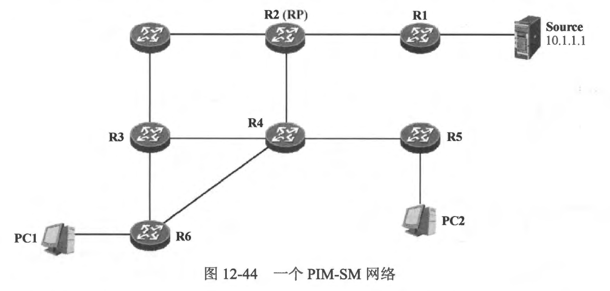
- RP 收到组播流量后，如果网络中没有任何接收者，那么这些流量将直接被丢弃。现在，PC1 宣布加入组播 组G，R6 发现该组成员后，开始朝着 RP 的方向构建 RPT 的分支。它向上游邻居 R4 发送 (\*，G) PIM 加入报文，之所以向R4发送这个报文，是因为 R6 通过查询自己的单播路由表发现到达 RP 的下一跳是 R4，因此它试图通过 R4 将自己拉到RPT。R4 收到这个加入报文后，向自己的上游邻居 R2 发送(\*，G)PIM 加入报文（如图 12-45 所示），而 R2 本身就是 RP，如此一来，RPT 的一段分支就构建好了。
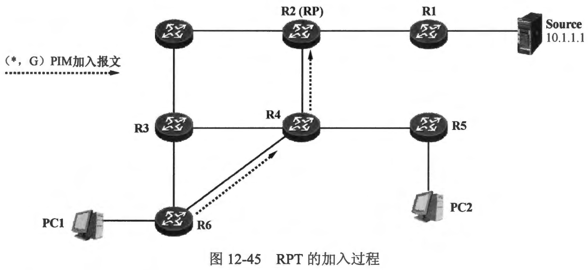
- 现在 Source 发出的组播流量到达 RP 后，RP将它们沿着RPT转发下去，直至沆量到达接收者。
- 本章学习重点:
  - 理解 PIM-SM 的特点及适用的网络场景
  - 掌握 PIM-SM 的基础工作机制:
    - RPT 的加入过程
    - RPT 的剪枝过程
    - 源的注册过程
    - RPT到 SPT 的切换过程等
  - 理解 PIM-SM DR 的概念及作用
  - 掌握 PIM-SM 的基础配置

 
 

### 12.7.1 协议报文
- PIM-SM 与 PIM-DM 使用的协议报文类型有所不同。对于 PIM-SM 而言，使用表 12-4 罗列的几种类型的报文。
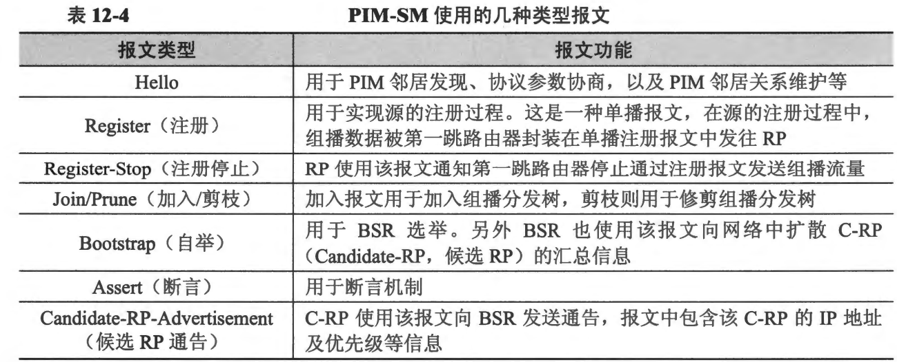

 
 

### 12.7.2 RPT加入过程
- PIM-SM 与 PIM-DM 的工作方式不同，PIM-SM 不会像 PIM-DM 那様，直接将组播流量推送到全网，运行 PIM-SM 的路由器需要使用 PIM 加入报文构建 RPT 的分支。图 12-46 展示了一个PIM-SM 组播网络，这个网络包含 6 台路由器，它们都运行着 PIM-SM。R4 及 R6各自连接着一个终端网络，而 R1 则连接着组播源 Source，初始情况下，Source 发出的组播流量不会被转发给网络的任何分支，除非RPT 已经建立了起来。
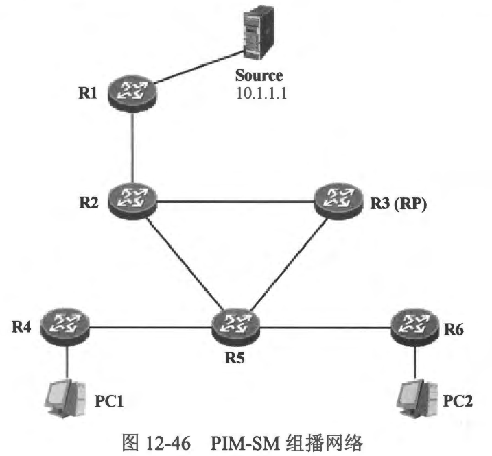
- 下面分析一下 RPT 的加入过程。由于此时网络中的RPT 没有任何分支，因此RP在收到组播流量后，会直接将其丢弃。
  - PC1 宣告加入组播组 239.1.1.87，它通过发送IGMP 成员关系报告宣告自己加组，如图 12-47 所示。
  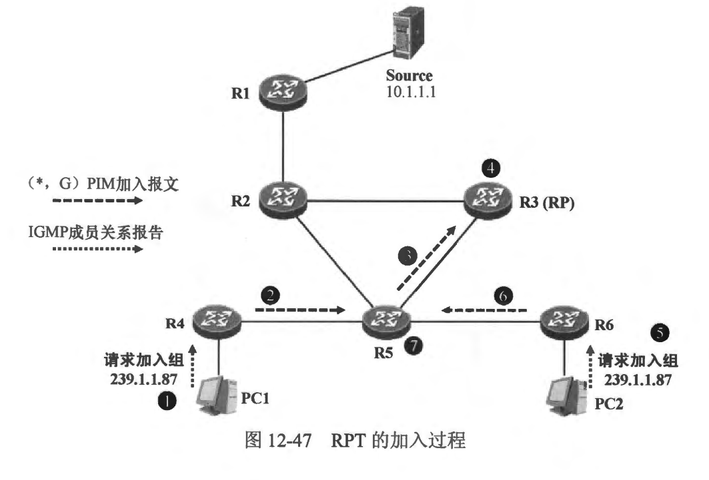
  - 最后一跳路由器 R4 收到这个 IGMP 成员关系报告后在自己的 PIM 路由表中创建（\*，239.1.1.87） 表项，将收到 IGMP 报文的接口添加到该组播表项的下游接口列表中，并朝着 RP 的方向发送（*，239.1.1.87）PIM 加入报文。值得注意的是，此时网络中己经实现了单播路由的互通(全网的路由器己经运行了单播路由协议，例如 OSPF),R4在其单播路由表中查询到达 RP 的路由，从而得到上游接口，以及上游 PIM 邻居的地址（也即R5 的接口 IP 地址）。
  - R5收到了R4 发送的加入报文后，知道后者想要加入 RPT，于是在其P™M路由表中创建（\*，239.1.1.87）表项，然后将收到加入报文的接口添加到该表项的下游接口列表中。由于自己并非RP，因此它需要继续朝着 RP 的方向发送（*，239.1.1.87）加入报文。通过查询单播路由表，R5 发现了到达 RP 的出接口，于是它向上游邻居 R3 发送加入报文。
  - R3 收到了 R5 发送过来的加入报文，它将创建（\*，239.1.1.87） 表项，将收到该报文的接口添加到表项的下游接口列表中，由于它本身就是RP，因此从最后一跳路由器 R4 到 RP 的这段 RPT 的分支就构建完成了。此后，如果 RP 从Source 收到了发往239.1.1.87 的组播流量，便开始向下游接口转发该组播流量，那么 R4 就能够在 RPT 上接收（*，239.1.1.87）组播流量并将它们转发到接收者所在的接口。
  - 现在，假设 PC2 也加入组播组 239.1.1.87，于是它发送 IGMP 成员关系报告以宣告自己加组。
  - R6收到 PC2 发送的成员关系报告后，创建（\*，239.1.1.87） 表项，并且将相应的接口添加到该表项的下游接口列表中，然后从上游接口向 R5 发送 (*，239.1.1.8) 加入报文，请求加入 RPT。
  - R5收到R6 发送的 (\*，239.1.1.87) 加入报文后，发现本地已经存在(\*，239.1.1.87) 表项，于是将接收该报文的接口加入到（\*，239.1.1.87） 表项的下游接口列表中，并开始将（\*，239.1.1.87）组播流量转发到这个接口。图12-47 清楚地描述了上述全部过程。
- 最终 PIM-SM 构建起来的 RPT 如图 12-48所示。当 RP 收到 Source 发往 239.1.1.87 的组播流量后，便会将该流量沿着 RFT 转发下去。
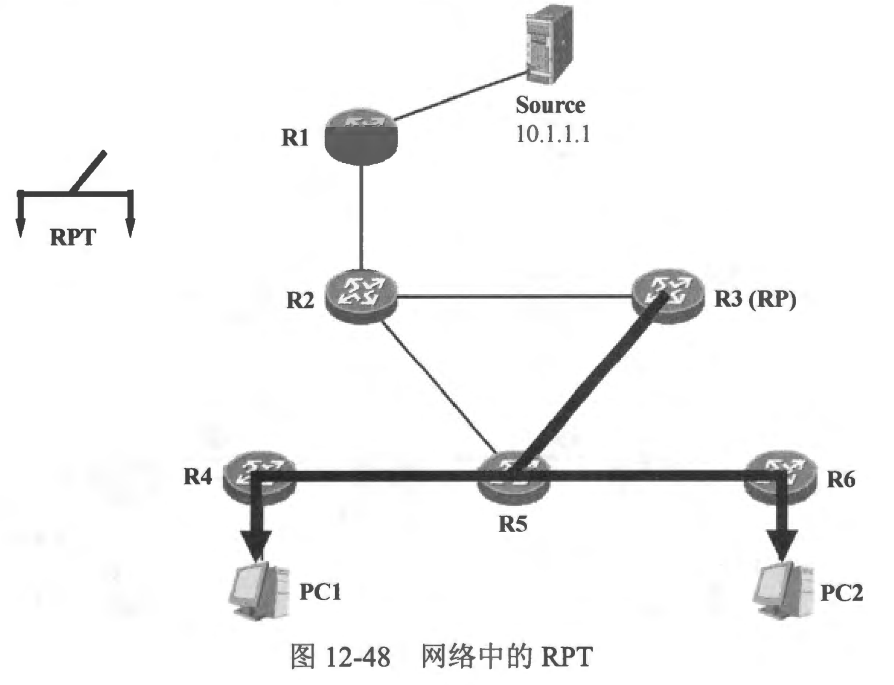

 
 

### 12.7.3 RPT剪枝过程
- 随着RPT 在网络中逐渐成型，组播流量从 RP 沿着 RPT 向下游转发，直至到达每一个接收者所在网段。不在RPT 上的组播路由器如果需要组播流量，则要朝着 RP 的方向发送PIM 加入报文，而如果己经处于 RPT 上的组播路由器不再需要组播流量，则要进行 RPT 剪枝过程，将自己从 RPT 上修剪掉。接下来看看 PC2 及 PC1 相继离组的过程。
  - PC2 不再是组播组 239.1.1.87 的成员，它将发送IGMP 离组报文，宣告自己离开组播组 239.1.1.87。
  - R6 收到这个报文后，会在接收报文的接口上进行特定组查询，由于R6 的直连网段中并不存在 239.1.1.87 组的其他成员，因此它将该接口从组播表项（\*，239.1.1.87）的下游接口列表中删除。完成这个操作后，R6 发现（\*，239.1.1.87）表项的下游接口列表已经为空，这意味着自己不再需要（\*，239.1.1.87）的组播流量，于是从上游接口发送一个（*，239.1.1.87）的PIM 剪枝报文，试图将自己从 RPT上剪除。
  - R5 收到这个剪枝报文后，在自己的（\*，239.1.1.87） 表项的下游接口列表中将接收该报文的接口删除。执行完这个操作后，由于下游接口列表中还有另外的接口，因此R5 自己显然还需要（\*，239.1.1.87）组播流量，它将会保持现状。
  - 一段时间后，PC1 也离开组播组 239.1.1.87，它通过发送IGMP 离组报文宣告自己离组。
  - R4 收到这个报文后，针对该组播组进行查询，查询后发现，这个接口上已经没有239.1.1.87 组播组的其他成员了，因此它将该接口从（\*，239.1.1.87）表项的下游接口列表中删除。完成这个操作后，R4 发现该表项的下游接口列表已经为空，于是从上游接口发送（*，239.1.1.87）剪枝报文，试图将自己从 RPT 中剪除。
  - R5 收到这个报文后，将接收该报文的接口从自己的 (\*，239.1.1.87) 表项的下游接口列表中删除，如此一来下游接口列表也就为空了，因此 R5 从自己的上游接口发送（*，239.1.1.87）剪枝报文，将自己从 RPT 中剪除。
  - R3收到R5 发送的剪枝报文后，将接收该报文的接口从自己的(\*， 239.1.1.87) 表项的下游接口列表中州除，而执行完这个操作后，它发现该表项的下游接口列表已经为空，如此一来，网络中当前己经不存在 RPT 的任何分支，因此自己也不再需要（\*，239.1.1.87）组播流量了，它将Source 发送过来的（\*，239.1.1.87） 流量丢弃。
- 图12-49 描述了上述过程。
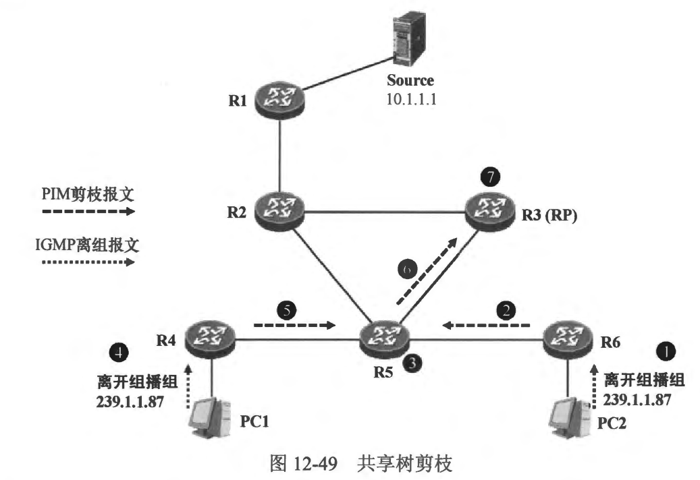

 
 

### 12.7.4 源的注册过程
- 我们已经知道，在PIM-SM 网络中，RP 是非常关键的角色。以RP为参考点，可以将组播网络划分为两部分，一部分是从 RP 到接收者，另一部分则是从源到 RP。组播源将组播流量发往 RP，而 RP 则将组播流量沿着 RPT 向下游转发，组播流量最终到达每一个接收者所在的网段。
- 12.7.2~12.7.3节讨论的实际上是 RP 与接收者之间的这部分网络产生的活动，无论是RPT 加入还是剪枝过程，都是在维护网络中的RPT。那么对于另一部分，也就是组播源到RP之间存在什么工作机制？组播源是如何将组播流量发送到RP的？

- 以图 12-50 为例，本节聚焦 Source 与 RP，来看看源的注册过程。
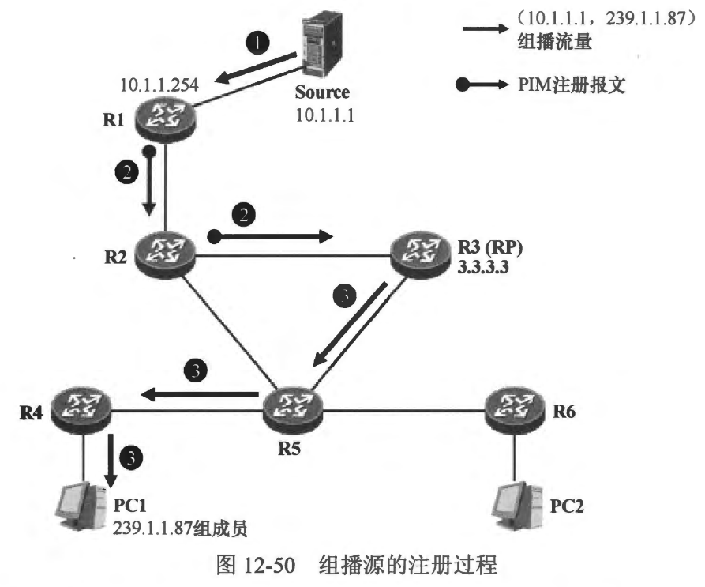
  -当组播源 Source 开始向组 239.1.1.87 发送组播报文后，这些组播报文首先被第一跳路由器 R1 收到，后者现在要将组播报文发向 RP。RI 将启动一个注册 (Register)过程以便将组播报文送达 RP。R1必须事先知道组播组 239.1.1.87 与 RP (3.3.3.3)的映射关系，然后它通过查询自己的单播路由表寻找到达 RP 的路径。为了确保组播报文能够准确到达 RP，R1 将其收到的组播报文进行封装，它将组播报文封装在 PIM 注册报文中。注册报文是单播报文，缺省时其源卫地址为RI的接口 IP 地址 10.1.1.254，目的 IP 地址是 RP 的IP 地址 3.3.3.3。图 12-51 展示了 R1 发送的某个注册报文，我们能直观地看到该报文中封装的组播报文。
  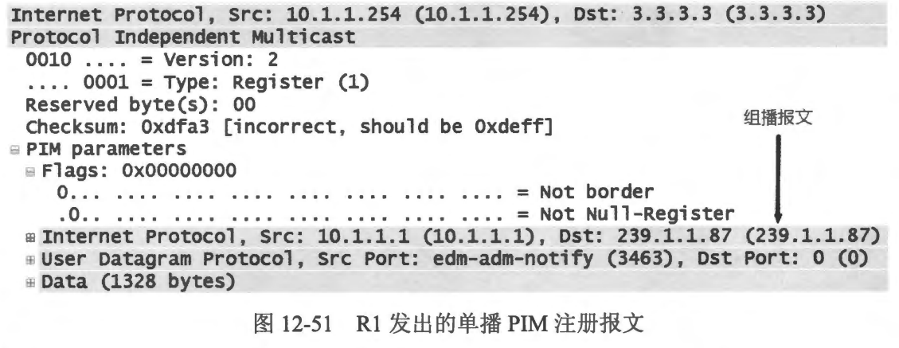
  - **说明:为什么R1 不直接将组播报文转发到 RP，而是采用注册的方式，将组播报文封装之后再通过单播的形式发送给 RP？设想一下，R1 是要将组播报文转发到 RP，如果它采用扩散的方式，將组播报文直接推送出去，品然是不合适的，因为这些报文的目的地非常明确，就是RP。而如果将组播报文沿着R1 与 RP 之间的一条最优路径(在R1与RP之间事先建立一条组播分发树的分支)来传递，这也是无法办到的，因为在 Source 发送组播流量之前，RP 并不知道组播源的所在，因此不可能事先建立一段组播分发树的分支。**
  - 封装着组播报文的注册报文被 R1 发送给 R2，再被 R2 转发到 R3 (实际上对于 R2 而言，这只是一个发往 R3 的普通单播报文)，现在报文达到了 RP。
  - RP 将注册报文解封装，得到里面的组播报文，它将这个组播报文沿着RIT 转发下去（假设当前 RPT 已经建立完成，PC1 是组播组 239.1.1.87 的成员）。正如前面所说，第一跳路由器 R1 将Source 发送的组播报文封装在单播报文中发往 RP 实际上是一个无奈的办法。然而，Source 发送的组播报文会源源不断地被 R1收到，如果 R1 对每一个收到的组播报文都封装成注册报文发往 RP，这显然是非常低效的，而且也加重了 RI 及RP（RP 需要对每一个注册报文进行解封装）的负担。实际上，当RP 收到第一个注册报文并成功解封装后，它就已经知道了组播源 Source 的 IP 地址。因此按照我们之前的分析，此时 RP 完全具备了在自己与组播源之间建立组播分发树的条件。
  - RP 在自己的单播路由表中查询到达 Source 的路径及出接口，然后朝着 Source 的方向发送（10.1.1.1， 239.1.1.87） PIM 加入报文，试图在自己与源之间构建一棵 SPT。这个加入报文被 RP 发往自己的上游邻居 R2，如图 12-52 所示。
  - R2收到这个（10.1.1.1，239.1.1.87）加入报文后，创建 (10.1.1.1, 239.1.1.87) 表项，并将接收该报文的接口添加到下游接口列表中，然后继续向自己的上游邻居 R1 发送（10.1.1.1， 239.1.1.87）加入报文。
  - R1 收到 R2 发送的 (10.1.1.1，239.1.1.87) 加入报文后，将接收该报文的接口添加到 (10.1.1.1，239.1.1.87) 表项的下游接口列表中。如此一来，R1 到 RP 之间的 SFT 就构建完成了。
  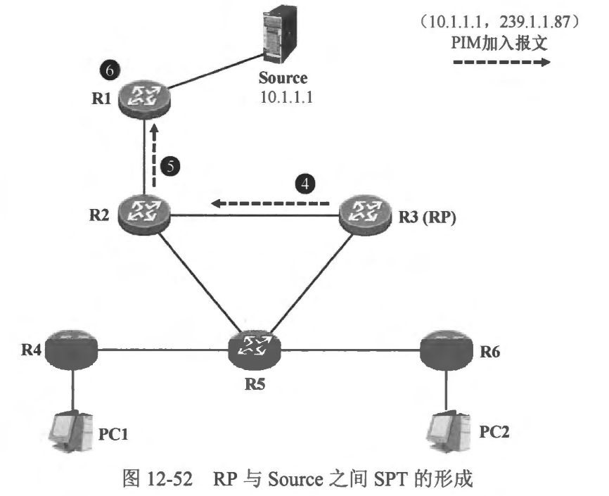
  - 现在，当 R1 再收到 Source 发往 239.1.1.87 的组播报文时，由于 〈10.1.1.1,239.1.1.87）表项的下游接口列表为非空，因此 R1 将组播报文从下游接口转发出去。另一方面，R1依然将组播报文封装在注册报文中，通过单播的方式发往 RP。
  - R2 收到R1 发送的组播报文后，发现组播报文是在 (10.1.1.1，239.1.1.87）表项的上游接口到达，因此该报文通过了 RPF 检查，R2 将其从自己的下游接口转发给 R3。而单播的注册报文也会被 R2 转发给R3。
  - 此时对于 R3 而言，一方面会在SPT 上收到 （10.1.1.1，239.1.1.87）组播报文，另一方面对注册报文解封裝后，又会得到同一组播报文的另一份拷贝，这是两份相同的组播报文，显然，这是没有意义的。实际上由于 SPT 已经构建完成，RP 已经能够直接从 SPT 接收组播流量，因此 R1 没有必要再将组播报文封装在注册报文中发往RP。RP 通过向 R1 发送一个PIM 注册停止报文，以便让 R1 停止向其发送注册报文。
  - R1 收到注册停止报文后，不再将组播报文封装在注册报文中发往 RP。于是，组播报文只是顺着 SPT 从 R1 转发到 RP。

 
 

### 12.7.5 RFT 到SPT 的切换过程
- 在图 12-53 中，PC1 是组播组 239.1.1.87 的接收者，R4 在自己与 RP 之间建立了一段 RPT 的分支，而 RP 则在自己与 R1 之间建立了 SPT。如此一来，组播流量将从 Source
发出，沿着 SPT 先到达RP，然后由 RP 将组播流量沿着 RPT 转发下去。细心的读者可能已经发现了这里存在的问题：网络中组播流量的转发路径并非最优，组播流量从 R1 出发，流经 R2，然后到 R3，再到 R5，这实际上是一条次优路径，一个更优的方案是，组播流量到达R2 后，直接被转发给 R5，而不用从 RP 绕一下。网络中存在的另一个问题是，所有的组播流量都需先经由 RP 进行分发，当流量特别大时，RP 的负担将变得非常重，当然也就容易引发故障。
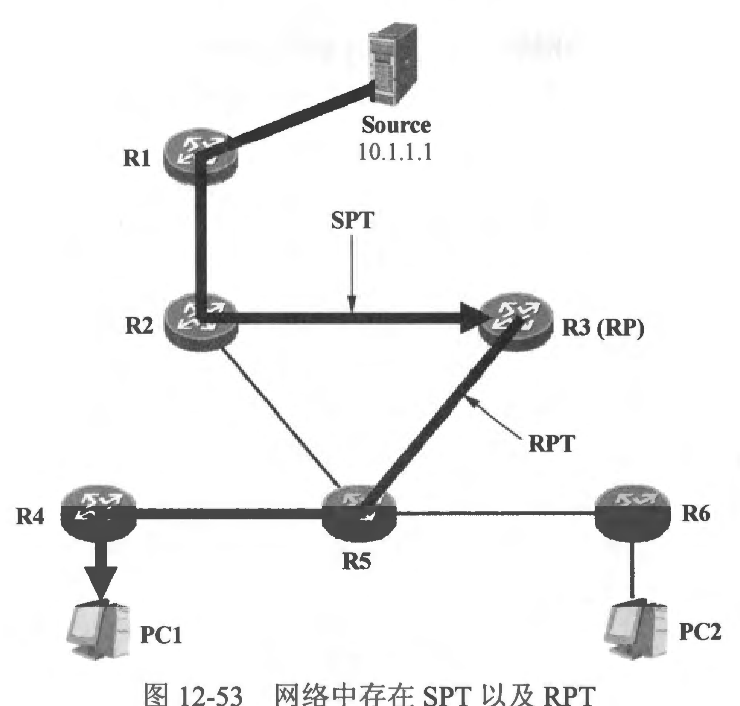
- PIM-SM 的 SPT 切换机制可以很好地解决这个问题。以图 12-53 中的 R4 为例，当其在 RPT 上收到组播报文时，便立即知晓了组播源的卫地址（也就是该报文的源 IP 地址），既然己经知道了组播源的 IP 地址，那么 R4 便可以在自己与组播源之间建立一段
SPT 的分支，然后通过该SPT 的分支直接从 Source 获取组播流量，由于该 SPT 分支是直接建立在自己与 Source 之问的，因此接收组播流量的路径必定是最优的。
- 值得注意的是，SPT 切换机制是发生在与组播接收者直连的最后一跳路由器上的。缺省时，R4 在RPT 上收到第一份组播报文后立即触发 SPT 切换，具体过程如下（图 12-54描述了这个过程）:
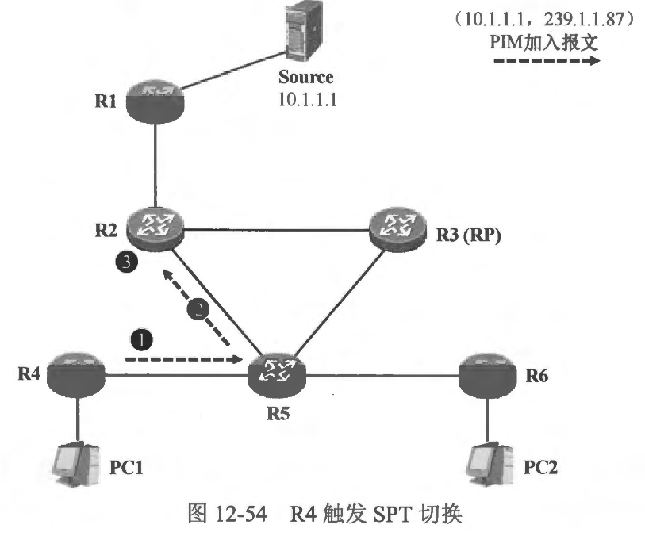
  - 组播报文沿着 RPT 到达最后一跳路由器 R4，R4 收到组播报文后，它便知晓了Source 的地址，它将立即启动SPT 切换(可以通过在R4 上设置组播流量的速率國值，使得当组播流量的速率达到指定的网值后，才触发 SPT 切换。缺省时，最后一跳路由器只要一收到组播报文，便立即进行 SPT 切换）。R4 朝着 Source 的方向发送 (10.1.1.1，239.1.1.87) 的 PIM 加入报文。
  - 上游邻居 R5 收到 R4 的 (10.1.1.1，239.1.1.87) 加入报文后，将接收该报文的接口添加到 (10.1.1.1，239.1.1.87) 表项的下游接口列表中。然后在单播路由表中查询到达 Source 的路由，明确了到达 Source 的出接口及下一跳 IP 地址后，R5 向上游邻居 R2 发送（10.1.1.1，239.1.1.87）加入报文。
  - R2 此时已经存在 (10.1.1.1，239.1.1.87) 表项，它将收到加入报文的接口添加到该表项的下游接口列表中。现在，R2 的 (10.1.1.1，239.1.1.8) 表项的下游接口列表存在两个接口，一个是连接 RP 的接口，另一个则是连接 R5 的接口。当它再从 R1 接收(10.1.1.1， 239.1.1.87) 组播流量时，便会将该流量从这两个下游接口转发出去。此时网络中的组播分发树如图 12-55所示。
  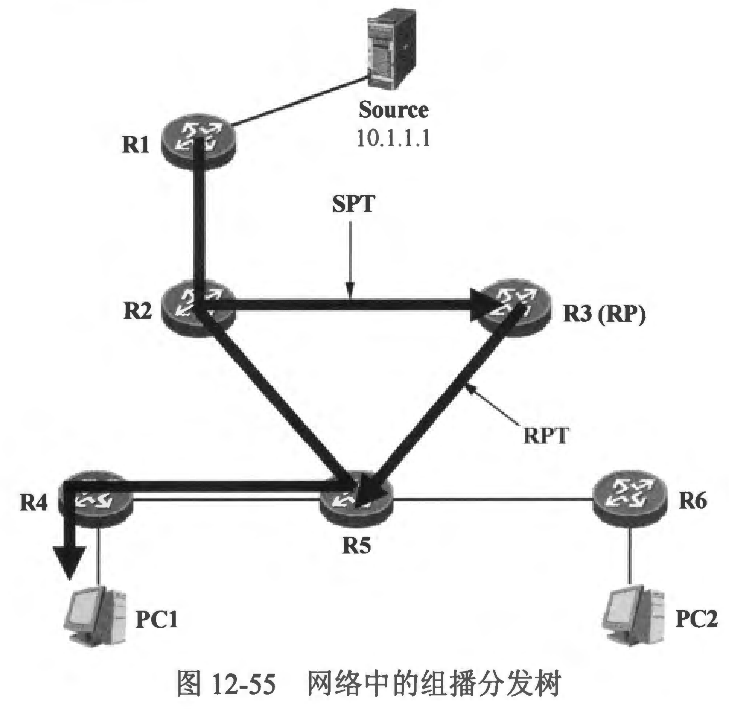
  - 由于R5此刻已经处于 SPT 上，同时，它还在 RPT 上，因此它会分别在SFT 及 RPT 上收到重复的组播流量，这显然是多余的。因此，R5 会开始进行 RPT 修剪过程，将自己从 RPT 上剪除。当R5 开始在 SPT 上收到R2 转发过来的 (10.1.1.1，239.1.1.87) 组
播流量后，R5 将朝着 RP 的方向发送一个特殊的 （10.1.1.1，239.1.1.87） 剪枝报文，试图将自己从 RPT 上剪除。该剪枝报文中设置了 RP 比特位，这个剪枝报文会一路发往 RP。
  - R3 收到R5 发送的 (10.1.1.1， 239.1.1.87) 剪枝报文后，将接收报文的接口从（10.1.1.1，239.1.1.87）表项的下游接口列表中州除。完成这个操作后，R3 发现此时该表项的下游接口列表已经为空，这意味着自己不再需要从 SPT 上接收组播组 239.1.1.87 的组播流量，因此它朝着 Source 的方向发送 （10.1.1.1，239.1.1.87）剪枝报文，试图将自己从 SPT 上剪除。
  - R2 收到R3 发送的（10.1.1.1，239.1.1.87）剪枝报文后，将接收该报文的接口从（10.1.1.1，239.1.1.87）表项的下游接口列表中删除。到目前为止，该网络中的组播分发树已经完成刷新。组播流量将沿着 SPT 从 Source 流向 PC1。

 
 

### 12.7.6 PIM-SM DR
- 在 图12-56中，假设网络中已经部署了 PIM-SM， R1 及 R2 都连接到了同一台交换机上，两台路由器的 GE0/0/0 接口处于同一个广播域并且使用相同的卫 网段。当组播源 Source 开始向网络中发送组播流量时，R1 及 R2 都将在它们的 GE0/0/0 接口上收到这些流量。在这个拓扑中，R1 及 R2 都是直连组播源的第一跳路由器，设想一下，如果在收到组播流量后，二者都向 RP 发起注册过程，那么 RP 将收到重复的组播流量，这不仅没有意义，而且还造成了设备资源及网络带宽的浪费。另一边的 R5 及 R6 也存在问题，这两台路由器的 GE0/0/1 接口，以及组播接收者 PC1 都连接到了同一合交换机，当 PC1 需要组播流量时，它会向网络中发送 IGMP 成员关系报告以宣告自己加组，R5及R6都会收到这个IGMP 报文。由于R5及R6 都是直连着组成员的最后一跳路由器，设想一下，如果两者都执行 RPT 加入过程，都朝着RP 的方向发送PIM 加入报文，那么造成的结果是 R5 及 R6 都将与 RP 建立一段 RPT 的分支，而组播流量将沿着这两段分支分别到达 R5 及 R6，当然，初始时 R5 及 R6 都会将组播流量从自己的 GE0/0/1 接口发出，而后启动断言机制，假设R5 在断言机制中落败，它便会将自己从 RPT 上剪除。实际上，对于 R5 及 R6 而言，只需一合路由器 （例如R6）启动 RPT 加入机制即可。
- PIM 设计了 DR 来解决上述问题。DR 主要用于以下两种场景。
  - 组播源所在网段中的 DR 负责向 RP 发起组播源注册过程；
  - 组成员所在网段中的 DR 负责向RP 发起RPT 加入过程。
- 在图 12-57 中，组播源 Source 所在的网段中连接着两台第一跳路由器：R1 及 R2,这两台路由器的 GE0/0/0 接口都已经激活了 PIM，PIM 将在该网段中选出一台 DR。如果 R2（的 GEO/0/0 接口）胜出成为该网段的 DR，那么当 Source 开始发送组播流量时，将由 R2 向RP 发送注册报文、启动注册过程，而 R1(的 GE0/0/0 接口) 由于在DR 选举中落败，因此不向 RP 发起汴册过程。
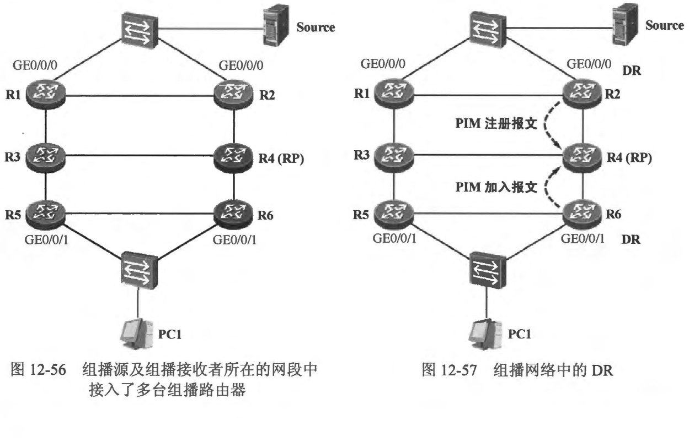
- 另一方面，R5 的 GE0/0/1 接口、R6 的 GE0/0/1 接口与组成员处于同一个网段，如果R6（的 GE0/0/1 接口）胜出成为该网段的DR，那么当 PC1 宣告加入组播组时，将由 R6 向 RP 发送加入报文、执行 RPT 加入过程。
DR 的选举依赖于 PIM 的 Hello 报文，当设备的接口激活 PIM 后，该接口便开始发送 Hello 报文，PM 使用 Hello 报文发现并建立邻居关系，Hello 报文中携带着接口的 DR 优先级以及 IP 地址等信息。当设备在接口上收到其他邻居发送过来的 Hello 报
文后，便会将自己的 DR 优先级和 IP地址与报文中的内容进行比较，从而选举出该网段中的 DR。
DR 的选举规则如下:
  - 当网络中的设备都支持 DR 优先级时，DR 优先级最高的设备（的接口）将胜出成为该网段的DR。DR 优先级的值越大，则优先级越高。
  - 如果 DR 优先级相同，或者接入该网段的设备中至少有一台设备不支持在 Hello 报文中携带 DR 优先级，那么接口 IP 地址最大的设备将成为该网段的 DR。
- **说明:如果设备收到邻居发来的Hello报文后，发现该报文中并未携带 DR 优先级宇段，它将意识到对方不支持 DR 优先级，此时它将不再使用自己的 DR 优先级与对方进行竞争，而是来用接口 IP 地址与对方的 IP 地址进行比较，IP 地址更大者胜出。**
- DR 的角色是可抢占的，这意味着，如果一个网段中已经存在 DR，而后又出现了一台新的设备，且该设备的接口 DR 优先级要高于当前 DR，那么它将会抢占其角色，成为该网段的新 DR。Cisco 网络设备缺省的接口 DR 优先级值为 1，当然，这是可以通过命令修改的（可在接口视图下使用 `ip pim dr-priority <priority>` 命令修改该接口的 DR 优先级），为了保证一个网段中 DR 角色的稳定，建议根据网络实际情况选择 DR 设备，并将该设备的接口 DR 优先级调高。
- 值得一提的是，DR 主要在 PIM-SM 中被使用。PIM-DM 与 PIM-SM 的工作机制大不相同，DR 在 PIM-DM 中并没有太多的意义。在 PIM-DM 中，DR 仅有一种作用，那便是作为 IGMPv1 查询器。由于 IGMPv1 标准并没有定义查询器的选举办法，因此它不得不求助于组播协议，例如 PIM。当网络中运行 IGMPv1 时，PIM 选举出的 DR 将会成为 IGMPv1 查询器。

 
 

### 12.7.7 案例1：PIM-SM 基础配置
- 在图 12-58 中，R1、R2、R3及R4 运行了 OSPF，使得每合路由器都了解了到达全网的路由。Source 是组播组 239.1.1.93 的源，而 PC 是该组播组的接收者。现在需在网络中部署 PIM-SM，使得 Source 开始向 239.1.1.93 发送组播流量后，PC能够收到这些流量。
- R3 被规划为该网络的 RP，其 Loopback 0 接口地址为 3.3.3.3/32，这个 IP 地址将作为 RP 的地址，本案例使用手工配置的方式告知每合组播路由器关于 RP 的 IP 地址，这种 RP 发现方式被称为静态 RP。当然，R3 的 Loopback0 接口地址需要在 OSPF 中发布，以便所有的组播路由器都能通过 OSPF 发现到达 RP 的路由。
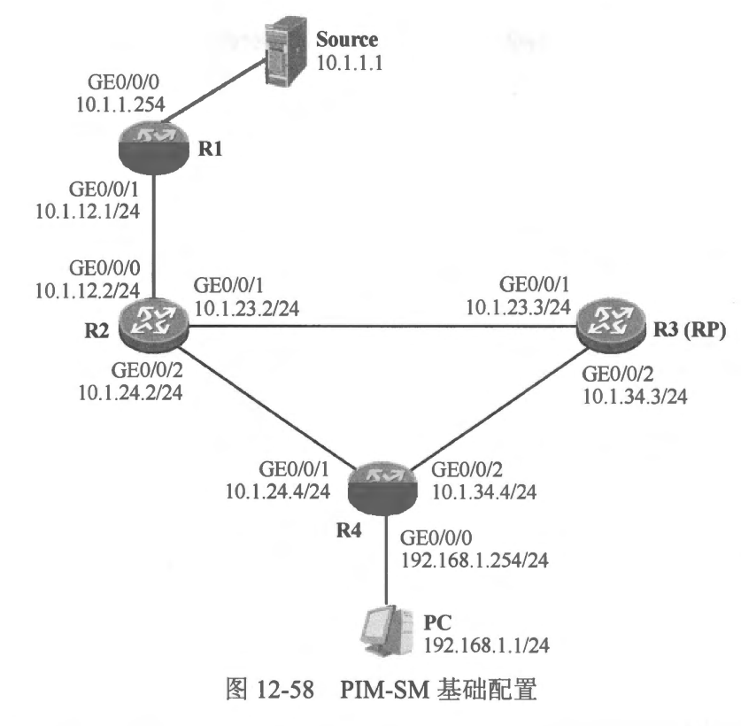

 
 

### 12.7.8 案例2：DR 的选举与控制
- 经过前文的讲解，读者己经熟悉了 DR 的概念及作用，在组播网络中，对于 PIM-SM 而言，DR 的作用是颇为重要的。在进行网络规划时，为了保证网络的可控，我们时常会人为干预 DR 的选举。在 图12-59中，R5 及 R6 是两台最后一跳路由器，它们的 GE0/0/1 接口都
接入同一合以太网交换机，该交换机还连接着组播成员。如果此时期望确保 R5 的 GE0/0/1 接口能够成为该网段的 DR，那么可以调节其接口的 DR 优先级，将该优先级调整成一个较大的值。
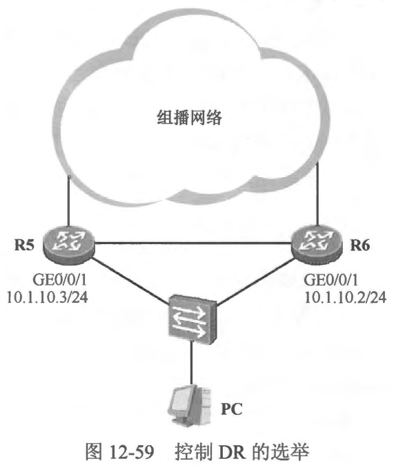
