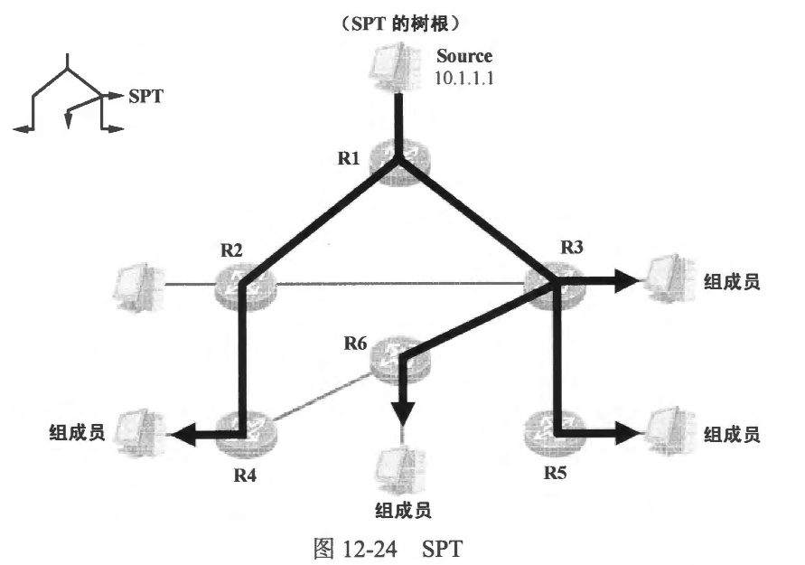
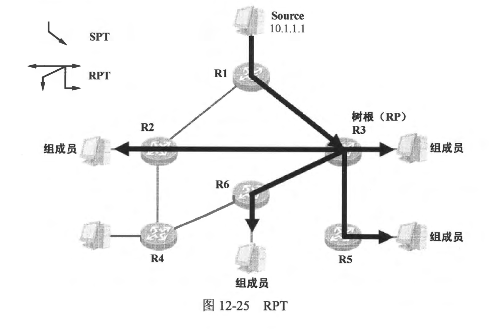
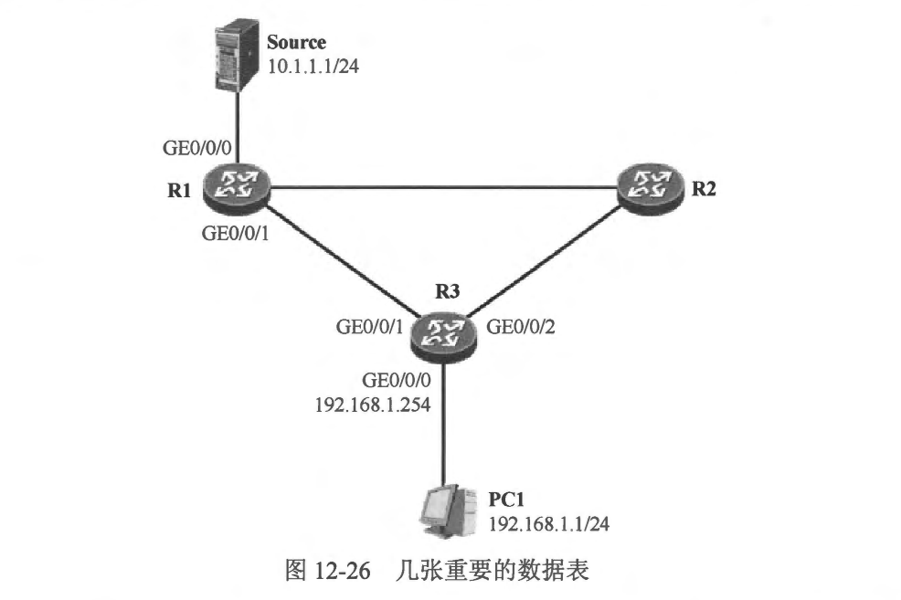
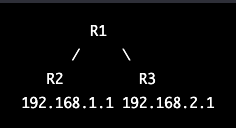

### 组播路由协议基础

- 我们已经知道，组播报文是由组播源产生并且发向一组接收者的，组播报文一旦进入组播网络后，组播网络设备(例如组播路由器等)负责拷贝及转发这些报文，直至报文到达接收者。那么组播路由器如何知道应该将组播报文转发到哪里 （从设备的哪个或者哪些接口转发出去）？组播报文在网络中的传输路径如何？如何确保组播报文在转发的过程中不存在环路？这就要用到组播路由协议了。
- 每一合组播路由器都维护一个非常重要的数据表，这个数据表便是组播路由表，组播路由表中包含的组播路由表项将用于指导组播报文转发。在一个组播网络中，组播路由协议的主要作用如下。
  - 在每合路由器上确定朝向组播源（或者 RP）的接口，该接口也被称为上游接口。在每合组播路由器的每一个组播路由表项中，如果存在上游接口，那么上游接口只会有一个，只有在该接口上到达的组播流量才被视为合法的。
  - 在每台路由器上确定朝向组播接收者的接口，该接口也被称为下游接口。当组播流量在上游接口到达时，组播路由器负责将流量从下游接口转发出去。需要强调的是，组播流量永远不会从上游接口转发出去，因为这有可能在网络中造成环路。在一个组播路由表项中，下游接口列表中可能包含零个、一个或多个接口。
  - 维护组播路由表项。每一个组播路由表项都以一对二元组 （组播源及组播组）进行标识，而且每一个组播路由表项都包含上游、下游接口信息。从宏观的层面看，组播路由协议的工作成果是在网络中构建一棵无环的“树”，组播流量沿着这棵无环树从上游向下游转发，最终到达接收者所在的网段，而网络中的每一合组播路由器，便是这棵树上的节点。

<br>
<br>

### 12.5.1 组播分发栵

- 在一个组播网络中，组播路由协议扮演着非常关键的角色。组播路由协议最重要的工作之一就是为组播网络生成一棵无环的树，这棵树也是组播流量在网络中的传输路径，我们称之为组播分发树 (Multicast Distribution Tree)，简称为组播树。常用的组播分发树有以下两种。
- SPT (Shortest-Path Tree，最短路径树）

  - SPT 也被称为源树，是以组播源为树根的组播分发树，而组播组的接收者则可以看作是这棵树的树叶。组播流量从树根（源）出发，沿着枝干传播，最终到达树叶，也即按收者所在的终端网络，如图 12-24 所示。
    
  - 实际上图 12-24 所描绘的组播分发树仅是一个形象化的概念，对于组播网络中的每一合路由器而言，它们并不清楚 “整棵树〞 的完整形态，组播分发树体现到每一合组播路由器上其实就是组播路由表中的相关表项。每一台组播路由器都维护着组播路由表，该数据表用于指导组播流量转发。在实际的网络中，组播路由表可能包含多个表项，每个表项都存在四个关键信息：组播源地址、组播组地址、上游接口以及下游接口。
  - 组播路由表项分为两种类型：(S，G)和（\*，G)。其中s 表示具体的某个组播源 IP 地址，G 表示具体的某个组播组 IP 地址，而 \* 则表示任意的组播源。
  - 对于 SPT 而言，使用的是（S，G）表项，每一个(S，G)表项在网络中都对应了一棵独立的 SPT。以图 12-24 为例，当SPT 建立完成后，我们就能在每合路由器上观察到（S，G） 表项，其中S 为组播源的 IP 地址，例如图 12-24 中的 10.1.1.1，假设该组播源向组播组 239.1.1.13 发送组播流量，那么网络中组播路由器所维护的 (S，G) 表项就是 (10.1.1.1，239.1.1.13)。每合路由器的(10.1.1.1，239.1.1.13) 表项都包含上游及下游接口信息，在 SPT 中，上游接口是设备朝向组播源的接口，例如在 R3 的 (10.1.1.1， 239.1.1.13) 表项中，上游接口是其连接 R1 的接口，而下游接口有三个，分别是其连接 R5、R6 以及直连网段中存在组成员的那个接口。当 R3 从上游接口收到 10.1.1.1 发往 239.1.1.13 的组播流量时，就会将这些流量按照 (10.1.1.1， 239.1.1.13）)表项的指示，拷贝三份并分别从三个下游接口转发出去，因此形象的理解就是：这些组播流量沿着 SPT 转发了下去。
  - 对于 SPT 而言，组播流量从源到接收者的过程走的是最短路径，这也是该组播分发树被称为最短路径树的原因。然而由于 SPT 使用的组播路由表项是 (S，G) 表项，这意味着每合组播路由器都不得不为每个组播组中的不同组播源创建单独的（S，G）表项，在一个大型的组播网络中，当存在大量的组播源及组播组时，路由器的内存空问将被臃肿的组播路由表占据，进而导致性能下降。
- 2. RPT (Rendezvous Point Tree，共享树)

  - RPT 与 SPT 不同，它不以组播源为树根，而是以 RP (Rendezvous Point）为根。RP类似于一个汇聚点的概念，在一个典型的组播网络中，通常是一合性能较好的网络设备。
    多个组播组可以共用一个 RP，期望接收组播流量的路由器通过组播路由协议在自己与 RP 之间建立一段 RPT 的分支。组播流量首先需要从源发送到RP，然后再由 RP 将组播流量分发下来，组播流量顺着 RPT 最终到达各个接收者所在的终端网络，如图 12-25 所示。在本例中，组播源 Source 与 RP 之间建立了 SPT， Source 通过这棵 SPT 将组播流量发送到RP，而RP 再将组播流量沿着 RPT转发到组播接收者。
  - RPT 主要使用的是（\*，G)表项，其中“\*表示的是任意的组播源。换句话说，对于 RPT 而言，路由器对于每个组播组仅需维护一个（*，G）组播路由表项，无论有多少个组播源在向该组播组发送组播流量。
  - 由于在网络中指定了 RP，组播流量需要先从源发往 RP，再由 RP 沿着组播树分发下来，这就势必存在这样一种情况：对于某些接收者而言，组播流量传输的路径可能并不是最优路径，如图12-25中，组播流量从 Source 转发到 RP，再由 RP 转发到 R2，显然对于 R2 而言这条路径并非最优，这就有可能引入额外的时延。当然，组播路由协议也有相应的机制来规避这种次优路径问题。
    

<br>
<br>

### 认识组播相关表项

- 对于组播而言，有几个数据表是大家需要熟悉和理解的。它们分别是 IGMP 组表、IGIMP 路由表、组播协议路由表、组播路由表及组播转发表。在深入讲解组播之前，学会读懂这几张数据表并掌握相应的查看方法是非常有必要的。
- IGMP 组表

  - 一旦设备在某个接口上激活了 IGMP，该设备就会开始维护 IGMP 组表。初始情况下该数据表是空的，当设备在接口上收到直连网段中的主机发送出来的IGMP 成员关系报告时，设备就会在 IGMP 组表中创建一个新的表项。以图 12-26 为例:
    
  - 我们在 R3 的 e0/2 接口上激活了 IGMPV2，现在 PC1 发送 IGMPv2 成员关系报告以宣告自己加入组播组 224.0.1.40，R3 在 e0/2 接口上收到该报文后，将会创建如下表项:

  ```shell
  R3#show ip igmp groups 
  IGMP Connected Group Membership
  Group Address    Interface                Uptime    Expires   Last Reporter   Group Accounted
  224.0.1.40       Ethernet0/2              00:00:04  00:02:57  192.168.1.254   
  ```
  - 设备将其通过 IGMP 协议发现的组播组以及该组中最近一次发送成员关系报告的成员I地址记录在该表中。
- IGMP 路由表

  - 对于最后一跳路由器而言，通常有接口直连着存在组播成员的终端网络，而这个接口并不一定需要激活组播路由协议(例如 PIM)，但是一般必须激活 IGMP。如果路由器的接口没有激活组播路由协议，那么协议将无法把这个接口识别为组播协议路由表项的下游接口，这样一来就需要使用 IGMP 路由表中的接口信息作为组播路由表项的下游接口的扩展。使用 show ip igmp interface ethernet 0/2 命令可以查看设备的 IGMP 路由表，如图 12-26 中的 R3，假设它并没有在 e0/2 接口上激活组播路由协议，但是激活了 IGMP，那么当 PC1 发送IGMP 成员关系报告宣告加入组播组 224.0.1.40 后，R3 将维护如下 IGMP 路由表项:

  ```shell
  Ethernet0/2 is up, line protocol is up
  Internet address is 192.168.1.254/24
  IGMP is enabled on interface
  Current IGMP host version is 2
  Current IGMP router version is 2
  IGMP query interval is 60 seconds
  IGMP configured query interval is 60 seconds
  IGMP querier timeout is 120 seconds
  IGMP configured querier timeout is 120 seconds
  IGMP max query response time is 10 seconds
  Last member query count is 2
  Last member query response interval is 1000 ms
  Inbound IGMP access group is not set
  IGMP activity: 1 joins, 0 leaves
  Multicast routing is enabled on interface
  Multicast TTL threshold is 0
  Multicast designated router (DR) is 192.168.1.254 (this system)
  IGMP querying router is 192.168.1.254 (this system)
  Multicast groups joined by this system (number of users):
      224.0.1.40(1)
  ```
- 组播路由表
  - 如果设备运行了多种组播路由协议，那么每种路由协议都将维护自己的组播协议路由表，而优选出来的表项则会出现在设备的组播路由表中。组播路由表中的表项将作为组播转发表的数据输入。
  - 在图 12-26中，R3 的组播路由表可能如下所示:
  ```shell
  R3#show ip mroute   
  IP Multicast Routing Table
  Flags: D - Dense, S - Sparse, B - Bidir Group, s - SSM Group, C - Connected,
         L - Local, P - Pruned, R - RP-bit set, F - Register flag,
         T - SPT-bit set, J - Join SPT, M - MSDP created entry, E - Extranet,
         X - Proxy Join Timer Running, A - Candidate for MSDP Advertisement,
         U - URD, I - Received Source Specific Host Report, 
         Z - Multicast Tunnel, z - MDT-data group sender, 
         Y - Joined MDT-data group, y - Sending to MDT-data group, 
         G - Received BGP C-Mroute, g - Sent BGP C-Mroute, 
         N - Received BGP Shared-Tree Prune, n - BGP C-Mroute suppressed, 
         Q - Received BGP S-A Route, q - Sent BGP S-A Route, 
         V - RD & Vector, v - Vector, p - PIM Joins on route, 
         x - VxLAN group
  Outgoing interface flags: H - Hardware switched, A - Assert winner, p - PIM Join
   Timers: Uptime/Expires
   Interface state: Interface, Next-Hop or VCD, State/Mode

  (10.1.1.1, 224.0.1.40), 1d00h/00:01:59, RP 0.0.0.0, flags: DCL
    Incoming interface: Null, RPF nbr 0.0.0.0
    Outgoing interface list:
      Ethernet0/2, Forward/Dense, 1d00h/stopped
  ```
  - 在R3 的组播路由表中，大家能看到（S，G)表项：(10.1.1.1，224.0.1.40），这个表项实际上是 R3 所运行的组播路由协议 PIM 贡献的。
  
<br>
<br>

### 12.5.3 RPF
- 当路由器收到一个单播报文时，它将在自己的单播路由表中查询该报文的目的 IP 地址，并通过匹配的路由表项来决定将报文转发给哪个下一跳设备，以及从哪个接口发出。在传统的 IP 路由中，报文的源 IP 地址通常是不被关心的。路由器在转发单播报文时，有一个问题不得不考虑，那就是报文转发的防环，如何才能确保网络中的路由器在转发报文时不会出现环路？如果网络中运行了动态路由协议，那么动态路由协议将依赖自身的能力实现路由的无环化，从而使得数据转发不会发生环路。几乎所有的单播动态路由协议都拥有路由防环的设计，例如，RIP 的路由防环很大程度上依赖水平分割规则等；OSPF 的路由防环依赖LSDB、SPF 算法以及对各种LSA 的传播限制和路由计算要求等；BGP 的路由防环则依赖 AS Path 路径属性及IBGP 水平分割规则等。
- 单播报文是发往单一接收者的，若在转发过程中出现环路，对网络尚且会带来巨大影响；而组播报文是发往一组接收者的，一旦出现环路，后果可想而知。与单播路由不同，路由器转发组播报文时，除了会关注报文的目的地址，还会特别关心该报文的来源。
- 组播路由器通过一种被称为 RPF (Reverse Path Forwarding，反向路径转发)的机制来实现组播报文转发的无环化。RPF 机制确保组播报文在正确的接口到达，只有这些组播报文才会被路由器沿着组播分发树进行转发，如果报文在错误的接口到达，路由器将丢弃这些报文，因此 RPF 确保了组播流量转发路径的唯一性，这里所谓正确的接口，其实就是 RPF 接口（通过 RPF 检查的接口），也就是我们经常说的上游接口。
- 网络设备上的单播路由、MBGP 路由以及组播静态路由都可以作为 RPF 检查的依据。通常情况下，我们采用单播路由进行 RPF 检查。当设备收到一个组播报文时，它将在其单播路由表中查询到达该报文的源卫地址的路由，也就是查询到达组播源的单播路由，并检查该单播路由表项的出接口与接收该报文的接口是否一致，如果不一致，则认为报文未通过 RPF 检查并将其丢弃；如果一致，则认为报文通过 RPF 检查并对其进行转发。
- 以图 12-27 为例，假设 R1、R2 及 R3 都运行了单播路由协议，例如 OSPF, OSPF 收敛完成后，三台路由器都将获知到达全网各个网段的路由。

- 当组播源 Source 开始向组播组 239.1.1.9 发送组播流量时，R3 将可能在其 GE0/0/1 及 GE0/0/2 接口上都收到这些流量，它需要对这些流量进行 RPF 检查。当 R3 在其 GE0/0/2 接口上收到该组播流量时(假设本网络使用 SPT)，它将在自己的单播路由表中查询到达组播报文的源卫地址 10.1.1.1的路由，经过路由表查询后，它发现路由表中存在一条匹配的路由，并且该路由的出接口为 GE0/0/1，这说明 GE0/0/1 才是 R3 “朝向” Source 的接口（RPF 接口），因此从 GE0/0/2 接口到达的(10.1.1.1，239.1.1.9）组播流量被认为无法通过 RPF检查，该流量将被丢弃。而当源 10.1.1.1 发往组播组 239.1.1.9 的组播流量在 GE0/0/1 接口上到达时，由于到达接口正是 RPF 接口，因此这些组播流量被 R3 接收，并转发到下游接口。
- 需要格外强调的是，对于 SPT 及 RPT，组播路由器在执行 RPF 检查时是存在区别的：
  - 当组播路由器在 SPT 上接收组播流量时，将使用组播报文的源 IP 地址，也就是组播源的 IP 地址进行 RPF 检查，因为组播源是 SPT 的树根。
  - 当组播路由器在 RPT 上按收组播流量时，将使用 RP 的 IP 地址进行 RPF 检查(在单播路由表中查询到达 RP 的路由表项，并将该路由表项的出接口指定为 RPF 接口），因为 RP 是 RPT 的树根。
<br>
<br>

### 12.5.4 PIM概述
- 对于一个组播网络而言，组播路由协议是非常关键的一环。在组播的架构中，组播路由协议运行在网络中的组播设备上，组播路由协议的主要功能之一就是在网络中构建组播分发树，而实际上体现在每台设备上的结果就是组播协议路由表项。
- PIM (Protocol Independent Multicast， 协议无关组播)是目前行业中使用得最为广泛的域内组播路由协议。目前 PIM 存在两个版本，其中 PIMv1 几乎已经不用了，而 PIMv2 则是目前主要使用的版本。在后续的内容中，PIM 指的是 PIMv2。
- PIM 协议的工作需要依赖设备的单播路由表，它使用设备的单播路由表进行 RPF 检查以及构建组播分发树，与此同时，其不关心设备具体运行的是哪一种或者哪些单播路由协议，静态路由、OSPF、IS-IS、RIP、BGP 等均可为 PIM 提供服务。所谓 “协议无关”，指的是 PIM 的运行机制与具体使用什么样的单播路由协议没有关系。
- PIM 主要存在两种工作模式，它们是密集模式(Dense Mode)以及稀疏模式 (Sparse Mode)，这两种模式分别适用于不同的网络场景。

<br>
<br>