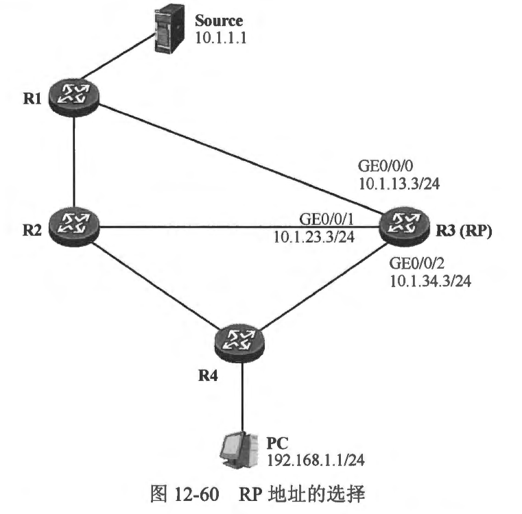

### 12.8 RP发现
- RP在PIM-SM 网络中的地位是非常关键的。PIM-SM 路由器可以通过两种方式发现网络中的 RP。
  - 通过手工配置的方式
  - 通过 BSR 动态发现
- 通过手工配置的方式为 PIM-SM 路由器指定 RP 的地址是一种简单直接的方法，这种方式配置的 RP 被称为静态 RP，该方式适用于规模较小的组播网络，网络管理员仅需在所有的 PIM-SM 路由器上使用一条简单的命令即可为设备指定 RP 的地址。在一个大型的 PIM-SM 网络中，考虑到组播路由器的数量比较庞大，在每台设备都进行相应的配置是比较繁琐的，而且当 RP 的地址发生变化时，网络管理员又不得不手工在每台设备上修改配置。
- BSR (Bootstrap Router) 使得 PIM-SM 路由器能够动态地发现与组播组对应的 RP。通过 BSR，组播路由器能够在当前 RP 出现故障的情况下动态地感知到变化的发生，并且自动进行切换。而且在一些大型网络中，可能存在多个RP，BSR 能够将不同的组播组映射到不同的 RP 上（注意，相同的组播组必须映射到同一个RP），使得单个RP的负裁不至于过高。

<br>
<br>

### 12.8.1 12.8.1 静态RP
- 对于规模较小的 PIM-SM 网络，通常我们会在网络设备中指定其中一合作为组播组的 RP。为了让网络中的PIM-SM 路由器都知晓 RP 的地址，一个最简单的方式是使用手工配置的方式在每一台路由器上指定 RP 的地址。在PIM-SM路由器的 PIM 配置视图中，static-rp 命令用于配置静态 RP。当然，为了确保 RP 能够正确地发挥作用，网络中的所有PIM-SM 路由器必须具备到达 RP 的正确单播路由信息，否则即便路由器知晓了 RP 的地址，也无法构建 RPT，或者向 RP 发起注册过程。
- 在一个实际网络中，作为 RP 的设备往往同时有多个接口接入组播网络，如 图 12-60 所示，R3 被选择作为网络中的RP，它的 GE0/0/0、GE0/0/1 及 GE0/0/2 接口都连接到网络中，那么究竟该选择哪一个接口的地址作为 RP 的地址呢？假设选择 GE0/0/0 的 IP 地址，即 10.1.13.3/24 作为 RP 地址，那么一旦该接口发生故障，或者该接口所直连的链路发生故障，该地址将变为不可达，RP 自然也就无法被正常访问。使用 GE0/0/1 或者 GE0/0/2接口的 IP 地址为作为 RP 的地址同样存在类似的问题。实际上，在该网络中，为了确保所有的 PIM-SM 路由器都具备到达 RP 的路由信息，路由器很可能都部署了诸如 OSPF 之类的动态路由协议。当 R3 的某个接口发生故障时，网络中的 PIM-SM 路由器可以通过其他接口访问 R3，换而言之，到达 R3的路径可以借助动态路由协议实现冗余性。因此一个更佳的解决方案是，在R3上创建 Loopback 接口，为该接口分配一个 IP 地址，例如 3.3.3.3/32，然后将该地址通告到动态路由协议中。这样，全网的 PIM-SM 路由器都能通过动态路由协议了解去往 3.3.3.3/32 的路由，接下来所有的 PIM-SM 路由器都将组播组映射到 3.3.3.3/32。由于 Loopback 接口是稳定可靠的，加上网络中存在动态路由协议，因此只要 R3 还有一个活跃的接口在正常工作，网络中的 PIM-SM 路由器就依然能够通过这个接口到达 3.3.3.3/32，从而保持与 RP 的连通性。值得一提的是，作为静态 RP的接口不必激活 P™M-SM。例如本例中，R3 使用其 Loopbacko 接口地址作为RP的地址，那么其 Loopbacko 接口可以不必激活 PIM-SM。

- 在 PIM-SM 中使用 static-rp 命令时，静态RP的卫地址是必须填写的参数，此外还有一些其他的可选参数。例如，static-rp 命令可以关联一个 ACL，用于控制静态 RP 所服务的组播组。在配置这个功能时，需要先定义一个 ACL，在 ACL 中匹配特定的组播组地址，然后在static-rp 命令中指定静态 RP 的地址并关联该 ACL，这样这个静态 RP将只为该 ACL 中所匹配的组播组服务。如果 static-rp 命令中并没有关联任何 ACL，那么该命令所配置的静态 RP 將为所有的组播组服务。
- 在图 12-61中，假设该网络使用了多个组播组(239.0.0.0/24)，为了避免所有的组播组都映射到单一的 RP 上导致该 RP 负担过重，网络中规划了两个RP，它们分别是 R2 及 R3。R2 及 R3 各自创建一个 Loopback0 接口，并分别配置 IP 地址 2.2.2.2/32 及 3.3.3.3/32。二者都将各自的 Loopback0 接口的直连路由通告到网络中所运行的单播动态路由协议中。接下来，可以将组播组 239.0.0.0/25 映射到 R2，将 239.0.0.128/25 映射到R3。以 R4 为例，它的静态 RP 配置如下:

```shell
```


- 当然，R1、R2 及 R3 的配置均与上达配置完全相同，对于同一个组播组，网络中所有PIM-SM 路由器必须映射到相同的 RP 上，否则该组播组的工作就会出现问题。完成上述配置后，可以通过 display pim rp-info 命令查看生效情况，如在R4 上执行这条命令，可以看到如下输出:

```shell
```

- 我们也可以在 display pim rp-info 命令中增加组播组卫P 地址，从而查询该组播组映射到的 RP 地址。例如在R4 上执行 display pim rp-info 239.0.0.177 命令，可以看到如下输出:

```shell
```
- 组播组 239.0.0.177 映射到了 RP3.3.3.3，这与我们的规划是相符的。
- 在 12.8 节开始的时候，读者己经了解到，PIM-SM 路由器存在两种发现 RP 的机制，一种是静态 RP 方式，另一种则是采用 BSR 的方式，让网络中的 PIM-SM 路由器自动发现 RP。在一台PIM-SM 路由器上，允许同时部署这两种 RP 发现机制。此时对于同一个组播组地址，通过这两种 RP 发现机制映射的 RP 地址如果不同，缺省情况下，路由器将优先选择 BSR 发现的动态 RP。当该动态 RP 失效时，则自动切换到手工配置的静态 RP。当然，可以通过命令改变这种优选顺序。如果在使用 static-rp 命令配置静态 RP时，增加 preferred 关键字，那么路由器将优选手工配置的静态RP。
- static-rp 命令可以在一台路由器上多次执行，但是同一个 ACL 只能映射到一个静态 RP。如果 static-rp 命令不关联任何 ACL，那么只能配置一个静态RP。
- 需要再次强调的是，RP 的地位在 PIM-SM 网络中是非常关键的。针对 RP 有如下要求。
  - 所有 PIM-SM 路由器（包括 RP 本身）需要有针对 RP 完全一致的认知。同一个组播组，在所有的 PIM-SM 路由器上必须映射到相同的 RP。
  - 一个特定的组播组只能被映射到唯一的 RP上。如果在同一个 PIM-SM 网络中，一个组播组被映射到了不同的 RP，那么组播的工作显然是会出现问题的。

<br>
<br>

### 12.8.2 