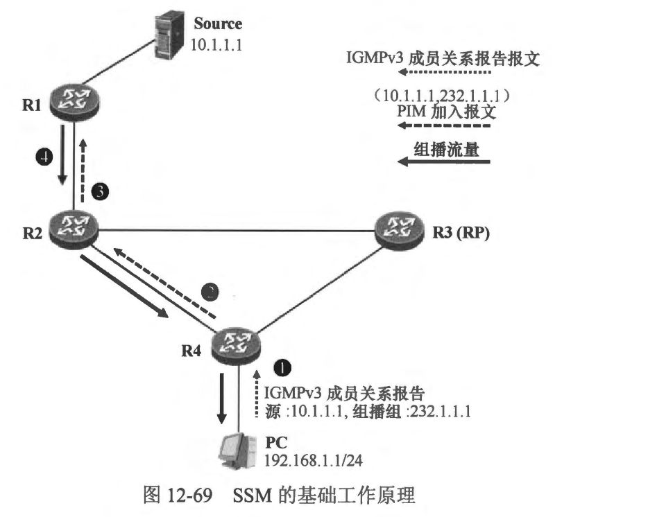
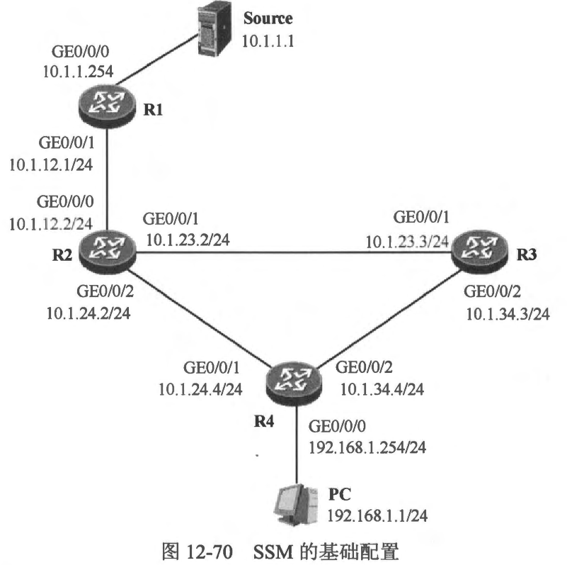

### 12.9 SSM
### 12.9.1 SSM概述
- 到目前为止，本书讨论的都是组播服务模型中的 ASM (Any-Source Multicast， 任意源组播)，在 ASM 中，对于每个组播组而言，任意的设备都可以成为组播源。对于接收者而言，它们事先并不知晓组播源的地址，只要它们加入了一个组播组，当任意的源向该组发送组播流量时，接收者会收到这些流量。
- PIM-DM 及 PIM-SM 都支持 ASM。PIM-DM 适用于组成员分布较为密集的小型网络，而 PIM-SM 则适用于组成员分布较为稀疏的大型网络。以 PIM-SM 为例，由于事先并不知晓组播源的地址，因此最后一跳路由器在发现其直连网络中出现组成员之后，首先朝着RP的方向构建一段 RPT 的分支从而在 RPT 上接收组播流量，然后为了确保在到达组播源的最优路径上接收组播流量，还需在获知组播源的 IP 地址后进行 SPT 的切换，这显然是存在优化空问的。此外，在 ASM 中，为了保证组播流量在接收者这里不会产生冲突，同一个组播组地址在同一时间只能够被一个组播应用使用，即同一时间只允许一个组播源向某个特定的组播组发送组播流量。这个限制将直接造成组播 IP 地址紧缺。
- SSM (Source-Specific Multicast， 特定源组播) 的出现为我们敞开了另一扇大门。在SSM 中，组播接收者在加入组播组时，即可指定接收或者拒绝来自特定组播源的组播流量----特定源组播因此得名。换句话说，组播接收者通过 IGMP 成员关系报告加组时，除了指定期望加入的组播组地址，还能够指定组播源的地址。显然，为了实现这样的需求，IGMPV1 及 IGMPV2 都是无法直接胜任的，而 IGMPv3 则天然拥有这方面的能力。SSM + IGMPv3 的组合，使得最后一跳路由器在初始时就知晓了组播源的地址，并且直接朝着源的方向构建 SPT 的分支，于是组播流量就能够沿着构建好的 SPT 直按到达接收者，而不用经过 RP，实际上该场景完全不需要用到 RP。另外，sSM 也缓解了组播 IP 地址紧缺的问题，在SSM 中，在同一时间内，不同的组播源可以向同一个组播 IP 地址发送数据，因此，每个组播应用无需独占一个组播 IP 地址。
- 在 SSM 中，两个关键组件是 SSM 及 IGMPv3。另外，IANA 规定，232.0.0.0/8 这个组播地址段专门用于 SSM。 SSM 在PIM-SM 的基础上实现，以 Cisco 路由器为例，部署 SSM 时，只需要在设备上激活 PIM-SM 即可，最后一跳路由器根据组播组地址来选择 PIM-SM 或 PIM-SSM 工作模式，缺省情况下，针对 232.0.0.0/8 地址范围的组播组不执行 RPT 加入过程。
- PIM-SSM 的出现，解决了 ASM存在的诸多短板，也体现了诸多优势: 
  - 由于组播接收者在宣告自己加入组播组的时候，同时还指定了组播源的地址，因此最后一跳路由器在最开始的时候便知晓了组播源的地址，它可以直接朝着源的方向建立 SPT 的分支，而不用朝着 RP 的方向建立 RPT 的分支，然后等待组播流量到达之后再进行 SPT 切换，效率得到了提升。
  - 由于组播接收者明确了其感兴趣的组播源，因此如果存在其他组播源向该组播组发送流量，那么这些流量将不会被转发给组播接收者。
  - 在SSM 中，多个不同的组播应用，可以使用相同的组播组地址。因为有了组播源的加入，组播网络可以在目的 IP 地址相同的组播流量中，根据源 IP 地址区分不同的应用。这个特点极大地缓解了组播IPv4 地址短缺的问题。

 
 

### 12.9.2 PIM-SSM 的工作机制
- 在图 12-69中，R1、R2、R3 及 R4 是 PIM-SM 组播路由器，这些路由器都运行了 OSPF，并通过 OSPF 获知了到达全网各个网段的路由。其中 R4 在自己连接终端 PC 的接口上激活了 IGMPv3。下面讲解一下 SSM 的基础工作机制:
  - PC 希望接收组播源 10.1.1.1 发往组播组 232.1.1.1 的流量，PC 运行的 IGMPv3 使得这个需求的实现变得非常简单。它向网络中发送一个 IGMPv3 成员关系报告报文，在该报文中，包含一个组记录，该组记录的类型为 Mode_Is_Inclade， 组地址为 232.1.1.1,而组播源为 10.1.1.1。
  - 最后一跳路由器 R4 收到这个 IGMPv3 报文后，意识到其接口直连的网络中出现了组播组 232.1.1.1 的接收者，并且该接收者指定的组播源为 10.1.1.1。由于组地址 232.1.1.1是 SSM 地址，因此 R4 采用 PIM-SSM 模式进行后续的工作。R4 在自己的单播路由表中查询到达组播源 10.1.1.1 的路由，记录下路由的出接口，然后立即在其 PIM路由表中创建（10.1.1.1，232.1.1.1） 表项，将到达 10.1.1.1 的路由的出接口作为上游接口，将收到 IGMPv3 成员关系报告报文的接口添加到下游接口列表。随后，R4 将在自己与组播源之间建立一段 SPT 的分支。它从上游接口发送一个(10.1.1.1,232.1.1.1)的PIM 加入报文。
  
  - **说明: 从以上描述大家可以看出，PM-SSM 的工作无需RP，也不用执行RPT 加入过程。**
  - R2 收到下游PIM 邻居 R4 发送的（10.1.1.1，232.1.1.1）加入报文后，在其P™路由表中创建（10.1.1.1，232.1.1.1） 表项，将接收加入报文的接口添加到该表项的下游接口列表中，将到达组播源 10.1.1.1 的接口作为上游接口。然后，R2 从上游接口向上游邻居 R1 发送（10.1.1.1，232.1.1.1）加入报文。
  - 第一跳路由器R1 收到 R2 发送的（10.1.1.1，232.1.1.1）加入报文后，如果已经存在 （10.1.1.1，232.1.1.1） 表项，则将收到加入报文的接口添加到该表项的下游接口列表中。当 10.1.1.1 开始向 232.1.1.1 发送组播流量时，组播流量便能够沿着己经建立好的 SPT 流向 PC。

 
 

### 12.9.3 案例：PIM-SSM 的基础配置
- 在图 12-70 所示的网络中，R1、R2、R3 及R4 均运行了 OSPF，使得网络实现了全网路由互通。Source 是组播源，PC 期望接收 Source 发送的组播流量。为了使得网络中的组播业务更高效，我们决定部署 SSM。
