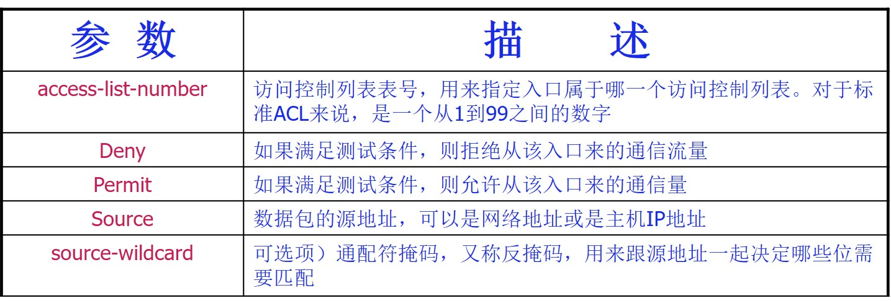
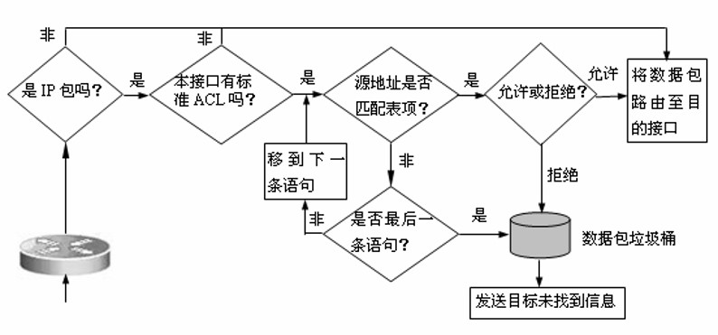
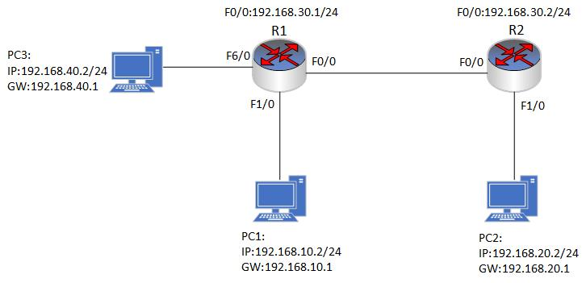
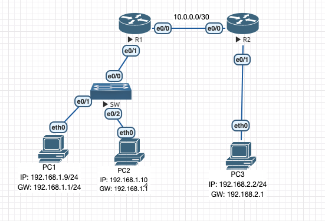

### 16.1标准访问控制列表
- 最广泛使用的访问控制列表是IP访问控制列表，IP访问控制列表工作于TCP/IP协议组。按照访问控制列表检查IP数据包参数的不同，可以将其分成标准ACL和扩展ACL两种类型。
- Cisco的标准控制访问列表（Standard Access Control List，简称ACL）是一种基于IP地址的访问控制列表，用于过滤进出网络的IP数据包。它是一种在Cisco路由器上实现的访问控制机制，可以控制特定IP地址或地址段的数据流是否允许通过路由器。
- 标准ACL仅能基于源IP地址进行过滤，而不能基于目的IP地址、协议类型、端口号等其他因素进行过滤。标准ACL适用于简单的网络环境，可以限制某些特定的主机或网络流量，但并不能提供全面的安全保护。
- 在配置标准ACL时，需要指定一个编号（1-99或1300-1999），这个编号用于标识ACL，并指定ACL所要匹配的源IP地址。下面是一个标准ACL的示例：
```shell
access-list 10 permit 192.168.1.0 0.0.0.255
#这个ACL编号为10，指定允许源IP地址为192.168.1.0/24的数据包通过路由器。可以在接口上应用这个ACL，如下所示：
```
- 这个ACL编号为10，指定允许源IP地址为192.168.1.0/24的数据包通过路由器。可以在接口上应用这个ACL，如下所示：
```shell
interface gigabitethernet0/1
ip access-group 10 in
#这个命令将ACL应用于gigabitethernet0/1接口的入方向（in）
```


 - 标准ACL的工作过程
 

<br>
<br>

### 16.1.1 标准控制访问列表实验1

- 配置要求:
  -  配置全网互通并配置ACL。PC1 与 PC3 为客户端 PC，PC2 为服务器。现需要通过扩展 AC 控制 PC1 可以与 PC2 通信，PC1不可以与 PC3 通信,其他通信正常。 

<br>
<br>

### 16.1.2 标准控制访问列表实验2

- 配置要求:
  - PC1 、 PC2 和 PC3 分别连接到 R1 和 R2。R1 和 R2 之间通过网络连接。配置ACL将只允许来自 IP 地址为192.168.1.10可以访问 PC3。