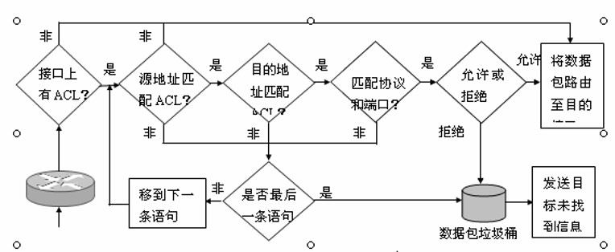
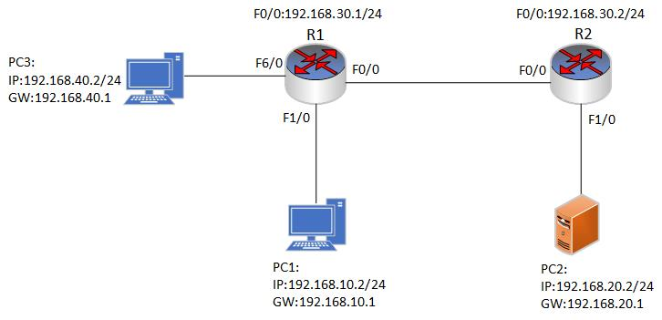

### 16.3 扩展控制访问列表
- 扩展控制访问列表（Extended Access Control List，简称ACL）是一种网络安全功能，用于过滤和限制网络流量，帮助管理员保护其网络免受未经授权的访问和恶意攻击。

- 与标准ACL不同，扩展ACL允许您在ACL规则中使用更多的过滤条件，例如源IP地址、目标IP地址、传输层协议（如TCP或UDP）和端口号。这使得扩展ACL可以更精确地控制网络流量的流向和内容，从而增强网络安全性。

- 扩展ACL规则包含两部分：匹配条件和动作。匹配条件指定了流量必须满足的条件，例如源IP地址、目标IP地址和协议类型等。动作指定了要对匹配的流量执行的操作，例如允许或拒绝该流量。

- 扩展ACL工作工程


- 扩展ACL配置
```shell
Router(config)#access-list access-list-number {deny | permit} protocol [source source-wildcard destination destination-wildcard] [operator  operand]
```


<br>
<br>


### 16.3.1 扩展控制访问列表实验1
- 配置要求:
  - 配置全网互通并配置ACL。PC1 与 PC3 为客户端 PC，PC2 为服务器。现需要通过扩展 ACL 控制 PC1 可以与 PC2 通信，PC1不可以与 PC3 通信,其他通信正常。
  

<br>
<br>

### 16.3.2 基于端口的扩展控制访问列表1
- 配置要求:
  - 配置扩展 ACL，要求只允许 PC1 所在网段的主机访问 PC2 服务器的 WWW 和 FTP 服务，并拒绝 PC1 所在的网段主机 ping PC3 所在网段的主机，其他流量正常放行。
  

<br>
<br>

