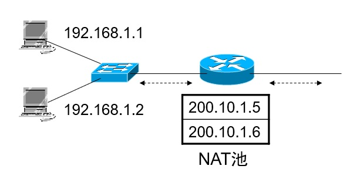
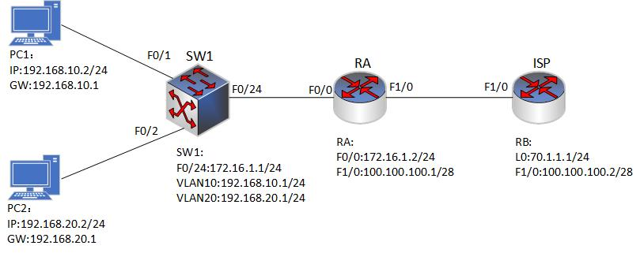

### 17.3动态原理(NAT地址池)
- 将多个合法IP地址统一的组织起来，构成一个IP地址池，当有主机需要访问外网时，就分配一个合法IP地址与内部地址进行转换，当主机用完后，就归还该地址。对于NAT池，如果同时联网用户太多，可能出现地址耗尽的问题。


- 配置代码:
```shell
#建立IP地址池
Router(config)#ip nat pool [pool-name] [start-IP-address] [end-IP-address] netmask [net-mask]
```

<br>
<br>

### 17.3.1 动态NAT实验1
- 配置要求:
  - SW1为三层交换机，其中内网 PC1 属于 VLAN10，PC2 属于 VLAN20，ISP 提供商提供的公网地址为 100.100.100.5~100.100.100.10/24，需要内网的 PC1 和 PC2 使用这段地址访问外网。
  