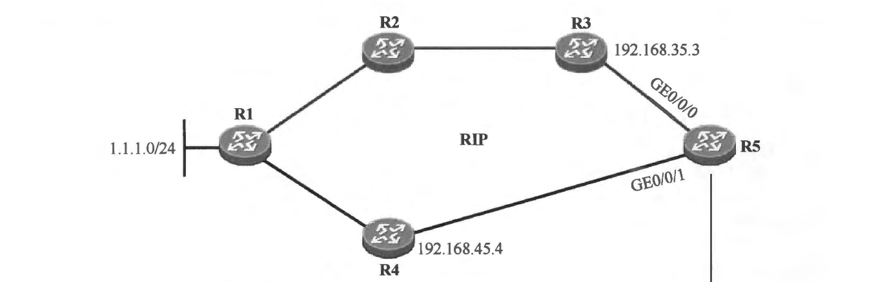

### 本章内容概述和教学目标
- 计算机网络(Computer Network）将世界上各种类型的计算机以及其他终端设备连接在了一起，使得这些设备能够协同工作，能够相互通信——通信是现代人类社会的基本需求。这里所说的计算机网络，实际上是指 IP 网络，也称为 TCP/IP 网络，接入网络的设备也已经不仅仅局限于计算机。所谓的IP 网络，就是以 TCP/IP 协议筷为基础的通信网络。世界上最大的 IP 网络是 Internet（因特网），接入 Internet 的设备数量早已超过了世界人口数量，这些设备可能是计算机、手机或者其他智能设备，例如智能家用电器或可穿戴设备等。除了 Internet 之外，全球各地还有大大小小不同的 IP 网络，例如企业的园区网络，学校的校园网络，甚至每个家庭的家用网络等。

- 通信是人类使用 IP 网络的基本需求，所谓通信，实际上就是信息(Information）或数据 （Data）的收发过程，因此 IP 网络的基本功能便是将数据从一个地方传输到另一个地方。在 IP 网络中，数据遵循 IP 协议所定义的格式，设备对其进行相应的处理，使得它能够在网络中进行传输。这里的数据简单地理解，可以是描述一段文字、一张图片、一个网页，或者一个文档等的一些信息。

- 在数据通信模型中，通信双方所交互的实际数据被称为有效载荷 (Payload)。在 IP 网络中， A主机要将一份 Payload 发送给在同一个IP网络中的、位于另一个角落的 B 主机，它显然不可能将 Payload 直接“扔”给B 主机，该 Payload 需要经过一定的处理，最终变成能够在诸如网线等介质上传递的信号。为了确保 Payload 能够被 IP 网络中的网络设备顺利地从源转发到目的地，该 Payload 需要被 “放置” 在一个“信封”当中，并且在“信封” 上标明该 Payload 的源地址及目的地址。这个“信封” 就是 IP 头部，我们将这个包裹着 Payload 的“信封” 称为 IP 报文（Packet)，或者 IP 包。通常情况下，IP 报文、IP 数据包、IP 包这些术语是可以相互替换使用的。在报文的 IP 头部中，包含着多个字段，其中“源IP地址”及“目的 IP 地址” 字段便包含报文寻址的关键信息。源 IP 地址标识了报文的发送源，目的 IP 地址则标识了报文所要到达的目的地。在 IP 网络中，IP 地址用于标识一个设备或者设备的某个网络接口卡 (Network Interface Card,NIC)。

- 一个 IP 报文从源进入到 IP 网络后，网络中的设备(例如路由器、三层交换机及防火墙等）负责将其转发到目的地。在报文的转发过程中，沿途的网络设备收到该报文后，会根据其所携带的目的 IP 地址来判断如何转发这个报文，最终将报文从恰当的接口发送出去。这个过程被称为路由(Routing)。实际上，路由行为不仅仅发生在路由器上，三层交换机、防火墙、负载均衡器甚至主机等设备均可执行路由操作，只要该设备支持路由功能。路由技术是数据通信领域中的一块基石，它在网络中扮演着非常重要的作用。

- 本章学习目标:
  - 理解路由的概念及其意义
  - 理解路由表的概念，学会查看路由表
  - 理解路由优先级、度量值的概念及其意义

 
 

### 1.1.1 路由的基本概念
- IP 网络最基本的功能就是为处于网络中不同位置的设备之间实现数据互通。为了实现这个功能，网络中的设备需具备將 IP 报文从源转发到目的地的能力。以路由器为例，当一台路由器收到一个 IP 报文时，它会在自己的路由表(Routing Table）中执行路由查询，寻找匹配该报文的目的 IP 地址的路由条目(或者说路由表项），如果找到匹配的路由条目，路由器便按照该条目所指示的出接口及下一跳 IP 地址转发该报文；如果没有任何路由条目匹配该目的 IP 地址，则意味着路由器没有相关路由信息可用于指导报文转发，因此该报文将会被丢弃，上述行为就是路由。

- 如图 1-1 所示，当路由器 R1 收到一个 IP 报文时，路由器会解析出报文的 IP 头部中的目的 IP 地址，然后在自己的路由表中查询该目的地址，它发现数据包的目的地址是 192.168.20.1，而路由表中存在到达 192.168.20.0/24 的路由，因此 R1 根据路由条目所指示的出接口及下一跳 IP 地址将报文转发出去。

 

**具备路由功能的设备不仅仅有路由器，三层交换机、防火墙等设备同样能够支持路由功能，此处使用路由器作为典型代表进行讲解。**

 

- 每一台具备路由功能的设备都会维护路由表，路由表相当于路由器的地图，得益于这张地图，路由器才能够正确地转发 IP 报文。路由表中装载着路由器通过各种途径获知的路由条目，每一个路由条目包含目的网络地址/网络掩码、路由协议 (路由的来源)、出接口、下一跳IP地址、路由优先级及度量值等信息。路由表是每台支持路由功能的设备进行数据转发的依据和基础。

- 值得注意的是，路由是一种逐跳 (Hop-By-Hop）的行为，也就是说，数据从源被发出直至其到达目的地的过程中，沿途的每一台路由器都会执行独立的路由查询及报文转发动作，因此处于传输路径上的路由器都需要拥有到达目的网段的路由，否则该报文将在中途被丢弃。另外，数据通信往往是一个双向的过程，大多数的应用需要在通信双方之间相互发送数据，因此为了保证应用及业务的正常运行，工程师在建设网络时需充分考虑数据的双向可达性，也就是在往返方向考虑路由信息的完整性和准确性。
- 在图 1-1 所示的例子中，假设 PC1 及 PC2 使用 R1—R2—R3--R4 这条路径传输数据，若要求 PC1 发往 PC2 的数据能够正确到达 PC2，则需确保 R1、R2、R3及R4 都拥有到达192.168.20.0/24 的路由信息。同理，若要求 PC2 能够正常地向 PC1 发送数据并且沿着相同的路径传输数据，则R4、R3、R2 及R1 都需拥有到达 192.168.10.0/24 的路由信息。

### 1.1.2 路由表
- 任何一台支持路由功能的设备要想正确地执行路由查询及数据转发的操作，就必须维护一张路由表。路由表可以理解为是设备将报文转发到特定目的地所依据的一张“地图”。在具备路由功能的Cisco数据通信产品上查看路由表的命令是 show ip route。
- 图1-2 展示了一个路由表的示例，路由表中的每一行就是一个路由条目 (或者路由表项）。在一个实际的网络中，路由器的路由表可能包含多个路由条目。在一个大型的网络中，路由器的路由表可能包含大量的路由条目。每个路由条目都采用目的网络地址(Destination Network Address）及网络掩码 (Netmask）进行标识。从路由表的输出可以看出，每个路由条目都包括多个信息元素。

**
图 1.2
**

- 路由表中每个信息元素含义如下:
- 1.路由源: 表示该路由的协议类型，或者该路由是通过什么途径学习到的。路由表中的第一列显示了该信息。例如图1.2中192.168.30/0/24这条路由，第一列显示的是O，则表明该条路由是通过 OSPF 这个路由协议学习到的。第一列如果显示 C 则表明该条路由为直连路由，也就是这条路由所指向的网段是设备的直连接口所在的网段。

- 2.目标网段和掩码:目的网络地址/网络掩码 (Destination Network Address/Netmask): 路由表相当于路由器的地图，而每一条路由都指向网络中的某个目的网络(或者说目的网段）。目的网络的网络地址（目的网络地址）及网络掩码(路由表中的 “Destination/Mask” 列）用于标识一条路由。

- 3.管理距离: 路由表中路由条目的获取来源有多种，每种类型的路由对应不同的优先级，路由优先级的值越小则该路由的优先级越高。路由表中的第三显示了该条路由的优先级。当一台路由器同时从多种不同的来源学习到去往同一个目的网段的路由时，它将选择优先级值最小的那条路由。例如，路由器A配置了到达 1.1.1.0/24的静态路由，该条静态路由的下一跳为 B，同时A 又运行了 RIP，并且通过 RIP 也发现了到达 1.1.1.0/24 的路由，而该条 RIP 路由的下一跳为C，此时 A 分别通过静态路由及RIP 路由协议获知了到达同一个目的地 1.1.1.0/24 网段的路由，A会比较静态路由与RIP 路由的优先级，由于缺省时静态路由的优先级为1，而RIP 路由的优先级为 120，显然静态路由的优先级值更小，因此最终到达 1.1.1.0/24 的静态路由被加载到路由表中(静态路由在路由选择中胜出)，当A收到去往该网的数据包时，它将数据包转发给下一跳B。

- 4.开销(Cost): Cost 指示了本路由器到达目的网段的代价，在许多场合它也被称为度量值（Metric），度量值的大小会影响到路由的优选。在Cisco路由器的路由表中，第五列显示的就是该条路由的度量值。此外，每一种动态路由协议都定义了其路由的度量值计算方法，不同的路由协议，对于路由度量值的定义和计算均有所不同。

- 5/6.下一跳: 该信息描述的是路由器转发到达目的网段的数据包所使用的下一跳地址。在图1-2 显示的路由表中，192.168.30.0/24路由的 第5列 "via" 显示为 192.168.20.2，这意味着如果该路由器收到一个数据包，经过路由查询后发现数据包的目的地址匹配192.168.30.2/24 这条路由，则该路由器会将数据包转发给 192.168.20.2 这个下一跳。

- 7.路由时间戳: 标识获取路由之后经过的时间（获取路由到现在的时间）
 
- 8.传出接口: 指示的是数据包被路由后离开本路由器的接口。还是以192.168.30.0/24 路由举例，这条路由的第8 列显示的是GigabitEthernet0/0/1，这意味着如果该路由器收到一个数据包 且经过路由查询后发现数据包的目的地址匹配该路由，则该路由器会将数据包转发给 192.168.20.2 这个下一跳地址，并从 G0/0/1 接口送出。

### 1.1.3 路由的信息来源
- 任何一台支持路由功能的设备都需要维护路由表以便正确地转发数据，在一个实际的网络中，一台路由器的路由表往往包含多条路由，这些路由可能从不同的来源获取。路由表中路由信息的来源可归为三类，分别是**直连路由、静态路由及动态路由协议**。路由表中第一列显示了该系路由是从什么来源获取到的。  

- 路由器能够自动获取本设备直连接口的路由并将路由写入路由表，该种路由被称为直连路由 (Direct Route），直连路由的目的网络一定是路由器自身某个接口所在的网络。直连路由的发现是路由器自动完成的，无需人为干预。
- 在图 1-4 所示的网络中，当我们完成三台路由器的接口 IP 地址配置并激活接口后，路由器将自动发现直连接口的路由。以 R2 为例，由于 GE0/0/0 接口配置了 IP 地址 192.168.12.2/24，它能够根据这个 IP 地址及网络掩码判断出该接口处于 192.168.12.0/24 网段，于是它在路由表中创建一条直连路由，路由的目的网络地址及掩码长度为 192.168.12.0/24，由于该条路由为直连路由，因此协议类型为 C(直连)。 另外路由优先级为。(直连路由的优先级最高），度量值也为0（直连网络就在“家门口”，因此度量值为。），出接口为 GE0/0/0，下一跳 IP 地址为其自身接口的 IP 地址 192.168.12.2。同理，R2 还会发现 192.168.23.0/24 这条直连路由。

- 一个接口的直连路由被加载到路由表的前提是该接口的物理状态(Physical Status)及协议状态(Protocol Status）都必须是 Up 的。接口的物理及协议状态,可以通过 show ip interface brief 命令查看。

- 路由器能够自动发现直连路由并将路由加载到路由表，但是对于非直连的网络，网络管理员就需要想办法让路由器知晓了。为了让路由器能够到达远端网络(非直连网络），最简单的方法是为路由器手工配置静态路由(Static Route)。通过这种方式维护路由表项虽然简单直接，但是可扩展性差，如果在规模较大的网络中完全使用静态路由，配置工作量就会很大，而且静态路由无法根据网络拓扑的变化作出动态响应，这也是其一大弊端。另一种方法是使用动态路由协议 (Dynarnic Routing Protocol）。一旦路由器激活动态路由协议，它们就相当于拥有了 “交谈” 的能力，设备之间可以交互信息从而自动计算或发现网络中的路由。

### 1.1.4 路由协议优先级
- 路由器可以通过多种方式获得路由条目: 自动发现直连路由、手工配置静态路由或通过动态路由协议自动学习到动态路由。当路由器从多种不同的途径获知到达同一个目的网段(这些路由的目的网络地址及网络掩码均相同)的路由时，路由器会比较这些路由的优先级，优选优先级值最小的路由。

- 如图 1-5 所示，R2 与 R1 使用 RIP 交互路由信息，R2 又通过 OSPF 与 R3 建立邻接关系，于是 R2 同时从 RIP 及 OSPF 都学习到了去往 1.1.1.0/24 的路由，这两条路由来自两个不同的动态路由协议并且分别以 R1 和 R3 作为下一跳。R2 最终选择 OSPF 的路由加载到路由表，也就是将 R3 作为实际到达 1.1.1.0/24 的下一跳，因为 OSPF 内部路由的优先级值比 RIP 更小，故路由则更优。此时 R2 的路由表中到达 1.1.1.0/24 的路由只会存在一条，那就是通过 OSPF 获知的路由，而关于该网段的 RIP 路由则“潜藏”了起米，当这条 OSPF 路由失效时，RIP 路由才会浮现并被 R2 加载到路由表中。

**
图 1.5
**
- 不同的路由协议或路由种类对应的优先级如下表 1-1。这是一个众所周知的约定（对于不同的厂商，这个约定值可能有所不同，表 1-1 中罗列的是 Cisco 产品的默认管理距离值）。

**
表 1-1
**
| 直连 |  静态 |  eBGP |  EIGRP（内部）|  IGRP |  OSPF |  IS-IS |  RIP |  EIGRP（外部）| iBGP | EIGRP汇总路由|
| :-:  |  :-:  |  :-:  |   :-:         |  :-:  |  :-:  |  :-:   |  :-: |    :-:        |  :-: |       :-:    |
| 0    |  1    |  20   |   90          |  100  | 110   |    115 |  120 |    170        |  200 |        5     |

### 1.1.5 路由度量值
- 影响路由优选的因素除了路由优先级之外，还有一个重要的因素，那就是度量值(Meric）。路由表中第五列显示的就是该条路由的度量值，因此度量值也被称为开销。所谓度量值就是设备到达目的网络的代价值。直连路由的度量值为 0，这点很好理解，因为路由器认为这是自己直连的网络，也就是在“家门口”的网络，从自己家走到家门口自然不需要耗费任何力气。另外，静态路由的度量值缺省也为 0，而不同的动态路由协议定义的度量值是不同的，例如 RIP 路由是以跳数 （到达目的网络所需经过的路由器的个数）作为度量值，而 OSPF 则以开销（与链路带宽有关）作为度量值。
- 在图 1-6 所示的网络中，所有的路由器都运行了 RIP。R1 将直连网段 1.1.1.0/24 发布到了 RIP 中，如此一来，R5 将会分别从 R3 及 R4 学习到 RIP 路由 1.1.1.0/24，从 R3 学习到的 1.1.1.0/24 路由的跳数为 3，而从 R4 学习到的路由的跳数为 2，因此 R5 认为从 R4 到达目标网段要“更近一点”，于是它将 R4 通告过来的 RIP 路由加载到路由表，这样，当 R5 转发到达该目标网段的数据时，会将其发往 R4。当 R5—R4-R1 这段路径发生故障时，R5 可能丢失 R4 所通告的 1.1.1.0/24路由，此时 R3 通告的路由将会被 R5 加载进路由表，如此一来，到达 1.1.1.0/24 的数据流量将会被 R5 引导到 R3—R2—R1 这条路径。

**
图 1.6
**
- 度量值是一个影响路由优选的重要因素，正因为如此，在实际的项目中，我们经常利用度量值来实现各种路由策略，从而影响数据流的走向。

- **总结**: 一台路由器可以同时通过多种途径获得路由信息，当出现到达同一个目的网段的路由通过多种不同的途径学习到的情况时，路由器会比较路由的优先级，选择优先级值最小的路由。而当路由器从多个不同的下一跳，通过同种路由协议获知到达同一个目的网段的路由时，它则会进行度量值的比较。当然有些路由协议的路由优选机制会更加复杂一些，例如 OSPF 或 BGP，在执行路由优选时就并不只是单纯地比较度量值这么简单了。

