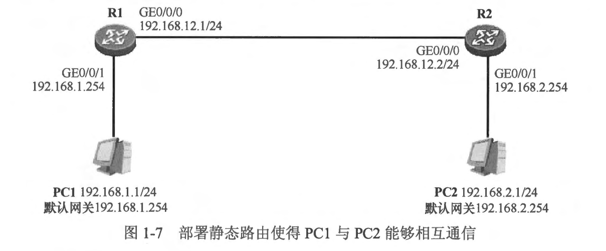
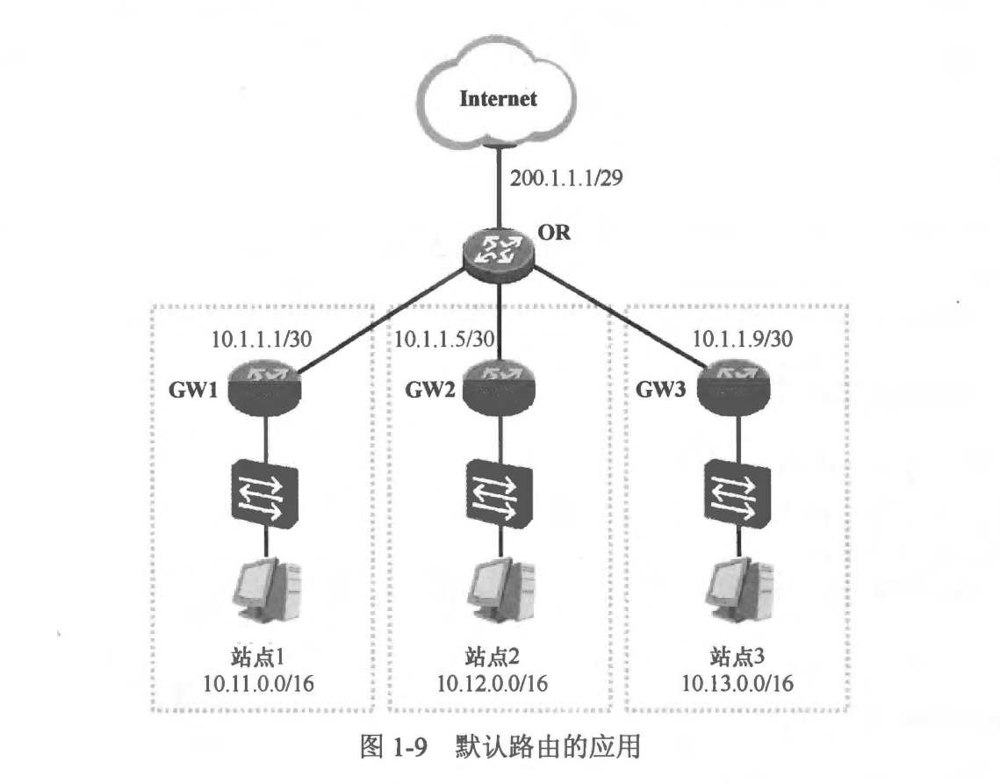
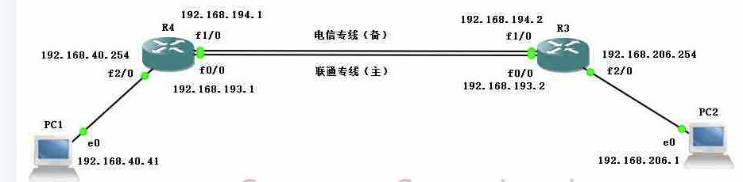

### 本章内容概述和教学目标
- 静态路由 (Static Route）是指网络管理员通过手工配置的方式为路由器创建的路由，通过这种方式，网络管理员可以非常简单、便捷地让路由器获知到达目的网络的路由。
- 本章学习目标
  - 理解静态路由的概念并掌握其配置
  - 理解默认路由的概念及其应用场景
  - 理解浮动静态路由的概念并掌握其配置
  - 掌握静态路由与 SLA 联动的方法及配置
  - 了解静态路由在书写时的一些注意事项


<br>
<br>

### 1.2.1 静态路由的基本概念
- 路由器能够自动发现直连路由并将其加载到路由表中，而对于到达非直连网络的路由，路由器就必须通过其他途径来获取，静态路由是一种最直接、最简单的方法。
- 所谓静态路由，也就是网络管理员使用手工配置的方式为路由器添加的路由，通俗的说法是，网络管理员通过手工配置的方式告诉路由器：“你要到达目的地 X，需把数据包从接口 Y 扔出去给下一跳 Z 〞。在网络中部署静态路由后，网络设备之问无需交互特别的协议报文(不像动态路由协议那样）。

<br>
<br>

### 1.2.2 静态路由基本配置
- 在 图 1-7 所示的网络中，我们首先为两台 PC 设置网卡卫地址及默认网关地址，然后完成 R1 及 R2 两合路由器的接口 IP 地址配置。在初始情况下，每合路由器都自动学习直连接口所在网段的路由，并将直连路由加载到路由表中。

- 现在我们在 R1 和 R2 的路由表中只能看到直连接口的路由。R1 能够与 R2 直接通信，因为两者直接相连，而当 PC1 要发送数据给 PC2 时，它通过将目的 IP 地址（PC2 的 IP 地址为 192.168.2.1）与本地网卡的 IP 地址及网络掩码进行运算，发现该目的 IP 地址是本地网段之外的一个地址，因此它意识到需要将发往 PC2 的报文先发送给自己的默认网关，由于 PC1 的默认网关被设置为 R1 的 GE0/0/1 接口的 IP 地址，于是 PC1 将数据包发送给 R1。 当 R1 收到这个数据包后，它在自己的路由表中查询报文的目的 IP 地址，结果发现并没有能够匹配该地址的路由条目，因此数据包被丢弃。显然，到目前为止 PC1 是无法与PC2 互访的。那么如何才能够使得 R1 正常地转发这个数据包呢？当然需要 R1 的路由表中拥有相关的条目来做指示才行。最简单的一种方式是使用手工配置的方式为 R1 添加到达192.168.2.0/24 的路由条目，也就是为R1创建一静态路由。

- 为R1创建一条静态路由指向192.168.2.0/24网段:
```shell
[R1] ip route 192.168.2.0 255.255.255.0 192.168.12.2
```
- 在设备的配置模式下，使用 ip route 命令即可为其创建静态路由。上面的命令将为 R1 的路由表添加一条静态路由，这条静态路由的目的网络地址及掩码长度为 192.168.2.0/24，下一跳 IP 地址是 192.168.12.2。

- 通过上面的配置，在 R1 的路由表里会出现了一个新增的条目指向 192.168.2.0/24，这样一来，当 R1 收到 PC1 发往 192.168.2.1 的数据包时，它发现路由表中有一个静态路由条目匹配该数据包的目的 IP 地址，于是它将该数据包从 GE0/0/0 接口送出并转发给下一跳 192.168.12.2。当这个数据包到达 R2 后，后者也在其路由表中查询目的 IP 地址 192.168.2.1，它发现该地址在本地路由表中有路由条目相匹配，而且该路由为直连路由，因此 R2 将数据包根据路由条目的指示从 GE0/0/1 接口转发出去，最终数据包到达 PC2。
- **R1 增加了这条静态路由后，PC1 就能够与 PC2 正常地交互数据了吗？** PC1 就能够 ping 通 PC2 了吗？答案是否定的，为什么呢？这是因为两个设备要实现正常的双向通信，必须保证双向路径可达。到目前为止，从 PC1 发往 PC2 的数据包确实是能够到达 PC2 的，但是从PC2 回程的数据包却无法回到 PC1。 回程数据包的目的 IP 地址是 192.168.1.1,这个数据包首先被 PC2 发往自己的默认网关，也就是 R2，后者查询路由表，却没有发现匹配该目的地址的路由，于是只能将数据包丢弃。因此，为了使得 PC1 与 PC2 之间能够相互通信，还需要再做一步操作，就是在 R2 上也增加一条路由，路由的目的网络地址及掩码长度是 192.168.1.0/24，下一跳 IP 地址当然就是 R1 的接口地址 192.168.12.1 了。

- R2 的配置如下：
```shell
[R2] ip route 192.168.1.0 255.255.255.0 192.168.12.1
```
- 如此一来，PC1 和 PC2 互相通信就没有问题了。
- 如果网络的规模比较小，全网部署静态路由似乎没有什么问题，但是在一个大型网络中，如果完全使用静态路由来实现数据互通，工作量就太大了，毕竟大型网络中包含的网段数量非常多，这意味着如果要确保网络中的每台设备都能够到达全网各个网段，网络管理员就不得不配置大量的静态路由。另外一个更重要的问题是，静态路由无法根据网络拓扑的变更作出动态调整，因此，在大规模网络中往往采用动态路由协议或者静态路由与动态路由协议搭配的方式来打通路由。

<br>
<br>

### 1.2.3 默认路由

- 图 1-9 展示了一个企业的网络，GW1、GW2 及 GW3 是该企业各个站点的网关路由器，这些路由器各下联一台以太网交换机，同时上联出口路由器 OR。以太网交换机连接着终端用户，出口路由器则连接着 Interet。在该场景中，以OR 为例，由于其连接着
Internet， 是整个网络的出口，因此它将负责把内网到达Internet 的数据包转发出去，当然网络管理员不太可能在 OR 上配置到达 Internet 的明细路由，毕竟整个 Internet 包含的网段实在太多了，要想让 OR 获知到达整个 Internet 的路由显然不现实。在这种场景中，使用默认路由 (Default Route）是一个非常不错的解决办法。默认路由也被称为缺省路由，是目的网络地址及网络掩码均为 0 的路由，即 0.0.0.0 0.0.0.0。这是一条非常特殊的路由，所有的目的 IP 地址都能被这条路由匹配。

- 如果在 OR 上部署静态路由，那么它可以采用如下配置：
[OR] ip route  0.0.0.0 0.0.0.0 200.1.1.1
[OR] ip route  10.11.0.0 255.255.0.0 10.1.1.1
[OR] ip route  10.12.0.0 255.255.0.0 10.1.1.5
[OR] ip route  10.13.0.0 255.255.0.0 10.1.1.9

- OR 创建了4条静态路由，其中 ip route 0.0.0.0 0.0.0.0 200.1.1.1 命令为 OR 创建了一条静态的默认路由，该路由的下一跳为 200.1.1.1 (OR 到达 Internet 的下一跳 IP 地址）。借助这条路由，路由器能够将访问 Internet 的数据转发出去。而去往三个站点内网的数据包到达 OR 时，报文会优先匹配 10.11.0.0/16、10.12.0.0/16 及 10.13.0.0/16 这三条静态路由，并被送达相应站点的网关路由器，而目的地址为其他网段的报文（包括访问 Internet 的报文〕则被默认路由匹配，被送往 200.1.1.1。
- 所有的目的 IP 地址都能够被默认路由匹配，那么在 OR 完成上述4条静态路由的配置后，当其收到去往某个站点的数据包时，为什么 OR 不会将该数据包转发到 200.1.1.1，而是将其转发到相应站点的网关路由器呢？
  - 以发往站点 1 的 10.11.1.1 这个 IP 地址的报文为例，当 OR 收到该报文时，它会在路由表中查询该报文的目的 IP 地址，结果发现静态路由 10.11.0.0/16 及 0.0.0.0/0 都匹配该地址，最终 OR 会选择 10.11.0.0/16 路由来指导报文转发，这其实是 “最长前级匹配原则”作用的结果，因为 10.11.0.0/16 路由与目的 IP 地址 10.11.1.1 的匹配程度更高。
- 从以上描述可以看出，默认路由的匹配优先级实际上是最低的，如果路由表中存在默认路由，则只有当路由器没有发现匹配报文日的 IP 地址的任何具体路由之后，才会使用这条默认路由来转发数据，因此默认路由的下一跳又被视为“最后的求助对象”。
- 对于 GW1、GW2 及GW3 这三台网关路由器来说，也可以分别配置静态默认路由，它们只需将默认路由的下一跳配置为 OR 即可实现数据的全网可达。当它们转发到达其他站点的报文时，报文的目的地址能够被默认路由匹配，因此被送往 OR，并由 OR 进一步转发到目的站点，而当它们转发到达 Internet 的报文时，报文的目的地址也匹配默认路由，并被送往 OR，再由 OR 转发到 Internet。

- **默认路由在实际的项目中有着广泛的应用。当然，默认路由不仅可以通过静态的方式实现，动态路由协议同样支持默认路由的动态下发。**

### 1.2.4 浮动路由
### 1.2.5 汇总路由
### 1.2.6 静态路由出接口
### 1.2.7 ODR
### 1.2.8 静态路由侦测SLA
- IP SLA(Internet Protocol Service-Level Agreement)互联网服务等级协议，本实验里通过发送测试报文，测试下一跳是否可达，结合Track实现冗余静态路由的切换。

- 实验要求:
  - R4模拟某公司专线接入路由器，R3模拟对端银行网络设备。
  - R4和R3之间通过两条专线互联，联通专线为主链路，电信专线为备链路。
  - PC1模拟公司客户端服务器，PC2模拟银行服务端服务器。PC1通过专线访问银行服务端PC2。
- 实验目的：
  - 当主链路出问题时，自动切换到备份链路。

- 具体配置:
- R4:
```shell
R4#show ip int b
Interface                  IP-Address      OK? Method Status                Protocol
FastEthernet0/0            192.168.193.1   YES manual up                    up
FastEthernet1/0            192.168.194.1   YES manual up                    up
FastEthernet2/0            192.168.40.254  YES manual up                    up
```
- R3:
```shell
R3#show ip int b
Interface                  IP-Address      OK? Method Status                Protocol
FastEthernet0/0            192.168.193.2   YES manual up                    up
FastEthernet1/0            192.168.194.2   YES manual up                    up
FastEthernet2/0            192.168.206.254 YES manual up                    up

```
- R4 的 IP SLA配置命令:
```shell
R4#conf t
R4(config)#ip sla monitor 11
R4(config-sla-monitor)#type echo protocol ipIcmpEcho 192.168.193.2 source-interface f0/0
R4(config-sla-monitor-echo)#timeout 1000
R4(config-sla-monitor-echo)#frequency 3
R4(config-sla-monitor-echo)#exit
R4(config)#ip sla monitor schedule 11 life forever start-time now
R4(config)#track 1 rtr 11 reachability
R4(config-track)#exit
// 静态路由（主链路）：
R4(config)#ip route 192.168.206.1 255.255.255.255 192.168.193.2 track 1
// 浮动静态路由（备份链路）：
R4(config)#ip route 192.168.206.1 255.255.255.255 192.168.194.2 10
```
-  R3 的 IP SLA配置命令:
```shell
R3#conf t
R3(config)#ip sla monitor 11
R3(config-sla-monitor)#type echo protocol ipIcmpEcho 192.168.193.1 source-interface f0/0
R3(config-sla-monitor-echo)#timeout 1000
R3(config-sla-monitor-echo)#frequency 3
R3(config-sla-monitor-echo)#exit
R3(config)#ip sla monitor schedule 11 life forever start-time now
R3(config)#track 1 rtr 11 reachability
R3(config-track)#exit
// 静态路由（主链路）：
R3(config)#ip route 192.168.40.41 255.255.255.255 192.168.193.1 track 1
// 浮动静态路由（备份链路）：
R3(config)#ip route 192.168.40.41 255.255.255.255 192.168.194.1 10
```
- 测试:
```shell
// 当前主链路静态路由
R4#show ip route static
192.168.206.0/32 is subnetted, 1 subnets
S       192.168.206.1 [1/0] via 192.168.193.2
R3# show ip route static
192.168.40.0/32 is subnetted, 1 subnets
S       192.168.40.41 [1/0] via 192.168.193.1
// 把主链路一边端口down掉
R4#conf t
R4(config)#int f0/0
R4(config-if)#shutdown
R4(config-if)#end
// 3秒后已切换为备用静态路由
R4#show ip route static
192.168.206.0/32 is subnetted, 1 subnets
S       192.168.206.1 [10/0] via 192.168.194.2
R3#show ip route static
192.168.40.0/32 is subnetted, 1 subnets
S       192.168.40.41 [10/0] via 192.168.194.1
```

- 实验总结:
  - 在双方设备条件允许情况下，可以使用 BFD检测机制，提供毫秒级检测。大多数情况下，由于银行网络设备厂商不同、设备新旧程度不同，可能不支持BFD协议，所以IP SLA作为备选方案提供秒级的检测。华为的NQA技术和cisco IP SLA 类似。