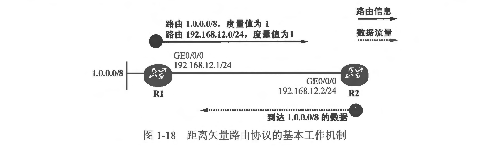

### 本章内容概述和教学目标
- 对于一个小型网络，静态路由或许已经能够满足需求，但是在大中型网络中，由于网段数量特别多、网络拓扑复杂等原因，仅仅使用静态路由来实现数据互通显然是不太现实的一一配置及维护工作量都太大，再者静态路由无法动态地响应网络拓扑变更。此时就需要考虑另一种方案--动态路由协议 (Dynamic Routing Protocol)了。
- 当我们在路由器上激活了动态路由协议后，就相当于激活了路由器的某种能力，路由器之间就能够交互路由信息或者用于路由计算的数据，而当网络拓扑发生变更时，动态路由协议能够感知这些变化并且自动地作出响应，从而使得网络中的路由信息适应新的拓扑，这种动作完全由协议自动完成，无需人为干预。因此在一个规模较大的网络中，我们往往会使用动态路由协议，或者静态路由与动态路由协议相结合的方式来建设该网络。
- 动态路由协议有很多，而分类的方法也存在多种。基于协议算法不同，可以将动态路由协议分成两类：
  - 距离矢量路由协议 (Distance Vector Routing Protocol)
  - 链路状态路由协议 (Link State Routing Protocol)

- 本章学习目标:
- 对动态路由有一个初步的了解

 
 

### 1.3.1 距离矢量路由协议
- 距离大量路由协议指的是基于距离矢量的路由协议，RIP 是最具代表性的距离矢量路由协议，“距离矢量”这个概念包含两个关键的信息：“距离”和“方向”，其中“距离”指的是到达目标网络的度量值，而方向指的是到达该目标网络的下一跳设备。每一台运行距离矢量路由协议的路由器都会周期性地将自己的路由表通告出去，其直连的路由器会收到这些路由信息，在学习前者通告的路由并更新自己的路由表后，它也会向自己直连的路由器通告其路由表，最终网络中的每台路由器都能获知到达各个网段的路由，这个过程被称为路由的泛洪（Flooding）过程。
- 下面粗略地看一下距离矢量路由协议的工作过程。在图1-18中，R1 及 R2 两合路由器直连。初始情况下 R1 及 R2 都只知道自己 “家门口的情况”，也就是说，R1 及 R2 都自动发现了自己直连接口的路由。R1 在其路由表中写入 192.168.12.0/24 及 1.0.0.0/8 两条直连路由，而 R2 则在其路由表中写入 192.168.12.0/24 这一条直连路由。当然此刻 R2 是无法访问 1.0.0.0/8 的，因为在它的路由表中并没有任何能够到达这个网段的路由信息。

- 在R1 和 R2 上激活距离矢量路由协议后，R1 将已经发现的路由（1.0.0.0/8 及 192.168.12.0/24）通过路由协议报文通告给 R2，这两条路由各附带着一个度量值。以距离矢量路由协议的典型代表 RIP 为例，它使用跳数(Hop Count）作为路由的度量值，所谓跳数就是到达目的网段所需经过的路由器的个数，直连网段的度量值被视为 0 跳。R1将两条直连路由通告给 R2 时，为路由设置的跳数为 1，因为：“我家门口的这些网段对于我自己而言可以直接到达（只需 0 跳)，现在别人要经过我来访问该网段，就需要加上我这一跳”。由于 192.168.12.0/24 是R2 自己的直连网段，因此 R2 会忽略 R1 通告过来的、到达该网段的路由更新，而 1.0.0.0/8 路由对于 R2 而言是未知的，因此 R2 将这条路由加载进路由表，同时为该条路由关联度量值：1跳，并且把路由的通告者 R1 视为该条路由的下一跳。于是当 R2 要转发到达1.0.0.0/8 的数据包时，就会将数据包发给下一跳路由器 R1。形象点的理解就是：“ R2 认为 1.0.0.0/8 可以通过 R1 到达，自己与该网段距离 1 跳路由器〞，这就是“距离矢量”名称的由来。
- 运行距离矢量路由协议的路由器并不了解网络的拓扑结构，该路由器只知道：
  - 自己与目的网络之间的距离
  - 从哪个方向可到达目的网络

 
 

### 1.3.2 链路状态路由协议
- 链路状态路由协议与距离矢量路由协议不同，运行链路状态路由协议的路由器会使用一些特殊的信息描述网络的拓扑结构及 IP 网段,这些信息被称为链路状态(Link State)信息，所有的路由器都会产生描达自己直连接口状况的链路状态信息。路由器将网络中所泛洪的链路状态信息都搜集起来并且存入一个数据库中，这个数据库就是 LSDB(Link-State Database，链路状态数据库)，LSDB 可以视为对整个网络的拓扑结构及卫网段的描绘，所有路由器拥有对该网络的统一认知，接下来所有的路由器都基于 LSDB 使用特定的算法进行计算，计算的结果是得到一棵以自己为根的、无环的最短路径树，并将基于这棵树得到的路由加载到路由表中。典型的链路状态路由协议有 OSPF 及 IS-IS。
- 以上为展示的是基于协议算法的不同所进行的路由协议分类。实际上路由协议还存在其他分类方法，
- 例如根据工作范围的不同，动态路由协议可分为两类：
  - IGP (Interior Gateway Protocol， 内部网关协议），例如 RIP、OSPF、IS-IS 等
  - EGP (Exterior Gateway Protocol，外部网关协议），例如 BGP (Border Gateway Protocol)等。
- IGP 被用于在 AS (Autonomous System，自治系统）内部实现路由信息的交互，而EGP 则被用于在 AS 之间实现路由信息的交互。关于 AS 的传统定义是，由一个单一的机构或组织所管理的一系列 IP 网络及其设备所构成的集合，我们可以简单地将 AS 理解为一个独立的机构或者企业所管理的网络，例如一家网络运营商的网络等。

