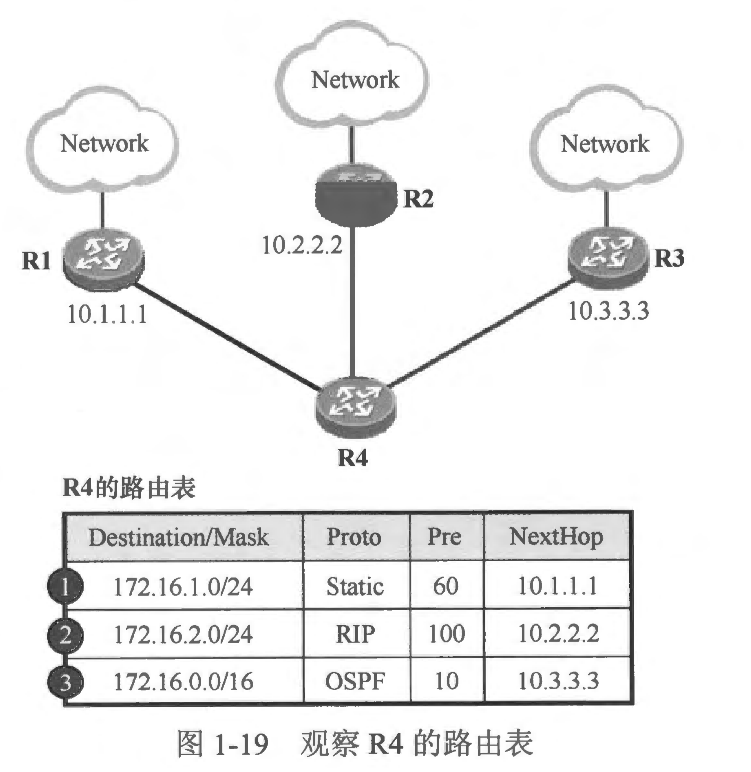
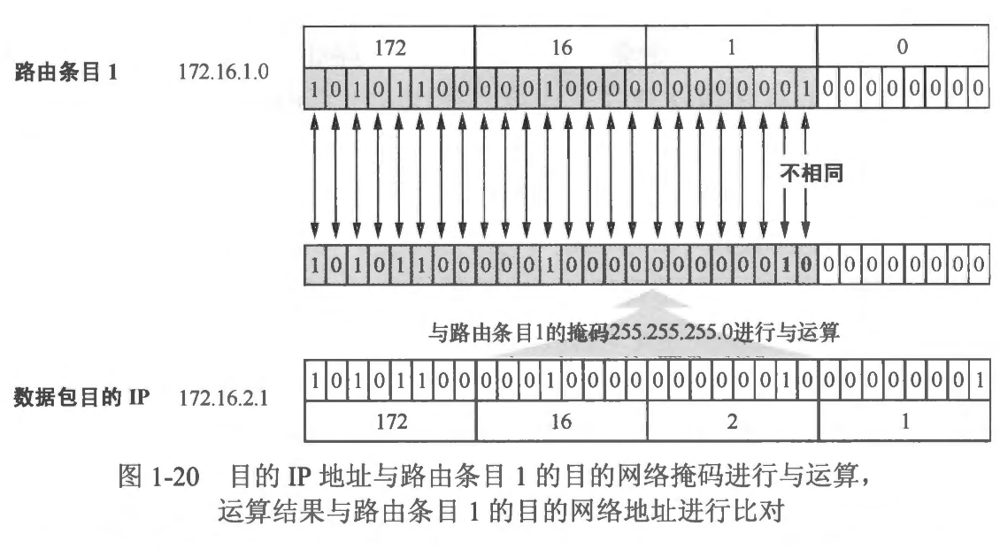
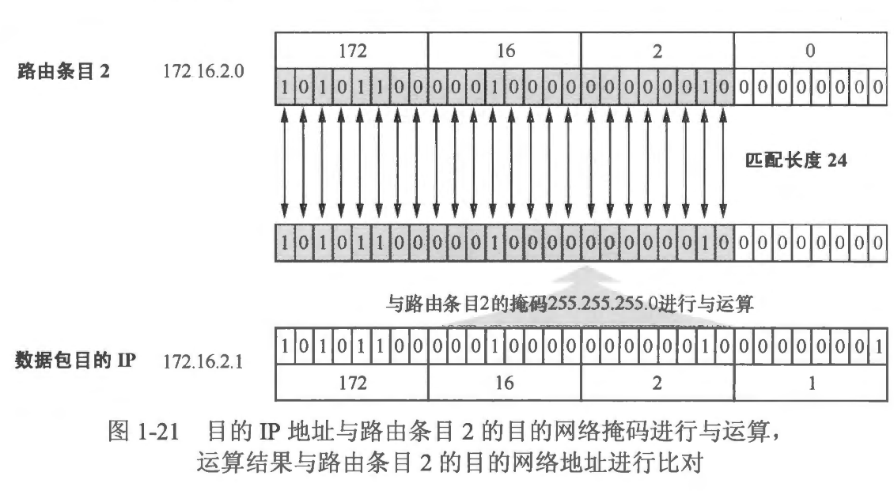
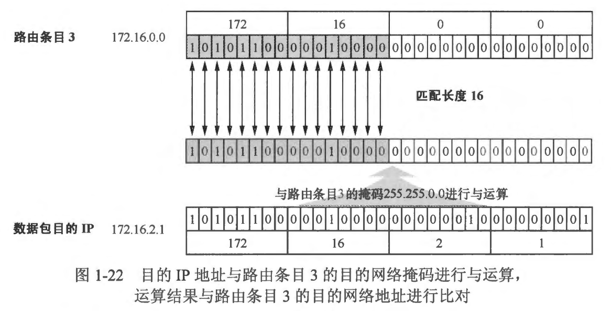
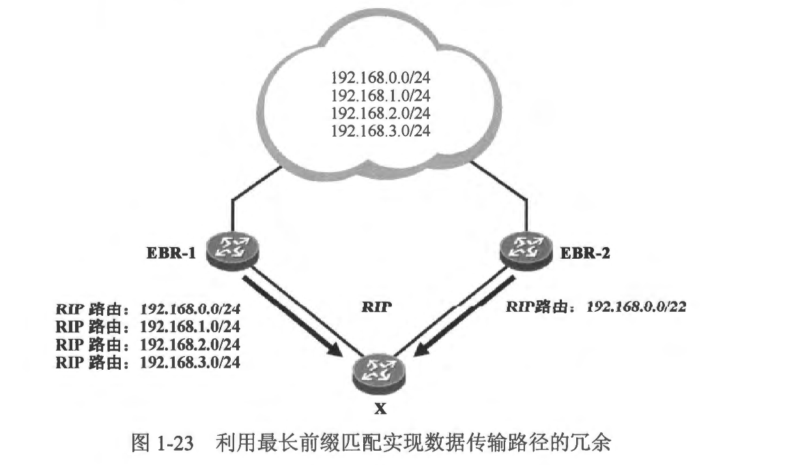

### 本章内容概述和教学目标
- 最长前缀匹配机制 (Longest Prefix Match Algorithm）是目前行业内几乎所有的路由器都缺省采用的一种路由查询机制。当路由器收到一个数据包时，它会将数据包的目的 IP 地址与自己本地路由表中的所有路由表项进行逐位（Bit- By-Bit）比对，直到找到匹配度最长的条目，这就是最长前缀匹配机制。下面通过一个例子来详细地讲解这个机制:
  - 在图 1-19 展示的図中，路由器 R4的路由表中除了直连路由之外，还有三条路由，分別是 172.16.1.0/24、172.16.2.0/24 以及 172.16.0.0/16，三个路由条目分别关联不同的出接口和下一跳 IP 地址。那么当 R4 收到一个到达 172.16.2.1 数据包时，它将把数据包转发给哪一台路由器呢？
  
  - R4 将进行如下操作:
    - 将报文的目的 IP 地址 172.16.2.1 和路由条目1 的目的网络掩码 255.255.255.0 进行“逻辑与”运算，将运算结果与路由条目 1 的目的网络地址的前面 24bit（比特，也就是二进制的位）进行比对。
    - 如图 1-20 所示，结果发现有两个比特位不相同，因此判断出这个目的 IP 地址与路由条目 1 不匹配。R4 将不会使用这条路由转发到达 172.16.2.1 的数据包。
    
    - 将目的 IP 地址 172.16.2.1 和路由条目 2 的目的网络掩码 255.255.255.0 进行“逻辑与”运算，将运算结果与路由条目2 的目的网络地址的前面 24bit 进行比对。
    - 如图 1-21 所示，发现每一个比特位都是相同的，因此该目的 IP 地址匹配这条路由，而且匹配结果是 172.16.2.0/24，也就是说匹配长度为 24。
    
    - 将目的 IP 地址 172.16.2.1 和路由条目3 的目的网络掩码 255.255.0.0 进行“逻辑与” 运算，将运算结果与路由条目3 的目的网络地址的前面 16bit 进行比对。
    - 如图 1-22 所示，发现每一个比特位都是相同的，因此该目的 IP 地址匹配这条路由，而且匹配结果是 172.16.0.0/16，也就是说匹配长度为 16。
    - 有两条路由匹配目的 IP 地址 172.16.2.1，路由条目2的匹配结果为 172.16.2.0/24,而路由条目了的匹配结果为 172.16.0.0/16，因此条目 2 的匹配度更长，最终 R4 将采用路由条目 2 来转发到达 172.16.2.1 的数据包，这些数据包被转发给 R2。
     

    

- 目前行业内几乎所有厂商的路由器缺省都在使用该机制。而且，利用这个机制还能实现数据传输路径的冗余或负载分担。
  - 在图 1-23 所示的某企业网络中，EBR-1 及 EBR-2 是两合企业边界路由器，它们连接着一个企业网络，在该网络中，存在着 192.168.0.0/24、192.168.1.0/24、192.168.2.0/24 及 192.168.3.0/24 4 个网段，两台企业边界路由器都具备到达上述网段的 IP 连通性。
  - 现在路由器 X 与 EBR-1 及 EBR-2 建立了连接，并且运行了 RIP，企业对 EBR-1 及 EBR-2有着完全的操控权限，但是对 X 并不具备操控权限，只能简单地将路由信息通告给 X。
  - 现在，企业的要求是，通过在 EBR-1 及 EBR-2 上完成相应的配置，使得 X 将到达上述 4 个网段的数据包转发到 EBR-1，当 EBR-1 发生故障时，X 将数据包平滑地切换到 EBR-2。
  - 要实现上述需求非常简单，即让 EBR-1 向又 通告到达 192.168.0.0/24、 192.168.1.0/24、192.168.2.0/24 及 192.168.3.0/24 这4个网段的路由，而E BR-2 仅向 X 通告一条 192.168.0.0/22 路由，实际上这条路由是这 4 个网段的汇总路由，可以简单地理解为 192.168.0.0/22 将192.168.0.0/24、192.168.1.0/24、192.168.2.0/24 及 192.168.3.0/24 都囊括在内。完成上述部署后，X 的路由表中将出现 5 条RIP路由。在网络正常时，发往这 4 个网段的数据包在到达 X 后，根据最长匹配原则，报文的目的 IP 地址将被 EBR-1 所通告的 4 条路由所匹配，因此被 X 转发给 EBR-1，而当 EBR-1 或 EBR-1 与 X 之间的互联链路发生故障时，又的路由表中原来 EBR-1 所通告的 4 条路由消失，仅剩 EBR-2所通告的路由，因此到达这 4 个网段的数据包将被该路由匹配，从而被转发给 EBR-2，这就实现了数据转发路径的冗余。
