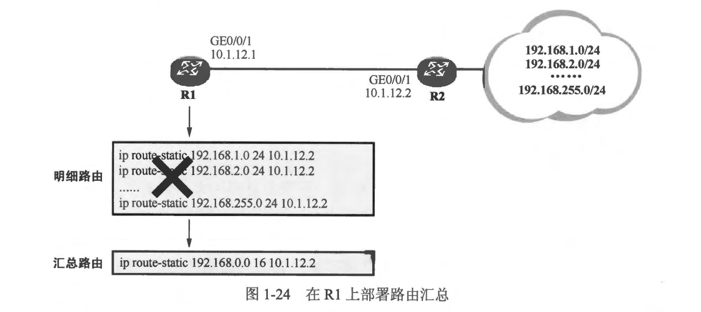

### 本章内容概述和教学目标
- 随着业务对网络的需求不断增加，网络的规模在逐渐变大。对于一个大规模的网络来说，路由器或其他具备路由功能的设备势必需要维护大量的路由表项，为了维护臃肿的路由表，这些设备就不得不耗费大量的资源。
- 当然，在一个规模更大的路由表中进行查询时，路由器也会显得更加吃力。因此在保证网络中的路由器到各网段都具备卫可达性的同时，如何减小设备的路由表规模就是一个非常重要的课题。一个网络如果具备科学的 IP 编址，并且进行合理的规划，是可以利用多种手段减小设备路由表规模的。一个非常常见而又有效的办法就是使用路由汇总 (Route Summarization 或 Route Aggregation)。
- 路由汇总又被称为路由聚合，是将一组有规律的路由汇聚成一条路由，从而达到减小路由表规模以及优化设备资源利用率的目的，我们把汇聚之前的这组路由称为精细路由或明细路由，把汇聚之后的这条路由称为汇总路由或聚合路由。
- 在图 1-24 所示的网络中，对于 R1 而言，如果要到达 R2 右侧的 192.168.1.0/24、192.168.2.0/24 …… 192.168.255.0/24，自然是要有路由的，若手工为每个网段配置一条静态路由，这就意味着要给 R1 手工配置 255 条静态路由，显然工作量太大了，R1 的路由表也将变得非常臃肿。

- 在这个场景中如果不在 R1 上配置这些静态路由，而是使用一条指向 R2 的默认路由似乎就可以解决上达问题，通过这条默认路由，R1 能够到达 R2 右侧的所有网段，而且其路由表被极大地精简了。但是默认路由的“颗粒度”太大，无法做到对路由更为细致的控制，而且如果 R1 的其他接口还连接了一条出口链路并且己经在这个出口上使用了默认路由，那么这里只能另想他法了。
- 路由汇总可以很好地解决这个问题。原来需使用 255 条 明细路由，而运用路由汇总的思想后，仅仅使用一条路由即可实现相同的效果，例如在 R1 上进行如下配置：
```shell
[R1] ip route 192.168.0.0 255.255.0.0 10.1.12.2
```
- 以上的配置便是在 R1 上创建一条静态的汇总路由，该路由的目的网络地址及掩码长度为 192.168.0.0/16。
- 192.168.0.0/16 实际上是将 192.168.1.0/24、192.168.2.0/24 …… 192.168.255.0/24 这些网段都“囊括” 在内了。在 R1 上使用这样配置，一个直接的好处就是其路由表条目数量大大减少了。
- 路由汇总是一个非常重要的网络设计思想，通常在一个大中型网络的设计过程中，必须时刻考虑网络及路由的可优化性，其中路由的可汇总性往往就是一个非常关键的指标。在这个例子中实际上是部署了静态的路由汇总，当然，几乎所有的动态路由协议也都支持路由汇总功能。
- 路由的汇总实际上是通过对目的网络地址和网络掩码的灵活操作实现的，形象的理解就是，用一个能够囊括这些小网段的大网段来替代它们。然而汇总路由的计算是要非常谨慎和精确的，否则可能导致路由的紊乱，如图 1-25 所示的例子: 

- 为了让R2能够到达 R1 左侧的网段，出于网络优化的目的，我们为其配置了一条静态的汇总路由：
```shell
[R2] ip route 172.16.0.0 255.255.0.0 10.1.12.1
```
- 虽然这确实起到了网络优化的目的，但是，这条汇总路由太 “粗犷”了，它甚至将 R3 右侧的网段也囊括在内，如此一来，去往 R3 右侧网段的数据包在到达 R2 后，就有可能被 R2 转发到 R1，从而导致数据包的丢失，我们称这种路由汇总行为不够精确。因此，一种理想的方式是，为 R2 配置一条“刚刚好” 囊括所有明细路由 （例如R1左侧的这些网段）的汇总路由，这样一来就可以避免汇总不够精确的问题。

- 那么如何进行汇总路由的精确计算呢？下面再来看一个例子:
  - 现有明细路由:
    - 172.16.1.0/24、172.16.2.0/24 ……… 172.16.31.0/24，请计算出关于这些明细路由的、最精确的汇总路由 （换句话说，计算出一个掩码长度最长的汇总路由)。大家要做的事情非常简单，将明细路由的目的网络地址都换算成二进制，然后排列起来，找出所有目的网络地址中 “相同的比特位”。由于这些明细路由的目的网络地址是连续的，因此实际上只要挑出首尾的两到三个目的网络地址来计算就足够了，具体的过程如下:
    - 将这些 IP 地址写成二进制形式，然后按图 1-26 所示进行排列，实际上只要考虑第三个8位组即可，因为只有它是在变化的。
    - 接着画一根竖线，要求是:
      - 这根线的左侧每一列的二进制数值都是一样的，而线的右侧则无所谓，可以是变化的，这根线的最终位置，就标识了汇总路由的掩码长度。注意，这根竖线可以从默认的掩码长度，例如 24 开始，一格一格地往左移，直到线的左端每一列数值都相等时即可停下，这时候，这根线所处的位置就刚刚好。这样一来就找出了所有明细路由的目的网络地址中共同的比特位。
    - 如图 1-26 所示，线的位置是 19，所以经计算得到汇总路由的目的网络地址及掩码长度 172.16.0.0/19，这就是一个最精确的汇总地址，换句话说，是一个掩码最长的汇总地址。
    
    - 因此，图 1-25 所示的例子，可以在 R2 上进行如下配置：
    ```shell
    [R2]ip route 172.16.0.0 255.255.224.0 10.1.12.1
    [R2]ip route 172.16.32.0 255.255.224.0 10.1.23.3
    ```
    - 也就是将 R1 左侧的网段进行精确汇总，得到汇总网络地址及掩码长度: 172.16.0.0/19，然后在 R2 上配置相应的静态汇总路由，将下一跳配置为 R1
    - R3 右侧的网段进行精确汇总，得到汇总网络地址及掩码长度: 172.16.32.0/19，然后也在 R2 上配置相应的静态汇总路由，并将下一跳配置为 R3。


<br>
<br>

