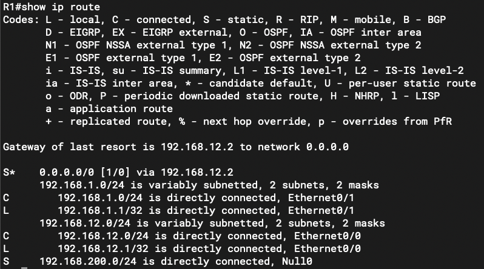

### 本章内容概述和教学目标
- 一般来说，一条路由无论是静态的或者是动态的，都需要关联到一个出接口，路由的出接口指的是设备要到达一个目的网络时的出站接口。路由的出接口可以是该设备的物理接口，如百兆、千兆以太网接口，也可以是逻辑接口，如 VLAN 接口 (VLAN Interface），或者是隧道（Tunnel）接口等。在众多类型的出接口中，有一种接口非常特殊，那就是 Null （无效，接口，这种类型的接口只有一个编号，也就是0。Null0 是一个系统保留的逻辑接口，当网络设备在转发某些数据包时，如果使用出接口为 Null0 的路由，那么这些报文将被直接丢弃，就像被扔进了一个黑洞里，因此出接口为 Null0 的路由又被称为黑洞路由。
- 黑洞路由是一种颇有用处的路由。
- 在图 1-28中，R1 的 GEO/0/0 连接着一个终端网络，处于该终端网络的 PC 将默认网关设置为 R1 的 GE0/0/0 接口卫地址，而为了让 PC 能够访问 R2 右侧的服务器网络，我们在 R1 上配置了一条默认路由:
```
[R1] ip route 0.0.0.0 0.0.0.0 192.168.12.2
```

- 当 PC 访问本地网段 192.168.1.0/24 之外的资源(包括服务器网络中所有的网段）时，流量都会先被发往 R1，然后由 R1 转发给 R2。
- 现在网络中出现这样一个需求: 在服务器网络中，有一个特殊的网段一-192.168.200.0/24 并不希望被 PC 访问，能否仅仅通过路由的配置来实现这个需求？
- 答案是肯定的，使用黑洞路由便可。R1可增加如下配置:
```
[R1] ip route 192.168.200.0 255.255.255.0 NULLO
```
- 使用上述命令可为 R1 增加了一条到达 192.168.200.0/24 的路由，而且该条路由的出接口是 Null0。完成上达配置后，先查看一下R1 的路由表:

- 从路由表中，大家可以看到我们为 R1 所配置的黑洞路由。现在，当 PC 访问 192.168.200.0/24 时，数据包先被送到默认网关 R1，R1 通过路由表查询，发现数据包的目的 IP 地址匹配路由 192.168.200.0/24，而该条路由的出接口是 Null0，因此它将数据包直接丢弃。如此一来，PC 将无法再访问 192.168.200.0/24。实际上，这是一种实现流量过滤的简单而又有效的方法。
- 当然，黑洞路由除了在上述场景中使用，还能用于各种其他场景，例如:
  - 在部署了路由汇总的网络中，用于防止数据转发出现环路
  - 在部署了 NAT (Network Addres Translation，网络地址转换）的网络中，用于防止数据转发出现环路
  - 在BGP 网络中，用于发布特定网段的路由

<br>
<br>

