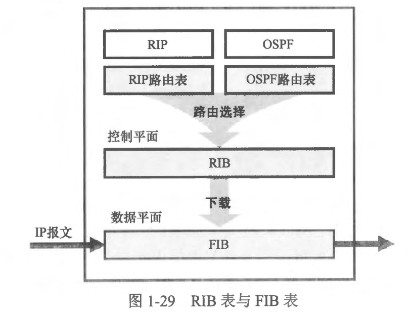
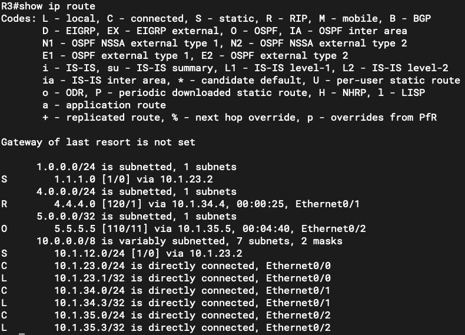
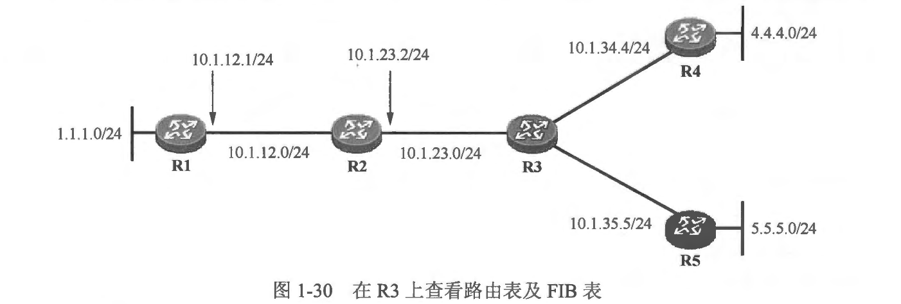
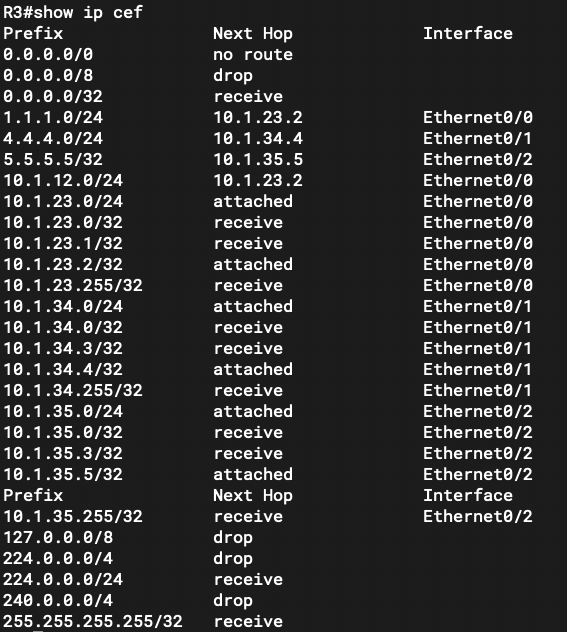

### 本章内容概述和教学目标
- 具备路由功能的网络通信产品 (例如路由器、三层交换机等）都维护着两种非常重要的数据表：
  - 路由表 (Routing table)，也被称为路由信息库(Routing Information Base, RIB)
  - 数据转发表，也被称转发信息库(ForwardingInformation Base, FIB)
- 首先每台路由器都维护着一张全局路由表，另外路由器所运行的每种路由协议也维护着该协议自己的路由表。对于全局路由表，大家已经非常熟悉了，使用 show ip route 命令所输出的表格就是全局路由表。
- 路由器可以通过多种途径获取路由信息，例如，它可以运行多种动态路由协议，而通过每一种动态路由协议所获知的路由信息首先存储于该协议自己的路由表中，然后路由器根据路由优先级和度量值等信息来进行路由的优选，并将被优选路由加载到全局路由表中。
- 路由表指的就是全局路由表。我们将路由表视为位于路由器的控制平面。
- 如图 1-29 所示，实际上路由表并不直接指导数据转发，换句话说，路由器在执行路由查询时，并不是在路由表中进行报文目的地址的查询，真正指导数据转发的是 FIB 表，路由器将路由表中的活跃路由下载到 FIB 表，此后如果路由表中的相关表项发生变化，FIB 表也将立即同步。由于两张表的一致性，也因为路由表阅读起来更加直观，因此在绝大多数场合中，我们在阐述路由器数据转发过程时，会用"路由器通过查询路由表来决定数据转发的路径"这一说法，但是需要注意，实际上，路由器查询的是 FIB 表，位于控制层面的路由表只是提供了路由信息而己。

- FIB 表是位于路由器数据平面的表格，实际上它在外观上与路由表非常类似。FIB 的表项被称为转发表项，每条转发表项都指定要到达某个目的地所需通过的出接口及下一跳 IP 地址等信息。路由器将优选的路由存储在路由表中，而将路由表中活跃的路由下载到 FIB 表，并使用 FIB 表转发数据。路由表通常是存储在设备的动态内存中，例如 RAM (Random Access Memory，随机存取存储器），而 FIB 表中的数据则往往被存储在一个 ASIC (Application Specific Integrated Circuit, 专用集成电路)中，这使得设备在 FIB 中进行数据查询时，可以实现相当高的速度。当然，用于存储 FIB 表的空间是有限的，因此在大型的网络中要关注设备的路由表规模，在保证数据可达的前提下，通过各种机制或手段来减小设备路由表的规模。
- 在图1-30 所示的网络中，R3 的路由表如下:


- 从上述输出可以看出，R3 配置了两条静态路由，分别用于到达 1.1.1.0/24 及 10.1.12.0/24。另外，R3 还运行了 RIP 及 OSPF，并通过 RIP 学习到了 4.4.4.0/24 路由，通过 OSPF 学习到了 5.5.5.0/24 路由。除此之外，R3 还自动发现了直连接口的路由。留意 R3 上的两条静态路由，实际是按如下方式配置的:
```shell
[R3] ip route 10.1.12.0 255.255.255.0 10.1.23.2
[R3] ip route 1.1.1.0 255.255.255.0 10.1.23.2
```
- 到达 1.1.1.0/24 的这条静态路由的下一跳 IP 地址是 R1 的接口 IP 地址，该地址并非 R3 直连可达，显然，R3 不可能将到达该网段的数据包直接转发给 R1，因为它与 R1 没有直连，报文无法 “隔空” 发送过去，另外该条静态路由也没有明确出接口信息。因此 R3 需要在路由表中以下一跳地址 10.1.23.2 为目的地址进行查询，看看是否有与 10.1.12.1 匹配的路由表项，从而得到路由的出接口。R3 的这种行为被称为路由递归查询。
- 现在再来看看 R3 的FIB 表，使用 show ip cef 命令可以进行 FIB 的查看:


- 从上述输出可以看出，R3 路由表中所有的表项都已经下载到了 FIB 表中，并且 R3 针对每一条路由都完成了递归查询操作并得到路由的出接口以及在直连网络中的下一跳 IP 地址。以 1.1.1.0/24 这条路由为例，在FIB 表中， Nexthop 为 10.1.23.2，出接口为 Ethernet0/0,显然已经完成了递归查询，这大大提高了路由执行的效率。现在当 R3 收到一个去往 1.1.1.0/24 的数据包时，便在 FIB 中进行查询，找到匹配项 1.1.1.0/24 后，即可将数据转发出去，而不用再进行递归操作。

<br>
<br>

