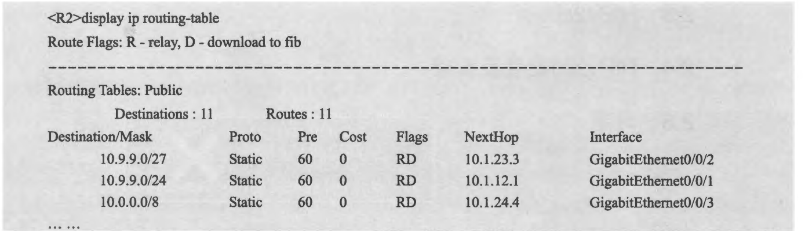
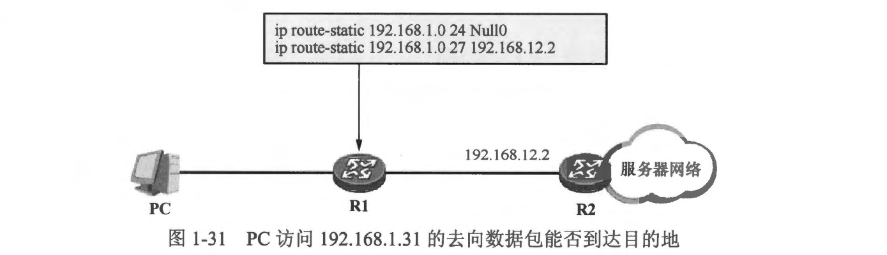

#### 课后练习

1.（单选）针对以下明细路由，如果想要部署路由汇总，那么最能精确囊括它们的汇总路由是( )。
10.1.192.0/24
10.1.193.0/24
10.1.194.0/24
.......
10.1.206.0/24
10.1.207.0/24

A. 10.1.192.0/20
B. 10.1.192.0/18
C. 10.1.128.0/17
D. 10.1.0.0/16

2.(多选）以下关于路由的说法正确的是( )。
A．路由是一种逐跳(Hop-By-Hop）的行为，也就是说数据从源被发出，直至其到达目的地的过程中，处于转发路径上的路由器都需要拥有到达目的网段的路由
B．在缺省情况下，静态路由的优先级比 OSPF 路由更高
C．在缺省情况下，直连路由及静态路由的度量值均为 0
D．配置静态路由时，如果该路由的出接口为以太网接口，则命令中必须指定明确的下一跳 IP 地址，否则通信将可能出现问题

3.网络管理员在路由器上配置了一条静态路由，但是查看该路由器的路由表时却并未发现配置完成的静态路由，这种现象可能是什么原因造成的？

4.如果某台路由器的路由表如下所示，则当该路由器收到发往 10.9.9.33 的报文时，它会将报文转发给哪一个下一跳？为什么？

5.在图 1-31 中，R1 配置了两条静态路由，PC 将默认网关设置为 R1。此时如果 PC 访问位于服务器网络中的 192.168.1.31，则去向流量抵达默认网关 R1 后，R1 会如何处理？为什么？

