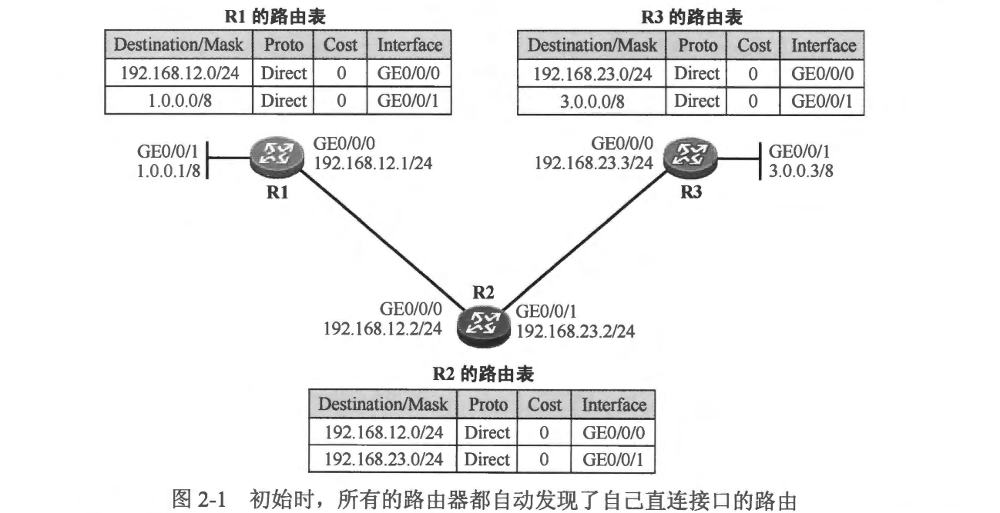
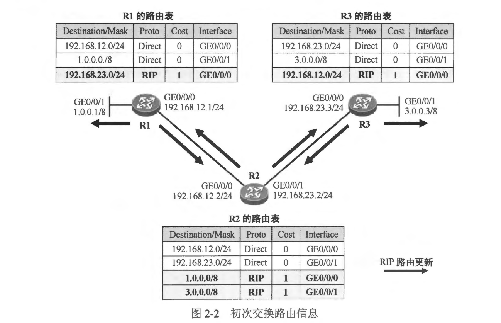
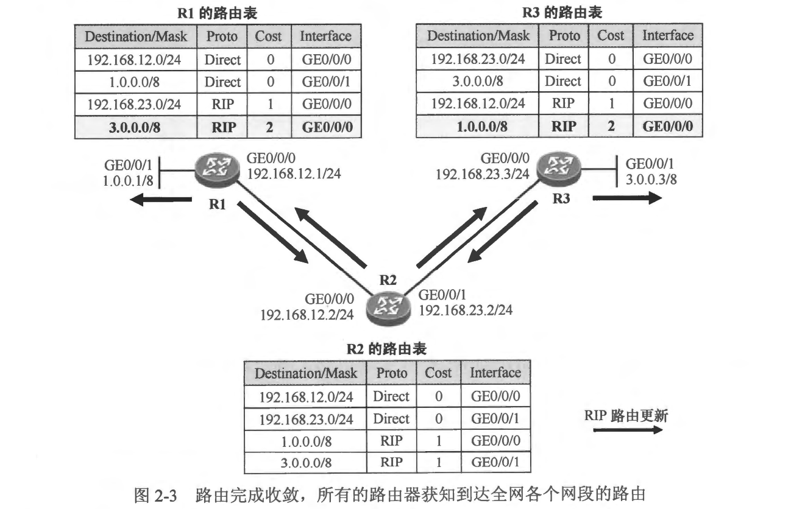
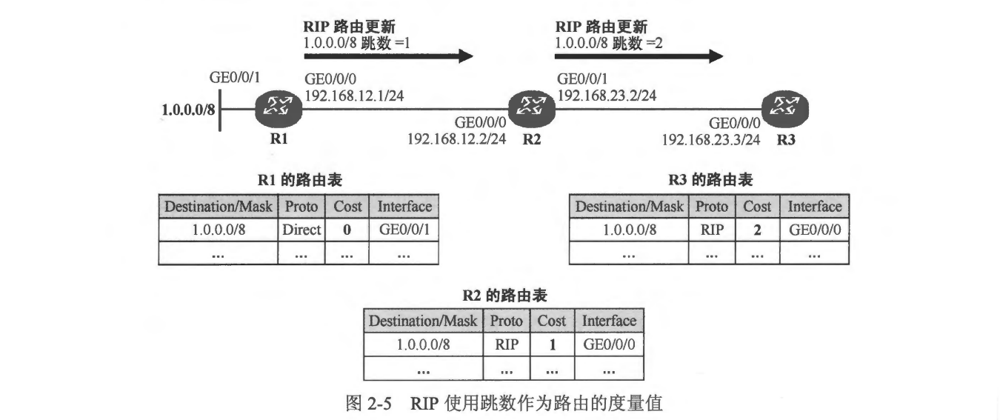
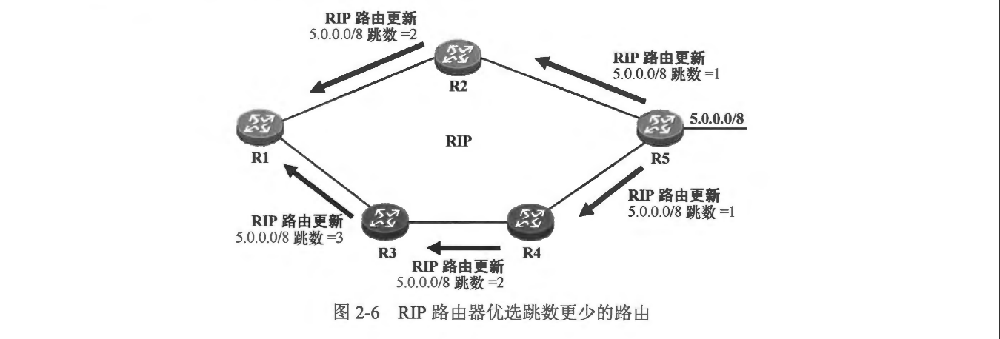
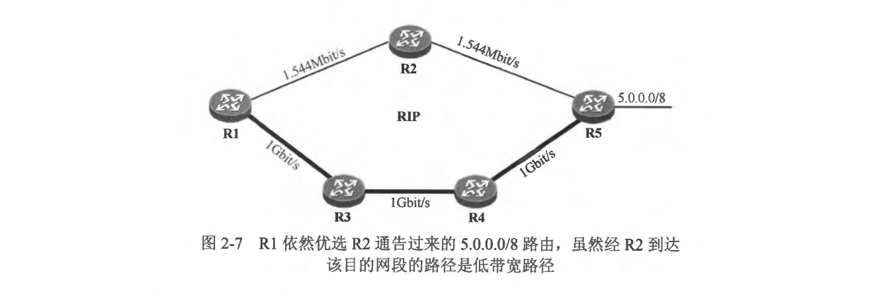
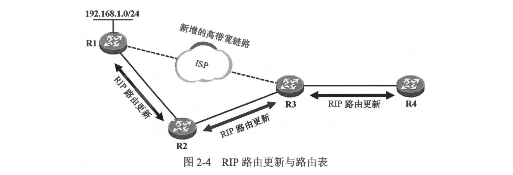
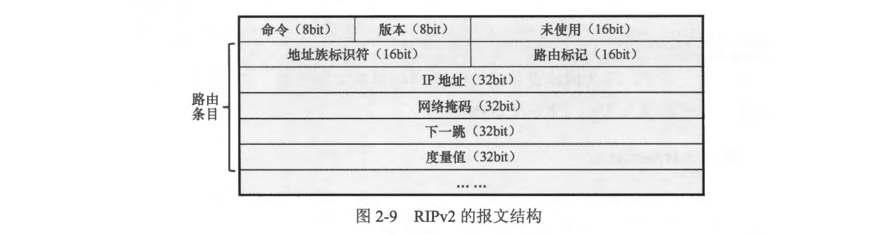
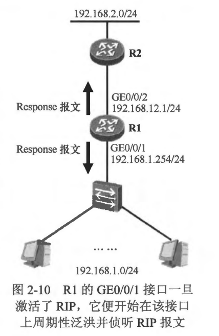

### 本章内容概述和教学目标
- RIP (Routing Information Protocol，路由信息协议）是最典型的距离矢量路由协议，常被用于在小型的网络中交互路由信息，它是最先得到广泛使用的 IGP 协议，由于其工作机制相对简单，因此一直以来都作为数通领域入门动态路由技术的协议被大家所熟知。
- 目前 RIP 存在三个版本，分别是面向Iv4的RIPV1 和RIPv2，以及面向IPV6 的RIPng。

- 本章学习目标:
  - 理解 RIP路由更新及接收机制
  - 理解 RIP 度量值
  - 熟悉 RIPV1 及 RIPv2 的报文格式
  - 熟悉 RIP 的几种计时器及其含义
  - 熟悉 RIP 的静默端口 概念及配置

<br>
<br>

### 2.1.1 RIP 路由更新及接收 
- 每台 RIP 路由器都维护着一个 RIP 数据库 (Database），在该数据库中保存着路由器发现的所有 RIP 路由，其中包括自己发现的直连路由以及从其他路由器收到的路由。
- 在每台运行 RIP 的路由器周期性地将自己的路由表通告出去，当路由器收到 RIP 路由更新时，如果这些路由是自己并未发现的并且是有效的，则将其加载到路由表，同时设置路由的度量值和下一跳地址。

- **1.路由器初始启动**
  - 在图2-1 所示的网络中，R1、R2 和 R3 三台路由器直连，图中每台设备的路由表显示了路由的目的网络地址/网络掩码、协议类型、度量值及出接口。现在我们在这三合路由器上激活 RIP 并观察路由的交互过程。在初始情况下，所有的路由器都能自动发现自己的直连路由，并且将直连路由写入路由表。以 R1 为例，它在其路由表中加载了 192.168.12.0/24 及 1.0.0.0/8 两条直连路由。RIP 将直连路由的度量值视为0跳，因为该直连网段就在 “家门口”。所谓的 “0跳”指的是到达该网段不需要经过任何一台路由器。
- **2.初次交换路由信息**
  - 由于 R1、R2 及R3 都运行了RIP，因此它们都将自己路由表中的路由通过 RIP 协议报文周期性地从所有激活了 RIP 的接口通告出去（RIPV1 使用广播地址作为协议报文的目的 IP 地址，而 RIPv2 则使用组播地址）。对于 R2 而言，它会将自己的路由表从 GE0/0/0 和 GE0/0/1 接口通告出去。以192.168.23.0/24 路由为例，R2 会将关于该路由的更新从 GE0/0/0 接口通告给 R1，它将该路由的度量值设置为 1 跳(0跳加1跳，也就是加上“自己这一跳”）—--- RIP 路由器将自己路由表中的路由通告出去时将跳数加1，而收到该路由更新的 RIP 路由器将路由安装到自己路由表时则使用这个度量值。R1 收到 R2 所通告的路由更新后发现 192.168.23.0/24 路由在其路由表中并不存在，于是将该路由 “学习”过来，加载到路由表中，将路由的度量值设置为1跳（意思是自己要到达 192.168.23.0/24,需要经过一个 RIP 路由器)，此外还将该路由的下一跳设置为路由的更新源 R2 (它从路由更新报文的源地址获得 R2 的 IP 地址），出接口设置为 GE0/0/0。
  
  - R3 也会在自己的 GE0/0/0 接口上收到 R2 通告的路由更新，并学习到路由 192.168.12.0/24，它将该条 RIP 路由加载到路由表中，并将路由的下一跳设置为 R2，出接口设置为 GE0/0/0，度量值设置为 1。而 R2 会在自己的 GE0/0/0 接口上收到 R1 通告的路由更新，在GE0/0/1 接口上收到R了通告的路由更新，并最终学习到 1.0.0.0/8 及 3.0.0.0/8路由，具体过程不再赘述。
  - 经过这一轮路由通告及学习，R1 能够学习到 192.168.23.0/24 路由，R2 能够学习到 1.0.0.0/8 及 3.0.0.0/8 两条路由，而 R3 能够学习到 192.168.12.0/24 路由，如图2-2 所示。
   
- **3.路由完成收敛**
  - 由于运行 RIP 的路由器会周期性地将自己的路由表通告出去，因此在下一个更新周期到来时，所有路由器再次将自己的路由表通告出去。R1 收到 R2 通告的路由后发现路由 3.0.0.0/8 在路由表中并不存在，因此将该条路由学习过来，加载到路由表并关联度量值: 2跳，这意味着 R1 要到达 3.0.0.0/8 需要经过两个路由器。同理，另一边的R3也能够从 R2 学习到 1.0.0.0/8 路由。如此一来，三台路由器都拥有了到达全网各个网段的路由，如图 2-3 所示，而且设备的路由表此时已经稳定，这个阶段被称为“网络中的路由己经完成了收敛”。虽然网络中路由器的路由表已经稳定，但它们依然会周期性地将自己的路由表通过 RIP 通告出去，以确保路由的有效性。
  - 

<br>
<br>

### 2.1.2 度量值计算
- 度量值是一个非常重要的概念。简单地说，所谓度量值就是指到达目的网络所需的代价或成本。每种路由协议都定义了路由的度量值，但是它们对度量值的规定可能不尽相同,例如有的路由协议使用到达目的网络沿途需经过的路由器个数作为路由的度量值，而有的协议则基于链路带宽计算路由度量值。度量值的大小将直接影响路由器对到达某个目的网段的路由(或者说路径）的优选。
- 例如当一台路由器发现两条路径可以到达同一个目的地(或者说路由器从两个不同的下一跳学习到去往同一个目的网络的路由），并且这两条路由都是通过同一种路由协议发现的，那么通常情况下度量值更优的那条路由会被优选，而度量次优的路由则作为备份，只有当最优路由失效时，次优路由才会被使用。
- RIP 以跳数(Hop Count）作为路由的度量值，所谓的跳数，就是到达目的网络所需经过的路由器个数，显然RIP 的度量值需为非负整数，而且跳数越少，路由被认为越优。
- 在 图2-5 中，R1 到达直连网段 1.0.0.0/8 的度量值为0。随着 RIP 更新周期的到来，它将该条路由从 GE0/0/0 接口通告出去，值得注意的是，在 R1 所通告的路由更新中，1.0.0.0/8 路由携带的度量值为 1，也就是说，R1 将该条路由的度量值加 1 后才通告给 R2。
- R2 收到 R1 通告的路由更新后，将 1.0.0.0/8 路由学习过来，加载到路由表中，并将路由的度量值设置为 1，也就是沿用 R1 所通告的度量值。接着 R2 将 1.0.0.0/8 路由从自己的 GE0/0/1 接口通告出去，而在 R2 所通告的路由更新中，该条路由的度量值被设置为 2,R2 将路由的度量值加 1 后通告给 R3。最后，R3 也能学习到 1.0.0.0/8 路由。路由器运行 RIP 后，认为本地直连路由的跳数为 0。当 RIP路由器将一条路由通告出去时，路由的跳数被增加 1 跳，而收到这个路由更新的路由器将这条路由加载进路由表时度量值沿用该值。

- RIP 使用跳数作为度量值的设定使得路由器能够直观地知道自己距离目的网络的“远近”。在路由优选的过程中，通过比较度量值，RIP 会从可选路径中选择一条到达目的网络的最优路径，所谓最优也就是跳数最小。在 图 2-6 中，假设所有路由器都运行了 RIP，则 R5 会将路由 5.0.0.0/8 通告给 R2 和R4，通告时路由的度量值设置为 1 跳，在收到这条路由更新后，R2 会把这条路由通告给 R1 并告知度量值为 2跳，如此一来，R1 便发现了一条到达 5.0.0.0/8 的路由。另一方面，R4 从 R5 学习到 5.0.0.0/8 路由后会进一步通告给 R3，而 R3 又会将其通告给 R1,这样 R1 又发现了另一条到达 5.0.0.0/8 的路由。
此刻对于 R1 而言，有两条路由可以到达 5.0.0.0/8，那么 R1 就会进行最优路由的选择，拥有更少跳数的路由将被优选并最终被加载到路由表中作为数据转发的依据。因此在 R1 的路由表中，5.0.0.0/8 路由的下一跳是 R2。



<br>
<br>

### 2.1.3 RIP路由更新与路由表 (这小节不讲)
- RIP 是典型的距离矢量路由协议，从单台 RIP 路由器的角度看，它只是简单地侦听直连的 RIP 路由器所通告的 RIP 路由更新，从该更新中发现 RIP 路由，并将学习到的路由加载到路由表中。另一方面，它也将自己路由表中的 RIP 路由通告出去，以便直连的 RIP 路由器能够学习到。实际上，对于 RIP路由器而言，它并不知晓整个网络
- 在图 2-4 中，R1、R2、R3 及 R4 运行了 RIP，初始时，R1 及 R3 需通过 R2 实现连接。R1 将本地直连网段 192.168.1.0/24 发布到了 RIP，从而 R2 能够通过 RIP 学习到该条路由，它将路由加载到自己的路由表中，然后进一步通过 RIP 将该路由通告给 R3，同理，后者学习到路由后将其加载到自己的路由表中，然后通过 RIP 通告给 R4。最终，网络中的4台路由器都能学习到 192.168.1.0/24 路由。

- 现在 R1 及 R3 之间新增了一条高带宽链路，我们期望将 R3 发往 192.168.1.0/24 的流量引导到这条新增链路上。由于 R1 及R3并不是通过这段新增的链路直接相连（中间还有其他设备），因此无法在它们之间部署 RIP-—直连的网络设备之间才能够通过 RIP 交互路由信息，于是我们在R3 上配置了到达 192.168.1.0/24 的静态路由，下一跳从高带宽链路指向 ISP。由于静态路由的优先级值为 1，而 RIP 路由的优先级值为 120，显然，缺省情况下静态路由的优先级要比 RIP 路由更高，因此 R3 将到达 192.168.1.0/24 的静态路由取代原有的 RIP 路由加载到自己的路由表中。由于路由表中到达 192.168.1.0/24 的 RIP 路由消失，因此 R3 将此前通告给 R4 的该条 RIP 路由撤销，并且在此后其周期性从该接口发送的 RIP 路由更新中也不再包含这条路由。换句话说，R4 无法再通过 RIP学习到该路由。此时就必须通过其他手段，确保 R4 能够拥有到达该网段的路由。

<br>
<br>

### 2.1.4 报文类型及格式
- RIP 的协议报文采用 UDP 封装，报文的源、目的端口均是 UDP 520 端口。RIP 定义了两种报文，它们分别是请求(Request）报文和响应（Response）报文。RIPV1 和 RIPv2 在协议报文各个字段的定义中存在些许差异，这些差异实际上是两个版本工作机制的不同所造成的。Request 报文用于向邻居请求全部或部分 RIP 路由信息，而 Response 报文则用于发送 RIP 路由更新，在 Response 报文中携带着路由以及该路由的度量值等信息。
- 一旦路由器的某个接口激活 RIP 后，该接口立即发送一个 Request 报文和 Response 报文，并开始侦听 RIP 协议报文。随后接口开始 Response 报文的周期性发送。RIPv1 使用广播地址 255.255.255.255 作为协议报文的目的 IP 地址，而 RIPv2 则不同，它使用组播 IP 地址 224.0.0.9 作为协议报文的目的 IP 地址。当 RIP 路由器收到 Request 报文后，会使用 Response 报文进行回应，在该报文中携带对方所请求的路由信息。当 RIP 路由器收到 Response 报文后，会解析出该报文中所携带的路由信息，如果报文中的路由信息是自己尚末发现的，并且路由的度量值有效，则路由器将学习该路由并将路由加载进路由表，同时为这条路由关联度量值、 出接口和下一跳信息。

<br>

- RIPv1 的报文结构
  - RIPv1 报文（如图 2-8 所示）中各个字段的含义如下:
    - 命令字段(Command): 该字段用于标识 RIP 报文的类型。
      - 值为1时该报文为Request报文，用于向直连路由器请求全部或部分路由信息。
      - 值为2时该报文为 Response 报文，用于发送路由更新，该报文可以作为对
  - Request 报文的回应，也可以是路由器自主发送的，例如周期性发送路由更新或者触发性发送路由更新。一个 Response 报文中最多可携带 25个路由条目，当待发送的路由数量大于该值时，需使用多个 Response 报文。
    - 版本字段 (Version): 在 RIPV1 中，该字段的值为 1。
    - 地址族标识符 (Address Family Identifier, AF): 该字段值为 2 时表示 IP 协议。
  - 如果该报文为 Request 报文并且是用于向直连路由器请求其整张路由表，则该字段值被设置为 0，同时这个 Request 报文中包含且只包含一个路由条目，该路由的目的网络地址为 0.0.0.0，度量值为 16。
  - IP地址 (IP Address): 路由的目的网络地址。
  - 度量值 (Metric): 路由的度量值。
  - **值得注意的是，RIPV1 的Response 报文中并不携带路由的目的网络掩码。**  


- RIPv2 的报文结构
  - RIPV2 报文（如图2-9 所示）中各个字段的含义如下:
    - 命令字段（Command): 与 RIPv1 类似，不再赘述
    - 版本字段(Version): 在 RIPv2 中，该宇段的值为 2
  - 地址族标识符 (Address Family Identifier)：与 RIPv1 类似，不再赘述。
  - 路由标记 (Route Tag): 用于为路由设置标记信息，缺省为 0。当一条外部路由被引入 RIP 从而形成一条 RIP 路由时，RIP 可以为该路由设置路由标记，当这条路由在整个 RIP 域内传播时，路由标记不会丢失。
  - IP地址 (IP Address): 路由的目的网络地址。
  - 网络掩码 (Netmask): RIPV1 路由器在通告路由时是不携带目的网络掩码的，这是因为在RIPv1 的报文中并没有定义相应的字段，这使得 RIPv1 无法支持 VLSM(VariableLength Subnet Mask， 可变长子网掩码)。RIPv2 在这一点上做了改进，定义了该字段用于存储路由条目的目的网络掩码，如此一来，RIPv2 便能够支持 VLSM。
  - 下一跳 (Next Hop): RIPV2 定义了该字段，使得路由器在多路访问网络上可以避免次优路径现象。一般情况下，在路由器所发送的路由更新中，路由条目的“下一跳”字段会被设置为 0.0.0.0，此时收到该路由的路由器将路由条目加载到路由表时，将路由的更新源视为到达目的网段的下一跳。在某些特殊的场景下，该字段值会被设置为非 0.0.0.0。
  - 度量值 (Metric): 该路由的度量值。



<br>
<br>

### 2.1.5 计时器
- RIP 定义了多个计时器，其中最重要的四个计时器如下。
  - 更新计时器（Update Timer）
    - 平均每30s发送一个响应消息。但为了防止表的同步，即在共享广播网络中由于路由消息的同步更新，冲突随之发生的现象，RIP 加入了一个随机变量用来防止表的同步。在 Cisco 定义的 IOS 中，这个时间被设置为减去更新时间的15%，即一般处理单个更新的时间大约是25.5s-30s之间。
  - 垃圾收集计时器（Garbage-collection Timer）/无效计时器（Invalid Timer）
    - 当有一条新的路由被建立，无效计时器（RFC中称为垃圾收集计时器）就会被设置为180s，每当接收到这条路由更新后，计时器又将重置为初始值。如果一条路由更新在180s（即六个更新周期）内还没有收到，则它将被标记为不可到达（跳数变成16）。 
  - 超时计时器（Timeout Timer）/刷新计时器（Flush Timer） 
    - Cisco 路由器使用比无效计时器时间长60s作为刷新计时器，或者说是240s的刷新计时器更为准确。如果刷新计时器超时，则该路由将被通告为一条度量值不可达路由，并从路由表中删除。
  - 抑制计时器（Holddown Timer）
    - 如果一条路由更新的跳数大于路由表已记录的跳数，则该路由进入长达180s（即六个更新周期）的抑制状态。

- 在 RIP 配置视图下，使用 timers  命令可以修改上述四个计时器的时间值，该命令可指定四个参数，分别对应 RIP 的路由更新时间间隔、老化时间以及垃圾回收时间。
例如： 
```shell
R1(config)#router rip
R1(config-router)#timers basic ?
  <1-4294967295>  Interval between updates for RIP   //更新时间

R1(config-router)#timers basic 10 ?
  <1-4294967295>  Invalid   //老化

R1(config-router)#timers basic 10 60 ?
  <0-4294967295>  Holddown  //抑制时间

R1(config-router)#timers basic 10 60 60 ?
  <1-4294967295>  Flush   刷新时间

R1(config-router)#timers basic 10 60 60 80

//建议：修改时间建议维持原有的倍数关系
```

<br>
<br>

### 2.1.6 被动接口(passive-interface)
- 在缺省情况下，一旦路由器的某个接口激活了 RIP，RIP 就开始在该接口周期性地i发送Response 报文，同时也在该接口上侦听 RIP 报文。 
- 在 图2-10 所示的网络中，为了让 PC 与R2 直连的 192.168.2.0/24 网段实现互通，就必须让 R2 学习到 192.168.1.0/24 路由，让 R1 学习到 192.168.2.0/24 路由。如果在 R1 及 R2 之间部署 RIP，那么对于 R1 而言，需要在其 GE0/0/1 及 GE0/0/2 接口上都激活 RIP。如此一来，R1 便会在这两个接口上发送 Response 报文，当然，也会在这两个接口上侦听 RIP 报文。R1 会将携带了 192.168.1.0/24 路由的 Response 报文从 GE0/0/2 接口发送出去，使得 R2 能够学习到该路由，它也会将 Response 报文(携带了 192.168.12.0/24 以及从 R2 学习到的路由）从 GE0/0/1 接口发送出去。但实际上，这些 RIP 报文对于其 GE0/0/1 接口所连接的网段来说是没有任何意义的因为这里没有任何 RIP 路由器，因此 R1 在该网段中所发送的 Response 报文实际上给 PC 带来了额外的负担。
- 使用 passive-interface （被动接口) 特性可以解这个问题。一个 RIP 接口一旦被指定为 passive-interface ，则该接口将不再发送 RIP 报文，而只是被动地接收 RIP 报文，也就是只收不发。所以在本例中，如果将R1 的 GEO/0/1 接口激活 RIP 同时配置为 passive-interface，则 R1 不再向 GE0/0/1 接口发送 Response 报文，这就消除了 PC 为解析 RIP 报文所产生的资源损耗。另一方面，虽然GE0/0/1 接口被指定为 passive-interface，但是由于该接口己经激活了 RIP，因此当 R1 从其他接口发送 Response 报文时，依然会在报文中携带 192.168.1.0/24路由信息，也就是说，将 GE0/0/1 接口设置为 passive-interface 并不妨碍 R2 通过 RIP 学习到该接口的路由。最后需强调的是，passive-interface 接口仅仅是不向外泛洪 Response 报文，但是它依然可以接收 Response 报文。


