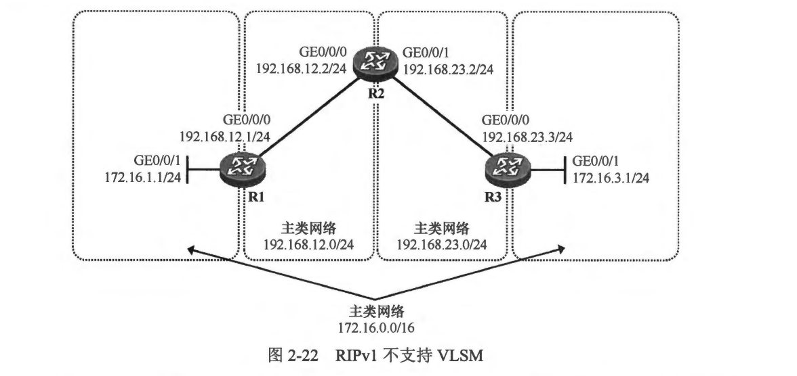
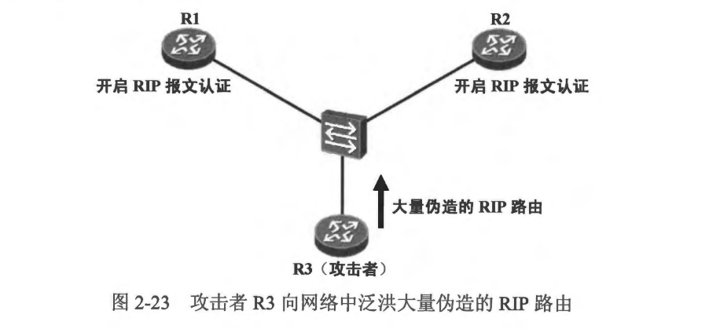
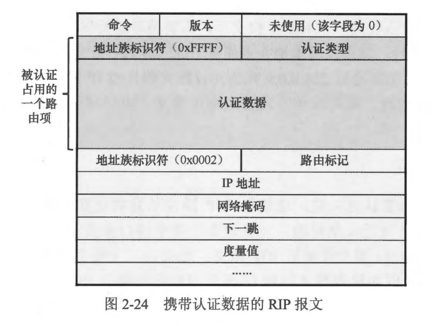
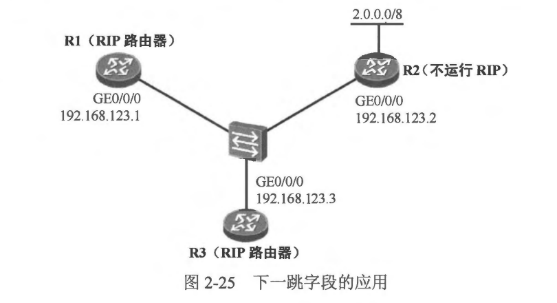
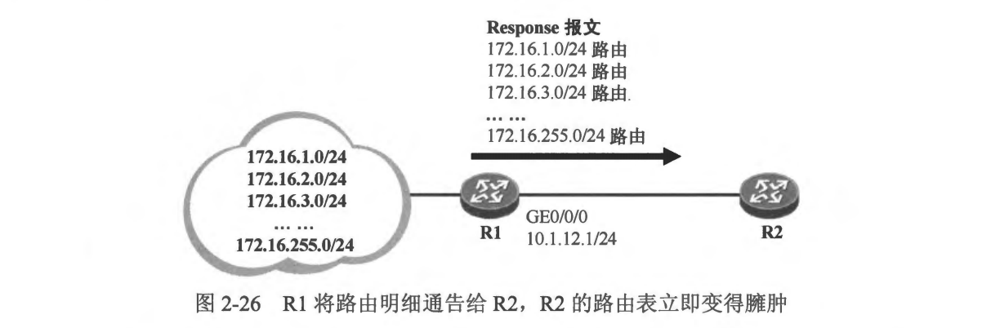
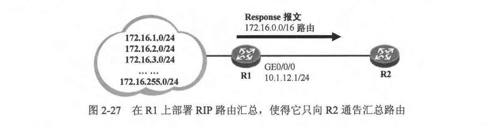
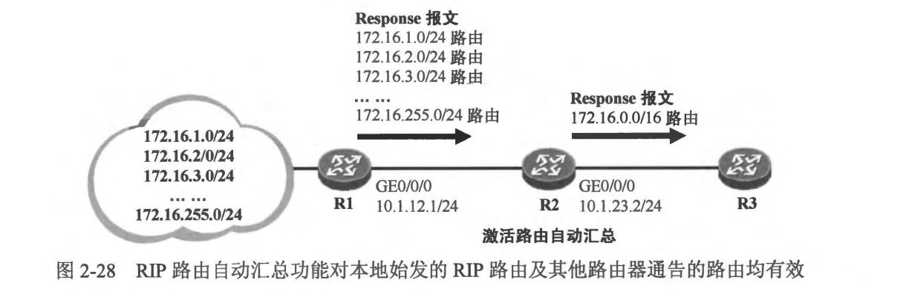
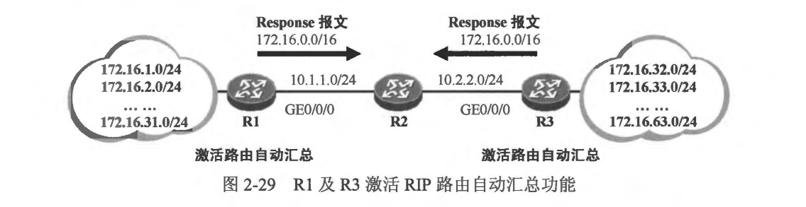
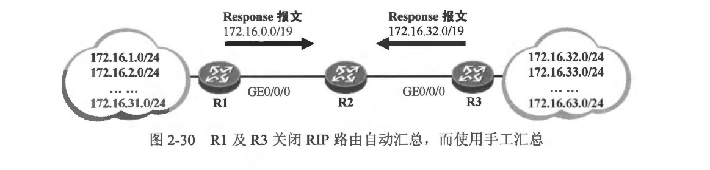

### 2.3.1 RIPV1 和 RIPV2
- RFC1058 (Routing Information Protocol）描述了 RIPv1, RIPv1 是一个典型的有类路由协议 (Classful Routing Protocol)。RIPv1 不支持 VLSM，这使得它只能够在特定的网络环境中提供路由信息服务，与之相关的一个非常重要的因素是，RIPv1 的 Response 报文中所携带的路由信息只有卫P 地址（目的网络地址）而没有目的网络掩码，这就使得 RIPv1 在部署了 VLSM 的网络中工作时会出现问题。
- 图 2-22 展示了一个部署了 VLSM 的网络，R1 连接着主类网络 172.16.0.0/16 的一个子网----172.16.1.0/24，R3 连接着该主类网络的另一个子网----172.16.3.0/24。 如此一来，172.16.0.0/16 这个 B 类地址的两个子网被 192.168.12.0/24 及 192.168.23.0/24 这两个 C 类网络地址段“隔开”了，这种网络又被称为 “不连续的主类网络”。现在网络管理员将在 R1 、R2 及R 3 上部署 RIPv1。
- RIPv1 是有类路由协议，运行 RIPv1 的路由器所泛洪的 Response 报文中，路由信息是不携带目的网络掩码的，这就存在一个问题: 如果 R1 要向外通告 172.16.1.0/24 这个子网，路由的目的网络地址是多少？对方收到这个路由而又缺少网络掩码信息，它该如何判断目标网络的掩码？RIPV1 定义了一套路由发送及更新规则。如果 RIPV1 路由器处于主类网络边界，当它将一个主类网络的子网路由通告到另一个主类网络时，会将前者自动汇总成主类路由进行通告。

- 在本例中，R1 处于主类网络 172.16.0.0/16 及 192.168.12.0/24 的边界，因此当它向 192.168.12.0/24 网络通告 172.16.1.0/24 这个子网路由时，会将该子网路由汇总成主类路由：172.16.0.0(注意 R1 将该路由通过 Response 报文通告给 R2 时是不携带目的网络掩码的）。R2 收到这条路由更新后，为 172.16.0.0 附上该地址的缺省掩码，也就是 255.255.0.0，因此最终 R2 将 172.16.0.0/16 路由加载到路由表中，该路由的下一跳为 R1。
- 值得注意的是，R1 及 R3 都处于主类网络边界，因此它们向 R2 发送的 Response 报文都將包含 172.16.0.0 路由《而且没有目的网络掩码信息），这將使得 R2 收到这两份 Response 报文后，将两条路由都加载到路由表中，如此一来，R2 的路由表中的 172.16.0.0/16 路由将在 R1 及R3 这两个下一跳执行等价负载分担。这造成的一个直接结果是 R2 转发到达 172.16.3.0/24 的数据包时，有可能会将其送往 R1 从而导致通信故障。这就是 RIPv1 面对不连续的主类网络时存在的问题。解决这个问题的方法有几个，最为推荐的方法是使用 RIPv2 而不是 RIPv1。
- RFC2453 (RIP Version 2）描述了 RIPv2，其改进点包括:
  - 使用组播的方式发送 RIP 报文
  - 支持无类路由选择
  - 在 Response 报文携带的路由信息中增加目的网络掩码
  - 支持报文认证
  - 增加下一跳特性
  - 增加路由标记功能
  - 支持手工路由汇总等
相较于 RIPv1， RIPv2 最显而易见的改进点之一是该协议为无类路由选择协议，支持VLSM.

 
 

### 2.3.2 报文发送方式
- RIPv1 使用广播的方式发送协议报文，这些报文的目的 IP 地址为 255.255.255.255,这是一个广播 IP 地址，一个设备发送的广播报文将在设备所处的广播域中泛洪，这使得与其同处一个广播域的其他设备都将收到这个报文，并且耗费资源去处理这些报文一即使有些设备并不需要这些报文，例如广播域中的主机、服务器以及其他并未运行 RIP 的设备等，这些设备收到一个 RIPv1 报文后，需要将其进行层层解封装，直至看到报文的目的 UDP 端口号，然后发现本地并未侦听 UDP 520 端口才会将该报文丢弃。
- RIPv2 则采用组播地址 224.0.0.9 作为协议报文的目的 IP 地址，所有的 RIPV2 设备都会侦听该组播地址。采用这种方式发送协议报文，可以减少对广播域中其他设备的影响。

 
 

### 2.3.3 报文认证
- RIPv2 支持报文认证功能，这使得 RIP 路由信息的交互更加安全。缺省时，RIP 路由信息的交互是缺乏安全性的，一旦设备的某个接口激活了 RIP，该接口即开始周期性地发送 Response 报文及侦听 RIP 报文，如果接口上收到 Response 报文，RIP 只进行简单的校验，例如检查报文的源 IP 地址与自己的接口DP 地址是否在相同网段等，随后就将所收到的 Response 报文中的路由信息学习过来，这显然是存在一定的安全隐患的。
- 在 图2-23 所示的网络中，R1 及 R2之间交互着 RIP 路由，现在 R3 连接到了交换机上，并且开始在广播域中泛洪 Response 报文，这些份造的 Response 报文中携带着大量垃圾路由，这将造成R1 及R2 的路由出现紊乱，或者路由表被大量垃圾路由填充，设备资源也将被大量消耗。

- RIP V2 给出了解决方案: RIP报文认证。通过在 R1 及R2 的接口上激活 RIP 认证并在两端配置相同的认证口令，可使 RIP 报文的交互更为安全，只有当接口上收到的 RIP 报文中相关认证字段匹配本地配置的认证口令，该报文才被认为是有效的，否则被认为是非法报文并被丢弃。
RIP 认证是基于报文的，以简单（Simple）认证方式为例，路由器接口上配置 RIP 报文认证后，该接口发送的 RIP 报文将会携带认证信息，如图 2-24 所示。认证信息会占用报文的第一个路由项(该路由项的地址族标识符为 OxFFFF)，此时一个 Response 报文携带的最大路由条目数量从 25 条变成 24 条。
- Cisco 路由器支持以下几种 RIP 认证方式：
  - 简单认证；
  - MD5 认证 

 
 

### 2.3.4 下一跳字段
- RIPv2 定义了“下一跳” 字段，使得路由器在多路访问网络上可以避免次优路径现象。
- 在图 2-25 所示的网络中，R1 、R2 及 R3 连按在同一合以网交换机上，R1 及 R3 运行 RIPv2，但 R2 并不支持 RIP。R2 直连着2.0.0.0/8，为了让 R1 能够访问这个网段，我们在 R1 上部署了静态路由: ip route-static 2.0.0.0 8 192.168.123.2。现在为了让 R3 也能够访问 2.0.0.0/8，而且能够通过 RIP 学习到去往该网段的路由，R1 将静态路由引入 RIP。如此一来，R3 就能够通过 RIP 学习到 2.0.0.0/8 路由，然而由于该条路由是学习自 R1 的，因此 R3 将这条路由加载进路由表时，认为 R1 是其到达该网段的下一跳。这显然并非是最优的方案，因为从R3到达2.0.0.0/8 的数据包将首先被转发给 R1，再由 R1 转发到 R2，这实际上是存在次优路径的。为什么 R3 不直接将数据发往 R2 呢？这是因为对于距离矢量路由协议而言，路由的通告者就被视为该路由的下一跳。

** 在同一个网络拓扑结构中，如果存在两种不同的路由协议，由于不同路由协议的机理各有不同，对路由的理解也不相同，这就在网络中造成了路由信息的隔离。在路由协议的边界设备上，将某种路由协议的路由信息引入另一种路由协议中，这个操作被称为路由引入(Route Importation）或者路由重分发 (Route Redistribution）。例如一台路由器如果既配置了静态路由，又运行了 RIP，那么其路由表中的静态路由对于 RIP 而言是外部路由，缺省时 RIP 域内的设备对于这些静态路由是无感知的，如果在该路由器上将静态路由引入 RIP，那么 RIP 域内的其他设备便能通过 RIP 学习到这些外部路由，这个操作就是路由引入。**
- RIPv2 增加了“下一跳” 字段来解决这个问题，当 R1 将 2.0.0.0/8 路由通过 RIP 通告给 R3 时，Response 报文除了携带该路由的目的网络地址、目的网络掩码、 度量值，还会设置“下一跳” 字段，该字段的值为 R1 自己到达目标网段 2.0.0.0/8 的直连下一跳地址，也就是直连网段中的 192.168.123.2（R2 的接口地址）。
- 在大多数情况下，当 RIP 路由器发送路由更新时，路由的“下一跳” 字段为 0.0.0.0，其他 RIP 路由器接收该路由更新后，将路由的通告者视为到达目的网段的下一跳。而在本场景中，R1 通过设置这个字段来告知路由接收者到达目的网段的具体下一跳地址，从而规避次优路径问题。如此一来，R3 收到这个 Response 报文后，将路由 2.0.0.0/8 加载进路由表，而路由的下一跳便设置为 192.168.123.2(该地址直连可达)。当R3收到去往该网段的数据包时，便会将其直接转发给 R2，而不会经由R1 去转发。

 
 

### 2.3.5 路由标记 
- RIPv2 增加了“路由标记（Route Tag）” 字段，使得从外部被引入 RIP 的路由能够携带特定的标记信息。我们将一系列连续的 RIP 路由器构成的网络称为 RIP 域，RIP域内的路由器通过 network 命令向 RIP 发布的路由将会被整个域内的 RIP 路由器学习到，这些路由的“路由标记” 字段值将被设置为 0。当一条外部路由，例如静态路由、OSPF 或 BGP 路由等，被重分发到 RIP 时，RIP 可以为该路由设置路由标记，此时执行重分发操作的路由器将向 RIP 域中泛洪用于描述该外部路由的 Response 报文，而在该 Response 报文中，被引入的外部路由会携带由网络管理员设置(或者协议自动设置）的路由标记，域内的 RIP 路由器学习到该路由后都能看到该标记，并旦可以基于该标记执行路由策略等操作。

 
 

### 2.3.6 路由汇总
- 路由汇总是非常重要的一种思想，对网络优化的贡献是巨大的。一个大规模的网络中，路由器为了维护大量的路由信息不得不耗费过多的设备资源，为了减小设备的负担，同时保证网络中路由的可达性，部署路由汇总是非常推荐的解决办法。路由汇总指的是同一个网段内的不同子网路由在向外通告时汇总成一条路由的行为。路由汇总主要用于减小网络设备的路由表规模，进而减小网络中的路由更新的流量及设备资源消耗。在一个大型的网络中路由汇总几乎是必须考虑的一种网络优化手段。
- 以 图2-26 所示的网络为例，R1 连接着 172.16.1.0/24 、172.16.2.0/24 及 172.16.3.0/24 等大量网段，如果 R1 将这些网段的路由信息通过 RIP 统统通告给 R2，那么 R2 的路由表将立即变得 “臃肿”，而且为了更新这些路由又得占用掉不少链路带宽。仔细一看不难发现该网络是可以通过部署路由汇总来进行优化的。

- RIP 支持路由自动汇总，所谓路由自动汇总指的是如果 RIP 路由器处于主类网络边界，当它将一个主类网络的子网路由通告到另一个主类网络时，自动将该子网路由汇总成主类网络路由，只将主类网络路由通告给直连 RIP 路由器的行为。值得注意的是，RIP 路由自动汇总只能将明细路由汇总成主类网络路由，这在某些场景下会存在 “颗粒度过大”的问题。
- 如果我们在 R1 上部署路由汇总，如图 2-27 所示，使R1 不再通告 172.16.0.0/16 的子网路由给 R2，而是通告汇总路由 172.16.0.0/16，那么 R2 的路由表将极大程度地被精简，当 R2 转发到达这些子网的报文时，可以使用这条汇总路由来指导转发。当然，需要谨记的是，部署路由汇总的前提是 IP 地址规划具备一定的合理性，如果网络中的 IP 地址规划非常紊乱且没有规律，那么路由汇总的部署势必存在极大的障碍。

- RIPv1 及 RIPv2 对于路由自动汇总的支持情况有所不同:
  - 在 RIPV1 中，路由自动汇总功能缺省已被激活，而且不能被关闭
  - 在 RIPv2 中，路由自动汇总功能缺省已被激活，但是可以通过命令关闭
- 以 RIPV2 为例，我们看看路由自动汇总的执行过程。在图 2-27中，R1 及 R2 运行了 RIPv2， R1 激活了 RIP 路由自动汇总功能，172.16.1.0/24、 172.16.2.0/24 等子网的主类网络地址及掩码长度是 172.16.0.0/16，而 R1 的 GEO/0/0 接口的主类网络地址及掩码长度是 10.0.0.0/8，显然 R1 处于两个主类网络的边界，因此当其向 R2 通告 172.16.0.0/16 的子网路由时，R1 将会执行路由自动汇总，将这些明细路由汇总成主类网络路由 172.16.0.0/16 通告给 R2。在路由汇总的执行过程中，只要存在一条明细路由，则该明细路由对应的主类网络汇总路由便会被通告，而如果所有的明细路由都失效，则 RIP 不再通告对应的汇总路由。
- RIP 路由自动汇总对本地始发的 RIP 路由生效，也对其他路由器通告的 RIP 路由生效。如图 2-28 所示，如果在 R1 上关闭自动汇总功能，而 R2 激活该功能，则 R1 将向 R2 通告所有明细路由，R2 收到这些路由后，将它们加载到自己的路由表，当其向 R3 通告这些路由时，由于激活了路由自动汇总功能，因此它仅向 R3 通告汇总路由 172.16.0.0/16。

- 路由自动汇总功能使用起来的确颇为方便，然而正如此前所讲，该功能在某些场景中应用时可能存在问题。如图2-29 所示，RI、R2 及R3三合路由器均运行 RIPv2，其中 R1 及 R3 均处于主类网络边界。R1 左侧连接着 172.16.1.0/24、 172.16.2.0/24 …… 172.16.31.0/24 这一系列子网，当它从GE0/0/0 接口发送关于这些子网的 RIP 路由更新时，会将这些子网路由汇总成主类路由 172.16.0.0/16 再进行通告，遗憾的是 R3 同样会执行这个动作，它也会向 R2通告 172.16.0.0/16 汇总路由，如此一来，R2 将分别从 R1 及 R3 收到 172.16.0.0/16 路由的 RIP 更新。由于这两条汇总路由均从 R1 获取，因此 R2 会根据度量值进行路由优选，如果它们的度量值相等，则 R2 会执行路由等价负载分担，也就是把这两条路由都加载到路由表中，这就会发生问题，因为到达 172.16.32.0/24 等子网的流量很有可能会被转发给 R1 从而造成流量丢失。

- 造成这个问题的原因是路由自动汇总所产生的汇总路由的 “颗粒度太大”，换句话说是汇总路由的掩码不够精确。而如果在 R1 及R3 上关闭自动汇总，所有的明细路由又都会被全部通告给 R2，R2 的路由表将立即变得臃肿，这当然也不是我们希望看到的。那么如果希望减小设备路由表规模的同时，解决上面提到的颗粒度问题，该如何操作？答案是使用 RIP 手工路由汇总，也就是在 R1 及 R3 上首先关闭路由自动汇总，然后使用手工汇总来指定 RIP 通告的精确汇总路由。手工汇总的方式可以自定义汇总路由的目的网络地址及网络掩码，而不受地址类别的限制，如 图2-30 所示。R1 关闭 RIP 路由自动汇总后部署 RIP 路由手工汇总，使得它向 R2 通告汇总路由 172.16.0.0/19(与此同时明细路由将被抑制);而 R3 也关闭 RIP 路由自动汇总并向 R2 通告另一条汇总路由: 
  - 172.16.32.0/19。这两条汇总路由都精确地 “囊括”了相应的明细路由，并且不会在 R2上形成冲突，完美地解决了此前遇到的问题。

