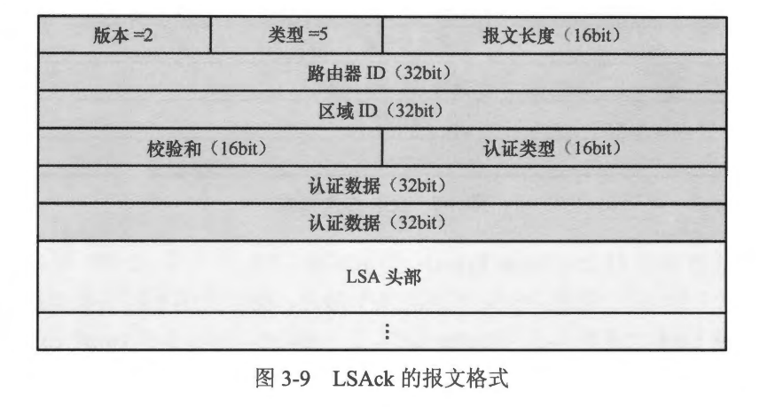

### 本章内容概述和教学目标
- 3.1 OSPF 的基本概念
- 回顾一下距离矢量路由协议的工作原理: 运行距离矢量路由协议的路由器周期性地泛洪自己的路由表，每台路由器都从相邻的路由器学习到路由，并且將路由加载进自己的路由表中，而它们并不清楚网络的拓扑结构，只是简单地知道到达某个目标网段应该从哪里走、距离有多远。
- 与距离矢量路由协议不同，运行链路状态路由协议的路由器知晓整个网络的拓扑结构，这使得路由更不易发生环路。
- 运行链路状态路由协议的路由器之间首先会建立邻居关系，之后开始交互链路状态 (Link-State，LS）信息，而不是直接交互路由。您可以简略地将链路状态信息理解为每合路由器都会产生的、描述自己直连接口状况(包括接口的开销、与邻居路由器之间的关系或网段信息等）的通告，更通俗点的讲法是，每合路由器都产生一个描述自己家门口情况的通告。这些通告会被泛洪到整个网络，从而保证网络中的每合路由器都拥有对该网络的一致认知。路由器将这些链路状态信息存储在 LSDB (Link-State Database，链路状态数据库)之中，LSDB 内的数据有助于路由器还原全网的拓扑结构（如 图3-1 所示）。接下来，每台路由器都基于 LSDB 使用相同算法进行计算，计算的结果是得到一棵以自己为根的、无环的最短路径 “树”。有了这棵“树”，事实上路由器就已经知道了到达网络各个角落的最优路径。最后，路由器将计算出来的最优路径(路由） 加载到自己的路由表。

- OSPF (Open Shortest Path First， 开放式最短路径优先）是一种典型的链路状态路由协议，由 IETF (Internet Engineering Task Foree， 国际互联网工程任务组）OSPF 工作小组开发，是目前业内使用最为广泛的 IGP (Interior Gateway Protocol， 内部网关协议）之一。OSPF 中的“0”意为“Open”，即开放的意思，所有的厂商都可以在其设备上实现 OSPF，当然，这些 OSPF 实现都需遵循公有标准。OSPF 支持 VLSM (Variable-lengthsuibnet， 可变长子网掩码），支持路由汇总等，另外区域(Area）的概念引入使得 OSPF 能够支持更大规模的网络。当网络拓扑发生变更的时候，OSPF 可以快速地感知并进行路由的计算和重新收敛。目前 OSPF 主要有两个版本:
  - OSPFv2，该版本主要针对 IPv4，在 RFC2328 (OSPF Version 2）中描述
  - OSPFv3，该版本主要针对 IPv6,在 RFC2740 (OSPF for IPv6）中描述。本书仅探讨 OSPFv2， 除非特别说明，否则 OSPF指的是 OSPFv2。
- 本章学习目标:
  - 理解 OSPF Router-ID 的概念
  - 学会查看 OSPF 的三张表
  - 理解 OSPF 路由 Cost 的概念及作用
  - 熟悉 OSPF 的五种报文及其功能
  - 理解 OSPF 网络类型的概念及意义
  - 理解 OSPF DR、BDR 的概念及意义
  - 理解 OSPF 区域的概念，以及区域划分的意义，并熟悉多区域 OSPF 部署的注意事项
  - 熟悉各种 OSPF 路由器角色

<br>
<br>

### 3.1.1 Router-ID
- OSPF Router-ID (Router Identification，路由器标识）是一个 32bit 长度的数值，通常使用点分十进制的形式表现（与IPv4 地址的格式一样，例如 192.168.200.1)，用于在
OSPF 域(Domain）中唯一地标识一合 OSPF 路由器。我们把一系列连续的 OSPF 路由器组成的网络称为 OSPF 域，这些路由器采用相同的 OSPE 策略。OSPF 要求路由器的
Router-ID 必须全域唯一，即在同一个域内不允许出现两台 OSPF 路由器拥有相同的 Router-ID 的情况。
- Router-ID 可以使用手工配置的方式进行设定。如果在创建 OSPF 进程时没有手工指定 Router-1D，则系统会自动选择设备上的一个 IP 地址作为 Router-ID。在 Cisco 路由器上如果创建 OSPF 进程时没有手工指定 Router-ID，则路由器将为该进程分配一个缺省 Router-ID。当然在实际网络部署中，强烈建议大家手工配置 OSPF 的 Router-ID，因为这关系到协议的稳定性。一个常见的做法是，將设备的 OSPF Router-ID 指定为该设备的 Loopback 接口（本地环回接口）的卫P地址。
- 手工指定 OSPF Router-ID 的示例如下：
```shell

Router(config)#int loop 0
Router(config-if)#ip add 1.1.1.1 255.255.255.255
Router(config-if)#exi
Router(config)#router ospf 100
Router(config-router)#route-id 1.1.1.1
```

- ** Loopback 接口也即本地环回接口，是一种软件的、逻辑的接口，实际上不光是网络设备支持 Loopback 接口，很多主机（例如Windows或Linux主机）也同样支持。用广可以根据业务需求，在网络设备上创建 Loopback 接口，并为该接口配置I地址。Loopback 接口非常稳定，除非人为地进行关闭或删除，否则是永远不会失效的。正因如此，Loopback 接口通常用于设备网管、网络测试、网络协议应用等。**

- 以上配置中，```router-id 1.1.1.1``` 命令用于,将路由器所使用的 Router-ID 设置为 1.1.1.1。无论是采用手工配置还是自动选取的方式，一旦 OSPF 确定了 Router-ID，之后如果再变更的话就需要将 OSPF 进程重启才能使新的 Router-ID 生效，用于重启 OSPF 进程的命令是：
```shell
Router# clear ip ospf process
```
- 当然在实际的项目中这条命令需谨慎使用，因为一旦这条命令被执行，OSPF 的进程便会重启，该 OSPF 进程的所有邻接关系将会被重置，这会引发路由的动荡。

<br>
<br>

### 3.1.2 OSPF 的三张表
- OSPF 使用三张表格以确保其正常运行:
  - 1.邻居表（Peer Table 或 Neighbor Table)在 OSPF 交互链路状态通告之前，两台直连路由器需建立 OSPF 邻居关系。当一个接口激活 OSPF 后，该接口将周期性地发送 OSPF Hello 报文，同时也开始侦听 Hello 报文从而发现直连链路上的邻居。当 OSPF 在接口上发现邻居后，邻居的信息就会被写入路由器的 OSPF 邻居表，随后一个邻接关系的建立过程也就开始了。
  - 在图 3-2 所示的网络中，R1、R2 及 R3 都运行了 OSPF。以R2 为例，它将在自己的Eth0/0 及 Serial 1/0 接口上分别发现 R1 及 R3，并最终与这两者都建立 OSPF 邻接关系，来看一下R2 的邻居表：
  ```shell
  R2#show ip ospf neighbor
  Neighbor ID     Pri   State           Dead Time   Address         Interface
  3.3.3.3           0   FULL/  -        00:00:36    10.1.23.3       Serial1/0
  1.1.1.1           1   FULL/BDR        00:00:32    10.1.12.1       Ethernet0/0
  ```
  - 使用 show ip ospf neighbor 命令可查看设备的 OSPF 邻居表。从上面的输出可以看出，R2 已经与 R1 和R3建立了全毗邻的邻接关系，这点可以通过查看两个邻居的状态(State都为 Full）来确认。
  - 掌握邻居表的查看是使用 OSPF 的基本技能之一，也是 OSPF 维护及故障定位的重要手段。实际上，每台 OSPF 路由器都与其邻居建立会话，每个会话都使用一个“邻居数据结构”来描述，这些数据结构是与路由器的接口相关联的，它们描述了这个邻居的状态、主/从（Master/Slave）关系、Router-ID、DR 优先级（若有）、接口 IP 地址等信息，OSPF 邻居表则汇总了这些信息，统一将路由器所有邻居的相关数据展示出来。


  - 2.链路状态数据库 (Link-State Database, LSDB）我们已经知道，运行链路状态路由协议的路由器在网络中泛洪链路状态信息，在 OSPF 中，这些信息被称为 LSA (Link-State Advertisement，链路状态通告)，路由器将网络中的 LSA 搜集后装载到自己的 LSDB 中，因此 LSDB 可以当作是路由器对网络的完整认知。OSPF 定义了多种类型的 LSA，这些 LSA 都有各自的用途，当然最终的目的都是为了让路由器知晓网络的拓扑结构及网段信息并计算出最短路径树，从而发现到达全网各个网段的路由。理解 LSDB 中各种 LSA 是深入学习 OSPF 的必经之路。下面展示的是 图3-2 中 R2 的 LSDB（使用 show ip ospf database 命令可以查看设备的 LSDB）。实际上由于 R1、R2 及 R3 的所有接口都属于同一个 OSPF 区域，因此三台路由器的LSDB 都是一致的。
  ```shell
  R2#show ip ospf database
  
              OSPF Router with ID (2.2.2.2) (Process ID 100)
  
                  Router Link States (Area 0)
  
  Link ID         ADV Router      Age         Seq#       Checksum Link count
  1.1.1.1         1.1.1.1         343         0x80000007 0x00F9A5 2
  2.2.2.2         2.2.2.2         342         0x80000005 0x004FA3 3
  3.3.3.3         3.3.3.3         343         0x80000003 0x0025C8 3
  
                  Net Link States (Area 0)
  
  Link ID         ADV Router      Age         Seq#       Checksum
  10.1.12.2       2.2.2.2         353         0x80000001 0x00B25A
  10.1.13.1       1.1.1.1         348         0x80000001 0x0012FA

  ```  


  - 3.OSPF 路由表 (Routing Table) 使用 show ip route ospf 命令可以查看设备的 OSPF 路由表，也就是设备通过 OSPF 所发现的路由，以 R2 为例: 
  ```shell
  R2#show ip route ospf
  Codes: L - local, C - connected, S - static, R - RIP, M - mobile, B - BGP
       D - EIGRP, EX - EIGRP external, O - OSPF, IA - OSPF inter area
       N1 - OSPF NSSA external type 1, N2 - OSPF NSSA external type 2
       E1 - OSPF external type 1, E2 - OSPF external type 2
       i - IS-IS, su - IS-IS summary, L1 - IS-IS level-1, L2 - IS-IS level-2
       ia - IS-IS inter area, * - candidate default, U - per-user static route
       o - ODR, P - periodic downloaded static route, H - NHRP, l - LISP
       a - application route
       + - replicated route, % - next hop override, p - overrides from PfR

  Gateway of last resort is not set

        10.0.0.0/8 is variably subnetted, 5 subnets, 2 masks
  O        10.1.13.0/24 [110/20] via 10.1.12.1, 00:06:58, Ethernet0/0
  ```
  
  - OSPF 根据 LSDB 中的数据，运行 SPF 算法并且得到一棵以自己为根的、无环的最短路径树，基于这棵树，OSPF 能够发现到达网络中各个网段的最佳路径，从而得到路由信息并将其加载到 OSPF 路由表中。当然，这些 OSPF 路由表中的路由最终是否会被加载到全局路由表，还要经过进一步比较路由优先级等过程。

<br>
<br>

### 3.1.3 度量值
- 每种路由协议对路由度量值的规定是不同的，OSPF 使用 Cost(开销）作为路由度量值，所谓开销，亦可理解为成本或者代价，Cost 值越小，则路径(路由）越优。首先每一个激活 OSPF 的接口都拥有一个接口级别的 Cost 值，这个值等于 OSPF 带宽参考值/接口带宽，取计算结果的整数部分，当结果小于 1 时，值取 1。以 Cisco 路由器为例，OSPF 带宽参考值缺省为 100Mbit/s，这个值是可以人为修改的，但是修改参考值将直接影响 Cost 值的计算，从而影响网络中 OSPF 路由的优选，因此需格外谨慎。
- 在 图3-3 所示的网络中，R1 、R2 及 R3 在各自的接口上都激活了 OSPF（所有的接口都属于相同的 OSPF 区域。图中已经标出了每个接口的 Cost 值。每台路由器产生的 LSA 描述了自己直连接口的状况，其中就包括接口的 Cost。这些 LSA 的泛洪使得每台路由器都获知了网络中所有路由器的信息。一条 OSPF 路径的 Cost 等于从目的地到本地路由器沿途的所有入接口 Cost 的总和。以 R2 为例，它到达目标网段 10.1.13.0/24 有两条路径可选，一条是从 R1 到达，而另一条则是从 R3 到达。R2 在计算到达 10.1.13.0/24 的路由时就要做一个比较，优选 Cost 值更小的那一条路径。R2 从 R1 这条路径到达目标网段的话，Cost 等于 R1 的 GE0/0/1 接口的 Cost 加上 R2 的 GE0/0/0 接口的 Cost， 也就是 2。而从 R3 到达目的网段的 Cost 则等于R3 的 GE0/0/1 接口的 Cost 加上 R2 的 Serial1/0/0 接口的 Cost， 也就是 49。很明显，前者的 Cost要更小，因此 R2 经过计算，将 R1 视为到达 10.1.13.0/24 的最优下一跳，并将得出的路由加载到路由表中。

- OSPF 的接口 Cost 是可以手工调整的，在这个例子中，可以通过将 R2 的 GE0/0/0 接口的 Cost 值调大（至少要大于 48），从而让 R2 选择从 R3 到达 10.1.13.0/24。 通过调节接口 Cost 从而影响 OSPF 路由计算，这种方法在实际的工程中常被用到。

<br>
<br>

### 3.1.4 报文类型及格式
- OSPF 协议基于卫运行，协议的数据报文直接采用 IP 封装，在 IP 报文头部中对应的协议号为 89。多数情况下，OSPF 的协议报文使用组播地址作为目的 IP 地址，以下两个组播 IP 地址被保留专用于 OSPF。
  - 224.0.0.5: 该组播 IP 地址意指所有的 OSPF 路由器
  - 224.0.0.6: 该组播 IP 地址意指所有的 OSPF DR 路由器
- OSPF 一共定义了五种报文，各有各的用途。表3-1罗列了这五种报文，以及报文的描述。

- 路由器的接口一旦激活 OSPF，就会开始发送 Hello 报文。Hello 报文的一个重要功能就是发现直连链路上的 OSPF 邻居。当其发现邻居后，邻接关系的建立过程就开始了。在这个过程中，DD 报文用于发送 LSA 的头部摘要。通过 DD 报文的交互，路由器知道了对方所拥有的 LSA，而 LSR 用于向对方请求完整的 LSA。LSU 则用于对 LSR 进行回应，或者主动更新 LSA，在 LSU 中就承载着完整的 LSA 数据。LSAck 用于保证 OSPF 更新机制的可靠性。此外 Hello 报文还负责 OSPF 邻居关系的维护，两台直连路由器形成邻接关系后，双方依然周期性地发送 Hello报文，以便告知对方自己的存活情况。
- 所有的 OSPF 报文都有统一的头部，这个头部的长度为 24byte，如图 3-4 所示。
  
  - 版本(Version)：对于 OSPFv2，该字段值恒为 2
  - 类型 (Type)：该 OSPF 报文的类型。该字段的值与报文类型的对应关系是:
    - 1-Hello
    - 2-DD
    - 3-LSR
    - 4-LSU
    - 5-LSAck
  - 报文长度 (Packet Length): 整个 OSPF 报文的长度（字节数）
  - 路由器 ID (Router Identification): 路由器的 OSPF Router-ID
  - 区域 ID (Area Identification): 该报文所属的区域DD，这是一个 32bit 的数值
  - 校验和 （Checksum）: 用于校验报文有效性的宇段
  - 认证类型 (Authentication Type): 指示该报文使用的认证类型
  - 认证数据 (Authentication Data): 用于报文认证的内容
- 1.Hello 报文
  - Hello 报文用于发现直连链路上的邻居，以及维护邻居关系。Hello 报文中携带着用 OSPF 邻居关系建立的各项参数，在邻居关系的建立过程中，这些参数会被检查，只有参数匹配，两者才能正确地建立邻居关系。图 3-5 展示了 Hello 报文的格式。
  
  - 网络掩码 (Network Mask): 一旦路由器的某个接口激活了 OSFF，该接口即开始发送 Hello 报文，该字段填充的是该接口的网络掩码。两台 OSPF 路由器如果通过以太网接口直连，那么双方的直连接口必须配置相同的网络掩码，如果一方在接口上收到的 Hello 报文中“网络掩码” 宇段与本地接口不同，则忽略该 Hello 报文，此时邻居关系无法正确建立。
  - Hello 问隔(Hello Interval): 接口周期性发送 Hello 报文的时间间隔（单位为 s ）。两合直连路由器要建立 OSPF 邻居关系，需确保接口的 Hello Interval 相同，否则邻居关系无法正常建立。缺省情况下，OSPF 路由器在 P2P 或 Broadcast 类型的接口上的 Hello 间隔为 10s，在NBMA 及 P2MP 类型的接口上的 Hello 间隔为 30s。
  - 可选项 (Options): 该字段一共 8bit，每个比特位都用于指示该路由器的某个特定的 OSPF 特性。路由器通过设置相应的 Options 比特位来通告自己支持某种特性或者拥有某种能力。OSPF 邻接关系建立过程中，Options 字段中的某些比特位会被检查，这有可能会直接影响到 OSPF 邻接关系的建立。
  - 路由器优先级(Router Priority): 路由器优先级，也叫DR 优先级，该字段用于 DR 、BDR 的选举。缺省时 OSPF 接口的 DR 优先级为 1，这个值是可以通过命令修改的。OSPF 在多路访问网络中会进行 DR (Designated Router，指定路由器）和 BDR (Backup Designated Router，备用指定路由器）选举，而该字段的值将对选举结果产生影响。
  - 路由器失效时间 (Router Dead Interval)：在邻居路由器被视为无效前，需等待收到对方 Hello 报文的时间（单位为 s )。两台直连路由器要建立 OSPF 邻居关系，需确保双方直连接口的 Router Dead Interval 相同，否则邻居关系无法正常建立。缺省情况下，OSPF 路由器接口的 Router Dead Interval 为该接口的 Hello Interval 的4倍。
  - 指定路由器 (Designated Router ): 网络中 DR 的接口 IP 地址。如果该字段值为 0.0.0.0，则表示没有DR，或者 DR 尚未选举出来。
  - 备份指定路由器(Backup Designated Router): 网络中 BDR 的接口 IP 地址。如果该字段值为 0.0.0.0，则表示网络中没有 BDR，或者 BDR 尚未选举出来。
  - 邻居 (Neighbor)：在直连链路上发现的有效邻居，此处填充的是邻居的 Router-ID ,如果发现了多个邻居，则包含多个邻居字段。

- **P2P、Broadcast、NBMA 及P2MP 为OSPF 定义的网络类型**

- 2. DD报文
  - DD 报文用于描述LSDB，该报文中携带的是 LSDB 中 LSA 的头部数据（也就是并非完整的 LSA 内容，仅仅是头部数据)。在 OSPF 路由器邻接关系的建立过程中，互为邻居的路由器之问会交互 DD 报文。在两台路由器开始使用 DD 报文描达自己的 LSDB 之前，双方需要协商主/从 (Master/Slave)。 Master/slave 的协商也是通过交互 DD 报文来完成的 (Router-ID 更大的路由器成为 Master 路由器），但是这种 DD 报文中并不包含任何LSA 的头部信息，可以理解为空的DD报文。
  - Master/Slave 确定后，双方就开始使用 DD 报文描述各自的 LSDB，在这种 DD 报文中包含着 LSDB 里的 LSA 的头部。路由器可以使用多个 DD 报文来描述 LSDB，为了确保 DD 报文传输的有序和可靠，“DD序列号 (DD Sequence Number)” 字段就是关键。在OSPF 路由器双方交互 DD 报文的过程中，Master路由器发送DD 报文给对端，对端的 Slave 路由器在发送自己 DD 报文时需在该报文的“DD 序列号” 字段中使用前者的序列号，也就是Master 路由器主导整个LSDB 描述过程。假设 Master 路由器发送一个 DD 序列号为 1111 的 DD 报文，则Slave 路由器在收到这个 DD 报文后开始发送自己的 DD 报文，而且DD 序列号使用 1111，而它在准备再次发送 DD 报文之前，必须先收到 Master 路由器发送的下一个 DD 报文( DD 序列号为 1112 ）。这个过程会一直持续，直到 LSDB 描述完。图 3-6 展示了 DD 报文的格式。
   
  - 接口最大传输单元 (Interface Maximum Transmission Unit): 接口的 MTU。以华为 AR2200 路由器为例，缺省时接口发送的 DD 报文中，无论该接口实际的 MTU 值是多少，该字段的值都为 0
  - 可选项(Options): 路由器支持的 OSPF 可选项
  - I位 (Initial Bit): 也即初始化位，当该 DD 报文用于协商 Master/Slave 路由器时，该比特位被置 1，Master/Slave 选举完成后，该比特位被置 0
  - M位（More Bit): 该比特位如果设置为 1，则表示后续还有更多的 DD 报文；如果被设置为 0，则表示这是最后一个DD报文
  - MS位 (Master Bit): Master 路由器在自己发送的 DD 报文中将该比特位设置为 1，Slave 路由器则将其设置为0
  - DD序列号 (DD Sequence Number): DD 报文的序列号，在 DD 报文交互的过程中，DD 序列号被逐次加 1，用于确保 DD 报文传输的有序和可靠性。值得注意的是，DD 序列号必须是由 Master 路由器来决定的，而 Slave 路由器只能使用 Master 路由器发送的 DD 序列号来发送自己的DD报文
  - LSA 头部 (LSA Header): 当路由器使用 DD 报文来描达自己的 LSDB 时，LSA的头部信息被包含在此处。一个DD报文可能包含一条或多条 LSA 的头部

- 3. LSR报文
  - 在与 OSPF 邻居交换 DD 报文之后，路由器就知晓了邻居的 LSDB 摘要，它将向邻居发送 LSR 报文来请求所需的 LSA 的完整数据。LSR 报文中的链路状态类型(Link-State Type）、链路状态 ID(Link-State ID）及通告路由器 (Advertising Router）三个元素标识了路由器请求的 LSA。如果需请求多个 LSA，则 LSR 可能包含多个上述三元组。
  - 图 3-7 展示了 LSR 报文的格式。
   
  - 链路状态类型 (Link-State Type): 指示本条 LSA 的类型。OSPF 定义了多种类型的 LSA，每种 LSA 用于描述 OSPF 网络的某个部分，而且使用不同的类型编号。常见的 LSA 类型值及LSA 的名称如: 
    - 1-Router LSA
    - 2-Network LSA
    - 3-Network Summary LSA
    - 4-ASBR Summary LSA, 5-AS External LSA
  - 链路状态标识 (Link-state ID): LSA 的标识。不同的 LSA 类型，对该字段的定义是不同的
  - 通告路由器 (Advertising Router): 产生该 LSA 的路由器的 Router-ID

- 4. LSU 报文
  - 路由器收到邻居发送过来的 LSR 后，会以 LSU 报文进行回应，在 LSU 报文中就包含了对方请求的 LSA 的完整信息，一个 LSU 报文可以包含多个 LSA。另外，当路由器感知到网络发生变化时，也可以触发 LSU 报文的泛洪，以便将该变化通知给网络中的其他 OSPF 路由器。在多路访问网络中，非 DR、BDR 路由器向 224.0.0.6 这个组播地址发送 LSU 报文，而 DR 及 BDR 会侦听这个组播地址，DR 在接收工 LSU 报文后向 224.0.0.5 发送 LSU 报文，从而将更新信息泛洪到整个 OSPF 区域，所有的 OSPF 路由器都会侦听 224.0.0.5 这个组播地址。图 3-8 展示了LSU 报文的格式。
   

- 5. LSAck报文
  - 为了确保 LSA 能够可靠送达，当一台路由器收到邻居发送过来的 LSU 报文时，需要对报文中包含的 LSA 进行确认，这个确认行为可以是回复一个 LSAck 报文。LSAck 报文中包含着路由器所确认的 LSA 的头部（每个 LSA 头部的长度为 20byte）。图 3-9 展示了 LSAck 报文的格式。
   

<br>
<br>

### 3.1.5 邻接关系
- 关于 OSPF，有两个概念需要特别说明: 邻居关系和邻接关系。考虑一种最简单的网络拓扑: 两台路由器通过网线直连，在双方互联的接口上激活 OSPF，路由器的接口激活 OSPF 后开始发送及侦听 Hello 报文,在通过 Hello 报文发现彼此并确认双向通讯后，这两者便形成了邻居关系。但这只是一个开头，一系列的报文交互和邻居状态的切换会在接下来的过程中继续发生，两台路由器会开始交互空的 DD 报文协商 Master/Slave，再交互包含 LSA 头部的 DD 报文以便描述自己的 LSDB，然后通过 LSR 及 LSU 报文交互双方的 LSA。当两者的 LSDB 同步完成后，两台路由器形成了对网络拓扑的一致认知，并开始独立计算路由。此时，我们称这两合路由器形成了邻接关系。
- 深入地理解 OSPF 邻接关系的建立过程是非常有必要的，在实际的工程中大家经常可能会遇到名种类型的 OSPF 故障，其中 OSPF 邻接关系无法正确建立便其中之一 。OSPF
定义了多种邻居状态，以及到达某个状态时需要满足的条件和状态切换的过程，一般来讲，只有邻居双方的状态都为 Full （全毗邻）时，我们才认为网络是收敛完毕的。
- 1. OSPF 邻居状态
  - Down（失效): OSPF 邻居状态切换的初始状态。在该状态下，OSPF 接口尚末收到邻居发送的 Hello 报文
  - Init（初始): 当 OSPF 路由器收到直连链路上某个邻居发送过来的有效 Hello 报文，但并未在 Hello 报文的“邻居” 字段中看到自己的 Router-1D 时，它会将该邻居置为 Init 状态
  - 这个状态表明，在该直连链路上有一个活跃的 OSPF 路由器，但是目前两者尚末确认双向通讯。接下来，收到 Hello 报文的路由器会将对方的 Router-1D 添加到自己发送的 Hello 报文中，以便告知对方：“我已经发现你了”
  - Attempt（尝试）: 该状态只在 NBMA 类型的接口中出现。在NBMA 网络中，OSPF 邻居通常是采用手工的方式指定的，此时 OSFF 路由器往往通过单播的 Hello 报文与直连设备建立邻居关系。当路由器的 NBMA 接口激活后，邻居的状态将从 Down 过渡到 Attempt， 在该状态下，路由器周期性地向邻居发送 Hello 报文，但是当前并未从邻居收到有效的 Hello 报文。当路由器收到邻居发送的 Hello 报文后(但是没有在该报文的“邻居” 字段中看到自己的 Router-ID），则将邻居的状态切换到Init
  - 2-Way(双向通信): 当OSPF 路由器收到直连链路上某个邻居发送过来的 Hello 报文并且在该报文的“邻居”字段中发现自己的 Router-ID 时，它会将该邻居置为 2-Way状态，这表明它与邻居确认了双向通信。2-Way 状态可以视为 OSPF 的稳定状态之一，也是建立邻接关系的基础
  - ExStart（交换初始）: 在该状态下，路由器发送空的 DD 报文以便协商 Master/Slave, Router-ID 最大的路由器会成为 Master 路由器，DD 序列号就是由 Master 路由器决定的。用于 Master/Slave 协商的报文是空的、不携带任何 LSA 头部的 DD 报文，在这些报文中，工比特位被设置为 1
  - Exchange（交换）: 在该状态下，路由器向邻居发送描述自己 LSDB 的 DD 报文，DD 报文中包含 LSA 的头部（而不是完整的 LSA 数据）。DD 报文逐个发送，每个报文中包含着 DD 序列号，DD 序列号是由 Master 路由器决定的，这个序列号在 DD 报文的交互过程中被递增，以确保 DD 报文交互过程的有序性和可靠性
  - Loading（加载）：在该状态下，路由器向邻居发送 LSR 以便请求 LSA 的完整数据。对方使用 LSU 报文进行回应，因此只有LSU 报文里才有LSA 的完整信息。在收到 LSU 报文后，路由器需要发送 LSAck 对其中的 LSA 进行确认
  - Full(全毗邻）：当接口上待请求的 LSA 列表为空时，表明路由器已经完成了与邻居的 LSDB 同步，没有再需要请求的 LSA 了，此时邻居的状态被置为 Full

- 2. 邻接关系建立过程详解
  - 在 图3-10 所示的例子中，存在两台路由器：R1及R2,两者的 Router-1D分别是 1.1.1.1 及 2.2.2.2。两台路由器的 GE0/0/0 接口都已经激活了 OSPF。通过这个例子，大家将了解 OSPF 邻接关系的建立过程。R1 的 GE00/0 接口激活 OSPF 后开始发送组播的 Hello报文（目的 IP 协址为 224.0.0.5），在该报文的 OSPF 头部中，填写着 R1 的 Router-ID 及该接口的区域 ID。另外，该 Hello 报文的荷载中，填写着 R1 的 GE0/0/0 接口的网络掩码、Hello 间隔、路由器失效间隔，以及 R1 在该接口上所发现的邻居，由于此时 R1 并未在该接口上发现任何邻居，因此“邻居”字段为空。
  - R2 收到这个Hello报文后，首先会对该报文进行检查。由于双方使用以太网接口互联，在这种类型的接口上，OSPF 将会检查对接双方的网络掩码是否一致，因此，R2将检查自己 GEO/0/0 接口的网络掩码与收到的 Hello 报文中的“网络掩码” 字段是否一致，如果不一致，则会忽略该报文。此外，R2还会检查其 GEO/O/O 接口的 Hello 间隔、路由器失效间隔与收到的 Hello 报文中对应的字段是否一致，如果不一致，也会忽略该报文。实际上，R2 对Hello 报文的检查项并不局限在上述内容。当Hello 报文检查通过后，R2将R1 的状态设置为 Init。
   
  - 接下来，R2 在自己发送的 Hello 报文的“邻居” 字段中写入 R1 的 Router-ID。而当 R1 收到 R2 发送过来的 Hello 报文并且在“邻居” 字段中发现自己的 Router-ID 时，它意识到邻居 R2 己经发现了自己，并且认可了自己所发送的 Hello 报文中的相关参数，于是它将 R2 添加到自己的邻居表并且把 R2 的状态设置为 2-Way。
  - 随后 R1 在自己发送的 Hello 报文的“邻居”字段中写入 R2 的 Router-ID，后者收到该报文后，在其邻居表中将 R1 的状态切换到 2-Way。至此，R1 与 R2 形成了邻居关系。如果路由器的接口接入一个多路访问网络，那么 OSPF 邻居关系到达 2-Way 之后，将开始进行 DR 及BDR 选举。在本例中，R1 及 R2 通过以太网接口互联，因此两者的 GEO/O/O 接口被视为接入同一个多路访问网络，此时 DR 及 BDR 的选举过程将在这里展开。关于 DR 及BDR 的概念及作用，
  - 接下来，在 ExStart 状态下 R1 及 R2 需要交互空的 DD 报文以便协商 Master/slave（如图 3-11 所示）。由于 R2 的 Router-ID 更大，因此它胜出成为 Master 路由器。用于协商 Master/ Slave 的 DD 报文并不携带任何 LSA 头部，而且 I比特位被设置为 1。开始时两者都认为自己是 Master，因此各自都在 DD 报文中将 MS 比特位设置为 1。 R1 在自己发送的 DD 报文中写入自己设定的DD序列号---200，并且将 MS 比特位设置为 1 以向对端宣告自己的身份是 Master。 R2 收到这个 DD 报文后显然是不同意的，因为它的 Router-ID 比 R1 要更大，因此在它发送的 DD 报文中，MS 比特位也被设置为 1，DD 序列号则被设置为它自己使用的序列号---300.
    
  - R1收到DD报文后接受了自己并非 Master 路由器的事实（因为自己的 Router-ID 确实要更小），然后将 R2 的状态切换到 Exchange 并发送带有 LSA 头部的DD报文，这个 DD 报文的 DD 序列号为 300（也就是 R2 发送过来的DD 序列号），M 比特位设置为 1 表示后续还有更多的 DD 报文，而 MS 比特位设置为 0。接着 R2 收到了 R1 发送过来的 DD 报文，于是将 R1 的状态切换到 Exchange，随后自己也开始发送携带 LSA 头部的 DD 报文，此时 DD 报文的DD 序列号为 301 (在上一个序列号 300 的基础上加 1），M 及 MS 比特位均设置为 1。由于双方的 LSDB 中都包含较多 LSA，因此需交互多个 DD 报文，而在该过程中，Master 路由器 R2 将 DD 序列号逐次加 1，Slave 路由器 R1 则使用前者的 DD 序列号来发送自己的 DD 报文，如此这般有序的进行。
  - 如图 3-12所示，经过数次 DD 报文交互后，R2 发送的 DD 序列号达到 308，它继续在 DD 报文中发送自己剩余的 LSA 头部，R1 收到该 DD 报文后，使用该 DD 序列号发送了自己最后一个 DD 报文，在该报文中，它将 M 比特位设置为 0。R2收到该 DD 报文后，继续发送自己的 DD 报文描述剩余 LSA 头部，而恰巧这也是它的最后一个 DD 报文，它在该报文中将 M 比特位设置为 0。当该报文到达 R1 后，虽然此时它已经描述完了自己的 LSDB，但是它依然需要确认 R2 所发送的最后一个 DD 报文，于是它向 R2 发送个空的 DD 报文，该报文的 DD 序列号为 309。
  - R1 及R2 收到对方发送的最后一个 DD 报文后，便彻底了解了对方的 LSDB 中所包含的 LSA（头部），此时它们需要从对方获取感兴趣的 LSA 的完整数据，因此 R1 将 R2 的邻居状态切换为 Loading， R2 同理。接下来，便是数据库同步过程，R1 向 R2 发送 LSR 报文，用于请求感兴趣的 LSA，而 R2 则使用包含 LSA 完整数据的 LSU 报文进行回应，同理，R2 也向 R1 发送用于请求 LSA 的 LSR 报文，而后者也使用 LSU 报文进行回应。双方可能会交互多个 LSR 及 LSU 报文,直到 LSDB 实现同步。R1 或 R2 收到对方发送的 LSU 报文后，将报文中所包含的LSA 加载到自己的 LSDB 中，并使用 LSAck 确认这些 LSA。当 R1 或 R2 发现自己没有其他的 LSA 需要从邻居获取后，便将邻居的状态切换为 Full.
    