### 本章内容概述和教学目标
### 3.2.1 LSA 概述及常见 LSA 类
 大家已经知道，运行距离矢量路由协议的路由器之问交互的是路由信息，它们周期性地将自己的路由表泛洪出去，而在收到其他路由器通告过来的路由信息后，它们会更新自己的路由表，然后再继续将路由泛洪出;去。我们形象地把这种行 为称为 “基于传闸的更新”，实际上每合路由器并不清楚网络的拓扑结构。相对的，运行链路状态路由协议的路由器并不直接交互路由信息，而是交互链路状态信息。所有的路由器都会产生用于描述自己直连接口状况的链路状态信息并且将其通告出去。路由器将网络中所泛洪的链路状态信息都收集起来并且存入 LSDB (Link-State Database，链路状态数据库)中,LSDB可以被视为对整个网络拓扑结构及网段信息的描绘，LSDB 同步后，所有路由器拥有对网络的一致认知。接下来所有的路由器都独立进行 SPF (Shortest Path First）算法进行计算(SPF 算法也被称为 Dijkstra 算法），计算的结果是路由器得到一棵无环的最短路径树，这棵树以自己为根，并且可到达网络的各个角落，最终路由器将基于这棵树产生的路由加载到路由表中。
- OSPF 是典型的链路状态路由协议，使用 LSA (Link State Advertisement，链路状态通告）来承载链路状态信息。LSA 是 OSPF 的一个核心内容，如果没有 LSA，OSPF 是无法描述网络的拓扑结构及网段信息的，也无法传递路由信息，更加无法正常工作。OSPF定义了多种类型的 LSA，深入了解并掌握常见的 LSA 类型是非常有必要的。表3-2列举了几种常见的 LSA 类型。
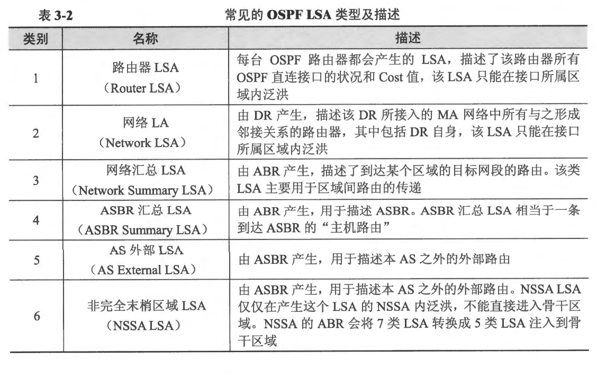
- Type-1 LSA（类型1LSA）指的是路由器LSA (Router LSA)，其他类型的 LSA 同理 

- ** 表3-2中并没有体现 Type-6 LSA，该类 LSA 被称为组成员 LSA (Group Membership LSA)，这种LSA 在MOSPF（组播扩展 OSPF）中被使用 **

<br>
<br>

### 3.2.2 LSA 头部
- OSPF 的 LSU 报文用于发送链路状态更新，在该报文中包含着一个或多个LSA，而且是LSA 的完整数据（如图3-20 所示）。OSPF 定义了多种类型的LSA，但是这些 LSA 拥有相同的 LSA 头部。图3-21 展示了 LSA 的头部。
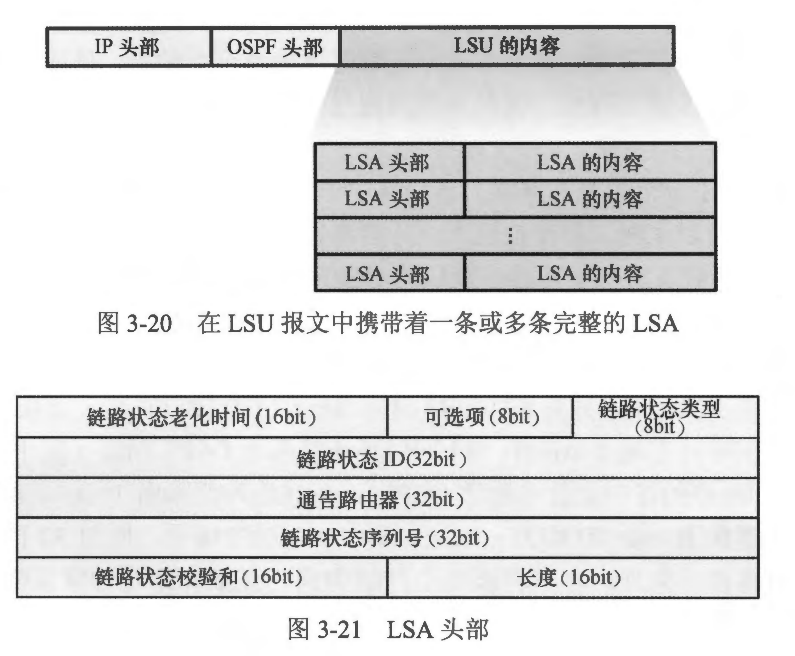

- LSA 头部一共 20 byte， 每个字段的含义如下: 
  - 链路状态老化时问(Link-State Age): 指示该条 LSA 的老化时间，即它存在了多长时间，单位为秒，这是一个 16bit 的整数。当该 LSA 被始发路由器产生时，该值被设置为 0,之后随着该 LSA 在网络中被泛洪，它的老化时间逐渐累加。当某合路由器将 LSA 存储到自己的 LSDB 后，LSA 的老化时间也在递增，当老化时间增加到 MaxAge（最大老化时间）时，该 LSA 将不再被用于路由计算
  - 可选项 (Options):  总共 8bit， 每一个比特位都对应了 OSPF 所文持的某种特性。
  - 链路状态类型 (Link-State Type): 指示本条 LSA 的类型。OSPF 定义了多种类型的 LSA，每种 LSA 用于描述 OSPF 网络的某个部分，所有的LSA 类型都定义了相应的类型编号。常见的 LSA 类型及 LSA 的名称见表 3-2。
  - 链路状态 ID (Link-State ID): LSA 的标识。不同的 LSA 类型，对该字段的定义是不同的
  - 通告路由器 (Advertising Router): 产生该 LSA 的路由器的 Router-ID
  - 链路状态序列号 (Link-Sate Sequence Number): 该 LSA 的序列号，该字段用于判断 LSA 的新旧或是否存在重复
  - 链路状态校验和 (Link-State Checksum）: 校验和
  - 长度 (Length): LSA 的总字节长度
- 每 个LSA 头部中的“链路状态类型”“链路状态 DD〞以及“通告路由器” 这三个字段唯一地标识了一个 LSA。当然，在同一时间有可能在网络中会出现同一个 LSA 的多个实例，那么 LSA 头部中的“链路状态老化时间”“链路状态序列号” 及“校验和”字段就可以用来判断实例的新旧，本书将在“判断 LSA 的新旧”一节中详细介绍这个概念。

<br>
<br>

### 3.2.3 LSA 详解
- OSPF 的 LSA 种类繁多，初学者在刚接触时难免会有点晕乎，单纯地讲解每种 LSA 的概念及功能显然不够直观的，因此本节将通过一个示例来逐一为大家介绍常见的几种LSA
- 图 3-22 展示了一个简单的网络，该网络中部署了 OSPF。 R1、R2 及 R3的 GE0/0/0 接口连接在同一合以太网二层交换机上，三者都在各自的 GE0/0/0 接口上激活 OSPF 并且都属于 Area 0。缺省情况下，这些接口的 OSPF 网络类型为 Broadcast，因此需要选举 DR 及 BDR，我们通过调节接口 DR 优先级，使得 R3 的 GE0/0/0 接口成为这个网络的 DR。R1 和 R2 的 GE0/0/1 接口下连着一个终端网段，两者也都在各自 GE0/0/1 接口上激活 OSPF 并都属于 Area 0。另外 R3 及 R4 使用 Serial1/0/0 接口直连，都激活 OSPF 并都属于 Area 1。R4 同时还连接着非 OSPF 网络（图中的外部网络，R4 在连接外部网络的接口上并未激活 OSPF），并且将外部路由 10.0.0.0/8 引入了 OSPF 域。所有路由器的Router-ID 均为 x.x.x.x，其中×为设备编号，例如 R1的 Router-ID 为 1.1.1.1，其他路由器同理。本节将以这个网络为例，详细介绍几种常见的 LSA 类型。
- 表3-2 列出了这些 LSA 类型。总体来说，每种 LSA 都有各自的功能，Type-1 LSA (Router LSA，路由器 LSA）及 Type-2 LSA (Network LSA，网络 LSA）描绘了区域内部的网络拓扑以及 IP 网段信息，它们只能在本区域内泛洪，有了这两种 LSA，区域内的路由器就得以计算出到达本区域内各个网段的路由，这些路由被称为区域内部路由。汇总 LSA (Suramary LSA） 有两种，其中 Type-3 LSA (Network Summary LSA，网络汇总LSA）用于描述一个区域内的路由信息并在区域之问传递，换句话说，该类 LSA 用于告知某个区域到达其他区域的路由，这些路由被称为区域问路由。Type-4 LSA (ASBR SummaryLSA, ASBR 汇总 LSA） 则用于描述 ASBR。 Type-S LSA (AS External LSA, AS 外部 LSA） 用于描述 OSPF 域外的路由。
- 完成图 3-22 中的 OSPF 部署后，首先看一下路由器的 LSDB，以 R3 为例，它有一个接口接入 Area 1 ， 另一个接口接入 Area 0，因此它是一台 ABR，它分别为这两个区域各维护一个 LSDB。使用 show ip ospf database 命令可以查看路由器的 LSDB。
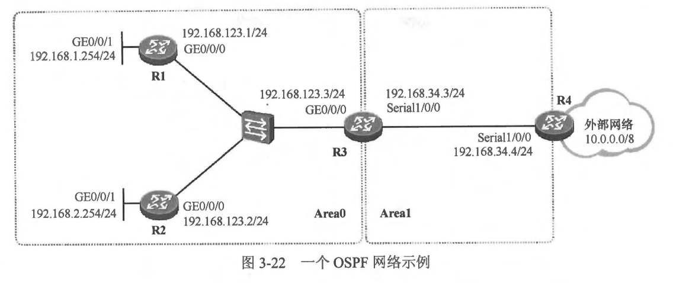

```shell
R3#show ip ospf database

            OSPF Router with ID (3.3.3.3) (Process ID 100)

                Router Link States (Area 0)

Link ID         ADV Router      Age         Seq#       Checksum Link count
1.1.1.1         1.1.1.1         240         0x80000006 0x00AC2A 2
2.2.2.2         2.2.2.2         240         0x80000004 0x008747 2
3.3.3.3         3.3.3.3         98          0x80000004 0x00320E 1
4.4.4.4         4.4.4.4         192         0x80000004 0x00E770 2

                Net Link States (Area 0)

Link ID         ADV Router      Age         Seq#       Checksum
192.168.123.1   1.1.1.1         240         0x80000002 0x00CA68

                Summary Net Link States (Area 0)

Link ID         ADV Router      Age         Seq#       Checksum
192.168.34.0    3.3.3.3         94          0x80000001 0x0088DC

                Summary ASB Link States (Area 0)

Link ID         ADV Router      Age         Seq#       Checksum
4.4.4.4         3.3.3.3         94          0x80000001 0x00EAF4

                Router Link States (Area 1)

Link ID         ADV Router      Age         Seq#       Checksum Link count
3.3.3.3         3.3.3.3         98          0x80000001 0x004B16 2
4.4.4.4         4.4.4.4         99          0x80000002 0x00EB6E 2

                Summary Net Link States (Area 1)

Link ID         ADV Router      Age         Seq#       Checksum
192.168.1.254   3.3.3.3         99          0x80000001 0x00EAD1
192.168.2.254   3.3.3.3         99          0x80000001 0x00DFDB
192.168.123.0   3.3.3.3         99          0x80000001 0x0093AE

                Type-5 AS External Link States

Link ID         ADV Router      Age         Seq#       Checksum Tag
10.0.0.0        4.4.4.4         192         0x80000001 0x00EC99 0
```
- 从上面的输出可以看到 R3 的 LSDB，其中包含 Area 1 及 Area 0 中泛洪的各类 LSA,大家已经能观察到 Router LSA、Network LSA 以及 Network Summary LSA， 另外还有在全域范围内泛洪的 AS External LSA。由于同一个区域内的路由器关于该区域的 LSDB 是一致的，因此就没有必要再去R1、R2 及 R4 上查看 LSDB了。
- 1. Type-1 LSA
  - 路由器通过该 LSA 描述自己 “家门口的状况”。每一合运行 OSPF 的路由器均会产生 Type-1 LSA，该 LSA 描述了路由器的直连接口状况和接口 Cost，同属一个区域的接口共用一个 Type-1 LSA 描述，当路由器有多个接口属于不同区域时，它将为每个区域单独产生一个 Type-1 LSA，并且每个 LSA 只描述接入该区域的接口。另外，Type-1 LSA 中也包含着一些特殊的比特位，用于指示该路由器的特殊角色，例如该路由器如果是 ABR、ASBR 或者是 Virtual Link 的端点，则这些比特位就会进行相应的置位。Type-1 LSA的报文结构如图 3-23 所示:
   
  - 对于 Router LSA 而言，LSA 头部中的“链路状态类型” 宇段的值为 1，“链路状态 DD ”字段的值是产生这个 Type-1 LSA 的路由器的 Router-ID。
  - V 位(Virtual Link Endpoint Bit): 如果该比特位被设置为 1，则表示该路由器为 Virtual Link 的端点。
  - E 位 (External Bit): 如果 IP 比特位被设置为 1，则表示该路由器为 ASBR。在 stub 区域中，不允许出现 E 比特位被设置为 1 的Type-1 LSA，因此 stub 区域内不允许出现 ASBR。
  - B 位 (Border Bit): 如果 B 比特位被设置为 1，则表示该路由器为两个区域的边界路由器，字母 B 意为 Border(边界)。一台路由器如果同时连接两个或两个以上的区域，则其产生的 Type-1 LSA 会将 B 比特位设置为 1，即使它没有连接到 Area 0。
  - 链路数量 (Linkss Number): 该 Type-1 LSA 所描述的 Link(链路）数量。我们己经知道每台路由器都会产生 Type-1 LSA，而且该 LSA 描述了路由器直连接口的状况和 Cost 值，实际上路由器正是采用包含在 Type-1 LSA 中的 Link 来描述直连接口的。“链路数量”字段指明在该 Type-1 LSA 中，包含了几条 Link。每条 Link 均包含“链路类型”“链路 ID”“链路数据〞以及“度量值〞 这几个关键信息。路由器可能会采用一个或者多个Link 来描述某个接口。
  - 链路类型 (Link Type): 本条Link 的类型值，该值与 Link 的类型相关。前面的章节提到 OSPF 定义了多种网络类型 (Network Type): P2P 、P2MP 、 Broadcast 以及 NBMA,当一个接口激活 OSPF 后，OSPF 会根据这个接口的封装协议来判断接口运行在什么类型的网络上。另一方面，OSPF 在其产生的Type-1 LSA 中使用 Link 来描述自己的直连接口的状况，OSPF 定义了多种链路类型，这些链路类型与接口的网络类型也是有关的。需要格外注意的是，OSPF 的网络类型与链路类型是不同的概念，不要搞混淆。表3-3 中罗列了 OSPF 定义的各种链路类型及对应的链路 ID、链路数据的描述。
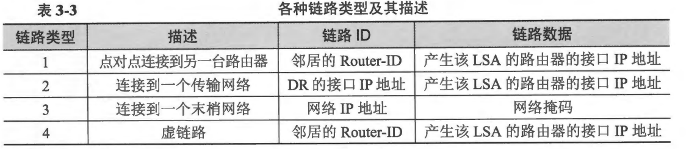 
  - ** 由于 TOS 及 TOS 度量值在 RFC2328 中不再支持（这些字段被保留仅是为了兼容早期的 OSPF 版本），因此虽然图 3-23 中显示了相关的宇段，但是读者朋友们可忽略与 TOS 相关的宇段。 **

  - 现在来看图 3-22 所示的例子。网络中的每台路由器都会产生 Type 1 LSA。 以 R1 为例，由于它的 GE0/0/0 及 GE0/0/1 接口均已激活 OSPF，而且这两个接口都接入了 Area 0,因此它会产生一个 Type-1 LSA，在这个 LSA 中描述这两个接口的状况，并在 Area 0 内泛洪该 LSA，如图 3-24 所示。R1 的 GE0/0/1 是一个以太网接口，并且使用的网段是 192.168.1.0/24，另外 R1 在这个接口上并没有建立 OSPF 邻接关系，因此在该 Type-1 LSA 中,OSPF 描述这个接口的 Link 的相关内容是: 链路类型 = 3（表示连接到一个末梢网络），链路1D=192.168.1.0（该接口的 卫地址所属的网络地址），链路数据-255.255.255.0（该接口的网络掩码），度量值 = 1（接口的 Cost 值)。另一个接口 GE0/0/0 也是一个以太网接口，使用 192.168.123.0/24 网段，并且通过该接口，R1 与 R3 建立了邻接关系，因此描达这个接口的几个关键信息是:链路类型 = 2（表示连接到一个传输网络)，链路 ID=192.168.123.3 (DR 的接口 IP 地址，也即 R3 的接口 IP 地址），链路数据 = 192.168.123.1（本接口 IP 地址），度量值 = 1。综上，R1 在自己产生的这个 Type-1 LSA 中包含两个 Link，该LSA 在整个 Area 0 内泛洪。
  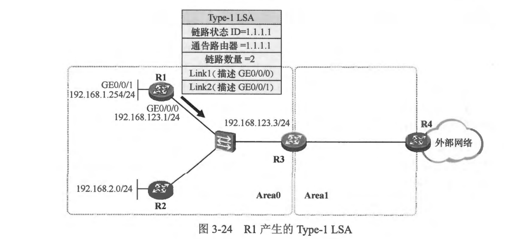 
  - 使用show ip ospf database router 命令可以查看 LSDB 中的 Type-1 LSA，如果在该命令后再增加 相关路由器的Route-ID 关键字则可以查看指定的 OSPF 路由器产生的 Type-1 LSA,例如：
  ```shell
  R1#show ip ospf database router 1.1.1.1
  
              OSPF Router with ID (1.1.1.1) (Process ID 100)
  
                  Router Link States (Area 0)
  
    LS age: 1399
    Options: (No TOS-capability, DC)
    LS Type: Router Links
    Link State ID: 1.1.1.1
    Advertising Router: 1.1.1.1
    LS Seq Number: 80000006
    Checksum: 0xAC2A
    Length: 48
    Number of Links: 2
  
      Link connected to: a Stub Network
       (Link ID) Network/subnet number: 192.168.1.254
       (Link Data) Network Mask: 255.255.255.255
        Number of MTID metrics: 0
         TOS 0 Metrics: 1
  
      Link connected to: a Transit Network
       (Link ID) Designated Router address: 192.168.123.1
       (Link Data) Router Interface address: 192.168.123.1
        Number of MTID metrics: 0
         TOS 0 Metrics: 10
  
  ```
  
  - 以上所输出的就是 R1 产生的 Type-1 LSA，可以看到其中包含的两条 Link。再来看看 R3， R3 的情况比较特殊，它有两个接口分别连接到两个区域，其中 GE0/0/0 连接到了 Area 0,而 Serial1/0/0 则连接了 Area 1，很显然它是一台 ABR。它将产生两个 Type-1LSA（如图 3-25 所示），一个用于在 Area 0 内泛洪，描述的是其接入该区域的接口 GE0/0/0,这个Type-1 LSA 中包含一个用于描述 GE0/0/0 接口的 Link，其链路类型 = 2(表示连接到一个传输网络），链路 ID = 192.168.123.3，链路数据 = 192.168.123.3，度量值 = 1；R3 产生的另一个 Type-1 LSA 则是在 Area 1 内泛洪，描述的是其连接 Area 1  的接口 Serial1/0/0。
  Serial1/0/0 接口的网络类型为 P2P，在描述这种类型的接口时，OSPF 可能会采用一条或多条 Link。以 R3 的 Seriall/0/0 接口为例，由于该 P2P 接口上存在一个全毗邻的邻居，因此 OSPF 将采用两个 Link 来描述这个接口以及与邻居的关系。其中一个 Link 的链路类型 = 1（表示点到点连接到另一台路由器)，链路ID = 4.4.4.4（该邻居的 Router-ID，也就是 R4 的 Router-ID），链路数据 = 192.168.34.3（本接口 IP 地址），度量值 = 48；另一个 Link 的链路类型 = 3（表示接入一个末梢网络），链路 ID = 192.168.34.0，链路数据 = 255.255.255.0，度量值= 48。在这种场景中，为何 OSPF 需要两个 Link 来描述一个接口呢？回顾一下 Type-1 LSA 的重要用途----帮助其他路由器在本地绘制出网络的拓扑并发现网段信息。这两个Link 中，前者用于绘制拓扑(接口 Serial1/0/0 对端的路由器是谁？设备的接口 IP 地址是什么？），后者用于描述这段链路的网段信息(这段链路的网络地址及网络掩码）。
  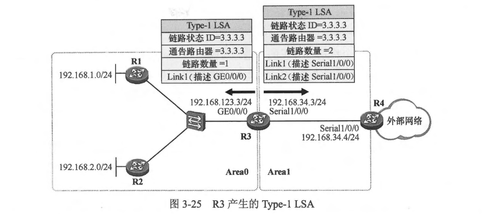 
  ```shell
  
  R3#show ip ospf database router 3.3.3.3
  
              OSPF Router with ID (3.3.3.3) (Process ID 100)
  
                  Router Link States (Area 0)
  
    LS age: 1515
    Options: (No TOS-capability, DC)
    LS Type: Router Links
    Link State ID: 3.3.3.3
    Advertising Router: 3.3.3.3
    LS Seq Number: 80000004
    Checksum: 0x320E
    Length: 36
    Area Border Router
    Number of Links: 1
  
      Link connected to: a Transit Network
       (Link ID) Designated Router address: 192.168.123.1
       (Link Data) Router Interface address: 192.168.123.3
        Number of MTID metrics: 0
         TOS 0 Metrics: 10
  
  
  
                  Router Link States (Area 1)
  
    LS age: 1515
    Options: (No TOS-capability, DC)
    LS Type: Router Links
    Link State ID: 3.3.3.3
    Advertising Router: 3.3.3.3
    LS Seq Number: 80000001
    Checksum: 0x4B16
    Length: 48
    Area Border Router
    Number of Links: 2
  
      Link connected to: another Router (point-to-point)
       (Link ID) Neighboring Router ID: 4.4.4.4
       (Link Data) Router Interface address: 192.168.34.3
        Number of MTID metrics: 0
         TOS 0 Metrics: 64
  
      Link connected to: a Stub Network
       (Link ID) Network/subnet number: 192.168.34.0
       (Link Data) Network Mask: 255.255.255.0
        Number of MTID metrics: 0
         TOS 0 Metrics: 64
  
  ```
  - 关于 OSPF 还有一个特别有意思的事情，那就是对 Loopback 接口的处理。假设我们为路由器创建了一个 Loopback 接口，并且为它分配 192 168.200.11/24 的 IP 地址，然后在这个接口上激活 OSPF，那么路由器将在其产生的 Type-1 LSA 中描达这个接口。在描述该接口时，OSPF 采用的链路类型为了（接入一个末梢网络），链路 ID 为该接口的 IP 地址(192.168.200.11），链路数据则设置为全F，表示掩码为 255.255.255.255 (/32) 尽管该 Loopback 接口的真实掩码为 255.255.255.0（/24)，另外度量值缺省为 0。因此区域中的其他 OSPF 路由器在基于该 LSA 计算路由时，关于这个 Loopback 接口便会计算出一条 /32 的主机路由，这就是为什么在 OSPF 的实现中，无论网络管理员为 Loopback 接口分配什么网络掩码，在其他设备的路由表中，关于该接口始终得到一条主机路由。要想将路由的掩码恢复成 Loopback 接口的真实掩码，可以将该 Loopback 接口的 OSPF网络类型修改为 Broadcast （或 NBMA)。
  
- 2. Type-2 LSA
  - 经过 Type-1 LSA 的泛洪,区域内的路由器已经能够大致地描述出本区域内的网络拓扑，但是，要想完整地描述区域内的网络拓扑结构及网段信息，光有 Type-1 LSA 是不够的，留意到如果路由器的接口接入一个 MA 网络并且在该网络上存在形成了邻接关系的邻居，则用于描述该接口的 Link 的链路类型为 2，链路口为 DR 的接口 IP 地址，而链路数据为本路由器接口的 IP 地址，但是这个 MA 网络的掩码呢？有多少路由器连接在这个 MA网络上呢？这些信息暫时还是未知的(至少通过 Type-1 LSA还无法知晓）。因此就需要用到 Type-2 LSA 了。
  - 在MA 网络中，OSPF 会选举 DR 及 BDR，所有的 DROther 路由器都只能和 DR 及 BDR 建立邻接关系，DROther 路由器之间不会建立全毗邻的 OSPF 邻接关系。DR 会在本区域内泛洪Type-2LSA，来列举出接入该MA网络的所有路由器的 Router-ID（其中包括 DR 自身），以及这个网络的掩码。因此 Type-2 LSA 仅存在于拥有 MA 网络的区域中，该 LSA 由DR 产生。Type-2 LSA 的格式如图 3-26所示。
  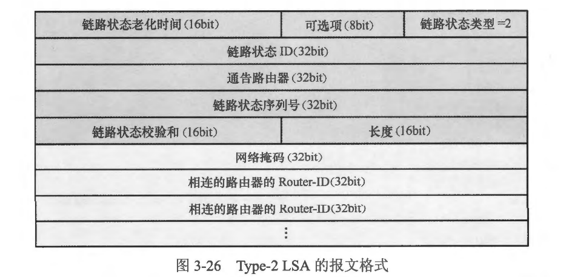 
  - 在 Type-2 LSA 中，LSA 头部中“链路状态类型” 字段的值为 2，“链路状态 ID ”字段的值为产生这个 Type-2 LSA的 DR 的接口 IP 地址。
    - 网络掩码(Network Mask): 该MA网络的网络掩码。
    - 相连的路由器 (Attached Router）的Router-ID: 连接到该 MA 网络的路由器的Router-ID（与该 DR 建立了邻接关系的邻居的Router-ID，以及DR自己的 Router-ID),如果有多台路由器接入该MA网络，则使用多个字段描述。
  - 回到本小节的例子，R1 、R2 及 R3 三台路由器的 GE0/0/0 接口都接入同一合以太网二层交换机，另外它们的接口 IP 地址均属于相同网段——这三个接口处于同一个 MA 网络，DR 、BDR的选举过程将会在这里发生，最终由于 R3 的 GEO/0/0 接口的 DR 优先级被人为调高，因此它胜出成为这个 MA 网络的 DR。如此一来，它将在Area 0 内泛洪一个 Type-2 LSA，在该 LSA 中将包含 R1、R2 及 R3 三台路由器的 Router-ID，另外该 LSA 还会描述这个 MA 网络的掩码: 255.255.255.0，如图 3-27 所示。
  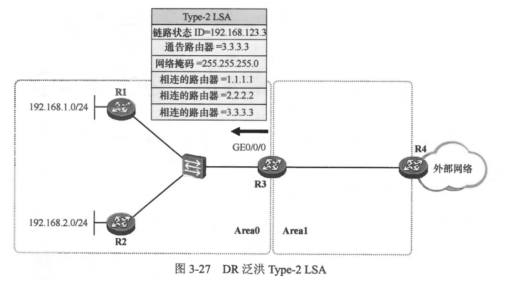 
  ```shell
  R3#show ip ospf database network
  
            OSPF Router with ID (3.3.3.3) (Process ID 100)
  
                Net Link States (Area 0)
  
  LS age: 350
  Options: (No TOS-capability, DC)
  LS Type: Network Links
  Link State ID: 192.168.123.1 (address of Designated Router)
  Advertising Router: 1.1.1.1
  LS Seq Number: 80000003
  Checksum: 0xC869
  Length: 36
  Network Mask: /24
        Attached Router: 1.1.1.1
        Attached Router: 2.2.2.2
        Attached Router: 3.3.3.3
  
  ```
  - Area 1 内没有 MA 网络，因此不存在 Type-2 LSA。
  - 得益于 Type-1、Type-2 LSA 在区域内的泛洪，OSPF 就能够描绘出一个区域内的完整拓扑（详细到设备每个接口的 Cost） 并发现各个网段的信息＜网络地址及网络掩码）。一个区域内的所有路由器关于该区域的 LSDB 是完全一致的，只有这样，这些路由器才能准确地计算出到达区域内各个网段的路由。路由器将自己基于某个直连区城内泛洪的 Type-1 及 Type-2 LSA 计算得到的路由视为区域内部路由 (Intra-Area Route)。
  - 在本例中，R3 是一台 ABR，它有两个接口分别连接 Area 0 及 Area 1， 因此它分别维护着这两个区域的 LSDB，这有助于它构建如图 3-28 所示的网络拓扑。接下来，R3将以自己为根，运行 SPF 算法并最终获得到达各个网段的最短路径，如图3-29 所示。
  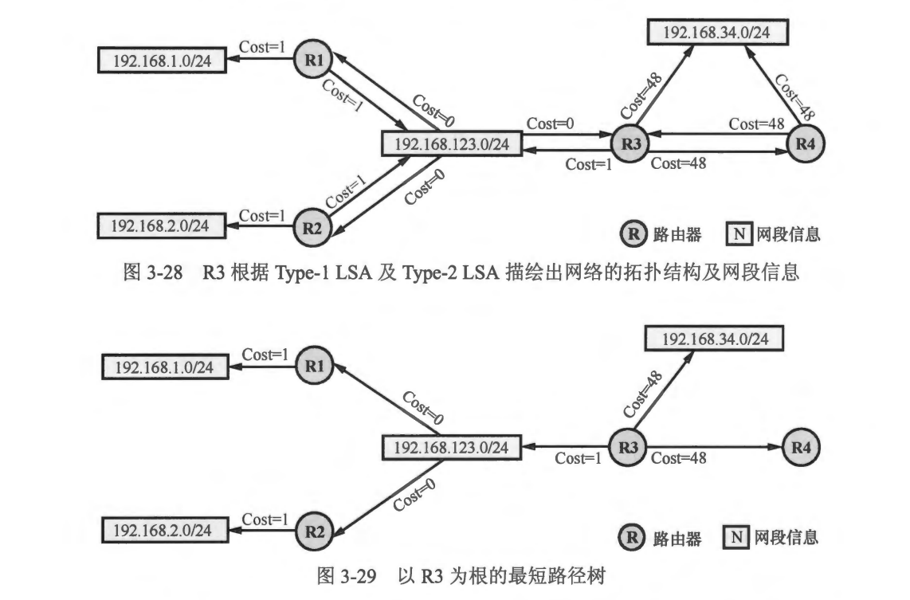 
  - 与 R3 不同,R1 及 R2 是区域内部路由器,它们只能根据区域内泛洪的 Type-1、Tvpe-2 LSA 计算出到达 Area 0 内各网段的路由，而到达 Area 0 之外的路由，例如到达 192.168.34.0/24 网段的路由，目前它们暂时是无法知晓的。要实现区城间路由的传递，就必須借助 Type-3 LSA。


- 3. Type-3 LSA
  - 前两类 LSA 解决了区域内路由计算的问题，那么区域间路由的计算呢？显然当一个 OSPF 网络中存在多个区域时，单凭 Type-1 及 Type-2 LSA 仅能解决单个区域内的路由计算问题，但是区域之问的路由传递目前依然有待解决，因为 Type-1 及 Type-2 LSA 只能在始发区域内泛洪，无法被泛洪到区域之外。Type-3 LSA 也就是网络汇总 LSA (Network Sumamary LSA)，这里的 “汇总”二字，其实理解为 “归纳” 更为贴切，它和路由汇总是完全不同的概念。Type-3 LSA 是由 ABR 产生的，用于解决区域之间的路由传递问题。由于 ABR 同时连接着非骨干区域以及 Area 0， 因此它分别为这些区域维护着 LSDB 并且计算出到达直连区域的区域内部路由，它向某个区域注入 Type-3 LSA，以便向该区域通告到达其他区域的区域同路由。Type-3 LSA 的格式如图 3-30 所示。
  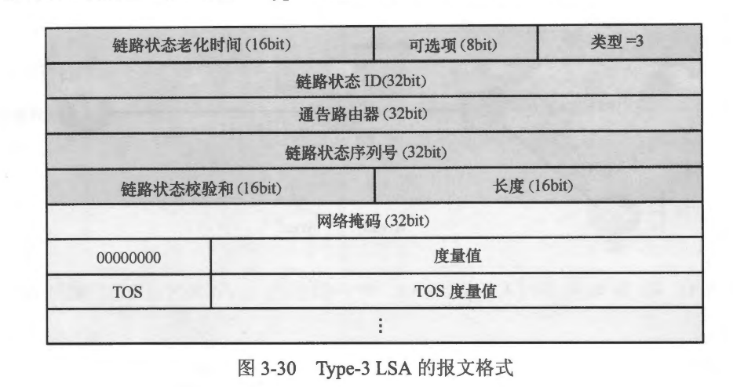 
  - 在 Type-3 LSA 中，“链路状态 ID” 字段的值为区域间路由的目的网络地址，其他宇段及其含义如下:
    - 网络掩码 (Netmask): 区域间路由的目的网络掩码
    - 度量値（Metric): 路由的 Cost
  - ** 由于TOS 及 TOS 度量值在 RFC2328 中不再支持（这些字段被保留仅是为了兼容早期的 OSPF 版本)，因此读者朋友们可忽略与 TOS 相关的字段。**
  - 在本小节引用的例子中，R3 通过 Area 0 及 Area 1 内泛洪的 Type-1、Type-2 LSA 己经能够分别计算出到达 Area 0 及 Area 1 内各网段的区域内部路由。现在它会为这些区域内的路由产生 Type-3 LSA，并且将其注入另一个区域中。如 图3-31 所示，它将描述到达 Area 1 内 192.168.34.0/24 网段的路由的Type-3 LSA 注入 Area0， 在这个 Type-3 LSA 中，链路状态 ID 为该路由的目的网络地址 192.168.34.0，网络掩码为 255.255.255.0，通告路由器自然是该 ABR（R3）的 Router-ID，另外这条路由的 Cost 为 48，实际上这个 Cost 是 R3 自己到达目的网段的路径 Cost，在这个拓扑中就是 R3 的 Serial1/0/0 接口的 Cost.
  - 在收到这个 Type-3 LSA 后，R1 及 R2 就能够计算到达 192.168.34.0/24 网段的区域间路由，并且该区域间路由的 Cost 为 49（也即 48+1，其中 1 就是它们的 GE0/0/0 接口的 Cost，也就是说它们到达目标网段的路径 Cost，是在 R3 所通告的 Cost 的基础上，加上自己到达 R3 的 Cost)。
  - 另一方面，R3 也会将描达到达 Area 0 内三个网段 (192.168.1.0/24、192.168.2.0/24 及 192.168.123.0/24）的路由的 Type-3 LSA 注入 Area 1，如图3-32 所示。这样一来，R4 就能够学习到这三条区域间路由。
  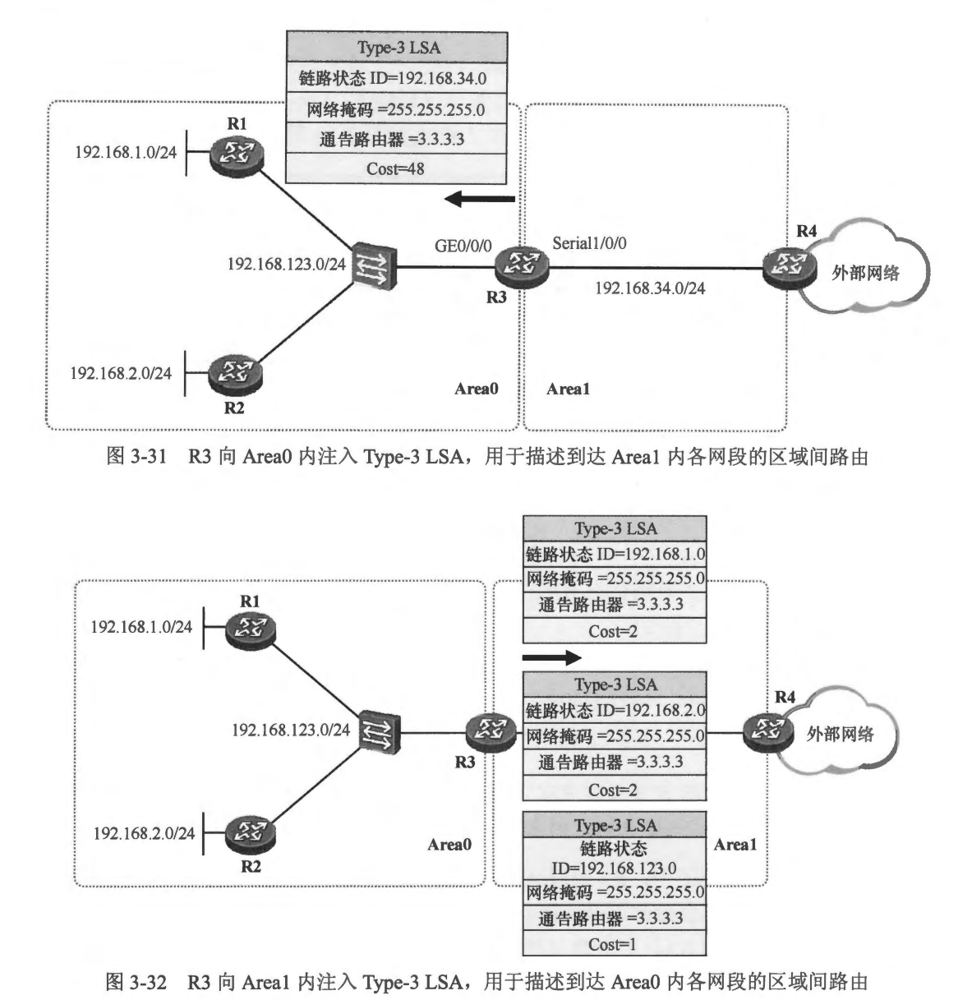 
  - 在R3上执行 show ip ospf database 命令，可以查看其LSDB中的Type-3 LSA:
  ```shell
  R3#show ip ospf database summary

            OSPF Router with ID (3.3.3.3) (Process ID 100)

                Summary Net Link States (Area 0)

  LS age: 1019
  Options: (No TOS-capability, DC, Upward)
  LS Type: Summary Links(Network)
  Link State ID: 192.168.34.0 (summary Network Number)
  Advertising Router: 3.3.3.3
  LS Seq Number: 80000002
  Checksum: 0x86DD
  Length: 28
  Network Mask: /24
        MTID: 0         Metric: 64


                Summary Net Link States (Area 1)

  LS age: 1019
  Options: (No TOS-capability, DC, Upward)
  LS Type: Summary Links(Network)
  Link State ID: 192.168.1.254 (summary Network Number)
  Advertising Router: 3.3.3.3
  LS Seq Number: 80000002
  Checksum: 0xE8D2
  Length: 28
  Network Mask: /32
        MTID: 0         Metric: 11

  LS age: 1019
  Options: (No TOS-capability, DC, Upward)
  LS Type: Summary Links(Network)
  Link State ID: 192.168.2.254 (summary Network Number)
  Advertising Router: 3.3.3.3
  LS Seq Number: 80000002
  Checksum: 0xDDDC
  Length: 28
  Network Mask: /32
        MTID: 0         Metric: 11

  LS age: 1019
  Options: (No TOS-capability, DC, Upward)
  LS Type: Summary Links(Network)
  Link State ID: 192.168.123.0 (summary Network Number)
  Advertising Router: 3.3.3.3
  LS Seq Number: 80000002
  Checksum: 0x91AF
  Length: 28
  Network Mask: /24
        MTID: 0         Metric: 10
  ```
  
  - 接下来，本书将从宏观的层面进一步探讨 Type-3 LSA 的泛洪过程。首先临时性地将本小节的演示拓扑做一点小小的变更（该变更仅用于讲解 Type-3 LSA，如图3-33所示）: 新增路由器 R5，R5 分别与R1 及 R2 直连，直连网段分别为 192.168.1.0/24 及 192.168.2.0/24，并且接口都处于 Area2 中，拓扑中的其他内容不变。
  - 以从左到右的视角来分析，R1 及 R2 作为 ABR，它们都会为 Area 0 注入两条 Type-3 LSA，分别用于描述到达 Area 2 内 192.168.1.0/24 及192.168.2.0/24 网段的路由。这样 R3 便能根据这些 Type-3 LSA 计算出到达这两个网段的区域间路由。再看看关于区域间路由的 Cost 值问题，以 R1 为例，它向 Area 0 中所泛洪的这两条 Type-3 LSA，会分别附加上它自己到达这两个网段的 Cost，R3 收到这两条 Type-3 LSA 后即可进行区域间路由计算一一它到这两个目标网段的 Cost，是在 R1 所通告的 Cost 值的基础上，加上自己到 R1 的 Cost。R3 通过查询路由表获得自己到R1的 Cost（实际上这个 Cost 值的计算得益于 Area 0 中泛洪的 Type-1 及 Type-2 LSA)。
  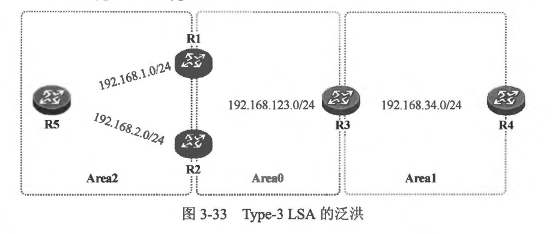 
  ** 注意: 在一个区域中泛洪的 Type-3 LSA 描述的是到达该区域之外、但仍属于 OSPF 域内的网段的路由，并且 Type-3 LSA 只能在一个区域内泛洪。因此 R1 及 R2 注入 Area 0 的 Type-3 LSA 只能在 Area 0 中泛洪，不能直接进入 Area 1。R3 会重新向 Area 1 中注入 Type-3 LSA，用于描迷到达相应网段的区域问路由。**
  - 再看看 R3，它会产生三条 Type-3 LSA 注入 Area 1，这三条 Type-3 LSA 分别用于描述到达 Area 0 中 192.168.123.0/24 网段的路由，以及到达 Area 2 中 192.168.1.0/24 和192.168.2.0/24 网段的路由。这三条 Type-3 LSA 中也都携带着 R3 自己到达相应网段的Cost。R4会收到这些 Type-3 LSA 并计算区域间路由，而它到这三个目标网段的 Cost,就等于R3 所通告的 Cost 值加上自己到R3的 Cost。
  - 讲到现在，您可能已经发现了一些端倪：OSPF 区域间路由的传播过程与距离矢量路由协议的路由传播过程非常相似。大家已经知道，距离矢量路由协议基于 “传闻”的路由更新行为非常容易引发路由环路，显然，对于区域间路由的传递，OSPF 也需要一定的防环机制。
  - 首先，OSPF 要求区域间路由必须通过 Area 0 中转，这使得 OSPF 网络在逻辑上构成一个以 Area 0 为中心、其他区域为分支的星型逻辑结构，这在很大程度上减小了环路出现的可能。当然，这也形成了 OSPF 区域设计的一条规矩----所有的非骨干区域必须与骨于区域 Area 0 直接相连。
  - 另外，OSPF 要求 ABR 只能将自己到达所连接区域的区域内部路由通告给 Area 0(区域间路由则不被允许），另外，可以将其到达所连接区域的区域内部路由及到达其他区域的区域间路由通告给非骨干区域。以图 3-33 显示的网络为例，对于 R3 而言，到达 Area 0 中的 192.168.123.0/24 网段的路由便是区域内路由，而到达 Area 2 中的 192.168.1.0/24 及 192.168.2.0/24 网段的这两条路由则是区域间路由，R3 会将这三条路由都通告到 Area 1（非骨干区域）中，当然，它是通过向该区域注入 Type-3 LSA 来实现上述目的的。现在，假设 R4 增加一条与 R2 直连的链路并通过该链路与 R2 建立了邻接关系，而且该链路属干 Area 0. 如此一来 R4 也就成为了一台 ABR，则 R4 能够将到达直连区域 Area 1 中192.16834.0/24 网段的路由通告给 Area 0， 但是却不能将其在 Area 1 学习到的区域间路由 192.168.1.0/24、192.168.2.0/24 以及 192.168.123.0/24 通告给 Area 0（给 R2 ），因为这些路由正是通告自 Area 0 的，如果这些路由被通告给 Area 0，则可能引发路由环路。

- 4. Type-4 LSA 
  - 利用 Type-1、Type-2 LSA，OSPF 路由器能够完成区域内部网络拓扑的绘制并发现区域内的网段信息，因此依赖这两种 LSA，单个区域内的路由计算是没有问题的。而得益于 Type-3 LSA 的泛洪，区域间的路由传递也可以顺利实现。因此，Type-1、Type-2 及 Type-3 LSA 这三类 LSA 解决了单个 OSPF 域内的路由计算问题。
  - 现在来看看当外部路由被引入 OSPF 域后，OSPF 如何实现路由计算。首先，不妨通过一个例子来帮助大家理解外部路由的引入过程，假设有这么一座城，它被划分成了多个行政区，这座城市与外界完全隔绝，被封闭了起来，外面的信息进不来，里头的消息也出不去。有一天，这座城市在某个行政区开启了一个城门，这个城门成了城内居民去往城外的一个出口。现在，关于城外各种新奇事物的描绘经过这座城门被城内各个行政区的千家万户知晓了，大家都知道原来外面还有这么多好玩儿的地方。现在大家想要出城旅游了，目的地自然是这些城外的景点，但是要出城，就必须从城门走，那么大家就需要知道城门的所在。与城门同属一个行政区的居民能直接了解到城门的具体位置，这是因为同一个行政区内，所有的信息都是公开透明的。然布与城门不在同一个行政区的居民可就不知道城门的位置了，不知道城门的位置，自然就无法经过城门到达外面的世界。因此行政区的枢纽会将城门的信息通告给其他行政区，使得与城门不在同一个区的居民能够知晓到达城门的路径，最终，整个城市的居民都能够出城旅游了。
  - 对应到 OSPF 的相关概念，上面所举的例子中，这座城市就是 OSPF 域，城市的行政区也就是 OSPF 区域，而城门则是 ASBR (Autonomous System Boundary Router， 自治系统边界路由器)，ASBR 将域外的路由(例如 RIP 路由、静态路由等)引入 OSPF, OSPF 使用 Type-5 LSA 描述这些外部路由，Type-5 LSA 能够在整个 OSPF 域内泛洪（除了一些特殊的区域)，这样所有的路由器都能知晓这些到达外部的路由，但是光获知到达外部网络的路由还是不够的，还需要知道引入这些外部路由的 ASBR 的所在。与 ASBR 同属一个区域路由器能够通过区域内泛洪的 Type-1、Type-2 LSA 计算出到达 ASBR 的路由，然而这两种 LSA 只能在本区域内泛洪，那么其他区域的路由器如何知道到达该 ASBR 的路径？这就需要用到 Type-4 LSA 了。Type-4 LSA 被称为 ASBR 汇总 LSA (ASBRSummary LSA)，由 ABR 产生，实际上是一条到达 ASBR 的主机路由。Type-4 LSA 的格式与 Type-3 LSA 是一致的。在Type-4 LSA 中，“链路状态 ID”字段的值是 ASBR 的 Router-ID，而且“网络掩码” 字段的值为全 0，另外，“度量值” 字段填写的是该 ABR 自己到达 ASBR 的 Cost 值。
  - 如 图3-34 所示，R4作为 ASBR 将外部路由 10.0.0.0/8 引入了 OSPF 域。R4 产生 Type-5 LSA 描述这条外部路由。R3 由于和 R4 同属一个区域，因此它能直接通过 Area 1 内泛洪的 Type-1 LSA 计算出从区域内到达 ASBR R4 的最佳路径。一旦我们在 R4 上执行路由重分发 R4 便会在其产生的 Type-1 LSA 中将 E 比特位设置为 1，用于宣告自己的 ASBR 的身份。然而对于 Area 0 内的 R1 及 R2 而言，它们虽然能够通过 Type-5 LSA 知晓 10.0.0.0/8 这个外部网络，但是却无法进行路由计算，因为它们并不知道如何到达 ASBR (R4 产生的 Type-1 LSA 只在 Area 1 内泛洪）。因此，R3 作为与 ASBR 同属一个区域的 ABR， 会产生描述该 ASBR 的 Type-4 LSA 并在 Area 0 内泛洪，从而 Area 0 内的 R1 及 R2 便能够计算出到达 10.0.0.0/8 的外部路由并将其加载到路由表。在 R1 上执行 show ip ospf database asbr-summary 命令，可看到其 LSDB 中的 Type-4 LSA:
  ```shell

  R1#show ip ospf database asbr-summary

            OSPF Router with ID (1.1.1.1) (Process ID 100)

                Summary ASB Link States (Area 0)

  LS age: 214
  Options: (No TOS-capability, DC, Upward)
  LS Type: Summary Links(AS Boundary Router)
  Link State ID: 4.4.4.4 (AS Boundary Router address)
  Advertising Router: 3.3.3.3
  LS Seq Number: 80000003
  Checksum: 0xE6F6
  Length: 28
  Network Mask: /0
        MTID: 0         Metric: 64
  ```
  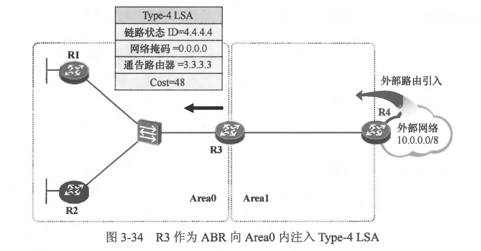 
  - 以上输出的就是R3所产生的 Type-4 LSA。实际上，Type-4 LSA 的最主要的作用，是为了帮助那些与 ASBR 不在同一个区域的路由器计算出到达 ASBR 的路由，值得注意的是，这些路由器并不将通过 Type-4 LSA 计算出来的到达 ASBR 的路由加载到全局路由表中，而只是存放在一个特殊的数据表里。


- 5. Tvre-5 LSA (AS External LSA)
  - 通过前文的描述我们已经知道，当ASBR 将外部路由引入 OSPF 时，会产生 Type-5 LSA 用于描述这些外部路由，这种类型的 LSA 一旦被产生后，会在整个 OSPF 域内传播(除了一些特殊区域）。Type-5 LSA 也就是 AS 外部 LSA (AS External LSA)。图3-35 显示了 Type-5 LSA 的报文格式。
 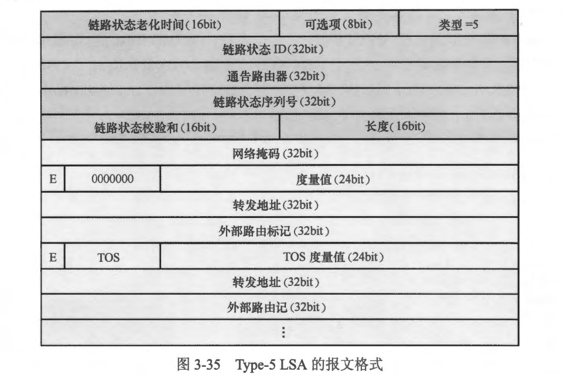  
  - 对于 Type-5 LSA，“链路状态 ID”字段的值是外部路由的目的网络地址。其他主要字段的描述如下:
    - 网络掩码 （Netmask）: 外部路由的目的网络掩码。
    - 正位: 用于表示该外部路由使用的度量值类型。OSPF 定义了两种外部路由度量值类型，分别是 Metric-Type-1 和 Metric-Type-2。如果该比特位被设置为 1，则表示外部路由使用的度量值类型为 Metric-Type-2，如果该比特位被设置为 0，则表示外部路由使用的度量值类型为 Metric-Type-1。关于这两种度量值类型的区别
    - 度量值 （Metric): 该外部路由的 Cost
    - 转发地址 (Forwarding Address, FA): 当 FA 为 0.0.0.0 时，则到达该外部网段的流量会被发往引入这条外部路由的 ASBR。而如果 FA 不为 0.0.0.0，则流量会被发往这个转发地址。FA 这一概念的引入，使得 OSPF 在某些特殊的场景中得以规避次优路径问题。关于FA 将在后续的小节中继续讨论。
    - 外部路由标记 (External Route Tag): 这是一个只有外部路由才能够携带的标记，常被用于部署路由策略。举个例子，假设我们在 OSPF 域外有两种业务: 办公及生产，现在ASBR把这两种业务各自的路由都引入OSPF，用于描述这些外部路由的Type-5 LSA 将在整个 OSPF 域内传播，现在如果需要在域内某个位置部署路由策略，分别对这些办公及生产的路由执行不同的策略，那么首先就要区分这些路由，如果单纯通过路由的目的网络地址及网络掩码进行区分显然是不够便捷的。而如果在 ASBR 上引入这些外部路由时，就分别为生产及办公路由打上相应的标记，那么在域内执行策略的时候就可以直接对相应的标记进行路由匹配，从而使得路由策略的部署更加方便。在华为的路由器上，缺省时该宇段值被设置为 1。
    ** 说明: 由于 TOS 及 TOS 度量值在 RFC2328 中不再支持（这些字段被保留仅是为了兼容早期的 OSPF 版本），因此可忽略与 TOS 相关的宇段。**
    - 在 ASBR 将外部路由引入 OSPF 时，可以指定路由的外部 Cost 值，以及度量值类型。接下来继续看本节开始时提到的例子。R4 将外部路由 10.0.0.0/8 引入了 OSPF，图 3-36 描述了这个 LSA 大概的样子，这个LSA 将在整个 OSPF 域内泛洪。使用 show ip ospf database external 命令能够查看到网络中泛洪的 Type-5 LSA:
    ```shell
    R1#show ip ospf database external

            OSPF Router with ID (1.1.1.1) (Process ID 100)

                Type-5 AS External Link States

    LS age: 789
    Options: (No TOS-capability, DC, Upward)
    LS Type: AS External Link
    Link State ID: 10.0.0.0 (External Network Number )
    Advertising Router: 4.4.4.4
    LS Seq Number: 80000003
    Checksum: 0xE89B
    Length: 36
    Network Mask: /8
        Metric Type: 2 (Larger than any link state path)
        MTID: 0
        Metric: 20
        Forward Address: 0.0.0.0
        External Route Tag: 0

    ```
     
    - 当一条外部路由被引入 OSPF 时，ASBR 除了会设置该路由的外部 Cost 值，还会设置其度量值类型，这两个值最终都会被写入 Type-5 LSA 的相关字段中。
    - 一台路由器在收到 Type-5 LSA 后，需要检查引入该外部路由的 ASBR 是否可达，如果该 ASBR 可达，路由器才会使用该 Type-5 LSA 进行外部路由计算。另外，不同的外部路由度量值类型，路由的 Cost 值算法是不同的。假设一条 Type-5 LSA 的外部 Cost 为 B,而路由器又到达产生这条 Type-5 LSA 的 ABSR 的路径 Cost 为 A,则当 Type-5 LSA 的度量值类型为 Metric-Type-1 时，又计算出的这条外部路由的 Cost 等于 A+B，但如果度量值类型为 Metric-Type-2，则路由的 Cost 等于 B。
    
- 6. Type-7 LSA
  - Type-7 LSA 也就是非完全末梢区域外部 LSA (Not-So-Stubby Area External LSA)。这是一种特殊的 LSA，也是用于描述 OSPF 外部路由，并且其报文格式与 Type-5 LSA 一致，但是它的泛洪范围却是有严格限制的---它只能够在 NSSA (Not- So-Stubby Area， 非完全末梢区域）内泛洪，并且不能进入 Area0。
  - OSPF 除了定义常规区域外，还定义了几种特殊区域类型，NSSA 就是其中之一。NSSA 禁止来自 Area 0 的Type-5 LSA 进入，这使得该区域内泛洪的 LSA 在一定程度上减少了，当然，这也有助于减小 NSSA 中路由器的路由表规模，从而减小设备负担，而 ABR为了让 NSSA 内的路由器能通过骨干区域访问被过滤掉的Type-5 LSA 所描述的外部路由，会向 NSSA 中发布一条默认路由（使用Type-7 LSA 描述）。另一方面，NSSA 允许本区域中的路由器引入少量外部路由，这些外部路由被引入后将使用 Type-7 LSA 描述，而且 Type-7 LSA 只能够在该 NSSA 内泛洪，不允许被注入 Area 0。NSSA 的 ABR 会负责将 NSSA 内泛洪的 Type-7 LSA 转换成 Type-5 LSA，使得这些外部路由能够在 OSPF 域内传播。
  - 在图 3-37中，Area 1 由原来的常规区域被修改为 NSSA。 R4 将外部路由 10.0.0.0/8 引入 OSPF，它作为 ASBR 将会为 Area 1 这个 NSSA 产生一条描达该路由的 Type-7 LSA,这样，Area 1 内的其他路由器就能够根据这条 LSA 计算出到达 10.0.0.0/8 的外部路由。另外，NSSA 的 ABR---R3会负责将这条 Type-7 LSA 转换成 Type-5 LSA，并将该 Type-5 LSA 注入 Area 0，随后传播到整个 OSPF 域。
  - 在R3 上使用 show ip ospf database nssa-external 命令可以查看到在 Area 1 中泛洪的 Type-7 LSA。
  ```shell
  R3#show ip ospf database nssa-external

            OSPF Router with ID (3.3.3.3) (Process ID 100)

                Type-7 AS External Link States (Area 1)

  LS age: 6
  Options: (No TOS-capability, Type 7/5 translation, DC, Upward)
  LS Type: AS External Link
  Link State ID: 10.0.0.0 (External Network Number )
  Advertising Router: 4.4.4.4
  LS Seq Number: 80000001
  Checksum: 0x7C70
  Length: 36
  Network Mask: /8
        Metric Type: 2 (Larger than any link state path)
        MTID: 0
        Metric: 20
        Forward Address: 192.168.34.4
        External Route Tag: 0
  ```
  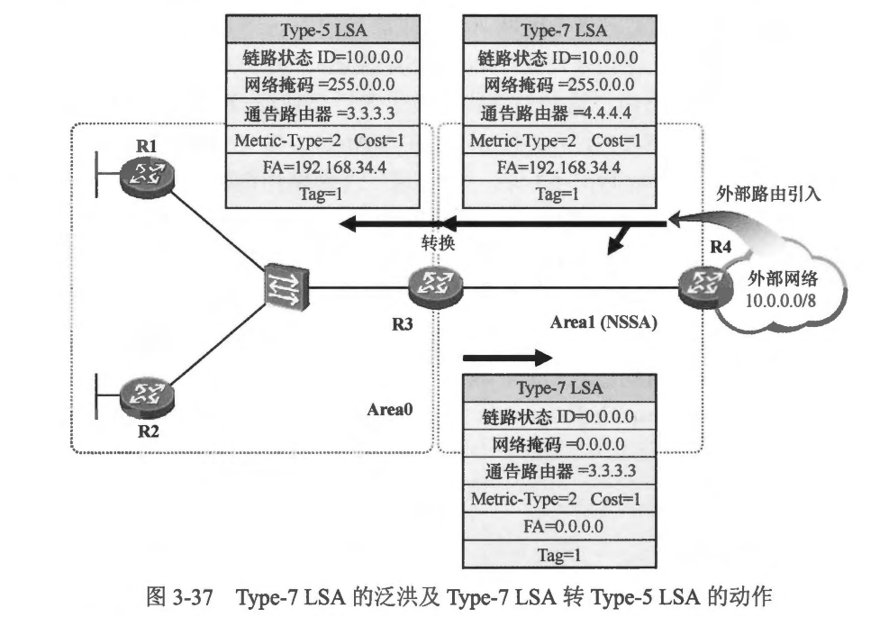 
  - 以上面的輸出可以看到 Area 1 中一共泛洪着两条 Type-7 LSA，其中的一条是由 ASBR---R4产生的，用于描述外部路由 10.0.0.0/8，另一条则是由 ABR---R3 自动产生的，是一条默认路由，这条默认路由只能在 Area 1 内传播。
  - R3能够根据 R4 产生的这条 Type-7 LSA 计算出到达 10.0.0.0/8 的路由:
  ```shell
  R3#show ip route ospf
  Codes: L - local, C - connected, S - static, R - RIP, M - mobile, B - BGP
       D - EIGRP, EX - EIGRP external, O - OSPF, IA - OSPF inter area
       N1 - OSPF NSSA external type 1, N2 - OSPF NSSA external type 2
       E1 - OSPF external type 1, E2 - OSPF external type 2
       i - IS-IS, su - IS-IS summary, L1 - IS-IS level-1, L2 - IS-IS level-2
       ia - IS-IS inter area, * - candidate default, U - per-user static route
       o - ODR, P - periodic downloaded static route, H - NHRP, l - LISP
       a - application route
       + - replicated route, % - next hop override, p - overrides from PfR

  Gateway of last resort is not set

  O N2  10.0.0.0/8 [110/20] via 192.168.34.4, 00:04:52, Serial1/0
        192.168.1.0/32 is subnetted, 1 subnets
  O        192.168.1.254 [110/11] via 192.168.123.1, 00:05:15, Ethernet0/0
        192.168.2.0/32 is subnetted, 1 subnets
  O        192.168.2.254 [110/11] via 192.168.123.2, 00:05:15, Ethernet0/0

  ```
  - 留意到 R3 的路由表中 10.0.0.0/8 的路由，Proto 内 N2，意味着逑是一条根据 Type-7 LSA 汁算得出的 NSSA 外部路由。
  - NSSA 的 ABR R3 会将 Type-7 LSA 转换成 Type-5 LSA 注入 Area 1 中，使得其他 OSPF 区域能够计算出到达 10.0.0.0/8 的路由。在R1 上查看这条 Type-5 LSA:
  ```shell
  R1#show ip ospf database external

            OSPF Router with ID (1.1.1.1) (Process ID 100)

                Type-5 AS External Link States

  LS age: 539
  Options: (No TOS-capability, DC, Upward)
  LS Type: AS External Link
  Link State ID: 10.0.0.0 (External Network Number )
  Advertising Router: 3.3.3.3
  LS Seq Number: 80000001
  Checksum: 0x2FCB
  Length: 36
  Network Mask: /8
        Metric Type: 2 (Larger than any link state path)
        MTID: 0
        Metric: 20
        Forward Address: 192.168.34.4
        External Route Tag: 0
  ```
  - R1 及 R2 能够根据这条 Type-5 LSA 计算出路由。

<br>
<br>

### 3.2.4 区域类型及详解
- OSPF 是目前使用最为广泛的 IGP 之一，能够支持大规模的网络，在实际的组网项目中几乎随处可见。大家己经知道 OSPF 作为一种链路状态路由协议，使用 LSA 来描述网络拓扑及网段信息，为了减少 LSA 的泛洪、减小路由器 LSDB 的规模，从而减小路由器的性能损耗，OSPF 引入了多区域的概念。将一个 OSPF 域划分成多个区域带来了许多利好。每个区域独立维护一套 LSDB，并且单独运行 SPF 算法，而且区域内的拓扑变更也不会对整个 OSPF 网络带来过大的影响，这些利好都使得 OSPF 能够支持更大规模的网络。然而仅仅这些是不够的，当 OSPF 被部署在一个大型网络中，实现数据互通的前提是要打通网络中的路由，而将路由信息传递到位只是第一步，此外还需考忠如何优化网络、如何进一步减少 LSA 在网络中的泛洪、如何减小路由器路由表的规模。
- 图 3-38 展示了一个企业网络的示例，这个网络的规模比较大，网络从逻辑架构上分了三个区块，分别是省公司、地市分公司以及区县公司，其中地市和区县公司的网络运行 OSPF 协议，处于同一个 OSPF 域。整个 OSPF 网络进行了层次化的设计，地市分公司的核心网络部署在 Area0，而每个区县公司被规划在了非。区域，CO-SW1 及 CO-SW2 是地市分公司的两台汇聚设备，用于连接地市分公司及下面的区县公司，这两合设备同时也是 ABR。每个区县公司规划了一个独立的区域，例如区县公司1在 Area 1，区县公司2在Area 2，以此类推，图中只是给出了区县公司网络的简单示意。地市分公司的出口路由器(OR-RI 及 OR-R2）与省公司的PE 路由器(PE1 及 PE2）对接，通过 BGP 交互路由信息,出口路由器 OR-R1 及 OR-R2 将自己从省公司学习到的 BGP 路由引入 OSPF,使得整个 OSPF 域内的路由器能够学习到这些外部路由，从而使得访问省公司的数据流量能够顺利地被路由到 PE 路由器。
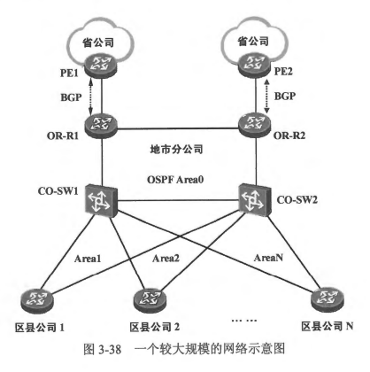 
** 说明BGP 是一种外部网关路由协议(Exterior Gateway Protocol)，主要被用于在 AS 之间交互路由信息。**
- 初始情况下，区县公司的路由器能够学习到整个 OSPF 域内的路由，当然，也会学习到 OR 路由器从 BGP 引入的所有外部路由。随着业务规模逐渐变大，省公司、地市公司的网络将变得更加庞大，区县公司可能也会逐渐增多，这些都将导致每个区县路由器的路由表变得臃肿，每台路由器将变得不堪重负。然而从这个网络大家可以直观地看出，实质上对于每个区县公司而言，并不用知晓 OSPF 域外，甚至 OSPF 区域外的路由细节，这些信息其实可以被屏蔽掉，因为每个区县公司都是一个末梢网络，它们的外出流量只需保证被送到地市分公司的汇聚设备就可以被顺利路由到目的地，无论这个目的地是域外的，还是其他区县公司的。
- OSPF 设计了多种区域类型，以便满足多种业务需求。
  - 骨干区域( Backbone Area): 骨干区域是 Area 0，是整个 OSPF 域的中心枢纽。一个 OSPF 域有且只能拥有一个 Area 0，所有的区域间路由必须通过 Area 0 中转
  - 常规区域 (Normal Area): 所有的 OSPF 区域缺省情况下都是常规区域，当然。Area 0 是常规区域中比较特殊的一个。OSPF 要求所有的非骨干区域《非。 常规区域）都必须与 Arca0 直接相连。常规区域中允许Type-1、Type-2、 Type-3、Type-4以及 Type-5 LSA 泛洪，Type-7 LSA 禁止出现在常规区域内。依然以本节开始时展示的网络为例，Area 1 是一个非常规区域，CO-SW1 及 CO-SW2 作为这个区域的 ABR，会将Type-3、Type-4以及Type-5 LSA 都注入 Area 1 （如图3-39所示）。
  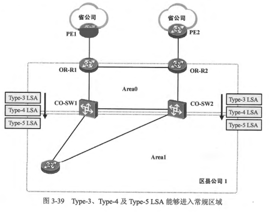 
  - 未梢区域(Stub Area): 末梢区域也被称为 Stub 区域，当一个非0常规区域只有单一的出口（例如该区域只有一个 ABR)，或者区域内的路由器不需要根据特定的外部路由来选择离开区域的出口时，该区域可以被配置为 Stub 区域。当一个区域被配置为 Stub 区域后，这个区城的 ABR 将阻挡 Type-5 LSA 进入该区域(禁止外部路由被发布到该区域），通过这种方式可减少区域内所泛洪的 LSA 数量，同时该区域的 ABR 自动下发一条使用 Type-3 LSA 描述的默认路由，使得区域内的路由器能够通过这条默认路由到达域外，因此既减小了区城内网络设备的路由表规模，又保证了其访问外部网络的数据可达性。在一个大量引入外部路由的 OSPF 网络中，将适当的区域配置为 Stub 区域可以极大地减小该区域内路由器的路由表规模，从而降低设备的资源消耗。另外，对于 Stub 区域而言，到达 OSPF 域内其他区域的路由依然能够被注入，即 ABR 依然会将描达区域间路由的Type-3 LSA 注入到 Stub 区城中。
  - 在 图3-40 中，Area 1 被配置为 Stub 区域，这样 Area 1 的 ABR (CO-SW1 及 CO-SW2) 便不能再将 Type-5 LSA 注入这个区域。由于 Type-5 LSA 无法进入该区域，因此 Type-4 LSA 也就没有必要再在该区城内泛洪，所以CO-SW1 及CO-SW2 也就不会再向该区域内注入 Type-4 LSA，进而，Router-X 的路由表将不会再出现到达省公司（OSPF 域外）的具体路由，路由表的规模减小了，设备的资源消耗也就降低了。当然，Router-X 访问省公司的需求还是存在的，为了让 Router-X 发往省公司的流量能顺利到达目的地，ABR 会自动向 Area 1 中注入默认路由，该条默认路由使用 Type-3 LSA 描述，CO-SW1 及 CO-SW2 都会下发默认路由，网络管理员可以通过把控默认路由的 Cost 从而控制 Router-X 选择的出口。Router-X 发往省公司的流量能够通过该默认路由先到达 CO-SW1 或 CO-SW2，再通过它们转发到省公司。
  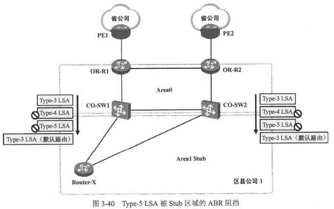 
  - 值得注意的是，OSPF 要求所有连接到 Stub 区域的路由器，对于该区域的 Stub 属性要有一致的认知，以图3-40 为例，当我们在 CO-SW1 及 CO-SW2 上将 Area 1 设置为 Stub 区域时，所有连接到 Area 1 的路由器（例如 Router-X）都应该进行相应的配置，都应当将 Area 1 视为 Stub 区域，否则 OSPF 邻接关系的建立将出现问题。
  - 我们还能在 Stub 区域基础上进一步减少 LSA 的泛洪，即在 Stub 区域的 ABR 上，进一步阻挡描述区域间路由的 Type-3 LSA 进入该区域，区域内的路由器通过 ABR 向该区域下发的默认路由到达本区域之外的其他区域以及域外的网络。这样，这个特殊区域内将只有Type-1、Type-2 LSA 以及描述默认路由的Type-3 LSA 存在，这意味着区域内路由器的路由表都将只有到达区域内部的路由，以及指向 ABR 的默认路由，路由器的路由表被极大程度地精简了。这种特殊区域也被称为完全未梢区域 (Totally Stub Area)。在本例中，可在 CO-SW1 及 CO-SW2 上进一步阻挡 Type-3 LSA 进入 Area 1，这样 Router-X 将不会再学习到 Area 1 之外的、到达其他区县的区域间路由，以及到达省公司的外部路由，Router-X 的路由表将极大程度地被简化。当然，Router-X 可以通过 ABR 下发的默认路由将外出的数据包送出去。
  - 需要强调的是，Area 0 不能够被配省为 Stub 区域，这是显而易见的。另外，当一个区域被指定为 Stub 区域后，这个区域将不再允许执行外部路由引入。
  - 非完全末梢区域(Not-So-Stubby Area): Stub 区域的 ABR 能够阻挡 Type-4 LSA 及Type-5 LSA 进入该区域，并且接入该区域的路由器禁止將外部路由引入该区域。以 图3-40 所示的网络为例，Area 1 一旦被配置为 Stub 区域，那么CO-SW1、CO-SW2 及 Router-X 均不能够再将外部路由引入该区域。现在来考虑一种特殊的场景，假设 Router-X 路由器下挂着一个小型区县网络，这个网络的路由器采用 RIP 来实现路由的交互。现在这个小型网络需要访问地市公司及省公司的网络资源，那么我们便需要将两个路由域打通，在Router-又 上执行路由重分发是一种立刻就能想到的方案，但是随后可能又会意识到此时 Areal 已经是Stub区域，因此 Router-X 不被允许执行外部路由引入，那么将 Area 1 恢复成常规区域呢？这又丢失了 Stub 区域的优势，到达省公司的外部路由又全灌进 Area 1。 此时，另一个特殊区域 NSSA 也就闪亮登场了。
  - NSSA (Not-So-Stubby Area）即非完全未梢区域，可以理解为 Stub 区域的变种，它拥有 Stub 区域的特点----阻挡Type-4 及 Type-5 LSA 进入，从而在一定程度上减少区域内泛洪的 LSA 数量，同时它还有另一个特点，那就是允许该区域的路由器将少量外部路由引入 OSPF。被引入的外部路由，以 Type-7 LSA 描述，并且这些 Type-3 LSA 只能够在当前的 NSSA 内泛洪，不允许直接进入 Area 0。 为了使这些被引入 NSSA 的外部路由能让 OSPF 域内的其他区域学习到，NSSA 的 ABR 会将 Type-7 LSA 转换成 Type-5 LSA 然后注入 Arca0，从而泛洪到整个 OSPF 域。
  - 图 3-41 展示了 NSSA 的一个应用实例。Area 1 被配置成了 NSSA。 这样 Area 1 的 ABR 特阻挡 Type-5 LSA 进入这个区域。另一方面，Router-X 连接到一个 RIP 网络，它将路由表中的 RIP 路由引入 OSPF，这些被引入的外部路由以 Type-7 LSA 描述，这些 LSA 在 Area 1 内泛洪，并且禁止进入 Area 0。 CO-SW1 及 CO-SW2 作为 NSSA 的ABR，自然也是能收到这些 Type-7 LSA 的，它们能够根据这些 LSA 计算出到达 RIP 网络的路由。另外它们也负责將 Type-7 LSA 转换成 Type-5 LSA 并將后者注入 Area 0，这样这些外部路由便能够被整个 OSPF 域中的路由器学习到。另一方面，CO-SW1 及 CO-SW2 会向 NSSA 内下发一条 Type-7 LSA 的默认路由，使得 Router-X 能够通过这条默认路由到达省公司。
  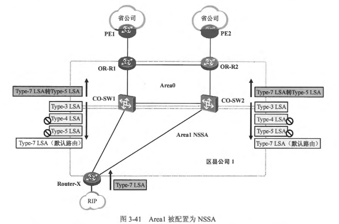 
  - 我们还可以在 NSSA 的基础上进一步减少 LSA 的泛洪。在NSSA 的ABR上，可以进一步将 Type-3 LSA 阳挡掉，从而将区域间的路由都过滤掉，而 NSSA 的 ABR 会白动下发一条默认路由(使用 Type-3 LSA 描述）到该区域，使得区域内的路由器能够通过这条默认路由访问 OSPF 城内的其他区城，以及城外的网络。这种类型的特殊区城也被称 Totally NSSA
  - 各种区域类型中允许出现的LSA: 表3-4列举出了在每种 OSPF 区域类型中，允许出现以及禁止出现的 LSA。
  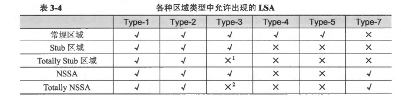  
    - ABR 会自动下发一条 Type-3 LSA 的默认路由，除此之外其他的 Type-3 LSA 都被禁止。
  
  <br>
  <br>

### 3.2.5 判断LSA的新旧
- LSA 是 OSPF 路由计算的核心，路由器只有搜集到了网络中完整的、最新的 LSA，才能够尽可能准确地计算出最佳路由。对于 OSPF 网络的收敛，LSA 的泛洪及更新是关键。OSPF 也像 RIP 那样，会周期性地泛洪更新信息，只不过 RIP 泛洪的是路由，而 OSPF则泛洪 LSA，而且 RIP 的泛洪周期较短，OSPF 则以1800s 为周期对 LSA 进行泛洪。采用更长的泛洪周期，可避免网络中的 OSPF 流量过大，以免造成不必要的带宽消耗。另一方面，当网络拓扑发生变更时，OSPF 也会执行 LSA 的触发更新，以便网络更快速地收敛。
- OSPF 采用链路状态类型、链路状态 ID 以及通告路由器三元组米标识一个 LSA，这其实就是每个 LSA 的头部中的三个关键字段。当路由器收到同一个 LSA 的两个不同实例时，例如路由器收到某个 LSA 并将其加载到自己的 LSDB 中，随后又从网络中再次收到该 LSA 的另一个实例(链路状态类型、链路状态ID 以及通告路由器三元组均相同)，并且 LSA 的内容可能有所不同，此时路由器该如何判断两个 LSA 实例熟新敦旧？从网络中收到的 LSA 是否应该替换 LSDB 中原有的 LSA? OSPF 使用链路状态序列号、老化时间以及校验和来做决策，它通过如下几个步骤判断一个LSA 的新旧
  - 首先，拥有更高链路状态序列号的 LSA 实例被认为更新，因为路由器每次在刷新 LSA 的时候，会将该LSA 的链路状态序列号加 1，链路状态序列号越大，则 LSA 越新
  - 如果 LSA 实例的链路状态序列号相同，那么拥有更大校验和的 LSA 实例被认为更新
  - 如果LSA 实例的链路状态序列号相同、校验和也相同，且某个实例的老化时间被设置为 MaxAge（最大老化时间，缺省 3600s)，則该实例被认为最新
  ** MaxAge 是OSPF 的一个常量，如果 LSA 的 LSAge 达到了 MaxAge，那么该 LSA 将被直椄删除，，不能再被用于 OSPF 路由计算。该常量被设定为 1h **
  - 如果 LSA 实例的链路状态序列号相同、校验和也相同，且没有任何一个实例的老化时间被设置为 MaxAge，那么当两个实例的老化时间相差超过 MaxAgeDiff 时，这两个实例被认为是不同的实例，且老化时间值越小的 LSA 被认为越新
  ** MaxAgeDiff 是 OSPF 的一个常量，它描述的是一个 LSA 的实例从其始发设备出发，直至被泛洪到整个 AS 边界所需的最长时间。该时间被设置为 15min**
  - 如果 LSA 实例的链路状态序列号相同、校验和也相同，另外，没有任何一个实例的老化时间被设置为 MaxAge，并且，两个实例的老化时间相等，或相差不超过 MaxAgeDiff,则它们被认为是相同的实例。
- 当设备的 LSDB 中已经存在某个 LSA 时，如果又从网络中收到了该 LSA 的另一个实例，则通过上述步骤来判断同一个 LSA 的两个不同实例的新旧，新的 LSA 实例会覆盖旧实例。