## 本章内容概述和教学目标
- OSPF 的几种协议特性，掌握这些特性是非常有必要的

- 本章学习目标:
  - 掌握 OSPF 路由汇总的方法及其部署场景
  - 理解 Virtual Link 的概念及其部署要点
  - 理解 Silent-Interface 的概念及其部署场景
  - 掌握 OSPF 认证的类型及实现
  - 理解 FA 的概念
  - 熟悉 OSPF 的路由防环设计

<br>
<br>

### 3.3.1 路由汇总
- 在一个大型的网络中部署路由协议时，需要考志到各种细节。网络规模越大，IP网段可能也就越多，为了实现全网互通，每台路由器就不得不维护到达全网的路由信息，它们的路由表将逐渐变得臃肿，进而设备资源的消耗势必增大，这将直接影响路由器的性能。另外，网络拓扑中的每一处变化，都有可能会导致相应的变更信息传播到全网。因此，在保证全网数据可达的前提下，减小网络中路由器的路由表规模就是一件必须考虑的事情，一个非常常见而又有效的办法就是使用路由汇总。路由汇总又被称为路由聚合，是将一组路由汇聚成一条路由，从而达到减小路由表规模以及优化设备资源利用率的目的，我们把汇聚之前的这组路由称为精细路由(或者明细路由），把汇聚之后的这个路由称为汇总路由 (或者聚合路由)。
- OSPF 并不像距离矢量路由协议(例如 RIP）那样支持路由自动汇总，为了让路由汇总实施起来更加可控，OSPF 的路由汇总需手工部署。OSPF 支持两种路由汇总方法，一种需要部署在 ABR 上，另一种则需要部署在 ASBR 上。
- 路由汇总实验:
  - 区域汇总
  - 外部路由汇总

<br>
<br>

### 3.3.2 Virtual Link
- OSPF 规定，当网络中存在多个区域时必须部署骨干区域 Area 0，而且所有的非骨于区域必须与 Area 0 直接相连。如果某个非骨于区域没有与 Area 0 直接相连，那么 LSA 的泛洪就会出现问题，从而 OSPF 的路由计算也势必会出现问题。如果出现这种情常建议的解决办法是修改 OSPF 的规划和配置，使得网络满足 OSPF 的要求。但是如果由于某些原因网络不宜做大的变更，则可以考虑另一种临时性的解决方案----Virtual Link（虛链路)。
- OSPF Virtual Link 是一种虚拟的、逻辑的链路，被部署在两台 OSPF 路由器之间，它穿越某个非骨干区域，用于实现另一个非骨干区域与 Area 0 的连接。Virtual Link 被视为 Area 0 的一段延伸，当我们在两台路由器上穿越一个非骨干区域建立虛链路后，这两台路由器即开始在这条 Virtual Link 上尝试建立邻接关系，当基于 Virtual Link 的邻接关系建立起来后，Virual Link 两端的路由器会在其产生的 Type-1 LSA 中描述这条 Virtual Link， 在Type1 LSA 中，Virtual Link 采用类型4的Link 来描述。需要强调的是，Virtual Link 不能被部署在 Stub 区域内。
- 图 3-44 展示了一个 Virtural Link 的部署案例。在这个网络中，Area 2 并没有与 Area 0 直接相连，因此 R3 并非实际意义上的 ABR，它也就无法向 Area 1 中注入用于描述到达 Area 2 内网段路由的 Type-3 LSA，当然也无法向 Area 2 中注入用于描述到达 Area 0 及 Area 1 内网段路由的 Type-3 LSA，这样，Area 2 就形成了一座孤岛。
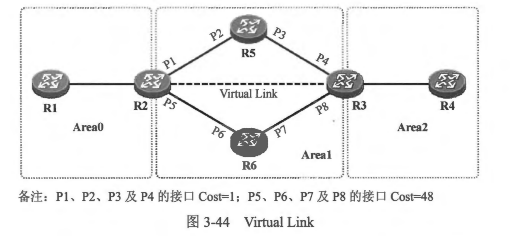 
- 通过在 R2 及 R3 之间建立一条穿越 Area 1 的Virtual Link， 可实现 Area 2 与 Area 0 的连接。Virtual Link 被视作 Area 0 的一段延仲，R2 与 R3 会基于这条 Virtual Link 建立邻接关系，一旦这条 Virtual Link 建立起来，R2 及R3 之间相当于就有一条隐形的通道，而 R3 也就成了一台 ABR，它会产生用于描达到达 Area 2 内各个网段路由的 Type-3 LSA 并将其通告给 Area 1，以及通过 Virtural Link 通告给 Area 0，另外，Area 0 内的Type-1 LSA 及 Type-2 LSA
也会通过这条 Virtual Link 通告给R3,而R3也会向 Arca2 内注入用于描述到达Arca0 及 Area 1 内的各网段路由的Type-3 LSA。这样，网络中各合设备即可完成全网 OSPF 路由的计算。
- 在 Virtual Link 邻接关系建立起来后,链路两端依然会保持 Hello 报文的周期性发送，以便确定对端的存活情况。Virtual Link 的配置非常简单，在 OSPF 区域配置祝图下使用 area 区域号 virtual-link  命令指定 Virtual Link 对端的设备（Router-ID）即可，当然，Virtual Link 两个端点设备（图3-44 中的R2 及R3）都要进行相应的配置•需要注意的是，在配置 Virtual Link 时，命令 area 区域号 virtual-link 中指定的并不是对端路由器的某个接口 IP 地址，而是对端路由器的 Router-ID，初学者在这里往往会有一个疑惑，那就是 Virtual Link 是如何建立的？此时由于 R2 及 R3 己经通过 Area 1 内泛洪的 Type-1、Type-2 LSA 描绘出了 Area 1 的网络拓扑及网段信息，因此在明确了 Virtual Link 对端的路由器的 Router-ID 后，双方即可通过最短路径树*发现到达对端的最优路径。R2 及R3 之间其实有两条物理路径，由于 R2-R5-R3 这条路径的 Cost 值更小，因此这条路径被选择作为承载 Virtual Link 通道流量的最优路径，明确了这个之后，当 R2 要发送 Virtual Link 通道数据前往 R3 的时候，数据包的源地址就是接口 P1 的 IP 地址，而数据包的目的地址就是 P4 的IP地址。
- Virtual Link 的 Cost 值是不能直接地进行配置的，这个值跟用于承载 Virtual Link 的物理路径的 Cost 相关。因此 R2 从 Virtual Link 到达对端（R3）的Cost 就是 P1 的 Cost 加上 P3 的 Cost。 同理，R3 从 Virtual Link 到达对端的 Cost 就是 P4 的 Cost 加上 P2 的 Cost
- 另外，Type-5 LSA 不会通过 Virtual Link 传播，否则可能造成 LSA 重复泛洪。Virtual Link 应该始终作为一种临时的技术手段来解决非骨干区域没有与 Area 0 直接相连的问题，实际上一个合理规划的 OSPF 网络不应该出现这样的问题。随意使用 Virtual Link 不仅会使得 OSPF 网络变得不易于维护和管理，也使得其逻辑结构更为复杂。另一个问题是，在网络中如果频繁部署 Virtual Link， 则有可能引发环路。

<br>
<br>

### 3.3.3 默认路由
- 默认路由 （Default Route)，也被称为缺省路由，指的是目的网络地址及网络掩码都为。的路由，通常是作为路由器的“最后求助对象”。当去往某个目的网络找不到匹配的具体路由时，如果设备的路由表中存在默认路由，那么该设备将使用默认路由来转发数据。
- 下面将介绍在各种场景下，向OSPF 网络中发布默认路由的方法。
  - 在常规区域中发布默认路由
    - 缺省情况下，常规区域中的路由器是不会发布 OSPF 默认路由的，即使它的路由表中存在一条默认路由(该默认路由可能是路由器通过其他协议发现的，例如 RIP 等），也需要通过相应的配置才能使得路由器将默认路由发布到 OSPF 网络中。
    - 在图 3-45 所示的网络中，OR 是出口路由器，它连接着一条 Internet 出口线路，现在为了让内网用户访问 Internet 的数据流量能够被送达 OR 路由器，从而被转发到 Internet， 需要让 OR 向 OSPF 域中下发一条默认路由。OR 上可能己经配置了一条静态的默认路由：ip route 0.0.0.0 0.0.0.0 200.1.1.2，但是显然这条静态路由对于 OSPF 域内的路由器而言肯定是不可见的，您可能会想到使用路由引入的方法将这条静态的默认路由 入 OSPF，但是实际上这是不可行的，因为OSPF 认为在执行路由重分发时如果把默认路由引入 OSPF 存在引发环路的风险，因此无论将静态路由或是其他动态路由协议的路由引入 OSPF，默认路由都不会被引入。OSPF 定义了专门的命令用于引入默认路由，醫如现在要在 OR 上，将默认路由引入 OSPF，则 OR 的配置如下：
    ```shell
    R1(config)#router ospf 100
    R1(config-router)#default-information originate metric 100 metric-type 2
    ```
    - 上面这条命令用于向 OSPF 域发布一条默认路由，这条默认路由采用Type-5 LSA 来描述，因此实际上是一条外部路由。在该命令中，metric关键字用于指定该默认路由的 cost 值，metric-type 关键字用于指定路由的 Metric-Type。 需要强调的是，使用这种方式向 OSPF 发布默认路由的前提是 OR 的路由表中必须已经存在一条默认路由，这条默认路由可以是静态的，也可以是从其他动态路由协议(或者其他 OSPF 进程）学习到的，只有满足这个条件，默认路由才会被顺利下发到该 OSPF 域。如果在default-information originate 命令中增加 always 关键字，则无论 OR 的路由表中是否己经存在默认路由，它都将始终向 OSPF 网络下发默认路由。
    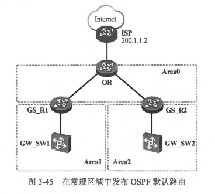
  - 在Stub区域中发布默认路由
    - 当一个 OSPF 区域被配置为 Stub 区域时，该区域内将不再允许Type-5 LSA 进行泛洪，而该区域内部的路由器也就无法学习到 OSPF 域外的路由，那么这些路由器如何访问域外的网络呢？stub 区域的 ABR 会自动向该区域下发一条默认路由 (Type-3LSA),这样 Stub 区域内的路由器就能够通过这条默认路由将访问域外的流量送达 ABR,再由 ABR 将流量转发出去。缺省时，这条默认路由的 Cost 为 1，可以在这个 Stub 区域的 ABR 的 OSPF 区域配置视图下使用 default-metric 命令修改这个 Cost 值。
  - 在Totally Stub 区城中发布默认路由
    - Totally stub 区城在Stub 区城的基础上进一步禁止 Type-3 LSA 在该区城内泛洪，该区域内的路由器无法学习到 OSPF 域外的路由以及其他 OSPF 区域的路由，Totally Stub 区域的 ABR 会自动向该区域发布一条默认路由(Type-3 LSA），这样一来区域内部的路由器就能够通过 ABR 到达其他区域以及 OSPF 域外。
    - 缺省时，这条默认路由的 Cost 为1，可以在这个 Totally Stub 区域的 ABR 的 OSPF 区域配置视图下使用 default-metric 命令修改这个 cost 值。
  - 在NSSA 中发布默认路由
    - 大家己经知道，当一个区域被配置为 NSSA 时，该区域将不再允许 Type-4 LSA 及 Type-5 LSA 进入，另一方面，NSSA 允许在区域本地引入少量的外部路由，这意味着 NSSA 内的路由器将不会学习到该区域之外引入的外部路由，NSSA 的 ABR 会自动向该 NSSA 下发一条默认路由（使用 Type-7LSA 描述）。以 图3-46 为例，OR 连接着外部网络 NET1，它将到达 NET1 的静态路由引入 OSPF，这些路由被 NET1 引入后以 Type-5 LSA 来描述，并且在整个 OSPF 域内泛洪，而当 Area 1 被配置为 NSSA 后，R1 (ABR) 將阻挡这些 Type-5 LSA 进入 Area 1。 与此同时 R1 会向 Area 1 内自动下发一条默认路由(使用 Type-7 LSA 描述），如此一来 NSSA 内路由器的路由表规模减小的同时，还能够通过这条默认路由到达 NET1。这条Type-7 LSA 的默认路由只能够在该 NSSA 内传递，而且只有当 ABR 在 Area 0 中存在一个全毗邻(Full)的邻接关系时，该条默认路由才会被下发。
    - 当然我们可能会面对另一种需求，就是 NSSA 内的路由器希望通过本区域的 ASBR (R2） 来下发默认路由，那么就需要手工在 R2 上进行相关配置。R2 图 3-46 向 NSSA 中注入默认路由的关键配置如下：
    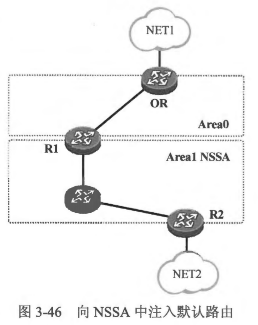
    ```shell
    R1(config)#router ospf 100
    R1(config-router)#area 1 nssa default-information-originate  
    ```
    - 完成上述配置后，R2会向 NSSA 中注入一条使用 Type-7 LSA 描述的默认路由，这条默认路由只会在 NSSA 内传播，不会被 ABR 转换成 Type-5 LSA 进入 Area 0。 值得注意的是，仅当 NSSA 的 ASBR 在自己的路由表中己经存在一条默认路由时，使用上述命令才能够向 NSSA 注入默认路由，否则默认路由将不会被注入。
  - 在Totally NSSA 中发布默认路由
    - Totally NSSA 禁止 Type-3、Type-4 及 Type-5 LSA 在该区域中泛洪，同时该区域的 ABR 会向该区域中自动下发一条默认路由（Type-3 LSA），这样 NSSA 内的路由器可以通过这条默认路由到达其他区域或者域外的网络。

<br>
<br>

### 3.3.4 报文认证
- 在数据网络中，一个数据包的转发路径是由转发设备的路由表决定的，因此我们通常将路由理解为控制层面的概念，只有当网络中的路由器拥有正确的路由信息时，数据通信才能够正常进行。所以路由层面的探作对于网络而言是非常重要的，各种动态路由协议均在可靠性、快速收敛、规避路由环路及安全性等层面做了考虑。以安全性为例，大多数动态路由协议都支持报文认证功能，以确保协议报文交互的安全性。在图 3-47 中，R1 及 R2 连接在同一台以太网二层交换机上，两者在各自的接口上激活 OSPF，并形成邻接关系。现在网络攻击者在交换机上又接入了一台非法的路由器X，并且也在接口上激活 OSPF，由于 OSPF 在 Broadcast 网络中采用组播的 Hello 报文发现邻居，因此 R1 及 R2 很快在自己的 GE0/0/0 接口上发现 X,并且与 X 建立邻接关系。随后 X 开始向 OSPF
中灌入大量垃圾路由，从而导致整个 OSPF 网络的路由计算发生问题，而此时网络的数据转发必将受到严重影响。
- 为了避免类似问题，OSPF 设计了报文认证功能。所有的OSPF 报文都有相同的报文头部格式，在 OSPF 的报文头部中，几个与认证相关的字段用于实现报文的认证功能，如图 3-48 所示。OSPF 支持三种类型的认证方式，分别是空认证 (Null Authentication)、简单口令认证（Simple Password）、密文认证 (Ctyptograbpic Authentication)，这三种认证方式对应的 “认证类型” 字段值分别为 0、1 和 2。
 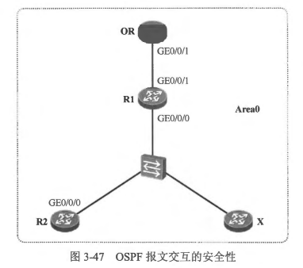 
 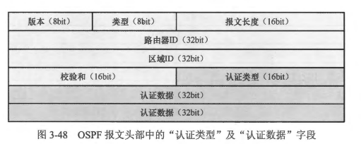

- 空认证: 
  - 缺省情况下，OSPF 的接口上使用的认证方式为空认证，这意味着对接口的 OSPF 报文收发不做认证(注意，虽然对报文不做认证，但是针对报文的校验和还是需要检查的，两者不可泥淆），此时认证类型字段值为 0。
- 简单口令认证:
  - 简单口令认证又被称为明文认证，一个明文的口令被包含在认证数据字段中用于认证 OSPF 的报文收发，因此实际上这种认证方式并不安全，只要网络环境有条件进行报文窥探，即可对捕获下来的报文做分析，攻击者就能够直接看到包含在其中的明文口令。图3-49 展示的是部署了简单口令认证后，路由器发送的一个 OSPF 报文，大家能从报文中读到认证类型字段的值为 1（抓包工具显示 Simple password），而认证数据宇段则显示的是“hcnp”，这正是我们配置的口令，它以明文的形式填写在认证数据字段中。
- 密文认证:
  - 与简单口令认证不同，采用密文认证时，OSPF 报文中并不直接包含用于认证的明文形式的口令，而是包含一个哈希（Hash）值，这个哈希值是将用户配置的口令等内容经过 MD5 算法计算得到的结果。MD5 算法是一种理论上不可逆的散列算法，因此即使
OSPF 报文被捕获，也无法通过报文中包含的哈希值反推得到明文口令，所以这种认证方式显然要比简单口令认证更加安全。
  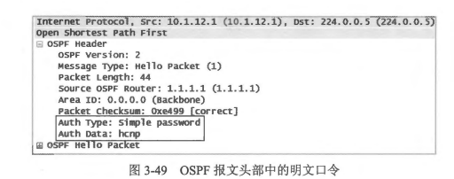
  - 图3-50 显示的是采用密文认证后，OSPF 报文头部的格式。需留意报文格式发生了变化，“认证类型”字段的值为 2 表示这个报文采用的是密文认证的方式，其他字段的描述如下。
  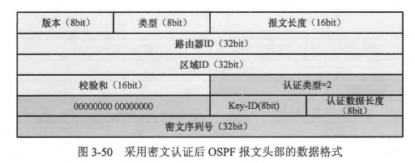
  - Key-ID (Key-Identification): 口令标识。两台直连的 OSPF 路由器如果都激活了报文认证，那么双方的 Key-ID 及口令必须一致。
  - 认证数据长度 (Authentication Data Length）: 将口令经过散列算法（例如 MD5）计算后得到的数据是追加在 OSPF 报文尾部的（不在 OSPF 报文头部中），它并不被当作是 OSPF 协议报文的一部分，所以 OSPF 报文头部中的“报文长度” 字段所显示的值并不将认证数据纳入长度计算。“认证数据长度〞 字段显示了这个认证数据的长度。
  - 密码序列号 (Cryptographic Sequence Number): 一个持续保持递增的序列号，用于 OSPF 报文的防重放攻击。假设一台以太网二层交换机上连接着两台路由器，这两台路由器在接口上激活 OSPF 并建立邻接关系，随后有一台非法的路由器接入到了该交换机上，这台路由器捕获其中一台路由器发送出来的 OSPF 报文，并开始发送自己伪造的 OSPF 报文给另一台路由器，它将所捕获到的 OSPF 报文中用于认证的相关字段的内容拷贝到伪造的报文中，试图将自己伪装成合法的 OSPF 邻居。在该场景中，密码序列号字段可提高网络的安全性，由于这个字段的值是只增不减的，因此当收到 OSPF 报文的密码序列号等于或小于目前的序列号时，路由器认为此报文为重放攻击报文，于是将其丢弃。

<br>
<br>

### 3.3.5 转发地址
- 在 OSPF 的 Type-5 LSA及 Type-7 LSA 中包含着一个特别的字段---转发地址(Forwarding Address, FA)，FA 的引入使得 OSPF 在某些特殊的场景下可以避免次优路径问题。

<br>
<br>

### 3.3.6 OSPF 路由防环机制
- OSPF 与距离矢量路由协议不同，运行 OSPF 的路由器之问交互并不是路由信息，而是 LSA，而路由的计算正是基于网络中所泛洪的各种 LSA 进行的，所以实际上 OSPF 路由的环路避免机制还得依赖于 LSA 相关的诸多设计，本节将探讨 OSPF 在路由防环方面的一些机制。
- 区域内部路由的防环: 
  - 我们都知道，每台运行 OSPF 的路由器都会产生 Type-1 LSA, Type-1 LSA 用于描述路由器的直连接口的状况（接口 IP 信息或所连接的邻居，以及接口的 Cost 值等），而且只在接口所属的区域内泛洪。Type-2 LSA 则由 DR 产生，用于描述接入该MA 网络的所有路由器(Routcr-ID)，以及该 MA 网络的掩码信息。得益于区城内泛洪的Type-1 及 Type-2 LSA,OSPF 路由器能够 “在自己的脑海中” 还原区域内的网络拓扑及网段信息。路由器为每个区城维护一个独立的 LSDB，并且运行--套独立的 SPF 算法。同一个区域内的路由器，拥有针对该区域相同的 LSDB，大家都基于这个 LSDB 计算出一棵以自己为根的、无环的最短路径树。之所以能做到无环，是因为路由器能够通过LSA 描绘出区域的完整拓扑（包括所有接口的 Cost）及网段信息。
  - 以图 3-52 所示的网络为例，R1、R2、R3 及 R4 的接口均在 Area 0 中，四台路由器都会产生 Type-1 LSA 并且在区域内泛洪。另外由于以太网接口缺省是 Broadcast 网络类型，因此会进行 DR、BDR 的选举，DR 会产生 Type-2 LSA 并在区域内泛洪。在 LSDB 同步完成之后，每台路由器都知晓了整个区域的拓扑及网段信息，这些都是通过网络中泛洪的 Type-1 LSA 及 Type-2 LSA 拼凑出来的，如图 3-53 所示。
  
  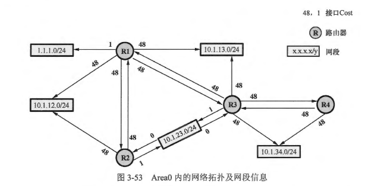
  - 按下来，每台路由器都以自己为根，计算一棵无环的最短路径树，以 R3 为例，它的最短路径树可能像图 3-54所示的样子。
  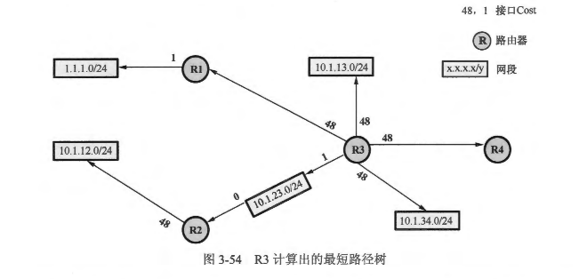 

- 区域间路由的防环
  - OSPF 要求所有的非骨干区域必须与 Area 0 直接相连，区域间路由需经由Area 0中转
    - 这个规则使得区域间的路由传递不能发生在两个非骨干区域之间，这在很大程度上规避了区域间路由环路的发生，也使得 OSPF 的区域架构在逻辑上形成了一个类似星型的拓扑，如图 3-55 所示。
    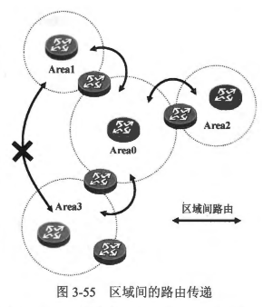 
  - ABR 从非骨干区域收到的Type-3LSA 不能用于区域间路由的计算。
    - OSPF 对 ABR 有着严苛的要求，区域间路由传递的关键点在于 ABR 对 Type-3 LSA 的处理。OSPF 规定，ABR 在使用 Type-3 LSA 计算区域间的路由时，只会使用其在 Area 0 内所收到的 Type-3 LSA 进行计算，而从非骨干区域内收到的 Type-3 LSA 是不会用于路由计算的。这样可以有效地避免环路的发生。在 图3-56 中，R4 作为一台 ABR，它会将描述到达 Area 0 及 Area 1 内各网段路由的Type-3 LSA注入到 Area 2 中，由于 R3 在 Area 2中与 R4 建立了邻接关系，因此它能够在 Area 2 中收到这些 Type-3 LSA 并且使用这些 LSA 来计算区域间路由。
    - 然而，如果R3 与R2在 Area0 中建立起邻接关系（如图 3-57 所示），那么此时 R3 便成为了一台 ABR。现在对于 R3 而言，虽然它会将其在 Area 2 内收到的 Type-3 LSA 存储在自己的 LSDB 中，但是并不会用这些 LSA 计算区域间的路由。它只可以使用自己在 Area 0 内收到的 Type-3 LSA 进行区域间路由计算。因此最终对于 R3 而言，无论收到的流量是访问 Area 0 内各网段的，又或是访问 Area 1 中的 1.1.1.0/24 网段的，都将其送往 R2,再由 R2 将流量转发出去。
    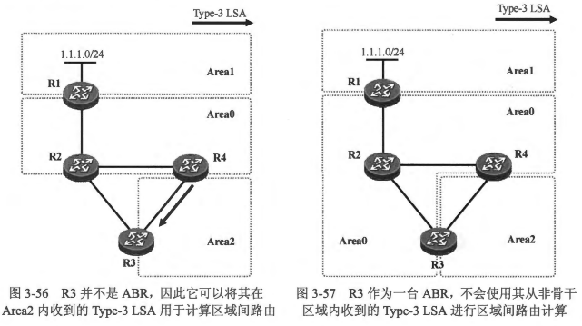
    这里有一个有意思的细节，就是如果 R3 连接 R2 的接口虽然激活了 OSPF（而且属于 Area 0)，但是不与 R2 形成邻接关系（例如 R2 的接口不激活 OSPF)，那么此时 R3 其实并不算是严格意义上的 ABR（虽然它产生的 Type-1 LSA 中B比特位会被设置为 1，但是它在 Area 0 中并没有全毗邻的邻居)，因此它可以将自己在 Area 2 内收到的 Type-3 LSA 用于区域间路由计算，所以在 R3 的路由表中能看到区域间路由 1.1.1.0/24（下一跳为 R4)。但是一旦 R2 与 R3 之间的邻接关系建立起来，R3 將不能再使用 R4 注入的 Type-3 LSA 计算路由，所以此时 R3 路由表中 1.1.1.0/24 路由的下一跳切换为 R2，而且即使这条路径的 Cost 要比从 R4 走更大（例如将 R3 连接R2 的接口 Cost 调节成一个非常大的值)，R3也始终不会从R4到达 1.1.1.0/24。
  - ABR 只能将自己到达所连接区域的区域内部路由注入骨千区域(区域间路由则不被允许），另外，可以将其到达所连接区域的区域内部路由及到达其他区域的区域间路由注入非骨干区域。
    - 在图 3-57 中，R3 会在 Area 2 中发现 Type-1 LSA（可能还会有Type-2 LSA)，R3 可以根据这些 LSA 计算出到达 Area 2 的区域内路由，根据本条规则，R3 作为 ABR，会将描述这些区域内部路由的 Type-3 LSA 注入 Area 0。除此之外，R3 也会在 Arca2 中收到ABR R4 向该区域注入的 Type-3 LSA（用于描述到达 Area0 及 Areal 内网段的区域间路由），此时，R2 不能够使用这些 Type-3 LSA 进行区域间路由计算，更不能再将描述这些路由的Type-3 LSA 注入 Area0（本条规则的前半句话)。这样可以有效的防止区域间路由被倒灌回 Area 0。
    - 另一方面，R3 会在 Area 0 内发现Type-1 LSA(可能还会有 Type-2 LSA），也会收到描述区域间路由的Type-3 LSA，R3 可以使用这些 LSA 计算到达 Area 0 内各网段的区域内部路由，以及到达 Area 1 内各网段的区域间路由，并且可以将描达这些路由的 Type-3 LSA 注入非骨干区域----Area2（本条规则的后半句）。
  - ABR 不会将描述到达某个区域内网段路由的Type-了 LSA 再注入回该区域。
    - 实际上，OSPF 区域间路由的传递行为，很有点距离矢量路由协议的味道。以图 3-58 为例，在 Area 1 中，R1 及 R2 都会产生 Typc-1（可能还会有 Type-2 LSA)，两台路由器都能够根据这些 LSA 计算出区域内路由，而 R2 作为 ABR 还担负着另一个责任，就是向 Area 0 通告到达 Area 1 的区域间路由，实际上它是向 Area 0 中注入用于描述到达 Area 1 内各个网段的区域间路由的Type-3 LSA，而这些 Type-3 LSA 是不会被发回 Area 1 的一类似距离矢量路由协议的水平分割规则。接下来 R3 利用这些 Type-3 LSA 计算出到达 Area 1 内各个网段的区域间路由，并且为 Area 2 注入新的 Type-3 LSA 用于描述它们，而这些 Type-3 LSA 同样的不会被注入回 Area 0。
    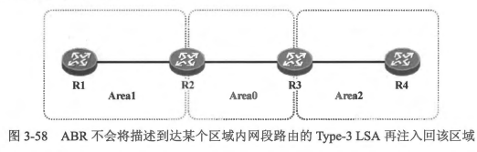 
  - Type-3 LSA 还设计了 Down-Bit（一个特殊的比特位），用于在 MPLS VPN环境下进行路由防环。
- 外部路由的防环
  - 当一台 OSPF 路由器将外部路由引入 OSPF 域后，被引入的外部路由以 Type-5 LSA 在整个 OSPF 域内泛洪。一台路由器使用Type-5 LSA 计算出路由有两个前提，其一是要收到 Type-5 LSA，其二是要知道如何到达产生这个 Type-5 LSA 的 ASBR。与ASBR 接入同一个区域的路由器能够根据该区域内泛洪的 Typc-l、Type-2 LSA 计算出到达该 ASBR 的最短路径，从而计算出外部路由。而其他区域的路由器就没有这么幸运了，因为 ASBR 产生的 Type-1 LSA 只能在其所在的区域内泛洪，所以才需要 Type-4 LSA。 因此其他区城的路由器在收到 Iype-4 LSA 后便能计算出到达 ASBR 的最优路径，进而利用该ASBR产生的Type-5 LSA 计算外部路由。Type-5 LSA 将会被泛洪到整个 OSPF 域，表面上看，它本身并不具有什么防环的能力，但是实际上，它并不需要，因为它可以依赖Type-1 LSA、Type-2 LSA 及Type-4 LSA 来实现防环。
  - 另外，Type-5 LSA 中的“Route Tag” 字段被用于在 MPLS VPN 环境下外部路由的防环。

<br>
<br>

### 3.3.7 OSPF 路由类型及优先级
- 到目前为止，我们已经知道 OSPF 路由包含以下几种类型，它们的优先级按如下顾序排列：
  - 区域内路由 (Intra Area Route): 区域内路由指的是路由器根据区域内泛洪的 Type-1、Type2 LSA 计算得到的路由，使用这些路由，路由器可以到达其直连区域内的网段。
  - 区域问路由 (Inter Area Route): 区域间路由指的是路由器根据 Type-3 LSA 计算得到的路由，使用这些路由，路由器可以到达其他区域的网段。
  - Type1 外部路由(Metric-Iype-1 External Route): 此处Type1 外部路由指的是路由器根据 Type-5 LSA (Metric-Typc-1）计算出的外部路由。
  - Type2 外部路由(Metric-Iype-2 External Route): 此处Type2外部路由指的是路由器根据 Type-5 LSA (Metric-Type-2）计算出的外部路由。
- 以区城内路由与区域间路由为例，当关于同一个日的网段，某合路由器发现了一条区域内路由可以到达，此外还有一条区域间路由可以到达，那么无论这两条路由的度量值如何，该路由器都将始終优选前者，它将前面这条路由加载到路由表中使用，直到该路由失效，区域间路由才会被使用。